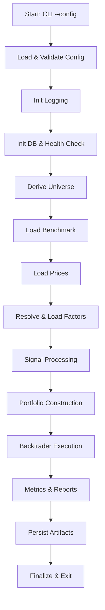

# AIS v1 设计（Spec v3）— 自然语言→IR/DSL→构建→执行→结果IR（中文）

最近更新：2025-10-31（America/New_York）

本版为“顶层重构版”，以“三大契约（IR/DSL、GEDD、结果IR）+ 三层分工（解析/构建/运行）+ 策略包强制化”为核心。
变更摘要：
- IR 快照与版本（ir_version）必须落盘；新增“澄清问题模板 + 阻断/默认策略表”。
- GEDD 增加升级为 verified 的人工标准与 EARS；明确 PIT 非前视（as‑of 仅取当日及之前最近记录，预测最小滞后）。
- Backtest I/O 契约新增 `alignment_used/fx_policy` 与顺延日志格式；统一“成交价不含滑点，费用单列记录”。
- 结果 IR 的分桶/流动性/暴露/稳定性四类诊断升级为“默认必须键（可为空对象）”。
- 策略包从建议升级为强制交付形态，绑定 entry points 与基线验收；Core 禁止托管策略实现/文档。

## 概述（Overview）

本设计严格对齐 `docs/AIS v1 architech.txt` 与《需求说明》（`.claude/specs/ais-v1/requirements.md`）。目标：
1) 自然语言→IR/DSL→构建→执行→结果IR 的端到端、可复现流水线；
2) 执行后端（回测/IB）与组合/风控可插拔，策略只依赖白名单 API；
3) 策略治理用单表 `strategy_meta`（行版本化），产物命名/清单/日志/DB 追溯统一；
4) 策略以“可移植包”交付，Core 禁止托管策略实现与人读说明。
- 因子与策略的版本治理（`factor_meta`、`factor_value`、策略按行版本化的 `strategy_meta`）。
- 全流程自动化：配置 -> 数据准备/对齐 -> 策略执行（ExecutionBackend：回测=Backtrader）-> 产物与报告。
- 结构化日志（JSON Lines，分类与轮转）、事务化与参数化 SQL、manifest 记录以实现可追溯与完全复现。

【本版设计要点】
- 暖启动：在 `pricing_service.load_prices` 增加 `lookback_days` 参数；编排器读取 `data.lookback`，按需扩展加载窗口，并在进入引擎前将 `px/weights` 裁剪回主时间窗。
- 调仓日契约下沉：权重与调仓日程构建器返回 `(weights, rebalance_dates)`，引擎仅消费显式 `rebal_dates`；预留事件驱动扩展（止盈止损/风控事件）。
- HK 样本过滤：Universe 优先按 `exchange_short_name`（HKSE/HK%）过滤，region=hk 无交易所时回退 country。
- 审计报告：新增审计服务，汇总并输出 `runs/<run_id>/audit_report.json`（月度/季度调仓日、当期可交易标的规模、持仓覆盖率（按策略定义）、换手率、佣金/滑点 bps 分布与异常提示）。

已确认范围与默认
- 样本空间：默认使用 AiScend DB 全部可用标的（包含 ADR/ETF/非美股）；可在配置中过滤。
- 风控：v1 不纳入单票/行业上限等约束（留待后续版本）。
- 因子存储：`factor_value` 为权威来源，v1 直接读取。
- 指标基线：对齐常用开源指标口径（CAGR、Vol、Sharpe、MaxDD、WinRate、Trades、Turnover）。
- 默认（可改）：基准=SPY（`ticker_price`），成本模型=固定佣金 bps + 固定滑点 bps。

【策略插件示例：indmoment oversea（季度）】
- Universe：download=true 且 `exchange_short_name` ∉ {SHH/SSE/SHZ/SZ/SZSE/SHE/HK/HKSE/SEHK/HKEX}；按价格覆盖与区间活跃交集。
- 调仓：季度最后交易日（覆盖率阈值 0.6），节假日顺延；显式调仓日传递到引擎。
- 行业：预筛 `elig_count≥3`（个股满足 mcap_usd>2B & adv3m_usd>10M），再过滤行业 `R_1m<10%`，对 `R_3_1/R_6_1` 各取 Top5 并集（>10 时按 `rank_sum→R_6_1→cap_sum` 截至 10）。
- 个股：行业内过滤 `r_1m<15% & mcap_usd>2B & adv3m_usd>10M`；在每个入选行业内按评分规则与参数选取若干标的，并按 `rank_sum→r_6_1→mcap` 等规则排序（允许不足）。
- 执行价：优先 `amount_usd/volume`，缺失回退 `(O+H+L+C)/4×currency_convert_usd`。
- 数据口径：`adv3m_usd=AVG(amount_usd)`（近 100 自然日）；`mkt_cap_usd` 优先 `f_valuation_multiple` 最近值，回退 `ticker_price` 当日值。

不在 v1 范围
- 实盘交易、日内/高频、分布式编排、Web/UI、复杂风险模型。

## 架构（Architecture）

单一实验配置驱动的确定性流水线：
配置 -> 校验 -> 日志初始化 -> DB 健康检查 -> 样本空间 -> 基准/价格 -> 因子 -> 对齐 -> 信号/权重 -> 执行 -> 指标 -> 产物。

模块（`src/` 下）：
- `core/orchestrator.py`：顶层编排与阶段控制。
- `utils/config_loader.py`：加载 YAML/JSON、计算哈希、JSONSchema 校验、默认值应用。
- `utils/logging_setup.py`：JSON 结构化日志、按日/按大小轮转、run_id 关联。
- `utils/db.py`：连接池、事务、重试、表/列健康检查、参数化 SQL。
- `services/universe_service.py`：推导默认“全量”或应用过滤条件。
- `services/pricing_service.py`：自 `ticker_price` 分块读取与交易日历对齐。
- `services/factor_service.py`：解析 `factor_meta`、读取 `factor_value`、覆盖/对齐统计。
- `services/backtest_engine.py`：Backtrader 集成（回测 ExecutionBackend 实现）。
- `services/strategy_registry.py`：策略注册/读取（按行版本化的 `strategy_meta`），解析 `factors_used` 依赖并为 manifest 提供摘要。
- `services/execution_backends/*`（规划）：`backtest_sim.py`、`ib_broker.py`（ib_insync）。
- `services/portfolio_combiner.py`（规划）：多策略权重合成与约束投影。
- `services/risk_engine.py`（规划）：集中风控配置解析与多层规则应用；写入 `strategy_risk_signal/risk_breach`。
- `services/metrics_service.py`：核心指标与报告输出。
- `utils/io_artifacts.py`：原子化写入、产物结构校验、成功标记。
- `models/*`：配置/manifest/factor_meta/strategy_meta 等数据模型。

【自然语言解析与策略构建（NL Orchestrator + Strategy Builder）】
- NL Orchestrator（解析层）
  - 输入：自然语言策略描述；输出：策略 IR/DSL + 最少澄清问题清单。
  - 职责：语义抽取（投资目标/Universe/频率/信号与变换/约束/执行/成本/诊断）、GEDD 引用校验、PIT 风险提示、资源预算预估（样本×窗口）。
  - 边界：不得直连 DB 或执行；仅生成 IR 与问题清单。
- Strategy Builder（构建层）
  - 输入：IR/DSL；输出：config.yaml + 最小插件骨架 + 人读策略说明镜像。
  - 职责：将 IR 的字段一一映射到配置与插件接口（Strategy API），确保“契约先于实现”；
  - 约束：仅使用白名单 Providers 与公共模型；禁止裸 SQL/外部 IO；渲染产物须与 IR 参数一致。

说明：本节定义边界与契约，不强制在 v1 实现完整解析器；但所有运行均应以 IR 为权威输入来源。

【新增】全局可执行数据字典（GEDD）模块
- `utils/dictionary_loader.py`：从 `docs/aiscend_database_dictionary.md` 解析 fenced YAML 机读区块，生成运行期注册表（datasets/factors）。
- `utils/dictionary_health.py`：对声明的数据集执行 DB 实查（表/列存在性；MVP），输出 `dictionary.health` 日志与健康报告。
- Resolver（内嵌于 orchestrator）：按“verified→proposed→生成提案”的优先级为 Providers 解析数据集依赖与口径。生产路径仅允许 `verified`；`status` 只能人工更改，程序不得自动升级。

【新增】插件化总体设计（Core/Plugin 边界）
- Core 仅提供：流程编排、标准接口（Strategy/Providers/Artifacts）、日志与审计、DB 事务与追溯、产物与清单；禁止将具体策略逻辑保存在 Core 内。
- 策略以“插件包”形态分发与注册：通过 Python entry points 组 `ais.strategies` 暴露 `load(params)->Strategy`；运行时由 Core 装载执行。
- 兼容策略：Core 仅放行与自身 `api_version` 兼容、状态为 `Approved` 的插件版本。

【顶层架构示意（Mermaid）】
```mermaid
flowchart TB
  A[自然语言策略] --> B(NL Orchestrator\n语义抽取/澄清)
  B --> C[策略 IR/DSL]
  C --> D(Strategy Builder\nIR→配置/插件骨架)
  D --> E{AIS Core Orchestrator}
  E --> F[Providers\n(价格/因子/基准)]
  E --> G[RiskEngine]
  E --> H[PortfolioCombiner]
  E --> I[Backtest ExecutionBackend\n(Backtrader)]
  I --> J[(结果 IR/产物/DB/日志)]
  subgraph Data Contracts
    K[GEDD\n数据契约]
  end
  C --- K
  F --- K
```

## 详细执行流设计（Detailed Execution Flow Design）

本节为实施“唯一真源”。代码变动必须与本节一致；如有调整需同步更新设计版本。

0) 自然语言与 IR 注入（如启用解析/构建）
- 解析层输出 IR（含澄清问题与默认值）；
- Builder 渲染配置与最小插件骨架；
- 失败：缺关键信息→阻断；存在默认值→在 IR/manifest 标注。

1) 启动与入参
- 入参：`--config <path>`、可选 `--run-id` 与覆盖项（如 `data.start_date`）。
- 若缺失 `run_id`，生成 `YYYYMMDD_HHMMSS_<short-hash>`。
- 日志（INFO）：启动、配置路径与 SHA256、run_id、用户/环境标签。

2) 配置加载与校验
- 加载 YAML/JSON；使用 `config/ais_v1.schema.json` 校验。
- 默认：universe=AiScend 全量；benchmark=SPY；logging=INFO；costs=固定 bps。
- 失败即（ERROR）退出并给出可操作报告；（DEBUG）记录脱敏后的有效配置。

2.5) 加载全局数据字典（GEDD）— 新增
- 从 `docs/aiscend_database_dictionary.md` 解析注册表 registry；记录 `dictionary.loaded`（entries、commit、path）。
- 对 `price.daily_usd@v1` 执行最小健康检查：`ticker_price` 表存在与关键列存在（`adj_close`,`amount_usd`,`volume`,`currency_convert_usd`,`mkt_cap_usd`）。
- 失败 → `dictionary.health_failed`（ERROR）并退出；成功 → `dictionary.health`（INFO）。
- 验证 `status`：生产/正式回测仅允许 `verified`；若 `status != verified` 则报错退出（除非设置 `AIS_ALLOW_PROPOSED=1` 进入影子模式）。
- 将 `dictionary_commit` 与 `datasets_used/factors_used` 预填至运行上下文与 manifest。

2.8) 策略 IR/DSL 注入（如启用 NL/Builder）— 新增
- 若启用解析与构建，则在进入“配置加载与校验”前生成 IR；否则从现有配置中加载等价 IR。
- 将 IR 快照与版本（ir_version）写入运行上下文；后续所有步骤仅消费 IR 或其渲染配置。

3) 日志初始化
- JSON Lines 字段：`timestamp`、`level`、`component`、`run_id`、`stage`、`message`、`duration_ms`、`rows_in/out` 等。
- 输出端：控制台（开发）+ 按日轮转文件（默认保留 ≥14 天）；按类别输出：`backtest.log`、`trading.log`、`performance.log`；路径 `runs/<run_id>/logs/`。

4) 数据库初始化
- 从 `AISCEND_DB_URL` 或 AiScend 预设加载配置；禁止日志泄露密钥。
- 创建连接池与连通性测试；健康检查（至少 `ticker_price`、`factor_meta`、`factor_value` 与需要的 `f_*` 表/列）。
- 所有读写置于事务；对瞬时错误使用指数退避重试。
- 日志：连接池规模（INFO）、健康摘要（INFO）、缺失可选表（WARN）。

5) 推导样本空间（Universe）
- 缺省取日期区间内“全部可用标的”（含 ADR/ETF/非美股），数据源 `company_base`/`ticker_price`；
- 可按交易所/行业/国家/市值/TopN 等过滤。
- 日志（INFO）：过滤前/后数量与示例代码。

6) 加载基准（可选）
- 缺省从 `ticker_price` 读取 SPY（`adj_close` 或 `close_usd` 可选），计算日收益；
- 可禁用：当 `data.benchmark` 缺失/为 `null`/为空字符串，或设置 `benchmark.enabled=false` 时，跳过本步骤与超额/IR/TE 相关计算；仅计算绝对指标；结果 IR 的 `perf` 中不包含超额/IR/TE 字段；`manifest.benchmark` 记为 `null`；
- 若指定具体基准（如 `SPY`、自定义指数），则加载并对齐，计算超额/IR/TE；
- 日志（INFO）：覆盖与日期范围；（WARN）：缺失日期与处理策略（丢弃或前向填充）。

7) 加载价格
- 按日期分区与样本空间分块读取 `ticker_price`（最小列集：date、ticker、`adj_close|close_usd`、必要时 volume）；
- 对齐交易日历，控制内存预算，记录分块耗时与行数；
- 日志（DEBUG）：分块耗时；（INFO）：覆盖统计。
 - 强制以 registry 的 `semantics.price_field` 为准；若配置与之不一致，记录（WARN）`dictionary.policy_mismatch`，并以字典口径覆盖配置（文档权威）。
 - 将对齐与汇率策略固化到 manifest：`alignment_used`、`fx_policy`；当与默认策略不一致时，WARN 并在结果 IR.exec 中同步记录。

8) 解析与加载因子
- 由 `factor_meta` 将配置因子解析到“精确版本”（禁止歧义），manifest 记录 `parameters` 与 `version`；
- 自 `factor_value` 按 `factor_id`、时间与样本空间读取（索引/分区+分块）；
- 与价格/样本空间对齐，输出覆盖与对齐损失；
- 日志（INFO）：覆盖率与丢弃计数；（WARN）：显著缺口与建议。

9) 信号处理（可选）
- 支持 z‑score、winsorize、归一化；所有参数写入 manifest；
- 日志（DEBUG）：变换参数与影响数据量。

-10) 组合构建
- 策略插件（v1 基线示例）：
  - 示例策略请参考“策略插件示例”章节，核心系统不预设通用参数（如 top_k），所有参数以各策略设计文档为准。
- 调仓频率与执行时点（收盘/开盘/次日开盘）可配置；采用 Backtrader “cheat‑on‑open” 假设时需在 manifest 标注；
- 日志（INFO）：调仓日期、目标持仓/构成摘要（如前N持仓；按策略定义）、换手率估计。

-11) 执行仿真（Backtrader）
- 由策略插件产出目标权重与调仓日，回测 ExecutionBackend（Backtrader）在调仓日下达目标权重订单；
- 执行价格口径（默认）：优先使用 `amount_usd/volume` 作为“全日 VWAP”近似；若缺失，使用 `(O+H+L+C)/4 × currency_convert_usd` 作为 TWAP 近似；manifest 必须标注 `backtest_price_proxy`。
- 成本：固定佣金（bps）与固定滑点（bps）对成交生效；统一采用“成交价不含滑点，费用单列记录并用于绩效扣减”的唯一口径；
- 将目标权重换算为下单数量并撮合，计入费用与滑点；
- 日志：`trading.log` 记录订单/成交/持仓，`backtest.log` 汇总期别成交与成本与执行口径。

12) 指标与报告
- 计算核心指标（CAGR、Vol、Sharpe、MaxDD、WinRate、Trades、Turnover）；
- 输出 `perf_report.json`（机器可读）与 `perf_report.txt`（人工可读），可选绘图/HTML 报告；
- 日志（INFO）：指标摘要与生成耗时。

12.5) 诊断与可比性（结果 IR 的诊断节点，默认必须键）
- 分桶表现：按“估值分位（或核心信号）”10 等分，输出层间差与 IC；
- 流动性：ADV 占比（p50/p95/MAX），大额成交越界统计；
- 暴露与中性化残差：行业/国家暴露与中性化残差摘要；
- 稳定性：profiles（train/validate/perturb）箱线图统计；
- 以上作为 `results_ir.diagnostics` 的默认键（可为空对象），允许显式关闭（manifest 必须记录原因），并保持 schema 稳定、增量扩展。

13) 产物落地与校验
- `runs/<run_id>/` 至少包含：`config.yaml`（运行副本）、`manifest.json`、`equity_curve.csv`、`trades.csv`、`perf_report.json|txt`、`logs/`（`backtest.log`、`trading.log`、`performance.log`）；
- 校验：非空、长度/日期对齐、列完备；通过则写入 success 标记；
- 日志（INFO）：文件路径与校验和；（ERROR）任何校验失败即退出。

14) 收尾
- 日志（INFO）：完成状态与运行目录；所有强制产物存在且校验通过才以 0 退出。

决策点与分支
- 配置无效 -> 终止并输出校验报告；
- 过滤后样本为空 -> 终止并提示调整过滤条件；
- 覆盖缺口策略（丢弃/前填）需显式配置并记录；
- 成本开关 -> 关闭时以 0 佣金/滑点运行并在 manifest 记录为 0。

错误处理路径
- DB 错误：回滚并有限次重试；最终失败（ERROR）退出；
- 数值异常（NaN/Inf）：隔离并按策略处理（WARN/终止）；
- 产物写入失败：临时文件+重命名的原子写失败则（ERROR）退出。

日志点与级别
- 各步骤记录开始/结束与 `duration_ms`（DEBUG）；每步概要（INFO）；异常（WARN）；致命失败（ERROR）。
- 全部日志为 JSON Lines；按日轮转；建议分类文件输出。

性能监控
- 记录阶段耗时；可选内存快照；长循环按固定步长输出进度；
- 在 `perf_report.json` 中给出“性能摘要”段。

## 插件接口与 Providers（API v1）

【Strategy 接口】
- `plan(context) -> StrategyPlan`（可选）：声明/校验依赖与输入需求（如 `price_field`,`alignment`），可提前失败。
- `compute(context, providers) -> StrategyOutput`：产出 `weights: DataFrame`、`rebal_dates: list[Timestamp]`、`diagnostics: dict`、`artifacts: list[ArtifactSpec]`。

【StrategyContext（只读）】
- `run_id`、`date_range(start,end)`、`universe`、`calendar`、`engine_config`、`costs`、`rebalance`、`price_field`、`logging_adapter`。

【Providers】
- PriceProvider：`load(field, tickers, start, end, lookback)`；支持 `adj_close|close_usd`；统一 `alignment=drop|ffill|asof`。
- FactorProvider：`resolve(specs)`、`load(ids,tickers,start,end)`；材料化写入仅对白名单因子放行且幂等。
- BenchmarkProvider：输出与组合对齐的基准序列与统计口径。

【Artifacts 约定】
- 插件可写“非强制”产物（图表/HTML/中间诊断）；路径写入 `StrategyOutput.artifacts` 供 manifest/DB 建索引。

【StrategyOutput 扩展：内部风控】
- `risk_signals: List[RiskSignal]`：策略内部风控事件（止盈/止损/追踪止损/波动率/事件）。
- `weights_after_risk: DataFrame`：应用内部风控后的目标权重；若缺失则由 Core 以 `weights` 代用。
- RiskSignal 结构与约束见“需求 §19.3”。

## 产物命名与清单（Manifest）

- 目录规则：`runs/<YYYYMMDD_HHMMSS>__<strategy_slug>__<short-hash>/`；`strategy_slug` 小写短横线，源自注册名或包名。
- 文件规则：`equity_curve__<strategy_slug>.csv`、`trades__<strategy_slug>.csv`、`perf_report__<strategy_slug>.json`、`audit_report__<strategy_slug>.json`；日志置于 `logs/`。
- 必须字段：
  - 策略：`strategy_slug/plugin_package/plugin_version/entrypoint`
  - 版本：`git_commit/code_version/run_dir_name`
  - 数据：`dictionary_commit/datasets_used/factors_used`
  - 执行：`execution_timing/backtest_price_proxy/costs_bps/alignment_used/fx_policy`
  - 诊断开关：`diagnostics_enabled`（如关闭须附 `disable_reason`）
  - IR 元信息：`ir_version` 与（可选）`ir_snapshot_path`
  - 风控摘要（可选）：`risk_profile/risk_signal_count/hard_action_count/freeze_days`

---

## 策略 IR/DSL — 权威契约（中文）

目的
- 将“策略即数据+规则”的契约前置并稳定化。所有自然语言输入必须首先落地为本 IR；后续构建/执行组件仅消费 IR。

范围与不变项
- 禁止前视（PIT）：IR 所引用的一切数据集均需能通过 GEDD（全局可执行数据字典）解析，生产运行仅允许 `status=verified` 条目。
- 执行假设单一真源：调仓、执行时点、成本模型、目标权重→订单映射均在 IR/执行契约中唯一声明。
- IR 需版本化与可追溯：每次运行保存 IR 快照与哈希到 `manifest.json` 与数据库。

Schema（v1，精简示例）
```yaml
ir_version: v1
meta:
  name: <策略名称>
  owner: <负责人或团队>
  version: <语义化版本>
  description: <一句话描述>
frequency: [daily|weekly|monthly|quarterly]
universe:
  selector: <表达式或预设画像>
  filters:
    - key: <字段或因子>
      op: [>=|<=|==|in|not_in]
      value: <标量或列表>
signals:
  - id: <信号ID>
    type: [factor|feature|rule]
    source: <factor_id@version | dataset_id@version | expr>
    params: {k: v}
    transforms:                 # 可选
      - [zscore|winsorize|rank|neutralize]
combination:
  mode: [linear|rank_composite|ml_model]
  weights: {<signal_id>: <float>}
  neutralize: [none|industry|country|market]
constraints:
  hard: {max_weight: 0.05, turnover_cap: 0.8}
  soft: {sector_caps: {Tech: 0.35}}
rebalance:
  schedule: [EOM|EOQ|custom_dates]
  execution_timing: [close|next_open|open]
costs:
  commission_bps: 5
  slippage_bps: 10
diagnostics:
  buckets: [{by: valuation.percentile@v1, bins: 10}]
  liquidity: {adv_window_days: 63, adv_share_max: 0.1}
gedd_ref:
  datasets: [price.daily_usd@v1, valuation.mktcap_asof_usd@v1]
  factors:  [factor.indmom_3_1@v1]
```

运行期映射
- Strategy Builder 依据 IR 渲染出 config.yaml 与最小策略插件骨架（如需），参数一一对应。
- Orchestrator 在运行目录与数据库持久化 IR 快照与版本；manifest 必含 `ir_version`（可选记录 `ir_snapshot_path`）。
- 策略插件不得绕过 IR/配置进行外部 I/O。

EARS（最小验收）
- 当生成 IR 时，必须包含 `ir_version` 并持久化 IR 快照；`ir_version` 需写入 manifest/DB/结果 IR。
- 当 IR 引用到数据集/因子时，必须能在 GEDD 解析到相应条目；生产模式仅允许 `status=verified`。
- IR 可选字段 `providers_allowlist` 指明可访问 Provider 能力，运行期应拦截未在白名单内的 IO 行为。

命名对齐说明
- 规范统一称 GEDD（Global Executable Data Dictionary）。早期文档中的 “ADC” 可视为实现别名；对外规格与 manifest 统一使用 GEDD。

## 回测 I/O 契约 — 输入与执行假设（中文）

输入（必需）
- 价格：`price.daily_usd@v1`，字段含 [`adj_close`, `volume`, `amount_usd`, `currency_convert_usd`]；按 GEDD 语义进行 PIT 与交易日历对齐。
- 目标权重：以 `date` 为索引（仅含调仓日），列为 ticker，取值范围 [-1, 1]；缺失视为 0。
- 调仓日程：list[Timestamp]；引擎仅在这些日期提交订单。
- 配置：`execution_timing ∈ {close, open, next_open}`；`backtest_price_proxy ∈ {vwap_full_day, ohlc_mean_fx}`；`costs`（佣金/滑点 bps）。

执行映射
- `target_weights → orders`：按执行日 D 的账户权益与 `execution_timing` 口径换算订单；确保重试幂等。
- 价格代理：优先 `amount_usd/volume`（vwap_full_day）；回退 `(O+H+L+C)/4 × currency_convert_usd`（ohlc_mean_fx）。所选代理必须写入 manifest。
- 成本仅作用于成交；若关闭则强制记录为 0，并写入 manifest。

校验门禁
- `weights` 中所有 ticker 必须在同日 universe 内；否则丢弃并 WARN。
- 调仓日无有效价格时，顺延至下一交易日并记录调整日志。

## 结果 IR 架构 — 可比、可机读输出（中文）

顶层容器（JSON 示意）
```json
{
  "schema": "ais.results.v1",
  "run": {
    "run_id": "20251031_153012__indmoment-oversea__a1b2c3",
    "strategy": {"name": "indmoment_oversea", "version": "1.0.0"},
    "ir": {"version": "v1"},
    "gedd": {"commit": "<git-sha>", "datasets_used": [...], "factors_used": [...]},
    "exec": {"timing": "next_open", "price_proxy": "vwap_full_day", "costs_bps": {"commission": 5, "slippage": 10}}
  },
  "equity": {"path": "equity_curve__<slug>.csv", "records": null},
  "trades": {"path": "trades__<slug>.csv", "fields": ["date","ticker","side","qty","price","commission","slippage"]},
  "perf": {
    "cagr": 0.12, "vol": 0.18, "sharpe": 0.67,
    "maxdd": -0.23, "win_rate": 0.54, "trades": 1250, "turnover": 1.8
  },
  "audit": {
    "rebalance_by_month": {"2024-03": 31, "2024-06": 27},
    "constraints_hit": {"hard": 3, "soft": 12},
    "fees_bps": {"mean": 8.2, "p95": 15.3},
    "exposures_residual": {"industry": {"Tech": 0.18}},
    "liquidity": {"adv_share_p95": 0.06}
  },
  "diagnostics": {
    "buckets": [{"by": "valuation.percentile@v1", "bins": 10, "ic": 0.06}],
    "stability": {"profiles": ["train","validate","perturb"], "boxplot_stats": {}}
  },
  "logs": {"paths": ["logs/backtest.log","logs/trading.log","logs/performance.log"]}
}
```

说明
- 为避免重复，可省略 `equity.records`，以 CSV 为权威。所有文件应生成校验和（checksum），并在数据库建立索引项（如适用）。
- `audit` 区保持“可扩展但 schema 稳定”的原则；新增字段必须为增量添加，不能破坏兼容性。

## 策略包 — 解耦与可移植（中文）

目标（强制）
- 每个策略必须以“可移植包”形态交付：包含人读文档、IR、配置、插件、基线产物与测试。AIS Core 仅承载系统级规格与 GEDD 参考，不存放具体策略文档。

建议目录
```
<strategy-pack-root>/
  docs/                  # 策略人读说明
  specs/                 # IR/DSL 与 profiles
  src/<pkg>/plugin.py    # 策略插件，实现 Strategy API；禁止裸 SQL/外部 IO
  configs/               # 由 IR 渲染的配置预设
  reports/               # 基线产物
  tests/                 # 单元/集成测试
```

装载（强制）
- 使用 Python entry point 组 `ais.strategies` 暴露 `load(params) -> Strategy`；Core 仅通过 entry points 发现策略包。
- 仅可使用白名单 Providers；除文档化的产物外，禁止任意外部网络/文件 IO（运行时守卫拦截违规）。

验收（EARS）
- 当安装策略包时，应能发现 entry point 并加载 `load(params)`；
- 当运行策略包样例配置时，结果应与 `reports/` 基线在容差内一致；
- 当写入 manifest/DB 时，应记录 `plugin_package/plugin_version/entrypoint` 与 `ir_version/ir_sha256`；
- Core 禁止托管策略实现与文档（强制规则）。

## 黄金路径与达标标准（中文）

黄金路径
1) 自然语言 → 策略 IR（必要澄清问题）
2) IR → 配置 + 插件骨架（Strategy Builder）
3) Orchestrator 按显式 `rebalance_dates` 执行
4) 引擎按声明的 `execution_timing` 与价格代理仿真
5) 以“结果 IR + 产物 + manifest + DB”统一落地
6) 通过稳定 schema 的诊断实现跨策略可比

达标标准
- 同一 IR/DSL 在固定随机种子/版本下应产生字节级可复现结果。
- 每次运行可追溯至 GEDD 提交、因子版本、执行假设与配置哈希。
- 策略包应“开箱即用”：IR→基线→测试完整可评审与迁移。


## 生命周期与质量门禁

- 生命周期：`Developing → Simulating → Approved → Deprecated → Retired`；生产仅允许 `Approved`。
- 质量门禁：
  - 覆盖率：单测≥80% 覆盖关键逻辑；
  - 一致性：固定样例在净值/交易/费用上与基线对齐；
  - 审计：调仓日程、目标权重 topN、候选/过滤统计、费用 bps 分布、异常提示、内部风控事件与权重影响统计；
  - 资源：最长运行时长/CPU/内存限额；禁网默认关闭（白名单可开）。

【新增】安全与影子运行（Safety & Shadow Mode）
- 生产路径仅允许 GEDD `status=verified` 条目；`status` 只能人工编辑，程序不得自动升级；
- 设置 `AIS_ALLOW_PROPOSED=1` 时进入影子运行：允许 `proposed` 条目，但禁止写入生产表，manifest 必显式记录 `shadow_mode: true` 与风险提示；
- 执行契约偏离（例如价格代理/执行时点临时修改）必须在 manifest 中记录，并在日志以 WARN 提示；
- 任何“绕过 IR/配置”的外部 IO 均视为违规，应由策略加载器拒绝并记录 ERROR。

## 数据访问与多市场对齐（当前阶段）

- 读取来源：统一直接从 aiscend 读取（只读）；Provider 在读取后执行口径统一（price_field）、对齐策略（alignment）与近似（必要时）并在 manifest 标注。
- 价格字段：`data.price_field in {adj_close, close_usd}`；量纲（volume/amount/mkt_cap_usd）直接来源于 aiscend 对应列；
- 对齐策略：`data.alignment=drop|ffill|asof`；默认“各自日历计算→回对齐”。
- 基准：`BenchmarkProvider` 输出并与组合严格对齐；指标可支持超额、IR、TE（按需）。

## GEDD（全局可执行数据字典）与 PIT 非前视硬约束

原则
- 唯一真源：运行只承认 GEDD 中声明的 dataset/factor（生产仅 verified）。
- 人工门禁：`status=verified` 仅能人工在文档中设定；程序不得自动升级状态。

升级为 verified 的最小标准（EARS）
- as‑of/lag：明确 `as_of` 与 `lag_days_min`；as‑of 查询必须使用“只取当日及之前的最近记录”（例如 `WHERE calculation_date <= as_of ORDER BY calculation_date DESC LIMIT 1`）。
- 窗口/分组域：对分位/横截面类口径，明确窗口长度（如 5y）、是否含当期、分组域（全市场/行业内）与行业字段来源。
- 质量检查：必须给出 required_fields 与覆盖率阈值；DB 健康检查通过。

执行期约束（强制）
- 生产模式拒绝 `status!=verified`；影子运行（`AIS_ALLOW_PROPOSED=1`）允许使用 proposed，但禁止写入生产表，并在 manifest 标注 `shadow_mode: true` 与风险提示。

## 策略内部风控设计（Detailed）

时序位置
- 在“生成基础权重（scores→weights）”之后、“执行前”；由 RiskEngine 统一编排，与账户级/组合级风控同一框架内合并执行。

处理流程（每个调仓日）
1) 计算触发条件：收益阈值（累计/从成本/回撤）、波动率阈值（N 日年化/单日跳变）、事件窗口（财报/停牌/敏感日）、追踪止损等。
2) 生成 RiskSignal 列表：包含 type/params/action/hard 等；同一标的多条规则时按优先级合并。
3) 生成 `weights_after_risk`：对 `weights` 应用合并后的指令（close/reduce_to/cap_to/freeze）。
4) 记录日志：`risk.signal`（逐条）、`risk.apply`（权重前后统计与摘要）。
5) 审计产物：将 RiskSignal 序列并入审计报告或输出 `risk_events__<strategy_slug>.csv`。

冲突与优先级
- 规则来源优先级：全局硬 > 策略硬 > 全局软 > 策略软；同层以 `priority` 数值决定顺序；结果取更保守。
- 内部 vs 组合/账户级风控：以更保守的结果为准（更小权重/更接近 0）。

配置约定（集中配置为主，策略覆盖为辅）
- `risk_profile` 可在全局配置的 `risk.layers.strategies[].rules` 中声明；策略端若仍需自带阈值，仅作为覆盖层声明，不嵌入代码：
  - `sl`: { pct_from_cost: 0.08 }
  - `tp`: { levels: [{gain:0.15, action:"reduce_to", target:0.5}, {gain:0.30, action:"close"}] }
  - `trailing_sl`: { window: 60, trail: 0.10 }
  - `vol`: { window: 20, ann_vol_max: 0.40, jump_max: 0.08, cooling_days: 3 }
  - `event`: { earnings_avoid_days: 2, halt_blacklist: true }

## 风控引擎（RiskEngine）架构与接口

职责
- 统一加载风控配置（多层覆盖），合并策略内部风控输出；在 pre/in/post 阶段执行规则，产出最终执行权重与审计记录。

接口（示意）
- `apply_strategy_layer(weights, risk_signals, risk_profile) -> weights_s`：按策略层规则与信号调整权重。
- `combine_strategies(outputs[], capital_policy) -> account_target`：见 PortfolioCombiner。
- `apply_portfolio_layer(account_target, risk_profile) -> weights_p`：组合/账户层约束（单票/行业/国家上限、换手/名义/速率等）。
- `emit_audit(run_id, rules_applied, risk_events)`：写 `risk_breach/strategy_risk_signal` 与摘要。

数据流
strategy(weights) → RiskEngine(strategy-layer) → combine → RiskEngine(portfolio/account-layer) → execution backend

## 执行后端与组合器接口（仅声明）

ExecutionBackend（抽象）
```
initialize(context) -> None
sync_account() -> AccountState
target_to_orders(target: AccountTargetWeights, policy: OrderPolicy) -> list[OrderIntent]
submit(intents: list[OrderIntent]) -> list[BrokerOrderId]
poll_fills(since: Optional[datetime]) -> list[Fill]
reconcile() -> ExecutionReport
cancel_open_orders(filter: CancelFilter) -> int
heartbeat() -> None
```

PortfolioCombiner（抽象）
```
combine(outputs: dict[str, StrategyOutput],
        capital_policy: CapitalPolicy,
        constraints: ConstraintSet) -> AccountTargetWeights
```

说明
- 此处仅声明接口形态与输入/输出结构，不提供实现；实现阶段需满足幂等、可恢复、可审计、与风险合并的要求。

ExecutionReport 附加字段（建议）
```
class ExecutionReport:
    orders: list[OrderIntent]
    submitted: list[str]
    fills: list[Fill]
    rejects: list[dict]
    metrics: dict                 # 成交率、平均偏离、费用等
    execution_policy: dict        # {type: 'TWAP'|'VWAP', window: '09:35-10:35', slices?: int}
```

## 策略插件示例 — indmoment oversea（季度）

插件元信息
- 包名：`ais-strategy-indmoment-oversea-qtr`
- 入口：`ais_strategy_indmoment_oversea_qtr:load`
- api_version：v1；status：Approved（示例）

参数 Schema（示意）
```json
{
  "$schema": "https://json-schema.org/draft/2020-12/schema",
  "type": "object",
  "properties": {
    "ind_top_n": {"type": "integer", "minimum": 1, "default": 5},
    "tkr_top_n_per_industry": {"type": "integer", "minimum": 1, "default": 5},
    "overall_max": {"type": "integer", "minimum": 1, "default": 25},
    "ind_1m_cap": {"type": "number", "default": 0.10},
    "beta": {"type": "number", "default": 0.5},
    "skip_industries": {"type": "array", "items": {"type": "string"}, "default": ["Shell Companies"]},
    "min_mcap_usd": {"type": "number", "default": 2000000000},
    "min_adv3m_usd": {"type": "number", "default": 10000000}
  },
  "additionalProperties": false
}
```

示例配置（回测/实盘通用，实盘仅切换 execution 后端与账户字段）
```yaml
experiment: { name: oversea-qtr-mom, owner: alice }
data:
  start_date: 2015-01-01
  end_date: 2024-12-31
  price_field: adj_close
  alignment: asof
  universe: { region: oversea, download_only: true }
  benchmark: SPY
rebalance: { frequency: quarterly, execution_timing: open }
signals: []
strategy:
  plugin: ais-strategy-indmoment-oversea-qtr
  version: "1.2.0"
  params:
    ind_top_n: 5
    tkr_top_n_per_industry: 5
    overall_max: 25
    ind_1m_cap: 0.10
    beta: 0.5
    skip_industries: ["Shell Companies"]
    min_mcap_usd: 2000000000
    min_adv3m_usd: 10000000
costs: { commission_bps: 5, slippage_bps: 5 }
output: { base_dir: runs/, keep_days: 14 }
logging: { level: INFO, sinks: [console, file] }
risk:
  engine: { enabled: true }
  layers:
    strategies:
      - match: { strategy_name: indmoment-oversea-qtr }
        rules:
          - id: trailing_sl
            scope: strategy
            type: trailing_sl
            params: { window: 60, trail: 0.10 }
            severity: soft
            priority: 20
```

执行流要点（与通用流一致）
- Universe：oversea（排除 CN/HK 别名）；
- 调仓：季度末最后交易日（覆盖率阈值）；
- 行业先行并集：R_3_1/R_6_1 各取 Top5 并集（>10 时以 rank_sum→R_6_1→cap_sum 截止 10）；
- 个股筛选：行业内过滤（r_1m<15%、mcap/adv3m 阈值），取每行业前 K；
- 权重：等权，前推；
- 执行价：优先 amount_usd/volume 的均价；缺失回退 (O+H+L+C)/4×currency_convert_usd；
- 风控：可启用 trailing_sl/事件回避等内部风控，由 RiskEngine 合并执行。


## 组件与接口（Components and Interfaces）

- 配置模式（`config/ais_v1.schema.json`）
  - 段落：`experiment`、`data`、`factors`、`signals`、`strategy`、`costs`、`rebalance`、`risk`、`output`、`logging`；
  - 定义必须字段、默认值与取值约束；对因子引用与策略插件标识/版本做合法性限制（`strategy.plugin/version/params`）。

- 数据库工具（`src/utils/db.py`）
  - 连接池与上下文事务；
  - `execute_query(sql, params, fetch)`、`execute_many(...)`（全部参数化）；
  - 表/列存在性检查与脱敏诊断输出（不含密钥/原始值）。

- 样本空间服务（`src/services/universe_service.py`）
  - `derive_universe(cfg) -> List[str]`：返回默认全量或过滤后的代码清单。

- 价格服务（`src/services/pricing_service.py`）
  - `load_prices(tickers, start, end, fields) -> DataFrame`：自 `ticker_price` 分块读取；支持 `adj_close|close_usd`。

- 因子服务（`src/services/factor_service.py`）
  - `resolve_factors(specs) -> List[(factor_id, version)]`：查询 `factor_meta` 并去歧义；
  - `load_factor_values(ids, tickers, start, end) -> Panel`：读取 `factor_value` 并对齐至日历/样本；输出覆盖统计。

- 回测引擎（`src/services/backtest_engine.py`）
  - `run_backtest(prices, signals, cfg) -> (equity_curve, trades)`：作为回测 ExecutionBackend 的实现，驱动 Backtrader 根据目标权重在调仓日下单；接入佣金/滑点与执行时点（含 cheat‑on‑open）假设并在 manifest 标注。

- 指标服务（`src/services/metrics_service.py`）
  - `compute_metrics(equity_curve, benchmark) -> Dict[str, Any]`：计算指标并可选绘图/HTML 汇总。

- 产物 I/O（`src/utils/io_artifacts.py`）
  - 原子化 CSV/JSON 写入；manifest 生成与校验；成功标记。

## 数据模型（Data Models）

- FactorMeta（DB）：`factor_id`、`factor_name`（唯一）、`category`、`formula_description`、`parameters`（JSONB）、`applicable_universe`、`update_frequency`、`version`、`author`、`created_at`、`update_at`、`status`。
- FactorValue（DB）：`id`、`factor_id`、`date`、`asset_id`、`value`、`version`、`updated_at`（长表结构）。
- StrategyMeta（DB，按行版本化）：包含策略名称、version、类别/子类、频率/方向、状态、作者、描述/文档、插件字段（plugin_package/plugin_version/entrypoint/api_version）、参数快照 param_snapshot、因子依赖 factors_used、代码引用 code_ref、绩效摘要 perf_summary/报告路径、示例配置路径、时间戳等；以 `(strategy_name, version)` 唯一约束管理历史版本。
- RunManifest（文件）：`run_id`、配置哈希、代码提交、库版本、默认项、成本与执行时点假设、基准来源、因子/策略版本、产物清单。

## 目录结构（Directory Structure）

遵循 AGENTS.md 与 `docs/AIS v1 architech.txt` 的产物组织建议：

```
project-root/
├── .claude/specs/ais-v1/{requirements.md, design.md}
├── src/{core,models,services,utils}
├── config/{ais_v1.schema.json, logging.json}
├── tests/{unit, integration, fixtures}
├── logs/
├── scripts/
├── docs/
├── temp/
└── AGENTS.md

runs/
└── <run_id>/
    ├── config.yaml
    ├── manifest.json
    ├── equity_curve.csv
    ├── trades.csv
    ├── perf_report.json
    ├── perf_report.txt
    ├── logs/
    │   ├── backtest.log
    │   ├── trading.log
    │   └── performance.log
    └── report.html（可选）
```

## AGENTS.md 集成（AGENTS.md Integration）

- 遵循 Python 3.11+、类型标注、Black/Ruff、结构化 JSON 日志与轮转；
- 任何执行流变更需同步更新 `.claude/specs/*`；
- DB 凭据仅从环境变量读取；所有读写均使用事务与参数化 SQL。

## 日志架构（Logging Architecture）

- JSON Lines，ISO‑8601 时间戳；包含稳定 `component`（db、orchestrator、strategy、metrics、artifacts）与 `run_id`；记录关键 detail：universe size、价格天数与 lookback、调仓次数/首末日期、样例 `rebal_dates`、当期目标持仓摘要（如前N持仓；按策略定义）与换手率估计、成本模型（bps/执行时点/cheat-on-open）等，确保可审计。
- 级别：DEBUG/INFO/WARN/ERROR/FATAL；
- 轮转与保留：按日（可选按大小）轮转；默认 ≥14 天。

## 错误处理（Error Handling）

- 仅输出脱敏上下文；禁止输出密钥与带值原始 SQL；
- orchestrator 统一兜底，阶段内细化 try/except，DB 错误必回滚；
- 覆盖缺口与数值异常提供可配置策略（丢弃/前填；隔离/终止）。

## 测试策略（Testing Strategy）

- 单元测试：配置模式、日志初始化、DB 封装（mock）、因子解析、策略插件加载与参数校验、指标数学验证；
- 集成测试：事务或测试 schema 内的小样本回测；验证产物齐备且通过校验；
- 烟囱测试：短窗口+固定随机种子，指标范围稳定且可复现。

## 文档同步计划（Documentation Synchronization）

- `docs/CHANGELOG_EXEC_FLOW.md` 记录执行流变更与提交号；
- `manifest.json` 包含 `design_version` 与 `config_hash` 以实现端到端溯源；
- PR 检查项要求凡执行流变更，必须更新 `.claude/specs/ais-v1/*`。

## 流程示意（Mermaid）


