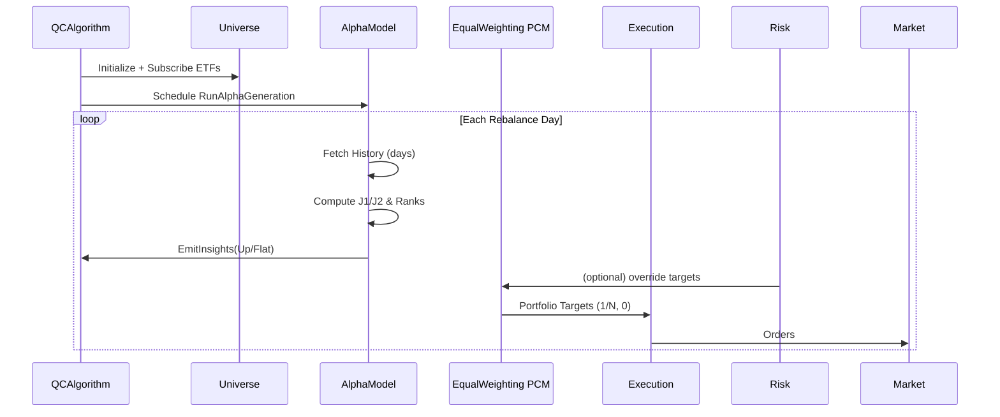

标题：QuantConnect Lean 行业动量 ETF 策略 — 设计文档（Design）

概览（Overview）
- 对齐声明：本设计与 `strategy/industry-momentum-lean/skills.md` 保持一致；若出现冲突，以 `skills.md` 为准。
- 目标：在 QuantConnect LEAN 上实现“行业动量 ETF（Select Sector SPDRs）”策略，按日粒度参数化 6–1/3–1 跳过月窗口并融合为平均名次；仅做多 Top‑N、等权、季度（可参数化为日）调仓；可选 VIX/组合波动阈值风控；支持优化（Grid/Euler）。
- 关键约束：严格避免前瞻；非调仓日节流；所有窗口/频率以“日”为单位；结构化日志与 JSON 产物；与 ais 数据库表的落库契约。
- 成果：一套可在 QC Cloud 或本地 Lean 环境运行的研究/回测算法，附带优化与产物输出规范。

架构（Architecture）
- 组件分层（LEAN 模式）：
  - Universe：ManualUniverseSelectionModel 固定订阅 XLC/XLY/XLP/XLE/XLF/XLV/XLI/XLB/XLRE/XLK/XLU。
  - Alpha：IndustryMomentumAlphaModel（自定义），在调度时段按日粒度 History 精确切片计算 J1/J2，做横截面平均名次并发出 Up/Flat Insights。
  - PortfolioConstruction：EqualWeightingPortfolioConstructionModel（等权），自动对 Up 分配 1/N，对非赢家 0。
  - Execution：ImmediateExecutionModel。
  - Risk（可选）：
    - VIXSwitchRisk：基于 CBOE:VIX 数据阈值的“开关”。
    - PortfolioVolatilitySwitchRisk：基于已实现波动阈值的组合清仓“开关”。
    - AbsMomentumFilter：基于绝对收益阈值（≤0 剔除）的择时过滤。
    - AssetVolFilter：基于标的年化波动阈值的候选过滤。
  - Scheduler：按 rebalance_frequency_days 触发 Alpha.Generate。
  - Metrics/Artifacts：回测 KPI 统计、调仓与排名快照、参数清单、日志 JSONL。

详细执行流设计（Detailed Execution Flow）
1 初始化（Initialize）
  - 1.1 读取参数（GetParameter；默认）：
    - j1_lookback_days=126, j2_lookback_days=63, skip_days=21, max_holdings=3,
      rebalance_frequency_days=90, buffer_days=30,
      enable_vix_switch=false, vix_threshold=null,
      enable_portfolio_vol_switch=false, portfolio_vol_threshold=null。
  - 1.2 设置基准 SPY、现金、开始/结束日期（建议含 2008–2009/2020/2022）。
  - 1.3 预热：SetWarmup(max(j1,j2)+skip+buffer_days)。
  - 1.4 Universe：ManualUniverseSelectionModel 订阅 11 只行业 ETF（缺失则 WARN 并剔除）。
  - 1.5 Portfolio/Execution/Risk：SetPortfolioConstruction(EqualWeighting)、SetExecution(Immediate)、按开关挂接 Risk。
  - 1.6 Scheduler：DateRules.EveryDay + TimeRules.AfterMarketOpen("SPY", 10)，调用 RunAlphaGeneration（节流）。
  - 1.7 Logging：输出 run_id、参数哈希、Universe 列表与 WarmUp 天数（DEBUG/INFO）。

2 日内调度（RunAlphaGeneration）
  - 2.1 若 IsWarmingUp 或当前时间 < next_rebalance_time：DEBUG 记录“skip_non_rebalance”，return。
  - 2.2 更新时间窗 next_rebalance_time = Time + rebalance_frequency_days。
  - 2.3 调用 IndustryMomentumAlphaModel.GenerateInsights()；如返回非空 list，EmitInsights。

3 Alpha 计算（IndustryMomentumAlphaModel.GenerateInsights）
  - 3.1 风控前置（可选）：
    - 若 enable_vix_switch=true 且当日 VIX > vix_threshold：INFO risk_switch:off（vix），return []。
    - 若 enable_abs_momentum_filter=true：对候选 ETF 计算 abs_lookback_days 的绝对收益，≤0 的剔除（INFO 记录数量）。
    - 若 enable_asset_vol_filter=true：计算 asset_vol_lookback_days 年化波动并与阈值比较，超阈者剔除（WARN 记录数量与阈值）。
  - 3.2 拉取历史（History(symbols, needed_days, Daily)）：
    - needed_days = skip_days + max(j1_lookback_days, j2_lookback_days) + 5。
    - 剔除当天未收盘记录以防前瞻。
  - 3.3 对每只 ETF：
    - p_end = close.iloc[-skip_days]
    - p_start_j1 = close.iloc[-(skip_days + j1_lookback_days)]
    - p_start_j2 = close.iloc[-(skip_days + j2_lookback_days)]
    - ret_j1 = (p_end - p_start_j1)/p_start_j1；ret_j2 同理；样本不足则记 WARN 并跳过。
  - 3.4 交叉排序：对 ret_j1、ret_j2 各自降序名次，final_rank = (rank_j1 + rank_j2)/2。
  - 3.5 选股：按 final_rank 升序取前 max_holdings 为 winners，余者为 others。
  - 3.6 生成 Insight：对 winners 发 Up(period=rebalance_frequency_days)，others 发 Flat。
  - 3.7 记录：输出名次表/赢家列表、耗时、排除列表（JSON）。

4 组合构建与执行
  - 4.1 EqualWeightingPCM 自动将 winners 目标权重设为 1/N，others 设为 0。
  - 4.2 ImmediateExecutionModel 执行目标；佣金/滑点按配置生效。
  - 4.3 若 enable_portfolio_vol_switch=true：在 Risk 模型中按已实现波动阈值判断，超阈返回清仓目标（或覆盖权重至 0），WARN 记录。

5 结束与产物
  - 5.1 KPI：导出 CAGR、Vol、Sharpe、MaxDD、（可选）换手率等。
  - 5.2 产物：参数清单、每次调仓排名与持仓快照、KPI 汇总、优化最优前 k（如本次为优化），均输出 JSON。
  - 5.2.1（可选）WFO：各窗口最优参数与 OOS KPI 拼接汇总、合成 OOS 曲线；窗口明细与总体摘要分文件存储。
  - 5.3 若启用 DB 对接：以 backtest_run/backtest_equity/backtest_trade/factor_value 对齐键名导出 JSON，供入库任务消费。

决策与分支（Decision Points）
- D1：enable_vix_switch? 是→若 VIX>阈值，暂停 Alpha；否→继续。
- D2：历史样本充足？否→剔除该 ETF 并 WARN；是→纳入排名。
- D3：winners 数 < max_holdings？是→对可用赢家等权，INFO 记录减持仓；否→正常 N 只。
- D4：enable_portfolio_vol_switch? 是→若组合波动>阈值则清仓；否→保持 PCM 输出。

日志架构（Logging Architecture）
- 格式：JSON 行（time, level, component, event, run_id, params_hash, details）。
- 关键事件：init, schedule_tick, history_fetch, calc_returns, rank_table, select_winners, emit_insights, risk_switch, metrics_done, artifacts_saved, data_insufficient。
- 级别：DEBUG（细节/耗时）、INFO（结果/开关决策）、WARN（样本不足/候选不足/写入重试）、ERROR/FATAL（异常）。
- 性能：对 History/排名/EmitInsights 记录毫秒级耗时，聚合输出。

组件与接口（Components & Interfaces）
- QCAlgorithm：
  - Initialize()：参数读取、Universe/PCM/Execution/Risk 配置、Scheduler 设置、WarmUp。
  - RunAlphaGeneration()：节流调度 Alpha。
- AlphaModel：IndustryMomentumAlphaModel
  - OnSecuritiesChanged()：维护 symbols 列表。
  - GenerateInsights()：核心计算（取代高频 Update）。
- RiskManagementModel（可选）：
  - VIXSwitchRisk：捕捉 Slice 中 VIX 数据，超阈屏蔽新目标。
  - PortfolioVolatilitySwitchRisk：基于组合已实现波动，超阈返回清仓目标。
- ArtifactsWriter：封装 QC ObjectStore 或本地写文件（JSON）。

数据模型（Data Models）
- 输入：Daily 历史收盘价（ETF），可选 CBOE:VIX。
- 中间：
  - ReturnsFrame：ret_j1/ret_j2（Series）；RankFrame：rank_j1/rank_j2/final_rank。
  - SelectionSnapshot：{date, available, excluded, winners, ranks}。
- 输出：
  - KPIs：{cagr, vol, sharpe, max_drawdown, win_rate, days}。
  - Backtest JSON：与 ais.backtest_* 对齐的 run/eq/trade；可选 factor_value（industry_momentum_rank）。

目录结构（Directory Structure）
```
AIS-v1/
├─ strategy/
│  └─ industry-momentum-lean/
│     ├─ AGENTS.md
│     ├─ papers/
│     ├─ configs/            # parameters/optimization 示例（Grid/Euler/WFO）
│     ├─ code/               # Lean 算法与模型源码（不在本阶段实现）
│     ├─ runs/               # 回测与优化产物(JSON/日志)
│     ├─ optimize/           # 优化作业记录
│     └─ reports/
├─ .claude/specs/industry-momentum-lean/
│  ├─ requirements.md
│  └─ design.md
└─ docs/
```

AGENTS.md 集成（AGENTS.md Integration）
- 已将根 AGENTS.md 复制到 `strategy/industry-momentum-lean/AGENTS.md`，用于子项目的代码风格、测试、日志与规范对齐。
- 设计要求：任何实现/测试/脚本变更均需同步更新 `.claude/specs/*` 与 CHANGELOG_EXEC_FLOW。

错误处理（Error Handling）
- 历史数据为空/不足：
  - WARN 并剔除该标的；若全部不足，返回空 insights 并 INFO 记录“空持仓”。
- ObjectStore/文件写失败：
  - 重试 3 次；失败则 ERROR 并在 run manifest 中标记失败原因。
- 计算异常：
  - 捕获异常，Error() 输出堆栈摘要与上下文（run_id/params），不中断其他标的计算。

测试策略（Testing Strategy）
- 单元：
  - 返回区间切片与跳过月窗口计算（以给定价序列校验 p_start/p_end 索引）。
  - 排名一致性：构造小型样本，验证平均名次与 Top‑N 选择稳定性。
- 集成：
  - 小窗回测（近 1 年）验证调度、非调仓日节流、产物输出与日志字段。
  - 风控开关测试：构造 VIX 超阈/未超阈、组合波动超阈/未超阈两类样例。
- 端到端（可选）：
  - 从 Initialize 到 EmitInsights/PCM/Execution 的完整链路烟囱测试。

文档同步计划（Documentation Synchronization Plan）
- 任何执行流或参数默认值变更 → 同步更新 `design.md` 与 `requirements.md`。
- 变更记录写入 `docs/CHANGELOG_EXEC_FLOW.md`，并在 run 产物 manifest 中包含 spec 版本哈希。

代码实现检查点（Implementation Checkpoints）
- C1 初始化参数与 WarmUp：日志包含参数与天数。
- C2 历史窗口切片：确认剔除当日数据与 p_start/p_end 定位。
- C3 排名/赢家选择：生成 rank 表与 winners 列表产物。
- C4 Insights 发射：winners=Up、others=Flat，周期=rebalance_frequency_days。
- C5 风控覆盖：VIX/组合波动开关在触发时生成覆盖日志与目标。
- C5.1 过滤覆盖：绝对动量与资产波动过滤的剔除数量、阈值与剩余候选写日志。
- C6 产物落地：KPIs 与快照 JSON 存储与清单生成。

版本控制与执行流跟踪（Version Control Integration）
- 在产物 manifest 中记录：git commit 哈希、spec 版本（requirements/design 的内容哈希）、参数哈希。
- 每次规范变更需在 `docs/CHANGELOG_EXEC_FLOW.md` 登记，确保“设计 → 实现 → 回测”一致。

（可选）Mermaid 时序图

