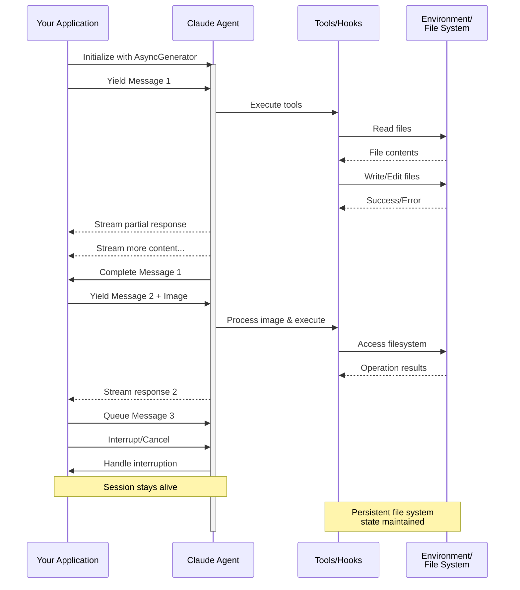

Agent Skills

Copy page

Agent Skills are modular capabilities that extend Claude's functionality. Each Skill packages instructions, metadata, and optional resources (scripts, templates) that Claude uses automatically when relevant.
Why use Skills
Skills are reusable, filesystem-based resources that provide Claude with domain-specific expertise: workflows, context, and best practices that transform general-purpose agents into specialists. Unlike prompts (conversation-level instructions for one-off tasks), Skills load on-demand and eliminate the need to repeatedly provide the same guidance across multiple conversations.

Key benefits:

Specialize Claude: Tailor capabilities for domain-specific tasks
Reduce repetition: Create once, use automatically
Compose capabilities: Combine Skills to build complex workflows
For a deep dive into the architecture and real-world applications of Agent Skills, read our engineering blog: Equipping agents for the real world with Agent Skills.

Using Skills
Anthropic provides pre-built Agent Skills for common document tasks (PowerPoint, Excel, Word, PDF), and you can create your own custom Skills. Both work the same way. Claude automatically uses them when relevant to your request.

Pre-built Agent Skills are available to all users on claude.ai and via the Claude API. See the Available Skills section below for the complete list.

Custom Skills let you package domain expertise and organizational knowledge. They're available across Claude's products: create them in Claude Code, upload them via the API, or add them in claude.ai settings.

Get started:

For pre-built Agent Skills: See the quickstart tutorial to start using PowerPoint, Excel, Word, and PDF skills in the API
For custom Skills: See the Agent Skills Cookbook to learn how to create your own Skills
How Skills work
Skills leverage Claude's VM environment to provide capabilities beyond what's possible with prompts alone. Claude operates in a virtual machine with filesystem access, allowing Skills to exist as directories containing instructions, executable code, and reference materials, organized like an onboarding guide you'd create for a new team member.

This filesystem-based architecture enables progressive disclosure: Claude loads information in stages as needed, rather than consuming context upfront.

Three types of Skill content, three levels of loading
Skills can contain three types of content, each loaded at different times:

Level 1: Metadata (always loaded)
Content type: Instructions. The Skill's YAML frontmatter provides discovery information:

---
name: pdf-processing
description: Extract text and tables from PDF files, fill forms, merge documents. Use when working with PDF files or when the user mentions PDFs, forms, or document extraction.
---
Claude loads this metadata at startup and includes it in the system prompt. This lightweight approach means you can install many Skills without context penalty; Claude only knows each Skill exists and when to use it.

Level 2: Instructions (loaded when triggered)
Content type: Instructions. The main body of SKILL.md contains procedural knowledge: workflows, best practices, and guidance:

# PDF Processing

## Quick start

Use pdfplumber to extract text from PDFs:

```python
import pdfplumber

with pdfplumber.open("document.pdf") as pdf:
    text = pdf.pages[0].extract_text()
```

For advanced form filling, see [FORMS.md](FORMS.md).
When you request something that matches a Skill's description, Claude reads SKILL.md from the filesystem via bash. Only then does this content enter the context window.

Level 3: Resources and code (loaded as needed)
Content types: Instructions, code, and resources. Skills can bundle additional materials:

pdf-skill/
├── SKILL.md (main instructions)
├── FORMS.md (form-filling guide)
├── REFERENCE.md (detailed API reference)
└── scripts/
    └── fill_form.py (utility script)
Instructions: Additional markdown files (FORMS.md, REFERENCE.md) containing specialized guidance and workflows

Code: Executable scripts (fill_form.py, validate.py) that Claude runs via bash; scripts provide deterministic operations without consuming context

Resources: Reference materials like database schemas, API documentation, templates, or examples

Claude accesses these files only when referenced. The filesystem model means each content type has different strengths: instructions for flexible guidance, code for reliability, resources for factual lookup.

Level	When Loaded	Token Cost	Content
Level 1: Metadata	Always (at startup)	~100 tokens per Skill	name and description from YAML frontmatter
Level 2: Instructions	When Skill is triggered	Under 5k tokens	SKILL.md body with instructions and guidance
Level 3+: Resources	As needed	Effectively unlimited	Bundled files executed via bash without loading contents into context
Progressive disclosure ensures only relevant content occupies the context window at any given time.

The Skills architecture
Skills run in a code execution environment where Claude has filesystem access, bash commands, and code execution capabilities. Think of it like this: Skills exist as directories on a virtual machine, and Claude interacts with them using the same bash commands you'd use to navigate files on your computer.

Agent Skills Architecture - showing how Skills integrate with the agent's configuration and virtual machine

How Claude accesses Skill content:

When a Skill is triggered, Claude uses bash to read SKILL.md from the filesystem, bringing its instructions into the context window. If those instructions reference other files (like FORMS.md or a database schema), Claude reads those files too using additional bash commands. When instructions mention executable scripts, Claude runs them via bash and receives only the output (the script code itself never enters context).

What this architecture enables:

On-demand file access: Claude reads only the files needed for each specific task. A Skill can include dozens of reference files, but if your task only needs the sales schema, Claude loads just that one file. The rest remain on the filesystem consuming zero tokens.

Efficient script execution: When Claude runs validate_form.py, the script's code never loads into the context window. Only the script's output (like "Validation passed" or specific error messages) consumes tokens. This makes scripts far more efficient than having Claude generate equivalent code on the fly.

No practical limit on bundled content: Because files don't consume context until accessed, Skills can include comprehensive API documentation, large datasets, extensive examples, or any reference materials you need. There's no context penalty for bundled content that isn't used.

This filesystem-based model is what makes progressive disclosure work. Claude navigates your Skill like you'd reference specific sections of an onboarding guide, accessing exactly what each task requires.

Example: Loading a PDF processing skill
Here's how Claude loads and uses a PDF processing skill:

Startup: System prompt includes: PDF Processing - Extract text and tables from PDF files, fill forms, merge documents
User request: "Extract the text from this PDF and summarize it"
Claude invokes: bash: read pdf-skill/SKILL.md → Instructions loaded into context
Claude determines: Form filling is not needed, so FORMS.md is not read
Claude executes: Uses instructions from SKILL.md to complete the task
Skills loading into context window - showing the progressive loading of skill metadata and content

The diagram shows:

Default state with system prompt and skill metadata pre-loaded
Claude triggers the skill by reading SKILL.md via bash
Claude optionally reads additional bundled files like FORMS.md as needed
Claude proceeds with the task
This dynamic loading ensures only relevant skill content occupies the context window.

Where Skills work
Skills are available across Claude's agent products:

Claude API
The Claude API supports both pre-built Agent Skills and custom Skills. Both work identically: specify the relevant skill_id in the container parameter along with the code execution tool.

Prerequisites: Using Skills via the API requires three beta headers:

code-execution-2025-08-25 - Skills run in the code execution container
skills-2025-10-02 - Enables Skills functionality
files-api-2025-04-14 - Required for uploading/downloading files to/from the container
Use pre-built Agent Skills by referencing their skill_id (e.g., pptx, xlsx), or create and upload your own via the Skills API (/v1/skills endpoints). Custom Skills are shared organization-wide.

To learn more, see Use Skills with the Claude API.

Claude Code
Claude Code supports only Custom Skills.

Custom Skills: Create Skills as directories with SKILL.md files. Claude discovers and uses them automatically.

Custom Skills in Claude Code are filesystem-based and don't require API uploads.

To learn more, see Use Skills in Claude Code.

Claude Agent SDK
The Claude Agent SDK supports custom Skills through filesystem-based configuration.

Custom Skills: Create Skills as directories with SKILL.md files in .claude/skills/. Enable Skills by including "Skill" in your allowed_tools configuration.

Skills in the Agent SDK are then automatically discovered when the SDK runs.

To learn more, see Agent Skills in the SDK.

Claude.ai
Claude.ai supports both pre-built Agent Skills and custom Skills.

Pre-built Agent Skills: These Skills are already working behind the scenes when you create documents. Claude uses them without requiring any setup.

Custom Skills: Upload your own Skills as zip files through Settings > Features. Available on Pro, Max, Team, and Enterprise plans with code execution enabled. Custom Skills are individual to each user; they are not shared organization-wide and cannot be centrally managed by admins.

To learn more about using Skills in Claude.ai, see the following resources in the Claude Help Center:

What are Skills?
Using Skills in Claude
How to create custom Skills
Teach Claude your way of working using Skills
Skill structure
Every Skill requires a SKILL.md file with YAML frontmatter:

---
name: your-skill-name
description: Brief description of what this Skill does and when to use it
---

# Your Skill Name

## Instructions
[Clear, step-by-step guidance for Claude to follow]

## Examples
[Concrete examples of using this Skill]
Required fields: name and description

Field requirements:

name:

Maximum 64 characters
Must contain only lowercase letters, numbers, and hyphens
Cannot contain XML tags
Cannot contain reserved words: "anthropic", "claude"
description:

Must be non-empty
Maximum 1024 characters
Cannot contain XML tags
The description should include both what the Skill does and when Claude should use it. For complete authoring guidance, see the best practices guide.

Security considerations
We strongly recommend using Skills only from trusted sources: those you created yourself or obtained from Anthropic. Skills provide Claude with new capabilities through instructions and code, and while this makes them powerful, it also means a malicious Skill can direct Claude to invoke tools or execute code in ways that don't match the Skill's stated purpose.

If you must use a Skill from an untrusted or unknown source, exercise extreme caution and thoroughly audit it before use. Depending on what access Claude has when executing the Skill, malicious Skills could lead to data exfiltration, unauthorized system access, or other security risks.

Key security considerations:

Audit thoroughly: Review all files bundled in the Skill: SKILL.md, scripts, images, and other resources. Look for unusual patterns like unexpected network calls, file access patterns, or operations that don't match the Skill's stated purpose
External sources are risky: Skills that fetch data from external URLs pose particular risk, as fetched content may contain malicious instructions. Even trustworthy Skills can be compromised if their external dependencies change over time
Tool misuse: Malicious Skills can invoke tools (file operations, bash commands, code execution) in harmful ways
Data exposure: Skills with access to sensitive data could be designed to leak information to external systems
Treat like installing software: Only use Skills from trusted sources. Be especially careful when integrating Skills into production systems with access to sensitive data or critical operations
Available Skills
Pre-built Agent Skills
The following pre-built Agent Skills are available for immediate use:

PowerPoint (pptx): Create presentations, edit slides, analyze presentation content
Excel (xlsx): Create spreadsheets, analyze data, generate reports with charts
Word (docx): Create documents, edit content, format text
PDF (pdf): Generate formatted PDF documents and reports
These Skills are available on the Claude API and claude.ai. See the quickstart tutorial to start using them in the API.

Custom Skills examples
For complete examples of custom Skills, see the Skills cookbook.

Limitations and constraints
Understanding these limitations helps you plan your Skills deployment effectively.

Cross-surface availability
Custom Skills do not sync across surfaces. Skills uploaded to one surface are not automatically available on others:

Skills uploaded to Claude.ai must be separately uploaded to the API
Skills uploaded via the API are not available on Claude.ai
Claude Code Skills are filesystem-based and separate from both Claude.ai and API
You'll need to manage and upload Skills separately for each surface where you want to use them.

Sharing scope
Skills have different sharing models depending on where you use them:

Claude.ai: Individual user only; each team member must upload separately
Claude API: Workspace-wide; all workspace members can access uploaded Skills
Claude Code: Personal (~/.claude/skills/) or project-based (.claude/skills/); can also be shared via Claude Code Plugins
Claude.ai does not currently support centralized admin management or org-wide distribution of custom Skills.

Runtime environment constraints
The exact runtime environment available to your skill depends on the product surface where you use it.

Claude.ai:
Varying network access: Depending on user/admin settings, Skills may have full, partial, or no network access. For more details, see the Create and Edit Files support article.
Claude API:
No network access: Skills cannot make external API calls or access the internet
No runtime package installation: Only pre-installed packages are available. You cannot install new packages during execution.
Pre-configured dependencies only: Check the code execution tool documentation for the list of available packages
Claude Code:
Full network access: Skills have the same network access as any other program on the user's computer
Global package installation discouraged: Skills should only install packages locally in order to avoid interfering with the user's computer
Plan your Skills to work within these constraints.

# Get started with Agent Skills in the API

Learn how to use Agent Skills to create documents with the Claude API in under 10 minutes.

---

This tutorial shows you how to use Agent Skills to create a PowerPoint presentation. You'll learn how to enable Skills, make a simple request, and access the generated file.

## Prerequisites

- [Anthropic API key](/settings/keys)
- Python 3.7+ or curl installed
- Basic familiarity with making API requests

## What are Agent Skills?

Pre-built Agent Skills extend Claude's capabilities with specialized expertise for tasks like creating documents, analyzing data, and processing files. Anthropic provides the following pre-built Agent Skills in the API:

- **PowerPoint (pptx)**: Create and edit presentations
- **Excel (xlsx)**: Create and analyze spreadsheets
- **Word (docx)**: Create and edit documents
- **PDF (pdf)**: Generate PDF documents

<Note>
**Want to create custom Skills?** See the [Agent Skills Cookbook](https://platform.claude.com/cookbook/skills-notebooks-01-skills-introduction) for examples of building your own Skills with domain-specific expertise.
</Note>

## Step 1: List available Skills

First, let's see what Skills are available. We'll use the Skills API to list all Anthropic-managed Skills:

<CodeGroup>
```python Python
import anthropic

client = anthropic.Anthropic()

# List Anthropic-managed Skills
skills = client.beta.skills.list(
    source="anthropic",
    betas=["skills-2025-10-02"]
)

for skill in skills.data:
    print(f"{skill.id}: {skill.display_title}")
```

```typescript TypeScript
import Anthropic from '@anthropic-ai/sdk';

const client = new Anthropic();

// List Anthropic-managed Skills
const skills = await client.beta.skills.list({
  source: 'anthropic',
  betas: ['skills-2025-10-02']
});

for (const skill of skills.data) {
  console.log(`${skill.id}: ${skill.display_title}`);
}
```

```bash Shell
curl "https://api.anthropic.com/v1/skills?source=anthropic" \
  -H "x-api-key: $ANTHROPIC_API_KEY" \
  -H "anthropic-version: 2023-06-01" \
  -H "anthropic-beta: skills-2025-10-02"
```
</CodeGroup>

You see the following Skills: `pptx`, `xlsx`, `docx`, and `pdf`.

This API returns each Skill's metadata: its name and description. Claude loads this metadata at startup to know what Skills are available. This is the first level of **progressive disclosure**, where Claude discovers Skills without loading their full instructions yet.

## Step 2: Create a presentation

Now we'll use the PowerPoint Skill to create a presentation about renewable energy. We specify Skills using the `container` parameter in the Messages API:

<CodeGroup>
```python Python
import anthropic

client = anthropic.Anthropic()

# Create a message with the PowerPoint Skill
response = client.beta.messages.create(
    model="claude-sonnet-4-5-20250929",
    max_tokens=4096,
    betas=["code-execution-2025-08-25", "skills-2025-10-02"],
    container={
        "skills": [
            {
                "type": "anthropic",
                "skill_id": "pptx",
                "version": "latest"
            }
        ]
    },
    messages=[{
        "role": "user",
        "content": "Create a presentation about renewable energy with 5 slides"
    }],
    tools=[{
        "type": "code_execution_20250825",
        "name": "code_execution"
    }]
)

print(response.content)
```

```typescript TypeScript
import Anthropic from '@anthropic-ai/sdk';

const client = new Anthropic();

// Create a message with the PowerPoint Skill
const response = await client.beta.messages.create({
  model: 'claude-sonnet-4-5-20250929',
  max_tokens: 4096,
  betas: ['code-execution-2025-08-25', 'skills-2025-10-02'],
  container: {
    skills: [
      {
        type: 'anthropic',
        skill_id: 'pptx',
        version: 'latest'
      }
    ]
  },
  messages: [{
    role: 'user',
    content: 'Create a presentation about renewable energy with 5 slides'
  }],
  tools: [{
    type: 'code_execution_20250825',
    name: 'code_execution'
  }]
});

console.log(response.content);
```

```bash Shell
curl https://api.anthropic.com/v1/messages \
  -H "x-api-key: $ANTHROPIC_API_KEY" \
  -H "anthropic-version: 2023-06-01" \
  -H "anthropic-beta: code-execution-2025-08-25,skills-2025-10-02" \
  -H "content-type: application/json" \
  -d '{
    "model": "claude-sonnet-4-5-20250929",
    "max_tokens": 4096,
    "container": {
      "skills": [
        {
          "type": "anthropic",
          "skill_id": "pptx",
          "version": "latest"
        }
      ]
    },
    "messages": [{
      "role": "user",
      "content": "Create a presentation about renewable energy with 5 slides"
    }],
    "tools": [{
      "type": "code_execution_20250825",
      "name": "code_execution"
    }]
  }'
```
</CodeGroup>

Let's break down what each part does:

- **`container.skills`**: Specifies which Skills Claude can use
- **`type: "anthropic"`**: Indicates this is an Anthropic-managed Skill
- **`skill_id: "pptx"`**: The PowerPoint Skill identifier
- **`version: "latest"`**: The Skill version set to the most recently published
- **`tools`**: Enables code execution (required for Skills)
- **Beta headers**: `code-execution-2025-08-25` and `skills-2025-10-02`

When you make this request, Claude automatically matches your task to the relevant Skill. Since you asked for a presentation, Claude determines the PowerPoint Skill is relevant and loads its full instructions: the second level of progressive disclosure. Then Claude executes the Skill's code to create your presentation.

## Step 3: Download the created file

The presentation was created in the code execution container and saved as a file. The response includes a file reference with a file ID. Extract the file ID and download it using the Files API:

<CodeGroup>
```python Python
# Extract file ID from response
file_id = None
for block in response.content:
    if block.type == 'tool_use' and block.name == 'code_execution':
        # File ID is in the tool result
        for result_block in block.content:
            if hasattr(result_block, 'file_id'):
                file_id = result_block.file_id
                break

if file_id:
    # Download the file
    file_content = client.beta.files.download(
        file_id=file_id,
        betas=["files-api-2025-04-14"]
    )

    # Save to disk
    with open("renewable_energy.pptx", "wb") as f:
        file_content.write_to_file(f.name)

    print(f"Presentation saved to renewable_energy.pptx")
```

```typescript TypeScript
// Extract file ID from response
let fileId: string | null = null;
for (const block of response.content) {
  if (block.type === 'tool_use' && block.name === 'code_execution') {
    // File ID is in the tool result
    for (const resultBlock of block.content) {
      if ('file_id' in resultBlock) {
        fileId = resultBlock.file_id;
        break;
      }
    }
  }
}

if (fileId) {
  // Download the file
  const fileContent = await client.beta.files.download(fileId, {
    betas: ['files-api-2025-04-14']
  });

  // Save to disk
  const fs = require('fs');
  fs.writeFileSync('renewable_energy.pptx', Buffer.from(await fileContent.arrayBuffer()));

  console.log('Presentation saved to renewable_energy.pptx');
}
```

```bash Shell
# Extract file_id from response (using jq)
FILE_ID=$(echo "$RESPONSE" | jq -r '.content[] | select(.type=="tool_use" and .name=="code_execution") | .content[] | select(.file_id) | .file_id')

# Download the file
curl "https://api.anthropic.com/v1/files/$FILE_ID/content" \
  -H "x-api-key: $ANTHROPIC_API_KEY" \
  -H "anthropic-version: 2023-06-01" \
  -H "anthropic-beta: files-api-2025-04-14" \
  --output renewable_energy.pptx

echo "Presentation saved to renewable_energy.pptx"
```
</CodeGroup>

<Note>
For complete details on working with generated files, see the [code execution tool documentation](/docs/en/agents-and-tools/tool-use/code-execution-tool#retrieve-generated-files).
</Note>

## Try more examples

Now that you've created your first document with Skills, try these variations:

### Create a spreadsheet

<CodeGroup>
```python Python
response = client.beta.messages.create(
    model="claude-sonnet-4-5-20250929",
    max_tokens=4096,
    betas=["code-execution-2025-08-25", "skills-2025-10-02"],
    container={
        "skills": [
            {
                "type": "anthropic",
                "skill_id": "xlsx",
                "version": "latest"
            }
        ]
    },
    messages=[{
        "role": "user",
        "content": "Create a quarterly sales tracking spreadsheet with sample data"
    }],
    tools=[{
        "type": "code_execution_20250825",
        "name": "code_execution"
    }]
)
```

```typescript TypeScript
const response = await client.beta.messages.create({
  model: 'claude-sonnet-4-5-20250929',
  max_tokens: 4096,
  betas: ['code-execution-2025-08-25', 'skills-2025-10-02'],
  container: {
    skills: [
      {
        type: 'anthropic',
        skill_id: 'xlsx',
        version: 'latest'
      }
    ]
  },
  messages: [{
    role: 'user',
    content: 'Create a quarterly sales tracking spreadsheet with sample data'
  }],
  tools: [{
    type: 'code_execution_20250825',
    name: 'code_execution'
  }]
});
```

```bash Shell
curl https://api.anthropic.com/v1/messages \
  -H "x-api-key: $ANTHROPIC_API_KEY" \
  -H "anthropic-version: 2023-06-01" \
  -H "anthropic-beta: code-execution-2025-08-25,skills-2025-10-02" \
  -H "content-type: application/json" \
  -d '{
    "model": "claude-sonnet-4-5-20250929",
    "max_tokens": 4096,
    "container": {
      "skills": [
        {
          "type": "anthropic",
          "skill_id": "xlsx",
          "version": "latest"
        }
      ]
    },
    "messages": [{
      "role": "user",
      "content": "Create a quarterly sales tracking spreadsheet with sample data"
    }],
    "tools": [{
      "type": "code_execution_20250825",
      "name": "code_execution"
    }]
  }'
```
</CodeGroup>

### Create a Word document

<CodeGroup>
```python Python
response = client.beta.messages.create(
    model="claude-sonnet-4-5-20250929",
    max_tokens=4096,
    betas=["code-execution-2025-08-25", "skills-2025-10-02"],
    container={
        "skills": [
            {
                "type": "anthropic",
                "skill_id": "docx",
                "version": "latest"
            }
        ]
    },
    messages=[{
        "role": "user",
        "content": "Write a 2-page report on the benefits of renewable energy"
    }],
    tools=[{
        "type": "code_execution_20250825",
        "name": "code_execution"
    }]
)
```

```typescript TypeScript
const response = await client.beta.messages.create({
  model: 'claude-sonnet-4-5-20250929',
  max_tokens: 4096,
  betas: ['code-execution-2025-08-25', 'skills-2025-10-02'],
  container: {
    skills: [
      {
        type: 'anthropic',
        skill_id: 'docx',
        version: 'latest'
      }
    ]
  },
  messages: [{
    role: 'user',
    content: 'Write a 2-page report on the benefits of renewable energy'
  }],
  tools: [{
    type: 'code_execution_20250825',
    name: 'code_execution'
  }]
});
```

```bash Shell
curl https://api.anthropic.com/v1/messages \
  -H "x-api-key: $ANTHROPIC_API_KEY" \
  -H "anthropic-version: 2023-06-01" \
  -H "anthropic-beta: code-execution-2025-08-25,skills-2025-10-02" \
  -H "content-type: application/json" \
  -d '{
    "model": "claude-sonnet-4-5-20250929",
    "max_tokens": 4096,
    "container": {
      "skills": [
        {
          "type": "anthropic",
          "skill_id": "docx",
          "version": "latest"
        }
      ]
    },
    "messages": [{
      "role": "user",
      "content": "Write a 2-page report on the benefits of renewable energy"
    }],
    "tools": [{
      "type": "code_execution_20250825",
      "name": "code_execution"
    }]
  }'
```
</CodeGroup>

### Generate a PDF

<CodeGroup>
```python Python
response = client.beta.messages.create(
    model="claude-sonnet-4-5-20250929",
    max_tokens=4096,
    betas=["code-execution-2025-08-25", "skills-2025-10-02"],
    container={
        "skills": [
            {
                "type": "anthropic",
                "skill_id": "pdf",
                "version": "latest"
            }
        ]
    },
    messages=[{
        "role": "user",
        "content": "Generate a PDF invoice template"
    }],
    tools=[{
        "type": "code_execution_20250825",
        "name": "code_execution"
    }]
)
```

```typescript TypeScript
const response = await client.beta.messages.create({
  model: 'claude-sonnet-4-5-20250929',
  max_tokens: 4096,
  betas: ['code-execution-2025-08-25', 'skills-2025-10-02'],
  container: {
    skills: [
      {
        type: 'anthropic',
        skill_id: 'pdf',
        version: 'latest'
      }
    ]
  },
  messages: [{
    role: 'user',
    content: 'Generate a PDF invoice template'
  }],
  tools: [{
    type: 'code_execution_20250825',
    name: 'code_execution'
  }]
});
```

```bash Shell
curl https://api.anthropic.com/v1/messages \
  -H "x-api-key: $ANTHROPIC_API_KEY" \
  -H "anthropic-version: 2023-06-01" \
  -H "anthropic-beta: code-execution-2025-08-25,skills-2025-10-02" \
  -H "content-type: application/json" \
  -d '{
    "model": "claude-sonnet-4-5-20250929",
    "max_tokens": 4096,
    "container": {
      "skills": [
        {
          "type": "anthropic",
          "skill_id": "pdf",
          "version": "latest"
        }
      ]
    },
    "messages": [{
      "role": "user",
      "content": "Generate a PDF invoice template"
    }],
    "tools": [{
      "type": "code_execution_20250825",
      "name": "code_execution"
    }]
  }'
```
</CodeGroup>

## Next steps

Now that you've used pre-built Agent Skills, you can:

<CardGroup cols={2}>
  <Card
    title="API Guide"
    icon="book"
    href="/docs/en/build-with-claude/skills-guide"
  >
    Use Skills with the Claude API
  </Card>
  <Card
    title="Create Custom Skills"
    icon="code"
    href="/docs/en/api/skills/create-skill"
  >
    Upload your own Skills for specialized tasks
  </Card>
  <Card
    title="Authoring Guide"
    icon="edit"
    href="/docs/en/agents-and-tools/agent-skills/best-practices"
  >
    Learn best practices for writing effective Skills
  </Card>
  <Card
    title="Use Skills in Claude Code"
    icon="terminal"
    href="https://code.claude.com/docs/en/skills"
  >
    Learn about Skills in Claude Code
  </Card>
  <Card
    title="Use Skills in the Agent SDK"
    icon="cube"
    href="/docs/en/agent-sdk/skills"
  >
    Use Skills programmatically in TypeScript and Python
  </Card>
  <Card
    title="Agent Skills Cookbook"
    icon="book"
    href="https://platform.claude.com/cookbook/skills-notebooks-01-skills-introduction"
  >
    Explore example Skills and implementation patterns
  </Card>
</CardGroup>
# Skill authoring best practices

Learn how to write effective Skills that Claude can discover and use successfully.

---

Good Skills are concise, well-structured, and tested with real usage. This guide provides practical authoring decisions to help you write Skills that Claude can discover and use effectively.

For conceptual background on how Skills work, see the [Skills overview](/docs/en/agents-and-tools/agent-skills/overview).

## Core principles

### Concise is key

The [context window](/docs/en/build-with-claude/context-windows) is a public good. Your Skill shares the context window with everything else Claude needs to know, including:
- The system prompt
- Conversation history
- Other Skills' metadata
- Your actual request

Not every token in your Skill has an immediate cost. At startup, only the metadata (name and description) from all Skills is pre-loaded. Claude reads SKILL.md only when the Skill becomes relevant, and reads additional files only as needed. However, being concise in SKILL.md still matters: once Claude loads it, every token competes with conversation history and other context.

**Default assumption**: Claude is already very smart

Only add context Claude doesn't already have. Challenge each piece of information:
- "Does Claude really need this explanation?"
- "Can I assume Claude knows this?"
- "Does this paragraph justify its token cost?"

**Good example: Concise** (approximately 50 tokens):
````markdown
## Extract PDF text

Use pdfplumber for text extraction:

```python
import pdfplumber

with pdfplumber.open("file.pdf") as pdf:
    text = pdf.pages[0].extract_text()
```
````

**Bad example: Too verbose** (approximately 150 tokens):
```markdown
## Extract PDF text

PDF (Portable Document Format) files are a common file format that contains
text, images, and other content. To extract text from a PDF, you'll need to
use a library. There are many libraries available for PDF processing, but we
recommend pdfplumber because it's easy to use and handles most cases well.
First, you'll need to install it using pip. Then you can use the code below...
```

The concise version assumes Claude knows what PDFs are and how libraries work.

### Set appropriate degrees of freedom

Match the level of specificity to the task's fragility and variability.

**High freedom** (text-based instructions):

Use when:
- Multiple approaches are valid
- Decisions depend on context
- Heuristics guide the approach

Example:
```markdown
## Code review process

1. Analyze the code structure and organization
2. Check for potential bugs or edge cases
3. Suggest improvements for readability and maintainability
4. Verify adherence to project conventions
```

**Medium freedom** (pseudocode or scripts with parameters):

Use when:
- A preferred pattern exists
- Some variation is acceptable
- Configuration affects behavior

Example:
````markdown
## Generate report

Use this template and customize as needed:

```python
def generate_report(data, format="markdown", include_charts=True):
    # Process data
    # Generate output in specified format
    # Optionally include visualizations
```
````

**Low freedom** (specific scripts, few or no parameters):

Use when:
- Operations are fragile and error-prone
- Consistency is critical
- A specific sequence must be followed

Example:
````markdown
## Database migration

Run exactly this script:

```bash
python scripts/migrate.py --verify --backup
```

Do not modify the command or add additional flags.
````

**Analogy**: Think of Claude as a robot exploring a path:
- **Narrow bridge with cliffs on both sides**: There's only one safe way forward. Provide specific guardrails and exact instructions (low freedom). Example: database migrations that must run in exact sequence.
- **Open field with no hazards**: Many paths lead to success. Give general direction and trust Claude to find the best route (high freedom). Example: code reviews where context determines the best approach.

### Test with all models you plan to use

Skills act as additions to models, so effectiveness depends on the underlying model. Test your Skill with all the models you plan to use it with.

**Testing considerations by model**:
- **Claude Haiku** (fast, economical): Does the Skill provide enough guidance?
- **Claude Sonnet** (balanced): Is the Skill clear and efficient?
- **Claude Opus** (powerful reasoning): Does the Skill avoid over-explaining?

What works perfectly for Opus might need more detail for Haiku. If you plan to use your Skill across multiple models, aim for instructions that work well with all of them.

## Skill structure

<Note>
**YAML Frontmatter**: The SKILL.md frontmatter requires two fields:

`name`:
- Maximum 64 characters
- Must contain only lowercase letters, numbers, and hyphens
- Cannot contain XML tags
- Cannot contain reserved words: "anthropic", "claude"

`description`:
- Must be non-empty
- Maximum 1024 characters
- Cannot contain XML tags
- Should describe what the Skill does and when to use it

For complete Skill structure details, see the [Skills overview](/docs/en/agents-and-tools/agent-skills/overview#skill-structure).
</Note>

### Naming conventions

Use consistent naming patterns to make Skills easier to reference and discuss. We recommend using **gerund form** (verb + -ing) for Skill names, as this clearly describes the activity or capability the Skill provides.

Remember that the `name` field must use lowercase letters, numbers, and hyphens only.

**Good naming examples (gerund form)**:
- `processing-pdfs`
- `analyzing-spreadsheets`
- `managing-databases`
- `testing-code`
- `writing-documentation`

**Acceptable alternatives**:
- Noun phrases: `pdf-processing`, `spreadsheet-analysis`
- Action-oriented: `process-pdfs`, `analyze-spreadsheets`

**Avoid**:
- Vague names: `helper`, `utils`, `tools`
- Overly generic: `documents`, `data`, `files`
- Reserved words: `anthropic-helper`, `claude-tools`
- Inconsistent patterns within your skill collection

Consistent naming makes it easier to:
- Reference Skills in documentation and conversations
- Understand what a Skill does at a glance
- Organize and search through multiple Skills
- Maintain a professional, cohesive skill library

### Writing effective descriptions

The `description` field enables Skill discovery and should include both what the Skill does and when to use it.

<Warning>
**Always write in third person**. The description is injected into the system prompt, and inconsistent point-of-view can cause discovery problems.

- **Good:** "Processes Excel files and generates reports"
- **Avoid:** "I can help you process Excel files"
- **Avoid:** "You can use this to process Excel files"
</Warning>

**Be specific and include key terms**. Include both what the Skill does and specific triggers/contexts for when to use it.

Each Skill has exactly one description field. The description is critical for skill selection: Claude uses it to choose the right Skill from potentially 100+ available Skills. Your description must provide enough detail for Claude to know when to select this Skill, while the rest of SKILL.md provides the implementation details.

Effective examples:

**PDF Processing skill:**
```yaml
description: Extract text and tables from PDF files, fill forms, merge documents. Use when working with PDF files or when the user mentions PDFs, forms, or document extraction.
```

**Excel Analysis skill:**
```yaml
description: Analyze Excel spreadsheets, create pivot tables, generate charts. Use when analyzing Excel files, spreadsheets, tabular data, or .xlsx files.
```

**Git Commit Helper skill:**
```yaml
description: Generate descriptive commit messages by analyzing git diffs. Use when the user asks for help writing commit messages or reviewing staged changes.
```

Avoid vague descriptions like these:

```yaml
description: Helps with documents
```
```yaml
description: Processes data
```
```yaml
description: Does stuff with files
```

### Progressive disclosure patterns

SKILL.md serves as an overview that points Claude to detailed materials as needed, like a table of contents in an onboarding guide. For an explanation of how progressive disclosure works, see [How Skills work](/docs/en/agents-and-tools/agent-skills/overview#how-skills-work) in the overview.

**Practical guidance:**
- Keep SKILL.md body under 500 lines for optimal performance
- Split content into separate files when approaching this limit
- Use the patterns below to organize instructions, code, and resources effectively

#### Visual overview: From simple to complex

A basic Skill starts with just a SKILL.md file containing metadata and instructions:


As your Skill grows, you can bundle additional content that Claude loads only when needed:


The complete Skill directory structure might look like this:

```
pdf/
├── SKILL.md              # Main instructions (loaded when triggered)
├── FORMS.md              # Form-filling guide (loaded as needed)
├── reference.md          # API reference (loaded as needed)
├── examples.md           # Usage examples (loaded as needed)
└── scripts/
    ├── analyze_form.py   # Utility script (executed, not loaded)
    ├── fill_form.py      # Form filling script
    └── validate.py       # Validation script
```

#### Pattern 1: High-level guide with references

````markdown
---
name: pdf-processing
description: Extracts text and tables from PDF files, fills forms, and merges documents. Use when working with PDF files or when the user mentions PDFs, forms, or document extraction.
---

# PDF Processing

## Quick start

Extract text with pdfplumber:
```python
import pdfplumber
with pdfplumber.open("file.pdf") as pdf:
    text = pdf.pages[0].extract_text()
```

## Advanced features

**Form filling**: See [FORMS.md](FORMS.md) for complete guide
**API reference**: See [REFERENCE.md](REFERENCE.md) for all methods
**Examples**: See [EXAMPLES.md](EXAMPLES.md) for common patterns
````

Claude loads FORMS.md, REFERENCE.md, or EXAMPLES.md only when needed.

#### Pattern 2: Domain-specific organization

For Skills with multiple domains, organize content by domain to avoid loading irrelevant context. When a user asks about sales metrics, Claude only needs to read sales-related schemas, not finance or marketing data. This keeps token usage low and context focused.

```
bigquery-skill/
├── SKILL.md (overview and navigation)
└── reference/
    ├── finance.md (revenue, billing metrics)
    ├── sales.md (opportunities, pipeline)
    ├── product.md (API usage, features)
    └── marketing.md (campaigns, attribution)
```

````markdown SKILL.md
# BigQuery Data Analysis

## Available datasets

**Finance**: Revenue, ARR, billing → See [reference/finance.md](reference/finance.md)
**Sales**: Opportunities, pipeline, accounts → See [reference/sales.md](reference/sales.md)
**Product**: API usage, features, adoption → See [reference/product.md](reference/product.md)
**Marketing**: Campaigns, attribution, email → See [reference/marketing.md](reference/marketing.md)

## Quick search

Find specific metrics using grep:

```bash
grep -i "revenue" reference/finance.md
grep -i "pipeline" reference/sales.md
grep -i "api usage" reference/product.md
```
````

#### Pattern 3: Conditional details

Show basic content, link to advanced content:

```markdown
# DOCX Processing

## Creating documents

Use docx-js for new documents. See [DOCX-JS.md](DOCX-JS.md).

## Editing documents

For simple edits, modify the XML directly.

**For tracked changes**: See [REDLINING.md](REDLINING.md)
**For OOXML details**: See [OOXML.md](OOXML.md)
```

Claude reads REDLINING.md or OOXML.md only when the user needs those features.

### Avoid deeply nested references

Claude may partially read files when they're referenced from other referenced files. When encountering nested references, Claude might use commands like `head -100` to preview content rather than reading entire files, resulting in incomplete information.

**Keep references one level deep from SKILL.md**. All reference files should link directly from SKILL.md to ensure Claude reads complete files when needed.

**Bad example: Too deep**:
```markdown
# SKILL.md
See [advanced.md](advanced.md)...

# advanced.md
See [details.md](details.md)...

# details.md
Here's the actual information...
```

**Good example: One level deep**:
```markdown
# SKILL.md

**Basic usage**: [instructions in SKILL.md]
**Advanced features**: See [advanced.md](advanced.md)
**API reference**: See [reference.md](reference.md)
**Examples**: See [examples.md](examples.md)
```

### Structure longer reference files with table of contents

For reference files longer than 100 lines, include a table of contents at the top. This ensures Claude can see the full scope of available information even when previewing with partial reads.

**Example**:
```markdown
# API Reference

## Contents
- Authentication and setup
- Core methods (create, read, update, delete)
- Advanced features (batch operations, webhooks)
- Error handling patterns
- Code examples

## Authentication and setup
...

## Core methods
...
```

Claude can then read the complete file or jump to specific sections as needed.

For details on how this filesystem-based architecture enables progressive disclosure, see the [Runtime environment](#runtime-environment) section in the Advanced section below.

## Workflows and feedback loops

### Use workflows for complex tasks

Break complex operations into clear, sequential steps. For particularly complex workflows, provide a checklist that Claude can copy into its response and check off as it progresses.

**Example 1: Research synthesis workflow** (for Skills without code):

````markdown
## Research synthesis workflow

Copy this checklist and track your progress:

```
Research Progress:
- [ ] Step 1: Read all source documents
- [ ] Step 2: Identify key themes
- [ ] Step 3: Cross-reference claims
- [ ] Step 4: Create structured summary
- [ ] Step 5: Verify citations
```

**Step 1: Read all source documents**

Review each document in the `sources/` directory. Note the main arguments and supporting evidence.

**Step 2: Identify key themes**

Look for patterns across sources. What themes appear repeatedly? Where do sources agree or disagree?

**Step 3: Cross-reference claims**

For each major claim, verify it appears in the source material. Note which source supports each point.

**Step 4: Create structured summary**

Organize findings by theme. Include:
- Main claim
- Supporting evidence from sources
- Conflicting viewpoints (if any)

**Step 5: Verify citations**

Check that every claim references the correct source document. If citations are incomplete, return to Step 3.
````

This example shows how workflows apply to analysis tasks that don't require code. The checklist pattern works for any complex, multi-step process.

**Example 2: PDF form filling workflow** (for Skills with code):

````markdown
## PDF form filling workflow

Copy this checklist and check off items as you complete them:

```
Task Progress:
- [ ] Step 1: Analyze the form (run analyze_form.py)
- [ ] Step 2: Create field mapping (edit fields.json)
- [ ] Step 3: Validate mapping (run validate_fields.py)
- [ ] Step 4: Fill the form (run fill_form.py)
- [ ] Step 5: Verify output (run verify_output.py)
```

**Step 1: Analyze the form**

Run: `python scripts/analyze_form.py input.pdf`

This extracts form fields and their locations, saving to `fields.json`.

**Step 2: Create field mapping**

Edit `fields.json` to add values for each field.

**Step 3: Validate mapping**

Run: `python scripts/validate_fields.py fields.json`

Fix any validation errors before continuing.

**Step 4: Fill the form**

Run: `python scripts/fill_form.py input.pdf fields.json output.pdf`

**Step 5: Verify output**

Run: `python scripts/verify_output.py output.pdf`

If verification fails, return to Step 2.
````

Clear steps prevent Claude from skipping critical validation. The checklist helps both Claude and you track progress through multi-step workflows.

### Implement feedback loops

**Common pattern**: Run validator → fix errors → repeat

This pattern greatly improves output quality.

**Example 1: Style guide compliance** (for Skills without code):

```markdown
## Content review process

1. Draft your content following the guidelines in STYLE_GUIDE.md
2. Review against the checklist:
   - Check terminology consistency
   - Verify examples follow the standard format
   - Confirm all required sections are present
3. If issues found:
   - Note each issue with specific section reference
   - Revise the content
   - Review the checklist again
4. Only proceed when all requirements are met
5. Finalize and save the document
```

This shows the validation loop pattern using reference documents instead of scripts. The "validator" is STYLE_GUIDE.md, and Claude performs the check by reading and comparing.

**Example 2: Document editing process** (for Skills with code):

```markdown
## Document editing process

1. Make your edits to `word/document.xml`
2. **Validate immediately**: `python ooxml/scripts/validate.py unpacked_dir/`
3. If validation fails:
   - Review the error message carefully
   - Fix the issues in the XML
   - Run validation again
4. **Only proceed when validation passes**
5. Rebuild: `python ooxml/scripts/pack.py unpacked_dir/ output.docx`
6. Test the output document
```

The validation loop catches errors early.

## Content guidelines

### Avoid time-sensitive information

Don't include information that will become outdated:

**Bad example: Time-sensitive** (will become wrong):
```markdown
If you're doing this before August 2025, use the old API.
After August 2025, use the new API.
```

**Good example** (use "old patterns" section):
```markdown
## Current method

Use the v2 API endpoint: `api.example.com/v2/messages`

## Old patterns

<details>
<summary>Legacy v1 API (deprecated 2025-08)</summary>

The v1 API used: `api.example.com/v1/messages`

This endpoint is no longer supported.
</details>
```

The old patterns section provides historical context without cluttering the main content.

### Use consistent terminology

Choose one term and use it throughout the Skill:

**Good - Consistent**:
- Always "API endpoint"
- Always "field"
- Always "extract"

**Bad - Inconsistent**:
- Mix "API endpoint", "URL", "API route", "path"
- Mix "field", "box", "element", "control"
- Mix "extract", "pull", "get", "retrieve"

Consistency helps Claude understand and follow instructions.

## Common patterns

### Template pattern

Provide templates for output format. Match the level of strictness to your needs.

**For strict requirements** (like API responses or data formats):

````markdown
## Report structure

ALWAYS use this exact template structure:

```markdown
# [Analysis Title]

## Executive summary
[One-paragraph overview of key findings]

## Key findings
- Finding 1 with supporting data
- Finding 2 with supporting data
- Finding 3 with supporting data

## Recommendations
1. Specific actionable recommendation
2. Specific actionable recommendation
```
````

**For flexible guidance** (when adaptation is useful):

````markdown
## Report structure

Here is a sensible default format, but use your best judgment based on the analysis:

```markdown
# [Analysis Title]

## Executive summary
[Overview]

## Key findings
[Adapt sections based on what you discover]

## Recommendations
[Tailor to the specific context]
```

Adjust sections as needed for the specific analysis type.
````

### Examples pattern

For Skills where output quality depends on seeing examples, provide input/output pairs just like in regular prompting:

````markdown
## Commit message format

Generate commit messages following these examples:

**Example 1:**
Input: Added user authentication with JWT tokens
Output:
```
feat(auth): implement JWT-based authentication

Add login endpoint and token validation middleware
```

**Example 2:**
Input: Fixed bug where dates displayed incorrectly in reports
Output:
```
fix(reports): correct date formatting in timezone conversion

Use UTC timestamps consistently across report generation
```

**Example 3:**
Input: Updated dependencies and refactored error handling
Output:
```
chore: update dependencies and refactor error handling

- Upgrade lodash to 4.17.21
- Standardize error response format across endpoints
```

Follow this style: type(scope): brief description, then detailed explanation.
````

Examples help Claude understand the desired style and level of detail more clearly than descriptions alone.

### Conditional workflow pattern

Guide Claude through decision points:

```markdown
## Document modification workflow

1. Determine the modification type:

   **Creating new content?** → Follow "Creation workflow" below
   **Editing existing content?** → Follow "Editing workflow" below

2. Creation workflow:
   - Use docx-js library
   - Build document from scratch
   - Export to .docx format

3. Editing workflow:
   - Unpack existing document
   - Modify XML directly
   - Validate after each change
   - Repack when complete
```

<Tip>
If workflows become large or complicated with many steps, consider pushing them into separate files and tell Claude to read the appropriate file based on the task at hand.
</Tip>

## Evaluation and iteration

### Build evaluations first

**Create evaluations BEFORE writing extensive documentation.** This ensures your Skill solves real problems rather than documenting imagined ones.

**Evaluation-driven development:**
1. **Identify gaps**: Run Claude on representative tasks without a Skill. Document specific failures or missing context
2. **Create evaluations**: Build three scenarios that test these gaps
3. **Establish baseline**: Measure Claude's performance without the Skill
4. **Write minimal instructions**: Create just enough content to address the gaps and pass evaluations
5. **Iterate**: Execute evaluations, compare against baseline, and refine

This approach ensures you're solving actual problems rather than anticipating requirements that may never materialize.

**Evaluation structure**:
```json
{
  "skills": ["pdf-processing"],
  "query": "Extract all text from this PDF file and save it to output.txt",
  "files": ["test-files/document.pdf"],
  "expected_behavior": [
    "Successfully reads the PDF file using an appropriate PDF processing library or command-line tool",
    "Extracts text content from all pages in the document without missing any pages",
    "Saves the extracted text to a file named output.txt in a clear, readable format"
  ]
}
```

<Note>
This example demonstrates a data-driven evaluation with a simple testing rubric. We do not currently provide a built-in way to run these evaluations. Users can create their own evaluation system. Evaluations are your source of truth for measuring Skill effectiveness.
</Note>

### Develop Skills iteratively with Claude

The most effective Skill development process involves Claude itself. Work with one instance of Claude ("Claude A") to create a Skill that will be used by other instances ("Claude B"). Claude A helps you design and refine instructions, while Claude B tests them in real tasks. This works because Claude models understand both how to write effective agent instructions and what information agents need.

**Creating a new Skill:**

1. **Complete a task without a Skill**: Work through a problem with Claude A using normal prompting. As you work, you'll naturally provide context, explain preferences, and share procedural knowledge. Notice what information you repeatedly provide.

2. **Identify the reusable pattern**: After completing the task, identify what context you provided that would be useful for similar future tasks.

   **Example**: If you worked through a BigQuery analysis, you might have provided table names, field definitions, filtering rules (like "always exclude test accounts"), and common query patterns.

3. **Ask Claude A to create a Skill**: "Create a Skill that captures this BigQuery analysis pattern we just used. Include the table schemas, naming conventions, and the rule about filtering test accounts."

   <Tip>
   Claude models understand the Skill format and structure natively. You don't need special system prompts or a "writing skills" skill to get Claude to help create Skills. Simply ask Claude to create a Skill and it will generate properly structured SKILL.md content with appropriate frontmatter and body content.
   </Tip>

4. **Review for conciseness**: Check that Claude A hasn't added unnecessary explanations. Ask: "Remove the explanation about what win rate means - Claude already knows that."

5. **Improve information architecture**: Ask Claude A to organize the content more effectively. For example: "Organize this so the table schema is in a separate reference file. We might add more tables later."

6. **Test on similar tasks**: Use the Skill with Claude B (a fresh instance with the Skill loaded) on related use cases. Observe whether Claude B finds the right information, applies rules correctly, and handles the task successfully.

7. **Iterate based on observation**: If Claude B struggles or misses something, return to Claude A with specifics: "When Claude used this Skill, it forgot to filter by date for Q4. Should we add a section about date filtering patterns?"

**Iterating on existing Skills:**

The same hierarchical pattern continues when improving Skills. You alternate between:
- **Working with Claude A** (the expert who helps refine the Skill)
- **Testing with Claude B** (the agent using the Skill to perform real work)
- **Observing Claude B's behavior** and bringing insights back to Claude A

1. **Use the Skill in real workflows**: Give Claude B (with the Skill loaded) actual tasks, not test scenarios

2. **Observe Claude B's behavior**: Note where it struggles, succeeds, or makes unexpected choices

   **Example observation**: "When I asked Claude B for a regional sales report, it wrote the query but forgot to filter out test accounts, even though the Skill mentions this rule."

3. **Return to Claude A for improvements**: Share the current SKILL.md and describe what you observed. Ask: "I noticed Claude B forgot to filter test accounts when I asked for a regional report. The Skill mentions filtering, but maybe it's not prominent enough?"

4. **Review Claude A's suggestions**: Claude A might suggest reorganizing to make rules more prominent, using stronger language like "MUST filter" instead of "always filter", or restructuring the workflow section.

5. **Apply and test changes**: Update the Skill with Claude A's refinements, then test again with Claude B on similar requests

6. **Repeat based on usage**: Continue this observe-refine-test cycle as you encounter new scenarios. Each iteration improves the Skill based on real agent behavior, not assumptions.

**Gathering team feedback:**

1. Share Skills with teammates and observe their usage
2. Ask: Does the Skill activate when expected? Are instructions clear? What's missing?
3. Incorporate feedback to address blind spots in your own usage patterns

**Why this approach works**: Claude A understands agent needs, you provide domain expertise, Claude B reveals gaps through real usage, and iterative refinement improves Skills based on observed behavior rather than assumptions.

### Observe how Claude navigates Skills

As you iterate on Skills, pay attention to how Claude actually uses them in practice. Watch for:

- **Unexpected exploration paths**: Does Claude read files in an order you didn't anticipate? This might indicate your structure isn't as intuitive as you thought
- **Missed connections**: Does Claude fail to follow references to important files? Your links might need to be more explicit or prominent
- **Overreliance on certain sections**: If Claude repeatedly reads the same file, consider whether that content should be in the main SKILL.md instead
- **Ignored content**: If Claude never accesses a bundled file, it might be unnecessary or poorly signaled in the main instructions

Iterate based on these observations rather than assumptions. The 'name' and 'description' in your Skill's metadata are particularly critical. Claude uses these when deciding whether to trigger the Skill in response to the current task. Make sure they clearly describe what the Skill does and when it should be used.

## Anti-patterns to avoid

### Avoid Windows-style paths

Always use forward slashes in file paths, even on Windows:

- ✓ **Good**: `scripts/helper.py`, `reference/guide.md`
- ✗ **Avoid**: `scripts\helper.py`, `reference\guide.md`

Unix-style paths work across all platforms, while Windows-style paths cause errors on Unix systems.

### Avoid offering too many options

Don't present multiple approaches unless necessary:

````markdown
**Bad example: Too many choices** (confusing):
"You can use pypdf, or pdfplumber, or PyMuPDF, or pdf2image, or..."

**Good example: Provide a default** (with escape hatch):
"Use pdfplumber for text extraction:
```python
import pdfplumber
```

For scanned PDFs requiring OCR, use pdf2image with pytesseract instead."
````

## Advanced: Skills with executable code

The sections below focus on Skills that include executable scripts. If your Skill uses only markdown instructions, skip to [Checklist for effective Skills](#checklist-for-effective-skills).

### Solve, don't punt

When writing scripts for Skills, handle error conditions rather than punting to Claude.

**Good example: Handle errors explicitly**:
```python
def process_file(path):
    """Process a file, creating it if it doesn't exist."""
    try:
        with open(path) as f:
            return f.read()
    except FileNotFoundError:
        # Create file with default content instead of failing
        print(f"File {path} not found, creating default")
        with open(path, 'w') as f:
            f.write('')
        return ''
    except PermissionError:
        # Provide alternative instead of failing
        print(f"Cannot access {path}, using default")
        return ''
```

**Bad example: Punt to Claude**:
```python
def process_file(path):
    # Just fail and let Claude figure it out
    return open(path).read()
```

Configuration parameters should also be justified and documented to avoid "voodoo constants" (Ousterhout's law). If you don't know the right value, how will Claude determine it?

**Good example: Self-documenting**:
```python
# HTTP requests typically complete within 30 seconds
# Longer timeout accounts for slow connections
REQUEST_TIMEOUT = 30

# Three retries balances reliability vs speed
# Most intermittent failures resolve by the second retry
MAX_RETRIES = 3
```

**Bad example: Magic numbers**:
```python
TIMEOUT = 47  # Why 47?
RETRIES = 5   # Why 5?
```

### Provide utility scripts

Even if Claude could write a script, pre-made scripts offer advantages:

**Benefits of utility scripts**:
- More reliable than generated code
- Save tokens (no need to include code in context)
- Save time (no code generation required)
- Ensure consistency across uses


The diagram above shows how executable scripts work alongside instruction files. The instruction file (forms.md) references the script, and Claude can execute it without loading its contents into context.

**Important distinction**: Make clear in your instructions whether Claude should:
- **Execute the script** (most common): "Run `analyze_form.py` to extract fields"
- **Read it as reference** (for complex logic): "See `analyze_form.py` for the field extraction algorithm"

For most utility scripts, execution is preferred because it's more reliable and efficient. See the [Runtime environment](#runtime-environment) section below for details on how script execution works.

**Example**:
````markdown
## Utility scripts

**analyze_form.py**: Extract all form fields from PDF

```bash
python scripts/analyze_form.py input.pdf > fields.json
```

Output format:
```json
{
  "field_name": {"type": "text", "x": 100, "y": 200},
  "signature": {"type": "sig", "x": 150, "y": 500}
}
```

**validate_boxes.py**: Check for overlapping bounding boxes

```bash
python scripts/validate_boxes.py fields.json
# Returns: "OK" or lists conflicts
```

**fill_form.py**: Apply field values to PDF

```bash
python scripts/fill_form.py input.pdf fields.json output.pdf
```
````

### Use visual analysis

When inputs can be rendered as images, have Claude analyze them:

````markdown
## Form layout analysis

1. Convert PDF to images:
   ```bash
   python scripts/pdf_to_images.py form.pdf
   ```

2. Analyze each page image to identify form fields
3. Claude can see field locations and types visually
````

<Note>
In this example, you'd need to write the `pdf_to_images.py` script.
</Note>

Claude's vision capabilities help understand layouts and structures.

### Create verifiable intermediate outputs

When Claude performs complex, open-ended tasks, it can make mistakes. The "plan-validate-execute" pattern catches errors early by having Claude first create a plan in a structured format, then validate that plan with a script before executing it.

**Example**: Imagine asking Claude to update 50 form fields in a PDF based on a spreadsheet. Without validation, Claude might reference non-existent fields, create conflicting values, miss required fields, or apply updates incorrectly.

**Solution**: Use the workflow pattern shown above (PDF form filling), but add an intermediate `changes.json` file that gets validated before applying changes. The workflow becomes: analyze → **create plan file** → **validate plan** → execute → verify.

**Why this pattern works:**
- **Catches errors early**: Validation finds problems before changes are applied
- **Machine-verifiable**: Scripts provide objective verification
- **Reversible planning**: Claude can iterate on the plan without touching originals
- **Clear debugging**: Error messages point to specific problems

**When to use**: Batch operations, destructive changes, complex validation rules, high-stakes operations.

**Implementation tip**: Make validation scripts verbose with specific error messages like "Field 'signature_date' not found. Available fields: customer_name, order_total, signature_date_signed" to help Claude fix issues.

### Package dependencies

Skills run in the code execution environment with platform-specific limitations:

- **claude.ai**: Can install packages from npm and PyPI and pull from GitHub repositories
- **Anthropic API**: Has no network access and no runtime package installation

List required packages in your SKILL.md and verify they're available in the [code execution tool documentation](/docs/en/agents-and-tools/tool-use/code-execution-tool).

### Runtime environment

Skills run in a code execution environment with filesystem access, bash commands, and code execution capabilities. For the conceptual explanation of this architecture, see [The Skills architecture](/docs/en/agents-and-tools/agent-skills/overview#the-skills-architecture) in the overview.

**How this affects your authoring:**

**How Claude accesses Skills:**

1. **Metadata pre-loaded**: At startup, the name and description from all Skills' YAML frontmatter are loaded into the system prompt
2. **Files read on-demand**: Claude uses bash Read tools to access SKILL.md and other files from the filesystem when needed
3. **Scripts executed efficiently**: Utility scripts can be executed via bash without loading their full contents into context. Only the script's output consumes tokens
4. **No context penalty for large files**: Reference files, data, or documentation don't consume context tokens until actually read

- **File paths matter**: Claude navigates your skill directory like a filesystem. Use forward slashes (`reference/guide.md`), not backslashes
- **Name files descriptively**: Use names that indicate content: `form_validation_rules.md`, not `doc2.md`
- **Organize for discovery**: Structure directories by domain or feature
  - Good: `reference/finance.md`, `reference/sales.md`
  - Bad: `docs/file1.md`, `docs/file2.md`
- **Bundle comprehensive resources**: Include complete API docs, extensive examples, large datasets; no context penalty until accessed
- **Prefer scripts for deterministic operations**: Write `validate_form.py` rather than asking Claude to generate validation code
- **Make execution intent clear**:
  - "Run `analyze_form.py` to extract fields" (execute)
  - "See `analyze_form.py` for the extraction algorithm" (read as reference)
- **Test file access patterns**: Verify Claude can navigate your directory structure by testing with real requests

**Example:**

```
bigquery-skill/
├── SKILL.md (overview, points to reference files)
└── reference/
    ├── finance.md (revenue metrics)
    ├── sales.md (pipeline data)
    └── product.md (usage analytics)
```

When the user asks about revenue, Claude reads SKILL.md, sees the reference to `reference/finance.md`, and invokes bash to read just that file. The sales.md and product.md files remain on the filesystem, consuming zero context tokens until needed. This filesystem-based model is what enables progressive disclosure. Claude can navigate and selectively load exactly what each task requires.

For complete details on the technical architecture, see [How Skills work](/docs/en/agents-and-tools/agent-skills/overview#how-skills-work) in the Skills overview.

### MCP tool references

If your Skill uses MCP (Model Context Protocol) tools, always use fully qualified tool names to avoid "tool not found" errors.

**Format**: `ServerName:tool_name`

**Example**:
```markdown
Use the BigQuery:bigquery_schema tool to retrieve table schemas.
Use the GitHub:create_issue tool to create issues.
```

Where:
- `BigQuery` and `GitHub` are MCP server names
- `bigquery_schema` and `create_issue` are the tool names within those servers

Without the server prefix, Claude may fail to locate the tool, especially when multiple MCP servers are available.

### Avoid assuming tools are installed

Don't assume packages are available:

````markdown
**Bad example: Assumes installation**:
"Use the pdf library to process the file."

**Good example: Explicit about dependencies**:
"Install required package: `pip install pypdf`

Then use it:
```python
from pypdf import PdfReader
reader = PdfReader("file.pdf")
```"
````

## Technical notes

### YAML frontmatter requirements

The SKILL.md frontmatter requires `name` and `description` fields with specific validation rules:
- `name`: Maximum 64 characters, lowercase letters/numbers/hyphens only, no XML tags, no reserved words
- `description`: Maximum 1024 characters, non-empty, no XML tags

See the [Skills overview](/docs/en/agents-and-tools/agent-skills/overview#skill-structure) for complete structure details.

### Token budgets

Keep SKILL.md body under 500 lines for optimal performance. If your content exceeds this, split it into separate files using the progressive disclosure patterns described earlier. For architectural details, see the [Skills overview](/docs/en/agents-and-tools/agent-skills/overview#how-skills-work).

## Checklist for effective Skills

Before sharing a Skill, verify:

### Core quality
- [ ] Description is specific and includes key terms
- [ ] Description includes both what the Skill does and when to use it
- [ ] SKILL.md body is under 500 lines
- [ ] Additional details are in separate files (if needed)
- [ ] No time-sensitive information (or in "old patterns" section)
- [ ] Consistent terminology throughout
- [ ] Examples are concrete, not abstract
- [ ] File references are one level deep
- [ ] Progressive disclosure used appropriately
- [ ] Workflows have clear steps

### Code and scripts
- [ ] Scripts solve problems rather than punt to Claude
- [ ] Error handling is explicit and helpful
- [ ] No "voodoo constants" (all values justified)
- [ ] Required packages listed in instructions and verified as available
- [ ] Scripts have clear documentation
- [ ] No Windows-style paths (all forward slashes)
- [ ] Validation/verification steps for critical operations
- [ ] Feedback loops included for quality-critical tasks

### Testing
- [ ] At least three evaluations created
- [ ] Tested with Haiku, Sonnet, and Opus
- [ ] Tested with real usage scenarios
- [ ] Team feedback incorporated (if applicable)

## Next steps

<CardGroup cols={2}>
  <Card
    title="Get started with Agent Skills"
    icon="rocket"
    href="/docs/en/agents-and-tools/agent-skills/quickstart"
  >
    Create your first Skill
  </Card>
  <Card
    title="Use Skills in Claude Code"
    icon="terminal"
    href="https://code.claude.com/docs/en/skills"
  >
    Create and manage Skills in Claude Code
  </Card>
  <Card
    title="Use Skills in the Agent SDK"
    icon="cube"
    href="/docs/en/agent-sdk/skills"
  >
    Use Skills programmatically in TypeScript and Python
  </Card>
  <Card
    title="Use Skills with the API"
    icon="code"
    href="/docs/en/build-with-claude/skills-guide"
  >
    Upload and use Skills programmatically
  </Card>
</CardGroup>
# Using Agent Skills with the API

Learn how to use Agent Skills to extend Claude's capabilities through the API.

---

Agent Skills extend Claude's capabilities through organized folders of instructions, scripts, and resources. This guide shows you how to use both pre-built and custom Skills with the Claude API.

<Note>
For complete API reference including request/response schemas and all parameters, see:
- [Skill Management API Reference](/docs/en/api/skills/list-skills) - CRUD operations for Skills
- [Skill Versions API Reference](/docs/en/api/skills/list-skill-versions) - Version management
</Note>

## Quick Links

<CardGroup cols={2}>
  <Card
    title="Get started with Agent Skills"
    icon="rocket"
    href="/docs/en/agents-and-tools/agent-skills/quickstart"
  >
    Create your first Skill
  </Card>
  <Card
    title="Create Custom Skills"
    icon="hammer"
    href="/docs/en/agents-and-tools/agent-skills/best-practices"
  >
    Best practices for authoring Skills
  </Card>
</CardGroup>

## Overview

<Note>
For a deep dive into the architecture and real-world applications of Agent Skills, read our engineering blog: [Equipping agents for the real world with Agent Skills](https://www.anthropic.com/engineering/equipping-agents-for-the-real-world-with-agent-skills).
</Note>

Skills integrate with the Messages API through the code execution tool. Whether using pre-built Skills managed by Anthropic or custom Skills you've uploaded, the integration shape is identical—both require code execution and use the same `container` structure.

### Using Skills

Skills integrate identically in the Messages API regardless of source. You specify Skills in the `container` parameter with a `skill_id`, `type`, and optional `version`, and they execute in the code execution environment.

**You can use Skills from two sources:**

| Aspect | Anthropic Skills | Custom Skills |
|--------|------------------|---------------|
| **Type value** | `anthropic` | `custom` |
| **Skill IDs** | Short names: `pptx`, `xlsx`, `docx`, `pdf` | Generated: `skill_01AbCdEfGhIjKlMnOpQrStUv` |
| **Version format** | Date-based: `20251013` or `latest` | Epoch timestamp: `1759178010641129` or `latest` |
| **Management** | Pre-built and maintained by Anthropic | Upload and manage via [Skills API](/docs/en/api/skills/create-skill) |
| **Availability** | Available to all users | Private to your workspace |

Both skill sources are returned by the [List Skills endpoint](/docs/en/api/skills/list-skills) (use the `source` parameter to filter). The integration shape and execution environment are identical—the only difference is where the Skills come from and how they're managed.

### Prerequisites

To use Skills, you need:

1. **Anthropic API key** from the [Console](/settings/keys)
2. **Beta headers**:
   - `code-execution-2025-08-25` - Enables code execution (required for Skills)
   - `skills-2025-10-02` - Enables Skills API
   - `files-api-2025-04-14` - For uploading/downloading files to/from container
3. **Code execution tool** enabled in your requests

---

## Using Skills in Messages

### Container Parameter

Skills are specified using the `container` parameter in the Messages API. You can include up to 8 Skills per request.

The structure is identical for both Anthropic and custom Skills—specify the required `type` and `skill_id`, and optionally include `version` to pin to a specific version:

<CodeGroup>
```python Python
import anthropic

client = anthropic.Anthropic()

response = client.beta.messages.create(
    model="claude-sonnet-4-5-20250929",
    max_tokens=4096,
    betas=["code-execution-2025-08-25", "skills-2025-10-02"],
    container={
        "skills": [
            {
                "type": "anthropic",
                "skill_id": "pptx",
                "version": "latest"
            }
        ]
    },
    messages=[{
        "role": "user",
        "content": "Create a presentation about renewable energy"
    }],
    tools=[{
        "type": "code_execution_20250825",
        "name": "code_execution"
    }]
)
```

```typescript TypeScript
import Anthropic from '@anthropic-ai/sdk';

const client = new Anthropic();

const response = await client.beta.messages.create({
  model: 'claude-sonnet-4-5-20250929',
  max_tokens: 4096,
  betas: ['code-execution-2025-08-25', 'skills-2025-10-02'],
  container: {
    skills: [
      {
        type: 'anthropic',
        skill_id: 'pptx',
        version: 'latest'
      }
    ]
  },
  messages: [{
    role: 'user',
    content: 'Create a presentation about renewable energy'
  }],
  tools: [{
    type: 'code_execution_20250825',
    name: 'code_execution'
  }]
});
```

```bash Shell
curl https://api.anthropic.com/v1/messages \
  -H "x-api-key: $ANTHROPIC_API_KEY" \
  -H "anthropic-version: 2023-06-01" \
  -H "anthropic-beta: code-execution-2025-08-25,skills-2025-10-02" \
  -H "content-type: application/json" \
  -d '{
    "model": "claude-sonnet-4-5-20250929",
    "max_tokens": 4096,
    "container": {
      "skills": [
        {
          "type": "anthropic",
          "skill_id": "pptx",
          "version": "latest"
        }
      ]
    },
    "messages": [{
      "role": "user",
      "content": "Create a presentation about renewable energy"
    }],
    "tools": [{
      "type": "code_execution_20250825",
      "name": "code_execution"
    }]
  }'
```
</CodeGroup>

### Downloading Generated Files

When Skills create documents (Excel, PowerPoint, PDF, Word), they return `file_id` attributes in the response. You must use the Files API to download these files.

**How it works:**
1. Skills create files during code execution
2. Response includes `file_id` for each created file
3. Use Files API to download the actual file content
4. Save locally or process as needed

**Example: Creating and downloading an Excel file**

<CodeGroup>
```python Python
import anthropic

client = anthropic.Anthropic()

# Step 1: Use a Skill to create a file
response = client.beta.messages.create(
    model="claude-sonnet-4-5-20250929",
    max_tokens=4096,
    betas=["code-execution-2025-08-25", "skills-2025-10-02"],
    container={
        "skills": [
            {"type": "anthropic", "skill_id": "xlsx", "version": "latest"}
        ]
    },
    messages=[{
        "role": "user",
        "content": "Create an Excel file with a simple budget spreadsheet"
    }],
    tools=[{"type": "code_execution_20250825", "name": "code_execution"}]
)

# Step 2: Extract file IDs from the response
def extract_file_ids(response):
    file_ids = []
    for item in response.content:
        if item.type == 'bash_code_execution_tool_result':
            content_item = item.content
            if content_item.type == 'bash_code_execution_result':
                for file in content_item.content:
                    if hasattr(file, 'file_id'):
                        file_ids.append(file.file_id)
    return file_ids

# Step 3: Download the file using Files API
for file_id in extract_file_ids(response):
    file_metadata = client.beta.files.retrieve_metadata(
        file_id=file_id,
        betas=["files-api-2025-04-14"]
    )
    file_content = client.beta.files.download(
        file_id=file_id,
        betas=["files-api-2025-04-14"]
    )

    # Step 4: Save to disk
    file_content.write_to_file(file_metadata.filename)
    print(f"Downloaded: {file_metadata.filename}")
```

```typescript TypeScript
import Anthropic from '@anthropic-ai/sdk';

const client = new Anthropic();

// Step 1: Use a Skill to create a file
const response = await client.beta.messages.create({
  model: 'claude-sonnet-4-5-20250929',
  max_tokens: 4096,
  betas: ['code-execution-2025-08-25', 'skills-2025-10-02'],
  container: {
    skills: [
      {type: 'anthropic', skill_id: 'xlsx', version: 'latest'}
    ]
  },
  messages: [{
    role: 'user',
    content: 'Create an Excel file with a simple budget spreadsheet'
  }],
  tools: [{type: 'code_execution_20250825', name: 'code_execution'}]
});

// Step 2: Extract file IDs from the response
function extractFileIds(response: any): string[] {
  const fileIds: string[] = [];
  for (const item of response.content) {
    if (item.type === 'bash_code_execution_tool_result') {
      const contentItem = item.content;
      if (contentItem.type === 'bash_code_execution_result') {
        for (const file of contentItem.content) {
          if ('file_id' in file) {
            fileIds.push(file.file_id);
          }
        }
      }
    }
  }
  return fileIds;
}

// Step 3: Download the file using Files API
const fs = require('fs');
for (const fileId of extractFileIds(response)) {
  const fileMetadata = await client.beta.files.retrieve_metadata(fileId, {
    betas: ['files-api-2025-04-14']
  });
  const fileContent = await client.beta.files.download(fileId, {
    betas: ['files-api-2025-04-14']
  });

  // Step 4: Save to disk
  fs.writeFileSync(fileMetadata.filename, Buffer.from(await fileContent.arrayBuffer()));
  console.log(`Downloaded: ${fileMetadata.filename}`);
}
```

```bash Shell
# Step 1: Use a Skill to create a file
RESPONSE=$(curl https://api.anthropic.com/v1/messages \
  -H "x-api-key: $ANTHROPIC_API_KEY" \
  -H "anthropic-version: 2023-06-01" \
  -H "anthropic-beta: code-execution-2025-08-25,skills-2025-10-02" \
  -H "content-type: application/json" \
  -d '{
    "model": "claude-sonnet-4-5-20250929",
    "max_tokens": 4096,
    "container": {
      "skills": [
        {"type": "anthropic", "skill_id": "xlsx", "version": "latest"}
      ]
    },
    "messages": [{
      "role": "user",
      "content": "Create an Excel file with a simple budget spreadsheet"
    }],
    "tools": [{
      "type": "code_execution_20250825",
      "name": "code_execution"
    }]
  }')

# Step 2: Extract file_id from response (using jq)
FILE_ID=$(echo "$RESPONSE" | jq -r '.content[] | select(.type=="bash_code_execution_tool_result") | .content | select(.type=="bash_code_execution_result") | .content[] | select(.file_id) | .file_id')

# Step 3: Get filename from metadata
FILENAME=$(curl "https://api.anthropic.com/v1/files/$FILE_ID" \
  -H "x-api-key: $ANTHROPIC_API_KEY" \
  -H "anthropic-version: 2023-06-01" \
  -H "anthropic-beta: files-api-2025-04-14" | jq -r '.filename')

# Step 4: Download the file using Files API
curl "https://api.anthropic.com/v1/files/$FILE_ID/content" \
  -H "x-api-key: $ANTHROPIC_API_KEY" \
  -H "anthropic-version: 2023-06-01" \
  -H "anthropic-beta: files-api-2025-04-14" \
  --output "$FILENAME"

echo "Downloaded: $FILENAME"
```
</CodeGroup>

**Additional Files API operations:**

<CodeGroup>
```python Python
# Get file metadata
file_info = client.beta.files.retrieve_metadata(
    file_id=file_id,
    betas=["files-api-2025-04-14"]
)
print(f"Filename: {file_info.filename}, Size: {file_info.size_bytes} bytes")

# List all files
files = client.beta.files.list(betas=["files-api-2025-04-14"])
for file in files.data:
    print(f"{file.filename} - {file.created_at}")

# Delete a file
client.beta.files.delete(
    file_id=file_id,
    betas=["files-api-2025-04-14"]
)
```

```typescript TypeScript
// Get file metadata
const fileInfo = await client.beta.files.retrieve_metadata(fileId, {
  betas: ['files-api-2025-04-14']
});
console.log(`Filename: ${fileInfo.filename}, Size: ${fileInfo.size_bytes} bytes`);

// List all files
const files = await client.beta.files.list({
  betas: ['files-api-2025-04-14']
});
for (const file of files.data) {
  console.log(`${file.filename} - ${file.created_at}`);
}

// Delete a file
await client.beta.files.delete(fileId, {
  betas: ['files-api-2025-04-14']
});
```

```bash Shell
# Get file metadata
curl "https://api.anthropic.com/v1/files/$FILE_ID" \
  -H "x-api-key: $ANTHROPIC_API_KEY" \
  -H "anthropic-version: 2023-06-01" \
  -H "anthropic-beta: files-api-2025-04-14"

# List all files
curl "https://api.anthropic.com/v1/files" \
  -H "x-api-key: $ANTHROPIC_API_KEY" \
  -H "anthropic-version: 2023-06-01" \
  -H "anthropic-beta: files-api-2025-04-14"

# Delete a file
curl -X DELETE "https://api.anthropic.com/v1/files/$FILE_ID" \
  -H "x-api-key: $ANTHROPIC_API_KEY" \
  -H "anthropic-version: 2023-06-01" \
  -H "anthropic-beta: files-api-2025-04-14"
```
</CodeGroup>

<Note>
For complete details on the Files API, see the [Files API documentation](/docs/en/api/files-content).
</Note>

### Multi-Turn Conversations

Reuse the same container across multiple messages by specifying the container ID:

<CodeGroup>
```python Python
# First request creates container
response1 = client.beta.messages.create(
    model="claude-sonnet-4-5-20250929",
    max_tokens=4096,
    betas=["code-execution-2025-08-25", "skills-2025-10-02"],
    container={
        "skills": [
            {"type": "anthropic", "skill_id": "xlsx", "version": "latest"}
        ]
    },
    messages=[{"role": "user", "content": "Analyze this sales data"}],
    tools=[{"type": "code_execution_20250825", "name": "code_execution"}]
)

# Continue conversation with same container
messages = [
    {"role": "user", "content": "Analyze this sales data"},
    {"role": "assistant", "content": response1.content},
    {"role": "user", "content": "What was the total revenue?"}
]

response2 = client.beta.messages.create(
    model="claude-sonnet-4-5-20250929",
    max_tokens=4096,
    betas=["code-execution-2025-08-25", "skills-2025-10-02"],
    container={
        "id": response1.container.id,  # Reuse container
        "skills": [
            {"type": "anthropic", "skill_id": "xlsx", "version": "latest"}
        ]
    },
    messages=messages,
    tools=[{"type": "code_execution_20250825", "name": "code_execution"}]
)
```

```typescript TypeScript
// First request creates container
const response1 = await client.beta.messages.create({
  model: 'claude-sonnet-4-5-20250929',
  max_tokens: 4096,
  betas: ['code-execution-2025-08-25', 'skills-2025-10-02'],
  container: {
    skills: [
      {type: 'anthropic', skill_id: 'xlsx', version: 'latest'}
    ]
  },
  messages: [{role: 'user', content: 'Analyze this sales data'}],
  tools: [{type: 'code_execution_20250825', name: 'code_execution'}]
});

// Continue conversation with same container
const messages = [
  {role: 'user', content: 'Analyze this sales data'},
  {role: 'assistant', content: response1.content},
  {role: 'user', content: 'What was the total revenue?'}
];

const response2 = await client.beta.messages.create({
  model: 'claude-sonnet-4-5-20250929',
  max_tokens: 4096,
  betas: ['code-execution-2025-08-25', 'skills-2025-10-02'],
  container: {
    id: response1.container.id,  // Reuse container
    skills: [
      {type: 'anthropic', skill_id: 'xlsx', version: 'latest'}
    ]
  },
  messages,
  tools: [{type: 'code_execution_20250825', name: 'code_execution'}]
});
```
</CodeGroup>

### Long-Running Operations

Skills may perform operations that require multiple turns. Handle `pause_turn` stop reasons:

<CodeGroup>
```python Python
messages = [{"role": "user", "content": "Process this large dataset"}]
max_retries = 10

response = client.beta.messages.create(
    model="claude-sonnet-4-5-20250929",
    max_tokens=4096,
    betas=["code-execution-2025-08-25", "skills-2025-10-02"],
    container={
        "skills": [
            {"type": "custom", "skill_id": "skill_01AbCdEfGhIjKlMnOpQrStUv", "version": "latest"}
        ]
    },
    messages=messages,
    tools=[{"type": "code_execution_20250825", "name": "code_execution"}]
)

# Handle pause_turn for long operations
for i in range(max_retries):
    if response.stop_reason != "pause_turn":
        break

    messages.append({"role": "assistant", "content": response.content})
    response = client.beta.messages.create(
        model="claude-sonnet-4-5-20250929",
        max_tokens=4096,
        betas=["code-execution-2025-08-25", "skills-2025-10-02"],
        container={
            "id": response.container.id,
            "skills": [
                {"type": "custom", "skill_id": "skill_01AbCdEfGhIjKlMnOpQrStUv", "version": "latest"}
            ]
        },
        messages=messages,
        tools=[{"type": "code_execution_20250825", "name": "code_execution"}]
    )
```

```typescript TypeScript
let messages = [{role: 'user' as const, content: 'Process this large dataset'}];
const maxRetries = 10;

let response = await client.beta.messages.create({
  model: 'claude-sonnet-4-5-20250929',
  max_tokens: 4096,
  betas: ['code-execution-2025-08-25', 'skills-2025-10-02'],
  container: {
    skills: [
      {type: 'custom', skill_id: 'skill_01AbCdEfGhIjKlMnOpQrStUv', version: 'latest'}
    ]
  },
  messages,
  tools: [{type: 'code_execution_20250825', name: 'code_execution'}]
});

// Handle pause_turn for long operations
for (let i = 0; i < maxRetries; i++) {
  if (response.stop_reason !== 'pause_turn') {
    break;
  }

  messages.push({role: 'assistant', content: response.content});
  response = await client.beta.messages.create({
    model: 'claude-sonnet-4-5-20250929',
    max_tokens: 4096,
    betas: ['code-execution-2025-08-25', 'skills-2025-10-02'],
    container: {
      id: response.container.id,
      skills: [
        {type: 'custom', skill_id: 'skill_01AbCdEfGhIjKlMnOpQrStUv', version: 'latest'}
      ]
    },
    messages,
    tools: [{type: 'code_execution_20250825', name: 'code_execution'}]
  });
}
```

```bash Shell
# Initial request
RESPONSE=$(curl https://api.anthropic.com/v1/messages \
  -H "x-api-key: $ANTHROPIC_API_KEY" \
  -H "anthropic-version: 2023-06-01" \
  -H "anthropic-beta: code-execution-2025-08-25,skills-2025-10-02" \
  -H "content-type: application/json" \
  -d '{
    "model": "claude-sonnet-4-5-20250929",
    "max_tokens": 4096,
    "container": {
      "skills": [
        {
          "type": "custom",
          "skill_id": "skill_01AbCdEfGhIjKlMnOpQrStUv",
          "version": "latest"
        }
      ]
    },
    "messages": [{
      "role": "user",
      "content": "Process this large dataset"
    }],
    "tools": [{
      "type": "code_execution_20250825",
      "name": "code_execution"
    }]
  }')

# Check stop_reason and handle pause_turn in a loop
STOP_REASON=$(echo "$RESPONSE" | jq -r '.stop_reason')
CONTAINER_ID=$(echo "$RESPONSE" | jq -r '.container.id')

while [ "$STOP_REASON" = "pause_turn" ]; do
  # Continue with same container
  RESPONSE=$(curl https://api.anthropic.com/v1/messages \
    -H "x-api-key: $ANTHROPIC_API_KEY" \
    -H "anthropic-version: 2023-06-01" \
    -H "anthropic-beta: code-execution-2025-08-25,skills-2025-10-02" \
    -H "content-type: application/json" \
    -d "{
      \"model\": \"claude-sonnet-4-5-20250929\",
      \"max_tokens\": 4096,
      \"container\": {
        \"id\": \"$CONTAINER_ID\",
        \"skills\": [{
          \"type\": \"custom\",
          \"skill_id\": \"skill_01AbCdEfGhIjKlMnOpQrStUv\",
          \"version\": \"latest\"
        }]
      },
      \"messages\": [/* include conversation history */],
      \"tools\": [{
        \"type\": \"code_execution_20250825\",
        \"name\": \"code_execution\"
      }]
    }")

  STOP_REASON=$(echo "$RESPONSE" | jq -r '.stop_reason')
done
```
</CodeGroup>

<Note>
The response may include a `pause_turn` stop reason, which indicates that the API paused a long-running Skill operation. You can provide the response back as-is in a subsequent request to let Claude continue its turn, or modify the content if you wish to interrupt the conversation and provide additional guidance.
</Note>

### Using Multiple Skills

Combine multiple Skills in a single request to handle complex workflows:

<CodeGroup>
```python Python
response = client.beta.messages.create(
    model="claude-sonnet-4-5-20250929",
    max_tokens=4096,
    betas=["code-execution-2025-08-25", "skills-2025-10-02"],
    container={
        "skills": [
            {
                "type": "anthropic",
                "skill_id": "xlsx",
                "version": "latest"
            },
            {
                "type": "anthropic",
                "skill_id": "pptx",
                "version": "latest"
            },
            {
                "type": "custom",
                "skill_id": "skill_01AbCdEfGhIjKlMnOpQrStUv",
                "version": "latest"
            }
        ]
    },
    messages=[{
        "role": "user",
        "content": "Analyze sales data and create a presentation"
    }],
    tools=[{
        "type": "code_execution_20250825",
        "name": "code_execution"
    }]
)
```

```typescript TypeScript
const response = await client.beta.messages.create({
  model: 'claude-sonnet-4-5-20250929',
  max_tokens: 4096,
  betas: ['code-execution-2025-08-25', 'skills-2025-10-02'],
  container: {
    skills: [
      {
        type: 'anthropic',
        skill_id: 'xlsx',
        version: 'latest'
      },
      {
        type: 'anthropic',
        skill_id: 'pptx',
        version: 'latest'
      },
      {
        type: 'custom',
        skill_id: 'skill_01AbCdEfGhIjKlMnOpQrStUv',
        version: 'latest'
      }
    ]
  },
  messages: [{
    role: 'user',
    content: 'Analyze sales data and create a presentation'
  }],
  tools: [{
    type: 'code_execution_20250825',
    name: 'code_execution'
  }]
});
```

```bash Shell
curl https://api.anthropic.com/v1/messages \
  -H "x-api-key: $ANTHROPIC_API_KEY" \
  -H "anthropic-version: 2023-06-01" \
  -H "anthropic-beta: code-execution-2025-08-25,skills-2025-10-02" \
  -H "content-type: application/json" \
  -d '{
    "model": "claude-sonnet-4-5-20250929",
    "max_tokens": 4096,
    "container": {
      "skills": [
        {
          "type": "anthropic",
          "skill_id": "xlsx",
          "version": "latest"
        },
        {
          "type": "anthropic",
          "skill_id": "pptx",
          "version": "latest"
        },
        {
          "type": "custom",
          "skill_id": "skill_01AbCdEfGhIjKlMnOpQrStUv",
          "version": "latest"
        }
      ]
    },
    "messages": [{
      "role": "user",
      "content": "Analyze sales data and create a presentation"
    }],
    "tools": [{
      "type": "code_execution_20250825",
      "name": "code_execution"
    }]
  }'
```
</CodeGroup>

---

## Managing Custom Skills

### Creating a Skill

Upload your custom Skill to make it available in your workspace. You can upload using either a directory path or individual file objects.

<CodeGroup>
```python Python
import anthropic

client = anthropic.Anthropic()

# Option 1: Using files_from_dir helper (Python only, recommended)
from anthropic.lib import files_from_dir

skill = client.beta.skills.create(
    display_title="Financial Analysis",
    files=files_from_dir("/path/to/financial_analysis_skill"),
    betas=["skills-2025-10-02"]
)

# Option 2: Using a zip file
skill = client.beta.skills.create(
    display_title="Financial Analysis",
    files=[("skill.zip", open("financial_analysis_skill.zip", "rb"))],
    betas=["skills-2025-10-02"]
)

# Option 3: Using file tuples (filename, file_content, mime_type)
skill = client.beta.skills.create(
    display_title="Financial Analysis",
    files=[
        ("financial_skill/SKILL.md", open("financial_skill/SKILL.md", "rb"), "text/markdown"),
        ("financial_skill/analyze.py", open("financial_skill/analyze.py", "rb"), "text/x-python"),
    ],
    betas=["skills-2025-10-02"]
)

print(f"Created skill: {skill.id}")
print(f"Latest version: {skill.latest_version}")
```

```typescript TypeScript
import Anthropic, { toFile } from '@anthropic-ai/sdk';
import fs from 'fs';

const client = new Anthropic();

// Option 1: Using a zip file
const skill = await client.beta.skills.create({
  displayTitle: 'Financial Analysis',
  files: [
    await toFile(
      fs.createReadStream('financial_analysis_skill.zip'),
      'skill.zip'
    )
  ],
  betas: ['skills-2025-10-02']
});

// Option 2: Using individual file objects
const skill = await client.beta.skills.create({
  displayTitle: 'Financial Analysis',
  files: [
    await toFile(
      fs.createReadStream('financial_skill/SKILL.md'),
      'financial_skill/SKILL.md',
      { type: 'text/markdown' }
    ),
    await toFile(
      fs.createReadStream('financial_skill/analyze.py'),
      'financial_skill/analyze.py',
      { type: 'text/x-python' }
    ),
  ],
  betas: ['skills-2025-10-02']
});

console.log(`Created skill: ${skill.id}`);
console.log(`Latest version: ${skill.latest_version}`);
```

```bash Shell
curl -X POST "https://api.anthropic.com/v1/skills" \
  -H "x-api-key: $ANTHROPIC_API_KEY" \
  -H "anthropic-version: 2023-06-01" \
  -H "anthropic-beta: skills-2025-10-02" \
  -F "display_title=Financial Analysis" \
  -F "files[]=@financial_skill/SKILL.md;filename=financial_skill/SKILL.md" \
  -F "files[]=@financial_skill/analyze.py;filename=financial_skill/analyze.py"
```
</CodeGroup>

**Requirements:**
- Must include a SKILL.md file at the top level
- All files must specify a common root directory in their paths
- Total upload size must be under 8MB
- YAML frontmatter requirements:
  - `name`: Maximum 64 characters, lowercase letters/numbers/hyphens only, no XML tags, no reserved words ("anthropic", "claude")
  - `description`: Maximum 1024 characters, non-empty, no XML tags

For complete request/response schemas, see the [Create Skill API reference](/docs/en/api/skills/create-skill).

### Listing Skills

Retrieve all Skills available to your workspace, including both Anthropic pre-built Skills and your custom Skills. Use the `source` parameter to filter by skill type:

<CodeGroup>
```python Python
# List all Skills
skills = client.beta.skills.list(
    betas=["skills-2025-10-02"]
)

for skill in skills.data:
    print(f"{skill.id}: {skill.display_title} (source: {skill.source})")

# List only custom Skills
custom_skills = client.beta.skills.list(
    source="custom",
    betas=["skills-2025-10-02"]
)
```

```typescript TypeScript
// List all Skills
const skills = await client.beta.skills.list({
  betas: ['skills-2025-10-02']
});

for (const skill of skills.data) {
  console.log(`${skill.id}: ${skill.display_title} (source: ${skill.source})`);
}

// List only custom Skills
const customSkills = await client.beta.skills.list({
  source: 'custom',
  betas: ['skills-2025-10-02']
});
```

```bash Shell
# List all Skills
curl "https://api.anthropic.com/v1/skills" \
  -H "x-api-key: $ANTHROPIC_API_KEY" \
  -H "anthropic-version: 2023-06-01" \
  -H "anthropic-beta: skills-2025-10-02"

# List only custom Skills
curl "https://api.anthropic.com/v1/skills?source=custom" \
  -H "x-api-key: $ANTHROPIC_API_KEY" \
  -H "anthropic-version: 2023-06-01" \
  -H "anthropic-beta: skills-2025-10-02"
```
</CodeGroup>

See the [List Skills API reference](/docs/en/api/skills/list-skills) for pagination and filtering options.

### Retrieving a Skill

Get details about a specific Skill:

<CodeGroup>
```python Python
skill = client.beta.skills.retrieve(
    skill_id="skill_01AbCdEfGhIjKlMnOpQrStUv",
    betas=["skills-2025-10-02"]
)

print(f"Skill: {skill.display_title}")
print(f"Latest version: {skill.latest_version}")
print(f"Created: {skill.created_at}")
```

```typescript TypeScript
const skill = await client.beta.skills.retrieve(
  'skill_01AbCdEfGhIjKlMnOpQrStUv',
  { betas: ['skills-2025-10-02'] }
);

console.log(`Skill: ${skill.display_title}`);
console.log(`Latest version: ${skill.latest_version}`);
console.log(`Created: ${skill.created_at}`);
```

```bash Shell
curl "https://api.anthropic.com/v1/skills/skill_01AbCdEfGhIjKlMnOpQrStUv" \
  -H "x-api-key: $ANTHROPIC_API_KEY" \
  -H "anthropic-version: 2023-06-01" \
  -H "anthropic-beta: skills-2025-10-02"
```
</CodeGroup>

### Deleting a Skill

To delete a Skill, you must first delete all its versions:

<CodeGroup>
```python Python
# Step 1: Delete all versions
versions = client.beta.skills.versions.list(
    skill_id="skill_01AbCdEfGhIjKlMnOpQrStUv",
    betas=["skills-2025-10-02"]
)

for version in versions.data:
    client.beta.skills.versions.delete(
        skill_id="skill_01AbCdEfGhIjKlMnOpQrStUv",
        version=version.version,
        betas=["skills-2025-10-02"]
    )

# Step 2: Delete the Skill
client.beta.skills.delete(
    skill_id="skill_01AbCdEfGhIjKlMnOpQrStUv",
    betas=["skills-2025-10-02"]
)
```

```typescript TypeScript
// Step 1: Delete all versions
const versions = await client.beta.skills.versions.list(
  'skill_01AbCdEfGhIjKlMnOpQrStUv',
  { betas: ['skills-2025-10-02'] }
);

for (const version of versions.data) {
  await client.beta.skills.versions.delete(
    'skill_01AbCdEfGhIjKlMnOpQrStUv',
    version.version,
    { betas: ['skills-2025-10-02'] }
  );
}

// Step 2: Delete the Skill
await client.beta.skills.delete(
  'skill_01AbCdEfGhIjKlMnOpQrStUv',
  { betas: ['skills-2025-10-02'] }
);
```

```bash Shell
# Delete all versions first, then delete the Skill
curl -X DELETE "https://api.anthropic.com/v1/skills/skill_01AbCdEfGhIjKlMnOpQrStUv" \
  -H "x-api-key: $ANTHROPIC_API_KEY" \
  -H "anthropic-version: 2023-06-01" \
  -H "anthropic-beta: skills-2025-10-02"
```
</CodeGroup>

Attempting to delete a Skill with existing versions will return a 400 error.

### Versioning

Skills support versioning to manage updates safely:

**Anthropic-Managed Skills**:
- Versions use date format: `20251013`
- New versions released as updates are made
- Specify exact versions for stability

**Custom Skills**:
- Auto-generated epoch timestamps: `1759178010641129`
- Use `"latest"` to always get the most recent version
- Create new versions when updating Skill files

<CodeGroup>
```python Python
# Create a new version
from anthropic.lib import files_from_dir

new_version = client.beta.skills.versions.create(
    skill_id="skill_01AbCdEfGhIjKlMnOpQrStUv",
    files=files_from_dir("/path/to/updated_skill"),
    betas=["skills-2025-10-02"]
)

# Use specific version
response = client.beta.messages.create(
    model="claude-sonnet-4-5-20250929",
    max_tokens=4096,
    betas=["code-execution-2025-08-25", "skills-2025-10-02"],
    container={
        "skills": [{
            "type": "custom",
            "skill_id": "skill_01AbCdEfGhIjKlMnOpQrStUv",
            "version": new_version.version
        }]
    },
    messages=[{"role": "user", "content": "Use updated Skill"}],
    tools=[{"type": "code_execution_20250825", "name": "code_execution"}]
)

# Use latest version
response = client.beta.messages.create(
    model="claude-sonnet-4-5-20250929",
    max_tokens=4096,
    betas=["code-execution-2025-08-25", "skills-2025-10-02"],
    container={
        "skills": [{
            "type": "custom",
            "skill_id": "skill_01AbCdEfGhIjKlMnOpQrStUv",
            "version": "latest"
        }]
    },
    messages=[{"role": "user", "content": "Use latest Skill version"}],
    tools=[{"type": "code_execution_20250825", "name": "code_execution"}]
)
```

```typescript TypeScript
// Create a new version using a zip file
const fs = require('fs');

const newVersion = await client.beta.skills.versions.create(
  'skill_01AbCdEfGhIjKlMnOpQrStUv',
  {
    files: [
      fs.createReadStream('updated_skill.zip')
    ],
    betas: ['skills-2025-10-02']
  }
);

// Use specific version
const response = await client.beta.messages.create({
  model: 'claude-sonnet-4-5-20250929',
  max_tokens: 4096,
  betas: ['code-execution-2025-08-25', 'skills-2025-10-02'],
  container: {
    skills: [{
      type: 'custom',
      skill_id: 'skill_01AbCdEfGhIjKlMnOpQrStUv',
      version: newVersion.version
    }]
  },
  messages: [{role: 'user', content: 'Use updated Skill'}],
  tools: [{type: 'code_execution_20250825', name: 'code_execution'}]
});

// Use latest version
const response = await client.beta.messages.create({
  model: 'claude-sonnet-4-5-20250929',
  max_tokens: 4096,
  betas: ['code-execution-2025-08-25', 'skills-2025-10-02'],
  container: {
    skills: [{
      type: 'custom',
      skill_id: 'skill_01AbCdEfGhIjKlMnOpQrStUv',
      version: 'latest'
    }]
  },
  messages: [{role: 'user', content: 'Use latest Skill version'}],
  tools: [{type: 'code_execution_20250825', name: 'code_execution'}]
});
```

```bash Shell
# Create a new version
NEW_VERSION=$(curl -X POST "https://api.anthropic.com/v1/skills/skill_01AbCdEfGhIjKlMnOpQrStUv/versions" \
  -H "x-api-key: $ANTHROPIC_API_KEY" \
  -H "anthropic-version: 2023-06-01" \
  -H "anthropic-beta: skills-2025-10-02" \
  -F "files[]=@updated_skill/SKILL.md;filename=updated_skill/SKILL.md")

VERSION_NUMBER=$(echo "$NEW_VERSION" | jq -r '.version')

# Use specific version
curl https://api.anthropic.com/v1/messages \
  -H "x-api-key: $ANTHROPIC_API_KEY" \
  -H "anthropic-version: 2023-06-01" \
  -H "anthropic-beta: code-execution-2025-08-25,skills-2025-10-02" \
  -H "content-type: application/json" \
  -d "{
    \"model\": \"claude-sonnet-4-5-20250929\",
    \"max_tokens\": 4096,
    \"container\": {
      \"skills\": [{
        \"type\": \"custom\",
        \"skill_id\": \"skill_01AbCdEfGhIjKlMnOpQrStUv\",
        \"version\": \"$VERSION_NUMBER\"
      }]
    },
    \"messages\": [{\"role\": \"user\", \"content\": \"Use updated Skill\"}],
    \"tools\": [{\"type\": \"code_execution_20250825\", \"name\": \"code_execution\"}]
  }"

# Use latest version
curl https://api.anthropic.com/v1/messages \
  -H "x-api-key: $ANTHROPIC_API_KEY" \
  -H "anthropic-version: 2023-06-01" \
  -H "anthropic-beta: code-execution-2025-08-25,skills-2025-10-02" \
  -H "content-type: application/json" \
  -d '{
    "model": "claude-sonnet-4-5-20250929",
    "max_tokens": 4096,
    "container": {
      "skills": [{
        "type": "custom",
        "skill_id": "skill_01AbCdEfGhIjKlMnOpQrStUv",
        "version": "latest"
      }]
    },
    "messages": [{"role": "user", "content": "Use latest Skill version"}],
    "tools": [{"type": "code_execution_20250825", "name": "code_execution"}]
  }'
```
</CodeGroup>

See the [Create Skill Version API reference](/docs/en/api/skills/create-skill-version) for complete details.

---

## How Skills Are Loaded

When you specify Skills in a container:

1. **Metadata Discovery**: Claude sees metadata for each Skill (name, description) in the system prompt
2. **File Loading**: Skill files are copied into the container at `/skills/{directory}/`
3. **Automatic Use**: Claude automatically loads and uses Skills when relevant to your request
4. **Composition**: Multiple Skills compose together for complex workflows

The progressive disclosure architecture ensures efficient context usage—Claude only loads full Skill instructions when needed.

---

## Use Cases

### Organizational Skills

**Brand & Communications**
- Apply company-specific formatting (colors, fonts, layouts) to documents
- Generate communications following organizational templates
- Ensure consistent brand guidelines across all outputs

**Project Management**
- Structure notes with company-specific formats (OKRs, decision logs)
- Generate tasks following team conventions
- Create standardized meeting recaps and status updates

**Business Operations**
- Create company-standard reports, proposals, and analyses
- Execute company-specific analytical procedures
- Generate financial models following organizational templates

### Personal Skills

**Content Creation**
- Custom document templates
- Specialized formatting and styling
- Domain-specific content generation

**Data Analysis**
- Custom data processing pipelines
- Specialized visualization templates
- Industry-specific analytical methods

**Development & Automation**
- Code generation templates
- Testing frameworks
- Deployment workflows

### Example: Financial Modeling

Combine Excel and custom DCF analysis Skills:

<CodeGroup>
```python Python
# Create custom DCF analysis Skill
from anthropic.lib import files_from_dir

dcf_skill = client.beta.skills.create(
    display_title="DCF Analysis",
    files=files_from_dir("/path/to/dcf_skill"),
    betas=["skills-2025-10-02"]
)

# Use with Excel to create financial model
response = client.beta.messages.create(
    model="claude-sonnet-4-5-20250929",
    max_tokens=4096,
    betas=["code-execution-2025-08-25", "skills-2025-10-02"],
    container={
        "skills": [
            {"type": "anthropic", "skill_id": "xlsx", "version": "latest"},
            {"type": "custom", "skill_id": dcf_skill.id, "version": "latest"}
        ]
    },
    messages=[{
        "role": "user",
        "content": "Build a DCF valuation model for a SaaS company with the attached financials"
    }],
    tools=[{"type": "code_execution_20250825", "name": "code_execution"}]
)
```

```typescript TypeScript
// Create custom DCF analysis Skill
import { toFile } from '@anthropic-ai/sdk';
import fs from 'fs';

const dcfSkill = await client.beta.skills.create({
  displayTitle: 'DCF Analysis',
  files: [
    await toFile(fs.createReadStream('dcf_skill.zip'), 'skill.zip')
  ],
  betas: ['skills-2025-10-02']
});

// Use with Excel to create financial model
const response = await client.beta.messages.create({
  model: 'claude-sonnet-4-5-20250929',
  max_tokens: 4096,
  betas: ['code-execution-2025-08-25', 'skills-2025-10-02'],
  container: {
    skills: [
      {type: 'anthropic', skill_id: 'xlsx', version: 'latest'},
      {type: 'custom', skill_id: dcfSkill.id, version: 'latest'}
    ]
  },
  messages: [{
    role: 'user',
    content: 'Build a DCF valuation model for a SaaS company with the attached financials'
  }],
  tools: [{type: 'code_execution_20250825', name: 'code_execution'}]
});
```

```bash Shell
# Create custom DCF analysis Skill
DCF_SKILL=$(curl -X POST "https://api.anthropic.com/v1/skills" \
  -H "x-api-key: $ANTHROPIC_API_KEY" \
  -H "anthropic-version: 2023-06-01" \
  -H "anthropic-beta: skills-2025-10-02" \
  -F "display_title=DCF Analysis" \
  -F "files[]=@dcf_skill/SKILL.md;filename=dcf_skill/SKILL.md")

DCF_SKILL_ID=$(echo "$DCF_SKILL" | jq -r '.id')

# Use with Excel to create financial model
curl https://api.anthropic.com/v1/messages \
  -H "x-api-key: $ANTHROPIC_API_KEY" \
  -H "anthropic-version: 2023-06-01" \
  -H "anthropic-beta: code-execution-2025-08-25,skills-2025-10-02" \
  -H "content-type: application/json" \
  -d "{
    \"model\": \"claude-sonnet-4-5-20250929\",
    \"max_tokens\": 4096,
    \"container\": {
      \"skills\": [
        {
          \"type\": \"anthropic\",
          \"skill_id\": \"xlsx\",
          \"version\": \"latest\"
        },
        {
          \"type\": \"custom\",
          \"skill_id\": \"$DCF_SKILL_ID\",
          \"version\": \"latest\"
        }
      ]
    },
    \"messages\": [{
      \"role\": \"user\",
      \"content\": \"Build a DCF valuation model for a SaaS company with the attached financials\"
    }],
    \"tools\": [{
      \"type\": \"code_execution_20250825\",
      \"name\": \"code_execution\"
    }]
  }"
```
</CodeGroup>

---

## Limits and Constraints

### Request Limits
- **Maximum Skills per request**: 8
- **Maximum Skill upload size**: 8MB (all files combined)
- **YAML frontmatter requirements**:
  - `name`: Maximum 64 characters, lowercase letters/numbers/hyphens only, no XML tags, no reserved words
  - `description`: Maximum 1024 characters, non-empty, no XML tags

### Environment Constraints
Skills run in the code execution container with these limitations:
- **No network access** - Cannot make external API calls
- **No runtime package installation** - Only pre-installed packages available
- **Isolated environment** - Each request gets a fresh container

See the [code execution tool documentation](/docs/en/agents-and-tools/tool-use/code-execution-tool) for available packages.

---

## Best Practices

### When to Use Multiple Skills

Combine Skills when tasks involve multiple document types or domains:

**Good use cases:**
- Data analysis (Excel) + presentation creation (PowerPoint)
- Report generation (Word) + export to PDF
- Custom domain logic + document generation

**Avoid:**
- Including unused Skills (impacts performance)

### Version Management Strategy

**For production:**
```python
# Pin to specific versions for stability
container={
    "skills": [{
        "type": "custom",
        "skill_id": "skill_01AbCdEfGhIjKlMnOpQrStUv",
        "version": "1759178010641129"  # Specific version
    }]
}
```

**For development:**
```python
# Use latest for active development
container={
    "skills": [{
        "type": "custom",
        "skill_id": "skill_01AbCdEfGhIjKlMnOpQrStUv",
        "version": "latest"  # Always get newest
    }]
}
```

### Prompt Caching Considerations

When using prompt caching, note that changing the Skills list in your container will break the cache:

<CodeGroup>
```python Python
# First request creates cache
response1 = client.beta.messages.create(
    model="claude-sonnet-4-5-20250929",
    max_tokens=4096,
    betas=["code-execution-2025-08-25", "skills-2025-10-02", "prompt-caching-2024-07-31"],
    container={
        "skills": [
            {"type": "anthropic", "skill_id": "xlsx", "version": "latest"}
        ]
    },
    messages=[{"role": "user", "content": "Analyze sales data"}],
    tools=[{"type": "code_execution_20250825", "name": "code_execution"}]
)

# Adding/removing Skills breaks cache
response2 = client.beta.messages.create(
    model="claude-sonnet-4-5-20250929",
    max_tokens=4096,
    betas=["code-execution-2025-08-25", "skills-2025-10-02", "prompt-caching-2024-07-31"],
    container={
        "skills": [
            {"type": "anthropic", "skill_id": "xlsx", "version": "latest"},
            {"type": "anthropic", "skill_id": "pptx", "version": "latest"}  # Cache miss
        ]
    },
    messages=[{"role": "user", "content": "Create a presentation"}],
    tools=[{"type": "code_execution_20250825", "name": "code_execution"}]
)
```

```typescript TypeScript
// First request creates cache
const response1 = await client.beta.messages.create({
  model: 'claude-sonnet-4-5-20250929',
  max_tokens: 4096,
  betas: ['code-execution-2025-08-25', 'skills-2025-10-02', 'prompt-caching-2024-07-31'],
  container: {
    skills: [
      {type: 'anthropic', skill_id: 'xlsx', version: 'latest'}
    ]
  },
  messages: [{role: 'user', content: 'Analyze sales data'}],
  tools: [{type: 'code_execution_20250825', name: 'code_execution'}]
});

// Adding/removing Skills breaks cache
const response2 = await client.beta.messages.create({
  model: 'claude-sonnet-4-5-20250929',
  max_tokens: 4096,
  betas: ['code-execution-2025-08-25', 'skills-2025-10-02', 'prompt-caching-2024-07-31'],
  container: {
    skills: [
      {type: 'anthropic', skill_id: 'xlsx', version: 'latest'},
      {type: 'anthropic', skill_id: 'pptx', version: 'latest'}  // Cache miss
    ]
  },
  messages: [{role: 'user', content: 'Create a presentation'}],
  tools: [{type: 'code_execution_20250825', name: 'code_execution'}]
});
```

```bash Shell
# First request creates cache
curl https://api.anthropic.com/v1/messages \
  -H "x-api-key: $ANTHROPIC_API_KEY" \
  -H "anthropic-version: 2023-06-01" \
  -H "anthropic-beta: code-execution-2025-08-25,skills-2025-10-02,prompt-caching-2024-07-31" \
  -H "content-type: application/json" \
  -d '{
    "model": "claude-sonnet-4-5-20250929",
    "max_tokens": 4096,
    "container": {
      "skills": [
        {"type": "anthropic", "skill_id": "xlsx", "version": "latest"}
      ]
    },
    "messages": [{"role": "user", "content": "Analyze sales data"}],
    "tools": [{"type": "code_execution_20250825", "name": "code_execution"}]
  }'

# Adding/removing Skills breaks cache
curl https://api.anthropic.com/v1/messages \
  -H "x-api-key: $ANTHROPIC_API_KEY" \
  -H "anthropic-version: 2023-06-01" \
  -H "anthropic-beta: code-execution-2025-08-25,skills-2025-10-02,prompt-caching-2024-07-31" \
  -H "content-type: application/json" \
  -d '{
    "model": "claude-sonnet-4-5-20250929",
    "max_tokens": 4096,
    "container": {
      "skills": [
        {"type": "anthropic", "skill_id": "xlsx", "version": "latest"},
        {"type": "anthropic", "skill_id": "pptx", "version": "latest"}
      ]
    },
    "messages": [{"role": "user", "content": "Create a presentation"}],
    "tools": [{"type": "code_execution_20250825", "name": "code_execution"}]
  }'
```
</CodeGroup>

For best caching performance, keep your Skills list consistent across requests.

### Error Handling

Handle Skill-related errors gracefully:

<CodeGroup>
```python Python
try:
    response = client.beta.messages.create(
        model="claude-sonnet-4-5-20250929",
        max_tokens=4096,
        betas=["code-execution-2025-08-25", "skills-2025-10-02"],
        container={
            "skills": [
                {"type": "custom", "skill_id": "skill_01AbCdEfGhIjKlMnOpQrStUv", "version": "latest"}
            ]
        },
        messages=[{"role": "user", "content": "Process data"}],
        tools=[{"type": "code_execution_20250825", "name": "code_execution"}]
    )
except anthropic.BadRequestError as e:
    if "skill" in str(e):
        print(f"Skill error: {e}")
        # Handle skill-specific errors
    else:
        raise
```

```typescript TypeScript
try {
  const response = await client.beta.messages.create({
    model: 'claude-sonnet-4-5-20250929',
    max_tokens: 4096,
    betas: ['code-execution-2025-08-25', 'skills-2025-10-02'],
    container: {
      skills: [
        {type: 'custom', skill_id: 'skill_01AbCdEfGhIjKlMnOpQrStUv', version: 'latest'}
      ]
    },
    messages: [{role: 'user', content: 'Process data'}],
    tools: [{type: 'code_execution_20250825', name: 'code_execution'}]
  });
} catch (error) {
  if (error instanceof Anthropic.BadRequestError && error.message.includes('skill')) {
    console.error(`Skill error: ${error.message}`);
    // Handle skill-specific errors
  } else {
    throw error;
  }
}
```
</CodeGroup>

---

## Next Steps

<CardGroup cols={2}>
  <Card
    title="API Reference"
    icon="book"
    href="/docs/en/api/skills/create-skill"
  >
    Complete API reference with all endpoints
  </Card>
  <Card
    title="Authoring Guide"
    icon="edit"
    href="/docs/en/agents-and-tools/agent-skills/best-practices"
  >
    Best practices for writing effective Skills
  </Card>
  <Card
    title="Code Execution Tool"
    icon="terminal"
    href="/docs/en/agents-and-tools/tool-use/code-execution-tool"
  >
    Learn about the code execution environment
  </Card>
</CardGroup>
# Agent SDK overview

Build production AI agents with Claude Code as a library

---

<Note>
The Claude Code SDK has been renamed to the Claude Agent SDK. If you're migrating from the old SDK, see the [Migration Guide](/docs/en/agent-sdk/migration-guide).
</Note>

Build AI agents that autonomously read files, run commands, search the web, edit code, and more. The Agent SDK gives you the same tools, agent loop, and context management that power Claude Code, programmable in Python and TypeScript.

<CodeGroup>
```python Python
import asyncio
from claude_agent_sdk import query, ClaudeAgentOptions

async def main():
    async for message in query(
        prompt="Find and fix the bug in auth.py",
        options=ClaudeAgentOptions(allowed_tools=["Read", "Edit", "Bash"])
    ):
        print(message)  # Claude reads the file, finds the bug, edits it

asyncio.run(main())
```

```typescript TypeScript
import { query } from "@anthropic-ai/claude-agent-sdk";

for await (const message of query({
  prompt: "Find and fix the bug in auth.py",
  options: { allowedTools: ["Read", "Edit", "Bash"] }
})) {
  console.log(message);  // Claude reads the file, finds the bug, edits it
}
```
</CodeGroup>

The Agent SDK includes built-in tools for reading files, running commands, and editing code, so your agent can start working immediately without you implementing tool execution. Dive into the quickstart or explore real agents built with the SDK:

<CardGroup cols={2}>
  <Card title="Quickstart" icon="play" href="/docs/en/agent-sdk/quickstart">
    Build a bug-fixing agent in minutes
  </Card>
  <Card title="Example agents" icon="star" href="https://github.com/anthropics/claude-agent-sdk-demos">
    Email assistant, research agent, and more
  </Card>
</CardGroup>

## Capabilities

Everything that makes Claude Code powerful is available in the SDK:

<Tabs>
  <Tab title="Built-in tools">
    Your agent can read files, run commands, and search codebases out of the box. Key tools include:

    | Tool | What it does |
    |------|--------------|
    | **Read** | Read any file in the working directory |
    | **Write** | Create new files |
    | **Edit** | Make precise edits to existing files |
    | **Bash** | Run terminal commands, scripts, git operations |
    | **Glob** | Find files by pattern (`**/*.ts`, `src/**/*.py`) |
    | **Grep** | Search file contents with regex |
    | **WebSearch** | Search the web for current information |
    | **WebFetch** | Fetch and parse web page content |
    | **[AskUserQuestion](/docs/en/agent-sdk/user-input#handle-clarifying-questions)** | Ask the user clarifying questions with multiple choice options |

    This example creates an agent that searches your codebase for TODO comments:

    <CodeGroup>
    ```python Python
    import asyncio
    from claude_agent_sdk import query, ClaudeAgentOptions

    async def main():
        async for message in query(
            prompt="Find all TODO comments and create a summary",
            options=ClaudeAgentOptions(allowed_tools=["Read", "Glob", "Grep"])
        ):
            if hasattr(message, "result"):
                print(message.result)

    asyncio.run(main())
    ```

    ```typescript TypeScript
    import { query } from "@anthropic-ai/claude-agent-sdk";

    for await (const message of query({
      prompt: "Find all TODO comments and create a summary",
      options: { allowedTools: ["Read", "Glob", "Grep"] }
    })) {
      if ("result" in message) console.log(message.result);
    }
    ```
    </CodeGroup>

  </Tab>
  <Tab title="Hooks">
    Run custom code at key points in the agent lifecycle. SDK hooks use callback functions to validate, log, block, or transform agent behavior.

    **Available hooks:** `PreToolUse`, `PostToolUse`, `Stop`, `SessionStart`, `SessionEnd`, `UserPromptSubmit`, and more.

    This example logs all file changes to an audit file:

    <CodeGroup>
    ```python Python
    import asyncio
    from datetime import datetime
    from claude_agent_sdk import query, ClaudeAgentOptions, HookMatcher

    async def log_file_change(input_data, tool_use_id, context):
        file_path = input_data.get('tool_input', {}).get('file_path', 'unknown')
        with open('./audit.log', 'a') as f:
            f.write(f"{datetime.now()}: modified {file_path}\n")
        return {}

    async def main():
        async for message in query(
            prompt="Refactor utils.py to improve readability",
            options=ClaudeAgentOptions(
                permission_mode="acceptEdits",
                hooks={
                    "PostToolUse": [HookMatcher(matcher="Edit|Write", hooks=[log_file_change])]
                }
            )
        ):
            if hasattr(message, "result"):
                print(message.result)

    asyncio.run(main())
    ```

    ```typescript TypeScript
    import { query, HookCallback } from "@anthropic-ai/claude-agent-sdk";
    import { appendFileSync } from "fs";

    const logFileChange: HookCallback = async (input) => {
      const filePath = (input as any).tool_input?.file_path ?? "unknown";
      appendFileSync("./audit.log", `${new Date().toISOString()}: modified ${filePath}\n`);
      return {};
    };

    for await (const message of query({
      prompt: "Refactor utils.py to improve readability",
      options: {
        permissionMode: "acceptEdits",
        hooks: {
          PostToolUse: [{ matcher: "Edit|Write", hooks: [logFileChange] }]
        }
      }
    })) {
      if ("result" in message) console.log(message.result);
    }
    ```
    </CodeGroup>

    [Learn more about hooks →](/docs/en/agent-sdk/hooks)
  </Tab>
  <Tab title="Subagents">
    Spawn specialized agents to handle focused subtasks. Your main agent delegates work, and subagents report back with results.

    Define custom agents with specialized instructions. Include `Task` in `allowedTools` since subagents are invoked via the Task tool:

    <CodeGroup>
    ```python Python
    import asyncio
    from claude_agent_sdk import query, ClaudeAgentOptions, AgentDefinition

    async def main():
        async for message in query(
            prompt="Use the code-reviewer agent to review this codebase",
            options=ClaudeAgentOptions(
                allowed_tools=["Read", "Glob", "Grep", "Task"],
                agents={
                    "code-reviewer": AgentDefinition(
                        description="Expert code reviewer for quality and security reviews.",
                        prompt="Analyze code quality and suggest improvements.",
                        tools=["Read", "Glob", "Grep"]
                    )
                }
            )
        ):
            if hasattr(message, "result"):
                print(message.result)

    asyncio.run(main())
    ```

    ```typescript TypeScript
    import { query } from "@anthropic-ai/claude-agent-sdk";

    for await (const message of query({
      prompt: "Use the code-reviewer agent to review this codebase",
      options: {
        allowedTools: ["Read", "Glob", "Grep", "Task"],
        agents: {
          "code-reviewer": {
            description: "Expert code reviewer for quality and security reviews.",
            prompt: "Analyze code quality and suggest improvements.",
            tools: ["Read", "Glob", "Grep"]
          }
        }
      }
    })) {
      if ("result" in message) console.log(message.result);
    }
    ```
    </CodeGroup>

    Messages from within a subagent's context include a `parent_tool_use_id` field, letting you track which messages belong to which subagent execution.

    [Learn more about subagents →](/docs/en/agent-sdk/subagents)
  </Tab>
  <Tab title="MCP">
    Connect to external systems via the Model Context Protocol: databases, browsers, APIs, and [hundreds more](https://github.com/modelcontextprotocol/servers).

    This example connects the [Playwright MCP server](https://github.com/microsoft/playwright-mcp) to give your agent browser automation capabilities:

    <CodeGroup>
    ```python Python
    import asyncio
    from claude_agent_sdk import query, ClaudeAgentOptions

    async def main():
        async for message in query(
            prompt="Open example.com and describe what you see",
            options=ClaudeAgentOptions(
                mcp_servers={
                    "playwright": {"command": "npx", "args": ["@playwright/mcp@latest"]}
                }
            )
        ):
            if hasattr(message, "result"):
                print(message.result)

    asyncio.run(main())
    ```

    ```typescript TypeScript
    import { query } from "@anthropic-ai/claude-agent-sdk";

    for await (const message of query({
      prompt: "Open example.com and describe what you see",
      options: {
        mcpServers: {
          playwright: { command: "npx", args: ["@playwright/mcp@latest"] }
        }
      }
    })) {
      if ("result" in message) console.log(message.result);
    }
    ```
    </CodeGroup>

    [Learn more about MCP →](/docs/en/agent-sdk/mcp)
  </Tab>
  <Tab title="Permissions">
    Control exactly which tools your agent can use. Allow safe operations, block dangerous ones, or require approval for sensitive actions.

    <Note>
    For interactive approval prompts and the `AskUserQuestion` tool, see [Handle approvals and user input](/docs/en/agent-sdk/user-input).
    </Note>

    This example creates a read-only agent that can analyze but not modify code:

    <CodeGroup>
    ```python Python
    import asyncio
    from claude_agent_sdk import query, ClaudeAgentOptions

    async def main():
        async for message in query(
            prompt="Review this code for best practices",
            options=ClaudeAgentOptions(
                allowed_tools=["Read", "Glob", "Grep"],
                permission_mode="bypassPermissions"
            )
        ):
            if hasattr(message, "result"):
                print(message.result)

    asyncio.run(main())
    ```

    ```typescript TypeScript
    import { query } from "@anthropic-ai/claude-agent-sdk";

    for await (const message of query({
      prompt: "Review this code for best practices",
      options: {
        allowedTools: ["Read", "Glob", "Grep"],
        permissionMode: "bypassPermissions"
      }
    })) {
      if ("result" in message) console.log(message.result);
    }
    ```
    </CodeGroup>

    [Learn more about permissions →](/docs/en/agent-sdk/permissions)
  </Tab>
  <Tab title="Sessions">
    Maintain context across multiple exchanges. Claude remembers files read, analysis done, and conversation history. Resume sessions later, or fork them to explore different approaches.

    This example captures the session ID from the first query, then resumes to continue with full context:

    <CodeGroup>
    ```python Python
    import asyncio
    from claude_agent_sdk import query, ClaudeAgentOptions

    async def main():
        session_id = None

        # First query: capture the session ID
        async for message in query(
            prompt="Read the authentication module",
            options=ClaudeAgentOptions(allowed_tools=["Read", "Glob"])
        ):
            if hasattr(message, 'subtype') and message.subtype == 'init':
                session_id = message.session_id

        # Resume with full context from the first query
        async for message in query(
            prompt="Now find all places that call it",  # "it" = auth module
            options=ClaudeAgentOptions(resume=session_id)
        ):
            if hasattr(message, "result"):
                print(message.result)

    asyncio.run(main())
    ```

    ```typescript TypeScript
    import { query } from "@anthropic-ai/claude-agent-sdk";

    let sessionId: string | undefined;

    // First query: capture the session ID
    for await (const message of query({
      prompt: "Read the authentication module",
      options: { allowedTools: ["Read", "Glob"] }
    })) {
      if (message.type === "system" && message.subtype === "init") {
        sessionId = message.session_id;
      }
    }

    // Resume with full context from the first query
    for await (const message of query({
      prompt: "Now find all places that call it",  // "it" = auth module
      options: { resume: sessionId }
    })) {
      if ("result" in message) console.log(message.result);
    }
    ```
    </CodeGroup>

    [Learn more about sessions →](/docs/en/agent-sdk/sessions)
  </Tab>
</Tabs>

### Claude Code features

The SDK also supports Claude Code's filesystem-based configuration. To use these features, set `setting_sources=["project"]` (Python) or `settingSources: ['project']` (TypeScript)  in your options.

| Feature | Description | Location |
|---------|-------------|----------|
| [Skills](/docs/en/agent-sdk/skills) | Specialized capabilities defined in Markdown | `.claude/skills/SKILL.md` |
| [Slash commands](/docs/en/agent-sdk/slash-commands) | Custom commands for common tasks | `.claude/commands/*.md` |
| [Memory](/docs/en/agent-sdk/modifying-system-prompts) | Project context and instructions | `CLAUDE.md` or `.claude/CLAUDE.md` |
| [Plugins](/docs/en/agent-sdk/plugins) | Extend with custom commands, agents, and MCP servers | Programmatic via `plugins` option |

## Get started

<Steps>
  <Step title="Install Claude Code">
    The SDK uses Claude Code as its runtime:

    <Tabs>
      <Tab title="macOS/Linux/WSL">
        ```bash
        curl -fsSL https://claude.ai/install.sh | bash
        ```
      </Tab>
      <Tab title="Homebrew">
        ```bash
        brew install --cask claude-code
        ```
      </Tab>
      <Tab title="WinGet">
        ```powershell
        winget install Anthropic.ClaudeCode
        ```
      </Tab>
    </Tabs>

    See [Claude Code setup](https://code.claude.com/docs/en/setup) for Windows and other options.
  </Step>
  <Step title="Install the SDK">
    <Tabs>
      <Tab title="TypeScript">
        ```bash
        npm install @anthropic-ai/claude-agent-sdk
        ```
      </Tab>
      <Tab title="Python">
        ```bash
        pip install claude-agent-sdk
        ```
      </Tab>
    </Tabs>
  </Step>
  <Step title="Set your API key">
    ```bash
    export ANTHROPIC_API_KEY=your-api-key
    ```
    Get your key from the [Console](https://platform.claude.com/).

    The SDK also supports authentication via third-party API providers:

    - **Amazon Bedrock**: set `CLAUDE_CODE_USE_BEDROCK=1` environment variable and configure AWS credentials
    - **Google Vertex AI**: set `CLAUDE_CODE_USE_VERTEX=1` environment variable and configure Google Cloud credentials
    - **Microsoft Foundry**: set `CLAUDE_CODE_USE_FOUNDRY=1` environment variable and configure Azure credentials

    <Note>
    Unless previously approved, we do not allow third party developers to offer Claude.ai login or rate limits for their products, including agents built on the Claude Agent SDK. Please use the API key authentication methods described in this document instead.
    </Note>
  </Step>
  <Step title="Run your first agent">
    This example creates an agent that lists files in your current directory using built-in tools.

    <CodeGroup>
    ```python Python
    import asyncio
    from claude_agent_sdk import query, ClaudeAgentOptions

    async def main():
        async for message in query(
            prompt="What files are in this directory?",
            options=ClaudeAgentOptions(allowed_tools=["Bash", "Glob"])
        ):
            if hasattr(message, "result"):
                print(message.result)

    asyncio.run(main())
    ```

    ```typescript TypeScript
    import { query } from "@anthropic-ai/claude-agent-sdk";

    for await (const message of query({
      prompt: "What files are in this directory?",
      options: { allowedTools: ["Bash", "Glob"] },
    })) {
      if ("result" in message) console.log(message.result);
    }
    ```
    </CodeGroup>
  </Step>
</Steps>

**Ready to build?** Follow the [Quickstart](/docs/en/agent-sdk/quickstart) to create an agent that finds and fixes bugs in minutes.

## Compare the Agent SDK to other Claude tools

The Claude platform offers multiple ways to build with Claude. Here's how the Agent SDK fits in:

<Tabs>
  <Tab title="Agent SDK vs Client SDK">
    The [Anthropic Client SDK](/docs/en/api/client-sdks) gives you direct API access: you send prompts and implement tool execution yourself. The **Agent SDK** gives you Claude with built-in tool execution.

    With the Client SDK, you implement a tool loop. With the Agent SDK, Claude handles it:

    <CodeGroup>
    ```python Python
    # Client SDK: You implement the tool loop
    response = client.messages.create(...)
    while response.stop_reason == "tool_use":
        result = your_tool_executor(response.tool_use)
        response = client.messages.create(tool_result=result, ...)

    # Agent SDK: Claude handles tools autonomously
    async for message in query(prompt="Fix the bug in auth.py"):
        print(message)
    ```

    ```typescript TypeScript
    // Client SDK: You implement the tool loop
    let response = await client.messages.create({...});
    while (response.stop_reason === "tool_use") {
      const result = yourToolExecutor(response.tool_use);
      response = await client.messages.create({ tool_result: result, ... });
    }

    // Agent SDK: Claude handles tools autonomously
    for await (const message of query({ prompt: "Fix the bug in auth.py" })) {
      console.log(message);
    }
    ```
    </CodeGroup>
  </Tab>
  <Tab title="Agent SDK vs Claude Code CLI">
    Same capabilities, different interface:

    | Use case | Best choice |
    |----------|-------------|
    | Interactive development | CLI |
    | CI/CD pipelines | SDK |
    | Custom applications | SDK |
    | One-off tasks | CLI |
    | Production automation | SDK |

    Many teams use both: CLI for daily development, SDK for production. Workflows translate directly between them.
  </Tab>
</Tabs>

## Changelog

View the full changelog for SDK updates, bug fixes, and new features:

- **TypeScript SDK**: [view CHANGELOG.md](https://github.com/anthropics/claude-agent-sdk-typescript/blob/main/CHANGELOG.md)
- **Python SDK**: [view CHANGELOG.md](https://github.com/anthropics/claude-agent-sdk-python/blob/main/CHANGELOG.md)

## Reporting bugs

If you encounter bugs or issues with the Agent SDK:

- **TypeScript SDK**: [report issues on GitHub](https://github.com/anthropics/claude-agent-sdk-typescript/issues)
- **Python SDK**: [report issues on GitHub](https://github.com/anthropics/claude-agent-sdk-python/issues)

## Branding guidelines

For partners integrating the Claude Agent SDK, use of Claude branding is optional. When referencing Claude in your product:

**Allowed:**
- "Claude Agent" (preferred for dropdown menus)
- "Claude" (when within a menu already labeled "Agents")
- "{YourAgentName} Powered by Claude" (if you have an existing agent name)

**Not permitted:**
- "Claude Code" or "Claude Code Agent"
- Claude Code-branded ASCII art or visual elements that mimic Claude Code

Your product should maintain its own branding and not appear to be Claude Code or any Anthropic product. For questions about branding compliance, contact our [sales team](https://www.anthropic.com/contact-sales).

## License and terms

Use of the Claude Agent SDK is governed by [Anthropic's Commercial Terms of Service](https://www.anthropic.com/legal/commercial-terms), including when you use it to power products and services that you make available to your own customers and end users, except to the extent a specific component or dependency is covered by a different license as indicated in that component's LICENSE file.

## Next steps

<CardGroup cols={2}>
  <Card title="Quickstart" icon="play" href="/docs/en/agent-sdk/quickstart">
    Build an agent that finds and fixes bugs in minutes
  </Card>
  <Card title="Example agents" icon="star" href="https://github.com/anthropics/claude-agent-sdk-demos">
    Email assistant, research agent, and more
  </Card>
  <Card title="TypeScript SDK" icon="code" href="/docs/en/agent-sdk/typescript">
    Full TypeScript API reference and examples
  </Card>
  <Card title="Python SDK" icon="code" href="/docs/en/agent-sdk/python">
    Full Python API reference and examples
  </Card>
</CardGroup>
# Agent SDK overview

Build production AI agents with Claude Code as a library

---

<Note>
The Claude Code SDK has been renamed to the Claude Agent SDK. If you're migrating from the old SDK, see the [Migration Guide](/docs/en/agent-sdk/migration-guide).
</Note>

Build AI agents that autonomously read files, run commands, search the web, edit code, and more. The Agent SDK gives you the same tools, agent loop, and context management that power Claude Code, programmable in Python and TypeScript.

<CodeGroup>
```python Python
import asyncio
from claude_agent_sdk import query, ClaudeAgentOptions

async def main():
    async for message in query(
        prompt="Find and fix the bug in auth.py",
        options=ClaudeAgentOptions(allowed_tools=["Read", "Edit", "Bash"])
    ):
        print(message)  # Claude reads the file, finds the bug, edits it

asyncio.run(main())
```

```typescript TypeScript
import { query } from "@anthropic-ai/claude-agent-sdk";

for await (const message of query({
  prompt: "Find and fix the bug in auth.py",
  options: { allowedTools: ["Read", "Edit", "Bash"] }
})) {
  console.log(message);  // Claude reads the file, finds the bug, edits it
}
```
</CodeGroup>

The Agent SDK includes built-in tools for reading files, running commands, and editing code, so your agent can start working immediately without you implementing tool execution. Dive into the quickstart or explore real agents built with the SDK:

<CardGroup cols={2}>
  <Card title="Quickstart" icon="play" href="/docs/en/agent-sdk/quickstart">
    Build a bug-fixing agent in minutes
  </Card>
  <Card title="Example agents" icon="star" href="https://github.com/anthropics/claude-agent-sdk-demos">
    Email assistant, research agent, and more
  </Card>
</CardGroup>

## Capabilities

Everything that makes Claude Code powerful is available in the SDK:

<Tabs>
  <Tab title="Built-in tools">
    Your agent can read files, run commands, and search codebases out of the box. Key tools include:

    | Tool | What it does |
    |------|--------------|
    | **Read** | Read any file in the working directory |
    | **Write** | Create new files |
    | **Edit** | Make precise edits to existing files |
    | **Bash** | Run terminal commands, scripts, git operations |
    | **Glob** | Find files by pattern (`**/*.ts`, `src/**/*.py`) |
    | **Grep** | Search file contents with regex |
    | **WebSearch** | Search the web for current information |
    | **WebFetch** | Fetch and parse web page content |
    | **[AskUserQuestion](/docs/en/agent-sdk/user-input#handle-clarifying-questions)** | Ask the user clarifying questions with multiple choice options |

    This example creates an agent that searches your codebase for TODO comments:

    <CodeGroup>
    ```python Python
    import asyncio
    from claude_agent_sdk import query, ClaudeAgentOptions

    async def main():
        async for message in query(
            prompt="Find all TODO comments and create a summary",
            options=ClaudeAgentOptions(allowed_tools=["Read", "Glob", "Grep"])
        ):
            if hasattr(message, "result"):
                print(message.result)

    asyncio.run(main())
    ```

    ```typescript TypeScript
    import { query } from "@anthropic-ai/claude-agent-sdk";

    for await (const message of query({
      prompt: "Find all TODO comments and create a summary",
      options: { allowedTools: ["Read", "Glob", "Grep"] }
    })) {
      if ("result" in message) console.log(message.result);
    }
    ```
    </CodeGroup>

  </Tab>
  <Tab title="Hooks">
    Run custom code at key points in the agent lifecycle. SDK hooks use callback functions to validate, log, block, or transform agent behavior.

    **Available hooks:** `PreToolUse`, `PostToolUse`, `Stop`, `SessionStart`, `SessionEnd`, `UserPromptSubmit`, and more.

    This example logs all file changes to an audit file:

    <CodeGroup>
    ```python Python
    import asyncio
    from datetime import datetime
    from claude_agent_sdk import query, ClaudeAgentOptions, HookMatcher

    async def log_file_change(input_data, tool_use_id, context):
        file_path = input_data.get('tool_input', {}).get('file_path', 'unknown')
        with open('./audit.log', 'a') as f:
            f.write(f"{datetime.now()}: modified {file_path}\n")
        return {}

    async def main():
        async for message in query(
            prompt="Refactor utils.py to improve readability",
            options=ClaudeAgentOptions(
                permission_mode="acceptEdits",
                hooks={
                    "PostToolUse": [HookMatcher(matcher="Edit|Write", hooks=[log_file_change])]
                }
            )
        ):
            if hasattr(message, "result"):
                print(message.result)

    asyncio.run(main())
    ```

    ```typescript TypeScript
    import { query, HookCallback } from "@anthropic-ai/claude-agent-sdk";
    import { appendFileSync } from "fs";

    const logFileChange: HookCallback = async (input) => {
      const filePath = (input as any).tool_input?.file_path ?? "unknown";
      appendFileSync("./audit.log", `${new Date().toISOString()}: modified ${filePath}\n`);
      return {};
    };

    for await (const message of query({
      prompt: "Refactor utils.py to improve readability",
      options: {
        permissionMode: "acceptEdits",
        hooks: {
          PostToolUse: [{ matcher: "Edit|Write", hooks: [logFileChange] }]
        }
      }
    })) {
      if ("result" in message) console.log(message.result);
    }
    ```
    </CodeGroup>

    [Learn more about hooks →](/docs/en/agent-sdk/hooks)
  </Tab>
  <Tab title="Subagents">
    Spawn specialized agents to handle focused subtasks. Your main agent delegates work, and subagents report back with results.

    Define custom agents with specialized instructions. Include `Task` in `allowedTools` since subagents are invoked via the Task tool:

    <CodeGroup>
    ```python Python
    import asyncio
    from claude_agent_sdk import query, ClaudeAgentOptions, AgentDefinition

    async def main():
        async for message in query(
            prompt="Use the code-reviewer agent to review this codebase",
            options=ClaudeAgentOptions(
                allowed_tools=["Read", "Glob", "Grep", "Task"],
                agents={
                    "code-reviewer": AgentDefinition(
                        description="Expert code reviewer for quality and security reviews.",
                        prompt="Analyze code quality and suggest improvements.",
                        tools=["Read", "Glob", "Grep"]
                    )
                }
            )
        ):
            if hasattr(message, "result"):
                print(message.result)

    asyncio.run(main())
    ```

    ```typescript TypeScript
    import { query } from "@anthropic-ai/claude-agent-sdk";

    for await (const message of query({
      prompt: "Use the code-reviewer agent to review this codebase",
      options: {
        allowedTools: ["Read", "Glob", "Grep", "Task"],
        agents: {
          "code-reviewer": {
            description: "Expert code reviewer for quality and security reviews.",
            prompt: "Analyze code quality and suggest improvements.",
            tools: ["Read", "Glob", "Grep"]
          }
        }
      }
    })) {
      if ("result" in message) console.log(message.result);
    }
    ```
    </CodeGroup>

    Messages from within a subagent's context include a `parent_tool_use_id` field, letting you track which messages belong to which subagent execution.

    [Learn more about subagents →](/docs/en/agent-sdk/subagents)
  </Tab>
  <Tab title="MCP">
    Connect to external systems via the Model Context Protocol: databases, browsers, APIs, and [hundreds more](https://github.com/modelcontextprotocol/servers).

    This example connects the [Playwright MCP server](https://github.com/microsoft/playwright-mcp) to give your agent browser automation capabilities:

    <CodeGroup>
    ```python Python
    import asyncio
    from claude_agent_sdk import query, ClaudeAgentOptions

    async def main():
        async for message in query(
            prompt="Open example.com and describe what you see",
            options=ClaudeAgentOptions(
                mcp_servers={
                    "playwright": {"command": "npx", "args": ["@playwright/mcp@latest"]}
                }
            )
        ):
            if hasattr(message, "result"):
                print(message.result)

    asyncio.run(main())
    ```

    ```typescript TypeScript
    import { query } from "@anthropic-ai/claude-agent-sdk";

    for await (const message of query({
      prompt: "Open example.com and describe what you see",
      options: {
        mcpServers: {
          playwright: { command: "npx", args: ["@playwright/mcp@latest"] }
        }
      }
    })) {
      if ("result" in message) console.log(message.result);
    }
    ```
    </CodeGroup>

    [Learn more about MCP →](/docs/en/agent-sdk/mcp)
  </Tab>
  <Tab title="Permissions">
    Control exactly which tools your agent can use. Allow safe operations, block dangerous ones, or require approval for sensitive actions.

    <Note>
    For interactive approval prompts and the `AskUserQuestion` tool, see [Handle approvals and user input](/docs/en/agent-sdk/user-input).
    </Note>

    This example creates a read-only agent that can analyze but not modify code:

    <CodeGroup>
    ```python Python
    import asyncio
    from claude_agent_sdk import query, ClaudeAgentOptions

    async def main():
        async for message in query(
            prompt="Review this code for best practices",
            options=ClaudeAgentOptions(
                allowed_tools=["Read", "Glob", "Grep"],
                permission_mode="bypassPermissions"
            )
        ):
            if hasattr(message, "result"):
                print(message.result)

    asyncio.run(main())
    ```

    ```typescript TypeScript
    import { query } from "@anthropic-ai/claude-agent-sdk";

    for await (const message of query({
      prompt: "Review this code for best practices",
      options: {
        allowedTools: ["Read", "Glob", "Grep"],
        permissionMode: "bypassPermissions"
      }
    })) {
      if ("result" in message) console.log(message.result);
    }
    ```
    </CodeGroup>

    [Learn more about permissions →](/docs/en/agent-sdk/permissions)
  </Tab>
  <Tab title="Sessions">
    Maintain context across multiple exchanges. Claude remembers files read, analysis done, and conversation history. Resume sessions later, or fork them to explore different approaches.

    This example captures the session ID from the first query, then resumes to continue with full context:

    <CodeGroup>
    ```python Python
    import asyncio
    from claude_agent_sdk import query, ClaudeAgentOptions

    async def main():
        session_id = None

        # First query: capture the session ID
        async for message in query(
            prompt="Read the authentication module",
            options=ClaudeAgentOptions(allowed_tools=["Read", "Glob"])
        ):
            if hasattr(message, 'subtype') and message.subtype == 'init':
                session_id = message.session_id

        # Resume with full context from the first query
        async for message in query(
            prompt="Now find all places that call it",  # "it" = auth module
            options=ClaudeAgentOptions(resume=session_id)
        ):
            if hasattr(message, "result"):
                print(message.result)

    asyncio.run(main())
    ```

    ```typescript TypeScript
    import { query } from "@anthropic-ai/claude-agent-sdk";

    let sessionId: string | undefined;

    // First query: capture the session ID
    for await (const message of query({
      prompt: "Read the authentication module",
      options: { allowedTools: ["Read", "Glob"] }
    })) {
      if (message.type === "system" && message.subtype === "init") {
        sessionId = message.session_id;
      }
    }

    // Resume with full context from the first query
    for await (const message of query({
      prompt: "Now find all places that call it",  // "it" = auth module
      options: { resume: sessionId }
    })) {
      if ("result" in message) console.log(message.result);
    }
    ```
    </CodeGroup>

    [Learn more about sessions →](/docs/en/agent-sdk/sessions)
  </Tab>
</Tabs>

### Claude Code features

The SDK also supports Claude Code's filesystem-based configuration. To use these features, set `setting_sources=["project"]` (Python) or `settingSources: ['project']` (TypeScript)  in your options.

| Feature | Description | Location |
|---------|-------------|----------|
| [Skills](/docs/en/agent-sdk/skills) | Specialized capabilities defined in Markdown | `.claude/skills/SKILL.md` |
| [Slash commands](/docs/en/agent-sdk/slash-commands) | Custom commands for common tasks | `.claude/commands/*.md` |
| [Memory](/docs/en/agent-sdk/modifying-system-prompts) | Project context and instructions | `CLAUDE.md` or `.claude/CLAUDE.md` |
| [Plugins](/docs/en/agent-sdk/plugins) | Extend with custom commands, agents, and MCP servers | Programmatic via `plugins` option |

## Get started

<Steps>
  <Step title="Install Claude Code">
    The SDK uses Claude Code as its runtime:

    <Tabs>
      <Tab title="macOS/Linux/WSL">
        ```bash
        curl -fsSL https://claude.ai/install.sh | bash
        ```
      </Tab>
      <Tab title="Homebrew">
        ```bash
        brew install --cask claude-code
        ```
      </Tab>
      <Tab title="WinGet">
        ```powershell
        winget install Anthropic.ClaudeCode
        ```
      </Tab>
    </Tabs>

    See [Claude Code setup](https://code.claude.com/docs/en/setup) for Windows and other options.
  </Step>
  <Step title="Install the SDK">
    <Tabs>
      <Tab title="TypeScript">
        ```bash
        npm install @anthropic-ai/claude-agent-sdk
        ```
      </Tab>
      <Tab title="Python">
        ```bash
        pip install claude-agent-sdk
        ```
      </Tab>
    </Tabs>
  </Step>
  <Step title="Set your API key">
    ```bash
    export ANTHROPIC_API_KEY=your-api-key
    ```
    Get your key from the [Console](https://platform.claude.com/).

    The SDK also supports authentication via third-party API providers:

    - **Amazon Bedrock**: set `CLAUDE_CODE_USE_BEDROCK=1` environment variable and configure AWS credentials
    - **Google Vertex AI**: set `CLAUDE_CODE_USE_VERTEX=1` environment variable and configure Google Cloud credentials
    - **Microsoft Foundry**: set `CLAUDE_CODE_USE_FOUNDRY=1` environment variable and configure Azure credentials

    <Note>
    Unless previously approved, we do not allow third party developers to offer Claude.ai login or rate limits for their products, including agents built on the Claude Agent SDK. Please use the API key authentication methods described in this document instead.
    </Note>
  </Step>
  <Step title="Run your first agent">
    This example creates an agent that lists files in your current directory using built-in tools.

    <CodeGroup>
    ```python Python
    import asyncio
    from claude_agent_sdk import query, ClaudeAgentOptions

    async def main():
        async for message in query(
            prompt="What files are in this directory?",
            options=ClaudeAgentOptions(allowed_tools=["Bash", "Glob"])
        ):
            if hasattr(message, "result"):
                print(message.result)

    asyncio.run(main())
    ```

    ```typescript TypeScript
    import { query } from "@anthropic-ai/claude-agent-sdk";

    for await (const message of query({
      prompt: "What files are in this directory?",
      options: { allowedTools: ["Bash", "Glob"] },
    })) {
      if ("result" in message) console.log(message.result);
    }
    ```
    </CodeGroup>
  </Step>
</Steps>

**Ready to build?** Follow the [Quickstart](/docs/en/agent-sdk/quickstart) to create an agent that finds and fixes bugs in minutes.

## Compare the Agent SDK to other Claude tools

The Claude platform offers multiple ways to build with Claude. Here's how the Agent SDK fits in:

<Tabs>
  <Tab title="Agent SDK vs Client SDK">
    The [Anthropic Client SDK](/docs/en/api/client-sdks) gives you direct API access: you send prompts and implement tool execution yourself. The **Agent SDK** gives you Claude with built-in tool execution.

    With the Client SDK, you implement a tool loop. With the Agent SDK, Claude handles it:

    <CodeGroup>
    ```python Python
    # Client SDK: You implement the tool loop
    response = client.messages.create(...)
    while response.stop_reason == "tool_use":
        result = your_tool_executor(response.tool_use)
        response = client.messages.create(tool_result=result, ...)

    # Agent SDK: Claude handles tools autonomously
    async for message in query(prompt="Fix the bug in auth.py"):
        print(message)
    ```

    ```typescript TypeScript
    // Client SDK: You implement the tool loop
    let response = await client.messages.create({...});
    while (response.stop_reason === "tool_use") {
      const result = yourToolExecutor(response.tool_use);
      response = await client.messages.create({ tool_result: result, ... });
    }

    // Agent SDK: Claude handles tools autonomously
    for await (const message of query({ prompt: "Fix the bug in auth.py" })) {
      console.log(message);
    }
    ```
    </CodeGroup>
  </Tab>
  <Tab title="Agent SDK vs Claude Code CLI">
    Same capabilities, different interface:

    | Use case | Best choice |
    |----------|-------------|
    | Interactive development | CLI |
    | CI/CD pipelines | SDK |
    | Custom applications | SDK |
    | One-off tasks | CLI |
    | Production automation | SDK |

    Many teams use both: CLI for daily development, SDK for production. Workflows translate directly between them.
  </Tab>
</Tabs>

## Changelog

View the full changelog for SDK updates, bug fixes, and new features:

- **TypeScript SDK**: [view CHANGELOG.md](https://github.com/anthropics/claude-agent-sdk-typescript/blob/main/CHANGELOG.md)
- **Python SDK**: [view CHANGELOG.md](https://github.com/anthropics/claude-agent-sdk-python/blob/main/CHANGELOG.md)

## Reporting bugs

If you encounter bugs or issues with the Agent SDK:

- **TypeScript SDK**: [report issues on GitHub](https://github.com/anthropics/claude-agent-sdk-typescript/issues)
- **Python SDK**: [report issues on GitHub](https://github.com/anthropics/claude-agent-sdk-python/issues)

## Branding guidelines

For partners integrating the Claude Agent SDK, use of Claude branding is optional. When referencing Claude in your product:

**Allowed:**
- "Claude Agent" (preferred for dropdown menus)
- "Claude" (when within a menu already labeled "Agents")
- "{YourAgentName} Powered by Claude" (if you have an existing agent name)

**Not permitted:**
- "Claude Code" or "Claude Code Agent"
- Claude Code-branded ASCII art or visual elements that mimic Claude Code

Your product should maintain its own branding and not appear to be Claude Code or any Anthropic product. For questions about branding compliance, contact our [sales team](https://www.anthropic.com/contact-sales).

## License and terms

Use of the Claude Agent SDK is governed by [Anthropic's Commercial Terms of Service](https://www.anthropic.com/legal/commercial-terms), including when you use it to power products and services that you make available to your own customers and end users, except to the extent a specific component or dependency is covered by a different license as indicated in that component's LICENSE file.

## Next steps

<CardGroup cols={2}>
  <Card title="Quickstart" icon="play" href="/docs/en/agent-sdk/quickstart">
    Build an agent that finds and fixes bugs in minutes
  </Card>
  <Card title="Example agents" icon="star" href="https://github.com/anthropics/claude-agent-sdk-demos">
    Email assistant, research agent, and more
  </Card>
  <Card title="TypeScript SDK" icon="code" href="/docs/en/agent-sdk/typescript">
    Full TypeScript API reference and examples
  </Card>
  <Card title="Python SDK" icon="code" href="/docs/en/agent-sdk/python">
    Full Python API reference and examples
  </Card>
</CardGroup>
# Agent SDK reference - TypeScript

Complete API reference for the TypeScript Agent SDK, including all functions, types, and interfaces.

---

<script src="/components/typescript-sdk-type-links.js" defer />

<Note>
**Try the new V2 interface (preview):** A simplified interface with `send()` and `receive()` patterns is now available, making multi-turn conversations easier. [Learn more about the TypeScript V2 preview](/docs/en/agent-sdk/typescript-v2-preview)
</Note>

## Installation

```bash
npm install @anthropic-ai/claude-agent-sdk
```

## Functions

### `query()`

The primary function for interacting with Claude Code. Creates an async generator that streams messages as they arrive.

```typescript
function query({
  prompt,
  options
}: {
  prompt: string | AsyncIterable<SDKUserMessage>;
  options?: Options;
}): Query
```

#### Parameters

| Parameter | Type | Description |
| :-------- | :--- | :---------- |
| `prompt` | `string \| AsyncIterable<`[`SDKUserMessage`](#sdkusermessage)`>` | The input prompt as a string or async iterable for streaming mode |
| `options` | [`Options`](#options) | Optional configuration object (see Options type below) |

#### Returns

Returns a [`Query`](#query-1) object that extends `AsyncGenerator<`[`SDKMessage`](#sdkmessage)`, void>` with additional methods.

### `tool()`

Creates a type-safe MCP tool definition for use with SDK MCP servers.

```typescript
function tool<Schema extends ZodRawShape>(
  name: string,
  description: string,
  inputSchema: Schema,
  handler: (args: z.infer<ZodObject<Schema>>, extra: unknown) => Promise<CallToolResult>
): SdkMcpToolDefinition<Schema>
```

#### Parameters

| Parameter | Type | Description |
| :-------- | :--- | :---------- |
| `name` | `string` | The name of the tool |
| `description` | `string` | A description of what the tool does |
| `inputSchema` | `Schema extends ZodRawShape` | Zod schema defining the tool's input parameters |
| `handler` | `(args, extra) => Promise<`[`CallToolResult`](#calltoolresult)`>` | Async function that executes the tool logic |

### `createSdkMcpServer()`

Creates an MCP server instance that runs in the same process as your application.

```typescript
function createSdkMcpServer(options: {
  name: string;
  version?: string;
  tools?: Array<SdkMcpToolDefinition<any>>;
}): McpSdkServerConfigWithInstance
```

#### Parameters

| Parameter | Type | Description |
| :-------- | :--- | :---------- |
| `options.name` | `string` | The name of the MCP server |
| `options.version` | `string` | Optional version string |
| `options.tools` | `Array<SdkMcpToolDefinition>` | Array of tool definitions created with [`tool()`](#tool) |

## Types

### `Options`

Configuration object for the `query()` function.

| Property | Type | Default | Description |
| :------- | :--- | :------ | :---------- |
| `abortController` | `AbortController` | `new AbortController()` | Controller for cancelling operations |
| `additionalDirectories` | `string[]` | `[]` | Additional directories Claude can access |
| `agents` | `Record<string, [`AgentDefinition`](#agentdefinition)>` | `undefined` | Programmatically define subagents |
| `allowDangerouslySkipPermissions` | `boolean` | `false` | Enable bypassing permissions. Required when using `permissionMode: 'bypassPermissions'` |
| `allowedTools` | `string[]` | All tools | List of allowed tool names |
| `betas` | [`SdkBeta`](#sdkbeta)`[]` | `[]` | Enable beta features (e.g., `['context-1m-2025-08-07']`) |
| `canUseTool` | [`CanUseTool`](#canusetool) | `undefined` | Custom permission function for tool usage |
| `continue` | `boolean` | `false` | Continue the most recent conversation |
| `cwd` | `string` | `process.cwd()` | Current working directory |
| `disallowedTools` | `string[]` | `[]` | List of disallowed tool names |
| `enableFileCheckpointing` | `boolean` | `false` | Enable file change tracking for rewinding. See [File checkpointing](/docs/en/agent-sdk/file-checkpointing) |
| `env` | `Dict<string>` | `process.env` | Environment variables |
| `executable` | `'bun' \| 'deno' \| 'node'` | Auto-detected | JavaScript runtime to use |
| `executableArgs` | `string[]` | `[]` | Arguments to pass to the executable |
| `extraArgs` | `Record<string, string \| null>` | `{}` | Additional arguments |
| `fallbackModel` | `string` | `undefined` | Model to use if primary fails |
| `forkSession` | `boolean` | `false` | When resuming with `resume`, fork to a new session ID instead of continuing the original session |
| `hooks` | `Partial<Record<`[`HookEvent`](#hookevent)`, `[`HookCallbackMatcher`](#hookcallbackmatcher)`[]>>` | `{}` | Hook callbacks for events |
| `includePartialMessages` | `boolean` | `false` | Include partial message events |
| `maxBudgetUsd` | `number` | `undefined` | Maximum budget in USD for the query |
| `maxThinkingTokens` | `number` | `undefined` | Maximum tokens for thinking process |
| `maxTurns` | `number` | `undefined` | Maximum conversation turns |
| `mcpServers` | `Record<string, [`McpServerConfig`](#mcpserverconfig)>` | `{}` | MCP server configurations |
| `model` | `string` | Default from CLI | Claude model to use |
| `outputFormat` | `{ type: 'json_schema', schema: JSONSchema }` | `undefined` | Define output format for agent results. See [Structured outputs](/docs/en/agent-sdk/structured-outputs) for details |
| `pathToClaudeCodeExecutable` | `string` | Uses built-in executable | Path to Claude Code executable |
| `permissionMode` | [`PermissionMode`](#permissionmode) | `'default'` | Permission mode for the session |
| `permissionPromptToolName` | `string` | `undefined` | MCP tool name for permission prompts |
| `plugins` | [`SdkPluginConfig`](#sdkpluginconfig)`[]` | `[]` | Load custom plugins from local paths. See [Plugins](/docs/en/agent-sdk/plugins) for details |
| `resume` | `string` | `undefined` | Session ID to resume |
| `resumeSessionAt` | `string` | `undefined` | Resume session at a specific message UUID |
| `sandbox` | [`SandboxSettings`](#sandboxsettings) | `undefined` | Configure sandbox behavior programmatically. See [Sandbox settings](#sandboxsettings) for details |
| `settingSources` | [`SettingSource`](#settingsource)`[]` | `[]` (no settings) | Control which filesystem settings to load. When omitted, no settings are loaded. **Note:** Must include `'project'` to load CLAUDE.md files |
| `stderr` | `(data: string) => void` | `undefined` | Callback for stderr output |
| `strictMcpConfig` | `boolean` | `false` | Enforce strict MCP validation |
| `systemPrompt` | `string \| { type: 'preset'; preset: 'claude_code'; append?: string }` | `undefined` (empty prompt) | System prompt configuration. Pass a string for custom prompt, or `{ type: 'preset', preset: 'claude_code' }` to use Claude Code's system prompt. When using the preset object form, add `append` to extend the system prompt with additional instructions |
| `tools` | `string[] \| { type: 'preset'; preset: 'claude_code' }` | `undefined` | Tool configuration. Pass an array of tool names or use the preset to get Claude Code's default tools |

### `Query`

Interface returned by the `query()` function.

```typescript
interface Query extends AsyncGenerator<SDKMessage, void> {
  interrupt(): Promise<void>;
  rewindFiles(userMessageUuid: string): Promise<void>;
  setPermissionMode(mode: PermissionMode): Promise<void>;
  setModel(model?: string): Promise<void>;
  setMaxThinkingTokens(maxThinkingTokens: number | null): Promise<void>;
  supportedCommands(): Promise<SlashCommand[]>;
  supportedModels(): Promise<ModelInfo[]>;
  mcpServerStatus(): Promise<McpServerStatus[]>;
  accountInfo(): Promise<AccountInfo>;
}
```

#### Methods

| Method | Description |
| :----- | :---------- |
| `interrupt()` | Interrupts the query (only available in streaming input mode) |
| `rewindFiles(userMessageUuid)` | Restores files to their state at the specified user message. Requires `enableFileCheckpointing: true`. See [File checkpointing](/docs/en/agent-sdk/file-checkpointing) |
| `setPermissionMode()` | Changes the permission mode (only available in streaming input mode) |
| `setModel()` | Changes the model (only available in streaming input mode) |
| `setMaxThinkingTokens()` | Changes the maximum thinking tokens (only available in streaming input mode) |
| `supportedCommands()` | Returns available slash commands |
| `supportedModels()` | Returns available models with display info |
| `mcpServerStatus()` | Returns status of connected MCP servers |
| `accountInfo()` | Returns account information |

### `AgentDefinition`

Configuration for a subagent defined programmatically.

```typescript
type AgentDefinition = {
  description: string;
  tools?: string[];
  prompt: string;
  model?: 'sonnet' | 'opus' | 'haiku' | 'inherit';
}
```

| Field | Required | Description |
|:------|:---------|:------------|
| `description` | Yes | Natural language description of when to use this agent |
| `tools` | No | Array of allowed tool names. If omitted, inherits all tools |
| `prompt` | Yes | The agent's system prompt |
| `model` | No | Model override for this agent. If omitted, uses the main model |

### `SettingSource`

Controls which filesystem-based configuration sources the SDK loads settings from.

```typescript
type SettingSource = 'user' | 'project' | 'local';
```

| Value | Description | Location |
|:------|:------------|:---------|
| `'user'` | Global user settings | `~/.claude/settings.json` |
| `'project'` | Shared project settings (version controlled) | `.claude/settings.json` |
| `'local'` | Local project settings (gitignored) | `.claude/settings.local.json` |

#### Default behavior

When `settingSources` is **omitted** or **undefined**, the SDK does **not** load any filesystem settings. This provides isolation for SDK applications.

#### Why use settingSources?

**Load all filesystem settings (legacy behavior):**
```typescript
// Load all settings like SDK v0.0.x did
const result = query({
  prompt: "Analyze this code",
  options: {
    settingSources: ['user', 'project', 'local']  // Load all settings
  }
});
```

**Load only specific setting sources:**
```typescript
// Load only project settings, ignore user and local
const result = query({
  prompt: "Run CI checks",
  options: {
    settingSources: ['project']  // Only .claude/settings.json
  }
});
```

**Testing and CI environments:**
```typescript
// Ensure consistent behavior in CI by excluding local settings
const result = query({
  prompt: "Run tests",
  options: {
    settingSources: ['project'],  // Only team-shared settings
    permissionMode: 'bypassPermissions'
  }
});
```

**SDK-only applications:**
```typescript
// Define everything programmatically (default behavior)
// No filesystem dependencies - settingSources defaults to []
const result = query({
  prompt: "Review this PR",
  options: {
    // settingSources: [] is the default, no need to specify
    agents: { /* ... */ },
    mcpServers: { /* ... */ },
    allowedTools: ['Read', 'Grep', 'Glob']
  }
});
```

**Loading CLAUDE.md project instructions:**
```typescript
// Load project settings to include CLAUDE.md files
const result = query({
  prompt: "Add a new feature following project conventions",
  options: {
    systemPrompt: {
      type: 'preset',
      preset: 'claude_code'  // Required to use CLAUDE.md
    },
    settingSources: ['project'],  // Loads CLAUDE.md from project directory
    allowedTools: ['Read', 'Write', 'Edit']
  }
});
```

#### Settings precedence

When multiple sources are loaded, settings are merged with this precedence (highest to lowest):
1. Local settings (`.claude/settings.local.json`)
2. Project settings (`.claude/settings.json`)
3. User settings (`~/.claude/settings.json`)

Programmatic options (like `agents`, `allowedTools`) always override filesystem settings.

### `PermissionMode`

```typescript
type PermissionMode =
  | 'default'           // Standard permission behavior
  | 'acceptEdits'       // Auto-accept file edits
  | 'bypassPermissions' // Bypass all permission checks
  | 'plan'              // Planning mode - no execution
```

### `CanUseTool`

Custom permission function type for controlling tool usage.

```typescript
type CanUseTool = (
  toolName: string,
  input: ToolInput,
  options: {
    signal: AbortSignal;
    suggestions?: PermissionUpdate[];
  }
) => Promise<PermissionResult>;
```

### `PermissionResult`

Result of a permission check.

```typescript
type PermissionResult = 
  | {
      behavior: 'allow';
      updatedInput: ToolInput;
      updatedPermissions?: PermissionUpdate[];
    }
  | {
      behavior: 'deny';
      message: string;
      interrupt?: boolean;
    }
```

### `McpServerConfig`

Configuration for MCP servers.

```typescript
type McpServerConfig = 
  | McpStdioServerConfig
  | McpSSEServerConfig
  | McpHttpServerConfig
  | McpSdkServerConfigWithInstance;
```

#### `McpStdioServerConfig`

```typescript
type McpStdioServerConfig = {
  type?: 'stdio';
  command: string;
  args?: string[];
  env?: Record<string, string>;
}
```

#### `McpSSEServerConfig`

```typescript
type McpSSEServerConfig = {
  type: 'sse';
  url: string;
  headers?: Record<string, string>;
}
```

#### `McpHttpServerConfig`

```typescript
type McpHttpServerConfig = {
  type: 'http';
  url: string;
  headers?: Record<string, string>;
}
```

#### `McpSdkServerConfigWithInstance`

```typescript
type McpSdkServerConfigWithInstance = {
  type: 'sdk';
  name: string;
  instance: McpServer;
}
```

### `SdkPluginConfig`

Configuration for loading plugins in the SDK.

```typescript
type SdkPluginConfig = {
  type: 'local';
  path: string;
}
```

| Field | Type | Description |
|:------|:-----|:------------|
| `type` | `'local'` | Must be `'local'` (only local plugins currently supported) |
| `path` | `string` | Absolute or relative path to the plugin directory |

**Example:**
```typescript
plugins: [
  { type: 'local', path: './my-plugin' },
  { type: 'local', path: '/absolute/path/to/plugin' }
]
```

For complete information on creating and using plugins, see [Plugins](/docs/en/agent-sdk/plugins).

## Message Types

### `SDKMessage`

Union type of all possible messages returned by the query.

```typescript
type SDKMessage = 
  | SDKAssistantMessage
  | SDKUserMessage
  | SDKUserMessageReplay
  | SDKResultMessage
  | SDKSystemMessage
  | SDKPartialAssistantMessage
  | SDKCompactBoundaryMessage;
```

### `SDKAssistantMessage`

Assistant response message.

```typescript
type SDKAssistantMessage = {
  type: 'assistant';
  uuid: UUID;
  session_id: string;
  message: APIAssistantMessage; // From Anthropic SDK
  parent_tool_use_id: string | null;
}
```

### `SDKUserMessage`

User input message.

```typescript
type SDKUserMessage = {
  type: 'user';
  uuid?: UUID;
  session_id: string;
  message: APIUserMessage; // From Anthropic SDK
  parent_tool_use_id: string | null;
}
```

### `SDKUserMessageReplay`

Replayed user message with required UUID.

```typescript
type SDKUserMessageReplay = {
  type: 'user';
  uuid: UUID;
  session_id: string;
  message: APIUserMessage;
  parent_tool_use_id: string | null;
}
```

### `SDKResultMessage`

Final result message.

```typescript
type SDKResultMessage =
  | {
      type: 'result';
      subtype: 'success';
      uuid: UUID;
      session_id: string;
      duration_ms: number;
      duration_api_ms: number;
      is_error: boolean;
      num_turns: number;
      result: string;
      total_cost_usd: number;
      usage: NonNullableUsage;
      modelUsage: { [modelName: string]: ModelUsage };
      permission_denials: SDKPermissionDenial[];
      structured_output?: unknown;
    }
  | {
      type: 'result';
      subtype:
        | 'error_max_turns'
        | 'error_during_execution'
        | 'error_max_budget_usd'
        | 'error_max_structured_output_retries';
      uuid: UUID;
      session_id: string;
      duration_ms: number;
      duration_api_ms: number;
      is_error: boolean;
      num_turns: number;
      total_cost_usd: number;
      usage: NonNullableUsage;
      modelUsage: { [modelName: string]: ModelUsage };
      permission_denials: SDKPermissionDenial[];
      errors: string[];
    }
```

### `SDKSystemMessage`

System initialization message.

```typescript
type SDKSystemMessage = {
  type: 'system';
  subtype: 'init';
  uuid: UUID;
  session_id: string;
  apiKeySource: ApiKeySource;
  cwd: string;
  tools: string[];
  mcp_servers: {
    name: string;
    status: string;
  }[];
  model: string;
  permissionMode: PermissionMode;
  slash_commands: string[];
  output_style: string;
}
```

### `SDKPartialAssistantMessage`

Streaming partial message (only when `includePartialMessages` is true).

```typescript
type SDKPartialAssistantMessage = {
  type: 'stream_event';
  event: RawMessageStreamEvent; // From Anthropic SDK
  parent_tool_use_id: string | null;
  uuid: UUID;
  session_id: string;
}
```

### `SDKCompactBoundaryMessage`

Message indicating a conversation compaction boundary.

```typescript
type SDKCompactBoundaryMessage = {
  type: 'system';
  subtype: 'compact_boundary';
  uuid: UUID;
  session_id: string;
  compact_metadata: {
    trigger: 'manual' | 'auto';
    pre_tokens: number;
  };
}
```

### `SDKPermissionDenial`

Information about a denied tool use.

```typescript
type SDKPermissionDenial = {
  tool_name: string;
  tool_use_id: string;
  tool_input: ToolInput;
}
```

## Hook Types

For a comprehensive guide on using hooks with examples and common patterns, see the [Hooks guide](/docs/en/agent-sdk/hooks).

### `HookEvent`

Available hook events.

```typescript
type HookEvent =
  | 'PreToolUse'
  | 'PostToolUse'
  | 'PostToolUseFailure'
  | 'Notification'
  | 'UserPromptSubmit'
  | 'SessionStart'
  | 'SessionEnd'
  | 'Stop'
  | 'SubagentStart'
  | 'SubagentStop'
  | 'PreCompact'
  | 'PermissionRequest';
```

### `HookCallback`

Hook callback function type.

```typescript
type HookCallback = (
  input: HookInput, // Union of all hook input types
  toolUseID: string | undefined,
  options: { signal: AbortSignal }
) => Promise<HookJSONOutput>;
```

### `HookCallbackMatcher`

Hook configuration with optional matcher.

```typescript
interface HookCallbackMatcher {
  matcher?: string;
  hooks: HookCallback[];
}
```

### `HookInput`

Union type of all hook input types.

```typescript
type HookInput =
  | PreToolUseHookInput
  | PostToolUseHookInput
  | PostToolUseFailureHookInput
  | NotificationHookInput
  | UserPromptSubmitHookInput
  | SessionStartHookInput
  | SessionEndHookInput
  | StopHookInput
  | SubagentStartHookInput
  | SubagentStopHookInput
  | PreCompactHookInput
  | PermissionRequestHookInput;
```

### `BaseHookInput`

Base interface that all hook input types extend.

```typescript
type BaseHookInput = {
  session_id: string;
  transcript_path: string;
  cwd: string;
  permission_mode?: string;
}
```

#### `PreToolUseHookInput`

```typescript
type PreToolUseHookInput = BaseHookInput & {
  hook_event_name: 'PreToolUse';
  tool_name: string;
  tool_input: unknown;
}
```

#### `PostToolUseHookInput`

```typescript
type PostToolUseHookInput = BaseHookInput & {
  hook_event_name: 'PostToolUse';
  tool_name: string;
  tool_input: unknown;
  tool_response: unknown;
}
```

#### `PostToolUseFailureHookInput`

```typescript
type PostToolUseFailureHookInput = BaseHookInput & {
  hook_event_name: 'PostToolUseFailure';
  tool_name: string;
  tool_input: unknown;
  error: string;
  is_interrupt?: boolean;
}
```

#### `NotificationHookInput`

```typescript
type NotificationHookInput = BaseHookInput & {
  hook_event_name: 'Notification';
  message: string;
  title?: string;
}
```

#### `UserPromptSubmitHookInput`

```typescript
type UserPromptSubmitHookInput = BaseHookInput & {
  hook_event_name: 'UserPromptSubmit';
  prompt: string;
}
```

#### `SessionStartHookInput`

```typescript
type SessionStartHookInput = BaseHookInput & {
  hook_event_name: 'SessionStart';
  source: 'startup' | 'resume' | 'clear' | 'compact';
}
```

#### `SessionEndHookInput`

```typescript
type SessionEndHookInput = BaseHookInput & {
  hook_event_name: 'SessionEnd';
  reason: ExitReason;  // String from EXIT_REASONS array
}
```

#### `StopHookInput`

```typescript
type StopHookInput = BaseHookInput & {
  hook_event_name: 'Stop';
  stop_hook_active: boolean;
}
```

#### `SubagentStartHookInput`

```typescript
type SubagentStartHookInput = BaseHookInput & {
  hook_event_name: 'SubagentStart';
  agent_id: string;
  agent_type: string;
}
```

#### `SubagentStopHookInput`

```typescript
type SubagentStopHookInput = BaseHookInput & {
  hook_event_name: 'SubagentStop';
  stop_hook_active: boolean;
}
```

#### `PreCompactHookInput`

```typescript
type PreCompactHookInput = BaseHookInput & {
  hook_event_name: 'PreCompact';
  trigger: 'manual' | 'auto';
  custom_instructions: string | null;
}
```

#### `PermissionRequestHookInput`

```typescript
type PermissionRequestHookInput = BaseHookInput & {
  hook_event_name: 'PermissionRequest';
  tool_name: string;
  tool_input: unknown;
  permission_suggestions?: PermissionUpdate[];
}
```

### `HookJSONOutput`

Hook return value.

```typescript
type HookJSONOutput = AsyncHookJSONOutput | SyncHookJSONOutput;
```

#### `AsyncHookJSONOutput`

```typescript
type AsyncHookJSONOutput = {
  async: true;
  asyncTimeout?: number;
}
```

#### `SyncHookJSONOutput`

```typescript
type SyncHookJSONOutput = {
  continue?: boolean;
  suppressOutput?: boolean;
  stopReason?: string;
  decision?: 'approve' | 'block';
  systemMessage?: string;
  reason?: string;
  hookSpecificOutput?:
    | {
        hookEventName: 'PreToolUse';
        permissionDecision?: 'allow' | 'deny' | 'ask';
        permissionDecisionReason?: string;
        updatedInput?: Record<string, unknown>;
      }
    | {
        hookEventName: 'UserPromptSubmit';
        additionalContext?: string;
      }
    | {
        hookEventName: 'SessionStart';
        additionalContext?: string;
      }
    | {
        hookEventName: 'PostToolUse';
        additionalContext?: string;
      };
}
```

## Tool Input Types

Documentation of input schemas for all built-in Claude Code tools. These types are exported from `@anthropic-ai/claude-agent-sdk` and can be used for type-safe tool interactions.

### `ToolInput`

**Note:** This is a documentation-only type for clarity. It represents the union of all tool input types.

```typescript
type ToolInput =
  | AgentInput
  | AskUserQuestionInput
  | BashInput
  | BashOutputInput
  | FileEditInput
  | FileReadInput
  | FileWriteInput
  | GlobInput
  | GrepInput
  | KillShellInput
  | NotebookEditInput
  | WebFetchInput
  | WebSearchInput
  | TodoWriteInput
  | ExitPlanModeInput
  | ListMcpResourcesInput
  | ReadMcpResourceInput;
```

### Task

**Tool name:** `Task`

```typescript
interface AgentInput {
  /**
   * A short (3-5 word) description of the task
   */
  description: string;
  /**
   * The task for the agent to perform
   */
  prompt: string;
  /**
   * The type of specialized agent to use for this task
   */
  subagent_type: string;
}
```

Launches a new agent to handle complex, multi-step tasks autonomously.

### AskUserQuestion

**Tool name:** `AskUserQuestion`

```typescript
interface AskUserQuestionInput {
  /**
   * Questions to ask the user (1-4 questions)
   */
  questions: Array<{
    /**
     * The complete question to ask the user. Should be clear, specific,
     * and end with a question mark.
     */
    question: string;
    /**
     * Very short label displayed as a chip/tag (max 12 chars).
     * Examples: "Auth method", "Library", "Approach"
     */
    header: string;
    /**
     * The available choices (2-4 options). An "Other" option is
     * automatically provided.
     */
    options: Array<{
      /**
       * Display text for this option (1-5 words)
       */
      label: string;
      /**
       * Explanation of what this option means
       */
      description: string;
    }>;
    /**
     * Set to true to allow multiple selections
     */
    multiSelect: boolean;
  }>;
  /**
   * User answers populated by the permission system.
   * Maps question text to selected option label(s).
   * Multi-select answers are comma-separated.
   */
  answers?: Record<string, string>;
}
```

Asks the user clarifying questions during execution. See [Handle approvals and user input](/docs/en/agent-sdk/user-input#handle-clarifying-questions) for usage details.

### Bash

**Tool name:** `Bash`

```typescript
interface BashInput {
  /**
   * The command to execute
   */
  command: string;
  /**
   * Optional timeout in milliseconds (max 600000)
   */
  timeout?: number;
  /**
   * Clear, concise description of what this command does in 5-10 words
   */
  description?: string;
  /**
   * Set to true to run this command in the background
   */
  run_in_background?: boolean;
}
```

Executes bash commands in a persistent shell session with optional timeout and background execution.

### BashOutput

**Tool name:** `BashOutput`

```typescript
interface BashOutputInput {
  /**
   * The ID of the background shell to retrieve output from
   */
  bash_id: string;
  /**
   * Optional regex to filter output lines
   */
  filter?: string;
}
```

Retrieves output from a running or completed background bash shell.

### Edit

**Tool name:** `Edit`

```typescript
interface FileEditInput {
  /**
   * The absolute path to the file to modify
   */
  file_path: string;
  /**
   * The text to replace
   */
  old_string: string;
  /**
   * The text to replace it with (must be different from old_string)
   */
  new_string: string;
  /**
   * Replace all occurrences of old_string (default false)
   */
  replace_all?: boolean;
}
```

Performs exact string replacements in files.

### Read

**Tool name:** `Read`

```typescript
interface FileReadInput {
  /**
   * The absolute path to the file to read
   */
  file_path: string;
  /**
   * The line number to start reading from
   */
  offset?: number;
  /**
   * The number of lines to read
   */
  limit?: number;
}
```

Reads files from the local filesystem, including text, images, PDFs, and Jupyter notebooks.

### Write

**Tool name:** `Write`

```typescript
interface FileWriteInput {
  /**
   * The absolute path to the file to write
   */
  file_path: string;
  /**
   * The content to write to the file
   */
  content: string;
}
```

Writes a file to the local filesystem, overwriting if it exists.

### Glob

**Tool name:** `Glob`

```typescript
interface GlobInput {
  /**
   * The glob pattern to match files against
   */
  pattern: string;
  /**
   * The directory to search in (defaults to cwd)
   */
  path?: string;
}
```

Fast file pattern matching that works with any codebase size.

### Grep

**Tool name:** `Grep`

```typescript
interface GrepInput {
  /**
   * The regular expression pattern to search for
   */
  pattern: string;
  /**
   * File or directory to search in (defaults to cwd)
   */
  path?: string;
  /**
   * Glob pattern to filter files (e.g. "*.js")
   */
  glob?: string;
  /**
   * File type to search (e.g. "js", "py", "rust")
   */
  type?: string;
  /**
   * Output mode: "content", "files_with_matches", or "count"
   */
  output_mode?: 'content' | 'files_with_matches' | 'count';
  /**
   * Case insensitive search
   */
  '-i'?: boolean;
  /**
   * Show line numbers (for content mode)
   */
  '-n'?: boolean;
  /**
   * Lines to show before each match
   */
  '-B'?: number;
  /**
   * Lines to show after each match
   */
  '-A'?: number;
  /**
   * Lines to show before and after each match
   */
  '-C'?: number;
  /**
   * Limit output to first N lines/entries
   */
  head_limit?: number;
  /**
   * Enable multiline mode
   */
  multiline?: boolean;
}
```

Powerful search tool built on ripgrep with regex support.

### KillBash

**Tool name:** `KillBash`

```typescript
interface KillShellInput {
  /**
   * The ID of the background shell to kill
   */
  shell_id: string;
}
```

Kills a running background bash shell by its ID.

### NotebookEdit

**Tool name:** `NotebookEdit`

```typescript
interface NotebookEditInput {
  /**
   * The absolute path to the Jupyter notebook file
   */
  notebook_path: string;
  /**
   * The ID of the cell to edit
   */
  cell_id?: string;
  /**
   * The new source for the cell
   */
  new_source: string;
  /**
   * The type of the cell (code or markdown)
   */
  cell_type?: 'code' | 'markdown';
  /**
   * The type of edit (replace, insert, delete)
   */
  edit_mode?: 'replace' | 'insert' | 'delete';
}
```

Edits cells in Jupyter notebook files.

### WebFetch

**Tool name:** `WebFetch`

```typescript
interface WebFetchInput {
  /**
   * The URL to fetch content from
   */
  url: string;
  /**
   * The prompt to run on the fetched content
   */
  prompt: string;
}
```

Fetches content from a URL and processes it with an AI model.

### WebSearch

**Tool name:** `WebSearch`

```typescript
interface WebSearchInput {
  /**
   * The search query to use
   */
  query: string;
  /**
   * Only include results from these domains
   */
  allowed_domains?: string[];
  /**
   * Never include results from these domains
   */
  blocked_domains?: string[];
}
```

Searches the web and returns formatted results.

### TodoWrite

**Tool name:** `TodoWrite`

```typescript
interface TodoWriteInput {
  /**
   * The updated todo list
   */
  todos: Array<{
    /**
     * The task description
     */
    content: string;
    /**
     * The task status
     */
    status: 'pending' | 'in_progress' | 'completed';
    /**
     * Active form of the task description
     */
    activeForm: string;
  }>;
}
```

Creates and manages a structured task list for tracking progress.

### ExitPlanMode

**Tool name:** `ExitPlanMode`

```typescript
interface ExitPlanModeInput {
  /**
   * The plan to run by the user for approval
   */
  plan: string;
}
```

Exits planning mode and prompts the user to approve the plan.

### ListMcpResources

**Tool name:** `ListMcpResources`

```typescript
interface ListMcpResourcesInput {
  /**
   * Optional server name to filter resources by
   */
  server?: string;
}
```

Lists available MCP resources from connected servers.

### ReadMcpResource

**Tool name:** `ReadMcpResource`

```typescript
interface ReadMcpResourceInput {
  /**
   * The MCP server name
   */
  server: string;
  /**
   * The resource URI to read
   */
  uri: string;
}
```

Reads a specific MCP resource from a server.

## Tool Output Types

Documentation of output schemas for all built-in Claude Code tools. These types represent the actual response data returned by each tool.

### `ToolOutput`

**Note:** This is a documentation-only type for clarity. It represents the union of all tool output types.

```typescript
type ToolOutput =
  | TaskOutput
  | AskUserQuestionOutput
  | BashOutput
  | BashOutputToolOutput
  | EditOutput
  | ReadOutput
  | WriteOutput
  | GlobOutput
  | GrepOutput
  | KillBashOutput
  | NotebookEditOutput
  | WebFetchOutput
  | WebSearchOutput
  | TodoWriteOutput
  | ExitPlanModeOutput
  | ListMcpResourcesOutput
  | ReadMcpResourceOutput;
```

### Task

**Tool name:** `Task`

```typescript
interface TaskOutput {
  /**
   * Final result message from the subagent
   */
  result: string;
  /**
   * Token usage statistics
   */
  usage?: {
    input_tokens: number;
    output_tokens: number;
    cache_creation_input_tokens?: number;
    cache_read_input_tokens?: number;
  };
  /**
   * Total cost in USD
   */
  total_cost_usd?: number;
  /**
   * Execution duration in milliseconds
   */
  duration_ms?: number;
}
```

Returns the final result from the subagent after completing the delegated task.

### AskUserQuestion

**Tool name:** `AskUserQuestion`

```typescript
interface AskUserQuestionOutput {
  /**
   * The questions that were asked
   */
  questions: Array<{
    question: string;
    header: string;
    options: Array<{
      label: string;
      description: string;
    }>;
    multiSelect: boolean;
  }>;
  /**
   * The answers provided by the user.
   * Maps question text to answer string.
   * Multi-select answers are comma-separated.
   */
  answers: Record<string, string>;
}
```

Returns the questions asked and the user's answers.

### Bash

**Tool name:** `Bash`

```typescript
interface BashOutput {
  /**
   * Combined stdout and stderr output
   */
  output: string;
  /**
   * Exit code of the command
   */
  exitCode: number;
  /**
   * Whether the command was killed due to timeout
   */
  killed?: boolean;
  /**
   * Shell ID for background processes
   */
  shellId?: string;
}
```

Returns command output with exit status. Background commands return immediately with a shellId.

### BashOutput

**Tool name:** `BashOutput`

```typescript
interface BashOutputToolOutput {
  /**
   * New output since last check
   */
  output: string;
  /**
   * Current shell status
   */
  status: 'running' | 'completed' | 'failed';
  /**
   * Exit code (when completed)
   */
  exitCode?: number;
}
```

Returns incremental output from background shells.

### Edit

**Tool name:** `Edit`

```typescript
interface EditOutput {
  /**
   * Confirmation message
   */
  message: string;
  /**
   * Number of replacements made
   */
  replacements: number;
  /**
   * File path that was edited
   */
  file_path: string;
}
```

Returns confirmation of successful edits with replacement count.

### Read

**Tool name:** `Read`

```typescript
type ReadOutput = 
  | TextFileOutput
  | ImageFileOutput
  | PDFFileOutput
  | NotebookFileOutput;

interface TextFileOutput {
  /**
   * File contents with line numbers
   */
  content: string;
  /**
   * Total number of lines in file
   */
  total_lines: number;
  /**
   * Lines actually returned
   */
  lines_returned: number;
}

interface ImageFileOutput {
  /**
   * Base64 encoded image data
   */
  image: string;
  /**
   * Image MIME type
   */
  mime_type: string;
  /**
   * File size in bytes
   */
  file_size: number;
}

interface PDFFileOutput {
  /**
   * Array of page contents
   */
  pages: Array<{
    page_number: number;
    text?: string;
    images?: Array<{
      image: string;
      mime_type: string;
    }>;
  }>;
  /**
   * Total number of pages
   */
  total_pages: number;
}

interface NotebookFileOutput {
  /**
   * Jupyter notebook cells
   */
  cells: Array<{
    cell_type: 'code' | 'markdown';
    source: string;
    outputs?: any[];
    execution_count?: number;
  }>;
  /**
   * Notebook metadata
   */
  metadata?: Record<string, any>;
}
```

Returns file contents in format appropriate to file type.

### Write

**Tool name:** `Write`

```typescript
interface WriteOutput {
  /**
   * Success message
   */
  message: string;
  /**
   * Number of bytes written
   */
  bytes_written: number;
  /**
   * File path that was written
   */
  file_path: string;
}
```

Returns confirmation after successfully writing the file.

### Glob

**Tool name:** `Glob`

```typescript
interface GlobOutput {
  /**
   * Array of matching file paths
   */
  matches: string[];
  /**
   * Number of matches found
   */
  count: number;
  /**
   * Search directory used
   */
  search_path: string;
}
```

Returns file paths matching the glob pattern, sorted by modification time.

### Grep

**Tool name:** `Grep`

```typescript
type GrepOutput = 
  | GrepContentOutput
  | GrepFilesOutput
  | GrepCountOutput;

interface GrepContentOutput {
  /**
   * Matching lines with context
   */
  matches: Array<{
    file: string;
    line_number?: number;
    line: string;
    before_context?: string[];
    after_context?: string[];
  }>;
  /**
   * Total number of matches
   */
  total_matches: number;
}

interface GrepFilesOutput {
  /**
   * Files containing matches
   */
  files: string[];
  /**
   * Number of files with matches
   */
  count: number;
}

interface GrepCountOutput {
  /**
   * Match counts per file
   */
  counts: Array<{
    file: string;
    count: number;
  }>;
  /**
   * Total matches across all files
   */
  total: number;
}
```

Returns search results in the format specified by output_mode.

### KillBash

**Tool name:** `KillBash`

```typescript
interface KillBashOutput {
  /**
   * Success message
   */
  message: string;
  /**
   * ID of the killed shell
   */
  shell_id: string;
}
```

Returns confirmation after terminating the background shell.

### NotebookEdit

**Tool name:** `NotebookEdit`

```typescript
interface NotebookEditOutput {
  /**
   * Success message
   */
  message: string;
  /**
   * Type of edit performed
   */
  edit_type: 'replaced' | 'inserted' | 'deleted';
  /**
   * Cell ID that was affected
   */
  cell_id?: string;
  /**
   * Total cells in notebook after edit
   */
  total_cells: number;
}
```

Returns confirmation after modifying the Jupyter notebook.

### WebFetch

**Tool name:** `WebFetch`

```typescript
interface WebFetchOutput {
  /**
   * AI model's response to the prompt
   */
  response: string;
  /**
   * URL that was fetched
   */
  url: string;
  /**
   * Final URL after redirects
   */
  final_url?: string;
  /**
   * HTTP status code
   */
  status_code?: number;
}
```

Returns the AI's analysis of the fetched web content.

### WebSearch

**Tool name:** `WebSearch`

```typescript
interface WebSearchOutput {
  /**
   * Search results
   */
  results: Array<{
    title: string;
    url: string;
    snippet: string;
    /**
     * Additional metadata if available
     */
    metadata?: Record<string, any>;
  }>;
  /**
   * Total number of results
   */
  total_results: number;
  /**
   * The query that was searched
   */
  query: string;
}
```

Returns formatted search results from the web.

### TodoWrite

**Tool name:** `TodoWrite`

```typescript
interface TodoWriteOutput {
  /**
   * Success message
   */
  message: string;
  /**
   * Current todo statistics
   */
  stats: {
    total: number;
    pending: number;
    in_progress: number;
    completed: number;
  };
}
```

Returns confirmation with current task statistics.

### ExitPlanMode

**Tool name:** `ExitPlanMode`

```typescript
interface ExitPlanModeOutput {
  /**
   * Confirmation message
   */
  message: string;
  /**
   * Whether user approved the plan
   */
  approved?: boolean;
}
```

Returns confirmation after exiting plan mode.

### ListMcpResources

**Tool name:** `ListMcpResources`

```typescript
interface ListMcpResourcesOutput {
  /**
   * Available resources
   */
  resources: Array<{
    uri: string;
    name: string;
    description?: string;
    mimeType?: string;
    server: string;
  }>;
  /**
   * Total number of resources
   */
  total: number;
}
```

Returns list of available MCP resources.

### ReadMcpResource

**Tool name:** `ReadMcpResource`

```typescript
interface ReadMcpResourceOutput {
  /**
   * Resource contents
   */
  contents: Array<{
    uri: string;
    mimeType?: string;
    text?: string;
    blob?: string;
  }>;
  /**
   * Server that provided the resource
   */
  server: string;
}
```

Returns the contents of the requested MCP resource.

## Permission Types

### `PermissionUpdate`

Operations for updating permissions.

```typescript
type PermissionUpdate = 
  | {
      type: 'addRules';
      rules: PermissionRuleValue[];
      behavior: PermissionBehavior;
      destination: PermissionUpdateDestination;
    }
  | {
      type: 'replaceRules';
      rules: PermissionRuleValue[];
      behavior: PermissionBehavior;
      destination: PermissionUpdateDestination;
    }
  | {
      type: 'removeRules';
      rules: PermissionRuleValue[];
      behavior: PermissionBehavior;
      destination: PermissionUpdateDestination;
    }
  | {
      type: 'setMode';
      mode: PermissionMode;
      destination: PermissionUpdateDestination;
    }
  | {
      type: 'addDirectories';
      directories: string[];
      destination: PermissionUpdateDestination;
    }
  | {
      type: 'removeDirectories';
      directories: string[];
      destination: PermissionUpdateDestination;
    }
```

### `PermissionBehavior`

```typescript
type PermissionBehavior = 'allow' | 'deny' | 'ask';
```

### `PermissionUpdateDestination`

```typescript
type PermissionUpdateDestination = 
  | 'userSettings'     // Global user settings
  | 'projectSettings'  // Per-directory project settings
  | 'localSettings'    // Gitignored local settings
  | 'session'          // Current session only
```

### `PermissionRuleValue`

```typescript
type PermissionRuleValue = {
  toolName: string;
  ruleContent?: string;
}
```

## Other Types

### `ApiKeySource`

```typescript
type ApiKeySource = 'user' | 'project' | 'org' | 'temporary';
```

### `SdkBeta`

Available beta features that can be enabled via the `betas` option. See [Beta headers](/docs/en/api/beta-headers) for more information.

```typescript
type SdkBeta = 'context-1m-2025-08-07';
```

| Value | Description | Compatible Models |
|:------|:------------|:------------------|
| `'context-1m-2025-08-07'` | Enables 1 million token [context window](/docs/en/build-with-claude/context-windows) | Claude Sonnet 4, Claude Sonnet 4.5 |

### `SlashCommand`

Information about an available slash command.

```typescript
type SlashCommand = {
  name: string;
  description: string;
  argumentHint: string;
}
```

### `ModelInfo`

Information about an available model.

```typescript
type ModelInfo = {
  value: string;
  displayName: string;
  description: string;
}
```

### `McpServerStatus`

Status of a connected MCP server.

```typescript
type McpServerStatus = {
  name: string;
  status: 'connected' | 'failed' | 'needs-auth' | 'pending';
  serverInfo?: {
    name: string;
    version: string;
  };
}
```

### `AccountInfo`

Account information for the authenticated user.

```typescript
type AccountInfo = {
  email?: string;
  organization?: string;
  subscriptionType?: string;
  tokenSource?: string;
  apiKeySource?: string;
}
```

### `ModelUsage`

Per-model usage statistics returned in result messages.

```typescript
type ModelUsage = {
  inputTokens: number;
  outputTokens: number;
  cacheReadInputTokens: number;
  cacheCreationInputTokens: number;
  webSearchRequests: number;
  costUSD: number;
  contextWindow: number;
}
```

### `ConfigScope`

```typescript
type ConfigScope = 'local' | 'user' | 'project';
```

### `NonNullableUsage`

A version of [`Usage`](#usage) with all nullable fields made non-nullable.

```typescript
type NonNullableUsage = {
  [K in keyof Usage]: NonNullable<Usage[K]>;
}
```

### `Usage`

Token usage statistics (from `@anthropic-ai/sdk`).

```typescript
type Usage = {
  input_tokens: number | null;
  output_tokens: number | null;
  cache_creation_input_tokens?: number | null;
  cache_read_input_tokens?: number | null;
}
```

### `CallToolResult`

MCP tool result type (from `@modelcontextprotocol/sdk/types.js`).

```typescript
type CallToolResult = {
  content: Array<{
    type: 'text' | 'image' | 'resource';
    // Additional fields vary by type
  }>;
  isError?: boolean;
}
```

### `AbortError`

Custom error class for abort operations.

```typescript
class AbortError extends Error {}
```

## Sandbox Configuration

### `SandboxSettings`

Configuration for sandbox behavior. Use this to enable command sandboxing and configure network restrictions programmatically.

```typescript
type SandboxSettings = {
  enabled?: boolean;
  autoAllowBashIfSandboxed?: boolean;
  excludedCommands?: string[];
  allowUnsandboxedCommands?: boolean;
  network?: NetworkSandboxSettings;
  ignoreViolations?: SandboxIgnoreViolations;
  enableWeakerNestedSandbox?: boolean;
}
```

| Property | Type | Default | Description |
| :------- | :--- | :------ | :---------- |
| `enabled` | `boolean` | `false` | Enable sandbox mode for command execution |
| `autoAllowBashIfSandboxed` | `boolean` | `false` | Auto-approve bash commands when sandbox is enabled |
| `excludedCommands` | `string[]` | `[]` | Commands that always bypass sandbox restrictions (e.g., `['docker']`). These run unsandboxed automatically without model involvement |
| `allowUnsandboxedCommands` | `boolean` | `false` | Allow the model to request running commands outside the sandbox. When `true`, the model can set `dangerouslyDisableSandbox` in tool input, which falls back to the [permissions system](#permissions-fallback-for-unsandboxed-commands) |
| `network` | [`NetworkSandboxSettings`](#networksandboxsettings) | `undefined` | Network-specific sandbox configuration |
| `ignoreViolations` | [`SandboxIgnoreViolations`](#sandboxignoreviolations) | `undefined` | Configure which sandbox violations to ignore |
| `enableWeakerNestedSandbox` | `boolean` | `false` | Enable a weaker nested sandbox for compatibility |

<Note>
**Filesystem and network access restrictions** are NOT configured via sandbox settings. Instead, they are derived from [permission rules](https://code.claude.com/docs/en/settings#permission-settings):

- **Filesystem read restrictions**: Read deny rules
- **Filesystem write restrictions**: Edit allow/deny rules
- **Network restrictions**: WebFetch allow/deny rules

Use sandbox settings for command execution sandboxing, and permission rules for filesystem and network access control.
</Note>

#### Example usage

```typescript
import { query } from "@anthropic-ai/claude-agent-sdk";

const result = await query({
  prompt: "Build and test my project",
  options: {
    sandbox: {
      enabled: true,
      autoAllowBashIfSandboxed: true,
      excludedCommands: ["docker"],
      network: {
        allowLocalBinding: true,
        allowUnixSockets: ["/var/run/docker.sock"]
      }
    }
  }
});
```

### `NetworkSandboxSettings`

Network-specific configuration for sandbox mode.

```typescript
type NetworkSandboxSettings = {
  allowLocalBinding?: boolean;
  allowUnixSockets?: string[];
  allowAllUnixSockets?: boolean;
  httpProxyPort?: number;
  socksProxyPort?: number;
}
```

| Property | Type | Default | Description |
| :------- | :--- | :------ | :---------- |
| `allowLocalBinding` | `boolean` | `false` | Allow processes to bind to local ports (e.g., for dev servers) |
| `allowUnixSockets` | `string[]` | `[]` | Unix socket paths that processes can access (e.g., Docker socket) |
| `allowAllUnixSockets` | `boolean` | `false` | Allow access to all Unix sockets |
| `httpProxyPort` | `number` | `undefined` | HTTP proxy port for network requests |
| `socksProxyPort` | `number` | `undefined` | SOCKS proxy port for network requests |

### `SandboxIgnoreViolations`

Configuration for ignoring specific sandbox violations.

```typescript
type SandboxIgnoreViolations = {
  file?: string[];
  network?: string[];
}
```

| Property | Type | Default | Description |
| :------- | :--- | :------ | :---------- |
| `file` | `string[]` | `[]` | File path patterns to ignore violations for |
| `network` | `string[]` | `[]` | Network patterns to ignore violations for |

### Permissions Fallback for Unsandboxed Commands

When `allowUnsandboxedCommands` is enabled, the model can request to run commands outside the sandbox by setting `dangerouslyDisableSandbox: true` in the tool input. These requests fall back to the existing permissions system, meaning your `canUseTool` handler will be invoked, allowing you to implement custom authorization logic.

<Note>
**`excludedCommands` vs `allowUnsandboxedCommands`:**
- `excludedCommands`: A static list of commands that always bypass the sandbox automatically (e.g., `['docker']`). The model has no control over this.
- `allowUnsandboxedCommands`: Lets the model decide at runtime whether to request unsandboxed execution by setting `dangerouslyDisableSandbox: true` in the tool input.
</Note>

```typescript
import { query } from "@anthropic-ai/claude-agent-sdk";

const result = await query({
  prompt: "Deploy my application",
  options: {
    sandbox: {
      enabled: true,
      allowUnsandboxedCommands: true  // Model can request unsandboxed execution
    },
    permissionMode: "default",
    canUseTool: async (tool, input) => {
      // Check if the model is requesting to bypass the sandbox
      if (tool === "Bash" && input.dangerouslyDisableSandbox) {
        // The model wants to run this command outside the sandbox
        console.log(`Unsandboxed command requested: ${input.command}`);

        // Return true to allow, false to deny
        return isCommandAuthorized(input.command);
      }
      return true;
    }
  }
});
```

This pattern enables you to:

- **Audit model requests**: Log when the model requests unsandboxed execution
- **Implement allowlists**: Only permit specific commands to run unsandboxed
- **Add approval workflows**: Require explicit authorization for privileged operations

<Warning>
Commands running with `dangerouslyDisableSandbox: true` have full system access. Ensure your `canUseTool` handler validates these requests carefully.
</Warning>

## See also

- [SDK overview](/docs/en/agent-sdk/overview) - General SDK concepts
- [Python SDK reference](/docs/en/agent-sdk/python) - Python SDK documentation
- [CLI reference](https://code.claude.com/docs/en/cli-reference) - Command-line interface
- [Common workflows](https://code.claude.com/docs/en/common-workflows) - Step-by-step guides
# TypeScript SDK V2 interface (preview)

Preview of the simplified V2 TypeScript Agent SDK, with session-based send/stream patterns for multi-turn conversations.

---

<Warning>
The V2 interface is an **unstable preview**. APIs may change based on feedback before becoming stable. Some features like session forking are only available in the [V1 SDK](/docs/en/agent-sdk/typescript).
</Warning>

The V2 Claude Agent TypeScript SDK removes the need for async generators and yield coordination. This makes multi-turn conversations simpler, instead of managing generator state across turns, each turn is a separate `send()`/`stream()` cycle. The API surface reduces to three concepts:

- `createSession()` / `resumeSession()`: Start or continue a conversation
- `session.send()`: Send a message
- `session.stream()`: Get the response

## Installation

The V2 interface is included in the existing SDK package:

```bash
npm install @anthropic-ai/claude-agent-sdk
```

## Quick start

### One-shot prompt

For simple single-turn queries where you don't need to maintain a session, use `unstable_v2_prompt()`. This example sends a math question and logs the answer:

```typescript
import { unstable_v2_prompt } from '@anthropic-ai/claude-agent-sdk'

const result = await unstable_v2_prompt('What is 2 + 2?', {
  model: 'claude-sonnet-4-5-20250929'
})
console.log(result.result)
```

<details>
<summary>See the same operation in V1</summary>

```typescript
import { query } from '@anthropic-ai/claude-agent-sdk'

const q = query({
  prompt: 'What is 2 + 2?',
  options: { model: 'claude-sonnet-4-5-20250929' }
})

for await (const msg of q) {
  if (msg.type === 'result') {
    console.log(msg.result)
  }
}
```

</details>

### Basic session

For interactions beyond a single prompt, create a session. V2 separates sending and streaming into distinct steps:
- `send()` dispatches your message
- `stream()` streams back the response

This explicit separation makes it easier to add logic between turns (like processing responses before sending follow-ups).

The example below creates a session, sends "Hello!" to Claude, and prints the text response. It uses [`await using`](https://www.typescriptlang.org/docs/handbook/release-notes/typescript-5-2.html#using-declarations-and-explicit-resource-management) (TypeScript 5.2+) to automatically close the session when the block exits. You can also call `session.close()` manually.

```typescript
import { unstable_v2_createSession } from '@anthropic-ai/claude-agent-sdk'

await using session = unstable_v2_createSession({
  model: 'claude-sonnet-4-5-20250929'
})

await session.send('Hello!')
for await (const msg of session.stream()) {
  // Filter for assistant messages to get human-readable output
  if (msg.type === 'assistant') {
    const text = msg.message.content
      .filter(block => block.type === 'text')
      .map(block => block.text)
      .join('')
    console.log(text)
  }
}
```

<details>
<summary>See the same operation in V1</summary>

In V1, both input and output flow through a single async generator. For a basic prompt this looks similar, but adding multi-turn logic requires restructuring to use an input generator.

```typescript
import { query } from '@anthropic-ai/claude-agent-sdk'

const q = query({
  prompt: 'Hello!',
  options: { model: 'claude-sonnet-4-5-20250929' }
})

for await (const msg of q) {
  if (msg.type === 'assistant') {
    const text = msg.message.content
      .filter(block => block.type === 'text')
      .map(block => block.text)
      .join('')
    console.log(text)
  }
}
```

</details>

### Multi-turn conversation

Sessions persist context across multiple exchanges. To continue a conversation, call `send()` again on the same session. Claude remembers the previous turns.

This example asks a math question, then asks a follow-up that references the previous answer:

```typescript
import { unstable_v2_createSession } from '@anthropic-ai/claude-agent-sdk'

await using session = unstable_v2_createSession({
  model: 'claude-sonnet-4-5-20250929'
})

// Turn 1
await session.send('What is 5 + 3?')
for await (const msg of session.stream()) {
  // Filter for assistant messages to get human-readable output
  if (msg.type === 'assistant') {
    const text = msg.message.content
      .filter(block => block.type === 'text')
      .map(block => block.text)
      .join('')
    console.log(text)
  }
}

// Turn 2
await session.send('Multiply that by 2')
for await (const msg of session.stream()) {
  if (msg.type === 'assistant') {
    const text = msg.message.content
      .filter(block => block.type === 'text')
      .map(block => block.text)
      .join('')
    console.log(text)
  }
}
```

<details>
<summary>See the same operation in V1</summary>

```typescript
import { query } from '@anthropic-ai/claude-agent-sdk'

// Must create an async iterable to feed messages
async function* createInputStream() {
  yield {
    type: 'user',
    session_id: '',
    message: { role: 'user', content: [{ type: 'text', text: 'What is 5 + 3?' }] },
    parent_tool_use_id: null
  }
  // Must coordinate when to yield next message
  yield {
    type: 'user',
    session_id: '',
    message: { role: 'user', content: [{ type: 'text', text: 'Multiply by 2' }] },
    parent_tool_use_id: null
  }
}

const q = query({
  prompt: createInputStream(),
  options: { model: 'claude-sonnet-4-5-20250929' }
})

for await (const msg of q) {
  if (msg.type === 'assistant') {
    const text = msg.message.content
      .filter(block => block.type === 'text')
      .map(block => block.text)
      .join('')
    console.log(text)
  }
}
```

</details>

### Session resume

If you have a session ID from a previous interaction, you can resume it later. This is useful for long-running workflows or when you need to persist conversations across application restarts.

This example creates a session, stores its ID, closes it, then resumes the conversation:

```typescript
import {
  unstable_v2_createSession,
  unstable_v2_resumeSession,
  type SDKMessage
} from '@anthropic-ai/claude-agent-sdk'

// Helper to extract text from assistant messages
function getAssistantText(msg: SDKMessage): string | null {
  if (msg.type !== 'assistant') return null
  return msg.message.content
    .filter(block => block.type === 'text')
    .map(block => block.text)
    .join('')
}

// Create initial session and have a conversation
const session = unstable_v2_createSession({
  model: 'claude-sonnet-4-5-20250929'
})

await session.send('Remember this number: 42')

// Get the session ID from any received message
let sessionId: string | undefined
for await (const msg of session.stream()) {
  sessionId = msg.session_id
  const text = getAssistantText(msg)
  if (text) console.log('Initial response:', text)
}

console.log('Session ID:', sessionId)
session.close()

// Later: resume the session using the stored ID
await using resumedSession = unstable_v2_resumeSession(sessionId!, {
  model: 'claude-sonnet-4-5-20250929'
})

await resumedSession.send('What number did I ask you to remember?')
for await (const msg of resumedSession.stream()) {
  const text = getAssistantText(msg)
  if (text) console.log('Resumed response:', text)
}
```

<details>
<summary>See the same operation in V1</summary>

```typescript
import { query } from '@anthropic-ai/claude-agent-sdk'

// Create initial session
const initialQuery = query({
  prompt: 'Remember this number: 42',
  options: { model: 'claude-sonnet-4-5-20250929' }
})

// Get session ID from any message
let sessionId: string | undefined
for await (const msg of initialQuery) {
  sessionId = msg.session_id
  if (msg.type === 'assistant') {
    const text = msg.message.content
      .filter(block => block.type === 'text')
      .map(block => block.text)
      .join('')
    console.log('Initial response:', text)
  }
}

console.log('Session ID:', sessionId)

// Later: resume the session
const resumedQuery = query({
  prompt: 'What number did I ask you to remember?',
  options: {
    model: 'claude-sonnet-4-5-20250929',
    resume: sessionId
  }
})

for await (const msg of resumedQuery) {
  if (msg.type === 'assistant') {
    const text = msg.message.content
      .filter(block => block.type === 'text')
      .map(block => block.text)
      .join('')
    console.log('Resumed response:', text)
  }
}
```

</details>

### Cleanup

Sessions can be closed manually or automatically using [`await using`](https://www.typescriptlang.org/docs/handbook/release-notes/typescript-5-2.html#using-declarations-and-explicit-resource-management), a TypeScript 5.2+ feature for automatic resource cleanup. If you're using an older TypeScript version or encounter compatibility issues, use manual cleanup instead.

**Automatic cleanup (TypeScript 5.2+):**

```typescript
import { unstable_v2_createSession } from '@anthropic-ai/claude-agent-sdk'

await using session = unstable_v2_createSession({
  model: 'claude-sonnet-4-5-20250929'
})
// Session closes automatically when the block exits
```

**Manual cleanup:**

```typescript
import { unstable_v2_createSession } from '@anthropic-ai/claude-agent-sdk'

const session = unstable_v2_createSession({
  model: 'claude-sonnet-4-5-20250929'
})
// ... use the session ...
session.close()
```

## API reference

### `unstable_v2_createSession()`

Creates a new session for multi-turn conversations.

```typescript
function unstable_v2_createSession(options: {
  model: string;
  // Additional options supported
}): Session
```

### `unstable_v2_resumeSession()`

Resumes an existing session by ID.

```typescript
function unstable_v2_resumeSession(
  sessionId: string,
  options: {
    model: string;
    // Additional options supported
  }
): Session
```

### `unstable_v2_prompt()`

One-shot convenience function for single-turn queries.

```typescript
function unstable_v2_prompt(
  prompt: string,
  options: {
    model: string;
    // Additional options supported
  }
): Promise<Result>
```

### Session interface

```typescript
interface Session {
  send(message: string): Promise<void>;
  stream(): AsyncGenerator<SDKMessage>;
  close(): void;
}
```

## Feature availability

Not all V1 features are available in V2 yet. The following require using the [V1 SDK](/docs/en/agent-sdk/typescript):

- Session forking (`forkSession` option)
- Some advanced streaming input patterns

## Feedback

Share your feedback on the V2 interface before it becomes stable. Report issues and suggestions through [GitHub Issues](https://github.com/anthropics/claude-code/issues).

## See also

- [TypeScript SDK reference (V1)](/docs/en/agent-sdk/typescript) - Full V1 SDK documentation
- [SDK overview](/docs/en/agent-sdk/overview) - General SDK concepts
- [V2 examples on GitHub](https://github.com/anthropics/claude-agent-sdk-demos/tree/main/hello-world-v2) - Working code examples
# Agent SDK reference - Python

Complete API reference for the Python Agent SDK, including all functions, types, and classes.

---

## Installation

```bash
pip install claude-agent-sdk
```

## Choosing Between `query()` and `ClaudeSDKClient`

The Python SDK provides two ways to interact with Claude Code:

### Quick Comparison

| Feature             | `query()`                     | `ClaudeSDKClient`                  |
| :------------------ | :---------------------------- | :--------------------------------- |
| **Session**         | Creates new session each time | Reuses same session                |
| **Conversation**    | Single exchange               | Multiple exchanges in same context |
| **Connection**      | Managed automatically         | Manual control                     |
| **Streaming Input** | ✅ Supported                  | ✅ Supported                       |
| **Interrupts**      | ❌ Not supported              | ✅ Supported                       |
| **Hooks**           | ❌ Not supported              | ✅ Supported                       |
| **Custom Tools**    | ❌ Not supported              | ✅ Supported                       |
| **Continue Chat**   | ❌ New session each time      | ✅ Maintains conversation          |
| **Use Case**        | One-off tasks                 | Continuous conversations           |

### When to Use `query()` (New Session Each Time)

**Best for:**

- One-off questions where you don't need conversation history
- Independent tasks that don't require context from previous exchanges
- Simple automation scripts
- When you want a fresh start each time

### When to Use `ClaudeSDKClient` (Continuous Conversation)

**Best for:**

- **Continuing conversations** - When you need Claude to remember context
- **Follow-up questions** - Building on previous responses
- **Interactive applications** - Chat interfaces, REPLs
- **Response-driven logic** - When next action depends on Claude's response
- **Session control** - Managing conversation lifecycle explicitly

## Functions

### `query()`

Creates a new session for each interaction with Claude Code. Returns an async iterator that yields messages as they arrive. Each call to `query()` starts fresh with no memory of previous interactions.

```python
async def query(
    *,
    prompt: str | AsyncIterable[dict[str, Any]],
    options: ClaudeAgentOptions | None = None
) -> AsyncIterator[Message]
```

#### Parameters

| Parameter | Type                         | Description                                                                |
| :-------- | :--------------------------- | :------------------------------------------------------------------------- |
| `prompt`  | `str \| AsyncIterable[dict]` | The input prompt as a string or async iterable for streaming mode          |
| `options` | `ClaudeAgentOptions \| None` | Optional configuration object (defaults to `ClaudeAgentOptions()` if None) |

#### Returns

Returns an `AsyncIterator[Message]` that yields messages from the conversation.

#### Example - With options

```python

import asyncio
from claude_agent_sdk import query, ClaudeAgentOptions

async def main():
    options = ClaudeAgentOptions(
        system_prompt="You are an expert Python developer",
        permission_mode='acceptEdits',
        cwd="/home/user/project"
    )

    async for message in query(
        prompt="Create a Python web server",
        options=options
    ):
        print(message)


asyncio.run(main())
```

### `tool()`

Decorator for defining MCP tools with type safety.

```python
def tool(
    name: str,
    description: str,
    input_schema: type | dict[str, Any]
) -> Callable[[Callable[[Any], Awaitable[dict[str, Any]]]], SdkMcpTool[Any]]
```

#### Parameters

| Parameter      | Type                     | Description                                             |
| :------------- | :----------------------- | :------------------------------------------------------ |
| `name`         | `str`                    | Unique identifier for the tool                          |
| `description`  | `str`                    | Human-readable description of what the tool does        |
| `input_schema` | `type \| dict[str, Any]` | Schema defining the tool's input parameters (see below) |

#### Input Schema Options

1. **Simple type mapping** (recommended):

   ```python
   {"text": str, "count": int, "enabled": bool}
   ```

2. **JSON Schema format** (for complex validation):
   ```python
   {
       "type": "object",
       "properties": {
           "text": {"type": "string"},
           "count": {"type": "integer", "minimum": 0}
       },
       "required": ["text"]
   }
   ```

#### Returns

A decorator function that wraps the tool implementation and returns an `SdkMcpTool` instance.

#### Example

```python
from claude_agent_sdk import tool
from typing import Any

@tool("greet", "Greet a user", {"name": str})
async def greet(args: dict[str, Any]) -> dict[str, Any]:
    return {
        "content": [{
            "type": "text",
            "text": f"Hello, {args['name']}!"
        }]
    }
```

### `create_sdk_mcp_server()`

Create an in-process MCP server that runs within your Python application.

```python
def create_sdk_mcp_server(
    name: str,
    version: str = "1.0.0",
    tools: list[SdkMcpTool[Any]] | None = None
) -> McpSdkServerConfig
```

#### Parameters

| Parameter | Type                            | Default   | Description                                           |
| :-------- | :------------------------------ | :-------- | :---------------------------------------------------- |
| `name`    | `str`                           | -         | Unique identifier for the server                      |
| `version` | `str`                           | `"1.0.0"` | Server version string                                 |
| `tools`   | `list[SdkMcpTool[Any]] \| None` | `None`    | List of tool functions created with `@tool` decorator |

#### Returns

Returns an `McpSdkServerConfig` object that can be passed to `ClaudeAgentOptions.mcp_servers`.

#### Example

```python
from claude_agent_sdk import tool, create_sdk_mcp_server

@tool("add", "Add two numbers", {"a": float, "b": float})
async def add(args):
    return {
        "content": [{
            "type": "text",
            "text": f"Sum: {args['a'] + args['b']}"
        }]
    }

@tool("multiply", "Multiply two numbers", {"a": float, "b": float})
async def multiply(args):
    return {
        "content": [{
            "type": "text",
            "text": f"Product: {args['a'] * args['b']}"
        }]
    }

calculator = create_sdk_mcp_server(
    name="calculator",
    version="2.0.0",
    tools=[add, multiply]  # Pass decorated functions
)

# Use with Claude
options = ClaudeAgentOptions(
    mcp_servers={"calc": calculator},
    allowed_tools=["mcp__calc__add", "mcp__calc__multiply"]
)
```

## Classes

### `ClaudeSDKClient`

**Maintains a conversation session across multiple exchanges.** This is the Python equivalent of how the TypeScript SDK's `query()` function works internally - it creates a client object that can continue conversations.

#### Key Features

- **Session Continuity**: Maintains conversation context across multiple `query()` calls
- **Same Conversation**: Claude remembers previous messages in the session
- **Interrupt Support**: Can stop Claude mid-execution
- **Explicit Lifecycle**: You control when the session starts and ends
- **Response-driven Flow**: Can react to responses and send follow-ups
- **Custom Tools & Hooks**: Supports custom tools (created with `@tool` decorator) and hooks

```python
class ClaudeSDKClient:
    def __init__(self, options: ClaudeAgentOptions | None = None)
    async def connect(self, prompt: str | AsyncIterable[dict] | None = None) -> None
    async def query(self, prompt: str | AsyncIterable[dict], session_id: str = "default") -> None
    async def receive_messages(self) -> AsyncIterator[Message]
    async def receive_response(self) -> AsyncIterator[Message]
    async def interrupt(self) -> None
    async def rewind_files(self, user_message_uuid: str) -> None
    async def disconnect(self) -> None
```

#### Methods

| Method                      | Description                                                         |
| :-------------------------- | :------------------------------------------------------------------ |
| `__init__(options)`         | Initialize the client with optional configuration                   |
| `connect(prompt)`           | Connect to Claude with an optional initial prompt or message stream |
| `query(prompt, session_id)` | Send a new request in streaming mode                                |
| `receive_messages()`        | Receive all messages from Claude as an async iterator               |
| `receive_response()`        | Receive messages until and including a ResultMessage                |
| `interrupt()`               | Send interrupt signal (only works in streaming mode)                |
| `rewind_files(user_message_uuid)` | Restore files to their state at the specified user message. Requires `enable_file_checkpointing=True`. See [File checkpointing](/docs/en/agent-sdk/file-checkpointing) |
| `disconnect()`              | Disconnect from Claude                                              |

#### Context Manager Support

The client can be used as an async context manager for automatic connection management:

```python
async with ClaudeSDKClient() as client:
    await client.query("Hello Claude")
    async for message in client.receive_response():
        print(message)
```

> **Important:** When iterating over messages, avoid using `break` to exit early as this can cause asyncio cleanup issues. Instead, let the iteration complete naturally or use flags to track when you've found what you need.

#### Example - Continuing a conversation

```python
import asyncio
from claude_agent_sdk import ClaudeSDKClient, AssistantMessage, TextBlock, ResultMessage

async def main():
    async with ClaudeSDKClient() as client:
        # First question
        await client.query("What's the capital of France?")

        # Process response
        async for message in client.receive_response():
            if isinstance(message, AssistantMessage):
                for block in message.content:
                    if isinstance(block, TextBlock):
                        print(f"Claude: {block.text}")

        # Follow-up question - Claude remembers the previous context
        await client.query("What's the population of that city?")

        async for message in client.receive_response():
            if isinstance(message, AssistantMessage):
                for block in message.content:
                    if isinstance(block, TextBlock):
                        print(f"Claude: {block.text}")

        # Another follow-up - still in the same conversation
        await client.query("What are some famous landmarks there?")

        async for message in client.receive_response():
            if isinstance(message, AssistantMessage):
                for block in message.content:
                    if isinstance(block, TextBlock):
                        print(f"Claude: {block.text}")

asyncio.run(main())
```

#### Example - Streaming input with ClaudeSDKClient

```python
import asyncio
from claude_agent_sdk import ClaudeSDKClient

async def message_stream():
    """Generate messages dynamically."""
    yield {"type": "text", "text": "Analyze the following data:"}
    await asyncio.sleep(0.5)
    yield {"type": "text", "text": "Temperature: 25°C"}
    await asyncio.sleep(0.5)
    yield {"type": "text", "text": "Humidity: 60%"}
    await asyncio.sleep(0.5)
    yield {"type": "text", "text": "What patterns do you see?"}

async def main():
    async with ClaudeSDKClient() as client:
        # Stream input to Claude
        await client.query(message_stream())

        # Process response
        async for message in client.receive_response():
            print(message)

        # Follow-up in same session
        await client.query("Should we be concerned about these readings?")

        async for message in client.receive_response():
            print(message)

asyncio.run(main())
```

#### Example - Using interrupts

```python
import asyncio
from claude_agent_sdk import ClaudeSDKClient, ClaudeAgentOptions

async def interruptible_task():
    options = ClaudeAgentOptions(
        allowed_tools=["Bash"],
        permission_mode="acceptEdits"
    )

    async with ClaudeSDKClient(options=options) as client:
        # Start a long-running task
        await client.query("Count from 1 to 100 slowly")

        # Let it run for a bit
        await asyncio.sleep(2)

        # Interrupt the task
        await client.interrupt()
        print("Task interrupted!")

        # Send a new command
        await client.query("Just say hello instead")

        async for message in client.receive_response():
            # Process the new response
            pass

asyncio.run(interruptible_task())
```

#### Example - Advanced permission control

```python
from claude_agent_sdk import (
    ClaudeSDKClient,
    ClaudeAgentOptions
)
from claude_agent_sdk.types import PermissionResultAllow, PermissionResultDeny

async def custom_permission_handler(
    tool_name: str,
    input_data: dict,
    context: dict
) -> PermissionResultAllow | PermissionResultDeny:
    """Custom logic for tool permissions."""

    # Block writes to system directories
    if tool_name == "Write" and input_data.get("file_path", "").startswith("/system/"):
        return PermissionResultDeny(
            message="System directory write not allowed",
            interrupt=True
        )

    # Redirect sensitive file operations
    if tool_name in ["Write", "Edit"] and "config" in input_data.get("file_path", ""):
        safe_path = f"./sandbox/{input_data['file_path']}"
        return PermissionResultAllow(
            updated_input={**input_data, "file_path": safe_path}
        )

    # Allow everything else
    return PermissionResultAllow(updated_input=input_data)

async def main():
    options = ClaudeAgentOptions(
        can_use_tool=custom_permission_handler,
        allowed_tools=["Read", "Write", "Edit"]
    )

    async with ClaudeSDKClient(options=options) as client:
        await client.query("Update the system config file")

        async for message in client.receive_response():
            # Will use sandbox path instead
            print(message)

asyncio.run(main())
```

## Types

### `SdkMcpTool`

Definition for an SDK MCP tool created with the `@tool` decorator.

```python
@dataclass
class SdkMcpTool(Generic[T]):
    name: str
    description: str
    input_schema: type[T] | dict[str, Any]
    handler: Callable[[T], Awaitable[dict[str, Any]]]
```

| Property       | Type                                       | Description                                |
| :------------- | :----------------------------------------- | :----------------------------------------- |
| `name`         | `str`                                      | Unique identifier for the tool             |
| `description`  | `str`                                      | Human-readable description                 |
| `input_schema` | `type[T] \| dict[str, Any]`                | Schema for input validation                |
| `handler`      | `Callable[[T], Awaitable[dict[str, Any]]]` | Async function that handles tool execution |

### `ClaudeAgentOptions`

Configuration dataclass for Claude Code queries.

```python
@dataclass
class ClaudeAgentOptions:
    allowed_tools: list[str] = field(default_factory=list)
    system_prompt: str | SystemPromptPreset | None = None
    mcp_servers: dict[str, McpServerConfig] | str | Path = field(default_factory=dict)
    permission_mode: PermissionMode | None = None
    continue_conversation: bool = False
    resume: str | None = None
    max_turns: int | None = None
    disallowed_tools: list[str] = field(default_factory=list)
    model: str | None = None
    output_format: OutputFormat | None = None
    permission_prompt_tool_name: str | None = None
    cwd: str | Path | None = None
    settings: str | None = None
    add_dirs: list[str | Path] = field(default_factory=list)
    env: dict[str, str] = field(default_factory=dict)
    extra_args: dict[str, str | None] = field(default_factory=dict)
    max_buffer_size: int | None = None
    debug_stderr: Any = sys.stderr  # Deprecated
    stderr: Callable[[str], None] | None = None
    can_use_tool: CanUseTool | None = None
    hooks: dict[HookEvent, list[HookMatcher]] | None = None
    user: str | None = None
    include_partial_messages: bool = False
    fork_session: bool = False
    agents: dict[str, AgentDefinition] | None = None
    setting_sources: list[SettingSource] | None = None
```

| Property                      | Type                                         | Default              | Description                                                                                                                                                                             |
| :---------------------------- | :------------------------------------------- | :------------------- | :-------------------------------------------------------------------------------------------------------------------------------------------------------------------------------------- |
| `allowed_tools`               | `list[str]`                                  | `[]`                 | List of allowed tool names                                                                                                                                                              |
| `system_prompt`               | `str \| SystemPromptPreset \| None`          | `None`               | System prompt configuration. Pass a string for custom prompt, or use `{"type": "preset", "preset": "claude_code"}` for Claude Code's system prompt. Add `"append"` to extend the preset |
| `mcp_servers`                 | `dict[str, McpServerConfig] \| str \| Path`  | `{}`                 | MCP server configurations or path to config file                                                                                                                                        |
| `permission_mode`             | `PermissionMode \| None`                     | `None`               | Permission mode for tool usage                                                                                                                                                          |
| `continue_conversation`       | `bool`                                       | `False`              | Continue the most recent conversation                                                                                                                                                   |
| `resume`                      | `str \| None`                                | `None`               | Session ID to resume                                                                                                                                                                    |
| `max_turns`                   | `int \| None`                                | `None`               | Maximum conversation turns                                                                                                                                                              |
| `disallowed_tools`            | `list[str]`                                  | `[]`                 | List of disallowed tool names                                                                                                                                                           |
| `enable_file_checkpointing`   | `bool`                                       | `False`              | Enable file change tracking for rewinding. See [File checkpointing](/docs/en/agent-sdk/file-checkpointing)                                                                              |
| `model`                       | `str \| None`                                | `None`               | Claude model to use                                                                                                                                                                     |
| `output_format`               | [`OutputFormat`](#outputformat) ` \| None`   | `None`               | Define output format for agent results. See [Structured outputs](/docs/en/agent-sdk/structured-outputs) for details                                                                    |
| `permission_prompt_tool_name` | `str \| None`                                | `None`               | MCP tool name for permission prompts                                                                                                                                                    |
| `cwd`                         | `str \| Path \| None`                        | `None`               | Current working directory                                                                                                                                                               |
| `settings`                    | `str \| None`                                | `None`               | Path to settings file                                                                                                                                                                   |
| `add_dirs`                    | `list[str \| Path]`                          | `[]`                 | Additional directories Claude can access                                                                                                                                                |
| `env`                         | `dict[str, str]`                             | `{}`                 | Environment variables                                                                                                                                                                   |
| `extra_args`                  | `dict[str, str \| None]`                     | `{}`                 | Additional CLI arguments to pass directly to the CLI                                                                                                                                    |
| `max_buffer_size`             | `int \| None`                                | `None`               | Maximum bytes when buffering CLI stdout                                                                                                                                                 |
| `debug_stderr`                | `Any`                                        | `sys.stderr`         | _Deprecated_ - File-like object for debug output. Use `stderr` callback instead                                                                                                         |
| `stderr`                      | `Callable[[str], None] \| None`              | `None`               | Callback function for stderr output from CLI                                                                                                                                            |
| `can_use_tool`                | `CanUseTool \| None`                         | `None`               | Tool permission callback function                                                                                                                                                       |
| `hooks`                       | `dict[HookEvent, list[HookMatcher]] \| None` | `None`               | Hook configurations for intercepting events                                                                                                                                             |
| `user`                        | `str \| None`                                | `None`               | User identifier                                                                                                                                                                         |
| `include_partial_messages`    | `bool`                                       | `False`              | Include partial message streaming events                                                                                                                                                |
| `fork_session`                | `bool`                                       | `False`              | When resuming with `resume`, fork to a new session ID instead of continuing the original session                                                                                        |
| `agents`                      | `dict[str, AgentDefinition] \| None`         | `None`               | Programmatically defined subagents                                                                                                                                                      |
| `plugins`                     | `list[SdkPluginConfig]`                      | `[]`                 | Load custom plugins from local paths. See [Plugins](/docs/en/agent-sdk/plugins) for details                                                                                             |
| `sandbox`                     | [`SandboxSettings`](#sandboxsettings) ` \| None` | `None`              | Configure sandbox behavior programmatically. See [Sandbox settings](#sandboxsettings) for details                                        |
| `setting_sources`             | `list[SettingSource] \| None`                | `None` (no settings) | Control which filesystem settings to load. When omitted, no settings are loaded. **Note:** Must include `"project"` to load CLAUDE.md files                                             |

### `OutputFormat`

Configuration for structured output validation.

```python
class OutputFormat(TypedDict):
    type: Literal["json_schema"]
    schema: dict[str, Any]
```

| Field    | Required | Description                                    |
| :------- | :------- | :--------------------------------------------- |
| `type`   | Yes      | Must be `"json_schema"` for JSON Schema validation |
| `schema` | Yes      | JSON Schema definition for output validation   |

### `SystemPromptPreset`

Configuration for using Claude Code's preset system prompt with optional additions.

```python
class SystemPromptPreset(TypedDict):
    type: Literal["preset"]
    preset: Literal["claude_code"]
    append: NotRequired[str]
```

| Field    | Required | Description                                                   |
| :------- | :------- | :------------------------------------------------------------ |
| `type`   | Yes      | Must be `"preset"` to use a preset system prompt              |
| `preset` | Yes      | Must be `"claude_code"` to use Claude Code's system prompt    |
| `append` | No       | Additional instructions to append to the preset system prompt |

### `SettingSource`

Controls which filesystem-based configuration sources the SDK loads settings from.

```python
SettingSource = Literal["user", "project", "local"]
```

| Value       | Description                                  | Location                      |
| :---------- | :------------------------------------------- | :---------------------------- |
| `"user"`    | Global user settings                         | `~/.claude/settings.json`     |
| `"project"` | Shared project settings (version controlled) | `.claude/settings.json`       |
| `"local"`   | Local project settings (gitignored)          | `.claude/settings.local.json` |

#### Default behavior

When `setting_sources` is **omitted** or **`None`**, the SDK does **not** load any filesystem settings. This provides isolation for SDK applications.

#### Why use setting_sources?

**Load all filesystem settings (legacy behavior):**

```python
# Load all settings like SDK v0.0.x did
from claude_agent_sdk import query, ClaudeAgentOptions

async for message in query(
    prompt="Analyze this code",
    options=ClaudeAgentOptions(
        setting_sources=["user", "project", "local"]  # Load all settings
    )
):
    print(message)
```

**Load only specific setting sources:**

```python
# Load only project settings, ignore user and local
async for message in query(
    prompt="Run CI checks",
    options=ClaudeAgentOptions(
        setting_sources=["project"]  # Only .claude/settings.json
    )
):
    print(message)
```

**Testing and CI environments:**

```python
# Ensure consistent behavior in CI by excluding local settings
async for message in query(
    prompt="Run tests",
    options=ClaudeAgentOptions(
        setting_sources=["project"],  # Only team-shared settings
        permission_mode="bypassPermissions"
    )
):
    print(message)
```

**SDK-only applications:**

```python
# Define everything programmatically (default behavior)
# No filesystem dependencies - setting_sources defaults to None
async for message in query(
    prompt="Review this PR",
    options=ClaudeAgentOptions(
        # setting_sources=None is the default, no need to specify
        agents={ /* ... */ },
        mcp_servers={ /* ... */ },
        allowed_tools=["Read", "Grep", "Glob"]
    )
):
    print(message)
```

**Loading CLAUDE.md project instructions:**

```python
# Load project settings to include CLAUDE.md files
async for message in query(
    prompt="Add a new feature following project conventions",
    options=ClaudeAgentOptions(
        system_prompt={
            "type": "preset",
            "preset": "claude_code"  # Use Claude Code's system prompt
        },
        setting_sources=["project"],  # Required to load CLAUDE.md from project
        allowed_tools=["Read", "Write", "Edit"]
    )
):
    print(message)
```

#### Settings precedence

When multiple sources are loaded, settings are merged with this precedence (highest to lowest):

1. Local settings (`.claude/settings.local.json`)
2. Project settings (`.claude/settings.json`)
3. User settings (`~/.claude/settings.json`)

Programmatic options (like `agents`, `allowed_tools`) always override filesystem settings.

### `AgentDefinition`

Configuration for a subagent defined programmatically.

```python
@dataclass
class AgentDefinition:
    description: str
    prompt: str
    tools: list[str] | None = None
    model: Literal["sonnet", "opus", "haiku", "inherit"] | None = None
```

| Field         | Required | Description                                                    |
| :------------ | :------- | :------------------------------------------------------------- |
| `description` | Yes      | Natural language description of when to use this agent         |
| `tools`       | No       | Array of allowed tool names. If omitted, inherits all tools    |
| `prompt`      | Yes      | The agent's system prompt                                      |
| `model`       | No       | Model override for this agent. If omitted, uses the main model |

### `PermissionMode`

Permission modes for controlling tool execution.

```python
PermissionMode = Literal[
    "default",           # Standard permission behavior
    "acceptEdits",       # Auto-accept file edits
    "plan",              # Planning mode - no execution
    "bypassPermissions"  # Bypass all permission checks (use with caution)
]
```

### `McpSdkServerConfig`

Configuration for SDK MCP servers created with `create_sdk_mcp_server()`.

```python
class McpSdkServerConfig(TypedDict):
    type: Literal["sdk"]
    name: str
    instance: Any  # MCP Server instance
```

### `McpServerConfig`

Union type for MCP server configurations.

```python
McpServerConfig = McpStdioServerConfig | McpSSEServerConfig | McpHttpServerConfig | McpSdkServerConfig
```

#### `McpStdioServerConfig`

```python
class McpStdioServerConfig(TypedDict):
    type: NotRequired[Literal["stdio"]]  # Optional for backwards compatibility
    command: str
    args: NotRequired[list[str]]
    env: NotRequired[dict[str, str]]
```

#### `McpSSEServerConfig`

```python
class McpSSEServerConfig(TypedDict):
    type: Literal["sse"]
    url: str
    headers: NotRequired[dict[str, str]]
```

#### `McpHttpServerConfig`

```python
class McpHttpServerConfig(TypedDict):
    type: Literal["http"]
    url: str
    headers: NotRequired[dict[str, str]]
```

### `SdkPluginConfig`

Configuration for loading plugins in the SDK.

```python
class SdkPluginConfig(TypedDict):
    type: Literal["local"]
    path: str
```

| Field | Type | Description |
|:------|:-----|:------------|
| `type` | `Literal["local"]` | Must be `"local"` (only local plugins currently supported) |
| `path` | `str` | Absolute or relative path to the plugin directory |

**Example:**
```python
plugins=[
    {"type": "local", "path": "./my-plugin"},
    {"type": "local", "path": "/absolute/path/to/plugin"}
]
```

For complete information on creating and using plugins, see [Plugins](/docs/en/agent-sdk/plugins).

## Message Types

### `Message`

Union type of all possible messages.

```python
Message = UserMessage | AssistantMessage | SystemMessage | ResultMessage
```

### `UserMessage`

User input message.

```python
@dataclass
class UserMessage:
    content: str | list[ContentBlock]
```

### `AssistantMessage`

Assistant response message with content blocks.

```python
@dataclass
class AssistantMessage:
    content: list[ContentBlock]
    model: str
```

### `SystemMessage`

System message with metadata.

```python
@dataclass
class SystemMessage:
    subtype: str
    data: dict[str, Any]
```

### `ResultMessage`

Final result message with cost and usage information.

```python
@dataclass
class ResultMessage:
    subtype: str
    duration_ms: int
    duration_api_ms: int
    is_error: bool
    num_turns: int
    session_id: str
    total_cost_usd: float | None = None
    usage: dict[str, Any] | None = None
    result: str | None = None
```

## Content Block Types

### `ContentBlock`

Union type of all content blocks.

```python
ContentBlock = TextBlock | ThinkingBlock | ToolUseBlock | ToolResultBlock
```

### `TextBlock`

Text content block.

```python
@dataclass
class TextBlock:
    text: str
```

### `ThinkingBlock`

Thinking content block (for models with thinking capability).

```python
@dataclass
class ThinkingBlock:
    thinking: str
    signature: str
```

### `ToolUseBlock`

Tool use request block.

```python
@dataclass
class ToolUseBlock:
    id: str
    name: str
    input: dict[str, Any]
```

### `ToolResultBlock`

Tool execution result block.

```python
@dataclass
class ToolResultBlock:
    tool_use_id: str
    content: str | list[dict[str, Any]] | None = None
    is_error: bool | None = None
```

## Error Types

### `ClaudeSDKError`

Base exception class for all SDK errors.

```python
class ClaudeSDKError(Exception):
    """Base error for Claude SDK."""
```

### `CLINotFoundError`

Raised when Claude Code CLI is not installed or not found.

```python
class CLINotFoundError(CLIConnectionError):
    def __init__(self, message: str = "Claude Code not found", cli_path: str | None = None):
        """
        Args:
            message: Error message (default: "Claude Code not found")
            cli_path: Optional path to the CLI that was not found
        """
```

### `CLIConnectionError`

Raised when connection to Claude Code fails.

```python
class CLIConnectionError(ClaudeSDKError):
    """Failed to connect to Claude Code."""
```

### `ProcessError`

Raised when the Claude Code process fails.

```python
class ProcessError(ClaudeSDKError):
    def __init__(self, message: str, exit_code: int | None = None, stderr: str | None = None):
        self.exit_code = exit_code
        self.stderr = stderr
```

### `CLIJSONDecodeError`

Raised when JSON parsing fails.

```python
class CLIJSONDecodeError(ClaudeSDKError):
    def __init__(self, line: str, original_error: Exception):
        """
        Args:
            line: The line that failed to parse
            original_error: The original JSON decode exception
        """
        self.line = line
        self.original_error = original_error
```

## Hook Types

For a comprehensive guide on using hooks with examples and common patterns, see the [Hooks guide](/en/docs/agent-sdk/hooks).

### `HookEvent`

Supported hook event types. Note that due to setup limitations, the Python SDK does not support SessionStart, SessionEnd, and Notification hooks.

```python
HookEvent = Literal[
    "PreToolUse",      # Called before tool execution
    "PostToolUse",     # Called after tool execution
    "UserPromptSubmit", # Called when user submits a prompt
    "Stop",            # Called when stopping execution
    "SubagentStop",    # Called when a subagent stops
    "PreCompact"       # Called before message compaction
]
```

### `HookCallback`

Type definition for hook callback functions.

```python
HookCallback = Callable[
    [dict[str, Any], str | None, HookContext],
    Awaitable[dict[str, Any]]
]
```

Parameters:

- `input_data`: Hook-specific input data (see [Hooks guide](/docs/en/agent-sdk/hooks#input-data))
- `tool_use_id`: Optional tool use identifier (for tool-related hooks)
- `context`: Hook context with additional information

Returns a dictionary that may contain:

- `decision`: `"block"` to block the action
- `systemMessage`: System message to add to the transcript
- `hookSpecificOutput`: Hook-specific output data

### `HookContext`

Context information passed to hook callbacks.

```python
@dataclass
class HookContext:
    signal: Any | None = None  # Future: abort signal support
```

### `HookMatcher`

Configuration for matching hooks to specific events or tools.

```python
@dataclass
class HookMatcher:
    matcher: str | None = None        # Tool name or pattern to match (e.g., "Bash", "Write|Edit")
    hooks: list[HookCallback] = field(default_factory=list)  # List of callbacks to execute
    timeout: float | None = None        # Timeout in seconds for all hooks in this matcher (default: 60)
```

### Hook Usage Example

This example registers two hooks: one that blocks dangerous bash commands like `rm -rf /`, and another that logs all tool usage for auditing. The security hook only runs on Bash commands (via the `matcher`), while the logging hook runs on all tools.

```python
from claude_agent_sdk import query, ClaudeAgentOptions, HookMatcher, HookContext
from typing import Any

async def validate_bash_command(
    input_data: dict[str, Any],
    tool_use_id: str | None,
    context: HookContext
) -> dict[str, Any]:
    """Validate and potentially block dangerous bash commands."""
    if input_data['tool_name'] == 'Bash':
        command = input_data['tool_input'].get('command', '')
        if 'rm -rf /' in command:
            return {
                'hookSpecificOutput': {
                    'hookEventName': 'PreToolUse',
                    'permissionDecision': 'deny',
                    'permissionDecisionReason': 'Dangerous command blocked'
                }
            }
    return {}

async def log_tool_use(
    input_data: dict[str, Any],
    tool_use_id: str | None,
    context: HookContext
) -> dict[str, Any]:
    """Log all tool usage for auditing."""
    print(f"Tool used: {input_data.get('tool_name')}")
    return {}

options = ClaudeAgentOptions(
    hooks={
        'PreToolUse': [
            HookMatcher(matcher='Bash', hooks=[validate_bash_command], timeout=120),  # 2 min for validation
            HookMatcher(hooks=[log_tool_use])  # Applies to all tools (default 60s timeout)
        ],
        'PostToolUse': [
            HookMatcher(hooks=[log_tool_use])
        ]
    }
)

async for message in query(
    prompt="Analyze this codebase",
    options=options
):
    print(message)
```

## Tool Input/Output Types

Documentation of input/output schemas for all built-in Claude Code tools. While the Python SDK doesn't export these as types, they represent the structure of tool inputs and outputs in messages.

### Task

**Tool name:** `Task`

**Input:**

```python
{
    "description": str,      # A short (3-5 word) description of the task
    "prompt": str,           # The task for the agent to perform
    "subagent_type": str     # The type of specialized agent to use
}
```

**Output:**

```python
{
    "result": str,                    # Final result from the subagent
    "usage": dict | None,             # Token usage statistics
    "total_cost_usd": float | None,  # Total cost in USD
    "duration_ms": int | None         # Execution duration in milliseconds
}
```

### AskUserQuestion

**Tool name:** `AskUserQuestion`

Asks the user clarifying questions during execution. See [Handle approvals and user input](/docs/en/agent-sdk/user-input#handle-clarifying-questions) for usage details.

**Input:**

```python
{
    "questions": [                    # Questions to ask the user (1-4 questions)
        {
            "question": str,          # The complete question to ask the user
            "header": str,            # Very short label displayed as a chip/tag (max 12 chars)
            "options": [              # The available choices (2-4 options)
                {
                    "label": str,         # Display text for this option (1-5 words)
                    "description": str    # Explanation of what this option means
                }
            ],
            "multiSelect": bool       # Set to true to allow multiple selections
        }
    ],
    "answers": dict | None            # User answers populated by the permission system
}
```

**Output:**

```python
{
    "questions": [                    # The questions that were asked
        {
            "question": str,
            "header": str,
            "options": [{"label": str, "description": str}],
            "multiSelect": bool
        }
    ],
    "answers": dict[str, str]         # Maps question text to answer string
                                      # Multi-select answers are comma-separated
}
```

### Bash

**Tool name:** `Bash`

**Input:**

```python
{
    "command": str,                  # The command to execute
    "timeout": int | None,           # Optional timeout in milliseconds (max 600000)
    "description": str | None,       # Clear, concise description (5-10 words)
    "run_in_background": bool | None # Set to true to run in background
}
```

**Output:**

```python
{
    "output": str,              # Combined stdout and stderr output
    "exitCode": int,            # Exit code of the command
    "killed": bool | None,      # Whether command was killed due to timeout
    "shellId": str | None       # Shell ID for background processes
}
```

### Edit

**Tool name:** `Edit`

**Input:**

```python
{
    "file_path": str,           # The absolute path to the file to modify
    "old_string": str,          # The text to replace
    "new_string": str,          # The text to replace it with
    "replace_all": bool | None  # Replace all occurrences (default False)
}
```

**Output:**

```python
{
    "message": str,      # Confirmation message
    "replacements": int, # Number of replacements made
    "file_path": str     # File path that was edited
}
```

### Read

**Tool name:** `Read`

**Input:**

```python
{
    "file_path": str,       # The absolute path to the file to read
    "offset": int | None,   # The line number to start reading from
    "limit": int | None     # The number of lines to read
}
```

**Output (Text files):**

```python
{
    "content": str,         # File contents with line numbers
    "total_lines": int,     # Total number of lines in file
    "lines_returned": int   # Lines actually returned
}
```

**Output (Images):**

```python
{
    "image": str,       # Base64 encoded image data
    "mime_type": str,   # Image MIME type
    "file_size": int    # File size in bytes
}
```

### Write

**Tool name:** `Write`

**Input:**

```python
{
    "file_path": str,  # The absolute path to the file to write
    "content": str     # The content to write to the file
}
```

**Output:**

```python
{
    "message": str,        # Success message
    "bytes_written": int,  # Number of bytes written
    "file_path": str       # File path that was written
}
```

### Glob

**Tool name:** `Glob`

**Input:**

```python
{
    "pattern": str,       # The glob pattern to match files against
    "path": str | None    # The directory to search in (defaults to cwd)
}
```

**Output:**

```python
{
    "matches": list[str],  # Array of matching file paths
    "count": int,          # Number of matches found
    "search_path": str     # Search directory used
}
```

### Grep

**Tool name:** `Grep`

**Input:**

```python
{
    "pattern": str,                    # The regular expression pattern
    "path": str | None,                # File or directory to search in
    "glob": str | None,                # Glob pattern to filter files
    "type": str | None,                # File type to search
    "output_mode": str | None,         # "content", "files_with_matches", or "count"
    "-i": bool | None,                 # Case insensitive search
    "-n": bool | None,                 # Show line numbers
    "-B": int | None,                  # Lines to show before each match
    "-A": int | None,                  # Lines to show after each match
    "-C": int | None,                  # Lines to show before and after
    "head_limit": int | None,          # Limit output to first N lines/entries
    "multiline": bool | None           # Enable multiline mode
}
```

**Output (content mode):**

```python
{
    "matches": [
        {
            "file": str,
            "line_number": int | None,
            "line": str,
            "before_context": list[str] | None,
            "after_context": list[str] | None
        }
    ],
    "total_matches": int
}
```

**Output (files_with_matches mode):**

```python
{
    "files": list[str],  # Files containing matches
    "count": int         # Number of files with matches
}
```

### NotebookEdit

**Tool name:** `NotebookEdit`

**Input:**

```python
{
    "notebook_path": str,                     # Absolute path to the Jupyter notebook
    "cell_id": str | None,                    # The ID of the cell to edit
    "new_source": str,                        # The new source for the cell
    "cell_type": "code" | "markdown" | None,  # The type of the cell
    "edit_mode": "replace" | "insert" | "delete" | None  # Edit operation type
}
```

**Output:**

```python
{
    "message": str,                              # Success message
    "edit_type": "replaced" | "inserted" | "deleted",  # Type of edit performed
    "cell_id": str | None,                       # Cell ID that was affected
    "total_cells": int                           # Total cells in notebook after edit
}
```

### WebFetch

**Tool name:** `WebFetch`

**Input:**

```python
{
    "url": str,     # The URL to fetch content from
    "prompt": str   # The prompt to run on the fetched content
}
```

**Output:**

```python
{
    "response": str,           # AI model's response to the prompt
    "url": str,                # URL that was fetched
    "final_url": str | None,   # Final URL after redirects
    "status_code": int | None  # HTTP status code
}
```

### WebSearch

**Tool name:** `WebSearch`

**Input:**

```python
{
    "query": str,                        # The search query to use
    "allowed_domains": list[str] | None, # Only include results from these domains
    "blocked_domains": list[str] | None  # Never include results from these domains
}
```

**Output:**

```python
{
    "results": [
        {
            "title": str,
            "url": str,
            "snippet": str,
            "metadata": dict | None
        }
    ],
    "total_results": int,
    "query": str
}
```

### TodoWrite

**Tool name:** `TodoWrite`

**Input:**

```python
{
    "todos": [
        {
            "content": str,                              # The task description
            "status": "pending" | "in_progress" | "completed",  # Task status
            "activeForm": str                            # Active form of the description
        }
    ]
}
```

**Output:**

```python
{
    "message": str,  # Success message
    "stats": {
        "total": int,
        "pending": int,
        "in_progress": int,
        "completed": int
    }
}
```

### BashOutput

**Tool name:** `BashOutput`

**Input:**

```python
{
    "bash_id": str,       # The ID of the background shell
    "filter": str | None  # Optional regex to filter output lines
}
```

**Output:**

```python
{
    "output": str,                                      # New output since last check
    "status": "running" | "completed" | "failed",       # Current shell status
    "exitCode": int | None                              # Exit code when completed
}
```

### KillBash

**Tool name:** `KillBash`

**Input:**

```python
{
    "shell_id": str  # The ID of the background shell to kill
}
```

**Output:**

```python
{
    "message": str,  # Success message
    "shell_id": str  # ID of the killed shell
}
```

### ExitPlanMode

**Tool name:** `ExitPlanMode`

**Input:**

```python
{
    "plan": str  # The plan to run by the user for approval
}
```

**Output:**

```python
{
    "message": str,          # Confirmation message
    "approved": bool | None  # Whether user approved the plan
}
```

### ListMcpResources

**Tool name:** `ListMcpResources`

**Input:**

```python
{
    "server": str | None  # Optional server name to filter resources by
}
```

**Output:**

```python
{
    "resources": [
        {
            "uri": str,
            "name": str,
            "description": str | None,
            "mimeType": str | None,
            "server": str
        }
    ],
    "total": int
}
```

### ReadMcpResource

**Tool name:** `ReadMcpResource`

**Input:**

```python
{
    "server": str,  # The MCP server name
    "uri": str      # The resource URI to read
}
```

**Output:**

```python
{
    "contents": [
        {
            "uri": str,
            "mimeType": str | None,
            "text": str | None,
            "blob": str | None
        }
    ],
    "server": str
}
```

## Advanced Features with ClaudeSDKClient

### Building a Continuous Conversation Interface

```python
from claude_agent_sdk import ClaudeSDKClient, ClaudeAgentOptions, AssistantMessage, TextBlock
import asyncio

class ConversationSession:
    """Maintains a single conversation session with Claude."""

    def __init__(self, options: ClaudeAgentOptions = None):
        self.client = ClaudeSDKClient(options)
        self.turn_count = 0

    async def start(self):
        await self.client.connect()
        print("Starting conversation session. Claude will remember context.")
        print("Commands: 'exit' to quit, 'interrupt' to stop current task, 'new' for new session")

        while True:
            user_input = input(f"\n[Turn {self.turn_count + 1}] You: ")

            if user_input.lower() == 'exit':
                break
            elif user_input.lower() == 'interrupt':
                await self.client.interrupt()
                print("Task interrupted!")
                continue
            elif user_input.lower() == 'new':
                # Disconnect and reconnect for a fresh session
                await self.client.disconnect()
                await self.client.connect()
                self.turn_count = 0
                print("Started new conversation session (previous context cleared)")
                continue

            # Send message - Claude remembers all previous messages in this session
            await self.client.query(user_input)
            self.turn_count += 1

            # Process response
            print(f"[Turn {self.turn_count}] Claude: ", end="")
            async for message in self.client.receive_response():
                if isinstance(message, AssistantMessage):
                    for block in message.content:
                        if isinstance(block, TextBlock):
                            print(block.text, end="")
            print()  # New line after response

        await self.client.disconnect()
        print(f"Conversation ended after {self.turn_count} turns.")

async def main():
    options = ClaudeAgentOptions(
        allowed_tools=["Read", "Write", "Bash"],
        permission_mode="acceptEdits"
    )
    session = ConversationSession(options)
    await session.start()

# Example conversation:
# Turn 1 - You: "Create a file called hello.py"
# Turn 1 - Claude: "I'll create a hello.py file for you..."
# Turn 2 - You: "What's in that file?"
# Turn 2 - Claude: "The hello.py file I just created contains..." (remembers!)
# Turn 3 - You: "Add a main function to it"
# Turn 3 - Claude: "I'll add a main function to hello.py..." (knows which file!)

asyncio.run(main())
```

### Using Hooks for Behavior Modification

```python
from claude_agent_sdk import (
    ClaudeSDKClient,
    ClaudeAgentOptions,
    HookMatcher,
    HookContext
)
import asyncio
from typing import Any

async def pre_tool_logger(
    input_data: dict[str, Any],
    tool_use_id: str | None,
    context: HookContext
) -> dict[str, Any]:
    """Log all tool usage before execution."""
    tool_name = input_data.get('tool_name', 'unknown')
    print(f"[PRE-TOOL] About to use: {tool_name}")

    # You can modify or block the tool execution here
    if tool_name == "Bash" and "rm -rf" in str(input_data.get('tool_input', {})):
        return {
            'hookSpecificOutput': {
                'hookEventName': 'PreToolUse',
                'permissionDecision': 'deny',
                'permissionDecisionReason': 'Dangerous command blocked'
            }
        }
    return {}

async def post_tool_logger(
    input_data: dict[str, Any],
    tool_use_id: str | None,
    context: HookContext
) -> dict[str, Any]:
    """Log results after tool execution."""
    tool_name = input_data.get('tool_name', 'unknown')
    print(f"[POST-TOOL] Completed: {tool_name}")
    return {}

async def user_prompt_modifier(
    input_data: dict[str, Any],
    tool_use_id: str | None,
    context: HookContext
) -> dict[str, Any]:
    """Add context to user prompts."""
    original_prompt = input_data.get('prompt', '')

    # Add timestamp to all prompts
    from datetime import datetime
    timestamp = datetime.now().strftime("%Y-%m-%d %H:%M:%S")

    return {
        'hookSpecificOutput': {
            'hookEventName': 'UserPromptSubmit',
            'updatedPrompt': f"[{timestamp}] {original_prompt}"
        }
    }

async def main():
    options = ClaudeAgentOptions(
        hooks={
            'PreToolUse': [
                HookMatcher(hooks=[pre_tool_logger]),
                HookMatcher(matcher='Bash', hooks=[pre_tool_logger])
            ],
            'PostToolUse': [
                HookMatcher(hooks=[post_tool_logger])
            ],
            'UserPromptSubmit': [
                HookMatcher(hooks=[user_prompt_modifier])
            ]
        },
        allowed_tools=["Read", "Write", "Bash"]
    )

    async with ClaudeSDKClient(options=options) as client:
        await client.query("List files in current directory")

        async for message in client.receive_response():
            # Hooks will automatically log tool usage
            pass

asyncio.run(main())
```

### Real-time Progress Monitoring

```python
from claude_agent_sdk import (
    ClaudeSDKClient,
    ClaudeAgentOptions,
    AssistantMessage,
    ToolUseBlock,
    ToolResultBlock,
    TextBlock
)
import asyncio

async def monitor_progress():
    options = ClaudeAgentOptions(
        allowed_tools=["Write", "Bash"],
        permission_mode="acceptEdits"
    )

    async with ClaudeSDKClient(options=options) as client:
        await client.query(
            "Create 5 Python files with different sorting algorithms"
        )

        # Monitor progress in real-time
        files_created = []
        async for message in client.receive_messages():
            if isinstance(message, AssistantMessage):
                for block in message.content:
                    if isinstance(block, ToolUseBlock):
                        if block.name == "Write":
                            file_path = block.input.get("file_path", "")
                            print(f"🔨 Creating: {file_path}")
                    elif isinstance(block, ToolResultBlock):
                        print(f"✅ Completed tool execution")
                    elif isinstance(block, TextBlock):
                        print(f"💭 Claude says: {block.text[:100]}...")

            # Check if we've received the final result
            if hasattr(message, 'subtype') and message.subtype in ['success', 'error']:
                print(f"\n🎯 Task completed!")
                break

asyncio.run(monitor_progress())
```

## Example Usage

### Basic file operations (using query)

```python
from claude_agent_sdk import query, ClaudeAgentOptions, AssistantMessage, ToolUseBlock
import asyncio

async def create_project():
    options = ClaudeAgentOptions(
        allowed_tools=["Read", "Write", "Bash"],
        permission_mode='acceptEdits',
        cwd="/home/user/project"
    )

    async for message in query(
        prompt="Create a Python project structure with setup.py",
        options=options
    ):
        if isinstance(message, AssistantMessage):
            for block in message.content:
                if isinstance(block, ToolUseBlock):
                    print(f"Using tool: {block.name}")

asyncio.run(create_project())
```

### Error handling

```python
from claude_agent_sdk import (
    query,
    CLINotFoundError,
    ProcessError,
    CLIJSONDecodeError
)

try:
    async for message in query(prompt="Hello"):
        print(message)
except CLINotFoundError:
    print("Please install Claude Code: npm install -g @anthropic-ai/claude-code")
except ProcessError as e:
    print(f"Process failed with exit code: {e.exit_code}")
except CLIJSONDecodeError as e:
    print(f"Failed to parse response: {e}")
```

### Streaming mode with client

```python
from claude_agent_sdk import ClaudeSDKClient
import asyncio

async def interactive_session():
    async with ClaudeSDKClient() as client:
        # Send initial message
        await client.query("What's the weather like?")

        # Process responses
        async for msg in client.receive_response():
            print(msg)

        # Send follow-up
        await client.query("Tell me more about that")

        # Process follow-up response
        async for msg in client.receive_response():
            print(msg)

asyncio.run(interactive_session())
```

### Using custom tools with ClaudeSDKClient

```python
from claude_agent_sdk import (
    ClaudeSDKClient,
    ClaudeAgentOptions,
    tool,
    create_sdk_mcp_server,
    AssistantMessage,
    TextBlock
)
import asyncio
from typing import Any

# Define custom tools with @tool decorator
@tool("calculate", "Perform mathematical calculations", {"expression": str})
async def calculate(args: dict[str, Any]) -> dict[str, Any]:
    try:
        result = eval(args["expression"], {"__builtins__": {}})
        return {
            "content": [{
                "type": "text",
                "text": f"Result: {result}"
            }]
        }
    except Exception as e:
        return {
            "content": [{
                "type": "text",
                "text": f"Error: {str(e)}"
            }],
            "is_error": True
        }

@tool("get_time", "Get current time", {})
async def get_time(args: dict[str, Any]) -> dict[str, Any]:
    from datetime import datetime
    current_time = datetime.now().strftime("%Y-%m-%d %H:%M:%S")
    return {
        "content": [{
            "type": "text",
            "text": f"Current time: {current_time}"
        }]
    }

async def main():
    # Create SDK MCP server with custom tools
    my_server = create_sdk_mcp_server(
        name="utilities",
        version="1.0.0",
        tools=[calculate, get_time]
    )

    # Configure options with the server
    options = ClaudeAgentOptions(
        mcp_servers={"utils": my_server},
        allowed_tools=[
            "mcp__utils__calculate",
            "mcp__utils__get_time"
        ]
    )

    # Use ClaudeSDKClient for interactive tool usage
    async with ClaudeSDKClient(options=options) as client:
        await client.query("What's 123 * 456?")

        # Process calculation response
        async for message in client.receive_response():
            if isinstance(message, AssistantMessage):
                for block in message.content:
                    if isinstance(block, TextBlock):
                        print(f"Calculation: {block.text}")

        # Follow up with time query
        await client.query("What time is it now?")

        async for message in client.receive_response():
            if isinstance(message, AssistantMessage):
                for block in message.content:
                    if isinstance(block, TextBlock):
                        print(f"Time: {block.text}")

asyncio.run(main())
```

## Sandbox Configuration

### `SandboxSettings`

Configuration for sandbox behavior. Use this to enable command sandboxing and configure network restrictions programmatically.

```python
class SandboxSettings(TypedDict, total=False):
    enabled: bool
    autoAllowBashIfSandboxed: bool
    excludedCommands: list[str]
    allowUnsandboxedCommands: bool
    network: SandboxNetworkConfig
    ignoreViolations: SandboxIgnoreViolations
    enableWeakerNestedSandbox: bool
```

| Property | Type | Default | Description |
| :------- | :--- | :------ | :---------- |
| `enabled` | `bool` | `False` | Enable sandbox mode for command execution |
| `autoAllowBashIfSandboxed` | `bool` | `False` | Auto-approve bash commands when sandbox is enabled |
| `excludedCommands` | `list[str]` | `[]` | Commands that always bypass sandbox restrictions (e.g., `["docker"]`). These run unsandboxed automatically without model involvement |
| `allowUnsandboxedCommands` | `bool` | `False` | Allow the model to request running commands outside the sandbox. When `True`, the model can set `dangerouslyDisableSandbox` in tool input, which falls back to the [permissions system](#permissions-fallback-for-unsandboxed-commands) |
| `network` | [`SandboxNetworkConfig`](#sandboxnetworkconfig) | `None` | Network-specific sandbox configuration |
| `ignoreViolations` | [`SandboxIgnoreViolations`](#sandboxignoreviolations) | `None` | Configure which sandbox violations to ignore |
| `enableWeakerNestedSandbox` | `bool` | `False` | Enable a weaker nested sandbox for compatibility |

<Note>
**Filesystem and network access restrictions** are NOT configured via sandbox settings. Instead, they are derived from [permission rules](https://code.claude.com/docs/en/settings#permission-settings):

- **Filesystem read restrictions**: Read deny rules
- **Filesystem write restrictions**: Edit allow/deny rules
- **Network restrictions**: WebFetch allow/deny rules

Use sandbox settings for command execution sandboxing, and permission rules for filesystem and network access control.
</Note>

#### Example usage

```python
from claude_agent_sdk import query, ClaudeAgentOptions, SandboxSettings

sandbox_settings: SandboxSettings = {
    "enabled": True,
    "autoAllowBashIfSandboxed": True,
    "excludedCommands": ["docker"],
    "network": {
        "allowLocalBinding": True,
        "allowUnixSockets": ["/var/run/docker.sock"]
    }
}

async for message in query(
    prompt="Build and test my project",
    options=ClaudeAgentOptions(sandbox=sandbox_settings)
):
    print(message)
```

### `SandboxNetworkConfig`

Network-specific configuration for sandbox mode.

```python
class SandboxNetworkConfig(TypedDict, total=False):
    allowLocalBinding: bool
    allowUnixSockets: list[str]
    allowAllUnixSockets: bool
    httpProxyPort: int
    socksProxyPort: int
```

| Property | Type | Default | Description |
| :------- | :--- | :------ | :---------- |
| `allowLocalBinding` | `bool` | `False` | Allow processes to bind to local ports (e.g., for dev servers) |
| `allowUnixSockets` | `list[str]` | `[]` | Unix socket paths that processes can access (e.g., Docker socket) |
| `allowAllUnixSockets` | `bool` | `False` | Allow access to all Unix sockets |
| `httpProxyPort` | `int` | `None` | HTTP proxy port for network requests |
| `socksProxyPort` | `int` | `None` | SOCKS proxy port for network requests |

### `SandboxIgnoreViolations`

Configuration for ignoring specific sandbox violations.

```python
class SandboxIgnoreViolations(TypedDict, total=False):
    file: list[str]
    network: list[str]
```

| Property | Type | Default | Description |
| :------- | :--- | :------ | :---------- |
| `file` | `list[str]` | `[]` | File path patterns to ignore violations for |
| `network` | `list[str]` | `[]` | Network patterns to ignore violations for |

### Permissions Fallback for Unsandboxed Commands

When `allowUnsandboxedCommands` is enabled, the model can request to run commands outside the sandbox by setting `dangerouslyDisableSandbox: True` in the tool input. These requests fall back to the existing permissions system, meaning your `can_use_tool` handler will be invoked, allowing you to implement custom authorization logic.

<Note>
**`excludedCommands` vs `allowUnsandboxedCommands`:**
- `excludedCommands`: A static list of commands that always bypass the sandbox automatically (e.g., `["docker"]`). The model has no control over this.
- `allowUnsandboxedCommands`: Lets the model decide at runtime whether to request unsandboxed execution by setting `dangerouslyDisableSandbox: True` in the tool input.
</Note>

```python
from claude_agent_sdk import query, ClaudeAgentOptions

async def can_use_tool(tool: str, input: dict) -> bool:
    # Check if the model is requesting to bypass the sandbox
    if tool == "Bash" and input.get("dangerouslyDisableSandbox"):
        # The model wants to run this command outside the sandbox
        print(f"Unsandboxed command requested: {input.get('command')}")

        # Return True to allow, False to deny
        return is_command_authorized(input.get("command"))
    return True

async def main():
    async for message in query(
        prompt="Deploy my application",
        options=ClaudeAgentOptions(
            sandbox={
                "enabled": True,
                "allowUnsandboxedCommands": True  # Model can request unsandboxed execution
            },
            permission_mode="default",
            can_use_tool=can_use_tool
        )
    ):
        print(message)
```

This pattern enables you to:

- **Audit model requests**: Log when the model requests unsandboxed execution
- **Implement allowlists**: Only permit specific commands to run unsandboxed
- **Add approval workflows**: Require explicit authorization for privileged operations

<Warning>
Commands running with `dangerouslyDisableSandbox: True` have full system access. Ensure your `can_use_tool` handler validates these requests carefully.
</Warning>

## See also

- [Python SDK guide](/docs/en/agent-sdk/python) - Tutorial and examples
- [SDK overview](/docs/en/agent-sdk/overview) - General SDK concepts
- [TypeScript SDK reference](/docs/en/agent-sdk/typescript) - TypeScript SDK documentation
- [CLI reference](https://code.claude.com/docs/en/cli-reference) - Command-line interface
- [Common workflows](https://code.claude.com/docs/en/common-workflows) - Step-by-step guides
# Migrate to Claude Agent SDK

Guide for migrating the Claude Code TypeScript and Python SDKs to the Claude Agent SDK

---

## Overview

The Claude Code SDK has been renamed to the **Claude Agent SDK** and its documentation has been reorganized. This change reflects the SDK's broader capabilities for building AI agents beyond just coding tasks.

## What's Changed

| Aspect                   | Old                         | New                              |
| :----------------------- | :-------------------------- | :------------------------------- |
| **Package Name (TS/JS)** | `@anthropic-ai/claude-code` | `@anthropic-ai/claude-agent-sdk` |
| **Python Package**       | `claude-code-sdk`           | `claude-agent-sdk`               |
| **Documentation Location** | Claude Code docs | API Guide → Agent SDK section |

<Note>
**Documentation Changes:** The Agent SDK documentation has moved from the Claude Code docs to the API Guide under a dedicated [Agent SDK](/docs/en/agent-sdk/overview) section. The Claude Code docs now focus on the CLI tool and automation features.
</Note>

## Migration Steps

### For TypeScript/JavaScript Projects

**1. Uninstall the old package:**

```bash
npm uninstall @anthropic-ai/claude-code
```

**2. Install the new package:**

```bash
npm install @anthropic-ai/claude-agent-sdk
```

**3. Update your imports:**

Change all imports from `@anthropic-ai/claude-code` to `@anthropic-ai/claude-agent-sdk`:

```typescript
// Before
import { query, tool, createSdkMcpServer } from "@anthropic-ai/claude-code";

// After
import {
  query,
  tool,
  createSdkMcpServer,
} from "@anthropic-ai/claude-agent-sdk";
```

**4. Update package.json dependencies:**

If you have the package listed in your `package.json`, update it:

```json
// Before
{
  "dependencies": {
    "@anthropic-ai/claude-code": "^1.0.0"
  }
}

// After
{
  "dependencies": {
    "@anthropic-ai/claude-agent-sdk": "^0.1.0"
  }
}
```

That's it! No other code changes are required.

### For Python Projects

**1. Uninstall the old package:**

```bash
pip uninstall claude-code-sdk
```

**2. Install the new package:**

```bash
pip install claude-agent-sdk
```

**3. Update your imports:**

Change all imports from `claude_code_sdk` to `claude_agent_sdk`:

```python
# Before
from claude_code_sdk import query, ClaudeCodeOptions

# After
from claude_agent_sdk import query, ClaudeAgentOptions
```

**4. Update type names:**

Change `ClaudeCodeOptions` to `ClaudeAgentOptions`:

```python
# Before
from claude_agent_sdk import query, ClaudeCodeOptions

options = ClaudeCodeOptions(
    model="claude-sonnet-4-5"
)

# After
from claude_agent_sdk import query, ClaudeAgentOptions

options = ClaudeAgentOptions(
    model="claude-sonnet-4-5"
)
```

**5. Review [breaking changes](#breaking-changes)**

Make any code changes needed to complete the migration.

## Breaking changes

<Warning>
To improve isolation and explicit configuration, Claude Agent SDK v0.1.0 introduces breaking changes for users migrating from Claude Code SDK. Review this section carefully before migrating.
</Warning>

### Python: ClaudeCodeOptions renamed to ClaudeAgentOptions

**What changed:** The Python SDK type `ClaudeCodeOptions` has been renamed to `ClaudeAgentOptions`.

**Migration:**

```python
# BEFORE (v0.0.x)
from claude_agent_sdk import query, ClaudeCodeOptions

options = ClaudeCodeOptions(
    model="claude-sonnet-4-5",
    permission_mode="acceptEdits"
)

# AFTER (v0.1.0)
from claude_agent_sdk import query, ClaudeAgentOptions

options = ClaudeAgentOptions(
    model="claude-sonnet-4-5",
    permission_mode="acceptEdits"
)
```

**Why this changed:** The type name now matches the "Claude Agent SDK" branding and provides consistency across the SDK's naming conventions.

### System prompt no longer default

**What changed:** The SDK no longer uses Claude Code's system prompt by default.

**Migration:**

<CodeGroup>

```typescript TypeScript
// BEFORE (v0.0.x) - Used Claude Code's system prompt by default
const result = query({ prompt: "Hello" });

// AFTER (v0.1.0) - Uses empty system prompt by default
// To get the old behavior, explicitly request Claude Code's preset:
const result = query({
  prompt: "Hello",
  options: {
    systemPrompt: { type: "preset", preset: "claude_code" }
  }
});

// Or use a custom system prompt:
const result = query({
  prompt: "Hello",
  options: {
    systemPrompt: "You are a helpful coding assistant"
  }
});
```

```python Python
# BEFORE (v0.0.x) - Used Claude Code's system prompt by default
async for message in query(prompt="Hello"):
    print(message)

# AFTER (v0.1.0) - Uses empty system prompt by default
# To get the old behavior, explicitly request Claude Code's preset:
from claude_agent_sdk import query, ClaudeAgentOptions

async for message in query(
    prompt="Hello",
    options=ClaudeAgentOptions(
        system_prompt={"type": "preset", "preset": "claude_code"}  # Use the preset
    )
):
    print(message)

# Or use a custom system prompt:
async for message in query(
    prompt="Hello",
    options=ClaudeAgentOptions(
        system_prompt="You are a helpful coding assistant"
    )
):
    print(message)
```

</CodeGroup>

**Why this changed:** Provides better control and isolation for SDK applications. You can now build agents with custom behavior without inheriting Claude Code's CLI-focused instructions.

### Settings Sources No Longer Loaded by Default

**What changed:** The SDK no longer reads from filesystem settings (CLAUDE.md, settings.json, slash commands, etc.) by default.

**Migration:**

<CodeGroup>

```typescript TypeScript
// BEFORE (v0.0.x) - Loaded all settings automatically
const result = query({ prompt: "Hello" });
// Would read from:
// - ~/.claude/settings.json (user)
// - .claude/settings.json (project)
// - .claude/settings.local.json (local)
// - CLAUDE.md files
// - Custom slash commands

// AFTER (v0.1.0) - No settings loaded by default
// To get the old behavior:
const result = query({
  prompt: "Hello",
  options: {
    settingSources: ["user", "project", "local"]
  }
});

// Or load only specific sources:
const result = query({
  prompt: "Hello",
  options: {
    settingSources: ["project"]  // Only project settings
  }
});
```

```python Python
# BEFORE (v0.0.x) - Loaded all settings automatically
async for message in query(prompt="Hello"):
    print(message)
# Would read from:
# - ~/.claude/settings.json (user)
# - .claude/settings.json (project)
# - .claude/settings.local.json (local)
# - CLAUDE.md files
# - Custom slash commands

# AFTER (v0.1.0) - No settings loaded by default
# To get the old behavior:
from claude_agent_sdk import query, ClaudeAgentOptions

async for message in query(
    prompt="Hello",
    options=ClaudeAgentOptions(
        setting_sources=["user", "project", "local"]
    )
):
    print(message)

# Or load only specific sources:
async for message in query(
    prompt="Hello",
    options=ClaudeAgentOptions(
        setting_sources=["project"]  # Only project settings
    )
):
    print(message)
```

</CodeGroup>

**Why this changed:** Ensures SDK applications have predictable behavior independent of local filesystem configurations. This is especially important for:
- **CI/CD environments** - Consistent behavior without local customizations
- **Deployed applications** - No dependency on filesystem settings
- **Testing** - Isolated test environments
- **Multi-tenant systems** - Prevent settings leakage between users

<Note>
**Backward compatibility:** If your application relied on filesystem settings (custom slash commands, CLAUDE.md instructions, etc.), add `settingSources: ['user', 'project', 'local']` to your options.
</Note>

## Why the Rename?

The Claude Code SDK was originally designed for coding tasks, but it has evolved into a powerful framework for building all types of AI agents. The new name "Claude Agent SDK" better reflects its capabilities:

- Building business agents (legal assistants, finance advisors, customer support)
- Creating specialized coding agents (SRE bots, security reviewers, code review agents)
- Developing custom agents for any domain with tool use, MCP integration, and more

## Getting Help

If you encounter any issues during migration:

**For TypeScript/JavaScript:**

1. Check that all imports are updated to use `@anthropic-ai/claude-agent-sdk`
2. Verify your package.json has the new package name
3. Run `npm install` to ensure dependencies are updated

**For Python:**

1. Check that all imports are updated to use `claude_agent_sdk`
2. Verify your requirements.txt or pyproject.toml has the new package name
3. Run `pip install claude-agent-sdk` to ensure the package is installed

## Next Steps

- Explore the [Agent SDK Overview](/docs/en/agent-sdk/overview) to learn about available features
- Check out the [TypeScript SDK Reference](/docs/en/agent-sdk/typescript) for detailed API documentation
- Review the [Python SDK Reference](/docs/en/agent-sdk/python) for Python-specific documentation
- Learn about [Custom Tools](/docs/en/agent-sdk/custom-tools) and [MCP Integration](/docs/en/agent-sdk/mcp)
# Streaming Input

Understanding the two input modes for Claude Agent SDK and when to use each

---

## Overview

The Claude Agent SDK supports two distinct input modes for interacting with agents:

- **Streaming Input Mode** (Default & Recommended) - A persistent, interactive session
- **Single Message Input** - One-shot queries that use session state and resuming

This guide explains the differences, benefits, and use cases for each mode to help you choose the right approach for your application.

## Streaming Input Mode (Recommended)

Streaming input mode is the **preferred** way to use the Claude Agent SDK. It provides full access to the agent's capabilities and enables rich, interactive experiences.

It allows the agent to operate as a long lived process that takes in user input, handles interruptions, surfaces permission requests, and handles session management.

### How It Works



### Benefits

<CardGroup cols={2}>
  <Card title="Image Uploads" icon="image">
    Attach images directly to messages for visual analysis and understanding
  </Card>
  <Card title="Queued Messages" icon="stack">
    Send multiple messages that process sequentially, with ability to interrupt
  </Card>
  <Card title="Tool Integration" icon="wrench">
    Full access to all tools and custom MCP servers during the session
  </Card>
  <Card title="Hooks Support" icon="link">
    Use lifecycle hooks to customize behavior at various points
  </Card>
  <Card title="Real-time Feedback" icon="lightning">
    See responses as they're generated, not just final results
  </Card>
  <Card title="Context Persistence" icon="database">
    Maintain conversation context across multiple turns naturally
  </Card>
</CardGroup>

### Implementation Example

<CodeGroup>

```typescript TypeScript
import { query } from "@anthropic-ai/claude-agent-sdk";
import { readFileSync } from "fs";

async function* generateMessages() {
  // First message
  yield {
    type: "user" as const,
    message: {
      role: "user" as const,
      content: "Analyze this codebase for security issues"
    }
  };
  
  // Wait for conditions or user input
  await new Promise(resolve => setTimeout(resolve, 2000));
  
  // Follow-up with image
  yield {
    type: "user" as const,
    message: {
      role: "user" as const,
      content: [
        {
          type: "text",
          text: "Review this architecture diagram"
        },
        {
          type: "image",
          source: {
            type: "base64",
            media_type: "image/png",
            data: readFileSync("diagram.png", "base64")
          }
        }
      ]
    }
  };
}

// Process streaming responses
for await (const message of query({
  prompt: generateMessages(),
  options: {
    maxTurns: 10,
    allowedTools: ["Read", "Grep"]
  }
})) {
  if (message.type === "result") {
    console.log(message.result);
  }
}
```

```python Python
from claude_agent_sdk import ClaudeSDKClient, ClaudeAgentOptions, AssistantMessage, TextBlock
import asyncio
import base64

async def streaming_analysis():
    async def message_generator():
        # First message
        yield {
            "type": "user",
            "message": {
                "role": "user",
                "content": "Analyze this codebase for security issues"
            }
        }

        # Wait for conditions
        await asyncio.sleep(2)

        # Follow-up with image
        with open("diagram.png", "rb") as f:
            image_data = base64.b64encode(f.read()).decode()

        yield {
            "type": "user",
            "message": {
                "role": "user",
                "content": [
                    {
                        "type": "text",
                        "text": "Review this architecture diagram"
                    },
                    {
                        "type": "image",
                        "source": {
                            "type": "base64",
                            "media_type": "image/png",
                            "data": image_data
                        }
                    }
                ]
            }
        }

    # Use ClaudeSDKClient for streaming input
    options = ClaudeAgentOptions(
        max_turns=10,
        allowed_tools=["Read", "Grep"]
    )

    async with ClaudeSDKClient(options) as client:
        # Send streaming input
        await client.query(message_generator())

        # Process responses
        async for message in client.receive_response():
            if isinstance(message, AssistantMessage):
                for block in message.content:
                    if isinstance(block, TextBlock):
                        print(block.text)

asyncio.run(streaming_analysis())
```

</CodeGroup>

## Single Message Input

Single message input is simpler but more limited.

### When to Use Single Message Input

Use single message input when:

- You need a one-shot response
- You do not need image attachments, hooks, etc.
- You need to operate in a stateless environment, such as a lambda function

### Limitations

<Warning>
Single message input mode does **not** support:
- Direct image attachments in messages
- Dynamic message queueing
- Real-time interruption
- Hook integration
- Natural multi-turn conversations
</Warning>

### Implementation Example

<CodeGroup>

```typescript TypeScript
import { query } from "@anthropic-ai/claude-agent-sdk";

// Simple one-shot query
for await (const message of query({
  prompt: "Explain the authentication flow",
  options: {
    maxTurns: 1,
    allowedTools: ["Read", "Grep"]
  }
})) {
  if (message.type === "result") {
    console.log(message.result);
  }
}

// Continue conversation with session management
for await (const message of query({
  prompt: "Now explain the authorization process",
  options: {
    continue: true,
    maxTurns: 1
  }
})) {
  if (message.type === "result") {
    console.log(message.result);
  }
}
```

```python Python
from claude_agent_sdk import query, ClaudeAgentOptions, ResultMessage
import asyncio

async def single_message_example():
    # Simple one-shot query using query() function
    async for message in query(
        prompt="Explain the authentication flow",
        options=ClaudeAgentOptions(
            max_turns=1,
            allowed_tools=["Read", "Grep"]
        )
    ):
        if isinstance(message, ResultMessage):
            print(message.result)

    # Continue conversation with session management
    async for message in query(
        prompt="Now explain the authorization process",
        options=ClaudeAgentOptions(
            continue_conversation=True,
            max_turns=1
        )
    ):
        if isinstance(message, ResultMessage):
            print(message.result)

asyncio.run(single_message_example())
```

</CodeGroup>
# Configure permissions

Control how your agent uses tools with permission modes, hooks, and declarative allow/deny rules.

---

The Claude Agent SDK provides permission controls to manage how Claude uses tools. Use permission modes and rules to define what's allowed automatically, and the [`canUseTool` callback](/docs/en/agent-sdk/user-input) to handle everything else at runtime.

<Note>
This page covers permission modes and rules. To build interactive approval flows where users approve or deny tool requests at runtime, see [Handle approvals and user input](/docs/en/agent-sdk/user-input).
</Note>

## How permissions are evaluated

When Claude requests a tool, the SDK checks permissions in this order:

<Steps>
  <Step title="Hooks">
    Run [hooks](/docs/en/agent-sdk/hooks) first, which can allow, deny, or continue to the next step
  </Step>
  <Step title="Permission rules">
    Check rules defined in [settings.json](https://code.claude.com/docs/en/settings#permission-settings) in this order: `deny` rules first (block regardless of other rules), then `allow` rules (permit if matched), then `ask` rules (prompt for approval). These declarative rules let you pre-approve, block, or require approval for specific tools without writing code.
  </Step>
  <Step title="Permission mode">
    Apply the active [permission mode](#permission-modes) (`bypassPermissions`, `acceptEdits`, `dontAsk`, etc.)
  </Step>
  <Step title="canUseTool callback">
    If not resolved by rules or modes, call your [`canUseTool` callback](/docs/en/agent-sdk/user-input) for a decision
  </Step>
</Steps>


This page focuses on **permission modes** (step 3), the static configuration that controls default behavior. For the other steps:

- **Hooks**: run custom code to allow, deny, or modify tool requests. See [Control execution with hooks](/docs/en/agent-sdk/hooks).
- **Permission rules**: configure declarative allow/deny rules in `settings.json`. See [Permission settings](https://code.claude.com/docs/en/settings#permission-settings).
- **canUseTool callback**: prompt users for approval at runtime. See [Handle approvals and user input](/docs/en/agent-sdk/user-input).

## Permission modes

Permission modes provide global control over how Claude uses tools. You can set the permission mode when calling `query()` or change it dynamically during streaming sessions.

### Available modes

The SDK supports these permission modes:

| Mode | Description | Tool behavior |
| :--- | :---------- | :------------ |
| `default` | Standard permission behavior | No auto-approvals; unmatched tools trigger your `canUseTool` callback |
| `acceptEdits` | Auto-accept file edits | File edits and [filesystem operations](#accept-edits-mode-acceptedits) (`mkdir`, `rm`, `mv`, etc.) are automatically approved |
| `dontAsk` | Skip approval prompts | Auto-deny tools unless explicitly allowed by an [allow rule](https://code.claude.com/docs/en/settings#permission-settings) |
| `bypassPermissions` | Bypass all permission checks | All tools run without permission prompts (use with caution) |

<Note>
`plan` mode is not currently supported in the SDK.
</Note>

### Set permission mode

You can set the permission mode once when starting a query, or change it dynamically while the session is active.

<Tabs>
  <Tab title="At query time">
    Pass `permission_mode` (Python) or `permissionMode` (TypeScript) when creating a query. This mode applies for the entire session unless changed dynamically.

    <CodeGroup>

    ```python Python
    import asyncio
    from claude_agent_sdk import query, ClaudeAgentOptions

    async def main():
        async for message in query(
            prompt="Help me refactor this code",
            options=ClaudeAgentOptions(
                permission_mode="default",  # Set the mode here
            ),
        ):
            if hasattr(message, "result"):
                print(message.result)

    asyncio.run(main())
    ```

    ```typescript TypeScript
    import { query } from "@anthropic-ai/claude-agent-sdk";

    async function main() {
      for await (const message of query({
        prompt: "Help me refactor this code",
        options: {
          permissionMode: "default",  // Set the mode here
        },
      })) {
        if ("result" in message) {
          console.log(message.result);
        }
      }
    }

    main();
    ```

    </CodeGroup>
  </Tab>
  <Tab title="During streaming">
    Call `set_permission_mode()` (Python) or `setPermissionMode()` (TypeScript) to change the mode mid-session. The new mode takes effect immediately for all subsequent tool requests. This lets you start restrictive and loosen permissions as trust builds, for example switching to `acceptEdits` after reviewing Claude's initial approach.

    <CodeGroup>

    ```python Python
    import asyncio
    from claude_agent_sdk import query, ClaudeAgentOptions

    async def main():
        q = query(
            prompt="Help me refactor this code",
            options=ClaudeAgentOptions(
                permission_mode="default",  # Start in default mode
            ),
        )

        # Change mode dynamically mid-session
        await q.set_permission_mode("acceptEdits")

        # Process messages with the new permission mode
        async for message in q:
            if hasattr(message, "result"):
                print(message.result)

    asyncio.run(main())
    ```

    ```typescript TypeScript
    import { query } from "@anthropic-ai/claude-agent-sdk";

    async function main() {
      const q = query({
        prompt: "Help me refactor this code",
        options: {
          permissionMode: "default",  // Start in default mode
        },
      });

      // Change mode dynamically mid-session
      await q.setPermissionMode("acceptEdits");

      // Process messages with the new permission mode
      for await (const message of q) {
        if ("result" in message) {
          console.log(message.result);
        }
      }
    }

    main();
    ```

    </CodeGroup>
  </Tab>
</Tabs>

### Mode details

#### Accept edits mode (`acceptEdits`)

Auto-approves file operations so Claude can edit code without prompting. Other tools (like Bash commands that aren't filesystem operations) still require normal permissions.

**Auto-approved operations:**
- File edits (Edit, Write tools)
- Filesystem commands: `mkdir`, `touch`, `rm`, `mv`, `cp`

**Use when:** you trust Claude's edits and want faster iteration, such as during prototyping or when working in an isolated directory.

#### Don't ask mode (`dontAsk`)

Auto-denies all tools unless explicitly permitted by an [allow rule](https://code.claude.com/docs/en/settings#permission-settings) in `settings.json`. No prompts are shown.

**Use when:** running in non-interactive environments (CI/CD, batch processing) where you can't prompt users. Configure allow rules for the specific tools you need.

#### Bypass permissions mode (`bypassPermissions`)

Auto-approves all tool uses without prompts. Hooks still execute and can block operations if needed.

<Warning>
Use with extreme caution. Claude has full system access in this mode. Only use in controlled environments where you trust all possible operations.
</Warning>

## Related resources

For the other steps in the permission evaluation flow:

- [Handle approvals and user input](/docs/en/agent-sdk/user-input): interactive approval prompts and clarifying questions
- [Hooks guide](/docs/en/agent-sdk/hooks): run custom code at key points in the agent lifecycle
- [Permission rules](https://code.claude.com/docs/en/settings#permission-settings): declarative allow/deny rules in `settings.json`
# Handle approvals and user input

Surface Claude's approval requests and clarifying questions to users, then return their decisions to the SDK.

---

While working on a task, Claude sometimes needs to check in with users. It might need permission before deleting files, or need to ask which database to use for a new project. Your application needs to surface these requests to users so Claude can continue with their input.

Claude requests user input in two situations: when it needs **permission to use a tool** (like deleting files or running commands), and when it has **clarifying questions** (via the `AskUserQuestion` tool). Both trigger your `canUseTool` callback, which pauses execution until you return a response. This is different from normal conversation turns where Claude finishes and waits for your next message.

For clarifying questions, Claude generates the questions and options. Your role is to present them to users and return their selections. You can't add your own questions to this flow; if you need to ask users something yourself, do that separately in your application logic.

This guide shows you how to detect each type of request and respond appropriately.

## Detect when Claude needs input

Pass a `canUseTool` callback in your query options. The callback fires whenever Claude needs user input, receiving the tool name and input as arguments:

<CodeGroup>
```python Python
async def handle_tool_request(tool_name, input_data, context):
    # Prompt user and return allow or deny
    ...

options = ClaudeAgentOptions(can_use_tool=handle_tool_request)
```

```typescript TypeScript
async function handleToolRequest(toolName, input) {
  // Prompt user and return allow or deny
}

const options = { canUseTool: handleToolRequest }
```
</CodeGroup>

The callback fires in two cases:

1. **Tool needs approval**: Claude wants to use a tool that isn't auto-approved by [permission rules](/docs/en/agent-sdk/permissions) or modes. Check `tool_name` for the tool (e.g., `"Bash"`, `"Write"`).
2. **Claude asks a question**: Claude calls the `AskUserQuestion` tool. Check if `tool_name == "AskUserQuestion"` to handle it differently. If you specify a `tools` array, include `AskUserQuestion` for this to work. See [Handle clarifying questions](#handle-clarifying-questions) for details.

Your callback must return within **60 seconds** or Claude will assume the request was denied and try a different approach.

<Note>
To automatically allow or deny tools without prompting users, use [hooks](/docs/en/agent-sdk/hooks) instead. Hooks execute before `canUseTool` and can allow, deny, or modify requests based on your own logic. You can also use the [`PermissionRequest` hook](/docs/en/agent-sdk/hooks#available-hooks) to send external notifications (Slack, email, push) when Claude is waiting for approval.
</Note>

## Handle tool approval requests

Once you've passed a `canUseTool` callback in your query options, it fires when Claude wants to use a tool that isn't auto-approved. Your callback receives two arguments:

| Argument | Description |
|----------|-------------|
| `toolName` | The name of the tool Claude wants to use (e.g., `"Bash"`, `"Write"`, `"Edit"`) |
| `input` | The parameters Claude is passing to the tool. Contents vary by tool. |

The `input` object contains tool-specific parameters. Common examples:

| Tool | Input fields |
|------|--------------|
| `Bash` | `command`, `description`, `timeout` |
| `Write` | `file_path`, `content` |
| `Edit` | `file_path`, `old_string`, `new_string` |
| `Read` | `file_path`, `offset`, `limit` |

See the SDK reference for complete input schemas: [Python](/docs/en/agent-sdk/python#tool-inputoutput-types) | [TypeScript](/docs/en/agent-sdk/typescript#tool-input-types).

You can display this information to the user so they can decide whether to allow or reject the action, then return the appropriate response.

The following example asks Claude to create and delete a test file. When Claude attempts each operation, the callback prints the tool request to the terminal and prompts for y/n approval.

<CodeGroup>

```python Python
import asyncio

from claude_agent_sdk import ClaudeAgentOptions, query
from claude_agent_sdk.types import (
    HookMatcher,
    PermissionResultAllow,
    PermissionResultDeny,
    ToolPermissionContext,
)


async def can_use_tool(
    tool_name: str, input_data: dict, context: ToolPermissionContext
) -> PermissionResultAllow | PermissionResultDeny:
    # Display the tool request
    print(f"\nTool: {tool_name}")
    if tool_name == "Bash":
        print(f"Command: {input_data.get('command')}")
        if input_data.get("description"):
            print(f"Description: {input_data.get('description')}")
    else:
        print(f"Input: {input_data}")

    # Get user approval
    response = input("Allow this action? (y/n): ")

    # Return allow or deny based on user's response
    if response.lower() == "y":
        # Allow: tool executes with the original (or modified) input
        return PermissionResultAllow(updated_input=input_data)
    else:
        # Deny: tool doesn't execute, Claude sees the message
        return PermissionResultDeny(message="User denied this action")


# Required workaround: dummy hook keeps the stream open for can_use_tool
async def dummy_hook(input_data, tool_use_id, context):
    return {"continue_": True}


async def prompt_stream():
    yield {
        "type": "user",
        "message": {
            "role": "user",
            "content": "Create a test file in /tmp and then delete it",
        },
    }


async def main():
    async for message in query(
        prompt=prompt_stream(),
        options=ClaudeAgentOptions(
            can_use_tool=can_use_tool,
            hooks={"PreToolUse": [HookMatcher(matcher=None, hooks=[dummy_hook])]},
        ),
    ):
        if hasattr(message, "result"):
            print(message.result)


asyncio.run(main())
```

```typescript TypeScript
import { query } from "@anthropic-ai/claude-agent-sdk";
import * as readline from "readline";

// Helper to prompt user for input in the terminal
function prompt(question: string): Promise<string> {
  const rl = readline.createInterface({
    input: process.stdin,
    output: process.stdout,
  });
  return new Promise((resolve) =>
    rl.question(question, (answer) => {
      rl.close();
      resolve(answer);
    })
  );
}

for await (const message of query({
  prompt: "Create a test file in /tmp and then delete it",
  options: {
    canUseTool: async (toolName, input) => {
      // Display the tool request
      console.log(`\nTool: ${toolName}`);
      if (toolName === "Bash") {
        console.log(`Command: ${input.command}`);
        if (input.description) console.log(`Description: ${input.description}`);
      } else {
        console.log(`Input: ${JSON.stringify(input, null, 2)}`);
      }

      // Get user approval
      const response = await prompt("Allow this action? (y/n): ");

      // Return allow or deny based on user's response
      if (response.toLowerCase() === "y") {
        // Allow: tool executes with the original (or modified) input
        return { behavior: "allow", updatedInput: input };
      } else {
        // Deny: tool doesn't execute, Claude sees the message
        return { behavior: "deny", message: "User denied this action" };
      }
    },
  },
})) {
  if ("result" in message) console.log(message.result);
}
```

</CodeGroup>

<Note>
In Python, `can_use_tool` requires [streaming mode](/docs/en/agent-sdk/streaming-vs-single-mode) and a `PreToolUse` hook that returns `{"continue_": True}` to keep the stream open. Without this hook, the stream closes before the permission callback can be invoked.
</Note>

This example uses a `y/n` flow where any input other than `y` is treated as a denial. In practice, you might build a richer UI that lets users modify the request, provide feedback, or redirect Claude entirely. See [Respond to tool requests](#respond-to-tool-requests) for all the ways you can respond.

### Respond to tool requests

Your callback returns one of two response types:

| Response | Python | TypeScript |
|----------|--------|------------|
| **Allow** | `PermissionResultAllow(updated_input=...)` | `{ behavior: "allow", updatedInput }` |
| **Deny** | `PermissionResultDeny(message=...)` | `{ behavior: "deny", message }` |

When allowing, pass the tool input (original or modified). When denying, provide a message explaining why. Claude sees this message and may adjust its approach.

<CodeGroup>

```python Python
from claude_agent_sdk.types import PermissionResultAllow, PermissionResultDeny

# Allow the tool to execute
return PermissionResultAllow(updated_input=input_data)

# Block the tool
return PermissionResultDeny(message="User rejected this action")
```

```typescript TypeScript
// Allow the tool to execute
return { behavior: "allow", updatedInput: input };

// Block the tool
return { behavior: "deny", message: "User rejected this action" };
```

</CodeGroup>

Beyond allowing or denying, you can modify the tool's input or provide context that helps Claude adjust its approach:

- **Approve**: let the tool execute as Claude requested
- **Approve with changes**: modify the input before execution (e.g., sanitize paths, add constraints)
- **Reject**: block the tool and tell Claude why
- **Suggest alternative**: block but guide Claude toward what the user wants instead
- **Redirect entirely**: use [streaming input](/docs/en/agent-sdk/streaming-vs-single-mode) to send Claude a completely new instruction

<Tabs>
  <Tab title="Approve">
    The user approves the action as-is. Pass through the `input` from your callback unchanged and the tool executes exactly as Claude requested.

    <CodeGroup>
    ```python Python
    async def can_use_tool(tool_name, input_data, context):
        print(f"Claude wants to use {tool_name}")
        approved = await ask_user("Allow this action?")

        if approved:
            return PermissionResultAllow(updated_input=input_data)
        return PermissionResultDeny(message="User declined")
    ```

    ```typescript TypeScript
    canUseTool: async (toolName, input) => {
      console.log(`Claude wants to use ${toolName}`);
      const approved = await askUser("Allow this action?");

      if (approved) {
        return { behavior: "allow", updatedInput: input };
      }
      return { behavior: "deny", message: "User declined" };
    }
    ```
    </CodeGroup>
  </Tab>

  <Tab title="Approve with changes">
    The user approves but wants to modify the request first. You can change the input before the tool executes. Claude sees the result but isn't told you changed anything. Useful for sanitizing parameters, adding constraints, or scoping access.

    <CodeGroup>
    ```python Python
    async def can_use_tool(tool_name, input_data, context):
        if tool_name == "Bash":
            # User approved, but scope all commands to sandbox
            sandboxed_input = {**input_data}
            sandboxed_input["command"] = input_data["command"].replace("/tmp", "/tmp/sandbox")
            return PermissionResultAllow(updated_input=sandboxed_input)
        return PermissionResultAllow(updated_input=input_data)
    ```

    ```typescript TypeScript
    canUseTool: async (toolName, input) => {
      if (toolName === "Bash") {
        // User approved, but scope all commands to sandbox
        const sandboxedInput = {
          ...input,
          command: input.command.replace("/tmp", "/tmp/sandbox")
        };
        return { behavior: "allow", updatedInput: sandboxedInput };
      }
      return { behavior: "allow", updatedInput: input };
    }
    ```
    </CodeGroup>
  </Tab>

  <Tab title="Reject">
    The user doesn't want this action to happen. Block the tool and provide a message explaining why. Claude sees this message and may try a different approach.

    <CodeGroup>
    ```python Python
    async def can_use_tool(tool_name, input_data, context):
        approved = await ask_user(f"Allow {tool_name}?")

        if not approved:
            return PermissionResultDeny(message="User rejected this action")
        return PermissionResultAllow(updated_input=input_data)
    ```

    ```typescript TypeScript
    canUseTool: async (toolName, input) => {
      const approved = await askUser(`Allow ${toolName}?`);

      if (!approved) {
        return {
          behavior: "deny",
          message: "User rejected this action"
        };
      }
      return { behavior: "allow", updatedInput: input };
    }
    ```
    </CodeGroup>
  </Tab>

  <Tab title="Suggest alternative">
    The user doesn't want this specific action, but has a different idea. Block the tool and include guidance in your message. Claude will read this and decide how to proceed based on your feedback.

    <CodeGroup>
    ```python Python
    async def can_use_tool(tool_name, input_data, context):
        if tool_name == "Bash" and "rm" in input_data.get("command", ""):
            # User doesn't want to delete, suggest archiving instead
            return PermissionResultDeny(
                message="User doesn't want to delete files. They asked if you could compress them into an archive instead."
            )
        return PermissionResultAllow(updated_input=input_data)
    ```

    ```typescript TypeScript
    canUseTool: async (toolName, input) => {
      if (toolName === "Bash" && input.command.includes("rm")) {
        // User doesn't want to delete, suggest archiving instead
        return {
          behavior: "deny",
          message: "User doesn't want to delete files. They asked if you could compress them into an archive instead."
        };
      }
      return { behavior: "allow", updatedInput: input };
    }
    ```
    </CodeGroup>
  </Tab>

  <Tab title="Redirect entirely">
    For a complete change of direction (not just a nudge), use [streaming input](/docs/en/agent-sdk/streaming-vs-single-mode) to send Claude a new instruction directly. This bypasses the current tool request and gives Claude entirely new instructions to follow.
  </Tab>
</Tabs>

## Handle clarifying questions

When Claude needs more direction on a task with multiple valid approaches, it calls the `AskUserQuestion` tool. This triggers your `canUseTool` callback with `toolName` set to `AskUserQuestion`. The input contains Claude's questions as multiple-choice options, which you display to the user and return their selections.

The following steps show how to handle clarifying questions:

<Steps>
  <Step title="Pass a canUseTool callback">
    Pass a `canUseTool` callback in your query options. By default, `AskUserQuestion` is available. If you specify a `tools` array to restrict Claude's capabilities (for example, a read-only agent with only `Read`, `Glob`, and `Grep`), include `AskUserQuestion` in that array. Otherwise, Claude won't be able to ask clarifying questions:

    <CodeGroup>
    ```python Python
    async for message in query(
        prompt="Analyze this codebase",
        options=ClaudeAgentOptions(
            # Include AskUserQuestion in your tools list
            tools=["Read", "Glob", "Grep", "AskUserQuestion"],
            can_use_tool=can_use_tool,
        ),
    ):
        # ...
    ```

    ```typescript TypeScript
    for await (const message of query({
      prompt: "Analyze this codebase",
      options: {
        // Include AskUserQuestion in your tools list
        tools: ["Read", "Glob", "Grep", "AskUserQuestion"],
        canUseTool: async (toolName, input) => {
          // Handle clarifying questions here
        },
      },
    })) {
      // ...
    }
    ```
    </CodeGroup>
  </Step>

  <Step title="Detect AskUserQuestion">
    In your callback, check if `toolName` equals `AskUserQuestion` to handle it differently from other tools:

    <CodeGroup>

    ```python Python
    async def can_use_tool(tool_name: str, input_data: dict, context):
        if tool_name == "AskUserQuestion":
            # Your implementation to collect answers from the user
            return await handle_clarifying_questions(input_data)
        # Handle other tools normally
        return await prompt_for_approval(tool_name, input_data)
    ```

    ```typescript TypeScript
    canUseTool: async (toolName, input) => {
      if (toolName === "AskUserQuestion") {
        // Your implementation to collect answers from the user
        return handleClarifyingQuestions(input);
      }
      // Handle other tools normally
      return promptForApproval(toolName, input);
    }
    ```

    </CodeGroup>
  </Step>

  <Step title="Parse the question input">
    The input contains Claude's questions in a `questions` array. Each question has a `question` (the text to display), `options` (the choices), and `multiSelect` (whether multiple selections are allowed):

    ```json
    {
      "questions": [
        {
          "question": "How should I format the output?",
          "header": "Format",
          "options": [
            { "label": "Summary", "description": "Brief overview" },
            { "label": "Detailed", "description": "Full explanation" }
          ],
          "multiSelect": false
        },
        {
          "question": "Which sections should I include?",
          "header": "Sections",
          "options": [
            { "label": "Introduction", "description": "Opening context" },
            { "label": "Conclusion", "description": "Final summary" }
          ],
          "multiSelect": true
        }
      ]
    }
    ```

    See [Question format](#question-format) for full field descriptions.
  </Step>

  <Step title="Collect answers from the user">
    Present the questions to the user and collect their selections. How you do this depends on your application: a terminal prompt, a web form, a mobile dialog, etc.
  </Step>

  <Step title="Return answers to Claude">
    Build the `answers` object as a record where each key is the `question` text and each value is the selected option's `label`:

    | From the question object | Use as |
    |--------------------------|--------|
    | `question` field (e.g., `"How should I format the output?"`) | Key |
    | Selected option's `label` field (e.g., `"Summary"`) | Value |

    For multi-select questions, join multiple labels with `", "`. If you [support free-text input](#support-free-text-input), use the user's custom text as the value.

    <CodeGroup>

    ```python Python
    return PermissionResultAllow(
        updated_input={
            "questions": input_data.get("questions", []),
            "answers": {
                "How should I format the output?": "Summary",
                "Which sections should I include?": "Introduction, Conclusion"
            }
        }
    )
    ```

    ```typescript TypeScript
    return {
      behavior: "allow",
      updatedInput: {
        questions: input.questions,
        answers: {
          "How should I format the output?": "Summary",
          "Which sections should I include?": "Introduction, Conclusion"
        }
      }
    }
    ```

    </CodeGroup>
  </Step>
</Steps>

### Question format

The input contains Claude's generated questions in a `questions` array. Each question has these fields:

| Field | Description |
|-------|-------------|
| `question` | The full question text to display |
| `header` | Short label for the question (max 12 characters) |
| `options` | Array of 2-4 choices, each with `label` and `description` |
| `multiSelect` | If `true`, users can select multiple options |

Here's an example of the structure you'll receive:

```json
{
  "questions": [
    {
      "question": "How should I format the output?",
      "header": "Format",
      "options": [
        { "label": "Summary", "description": "Brief overview of key points" },
        { "label": "Detailed", "description": "Full explanation with examples" }
      ],
      "multiSelect": false
    }
  ]
}
```

### Response format

Return an `answers` object mapping each question's `question` field to the selected option's `label`:

| Field | Description |
|-------|-------------|
| `questions` | Pass through the original questions array (required for tool processing) |
| `answers` | Object where keys are question text and values are selected labels |

For multi-select questions, join multiple labels with `", "`. For free-text input, use the user's custom text directly.

```json
{
  "questions": [...],
  "answers": {
    "How should I format the output?": "Summary",
    "Which sections should I include?": "Introduction, Conclusion"
  }
}
```

#### Support free-text input

Claude's predefined options won't always cover what users want. To let users type their own answer:

- Display an additional "Other" choice after Claude's options that accepts text input
- Use the user's custom text as the answer value (not the word "Other")

See the [complete example](#complete-example) below for a full implementation.

### Complete example

Claude asks clarifying questions when it needs user input to proceed. For example, when asked to help decide on a tech stack for a mobile app, Claude might ask about cross-platform vs native, backend preferences, or target platforms. These questions help Claude make decisions that match the user's preferences rather than guessing.

This example handles those questions in a terminal application. Here's what happens at each step:

1. **Route the request**: The `canUseTool` callback checks if the tool name is `"AskUserQuestion"` and routes to a dedicated handler
2. **Display questions**: The handler loops through the `questions` array and prints each question with numbered options
3. **Collect input**: The user can enter a number to select an option, or type free text directly (e.g., "jquery", "i don't know")
4. **Map answers**: The code checks if input is numeric (uses the option's label) or free text (uses the text directly)
5. **Return to Claude**: The response includes both the original `questions` array and the `answers` mapping

<CodeGroup>

```python Python
import asyncio

from claude_agent_sdk import ClaudeAgentOptions, query
from claude_agent_sdk.types import HookMatcher, PermissionResultAllow


def parse_response(response: str, options: list) -> str:
    """Parse user input as option number(s) or free text."""
    try:
        indices = [int(s.strip()) - 1 for s in response.split(",")]
        labels = [options[i]["label"] for i in indices if 0 <= i < len(options)]
        return ", ".join(labels) if labels else response
    except ValueError:
        return response


async def handle_ask_user_question(input_data: dict) -> PermissionResultAllow:
    """Display Claude's questions and collect user answers."""
    answers = {}

    for q in input_data.get("questions", []):
        print(f"\n{q['header']}: {q['question']}")

        options = q["options"]
        for i, opt in enumerate(options):
            print(f"  {i + 1}. {opt['label']} - {opt['description']}")
        if q.get("multiSelect"):
            print("  (Enter numbers separated by commas, or type your own answer)")
        else:
            print("  (Enter a number, or type your own answer)")

        response = input("Your choice: ").strip()
        answers[q["question"]] = parse_response(response, options)

    return PermissionResultAllow(
        updated_input={
            "questions": input_data.get("questions", []),
            "answers": answers,
        }
    )


async def can_use_tool(tool_name: str, input_data: dict, context) -> PermissionResultAllow:
    # Route AskUserQuestion to our question handler
    if tool_name == "AskUserQuestion":
        return await handle_ask_user_question(input_data)
    # Auto-approve other tools for this example
    return PermissionResultAllow(updated_input=input_data)


async def prompt_stream():
    yield {
        "type": "user",
        "message": {"role": "user", "content": "Help me decide on the tech stack for a new mobile app"},
    }


# Required workaround: dummy hook keeps the stream open for can_use_tool
async def dummy_hook(input_data, tool_use_id, context):
    return {"continue_": True}


async def main():
    async for message in query(
        prompt=prompt_stream(),
        options=ClaudeAgentOptions(
            can_use_tool=can_use_tool,
            hooks={"PreToolUse": [HookMatcher(matcher=None, hooks=[dummy_hook])]},
        ),
    ):
        if hasattr(message, "result"):
            print(message.result)


asyncio.run(main())
```

```typescript TypeScript
import { query } from "@anthropic-ai/claude-agent-sdk";
import * as readline from "readline";

// Helper to prompt user for input in the terminal
function prompt(question: string): Promise<string> {
  const rl = readline.createInterface({ input: process.stdin, output: process.stdout });
  return new Promise((resolve) => rl.question(question, (answer) => { rl.close(); resolve(answer); }));
}

// Parse user input as option number(s) or free text
function parseResponse(response: string, options: any[]): string {
  const indices = response.split(",").map((s) => parseInt(s.trim()) - 1);
  const labels = indices
    .filter((i) => !isNaN(i) && i >= 0 && i < options.length)
    .map((i) => options[i].label);
  return labels.length > 0 ? labels.join(", ") : response;
}

// Display Claude's questions and collect user answers
async function handleAskUserQuestion(input: any) {
  const answers: Record<string, string> = {};

  for (const q of input.questions) {
    console.log(`\n${q.header}: ${q.question}`);

    const options = q.options;
    options.forEach((opt: any, i: number) => {
      console.log(`  ${i + 1}. ${opt.label} - ${opt.description}`);
    });
    if (q.multiSelect) {
      console.log("  (Enter numbers separated by commas, or type your own answer)");
    } else {
      console.log("  (Enter a number, or type your own answer)");
    }

    const response = (await prompt("Your choice: ")).trim();
    answers[q.question] = parseResponse(response, options);
  }

  // Return the answers to Claude (must include original questions)
  return {
    behavior: "allow",
    updatedInput: { questions: input.questions, answers },
  };
}

async function main() {
  for await (const message of query({
    prompt: "Help me decide on the tech stack for a new mobile app",
    options: {
      canUseTool: async (toolName, input) => {
        // Route AskUserQuestion to our question handler
        if (toolName === "AskUserQuestion") {
          return handleAskUserQuestion(input);
        }
        // Auto-approve other tools for this example
        return { behavior: "allow", updatedInput: input };
      },
    },
  })) {
    if ("result" in message) console.log(message.result);
  }
}

main();
```

</CodeGroup>

## Limitations

- **60-second timeout**: `canUseTool` callbacks must return within 60 seconds or Claude will retry with a different approach
- **Subagents**: `AskUserQuestion` is not currently available in subagents spawned via the Task tool
- **Question limits**: each `AskUserQuestion` call supports 1-4 questions with 2-4 options each

## Other ways to get user input

The `canUseTool` callback and `AskUserQuestion` tool cover most approval and clarification scenarios, but the SDK offers other ways to get input from users:

### Streaming input

Use [streaming input](/docs/en/agent-sdk/streaming-vs-single-mode) when you need to:

- **Interrupt the agent mid-task**: send a cancel signal or change direction while Claude is working
- **Provide additional context**: add information Claude needs without waiting for it to ask
- **Build chat interfaces**: let users send follow-up messages during long-running operations

Streaming input is ideal for conversational UIs where users interact with the agent throughout execution, not just at approval checkpoints.

### Custom tools

Use [custom tools](/docs/en/agent-sdk/custom-tools) when you need to:

- **Collect structured input**: build forms, wizards, or multi-step workflows that go beyond `AskUserQuestion`'s multiple-choice format
- **Integrate external approval systems**: connect to existing ticketing, workflow, or approval platforms
- **Implement domain-specific interactions**: create tools tailored to your application's needs, like code review interfaces or deployment checklists

Custom tools give you full control over the interaction, but require more implementation work than using the built-in `canUseTool` callback.

## Related resources

- [Configure permissions](/docs/en/agent-sdk/permissions): set up permission modes and rules
- [Control execution with hooks](/docs/en/agent-sdk/hooks): run custom code at key points in the agent lifecycle
- [TypeScript SDK reference](/docs/en/agent-sdk/typescript#canusetool): full canUseTool API documentation
# Intercept and control agent behavior with hooks

Intercept and customize agent behavior at key execution points with hooks

---

Hooks let you intercept agent execution at key points to add validation, logging, security controls, or custom logic. With hooks, you can:

- **Block dangerous operations** before they execute, like destructive shell commands or unauthorized file access
- **Log and audit** every tool call for compliance, debugging, or analytics
- **Transform inputs and outputs** to sanitize data, inject credentials, or redirect file paths
- **Require human approval** for sensitive actions like database writes or API calls
- **Track session lifecycle** to manage state, clean up resources, or send notifications

A hook has two parts:

1. **The callback function**: the logic that runs when the hook fires
2. **The hook configuration**: tells the SDK which event to hook into (like `PreToolUse`) and which tools to match

The following example blocks the agent from modifying `.env` files. First, define a callback that checks the file path, then pass it to `query()` to run before any Write or Edit tool call:

<CodeGroup>

```python Python
import asyncio
from claude_agent_sdk import query, ClaudeAgentOptions, HookMatcher

# Define a hook callback that receives tool call details
async def protect_env_files(input_data, tool_use_id, context):
    # Extract the file path from the tool's input arguments
    file_path = input_data['tool_input'].get('file_path', '')
    file_name = file_path.split('/')[-1]

    # Block the operation if targeting a .env file
    if file_name == '.env':
        return {
            'hookSpecificOutput': {
                'hookEventName': input_data['hook_event_name'],
                'permissionDecision': 'deny',
                'permissionDecisionReason': 'Cannot modify .env files'
            }
        }

    # Return empty object to allow the operation
    return {}

async def main():
    async for message in query(
        prompt="Update the database configuration",
        options=ClaudeAgentOptions(
            hooks={
                # Register the hook for PreToolUse events
                # The matcher filters to only Write and Edit tool calls
                'PreToolUse': [HookMatcher(matcher='Write|Edit', hooks=[protect_env_files])]
            }
        )
    ):
        print(message)

asyncio.run(main())
```

```typescript TypeScript
import { query, HookCallback, PreToolUseHookInput } from "@anthropic-ai/claude-agent-sdk";

// Define a hook callback with the HookCallback type
const protectEnvFiles: HookCallback = async (input, toolUseID, { signal }) => {
  // Cast input to the specific hook type for type safety
  const preInput = input as PreToolUseHookInput;

  // Extract the file path from the tool's input arguments
  const filePath = preInput.tool_input?.file_path as string;
  const fileName = filePath?.split('/').pop();

  // Block the operation if targeting a .env file
  if (fileName === '.env') {
    return {
      hookSpecificOutput: {
        hookEventName: input.hook_event_name,
        permissionDecision: 'deny',
        permissionDecisionReason: 'Cannot modify .env files'
      }
    };
  }

  // Return empty object to allow the operation
  return {};
};

for await (const message of query({
  prompt: "Update the database configuration",
  options: {
    hooks: {
      // Register the hook for PreToolUse events
      // The matcher filters to only Write and Edit tool calls
      PreToolUse: [{ matcher: 'Write|Edit', hooks: [protectEnvFiles] }]
    }
  }
})) {
  console.log(message);
}
```

</CodeGroup>

This is a `PreToolUse` hook. It runs before the tool executes and can block or allow operations based on your logic. The rest of this guide covers all available hooks, their configuration options, and patterns for common use cases.

## Available hooks

The SDK provides hooks for different stages of agent execution. Some hooks are available in both SDKs, while others are TypeScript-only because the Python SDK doesn't support them.

| Hook Event | Python SDK | TypeScript SDK | What triggers it | Example use case |
|------------|------------|----------------|------------------|------------------|
| `PreToolUse` | Yes | Yes | Tool call request (can block or modify) | Block dangerous shell commands |
| `PostToolUse` | Yes | Yes | Tool execution result | Log all file changes to audit trail |
| `PostToolUseFailure` | No | Yes | Tool execution failure | Handle or log tool errors |
| `UserPromptSubmit` | Yes | Yes | User prompt submission | Inject additional context into prompts |
| `Stop` | Yes | Yes | Agent execution stop | Save session state before exit |
| `SubagentStart` | No | Yes | Subagent initialization | Track parallel task spawning |
| `SubagentStop` | Yes | Yes | Subagent completion | Aggregate results from parallel tasks |
| `PreCompact` | Yes | Yes | Conversation compaction request | Archive full transcript before summarizing |
| `PermissionRequest` | No | Yes | Permission dialog would be displayed | Custom permission handling |
| `SessionStart` | No | Yes | Session initialization | Initialize logging and telemetry |
| `SessionEnd` | No | Yes | Session termination | Clean up temporary resources |
| `Notification` | No | Yes | Agent status messages | Send agent status updates to Slack or PagerDuty |

## Common use cases

Hooks are flexible enough to handle many different scenarios. Here are some of the most common patterns organized by category.

<Tabs>
  <Tab title="Security">
    - Block dangerous commands (like `rm -rf /`, destructive SQL)
    - Validate file paths before write operations
    - Enforce allowlists/blocklists for tool usage
  </Tab>
  <Tab title="Logging">
    - Create audit trails of all agent actions
    - Track execution metrics and performance
    - Debug agent behavior in development
  </Tab>
  <Tab title="Tool interception">
    - Redirect file operations to sandboxed directories
    - Inject environment variables or credentials
    - Transform tool inputs or outputs
  </Tab>
  <Tab title="Authorization">
    - Implement role-based access control
    - Require human approval for sensitive operations
    - Rate limit specific tool usage
  </Tab>
</Tabs>

## Configure hooks

To configure a hook for your agent, pass the hook in the `options.hooks` parameter when calling `query()`:

<CodeGroup>

```python Python
async for message in query(
    prompt="Your prompt",
    options=ClaudeAgentOptions(
        hooks={
            'PreToolUse': [HookMatcher(matcher='Bash', hooks=[my_callback])]
        }
    )
):
    print(message)
```

```typescript TypeScript
for await (const message of query({
  prompt: "Your prompt",
  options: {
    hooks: {
      PreToolUse: [{ matcher: 'Bash', hooks: [myCallback] }]
    }
  }
})) {
  console.log(message);
}
```

</CodeGroup>

The `hooks` option is a dictionary (Python) or object (TypeScript) where:
- **Keys** are [hook event names](#available-hooks) (e.g., `'PreToolUse'`, `'PostToolUse'`, `'Stop'`)
- **Values** are arrays of [matchers](#matchers), each containing an optional filter pattern and your [callback functions](#callback-function-inputs)

Your hook callback functions receive [input data](#input-data) about the event and return a [response](#callback-outputs) so the agent knows to allow, block, or modify the operation.

### Matchers

Use matchers to filter which tools trigger your callbacks:

| Option | Type | Default | Description |
|--------|------|---------|-------------|
| `matcher` | `string` | `undefined` | Regex pattern to match tool names. Built-in tools include `Bash`, `Read`, `Write`, `Edit`, `Glob`, `Grep`, `WebFetch`, `Task`, and others. MCP tools use the pattern `mcp__<server>__<action>`. |
| `hooks` | `HookCallback[]` | - | Required. Array of callback functions to execute when the pattern matches |
| `timeout` | `number` | `60` | Timeout in seconds; increase for hooks that make external API calls |

Use the `matcher` pattern to target specific tools whenever possible. A matcher with `'Bash'` only runs for Bash commands, while omitting the pattern runs your callbacks for every tool call. Note that matchers only filter by **tool name**, not by file paths or other arguments—to filter by file path, check `tool_input.file_path` inside your callback.

Matchers only apply to tool-based hooks (`PreToolUse`, `PostToolUse`, `PostToolUseFailure`, `PermissionRequest`). For lifecycle hooks like `Stop`, `SessionStart`, and `Notification`, matchers are ignored and the hook fires for all events of that type.

<Tip>
**Discovering tool names:** Check the `tools` array in the initial system message when your session starts, or add a hook without a matcher to log all tool calls.

**MCP tool naming:** MCP tools always start with `mcp__` followed by the server name and action: `mcp__<server>__<action>`. For example, if you configure a server named `playwright`, its tools will be named `mcp__playwright__browser_screenshot`, `mcp__playwright__browser_click`, etc. The server name comes from the key you use in the `mcpServers` configuration.
</Tip>

This example uses a matcher to run a hook only for file-modifying tools when the `PreToolUse` event fires:

<CodeGroup>

```python Python
options = ClaudeAgentOptions(
    hooks={
        'PreToolUse': [
            HookMatcher(matcher='Write|Edit', hooks=[validate_file_path])
        ]
    }
)
```

```typescript TypeScript
const options = {
  hooks: {
    PreToolUse: [
      { matcher: 'Write|Edit', hooks: [validateFilePath] }
    ]
  }
};
```

</CodeGroup>

### Callback function inputs

Every hook callback receives three arguments:

1. **Input data** (`dict` / `HookInput`): Event details. See [input data](#input-data) for fields
2. **Tool use ID** (`str | None` / `string | null`): Correlate `PreToolUse` and `PostToolUse` events
3. **Context** (`HookContext`): In TypeScript, contains a `signal` property (`AbortSignal`) for cancellation. Pass this to async operations like `fetch()` so they automatically cancel if the hook times out. In Python, this argument is reserved for future use.

### Input data

The first argument to your hook callback contains information about the event. Field names are identical across SDKs (both use snake_case).

**Common fields** present in all hook types:

| Field | Type | Description |
|-------|------|-------------|
| `hook_event_name` | `string` | The hook type (`PreToolUse`, `PostToolUse`, etc.) |
| `session_id` | `string` | Current session identifier |
| `transcript_path` | `string` | Path to the conversation transcript |
| `cwd` | `string` | Current working directory |

**Hook-specific fields** vary by hook type. Items marked <sup>TS</sup> are only available in the TypeScript SDK:

| Field | Type | Description | Hooks |
|-------|------|-------------|-------|
| `tool_name` | `string` | Name of the tool being called | PreToolUse, PostToolUse, PostToolUseFailure<sup>TS</sup>, PermissionRequest<sup>TS</sup> |
| `tool_input` | `object` | Arguments passed to the tool | PreToolUse, PostToolUse, PostToolUseFailure<sup>TS</sup>, PermissionRequest<sup>TS</sup> |
| `tool_response` | `any` | Result returned from tool execution | PostToolUse |
| `error` | `string` | Error message from tool execution failure | PostToolUseFailure<sup>TS</sup> |
| `is_interrupt` | `boolean` | Whether the failure was caused by an interrupt | PostToolUseFailure<sup>TS</sup> |
| `prompt` | `string` | The user's prompt text | UserPromptSubmit |
| `stop_hook_active` | `boolean` | Whether a stop hook is currently processing | Stop, SubagentStop |
| `agent_id` | `string` | Unique identifier for the subagent | SubagentStart<sup>TS</sup>, SubagentStop<sup>TS</sup> |
| `agent_type` | `string` | Type/role of the subagent | SubagentStart<sup>TS</sup> |
| `agent_transcript_path` | `string` | Path to the subagent's conversation transcript | SubagentStop<sup>TS</sup> |
| `trigger` | `string` | What triggered compaction: `manual` or `auto` | PreCompact |
| `custom_instructions` | `string` | Custom instructions provided for compaction | PreCompact |
| `permission_suggestions` | `array` | Suggested permission updates for the tool | PermissionRequest<sup>TS</sup> |
| `source` | `string` | How the session started: `startup`, `resume`, `clear`, or `compact` | SessionStart<sup>TS</sup> |
| `reason` | `string` | Why the session ended: `clear`, `logout`, `prompt_input_exit`, `bypass_permissions_disabled`, or `other` | SessionEnd<sup>TS</sup> |
| `message` | `string` | Status message from the agent | Notification<sup>TS</sup> |
| `notification_type` | `string` | Type of notification: `permission_prompt`, `idle_prompt`, `auth_success`, or `elicitation_dialog` | Notification<sup>TS</sup> |
| `title` | `string` | Optional title set by the agent | Notification<sup>TS</sup> |

The code below defines a hook callback that uses `tool_name` and `tool_input` to log details about each tool call:

<CodeGroup>

```python Python
async def log_tool_calls(input_data, tool_use_id, context):
    if input_data['hook_event_name'] == 'PreToolUse':
        print(f"Tool: {input_data['tool_name']}")
        print(f"Input: {input_data['tool_input']}")
    return {}
```

```typescript TypeScript
const logToolCalls: HookCallback = async (input, toolUseID, { signal }) => {
  if (input.hook_event_name === 'PreToolUse') {
    const preInput = input as PreToolUseHookInput;
    console.log(`Tool: ${preInput.tool_name}`);
    console.log(`Input:`, preInput.tool_input);
  }
  return {};
};
```

</CodeGroup>

### Callback outputs

Your callback function returns an object that tells the SDK how to proceed. Return an empty object `{}` to allow the operation without changes. To block, modify, or add context to the operation, return an object with a `hookSpecificOutput` field containing your decision.

**Top-level fields** (outside `hookSpecificOutput`):

| Field | Type | Description |
|-------|------|-------------|
| `continue` | `boolean` | Whether the agent should continue after this hook (default: `true`) |
| `stopReason` | `string` | Message shown when `continue` is `false` |
| `suppressOutput` | `boolean` | Hide stdout from the transcript (default: `false`) |
| `systemMessage` | `string` | Message injected into the conversation for Claude to see |

**Fields inside `hookSpecificOutput`**:

| Field | Type | Hooks | Description |
|-------|------|-------|-------------|
| `hookEventName` | `string` | All | Required. Use `input.hook_event_name` to match the current event |
| `permissionDecision` | `'allow'` \| `'deny'` \| `'ask'` | PreToolUse | Controls whether the tool executes |
| `permissionDecisionReason` | `string` | PreToolUse | Explanation shown to Claude for the decision |
| `updatedInput` | `object` | PreToolUse | Modified tool input (requires `permissionDecision: 'allow'`) |
| `additionalContext` | `string` | PostToolUse, UserPromptSubmit, SessionStart<sup>TS</sup>, SubagentStart<sup>TS</sup> | Context added to the conversation |

This example blocks write operations to the `/etc` directory while injecting a system message to remind Claude about safe file practices:

<CodeGroup>

```python Python
async def block_etc_writes(input_data, tool_use_id, context):
    file_path = input_data['tool_input'].get('file_path', '')

    if file_path.startswith('/etc'):
        return {
            # Top-level field: inject guidance into the conversation
            'systemMessage': 'Remember: system directories like /etc are protected.',
            # hookSpecificOutput: block the operation
            'hookSpecificOutput': {
                'hookEventName': input_data['hook_event_name'],
                'permissionDecision': 'deny',
                'permissionDecisionReason': 'Writing to /etc is not allowed'
            }
        }
    return {}
```

```typescript TypeScript
const blockEtcWrites: HookCallback = async (input, toolUseID, { signal }) => {
  const filePath = (input as PreToolUseHookInput).tool_input?.file_path as string;

  if (filePath?.startsWith('/etc')) {
    return {
      // Top-level field: inject guidance into the conversation
      systemMessage: 'Remember: system directories like /etc are protected.',
      // hookSpecificOutput: block the operation
      hookSpecificOutput: {
        hookEventName: input.hook_event_name,
        permissionDecision: 'deny',
        permissionDecisionReason: 'Writing to /etc is not allowed'
      }
    };
  }
  return {};
};
```

</CodeGroup>

#### Permission decision flow

When multiple hooks or permission rules apply, the SDK evaluates them in this order:

1. **Deny** rules are checked first (any match = immediate denial).
2. **Ask** rules are checked second.
3. **Allow** rules are checked third.
4. **Default to Ask** if nothing matches.

If any hook returns `deny`, the operation is blocked—other hooks returning `allow` won't override it.

#### Block a tool

Return a deny decision to prevent tool execution:

<CodeGroup>

```python Python
async def block_dangerous_commands(input_data, tool_use_id, context):
    if input_data['hook_event_name'] != 'PreToolUse':
        return {}

    command = input_data['tool_input'].get('command', '')

    if 'rm -rf /' in command:
        return {
            'hookSpecificOutput': {
                'hookEventName': input_data['hook_event_name'],
                'permissionDecision': 'deny',
                'permissionDecisionReason': 'Dangerous command blocked: rm -rf /'
            }
        }
    return {}
```

```typescript TypeScript
const blockDangerousCommands: HookCallback = async (input, toolUseID, { signal }) => {
  if (input.hook_event_name !== 'PreToolUse') return {};

  const command = (input as PreToolUseHookInput).tool_input.command as string;

  if (command?.includes('rm -rf /')) {
    return {
      hookSpecificOutput: {
        hookEventName: input.hook_event_name,
        permissionDecision: 'deny',
        permissionDecisionReason: 'Dangerous command blocked: rm -rf /'
      }
    };
  }
  return {};
};
```

</CodeGroup>

#### Modify tool input

Return updated input to change what the tool receives:

<CodeGroup>

```python Python
async def redirect_to_sandbox(input_data, tool_use_id, context):
    if input_data['hook_event_name'] != 'PreToolUse':
        return {}

    if input_data['tool_name'] == 'Write':
        original_path = input_data['tool_input'].get('file_path', '')
        return {
            'hookSpecificOutput': {
                'hookEventName': input_data['hook_event_name'],
                'permissionDecision': 'allow',
                'updatedInput': {
                    **input_data['tool_input'],
                    'file_path': f'/sandbox{original_path}'
                }
            }
        }
    return {}
```

```typescript TypeScript
const redirectToSandbox: HookCallback = async (input, toolUseID, { signal }) => {
  if (input.hook_event_name !== 'PreToolUse') return {};

  const preInput = input as PreToolUseHookInput;
  if (preInput.tool_name === 'Write') {
    const originalPath = preInput.tool_input.file_path as string;
    return {
      hookSpecificOutput: {
        hookEventName: input.hook_event_name,
        permissionDecision: 'allow',
        updatedInput: {
          ...preInput.tool_input,
          file_path: `/sandbox${originalPath}`
        }
      }
    };
  }
  return {};
};
```

</CodeGroup>

<Note>
When using `updatedInput`, you must also include `permissionDecision`. Always return a new object rather than mutating the original `tool_input`.
</Note>

#### Add a system message

Inject context into the conversation:

<CodeGroup>

```python Python
async def add_security_reminder(input_data, tool_use_id, context):
    return {
        'systemMessage': 'Remember to follow security best practices.'
    }
```

```typescript TypeScript
const addSecurityReminder: HookCallback = async (input, toolUseID, { signal }) => {
  return {
    systemMessage: 'Remember to follow security best practices.'
  };
};
```

</CodeGroup>

#### Auto-approve specific tools

Bypass permission prompts for trusted tools. This is useful when you want certain operations to run without user confirmation:

<CodeGroup>

```python Python
async def auto_approve_read_only(input_data, tool_use_id, context):
    if input_data['hook_event_name'] != 'PreToolUse':
        return {}

    read_only_tools = ['Read', 'Glob', 'Grep', 'LS']
    if input_data['tool_name'] in read_only_tools:
        return {
            'hookSpecificOutput': {
                'hookEventName': input_data['hook_event_name'],
                'permissionDecision': 'allow',
                'permissionDecisionReason': 'Read-only tool auto-approved'
            }
        }
    return {}
```

```typescript TypeScript
const autoApproveReadOnly: HookCallback = async (input, toolUseID, { signal }) => {
  if (input.hook_event_name !== 'PreToolUse') return {};

  const preInput = input as PreToolUseHookInput;
  const readOnlyTools = ['Read', 'Glob', 'Grep', 'LS'];
  if (readOnlyTools.includes(preInput.tool_name)) {
    return {
      hookSpecificOutput: {
        hookEventName: input.hook_event_name,
        permissionDecision: 'allow',
        permissionDecisionReason: 'Read-only tool auto-approved'
      }
    };
  }
  return {};
};
```

</CodeGroup>

<Note>
The `permissionDecision` field accepts three values: `'allow'` (auto-approve), `'deny'` (block), or `'ask'` (prompt for confirmation).
</Note>

## Handle advanced scenarios

These patterns help you build more sophisticated hook systems for complex use cases.

### Chaining multiple hooks

Hooks execute in the order they appear in the array. Keep each hook focused on a single responsibility and chain multiple hooks for complex logic. This example runs all four hooks for every tool call (no matcher specified):

<CodeGroup>

```python Python
options = ClaudeAgentOptions(
    hooks={
        'PreToolUse': [
            HookMatcher(hooks=[rate_limiter]),        # First: check rate limits
            HookMatcher(hooks=[authorization_check]), # Second: verify permissions
            HookMatcher(hooks=[input_sanitizer]),     # Third: sanitize inputs
            HookMatcher(hooks=[audit_logger])         # Last: log the action
        ]
    }
)
```

```typescript TypeScript
const options = {
  hooks: {
    'PreToolUse': [
      { hooks: [rateLimiter] },        // First: check rate limits
      { hooks: [authorizationCheck] }, // Second: verify permissions
      { hooks: [inputSanitizer] },     // Third: sanitize inputs
      { hooks: [auditLogger] }         // Last: log the action
    ]
  }
};
```

</CodeGroup>

### Tool-specific matchers with regex

Use regex patterns to match multiple tools:

<CodeGroup>

```python Python
options = ClaudeAgentOptions(
    hooks={
        'PreToolUse': [
            # Match file modification tools
            HookMatcher(matcher='Write|Edit|Delete', hooks=[file_security_hook]),

            # Match all MCP tools
            HookMatcher(matcher='^mcp__', hooks=[mcp_audit_hook]),

            # Match everything (no matcher)
            HookMatcher(hooks=[global_logger])
        ]
    }
)
```

```typescript TypeScript
const options = {
  hooks: {
    'PreToolUse': [
      // Match file modification tools
      { matcher: 'Write|Edit|Delete', hooks: [fileSecurityHook] },

      // Match all MCP tools
      { matcher: '^mcp__', hooks: [mcpAuditHook] },

      // Match everything (no matcher)
      { hooks: [globalLogger] }
    ]
  }
};
```

</CodeGroup>

<Note>
Matchers only match **tool names**, not file paths or other arguments. To filter by file path, check `tool_input.file_path` inside your hook callback.
</Note>

### Tracking subagent activity

Use `SubagentStop` hooks to monitor subagent completion. The `tool_use_id` helps correlate parent agent calls with their subagents:

<CodeGroup>

```python Python
async def subagent_tracker(input_data, tool_use_id, context):
    if input_data['hook_event_name'] == 'SubagentStop':
        print(f"[SUBAGENT] Completed")
        print(f"  Tool use ID: {tool_use_id}")
        print(f"  Stop hook active: {input_data.get('stop_hook_active')}")
    return {}

options = ClaudeAgentOptions(
    hooks={
        'SubagentStop': [HookMatcher(hooks=[subagent_tracker])]
    }
)
```

```typescript TypeScript
const subagentTracker: HookCallback = async (input, toolUseID, { signal }) => {
  if (input.hook_event_name === 'SubagentStop') {
    console.log(`[SUBAGENT] Completed`);
    console.log(`  Tool use ID: ${toolUseID}`);
    console.log(`  Stop hook active: ${input.stop_hook_active}`);
  }
  return {};
};

const options = {
  hooks: {
    SubagentStop: [{ hooks: [subagentTracker] }]
  }
};
```

</CodeGroup>

### Async operations in hooks

Hooks can perform async operations like HTTP requests. Handle errors gracefully by catching exceptions instead of throwing them. In TypeScript, pass the `signal` to `fetch()` so the request cancels if the hook times out:

<CodeGroup>

```python Python
import aiohttp
from datetime import datetime

async def webhook_notifier(input_data, tool_use_id, context):
    if input_data['hook_event_name'] != 'PostToolUse':
        return {}

    try:
        async with aiohttp.ClientSession() as session:
            await session.post(
                'https://api.example.com/webhook',
                json={
                    'tool': input_data['tool_name'],
                    'timestamp': datetime.now().isoformat()
                }
            )
    except Exception as e:
        print(f'Webhook request failed: {e}')

    return {}
```

```typescript TypeScript
const webhookNotifier: HookCallback = async (input, toolUseID, { signal }) => {
  if (input.hook_event_name !== 'PostToolUse') return {};

  try {
    // Pass signal for proper cancellation
    await fetch('https://api.example.com/webhook', {
      method: 'POST',
      body: JSON.stringify({
        tool: (input as PostToolUseHookInput).tool_name,
        timestamp: new Date().toISOString()
      }),
      signal
    });
  } catch (error) {
    if (error instanceof Error && error.name === 'AbortError') {
      console.log('Webhook request cancelled');
    }
  }

  return {};
};
```

</CodeGroup>

### Sending notifications (TypeScript only)

Use `Notification` hooks to receive status updates from the agent and forward them to external services like Slack or monitoring dashboards:

```typescript TypeScript
import { query, HookCallback, NotificationHookInput } from "@anthropic-ai/claude-agent-sdk";

const notificationHandler: HookCallback = async (input, toolUseID, { signal }) => {
  const notification = input as NotificationHookInput;

  await fetch('https://hooks.slack.com/services/YOUR/WEBHOOK/URL', {
    method: 'POST',
    body: JSON.stringify({
      text: `Agent status: ${notification.message}`
    }),
    signal
  });

  return {};
};

for await (const message of query({
  prompt: "Analyze this codebase",
  options: {
    hooks: {
      Notification: [{ hooks: [notificationHandler] }]
    }
  }
})) {
  console.log(message);
}
```

## Fix common issues

This section covers common issues and how to resolve them.

### Hook not firing

- Verify the hook event name is correct and case-sensitive (`PreToolUse`, not `preToolUse`)
- Check that your matcher pattern matches the tool name exactly
- Ensure the hook is under the correct event type in `options.hooks`
- For `SubagentStop`, `Stop`, `SessionStart`, `SessionEnd`, and `Notification` hooks, matchers are ignored. These hooks fire for all events of that type.
- Hooks may not fire when the agent hits the [`max_turns`](/docs/en/agent-sdk/python#configuration-options) limit because the session ends before hooks can execute

### Matcher not filtering as expected

Matchers only match **tool names**, not file paths or other arguments. To filter by file path, check `tool_input.file_path` inside your hook:

```typescript
const myHook: HookCallback = async (input, toolUseID, { signal }) => {
  const preInput = input as PreToolUseHookInput;
  const filePath = preInput.tool_input?.file_path as string;
  if (!filePath?.endsWith('.md')) return {};  // Skip non-markdown files
  // Process markdown files...
};
```

### Hook timeout

- Increase the `timeout` value in the `HookMatcher` configuration
- Use the `AbortSignal` from the third callback argument to handle cancellation gracefully in TypeScript

### Tool blocked unexpectedly

- Check all `PreToolUse` hooks for `permissionDecision: 'deny'` returns
- Add logging to your hooks to see what `permissionDecisionReason` they're returning
- Verify matcher patterns aren't too broad (an empty matcher matches all tools)

### Modified input not applied

- Ensure `updatedInput` is inside `hookSpecificOutput`, not at the top level:

  ```typescript
  return {
    hookSpecificOutput: {
      hookEventName: input.hook_event_name,
      permissionDecision: 'allow',
      updatedInput: { command: 'new command' }
    }
  };
  ```

- You must also return `permissionDecision: 'allow'` for the input modification to take effect
- Include `hookEventName` in `hookSpecificOutput` to identify which hook type the output is for

### Session hooks not available

`SessionStart`, `SessionEnd`, and `Notification` hooks are only available in the TypeScript SDK. The Python SDK does not support these events due to setup limitations.

### Subagent permission prompts multiplying

When spawning multiple subagents, each one may request permissions separately. Subagents do not automatically inherit parent agent permissions. To avoid repeated prompts, use `PreToolUse` hooks to auto-approve specific tools, or configure permission rules that apply to subagent sessions.

### Recursive hook loops with subagents

A `UserPromptSubmit` hook that spawns subagents can create infinite loops if those subagents trigger the same hook. To prevent this:

- Check for a subagent indicator in the hook input before spawning
- Use the `parent_tool_use_id` field to detect if you're already in a subagent context
- Scope hooks to only run for the top-level agent session

### systemMessage not appearing in output

The `systemMessage` field adds context to the conversation that the model sees, but it may not appear in all SDK output modes. If you need to surface hook decisions to your application, log them separately or use a dedicated output channel.

## Learn more

- [Permissions](/docs/en/agent-sdk/permissions): control what your agent can do
- [Custom Tools](/docs/en/agent-sdk/custom-tools): build tools to extend agent capabilities
- [TypeScript SDK Reference](/docs/en/agent-sdk/typescript)
- [Python SDK Reference](/docs/en/agent-sdk/python)
# Session Management

Understanding how the Claude Agent SDK handles sessions and session resumption

---

# Session Management

The Claude Agent SDK provides session management capabilities for handling conversation state and resumption. Sessions allow you to continue conversations across multiple interactions while maintaining full context.

## How Sessions Work

When you start a new query, the SDK automatically creates a session and returns a session ID in the initial system message. You can capture this ID to resume the session later.

### Getting the Session ID

<CodeGroup>

```typescript TypeScript
import { query } from "@anthropic-ai/claude-agent-sdk"

let sessionId: string | undefined

const response = query({
  prompt: "Help me build a web application",
  options: {
    model: "claude-sonnet-4-5"
  }
})

for await (const message of response) {
  // The first message is a system init message with the session ID
  if (message.type === 'system' && message.subtype === 'init') {
    sessionId = message.session_id
    console.log(`Session started with ID: ${sessionId}`)
    // You can save this ID for later resumption
  }

  // Process other messages...
  console.log(message)
}

// Later, you can use the saved sessionId to resume
if (sessionId) {
  const resumedResponse = query({
    prompt: "Continue where we left off",
    options: {
      resume: sessionId
    }
  })
}
```

```python Python
from claude_agent_sdk import query, ClaudeAgentOptions

session_id = None

async for message in query(
    prompt="Help me build a web application",
    options=ClaudeAgentOptions(
        model="claude-sonnet-4-5"
    )
):
    # The first message is a system init message with the session ID
    if hasattr(message, 'subtype') and message.subtype == 'init':
        session_id = message.data.get('session_id')
        print(f"Session started with ID: {session_id}")
        # You can save this ID for later resumption

    # Process other messages...
    print(message)

# Later, you can use the saved session_id to resume
if session_id:
    async for message in query(
        prompt="Continue where we left off",
        options=ClaudeAgentOptions(
            resume=session_id
        )
    ):
        print(message)
```

</CodeGroup>

## Resuming Sessions

The SDK supports resuming sessions from previous conversation states, enabling continuous development workflows. Use the `resume` option with a session ID to continue a previous conversation.

<CodeGroup>

```typescript TypeScript
import { query } from "@anthropic-ai/claude-agent-sdk"

// Resume a previous session using its ID
const response = query({
  prompt: "Continue implementing the authentication system from where we left off",
  options: {
    resume: "session-xyz", // Session ID from previous conversation
    model: "claude-sonnet-4-5",
    allowedTools: ["Read", "Edit", "Write", "Glob", "Grep", "Bash"]
  }
})

// The conversation continues with full context from the previous session
for await (const message of response) {
  console.log(message)
}
```

```python Python
from claude_agent_sdk import query, ClaudeAgentOptions

# Resume a previous session using its ID
async for message in query(
    prompt="Continue implementing the authentication system from where we left off",
    options=ClaudeAgentOptions(
        resume="session-xyz",  # Session ID from previous conversation
        model="claude-sonnet-4-5",
        allowed_tools=["Read", "Edit", "Write", "Glob", "Grep", "Bash"]
    )
):
    print(message)

# The conversation continues with full context from the previous session
```

</CodeGroup>

The SDK automatically handles loading the conversation history and context when you resume a session, allowing Claude to continue exactly where it left off.

<Tip>
To track and revert file changes across sessions, see [File Checkpointing](/docs/en/agent-sdk/file-checkpointing).
</Tip>

## Forking Sessions

When resuming a session, you can choose to either continue the original session or fork it into a new branch. By default, resuming continues the original session. Use the `forkSession` option (TypeScript) or `fork_session` option (Python) to create a new session ID that starts from the resumed state.

### When to Fork a Session

Forking is useful when you want to:
- Explore different approaches from the same starting point
- Create multiple conversation branches without modifying the original
- Test changes without affecting the original session history
- Maintain separate conversation paths for different experiments

### Forking vs Continuing

| Behavior | `forkSession: false` (default) | `forkSession: true` |
|----------|-------------------------------|---------------------|
| **Session ID** | Same as original | New session ID generated |
| **History** | Appends to original session | Creates new branch from resume point |
| **Original Session** | Modified | Preserved unchanged |
| **Use Case** | Continue linear conversation | Branch to explore alternatives |

### Example: Forking a Session

<CodeGroup>

```typescript TypeScript
import { query } from "@anthropic-ai/claude-agent-sdk"

// First, capture the session ID
let sessionId: string | undefined

const response = query({
  prompt: "Help me design a REST API",
  options: { model: "claude-sonnet-4-5" }
})

for await (const message of response) {
  if (message.type === 'system' && message.subtype === 'init') {
    sessionId = message.session_id
    console.log(`Original session: ${sessionId}`)
  }
}

// Fork the session to try a different approach
const forkedResponse = query({
  prompt: "Now let's redesign this as a GraphQL API instead",
  options: {
    resume: sessionId,
    forkSession: true,  // Creates a new session ID
    model: "claude-sonnet-4-5"
  }
})

for await (const message of forkedResponse) {
  if (message.type === 'system' && message.subtype === 'init') {
    console.log(`Forked session: ${message.session_id}`)
    // This will be a different session ID
  }
}

// The original session remains unchanged and can still be resumed
const originalContinued = query({
  prompt: "Add authentication to the REST API",
  options: {
    resume: sessionId,
    forkSession: false,  // Continue original session (default)
    model: "claude-sonnet-4-5"
  }
})
```

```python Python
from claude_agent_sdk import query, ClaudeAgentOptions

# First, capture the session ID
session_id = None

async for message in query(
    prompt="Help me design a REST API",
    options=ClaudeAgentOptions(model="claude-sonnet-4-5")
):
    if hasattr(message, 'subtype') and message.subtype == 'init':
        session_id = message.data.get('session_id')
        print(f"Original session: {session_id}")

# Fork the session to try a different approach
async for message in query(
    prompt="Now let's redesign this as a GraphQL API instead",
    options=ClaudeAgentOptions(
        resume=session_id,
        fork_session=True,  # Creates a new session ID
        model="claude-sonnet-4-5"
    )
):
    if hasattr(message, 'subtype') and message.subtype == 'init':
        forked_id = message.data.get('session_id')
        print(f"Forked session: {forked_id}")
        # This will be a different session ID

# The original session remains unchanged and can still be resumed
async for message in query(
    prompt="Add authentication to the REST API",
    options=ClaudeAgentOptions(
        resume=session_id,
        fork_session=False,  # Continue original session (default)
        model="claude-sonnet-4-5"
    )
):
    print(message)
```

</CodeGroup>
# Rewind file changes with checkpointing

Track file changes during agent sessions and restore files to any previous state

---

File checkpointing tracks file modifications made through the Write, Edit, and NotebookEdit tools during an agent session, allowing you to rewind files to any previous state. Want to try it out? Jump to the [interactive example](#try-it-out).

With checkpointing, you can:

- **Undo unwanted changes** by restoring files to a known good state
- **Explore alternatives** by restoring to a checkpoint and trying a different approach
- **Recover from errors** when the agent makes incorrect modifications

<Warning>
Only changes made through the Write, Edit, and NotebookEdit tools are tracked. Changes made through Bash commands (like `echo > file.txt` or `sed -i`) are not captured by the checkpoint system.
</Warning>

## How checkpointing works

When you enable file checkpointing, the SDK creates backups of files before modifying them through the Write, Edit, or NotebookEdit tools. User messages in the response stream include a checkpoint UUID that you can use as a restore point. 

Checkpoint works with these built-in tools that the agent uses to modify files:

| Tool | Description |
|------|-------------|
| Write | Creates a new file or overwrites an existing file with new content |
| Edit | Makes targeted edits to specific parts of an existing file |
| NotebookEdit | Modifies cells in Jupyter notebooks (`.ipynb` files) |

<Note>
File rewinding restores files on disk to a previous state. It does not rewind the conversation itself. The conversation history and context remain intact after calling `rewindFiles()` (TypeScript) or `rewind_files()` (Python).
</Note>

The checkpoint system tracks:

- Files created during the session
- Files modified during the session
- The original content of modified files

When you rewind to a checkpoint, created files are deleted and modified files are restored to their content at that point.

## Implement checkpointing

To use file checkpointing, enable it in your options, capture checkpoint UUIDs from the response stream, then call `rewindFiles()` (TypeScript) or `rewind_files()` (Python) when you need to restore.

The following example shows the complete flow: enable checkpointing, capture the checkpoint UUID and session ID from the response stream, then resume the session later to rewind files. Each step is explained in detail below.

<CodeGroup>

```python Python
import asyncio
import os
from claude_agent_sdk import ClaudeSDKClient, ClaudeAgentOptions, UserMessage, ResultMessage

async def main():
    # Step 1: Enable checkpointing
    options = ClaudeAgentOptions(
        enable_file_checkpointing=True,
        permission_mode="acceptEdits",  # Auto-accept file edits without prompting
        extra_args={"replay-user-messages": None},  # Required to receive checkpoint UUIDs in the response stream
        env={**os.environ, "CLAUDE_CODE_ENABLE_SDK_FILE_CHECKPOINTING": "1"}
    )

    checkpoint_id = None
    session_id = None

    # Run the query and capture checkpoint UUID and session ID
    async with ClaudeSDKClient(options) as client:
        await client.query("Refactor the authentication module")

        # Step 2: Capture checkpoint UUID from the first user message
        async for message in client.receive_response():
            if isinstance(message, UserMessage) and message.uuid and not checkpoint_id:
                checkpoint_id = message.uuid
            if isinstance(message, ResultMessage) and not session_id:
                session_id = message.session_id

    # Step 3: Later, rewind by resuming the session with an empty prompt
    if checkpoint_id and session_id:
        async with ClaudeSDKClient(ClaudeAgentOptions(
            enable_file_checkpointing=True,
            resume=session_id
        )) as client:
            await client.query("")  # Empty prompt to open the connection
            async for message in client.receive_response():
                await client.rewind_files(checkpoint_id)
                break
        print(f"Rewound to checkpoint: {checkpoint_id}")

asyncio.run(main())
```

```typescript TypeScript
import { query } from "@anthropic-ai/claude-agent-sdk";

async function main() {
  // Step 1: Enable checkpointing
  const opts = {
    enableFileCheckpointing: true,
    permissionMode: "acceptEdits" as const,  // Auto-accept file edits without prompting
    extraArgs: { 'replay-user-messages': null },  // Required to receive checkpoint UUIDs in the response stream
    env: { ...process.env, CLAUDE_CODE_ENABLE_SDK_FILE_CHECKPOINTING: '1' }
  };

  const response = query({
    prompt: "Refactor the authentication module",
    options: opts
  });

  let checkpointId: string | undefined;
  let sessionId: string | undefined;

  // Step 2: Capture checkpoint UUID from the first user message
  for await (const message of response) {
    if (message.type === 'user' && message.uuid && !checkpointId) {
      checkpointId = message.uuid;
    }
    if ('session_id' in message && !sessionId) {
      sessionId = message.session_id;
    }
  }

  // Step 3: Later, rewind by resuming the session with an empty prompt
  if (checkpointId && sessionId) {
    const rewindQuery = query({
      prompt: "",  // Empty prompt to open the connection
      options: { ...opts, resume: sessionId }
    });

    for await (const msg of rewindQuery) {
      await rewindQuery.rewindFiles(checkpointId);
      break;
    }
    console.log(`Rewound to checkpoint: ${checkpointId}`);
  }
}

main();
```

</CodeGroup>

<Steps>

<Step title="Set the environment variable">

File checkpointing requires the `CLAUDE_CODE_ENABLE_SDK_FILE_CHECKPOINTING` environment variable. You can set it either via command line before running your script, or directly in the SDK options.

**Option 1: Set via command line**

```bash Python
export CLAUDE_CODE_ENABLE_SDK_FILE_CHECKPOINTING=1
```

**Option 2: Set in SDK options**

Pass the environment variable through the `env` option when configuring the SDK:

<CodeGroup>

```python Python
import os

options = ClaudeAgentOptions(
    enable_file_checkpointing=True,
    env={**os.environ, "CLAUDE_CODE_ENABLE_SDK_FILE_CHECKPOINTING": "1"}
)
```

```typescript TypeScript
const opts = {
  enableFileCheckpointing: true,
  env: { ...process.env, CLAUDE_CODE_ENABLE_SDK_FILE_CHECKPOINTING: '1' }
};
```

</CodeGroup>

</Step>

<Step title="Enable checkpointing">

Configure your SDK options to enable checkpointing and receive checkpoint UUIDs:

| Option | Python | TypeScript | Description |
|--------|--------|------------|-------------|
| Enable checkpointing | `enable_file_checkpointing=True` | `enableFileCheckpointing: true` | Tracks file changes for rewinding |
| Receive checkpoint UUIDs | `extra_args={"replay-user-messages": None}` | `extraArgs: { 'replay-user-messages': null }` | Required to get user message UUIDs in the stream |

<CodeGroup>

```python Python
options = ClaudeAgentOptions(
    enable_file_checkpointing=True,
    permission_mode="acceptEdits",
    extra_args={"replay-user-messages": None}
)

async with ClaudeSDKClient(options) as client:
    await client.query("Refactor the authentication module")
```

```typescript TypeScript
const response = query({
  prompt: "Refactor the authentication module",
  options: {
    enableFileCheckpointing: true,
    permissionMode: "acceptEdits" as const,
    extraArgs: { 'replay-user-messages': null }
  }
});
```

</CodeGroup>

</Step>

<Step title="Capture checkpoint UUID and session ID">

With the `replay-user-messages` option set (shown above), each user message in the response stream has a UUID that serves as a checkpoint.

For most use cases, capture the first user message UUID (`message.uuid`); rewinding to it restores all files to their original state. To store multiple checkpoints and rewind to intermediate states, see [Multiple restore points](#multiple-restore-points).

Capturing the session ID (`message.session_id`) is optional; you only need it if you want to rewind later, after the stream completes. If you're calling `rewindFiles()` immediately while still processing messages (as the example in [Checkpoint before risky operations](#checkpoint-before-risky-operations) does), you can skip capturing the session ID.

<CodeGroup>

```python Python
checkpoint_id = None
session_id = None

async for message in client.receive_response():
    # Update checkpoint on each user message (keeps the latest)
    if isinstance(message, UserMessage) and message.uuid:
        checkpoint_id = message.uuid
    # Capture session ID from the result message
    if isinstance(message, ResultMessage):
        session_id = message.session_id
```

```typescript TypeScript
let checkpointId: string | undefined;
let sessionId: string | undefined;

for await (const message of response) {
  // Update checkpoint on each user message (keeps the latest)
  if (message.type === 'user' && message.uuid) {
    checkpointId = message.uuid;
  }
  // Capture session ID from any message that has it
  if ('session_id' in message) {
    sessionId = message.session_id;
  }
}
```

</CodeGroup>

</Step>

<Step title="Rewind files">

To rewind after the stream completes, resume the session with an empty prompt and call `rewind_files()` (Python) or `rewindFiles()` (TypeScript) with your checkpoint UUID. You can also rewind during the stream; see [Checkpoint before risky operations](#checkpoint-before-risky-operations) for that pattern.

<CodeGroup>

```python Python
async with ClaudeSDKClient(ClaudeAgentOptions(
    enable_file_checkpointing=True,
    resume=session_id
)) as client:
    await client.query("")  # Empty prompt to open the connection
    async for message in client.receive_response():
        await client.rewind_files(checkpoint_id)
        break
```

```typescript TypeScript
const rewindQuery = query({
  prompt: "",  // Empty prompt to open the connection
  options: { ...opts, resume: sessionId }
});

for await (const msg of rewindQuery) {
  await rewindQuery.rewindFiles(checkpointId);
  break;
}
```

</CodeGroup>

If you capture the session ID and checkpoint ID, you can also rewind from the CLI:

```bash
claude --resume <session-id> --rewind-files <checkpoint-uuid>
```

</Step>

</Steps>

## Common patterns

These patterns show different ways to capture and use checkpoint UUIDs depending on your use case.

### Checkpoint before risky operations

This pattern keeps only the most recent checkpoint UUID, updating it before each agent turn. If something goes wrong during processing, you can immediately rewind to the last safe state and break out of the loop.

<CodeGroup>

```python Python
import asyncio
import os
from claude_agent_sdk import ClaudeSDKClient, ClaudeAgentOptions, UserMessage

async def main():
    options = ClaudeAgentOptions(
        enable_file_checkpointing=True,
        permission_mode="acceptEdits",
        extra_args={"replay-user-messages": None},
        env={**os.environ, "CLAUDE_CODE_ENABLE_SDK_FILE_CHECKPOINTING": "1"}
    )

    safe_checkpoint = None

    async with ClaudeSDKClient(options) as client:
        await client.query("Refactor the authentication module")

        async for message in client.receive_response():
            # Update checkpoint before each agent turn starts
            # This overwrites the previous checkpoint. Only keep the latest
            if isinstance(message, UserMessage) and message.uuid:
                safe_checkpoint = message.uuid

            # Decide when to revert based on your own logic
            # For example: error detection, validation failure, or user input
            if your_revert_condition and safe_checkpoint:
                await client.rewind_files(safe_checkpoint)
                # Exit the loop after rewinding, files are restored
                break

asyncio.run(main())
```

```typescript TypeScript
import { query } from "@anthropic-ai/claude-agent-sdk";

async function main() {
  const response = query({
    prompt: "Refactor the authentication module",
    options: {
      enableFileCheckpointing: true,
      permissionMode: "acceptEdits" as const,
      extraArgs: { 'replay-user-messages': null },
      env: { ...process.env, CLAUDE_CODE_ENABLE_SDK_FILE_CHECKPOINTING: '1' }
    }
  });

  let safeCheckpoint: string | undefined;

  for await (const message of response) {
    // Update checkpoint before each agent turn starts
    // This overwrites the previous checkpoint. Only keep the latest
    if (message.type === 'user' && message.uuid) {
      safeCheckpoint = message.uuid;
    }

    // Decide when to revert based on your own logic
    // For example: error detection, validation failure, or user input
    if (yourRevertCondition && safeCheckpoint) {
      await response.rewindFiles(safeCheckpoint);
      // Exit the loop after rewinding, files are restored
      break;
    }
  }
}

main();
```

</CodeGroup>

### Multiple restore points

If Claude makes changes across multiple turns, you might want to rewind to a specific point rather than all the way back. For example, if Claude refactors a file in turn one and adds tests in turn two, you might want to keep the refactor but undo the tests.

This pattern stores all checkpoint UUIDs in an array with metadata. After the session completes, you can rewind to any previous checkpoint:

<CodeGroup>

```python Python
import asyncio
import os
from dataclasses import dataclass
from datetime import datetime
from claude_agent_sdk import ClaudeSDKClient, ClaudeAgentOptions, UserMessage, ResultMessage

# Store checkpoint metadata for better tracking
@dataclass
class Checkpoint:
    id: str
    description: str
    timestamp: datetime

async def main():
    options = ClaudeAgentOptions(
        enable_file_checkpointing=True,
        permission_mode="acceptEdits",
        extra_args={"replay-user-messages": None},
        env={**os.environ, "CLAUDE_CODE_ENABLE_SDK_FILE_CHECKPOINTING": "1"}
    )

    checkpoints = []
    session_id = None

    async with ClaudeSDKClient(options) as client:
        await client.query("Refactor the authentication module")

        async for message in client.receive_response():
            if isinstance(message, UserMessage) and message.uuid:
                checkpoints.append(Checkpoint(
                    id=message.uuid,
                    description=f"After turn {len(checkpoints) + 1}",
                    timestamp=datetime.now()
                ))
            if isinstance(message, ResultMessage) and not session_id:
                session_id = message.session_id

    # Later: rewind to any checkpoint by resuming the session
    if checkpoints and session_id:
        target = checkpoints[0]  # Pick any checkpoint
        async with ClaudeSDKClient(ClaudeAgentOptions(
            enable_file_checkpointing=True,
            resume=session_id
        )) as client:
            await client.query("")  # Empty prompt to open the connection
            async for message in client.receive_response():
                await client.rewind_files(target.id)
                break
        print(f"Rewound to: {target.description}")

asyncio.run(main())
```

```typescript TypeScript
import { query } from "@anthropic-ai/claude-agent-sdk";

// Store checkpoint metadata for better tracking
interface Checkpoint {
  id: string;
  description: string;
  timestamp: Date;
}

async function main() {
  const opts = {
    enableFileCheckpointing: true,
    permissionMode: "acceptEdits" as const,
    extraArgs: { 'replay-user-messages': null },
    env: { ...process.env, CLAUDE_CODE_ENABLE_SDK_FILE_CHECKPOINTING: '1' }
  };

  const response = query({
    prompt: "Refactor the authentication module",
    options: opts
  });

  const checkpoints: Checkpoint[] = [];
  let sessionId: string | undefined;

  for await (const message of response) {
    if (message.type === 'user' && message.uuid) {
      checkpoints.push({
        id: message.uuid,
        description: `After turn ${checkpoints.length + 1}`,
        timestamp: new Date()
      });
    }
    if ('session_id' in message && !sessionId) {
      sessionId = message.session_id;
    }
  }

  // Later: rewind to any checkpoint by resuming the session
  if (checkpoints.length > 0 && sessionId) {
    const target = checkpoints[0];  // Pick any checkpoint
    const rewindQuery = query({
      prompt: "",  // Empty prompt to open the connection
      options: { ...opts, resume: sessionId }
    });

    for await (const msg of rewindQuery) {
      await rewindQuery.rewindFiles(target.id);
      break;
    }
    console.log(`Rewound to: ${target.description}`);
  }
}

main();
```

</CodeGroup>

## Try it out

This complete example creates a small utility file, has the agent add documentation comments, shows you the changes, then asks if you want to rewind.

Before you begin, make sure you have the [Claude Agent SDK installed](/docs/en/agent-sdk/quickstart).

<Steps>

<Step title="Create a test file">

Create a new file called `utils.py` (Python) or `utils.ts` (TypeScript) and paste the following code:

<CodeGroup>

```python utils.py
def add(a, b):
    return a + b

def subtract(a, b):
    return a - b

def multiply(a, b):
    return a * b

def divide(a, b):
    if b == 0:
        raise ValueError("Cannot divide by zero")
    return a / b
```

```typescript utils.ts
export function add(a: number, b: number): number {
  return a + b;
}

export function subtract(a: number, b: number): number {
  return a - b;
}

export function multiply(a: number, b: number): number {
  return a * b;
}

export function divide(a: number, b: number): number {
  if (b === 0) {
    throw new Error("Cannot divide by zero");
  }
  return a / b;
}
```

</CodeGroup>

</Step>

<Step title="Run the interactive example">

Create a new file called `try_checkpointing.py` (Python) or `try_checkpointing.ts` (TypeScript) in the same directory as your utility file, and paste the following code.

This script asks Claude to add doc comments to your utility file, then gives you the option to rewind and restore the original.

<CodeGroup>

```python try_checkpointing.py
import asyncio
from claude_agent_sdk import ClaudeSDKClient, ClaudeAgentOptions, UserMessage, ResultMessage

async def main():
    # Configure the SDK with checkpointing enabled
    # - enable_file_checkpointing: Track file changes for rewinding
    # - permission_mode: Auto-accept file edits without prompting
    # - extra_args: Required to receive user message UUIDs in the stream
    options = ClaudeAgentOptions(
        enable_file_checkpointing=True,
        permission_mode="acceptEdits",
        extra_args={"replay-user-messages": None}
    )

    checkpoint_id = None  # Store the user message UUID for rewinding
    session_id = None     # Store the session ID for resuming

    print("Running agent to add doc comments to utils.py...\n")

    # Run the agent and capture checkpoint data from the response stream
    async with ClaudeSDKClient(options) as client:
        await client.query("Add doc comments to utils.py")

        async for message in client.receive_response():
            # Capture the first user message UUID - this is our restore point
            if isinstance(message, UserMessage) and message.uuid and not checkpoint_id:
                checkpoint_id = message.uuid
            # Capture the session ID so we can resume later
            if isinstance(message, ResultMessage):
                session_id = message.session_id

    print("Done! Open utils.py to see the added doc comments.\n")

    # Ask the user if they want to rewind the changes
    if checkpoint_id and session_id:
        response = input("Rewind to remove the doc comments? (y/n): ")

        if response.lower() == "y":
            # Resume the session with an empty prompt, then rewind
            async with ClaudeSDKClient(ClaudeAgentOptions(
                enable_file_checkpointing=True,
                resume=session_id
            )) as client:
                await client.query("")  # Empty prompt opens the connection
                async for message in client.receive_response():
                    await client.rewind_files(checkpoint_id)  # Restore files
                    break

            print("\n✓ File restored! Open utils.py to verify the doc comments are gone.")
        else:
            print("\nKept the modified file.")

asyncio.run(main())
```

```typescript try_checkpointing.ts
import { query } from "@anthropic-ai/claude-agent-sdk";
import * as readline from "readline";

async function main() {
  // Configure the SDK with checkpointing enabled
  // - enableFileCheckpointing: Track file changes for rewinding
  // - permissionMode: Auto-accept file edits without prompting
  // - extraArgs: Required to receive user message UUIDs in the stream
  const opts = {
    enableFileCheckpointing: true,
    permissionMode: "acceptEdits" as const,
    extraArgs: { 'replay-user-messages': null }
  };

  let sessionId: string | undefined;    // Store the session ID for resuming
  let checkpointId: string | undefined; // Store the user message UUID for rewinding

  console.log("Running agent to add doc comments to utils.ts...\n");

  // Run the agent and capture checkpoint data from the response stream
  const response = query({
    prompt: "Add doc comments to utils.ts",
    options: opts
  });

  for await (const message of response) {
    // Capture the first user message UUID - this is our restore point
    if (message.type === "user" && message.uuid && !checkpointId) {
      checkpointId = message.uuid;
    }
    // Capture the session ID so we can resume later
    if ("session_id" in message) {
      sessionId = message.session_id;
    }
  }

  console.log("Done! Open utils.ts to see the added doc comments.\n");

  // Ask the user if they want to rewind the changes
  if (checkpointId && sessionId) {
    const rl = readline.createInterface({
      input: process.stdin,
      output: process.stdout
    });

    const answer = await new Promise<string>((resolve) => {
      rl.question("Rewind to remove the doc comments? (y/n): ", resolve);
    });
    rl.close();

    if (answer.toLowerCase() === "y") {
      // Resume the session with an empty prompt, then rewind
      const rewindQuery = query({
        prompt: "",  // Empty prompt opens the connection
        options: { ...opts, resume: sessionId }
      });

      for await (const msg of rewindQuery) {
        await rewindQuery.rewindFiles(checkpointId);  // Restore files
        break;
      }

      console.log("\n✓ File restored! Open utils.ts to verify the doc comments are gone.");
    } else {
      console.log("\nKept the modified file.");
    }
  }
}

main();
```

</CodeGroup>

This example demonstrates the complete checkpointing workflow:

1. **Enable checkpointing**: configure the SDK with `enable_file_checkpointing=True` and `permission_mode="acceptEdits"` to auto-approve file edits
2. **Capture checkpoint data**: as the agent runs, store the first user message UUID (your restore point) and the session ID
3. **Prompt for rewind**: after the agent finishes, check your utility file to see the doc comments, then decide if you want to undo the changes
4. **Resume and rewind**: if yes, resume the session with an empty prompt and call `rewind_files()` to restore the original file

</Step>

<Step title="Run the example">

Set the environment variable and run the script from the same directory as your utility file.

<Tip>
Open your utility file (`utils.py` or `utils.ts`) in your IDE or editor before running the script. You'll see the file update in real-time as the agent adds doc comments, then revert back to the original when you choose to rewind.
</Tip>

<Tabs>
  <Tab title="Python">
    ```bash
    export CLAUDE_CODE_ENABLE_SDK_FILE_CHECKPOINTING=1
    python try_checkpointing.py
    ```
  </Tab>
  <Tab title="TypeScript">
    ```bash
    export CLAUDE_CODE_ENABLE_SDK_FILE_CHECKPOINTING=1
    npx tsx try_checkpointing.ts
    ```
  </Tab>
</Tabs>

You'll see the agent add doc comments, then a prompt asking if you want to rewind. If you choose yes, the file is restored to its original state.

</Step>

</Steps>

## Limitations

File checkpointing has the following limitations:

| Limitation | Description |
|------------|-------------|
| Write/Edit/NotebookEdit tools only | Changes made through Bash commands are not tracked |
| Same session | Checkpoints are tied to the session that created them |
| File content only | Creating, moving, or deleting directories is not undone by rewinding |
| Local files | Remote or network files are not tracked |

## Troubleshooting

### Checkpointing options not recognized

If `enableFileCheckpointing` or `rewindFiles()` isn't available, you may be on an older SDK version.

**Solution**: Update to the latest SDK version:
- **Python**: `pip install --upgrade claude-agent-sdk`
- **TypeScript**: `npm install @anthropic-ai/claude-agent-sdk@latest`

### User messages don't have UUIDs

If `message.uuid` is `undefined` or missing, you're not receiving checkpoint UUIDs.

**Cause**: The `replay-user-messages` option isn't set.

**Solution**: Add `extra_args={"replay-user-messages": None}` (Python) or `extraArgs: { 'replay-user-messages': null }` (TypeScript) to your options.

### "No file checkpoint found for message" error

This error occurs when the checkpoint data doesn't exist for the specified user message UUID.

**Common causes**:
- The `CLAUDE_CODE_ENABLE_SDK_FILE_CHECKPOINTING` environment variable isn't set
- The session wasn't properly completed before attempting to resume and rewind

**Solution**: Make sure you've set the environment variable (see [Set the environment variable](#set-the-environment-variable)), then use the pattern shown in the examples: capture the first user message UUID, complete the session fully, then resume with an empty prompt and call `rewindFiles()` once.

### "ProcessTransport is not ready for writing" error

This error occurs when you call `rewindFiles()` or `rewind_files()` after you've finished iterating through the response. The connection to the CLI process closes when the loop completes.

**Solution**: Resume the session with an empty prompt, then call rewind on the new query:

<CodeGroup>

```python Python
# Resume session with empty prompt, then rewind
async with ClaudeSDKClient(ClaudeAgentOptions(
    enable_file_checkpointing=True,
    resume=session_id
)) as client:
    await client.query("")
    async for message in client.receive_response():
        await client.rewind_files(checkpoint_id)
        break
```

```typescript TypeScript
// Resume session with empty prompt, then rewind
const rewindQuery = query({
  prompt: "",
  options: { ...opts, resume: sessionId }
});

for await (const msg of rewindQuery) {
  await rewindQuery.rewindFiles(checkpointId);
  break;
}
```

</CodeGroup>

## Next steps

- **[Sessions](/docs/en/agent-sdk/sessions)**: learn how to resume sessions, which is required for rewinding after the stream completes. Covers session IDs, resuming conversations, and session forking.
- **[Permissions](/docs/en/agent-sdk/permissions)**: configure which tools Claude can use and how file modifications are approved. Useful if you want more control over when edits happen.
- **[TypeScript SDK reference](/docs/en/agent-sdk/typescript)**: complete API reference including all options for `query()` and the `rewindFiles()` method.
- **[Python SDK reference](/docs/en/agent-sdk/python)**: complete API reference including all options for `ClaudeAgentOptions` and the `rewind_files()` method.
# Structured outputs in the SDK

Get validated JSON results from agent workflows

---

Get structured, validated JSON from agent workflows. The Agent SDK supports structured outputs through JSON Schemas, ensuring your agents return data in exactly the format you need.

<Note>
**When to use structured outputs**

Use structured outputs when you need validated JSON after an agent completes a multi-turn workflow with tools (file searches, command execution, web research, etc.).

For single API calls without tool use, see [API Structured Outputs](/docs/en/build-with-claude/structured-outputs).
</Note>

## Why use structured outputs

Structured outputs provide reliable, type-safe integration with your applications:

- **Validated structure**: Always receive valid JSON matching your schema
- **Simplified integration**: No parsing or validation code needed
- **Type safety**: Use with TypeScript or Python type hints for end-to-end safety
- **Clean separation**: Define output requirements separately from task instructions
- **Tool autonomy**: Agent chooses which tools to use while guaranteeing output format

<Tabs>
<Tab title="TypeScript">

## Quick start

```typescript
import { query } from '@anthropic-ai/claude-agent-sdk'

const schema = {
  type: 'object',
  properties: {
    company_name: { type: 'string' },
    founded_year: { type: 'number' },
    headquarters: { type: 'string' }
  },
  required: ['company_name']
}

for await (const message of query({
  prompt: 'Research Anthropic and provide key company information',
  options: {
    outputFormat: {
      type: 'json_schema',
      schema: schema
    }
  }
})) {
  if (message.type === 'result' && message.structured_output) {
    console.log(message.structured_output)
    // { company_name: "Anthropic", founded_year: 2021, headquarters: "San Francisco, CA" }
  }
}
```

## Defining schemas with Zod

For TypeScript projects, use Zod for type-safe schema definition and validation:

```typescript
import { z } from 'zod'
import { zodToJsonSchema } from 'zod-to-json-schema'

// Define schema with Zod
const AnalysisResult = z.object({
  summary: z.string(),
  issues: z.array(z.object({
    severity: z.enum(['low', 'medium', 'high']),
    description: z.string(),
    file: z.string()
  })),
  score: z.number().min(0).max(100)
})

type AnalysisResult = z.infer<typeof AnalysisResult>

// Convert to JSON Schema
const schema = zodToJsonSchema(AnalysisResult, { $refStrategy: 'root' })

// Use in query
for await (const message of query({
  prompt: 'Analyze the codebase for security issues',
  options: {
    outputFormat: {
      type: 'json_schema',
      schema: schema
    }
  }
})) {
  if (message.type === 'result' && message.structured_output) {
    // Validate and get fully typed result
    const parsed = AnalysisResult.safeParse(message.structured_output)
    if (parsed.success) {
      const data: AnalysisResult = parsed.data
      console.log(`Score: ${data.score}`)
      console.log(`Found ${data.issues.length} issues`)
      data.issues.forEach(issue => {
        console.log(`[${issue.severity}] ${issue.file}: ${issue.description}`)
      })
    }
  }
}
```

**Benefits of Zod:**
- Full TypeScript type inference
- Runtime validation with `safeParse()`
- Better error messages
- Composable schemas

</Tab>
<Tab title="Python">

## Quick start

```python
from claude_agent_sdk import query

schema = {
    "type": "object",
    "properties": {
        "company_name": {"type": "string"},
        "founded_year": {"type": "number"},
        "headquarters": {"type": "string"}
    },
    "required": ["company_name"]
}

async for message in query(
    prompt="Research Anthropic and provide key company information",
    options={
        "output_format": {
            "type": "json_schema",
            "schema": schema
        }
    }
):
    if hasattr(message, 'structured_output'):
        print(message.structured_output)
        # {'company_name': 'Anthropic', 'founded_year': 2021, 'headquarters': 'San Francisco, CA'}
```

## Defining schemas with Pydantic

For Python projects, use Pydantic for type-safe schema definition and validation:

```python
from pydantic import BaseModel
from claude_agent_sdk import query

class Issue(BaseModel):
    severity: str  # 'low', 'medium', 'high'
    description: str
    file: str

class AnalysisResult(BaseModel):
    summary: str
    issues: list[Issue]
    score: int

# Use in query
async for message in query(
    prompt="Analyze the codebase for security issues",
    options={
        "output_format": {
            "type": "json_schema",
            "schema": AnalysisResult.model_json_schema()
        }
    }
):
    if hasattr(message, 'structured_output'):
        # Validate and get fully typed result
        result = AnalysisResult.model_validate(message.structured_output)
        print(f"Score: {result.score}")
        print(f"Found {len(result.issues)} issues")
        for issue in result.issues:
            print(f"[{issue.severity}] {issue.file}: {issue.description}")
```

**Benefits of Pydantic:**
- Full Python type hints
- Runtime validation with `model_validate()`
- Better error messages
- Data class functionality

</Tab>
</Tabs>

## How structured outputs work

<Steps>
  <Step title="Define your JSON schema">
    Create a JSON Schema that describes the structure you want the agent to return. The schema uses standard JSON Schema format.
  </Step>
  <Step title="Add the outputFormat parameter">
    Include the `outputFormat` parameter in your query options with `type: "json_schema"` and your schema definition.
  </Step>
  <Step title="Run your query">
    The agent uses any tools it needs to complete the task (file operations, commands, web search, etc.).
  </Step>
  <Step title="Access validated output">
    The agent's final result will be valid JSON matching your schema, available in `message.structured_output`.
  </Step>
</Steps>

## Supported JSON Schema features

The Agent SDK supports the same JSON Schema features and limitations as [API Structured Outputs](/docs/en/build-with-claude/structured-outputs#json-schema-limitations).

Key supported features:
- All basic types: object, array, string, integer, number, boolean, null
- `enum`, `const`, `required`, `additionalProperties` (must be `false`)
- String formats: `date-time`, `date`, `email`, `uri`, `uuid`, etc.
- `$ref`, `$def`, and `definitions`

For complete details on supported features, limitations, and regex pattern support, see [JSON Schema limitations](/docs/en/build-with-claude/structured-outputs#json-schema-limitations) in the API documentation.

## Example: TODO tracking agent

Here's a complete example showing an agent that searches code for TODOs and extracts git blame information:

<CodeGroup>

```typescript TypeScript
import { query } from '@anthropic-ai/claude-agent-sdk'

// Define structure for TODO extraction
const todoSchema = {
  type: 'object',
  properties: {
    todos: {
      type: 'array',
      items: {
        type: 'object',
        properties: {
          text: { type: 'string' },
          file: { type: 'string' },
          line: { type: 'number' },
          author: { type: 'string' },
          date: { type: 'string' }
        },
        required: ['text', 'file', 'line']
      }
    },
    total_count: { type: 'number' }
  },
  required: ['todos', 'total_count']
}

// Agent uses Grep to find TODOs, Bash to get git blame info
for await (const message of query({
  prompt: 'Find all TODO comments in src/ and identify who added them',
  options: {
    outputFormat: {
      type: 'json_schema',
      schema: todoSchema
    }
  }
})) {
  if (message.type === 'result' && message.structured_output) {
    const data = message.structured_output
    console.log(`Found ${data.total_count} TODOs`)
    data.todos.forEach(todo => {
      console.log(`${todo.file}:${todo.line} - ${todo.text}`)
      if (todo.author) {
        console.log(`  Added by ${todo.author} on ${todo.date}`)
      }
    })
  }
}
```

```python Python
from claude_agent_sdk import query

# Define structure for TODO extraction
todo_schema = {
    "type": "object",
    "properties": {
        "todos": {
            "type": "array",
            "items": {
                "type": "object",
                "properties": {
                    "text": {"type": "string"},
                    "file": {"type": "string"},
                    "line": {"type": "number"},
                    "author": {"type": "string"},
                    "date": {"type": "string"}
                },
                "required": ["text", "file", "line"]
            }
        },
        "total_count": {"type": "number"}
    },
    "required": ["todos", "total_count"]
}

# Agent uses Grep to find TODOs, Bash to get git blame info
async for message in query(
    prompt="Find all TODO comments in src/ and identify who added them",
    options={
        "output_format": {
            "type": "json_schema",
            "schema": todo_schema
        }
    }
):
    if hasattr(message, 'structured_output'):
        data = message.structured_output
        print(f"Found {data['total_count']} TODOs")
        for todo in data['todos']:
            print(f"{todo['file']}:{todo['line']} - {todo['text']}")
            if 'author' in todo:
                print(f"  Added by {todo['author']} on {todo['date']}")
```

</CodeGroup>

The agent autonomously uses the right tools (Grep, Bash) to gather information and returns validated data.

## Error handling

If the agent cannot produce valid output matching your schema, you'll receive an error result:

```typescript
for await (const msg of query({
  prompt: 'Analyze the data',
  options: {
    outputFormat: {
      type: 'json_schema',
      schema: mySchema
    }
  }
})) {
  if (msg.type === 'result') {
    if (msg.subtype === 'success' && msg.structured_output) {
      console.log(msg.structured_output)
    } else if (msg.subtype === 'error_max_structured_output_retries') {
      console.error('Could not produce valid output')
    }
  }
}
```

## Related resources

- [JSON Schema documentation](https://json-schema.org/)
- [API Structured Outputs](/docs/en/build-with-claude/structured-outputs) - For single API calls
- [Custom tools](/docs/en/agent-sdk/custom-tools) - Define tools for your agents
- [TypeScript SDK reference](/docs/en/agent-sdk/typescript) - Full TypeScript API
- [Python SDK reference](/docs/en/agent-sdk/python) - Full Python API
# Hosting the Agent SDK

Deploy and host Claude Agent SDK in production environments

---

The Claude Agent SDK differs from traditional stateless LLM APIs in that it maintains conversational state and executes commands in a persistent environment. This guide covers the architecture, hosting considerations, and best practices for deploying SDK-based agents in production.

<Info>
For security hardening beyond basic sandboxing—including network controls, credential management, and isolation options—see [Secure Deployment](/docs/en/agent-sdk/secure-deployment).
</Info>

## Hosting Requirements

### Container-Based Sandboxing

For security and isolation, the SDK should run inside a sandboxed container environment. This provides process isolation, resource limits, network control, and ephemeral filesystems.

The SDK also supports [programmatic sandbox configuration](/docs/en/agent-sdk/typescript#sandbox-settings) for command execution.

### System Requirements

Each SDK instance requires:

- **Runtime dependencies**
  - Python 3.10+ (for Python SDK) or Node.js 18+ (for TypeScript SDK)
  - Node.js (required by Claude Code CLI)
  - Claude Code CLI: `npm install -g @anthropic-ai/claude-code`

- **Resource allocation**
  - Recommended: 1GiB RAM, 5GiB of disk, and 1 CPU (vary this based on your task as needed)

- **Network access**
  - Outbound HTTPS to `api.anthropic.com`
  - Optional: Access to MCP servers or external tools

## Understanding the SDK Architecture

Unlike stateless API calls, the Claude Agent SDK operates as a **long-running process** that:
- **Executes commands** in a persistent shell environment
- **Manages file operations** within a working directory
- **Handles tool execution** with context from previous interactions

## Sandbox Provider Options

Several providers specialize in secure container environments for AI code execution:

- **[Modal Sandbox](https://modal.com/docs/guide/sandbox)** - [demo implementation](https://modal.com/docs/examples/claude-slack-gif-creator)
- **[Cloudflare Sandboxes](https://github.com/cloudflare/sandbox-sdk)**
- **[Daytona](https://www.daytona.io/)**
- **[E2B](https://e2b.dev/)**
- **[Fly Machines](https://fly.io/docs/machines/)**
- **[Vercel Sandbox](https://vercel.com/docs/functions/sandbox)**

For self-hosted options (Docker, gVisor, Firecracker) and detailed isolation configuration, see [Isolation Technologies](/docs/en/agent-sdk/secure-deployment#isolation-technologies). 

## Production Deployment Patterns

### Pattern 1: Ephemeral Sessions

Create a new container for each user task, then destroy it when complete. 

Best for one-off tasks, the user may still interact with the AI while the task is completing, but once completed the container is destroyed.

**Examples:**
- Bug Investigation & Fix: Debug and resolve a specific issue with relevant context
- Invoice Processing: Extract and structure data from receipts/invoices for accounting systems
- Translation Tasks: Translate documents or content batches between languages
- Image/Video Processing: Apply transformations, optimizations, or extract metadata from media files

### Pattern 2: Long-Running Sessions

Maintain persistent container instances for long running tasks. Often times running _multiple_ Claude Agent processes inside of the container based on demand.

Best for proactive agents that take action without the users input, agents that serve content or agents that process high amounts of messages.

**Examples:**
- Email Agent: Monitors incoming emails and autonomously triages, responds, or takes actions based on content
- Site Builder: Hosts custom websites per user with live editing capabilities served through container ports
- High-Frequency Chat Bots: Handles continuous message streams from platforms like Slack where rapid response times are critical

### Pattern 3: Hybrid Sessions

Ephemeral containers that are hydrated with history and state, possibly from a database or from the SDK's session resumption features.

Best for containers with intermittent interaction from the user that kicks off work and spins down when the work is completed but can be continued.

**Examples:**
- Personal Project Manager: Helps manage ongoing projects with intermittent check-ins, maintains context of tasks, decisions, and progress
- Deep Research: Conducts multi-hour research tasks, saves findings and resumes investigation when user returns
- Customer Support Agent: Handles support tickets that span multiple interactions, loads ticket history and customer context

### Pattern 4: Single Containers

Run multiple Claude Agent SDK processes in one global container.

Best for agents that must collaborate closely together. This is likely the least popular pattern because you will have to prevent agents from overwriting each other.

**Examples:**
- **Simulations**: Agents that interact with each other in simulations such as video games.

# FAQ

### How do I communicate with my sandboxes?
When hosting in containers, expose ports to communicate with your SDK instances. Your application can expose HTTP/WebSocket endpoints for external clients while the SDK runs internally within the container.

### What is the cost of hosting a container?
We have found that the dominant cost of serving agents is the tokens, containers vary based on what you provision but a minimum cost is roughly 5 cents per hour running.

### When should I shut down idle containers vs. keeping them warm?
This is likely provider dependent, different sandbox providers will let you set different criteria for idle timeouts after which a sandbox might spin down.
You will want to tune this timeout based on how frequent you think user response might be. 

### How often should I update the Claude Code CLI?
The Claude Code CLI is versioned with semver, so any breaking changes will be versioned.

### How do I monitor container health and agent performance?
Since containers are just servers the same logging infrastructure you use for the backend will work for containers.

### How long can an agent session run before timing out?
An agent session will not timeout, but we recommend setting a 'maxTurns' property to prevent Claude from getting stuck in a loop.

## Next Steps

- [Secure Deployment](/docs/en/agent-sdk/secure-deployment) - Network controls, credential management, and isolation hardening
- [TypeScript SDK - Sandbox Settings](/docs/en/agent-sdk/typescript#sandbox-settings) - Configure sandbox programmatically
- [Sessions Guide](/docs/en/agent-sdk/sessions) - Learn about session management
- [Permissions](/docs/en/agent-sdk/permissions) - Configure tool permissions
- [Cost Tracking](/docs/en/agent-sdk/cost-tracking) - Monitor API usage
- [MCP Integration](/docs/en/agent-sdk/mcp) - Extend with custom tools
# Securely deploying AI agents

A guide to securing Claude Code and Agent SDK deployments with isolation, credential management, and network controls

---

Claude Code and the Agent SDK are powerful tools that can execute code, access files, and interact with external services on your behalf. Like any tool with these capabilities, deploying them thoughtfully ensures you get the benefits while maintaining appropriate controls.

Unlike traditional software that follows predetermined code paths, these tools generate their actions dynamically based on context and goals. This flexibility is what makes them useful, but it also means their behavior can be influenced by the content they process: files, webpages, or user input. This is sometimes called prompt injection. For example, if a repository's README contains unusual instructions, Claude Code might incorporate those into its actions in ways the operator didn't anticipate. This guide covers practical ways to reduce this risk.

The good news is that securing an agent deployment doesn't require exotic infrastructure. The same principles that apply to running any semi-trusted code apply here: isolation, least privilege, and defense in depth. Claude Code includes several security features that help with common concerns, and this guide walks through these along with additional hardening options for those who need them.

Not every deployment needs maximum security. A developer running Claude Code on their laptop has different requirements than a company processing customer data in a multi-tenant environment. This guide presents options ranging from Claude Code's built-in security features to hardened production architectures, so you can choose what fits your situation.

## What are we protecting against?

Agents can take unintended actions due to prompt injection (instructions embedded in content they process) or model error. Claude models are designed to resist this, and as we analyzed in our [model card](https://assets.anthropic.com/m/64823ba7485345a7/Claude-Opus-4-5-System-Card.pdf), we believe Claude Opus 4.5 is the most robust frontier model available.

Defense in depth is still good practice though. For example, if an agent processes a malicious file that instructs it to send customer data to an external server, network controls can block that request entirely.

## Built-in security features

Claude Code includes several security features that address common concerns. See the [security documentation](https://code.claude.com/docs/en/security) for full details.

- **Permissions system**: Every tool and bash command can be configured to allow, block, or prompt the user for approval. Use glob patterns to create rules like "allow all npm commands" or "block any command with sudo". Organizations can set policies that apply across all users. See [access control and permissions](https://code.claude.com/docs/en/iam#access-control-and-permissions).
- **Static analysis**: Before executing bash commands, Claude Code runs static analysis to identify potentially risky operations. Commands that modify system files or access sensitive directories are flagged and require explicit user approval.
- **Web search summarization**: Search results are summarized rather than passing raw content directly into the context, reducing the risk of prompt injection from malicious web content.
- **Sandbox mode**: Bash commands can run in a sandboxed environment that restricts filesystem and network access. See the [sandboxing documentation](https://code.claude.com/docs/en/sandboxing) for details.

## Security principles

For deployments that require additional hardening beyond Claude Code's defaults, these principles guide the available options.

### Security boundaries

A security boundary separates components with different trust levels. For high-security deployments, you can place sensitive resources (like credentials) outside the boundary containing the agent. If something goes wrong in the agent's environment, resources outside that boundary remain protected.

For example, rather than giving an agent direct access to an API key, you could run a proxy outside the agent's environment that injects the key into requests. The agent can make API calls, but it never sees the credential itself. This pattern is useful for multi-tenant deployments or when processing untrusted content.

### Least privilege

When needed, you can restrict the agent to only the capabilities required for its specific task:

| Resource | Restriction options |
|----------|---------------------|
| Filesystem | Mount only needed directories, prefer read-only |
| Network | Restrict to specific endpoints via proxy |
| Credentials | Inject via proxy rather than exposing directly |
| System capabilities | Drop Linux capabilities in containers |

### Defense in depth

For high-security environments, layering multiple controls provides additional protection. Options include:

- Container isolation
- Network restrictions
- Filesystem controls
- Request validation at a proxy

The right combination depends on your threat model and operational requirements.

## Isolation technologies

Different isolation technologies offer different tradeoffs between security strength, performance, and operational complexity.

<Info>
In all of these configurations, Claude Code (or your Agent SDK application) runs inside the isolation boundary—the sandbox, container, or VM. The security controls described below restrict what the agent can access from within that boundary.
</Info>

| Technology | Isolation strength | Performance overhead | Complexity |
|------------|-------------------|---------------------|------------|
| Sandbox runtime | Good (secure defaults) | Very low | Low |
| Containers (Docker) | Setup dependent | Low | Medium |
| gVisor | Excellent (with correct setup) | Medium/High | Medium |
| VMs (Firecracker, QEMU) | Excellent (with correct setup) | High | Medium/High |

### Sandbox runtime

For lightweight isolation without containers, [sandbox-runtime](https://github.com/anthropic-experimental/sandbox-runtime) enforces filesystem and network restrictions at the OS level.

The main advantage is simplicity: no Docker configuration, container images, or networking setup required. The proxy and filesystem restrictions are built in. You provide a settings file specifying allowed domains and paths.

**How it works:**
- **Filesystem**: Uses OS primitives (`bubblewrap` on Linux, `sandbox-exec` on macOS) to restrict read/write access to configured paths
- **Network**: Removes network namespace (Linux) or uses Seatbelt profiles (macOS) to route network traffic through a built-in proxy
- **Configuration**: JSON-based allowlists for domains and filesystem paths

**Setup:**
```bash
npm install @anthropic-ai/sandbox-runtime
```

Then create a configuration file specifying allowed paths and domains.

**Security considerations:**

1. **Same-host kernel**: Unlike VMs, sandboxed processes share the host kernel. A kernel vulnerability could theoretically enable escape. For some threat models this is acceptable, but if you need kernel-level isolation, use gVisor or a separate VM.

2. **No TLS inspection**: The proxy allowlists domains but doesn't inspect encrypted traffic. If the agent has permissive credentials for an allowed domain, ensure it isn't possible to use that domain to trigger other network requests or to exfiltrate data.

For many single-developer and CI/CD use cases, sandbox-runtime raises the bar significantly with minimal setup. The sections below cover containers and VMs for deployments requiring stronger isolation.

### Containers

Containers provide isolation through Linux namespaces. Each container has its own view of the filesystem, process tree, and network stack, while sharing the host kernel.

A security-hardened container configuration might look like this:

```bash
docker run \
  --cap-drop ALL \
  --security-opt no-new-privileges \
  --security-opt seccomp=/path/to/seccomp-profile.json \
  --read-only \
  --tmpfs /tmp:rw,noexec,nosuid,size=100m \
  --tmpfs /home/agent:rw,noexec,nosuid,size=500m \
  --network none \
  --memory 2g \
  --cpus 2 \
  --pids-limit 100 \
  --user 1000:1000 \
  -v /path/to/code:/workspace:ro \
  -v /var/run/proxy.sock:/var/run/proxy.sock:ro \
  agent-image
```

Here's what each option does:

| Option | Purpose |
|--------|---------|
| `--cap-drop ALL` | Removes Linux capabilities like `NET_ADMIN` and `SYS_ADMIN` that could enable privilege escalation |
| `--security-opt no-new-privileges` | Prevents processes from gaining privileges through setuid binaries |
| `--security-opt seccomp=...` | Restricts available syscalls; Docker's default blocks ~44, custom profiles can block more |
| `--read-only` | Makes the container's root filesystem immutable, preventing the agent from persisting changes |
| `--tmpfs /tmp:...` | Provides a writable temporary directory that's cleared when the container stops |
| `--network none` | Removes all network interfaces; the agent communicates through the mounted Unix socket below |
| `--memory 2g` | Limits memory usage to prevent resource exhaustion |
| `--pids-limit 100` | Limits process count to prevent fork bombs |
| `--user 1000:1000` | Runs as a non-root user |
| `-v ...:/workspace:ro` | Mounts code read-only so the agent can analyze but not modify it. **Avoid mounting sensitive host directories like `~/.ssh`, `~/.aws`, or `~/.config`** |
| `-v .../proxy.sock:...` | Mounts a Unix socket connected to a proxy running outside the container (see below) |

**Unix socket architecture:**

With `--network none`, the container has no network interfaces at all. The only way for the agent to reach the outside world is through the mounted Unix socket, which connects to a proxy running on the host. This proxy can enforce domain allowlists, inject credentials, and log all traffic.

This is the same architecture used by [sandbox-runtime](https://github.com/anthropic-experimental/sandbox-runtime). Even if the agent is compromised via prompt injection, it cannot exfiltrate data to arbitrary servers—it can only communicate through the proxy, which controls what domains are reachable. For more details, see the [Claude Code sandboxing blog post](https://www.anthropic.com/engineering/claude-code-sandboxing).

**Additional hardening options:**

| Option | Purpose |
|--------|---------|
| `--userns-remap` | Maps container root to unprivileged host user; requires daemon configuration but limits damage from container escape |
| `--ipc private` | Isolates inter-process communication to prevent cross-container attacks |

### gVisor

Standard containers share the host kernel: when code inside a container makes a system call, it goes directly to the same kernel that runs the host. This means a kernel vulnerability could allow container escape. gVisor addresses this by intercepting system calls in userspace before they reach the host kernel, implementing its own compatibility layer that handles most syscalls without involving the real kernel.

If an agent runs malicious code (perhaps due to prompt injection), that code runs in the container and could attempt kernel exploits. With gVisor, the attack surface is much smaller: the malicious code would need to exploit gVisor's userspace implementation first and would have limited access to the real kernel.

To use gVisor with Docker, install the `runsc` runtime and configure the daemon:

```json
// /etc/docker/daemon.json
{
  "runtimes": {
    "runsc": {
      "path": "/usr/local/bin/runsc"
    }
  }
}
```

Then run containers with:

```bash
docker run --runtime=runsc agent-image
```

**Performance considerations:**

| Workload | Overhead |
|----------|----------|
| CPU-bound computation | ~0% (no syscall interception) |
| Simple syscalls | ~2× slower |
| File I/O intensive | Up to 10-200× slower for heavy open/close patterns |

For multi-tenant environments or when processing untrusted content, the additional isolation is often worth the overhead.

### Virtual machines

VMs provide hardware-level isolation through CPU virtualization extensions. Each VM runs its own kernel, creating a strong boundary—a vulnerability in the guest kernel doesn't directly compromise the host. However, VMs aren't automatically "more secure" than alternatives like gVisor. VM security depends heavily on the hypervisor and device emulation code.

Firecracker is designed for lightweight microVM isolation—it can boot VMs in under 125ms with less than 5 MiB memory overhead, stripping away unnecessary device emulation to reduce attack surface.

With this approach, the agent VM has no external network interface. Instead, it communicates through `vsock` (virtual sockets). All traffic routes through vsock to a proxy on the host, which enforces allowlists and injects credentials before forwarding requests.

### Cloud deployments

For cloud deployments, you can combine any of the above isolation technologies with cloud-native network controls:

1. Run agent containers in a private subnet with no internet gateway
2. Configure cloud firewall rules (AWS Security Groups, GCP VPC firewall) to block all egress except to your proxy
3. Run a proxy (such as [Envoy](https://www.envoyproxy.io/) with its `credential_injector` filter) that validates requests, enforces domain allowlists, injects credentials, and forwards to external APIs
4. Assign minimal IAM permissions to the agent's service account, routing sensitive access through the proxy where possible
5. Log all traffic at the proxy for audit purposes

## Credential management

Agents often need credentials to call APIs, access repositories, or interact with cloud services. The challenge is providing this access without exposing the credentials themselves.

### The proxy pattern

The recommended approach is to run a proxy outside the agent's security boundary that injects credentials into outgoing requests. The agent sends requests without credentials, the proxy adds them, and forwards the request to its destination.

This pattern has several benefits:

1. The agent never sees the actual credentials
2. The proxy can enforce an allowlist of permitted endpoints
3. The proxy can log all requests for auditing
4. Credentials are stored in one secure location rather than distributed to each agent

### Configuring Claude Code to use a proxy

Claude Code supports two methods for routing sampling requests through a proxy:

**Option 1: ANTHROPIC_BASE_URL (simple but only for sampling API requests)**

```bash
export ANTHROPIC_BASE_URL="http://localhost:8080"
```

This tells Claude Code and the Agent SDK to send sampling requests to your proxy instead of the Anthropic API directly. Your proxy receives plaintext HTTP requests, can inspect and modify them (including injecting credentials), then forwards to the real API.

**Option 2: HTTP_PROXY / HTTPS_PROXY (system-wide)**

```bash
export HTTP_PROXY="http://localhost:8080"
export HTTPS_PROXY="http://localhost:8080"
```

Claude Code and the Agent SDK respect these standard environment variables, routing all HTTP traffic through the proxy. For HTTPS, the proxy creates an encrypted CONNECT tunnel: it cannot see or modify request contents without TLS interception.

### Implementing a proxy

You can build your own proxy or use an existing one:

- [Envoy Proxy](https://www.envoyproxy.io/) — production-grade proxy with `credential_injector` filter for adding auth headers
- [mitmproxy](https://mitmproxy.org/) — TLS-terminating proxy for inspecting and modifying HTTPS traffic
- [Squid](http://www.squid-cache.org/) — caching proxy with access control lists
- [LiteLLM](https://github.com/BerriAI/litellm) — LLM gateway with credential injection and rate limiting

### Credentials for other services

Beyond sampling from the Anthropic API, agents often need authenticated access to other services—git repositories, databases, internal APIs. There are two main approaches:

#### Custom tools

Provide access through an MCP server or custom tool that routes requests to a service running outside the agent's security boundary. The agent calls the tool, but the actual authenticated request happens outside—the tool calls to a proxy which injects the credentials.

For example, a git MCP server could accept commands from the agent but forward them to a git proxy running on the host, which adds authentication before contacting the remote repository. The agent never sees the credentials.

Advantages:
- **No TLS interception**: The external service makes authenticated requests directly
- **Credentials stay outside**: The agent only sees the tool interface, not the underlying credentials

#### Traffic forwarding

For Anthropic API calls, `ANTHROPIC_BASE_URL` lets you route requests to a proxy that can inspect and modify them in plaintext. But for other HTTPS services (GitHub, npm registries, internal APIs), the traffic is often encrypted end-to-end—even if you route it through a proxy via `HTTP_PROXY`, the proxy only sees an opaque TLS tunnel and can't inject credentials.

To modify HTTPS traffic to arbitrary services, without using a custom tool, you need a TLS-terminating proxy that decrypts traffic, inspects or modifies it, then re-encrypts it before forwarding. This requires:

1. Running the proxy outside the agent's container
2. Installing the proxy's CA certificate in the agent's trust store (so the agent trusts the proxy's certificates)
3. Configuring `HTTP_PROXY`/`HTTPS_PROXY` to route traffic through the proxy

This approach handles any HTTP-based service without writing custom tools, but adds complexity around certificate management.

Note that not all programs respect `HTTP_PROXY`/`HTTPS_PROXY`. Most tools (curl, pip, npm, git) do, but some may bypass these variables and connect directly. For example, Node.js `fetch()` ignores these variables by default; in Node 24+ you can set `NODE_USE_ENV_PROXY=1` to enable support. For comprehensive coverage, you can use [proxychains](https://github.com/haad/proxychains) to intercept network calls, or configure iptables to redirect outbound traffic to a transparent proxy.

<Info>
A **transparent proxy** intercepts traffic at the network level, so the client doesn't need to be configured to use it. Regular proxies require clients to explicitly connect and speak HTTP CONNECT or SOCKS. Transparent proxies (like Squid or mitmproxy in transparent mode) can handle raw redirected TCP connections.
</Info>

Both approaches still require the TLS-terminating proxy and trusted CA certificate—they just ensure traffic actually reaches the proxy.

## Filesystem configuration

Filesystem controls determine what files the agent can read and write.

### Read-only code mounting

When the agent needs to analyze code but not modify it, mount the directory read-only:

```bash
docker run -v /path/to/code:/workspace:ro agent-image
```

<Warning>
Even read-only access to a code directory can expose credentials. Common files to exclude or sanitize before mounting:

| File | Risk |
|------|------|
| `.env`, `.env.local` | API keys, database passwords, secrets |
| `~/.git-credentials` | Git passwords/tokens in plaintext |
| `~/.aws/credentials` | AWS access keys |
| `~/.config/gcloud/application_default_credentials.json` | Google Cloud ADC tokens |
| `~/.azure/` | Azure CLI credentials |
| `~/.docker/config.json` | Docker registry auth tokens |
| `~/.kube/config` | Kubernetes cluster credentials |
| `.npmrc`, `.pypirc` | Package registry tokens |
| `*-service-account.json` | GCP service account keys |
| `*.pem`, `*.key` | Private keys |

Consider copying only the source files needed, or using `.dockerignore`-style filtering.
</Warning>

### Writable locations

If the agent needs to write files, you have a few options depending on whether you want changes to persist:

For ephemeral workspaces in containers, use `tmpfs` mounts that exist only in memory and are cleared when the container stops:

```bash
docker run \
  --read-only \
  --tmpfs /tmp:rw,noexec,nosuid,size=100m \
  --tmpfs /workspace:rw,noexec,size=500m \
  agent-image
```

If you want to review changes before persisting them, an overlay filesystem lets the agent write without modifying underlying files—changes are stored in a separate layer you can inspect, apply, or discard. For fully persistent output, mount a dedicated volume but keep it separate from sensitive directories.

## Further reading

- [Claude Code security documentation](https://code.claude.com/docs/en/security)
- [Hosting the Agent SDK](/docs/en/agent-sdk/hosting)
- [Handling permissions](/docs/en/agent-sdk/permissions)
- [Sandbox runtime](https://github.com/anthropic-experimental/sandbox-runtime)
- [The Lethal Trifecta for AI Agents](https://simonwillison.net/2025/Jun/16/the-lethal-trifecta/)
- [OWASP Top 10 for LLM Applications](https://owasp.org/www-project-top-10-for-large-language-model-applications/)
- [Docker Security Best Practices](https://docs.docker.com/engine/security/)
- [gVisor Documentation](https://gvisor.dev/docs/)
- [Firecracker Documentation](https://firecracker-microvm.github.io/)
# Modifying system prompts

Learn how to customize Claude's behavior by modifying system prompts using three approaches - output styles, systemPrompt with append, and custom system prompts.

---

System prompts define Claude's behavior, capabilities, and response style. The Claude Agent SDK provides three ways to customize system prompts: using output styles (persistent, file-based configurations), appending to Claude Code's prompt, or using a fully custom prompt.

## Understanding system prompts

A system prompt is the initial instruction set that shapes how Claude behaves throughout a conversation.

<Note>
**Default behavior:** The Agent SDK uses an **empty system prompt** by default for maximum flexibility. To use Claude Code's system prompt (tool instructions, code guidelines, etc.), specify `systemPrompt: { preset: "claude_code" }` in TypeScript or `system_prompt="claude_code"` in Python.
</Note>

Claude Code's system prompt includes:

- Tool usage instructions and available tools
- Code style and formatting guidelines
- Response tone and verbosity settings
- Security and safety instructions
- Context about the current working directory and environment

## Methods of modification

### Method 1: CLAUDE.md files (project-level instructions)

CLAUDE.md files provide project-specific context and instructions that are automatically read by the Agent SDK when it runs in a directory. They serve as persistent "memory" for your project.

#### How CLAUDE.md works with the SDK

**Location and discovery:**

- **Project-level:** `CLAUDE.md` or `.claude/CLAUDE.md` in your working directory
- **User-level:** `~/.claude/CLAUDE.md` for global instructions across all projects

**IMPORTANT:** The SDK only reads CLAUDE.md files when you explicitly configure `settingSources` (TypeScript) or `setting_sources` (Python):

- Include `'project'` to load project-level CLAUDE.md
- Include `'user'` to load user-level CLAUDE.md (`~/.claude/CLAUDE.md`)

The `claude_code` system prompt preset does NOT automatically load CLAUDE.md - you must also specify setting sources.

**Content format:**
CLAUDE.md files use plain markdown and can contain:

- Coding guidelines and standards
- Project-specific context
- Common commands or workflows
- API conventions
- Testing requirements

#### Example CLAUDE.md

```markdown
# Project Guidelines

## Code Style

- Use TypeScript strict mode
- Prefer functional components in React
- Always include JSDoc comments for public APIs

## Testing

- Run `npm test` before committing
- Maintain >80% code coverage
- Use jest for unit tests, playwright for E2E

## Commands

- Build: `npm run build`
- Dev server: `npm run dev`
- Type check: `npm run typecheck`
```

#### Using CLAUDE.md with the SDK

<CodeGroup>

```typescript TypeScript
import { query } from "@anthropic-ai/claude-agent-sdk";

// IMPORTANT: You must specify settingSources to load CLAUDE.md
// The claude_code preset alone does NOT load CLAUDE.md files
const messages = [];

for await (const message of query({
  prompt: "Add a new React component for user profiles",
  options: {
    systemPrompt: {
      type: "preset",
      preset: "claude_code", // Use Claude Code's system prompt
    },
    settingSources: ["project"], // Required to load CLAUDE.md from project
  },
})) {
  messages.push(message);
}

// Now Claude has access to your project guidelines from CLAUDE.md
```

```python Python
from claude_agent_sdk import query, ClaudeAgentOptions

# IMPORTANT: You must specify setting_sources to load CLAUDE.md
# The claude_code preset alone does NOT load CLAUDE.md files
messages = []

async for message in query(
    prompt="Add a new React component for user profiles",
    options=ClaudeAgentOptions(
        system_prompt={
            "type": "preset",
            "preset": "claude_code"  # Use Claude Code's system prompt
        },
        setting_sources=["project"]  # Required to load CLAUDE.md from project
    )
):
    messages.append(message)

# Now Claude has access to your project guidelines from CLAUDE.md
```

</CodeGroup>

#### When to use CLAUDE.md

**Best for:**

- **Team-shared context** - Guidelines everyone should follow
- **Project conventions** - Coding standards, file structure, naming patterns
- **Common commands** - Build, test, deploy commands specific to your project
- **Long-term memory** - Context that should persist across all sessions
- **Version-controlled instructions** - Commit to git so the team stays in sync

**Key characteristics:**

- ✅ Persistent across all sessions in a project
- ✅ Shared with team via git
- ✅ Automatic discovery (no code changes needed)
- ⚠️ Requires loading settings via `settingSources`

### Method 2: Output styles (persistent configurations)

Output styles are saved configurations that modify Claude's system prompt. They're stored as markdown files and can be reused across sessions and projects.

#### Creating an output style

<CodeGroup>

```typescript TypeScript
import { writeFile, mkdir } from "fs/promises";
import { join } from "path";
import { homedir } from "os";

async function createOutputStyle(
  name: string,
  description: string,
  prompt: string
) {
  // User-level: ~/.claude/output-styles
  // Project-level: .claude/output-styles
  const outputStylesDir = join(homedir(), ".claude", "output-styles");

  await mkdir(outputStylesDir, { recursive: true });

  const content = `---
name: ${name}
description: ${description}
---

${prompt}`;

  const filePath = join(
    outputStylesDir,
    `${name.toLowerCase().replace(/\s+/g, "-")}.md`
  );
  await writeFile(filePath, content, "utf-8");
}

// Example: Create a code review specialist
await createOutputStyle(
  "Code Reviewer",
  "Thorough code review assistant",
  `You are an expert code reviewer.

For every code submission:
1. Check for bugs and security issues
2. Evaluate performance
3. Suggest improvements
4. Rate code quality (1-10)`
);
```

```python Python
from pathlib import Path

async def create_output_style(name: str, description: str, prompt: str):
    # User-level: ~/.claude/output-styles
    # Project-level: .claude/output-styles
    output_styles_dir = Path.home() / '.claude' / 'output-styles'

    output_styles_dir.mkdir(parents=True, exist_ok=True)

    content = f"""---
name: {name}
description: {description}
---

{prompt}"""

    file_name = name.lower().replace(' ', '-') + '.md'
    file_path = output_styles_dir / file_name
    file_path.write_text(content, encoding='utf-8')

# Example: Create a code review specialist
await create_output_style(
    'Code Reviewer',
    'Thorough code review assistant',
    """You are an expert code reviewer.

For every code submission:
1. Check for bugs and security issues
2. Evaluate performance
3. Suggest improvements
4. Rate code quality (1-10)"""
)
```

</CodeGroup>

#### Using output styles

Once created, activate output styles via:

- **CLI**: `/output-style [style-name]`
- **Settings**: `.claude/settings.local.json`
- **Create new**: `/output-style:new [description]`

**Note for SDK users:** Output styles are loaded when you include `settingSources: ['user']` or `settingSources: ['project']` (TypeScript) / `setting_sources=["user"]` or `setting_sources=["project"]` (Python) in your options.

### Method 3: Using `systemPrompt` with append

You can use the Claude Code preset with an `append` property to add your custom instructions while preserving all built-in functionality.

<CodeGroup>

```typescript TypeScript
import { query } from "@anthropic-ai/claude-agent-sdk";

const messages = [];

for await (const message of query({
  prompt: "Help me write a Python function to calculate fibonacci numbers",
  options: {
    systemPrompt: {
      type: "preset",
      preset: "claude_code",
      append:
        "Always include detailed docstrings and type hints in Python code.",
    },
  },
})) {
  messages.push(message);
  if (message.type === "assistant") {
    console.log(message.message.content);
  }
}
```

```python Python
from claude_agent_sdk import query, ClaudeAgentOptions

messages = []

async for message in query(
    prompt="Help me write a Python function to calculate fibonacci numbers",
    options=ClaudeAgentOptions(
        system_prompt={
            "type": "preset",
            "preset": "claude_code",
            "append": "Always include detailed docstrings and type hints in Python code."
        }
    )
):
    messages.append(message)
    if message.type == 'assistant':
        print(message.message.content)
```

</CodeGroup>

### Method 4: Custom system prompts

You can provide a custom string as `systemPrompt` to replace the default entirely with your own instructions.

<CodeGroup>

```typescript TypeScript
import { query } from "@anthropic-ai/claude-agent-sdk";

const customPrompt = `You are a Python coding specialist.
Follow these guidelines:
- Write clean, well-documented code
- Use type hints for all functions
- Include comprehensive docstrings
- Prefer functional programming patterns when appropriate
- Always explain your code choices`;

const messages = [];

for await (const message of query({
  prompt: "Create a data processing pipeline",
  options: {
    systemPrompt: customPrompt,
  },
})) {
  messages.push(message);
  if (message.type === "assistant") {
    console.log(message.message.content);
  }
}
```

```python Python
from claude_agent_sdk import query, ClaudeAgentOptions

custom_prompt = """You are a Python coding specialist.
Follow these guidelines:
- Write clean, well-documented code
- Use type hints for all functions
- Include comprehensive docstrings
- Prefer functional programming patterns when appropriate
- Always explain your code choices"""

messages = []

async for message in query(
    prompt="Create a data processing pipeline",
    options=ClaudeAgentOptions(
        system_prompt=custom_prompt
    )
):
    messages.append(message)
    if message.type == 'assistant':
        print(message.message.content)
```

</CodeGroup>

## Comparison of all four approaches

| Feature                 | CLAUDE.md           | Output Styles      | `systemPrompt` with append | Custom `systemPrompt`     |
| ----------------------- | ------------------- | ------------------ | -------------------------- | ------------------------- |
| **Persistence**         | Per-project file | Saved as files  | Session only            | Session only           |
| **Reusability**         | Per-project      | Across projects | Code duplication        | Code duplication       |
| **Management**          | On filesystem    | CLI + files     | In code                 | In code                |
| **Default tools**       | Preserved        | Preserved       | Preserved               | Lost (unless included) |
| **Built-in safety**     | Maintained       | Maintained      | Maintained              | Must be added          |
| **Environment context** | Automatic        | Automatic       | Automatic               | Must be provided       |
| **Customization level** | Additions only   | Replace default | Additions only          | Complete control       |
| **Version control**     | With project     | Yes             | With code               | With code              |
| **Scope**               | Project-specific | User or project | Code session            | Code session           |

**Note:** "With append" means using `systemPrompt: { type: "preset", preset: "claude_code", append: "..." }` in TypeScript or `system_prompt={"type": "preset", "preset": "claude_code", "append": "..."}` in Python.

## Use cases and best practices

### When to use CLAUDE.md

**Best for:**

- Project-specific coding standards and conventions
- Documenting project structure and architecture
- Listing common commands (build, test, deploy)
- Team-shared context that should be version controlled
- Instructions that apply to all SDK usage in a project

**Examples:**

- "All API endpoints should use async/await patterns"
- "Run `npm run lint:fix` before committing"
- "Database migrations are in the `migrations/` directory"

**Important:** To load CLAUDE.md files, you must explicitly set `settingSources: ['project']` (TypeScript) or `setting_sources=["project"]` (Python). The `claude_code` system prompt preset does NOT automatically load CLAUDE.md without this setting.

### When to use output styles

**Best for:**

- Persistent behavior changes across sessions
- Team-shared configurations
- Specialized assistants (code reviewer, data scientist, DevOps)
- Complex prompt modifications that need versioning

**Examples:**

- Creating a dedicated SQL optimization assistant
- Building a security-focused code reviewer
- Developing a teaching assistant with specific pedagogy

### When to use `systemPrompt` with append

**Best for:**

- Adding specific coding standards or preferences
- Customizing output formatting
- Adding domain-specific knowledge
- Modifying response verbosity
- Enhancing Claude Code's default behavior without losing tool instructions

### When to use custom `systemPrompt`

**Best for:**

- Complete control over Claude's behavior
- Specialized single-session tasks
- Testing new prompt strategies
- Situations where default tools aren't needed
- Building specialized agents with unique behavior

## Combining approaches

You can combine these methods for maximum flexibility:

### Example: Output style with session-specific additions

<CodeGroup>

```typescript TypeScript
import { query } from "@anthropic-ai/claude-agent-sdk";

// Assuming "Code Reviewer" output style is active (via /output-style)
// Add session-specific focus areas
const messages = [];

for await (const message of query({
  prompt: "Review this authentication module",
  options: {
    systemPrompt: {
      type: "preset",
      preset: "claude_code",
      append: `
        For this review, prioritize:
        - OAuth 2.0 compliance
        - Token storage security
        - Session management
      `,
    },
  },
})) {
  messages.push(message);
}
```

```python Python
from claude_agent_sdk import query, ClaudeAgentOptions

# Assuming "Code Reviewer" output style is active (via /output-style)
# Add session-specific focus areas
messages = []

async for message in query(
    prompt="Review this authentication module",
    options=ClaudeAgentOptions(
        system_prompt={
            "type": "preset",
            "preset": "claude_code",
            "append": """
            For this review, prioritize:
            - OAuth 2.0 compliance
            - Token storage security
            - Session management
            """
        }
    )
):
    messages.append(message)
```

</CodeGroup>

## See also

- [Output styles](https://code.claude.com/docs/en/output-styles) - Complete output styles documentation
- [TypeScript SDK guide](/docs/en/agent-sdk/typescript) - Complete SDK usage guide
- [Configuration guide](https://code.claude.com/docs/en/settings) - General configuration options
# MCP in the SDK

Extend Claude Code with custom tools using Model Context Protocol servers

---

## Overview

Model Context Protocol (MCP) servers extend Claude Code with custom tools and capabilities. MCPs can run as external processes, connect via HTTP/SSE, or execute directly within your SDK application.

## Configuration

### Basic Configuration

Configure MCP servers in `.mcp.json` at your project root:

<CodeGroup>

```json TypeScript
{
  "mcpServers": {
    "filesystem": {
      "command": "npx",
      "args": ["@modelcontextprotocol/server-filesystem"],
      "env": {
        "ALLOWED_PATHS": "/Users/me/projects"
      }
    }
  }
}
```

```json Python
{
  "mcpServers": {
    "filesystem": {
      "command": "python",
      "args": ["-m", "mcp_server_filesystem"],
      "env": {
        "ALLOWED_PATHS": "/Users/me/projects"
      }
    }
  }
}
```

</CodeGroup>

### Using MCP Servers in SDK

<CodeGroup>

```typescript TypeScript
import { query } from "@anthropic-ai/claude-agent-sdk";

for await (const message of query({
  prompt: "List files in my project",
  options: {
    mcpServers: {
      "filesystem": {
        command: "npx",
        args: ["@modelcontextprotocol/server-filesystem"],
        env: {
          ALLOWED_PATHS: "/Users/me/projects"
        }
      }
    },
    allowedTools: ["mcp__filesystem__list_files"]
  }
})) {
  if (message.type === "result" && message.subtype === "success") {
    console.log(message.result);
  }
}
```

```python Python
from claude_agent_sdk import query

async for message in query(
    prompt="List files in my project",
    options={
        "mcpServers": {
            "filesystem": {
                "command": "python",
                "args": ["-m", "mcp_server_filesystem"],
                "env": {
                    "ALLOWED_PATHS": "/Users/me/projects"
                }
            }
        },
        "allowedTools": ["mcp__filesystem__list_files"]
    }
):
    if message["type"] == "result" and message["subtype"] == "success":
        print(message["result"])
```

</CodeGroup>

## Transport Types

### stdio Servers

External processes communicating via stdin/stdout:

<CodeGroup>

```typescript TypeScript
// .mcp.json configuration
{
  "mcpServers": {
    "my-tool": {
      "command": "node",
      "args": ["./my-mcp-server.js"],
      "env": {
        "DEBUG": "${DEBUG:-false}"
      }
    }
  }
}
```

```python Python
# .mcp.json configuration
{
  "mcpServers": {
    "my-tool": {
      "command": "python",
      "args": ["./my_mcp_server.py"],
      "env": {
        "DEBUG": "${DEBUG:-false}"
      }
    }
  }
}
```

</CodeGroup>

### HTTP/SSE Servers

Remote servers with network communication:

<CodeGroup>

```typescript TypeScript
// SSE server configuration
{
  "mcpServers": {
    "remote-api": {
      "type": "sse",
      "url": "https://api.example.com/mcp/sse",
      "headers": {
        "Authorization": "Bearer ${API_TOKEN}"
      }
    }
  }
}

// HTTP server configuration
{
  "mcpServers": {
    "http-service": {
      "type": "http",
      "url": "https://api.example.com/mcp",
      "headers": {
        "X-API-Key": "${API_KEY}"
      }
    }
  }
}
```

```python Python
# SSE server configuration
{
  "mcpServers": {
    "remote-api": {
      "type": "sse",
      "url": "https://api.example.com/mcp/sse",
      "headers": {
        "Authorization": "Bearer ${API_TOKEN}"
      }
    }
  }
}

# HTTP server configuration
{
  "mcpServers": {
    "http-service": {
      "type": "http",
      "url": "https://api.example.com/mcp",
      "headers": {
        "X-API-Key": "${API_KEY}"
      }
    }
  }
}
```

</CodeGroup>

### SDK MCP Servers

In-process servers running within your application. For detailed information on creating custom tools, see the [Custom Tools guide](/docs/en/agent-sdk/custom-tools):

## Resource Management

MCP servers can expose resources that Claude can list and read:

<CodeGroup>

```typescript TypeScript
import { query } from "@anthropic-ai/claude-agent-sdk";

// List available resources
for await (const message of query({
  prompt: "What resources are available from the database server?",
  options: {
    mcpServers: {
      "database": {
        command: "npx",
        args: ["@modelcontextprotocol/server-database"]
      }
    },
    allowedTools: ["mcp__list_resources", "mcp__read_resource"]
  }
})) {
  if (message.type === "result") console.log(message.result);
}
```

```python Python
from claude_agent_sdk import query

# List available resources
async for message in query(
    prompt="What resources are available from the database server?",
    options={
        "mcpServers": {
            "database": {
                "command": "python",
                "args": ["-m", "mcp_server_database"]
            }
        },
        "allowedTools": ["mcp__list_resources", "mcp__read_resource"]
    }
):
    if message["type"] == "result":
        print(message["result"])
```

</CodeGroup>

## Authentication

### Environment Variables

<CodeGroup>

```typescript TypeScript
// .mcp.json with environment variables
{
  "mcpServers": {
    "secure-api": {
      "type": "sse",
      "url": "https://api.example.com/mcp",
      "headers": {
        "Authorization": "Bearer ${API_TOKEN}",
        "X-API-Key": "${API_KEY:-default-key}"
      }
    }
  }
}

// Set environment variables
process.env.API_TOKEN = "your-token";
process.env.API_KEY = "your-key";
```

```python Python
# .mcp.json with environment variables
{
  "mcpServers": {
    "secure-api": {
      "type": "sse",
      "url": "https://api.example.com/mcp",
      "headers": {
        "Authorization": "Bearer ${API_TOKEN}",
        "X-API-Key": "${API_KEY:-default-key}"
      }
    }
  }
}

# Set environment variables
import os
os.environ["API_TOKEN"] = "your-token"
os.environ["API_KEY"] = "your-key"
```

</CodeGroup>

### OAuth2 Authentication

OAuth2 MCP authentication in-client is not currently supported.

## Error Handling

Handle MCP connection failures gracefully:

<CodeGroup>

```typescript TypeScript
import { query } from "@anthropic-ai/claude-agent-sdk";

for await (const message of query({
  prompt: "Process data",
  options: {
    mcpServers: {
      "data-processor": dataServer
    }
  }
})) {
  if (message.type === "system" && message.subtype === "init") {
    // Check MCP server status
    const failedServers = message.mcp_servers.filter(
      s => s.status !== "connected"
    );
    
    if (failedServers.length > 0) {
      console.warn("Failed to connect:", failedServers);
    }
  }
  
  if (message.type === "result" && message.subtype === "error_during_execution") {
    console.error("Execution failed");
  }
}
```

```python Python
from claude_agent_sdk import query

async for message in query(
    prompt="Process data",
    options={
        "mcpServers": {
            "data-processor": data_server
        }
    }
):
    if message["type"] == "system" and message["subtype"] == "init":
        # Check MCP server status
        failed_servers = [
            s for s in message["mcp_servers"]
            if s["status"] != "connected"
        ]
        
        if failed_servers:
            print(f"Failed to connect: {failed_servers}")
    
    if message["type"] == "result" and message["subtype"] == "error_during_execution":
        print("Execution failed")
```

</CodeGroup>

## Related Resources

- [Custom Tools Guide](/docs/en/agent-sdk/custom-tools) - Detailed guide on creating SDK MCP servers
- [TypeScript SDK Reference](/docs/en/agent-sdk/typescript)
- [Python SDK Reference](/docs/en/agent-sdk/python)
- [SDK Permissions](/docs/en/agent-sdk/permissions)
- [Common Workflows](https://code.claude.com/docs/en/common-workflows)
# Custom Tools

Build and integrate custom tools to extend Claude Agent SDK functionality

---

Custom tools allow you to extend Claude Code's capabilities with your own functionality through in-process MCP servers, enabling Claude to interact with external services, APIs, or perform specialized operations.

## Creating Custom Tools

Use the `createSdkMcpServer` and `tool` helper functions to define type-safe custom tools:

<CodeGroup>

```typescript TypeScript
import { query, tool, createSdkMcpServer } from "@anthropic-ai/claude-agent-sdk";
import { z } from "zod";

// Create an SDK MCP server with custom tools
const customServer = createSdkMcpServer({
  name: "my-custom-tools",
  version: "1.0.0",
  tools: [
    tool(
      "get_weather",
      "Get current temperature for a location using coordinates",
      {
        latitude: z.number().describe("Latitude coordinate"),
        longitude: z.number().describe("Longitude coordinate")
      },
      async (args) => {
        const response = await fetch(`https://api.open-meteo.com/v1/forecast?latitude=${args.latitude}&longitude=${args.longitude}&current=temperature_2m&temperature_unit=fahrenheit`);
        const data = await response.json();

        return {
          content: [{
            type: "text",
            text: `Temperature: ${data.current.temperature_2m}°F`
          }]
        };
      }
    )
  ]
});
```

```python Python
from claude_agent_sdk import tool, create_sdk_mcp_server, ClaudeSDKClient, ClaudeAgentOptions
from typing import Any
import aiohttp

# Define a custom tool using the @tool decorator
@tool("get_weather", "Get current temperature for a location using coordinates", {"latitude": float, "longitude": float})
async def get_weather(args: dict[str, Any]) -> dict[str, Any]:
    # Call weather API
    async with aiohttp.ClientSession() as session:
        async with session.get(
            f"https://api.open-meteo.com/v1/forecast?latitude={args['latitude']}&longitude={args['longitude']}&current=temperature_2m&temperature_unit=fahrenheit"
        ) as response:
            data = await response.json()

    return {
        "content": [{
            "type": "text",
            "text": f"Temperature: {data['current']['temperature_2m']}°F"
        }]
    }

# Create an SDK MCP server with the custom tool
custom_server = create_sdk_mcp_server(
    name="my-custom-tools",
    version="1.0.0",
    tools=[get_weather]  # Pass the decorated function
)
```

</CodeGroup>

## Using Custom Tools

Pass the custom server to the `query` function via the `mcpServers` option as a dictionary/object.

<Note>
**Important:** Custom MCP tools require streaming input mode. You must use an async generator/iterable for the `prompt` parameter - a simple string will not work with MCP servers.
</Note>

### Tool Name Format

When MCP tools are exposed to Claude, their names follow a specific format:
- Pattern: `mcp__{server_name}__{tool_name}`
- Example: A tool named `get_weather` in server `my-custom-tools` becomes `mcp__my-custom-tools__get_weather`

### Configuring Allowed Tools

You can control which tools Claude can use via the `allowedTools` option:

<CodeGroup>

```typescript TypeScript
import { query } from "@anthropic-ai/claude-agent-sdk";

// Use the custom tools in your query with streaming input
async function* generateMessages() {
  yield {
    type: "user" as const,
    message: {
      role: "user" as const,
      content: "What's the weather in San Francisco?"
    }
  };
}

for await (const message of query({
  prompt: generateMessages(),  // Use async generator for streaming input
  options: {
    mcpServers: {
      "my-custom-tools": customServer  // Pass as object/dictionary, not array
    },
    // Optionally specify which tools Claude can use
    allowedTools: [
      "mcp__my-custom-tools__get_weather",  // Allow the weather tool
      // Add other tools as needed
    ],
    maxTurns: 3
  }
})) {
  if (message.type === "result" && message.subtype === "success") {
    console.log(message.result);
  }
}
```

```python Python
from claude_agent_sdk import ClaudeSDKClient, ClaudeAgentOptions
import asyncio

# Use the custom tools with Claude
options = ClaudeAgentOptions(
    mcp_servers={"my-custom-tools": custom_server},
    allowed_tools=[
        "mcp__my-custom-tools__get_weather",  # Allow the weather tool
        # Add other tools as needed
    ]
)

async def main():
    async with ClaudeSDKClient(options=options) as client:
        await client.query("What's the weather in San Francisco?")

        # Extract and print response
        async for msg in client.receive_response():
            print(msg)

asyncio.run(main())
```

</CodeGroup>

### Multiple Tools Example

When your MCP server has multiple tools, you can selectively allow them:

<CodeGroup>

```typescript TypeScript
const multiToolServer = createSdkMcpServer({
  name: "utilities",
  version: "1.0.0",
  tools: [
    tool("calculate", "Perform calculations", { /* ... */ }, async (args) => { /* ... */ }),
    tool("translate", "Translate text", { /* ... */ }, async (args) => { /* ... */ }),
    tool("search_web", "Search the web", { /* ... */ }, async (args) => { /* ... */ })
  ]
});

// Allow only specific tools with streaming input
async function* generateMessages() {
  yield {
    type: "user" as const,
    message: {
      role: "user" as const,
      content: "Calculate 5 + 3 and translate 'hello' to Spanish"
    }
  };
}

for await (const message of query({
  prompt: generateMessages(),  // Use async generator for streaming input
  options: {
    mcpServers: {
      utilities: multiToolServer
    },
    allowedTools: [
      "mcp__utilities__calculate",   // Allow calculator
      "mcp__utilities__translate",   // Allow translator
      // "mcp__utilities__search_web" is NOT allowed
    ]
  }
})) {
  // Process messages
}
```

```python Python
from claude_agent_sdk import ClaudeSDKClient, ClaudeAgentOptions, tool, create_sdk_mcp_server
from typing import Any
import asyncio

# Define multiple tools using the @tool decorator
@tool("calculate", "Perform calculations", {"expression": str})
async def calculate(args: dict[str, Any]) -> dict[str, Any]:
    result = eval(args["expression"])  # Use safe eval in production
    return {"content": [{"type": "text", "text": f"Result: {result}"}]}

@tool("translate", "Translate text", {"text": str, "target_lang": str})
async def translate(args: dict[str, Any]) -> dict[str, Any]:
    # Translation logic here
    return {"content": [{"type": "text", "text": f"Translated: {args['text']}"}]}

@tool("search_web", "Search the web", {"query": str})
async def search_web(args: dict[str, Any]) -> dict[str, Any]:
    # Search logic here
    return {"content": [{"type": "text", "text": f"Search results for: {args['query']}"}]}

multi_tool_server = create_sdk_mcp_server(
    name="utilities",
    version="1.0.0",
    tools=[calculate, translate, search_web]  # Pass decorated functions
)

# Allow only specific tools with streaming input
async def message_generator():
    yield {
        "type": "user",
        "message": {
            "role": "user",
            "content": "Calculate 5 + 3 and translate 'hello' to Spanish"
        }
    }

async for message in query(
    prompt=message_generator(),  # Use async generator for streaming input
    options=ClaudeAgentOptions(
        mcp_servers={"utilities": multi_tool_server},
        allowed_tools=[
            "mcp__utilities__calculate",   # Allow calculator
            "mcp__utilities__translate",   # Allow translator
            # "mcp__utilities__search_web" is NOT allowed
        ]
    )
):
    if hasattr(message, 'result'):
        print(message.result)
```

</CodeGroup>

## Type Safety with Python

The `@tool` decorator supports various schema definition approaches for type safety:

<CodeGroup>

```typescript TypeScript
import { z } from "zod";

tool(
  "process_data",
  "Process structured data with type safety",
  {
    // Zod schema defines both runtime validation and TypeScript types
    data: z.object({
      name: z.string(),
      age: z.number().min(0).max(150),
      email: z.string().email(),
      preferences: z.array(z.string()).optional()
    }),
    format: z.enum(["json", "csv", "xml"]).default("json")
  },
  async (args) => {
    // args is fully typed based on the schema
    // TypeScript knows: args.data.name is string, args.data.age is number, etc.
    console.log(`Processing ${args.data.name}'s data as ${args.format}`);
    
    // Your processing logic here
    return {
      content: [{
        type: "text",
        text: `Processed data for ${args.data.name}`
      }]
    };
  }
)
```

```python Python
from typing import Any

# Simple type mapping - recommended for most cases
@tool(
    "process_data",
    "Process structured data with type safety",
    {
        "name": str,
        "age": int,
        "email": str,
        "preferences": list  # Optional parameters can be handled in the function
    }
)
async def process_data(args: dict[str, Any]) -> dict[str, Any]:
    # Access arguments with type hints for IDE support
    name = args["name"]
    age = args["age"]
    email = args["email"]
    preferences = args.get("preferences", [])
    
    print(f"Processing {name}'s data (age: {age})")
    
    return {
        "content": [{
            "type": "text",
            "text": f"Processed data for {name}"
        }]
    }

# For more complex schemas, you can use JSON Schema format
@tool(
    "advanced_process",
    "Process data with advanced validation",
    {
        "type": "object",
        "properties": {
            "name": {"type": "string"},
            "age": {"type": "integer", "minimum": 0, "maximum": 150},
            "email": {"type": "string", "format": "email"},
            "format": {"type": "string", "enum": ["json", "csv", "xml"], "default": "json"}
        },
        "required": ["name", "age", "email"]
    }
)
async def advanced_process(args: dict[str, Any]) -> dict[str, Any]:
    # Process with advanced schema validation
    return {
        "content": [{
            "type": "text",
            "text": f"Advanced processing for {args['name']}"
        }]
    }
```

</CodeGroup>

## Error Handling

Handle errors gracefully to provide meaningful feedback:

<CodeGroup>

```typescript TypeScript
tool(
  "fetch_data",
  "Fetch data from an API",
  {
    endpoint: z.string().url().describe("API endpoint URL")
  },
  async (args) => {
    try {
      const response = await fetch(args.endpoint);
      
      if (!response.ok) {
        return {
          content: [{
            type: "text",
            text: `API error: ${response.status} ${response.statusText}`
          }]
        };
      }
      
      const data = await response.json();
      return {
        content: [{
          type: "text",
          text: JSON.stringify(data, null, 2)
        }]
      };
    } catch (error) {
      return {
        content: [{
          type: "text",
          text: `Failed to fetch data: ${error.message}`
        }]
      };
    }
  }
)
```

```python Python
import json
import aiohttp
from typing import Any

@tool(
    "fetch_data",
    "Fetch data from an API",
    {"endpoint": str}  # Simple schema
)
async def fetch_data(args: dict[str, Any]) -> dict[str, Any]:
    try:
        async with aiohttp.ClientSession() as session:
            async with session.get(args["endpoint"]) as response:
                if response.status != 200:
                    return {
                        "content": [{
                            "type": "text",
                            "text": f"API error: {response.status} {response.reason}"
                        }]
                    }
                
                data = await response.json()
                return {
                    "content": [{
                        "type": "text",
                        "text": json.dumps(data, indent=2)
                    }]
                }
    except Exception as e:
        return {
            "content": [{
                "type": "text",
                "text": f"Failed to fetch data: {str(e)}"
            }]
        }
```

</CodeGroup>

## Example Tools

### Database Query Tool

<CodeGroup>

```typescript TypeScript
const databaseServer = createSdkMcpServer({
  name: "database-tools",
  version: "1.0.0",
  tools: [
    tool(
      "query_database",
      "Execute a database query",
      {
        query: z.string().describe("SQL query to execute"),
        params: z.array(z.any()).optional().describe("Query parameters")
      },
      async (args) => {
        const results = await db.query(args.query, args.params || []);
        return {
          content: [{
            type: "text",
            text: `Found ${results.length} rows:\n${JSON.stringify(results, null, 2)}`
          }]
        };
      }
    )
  ]
});
```

```python Python
from typing import Any
import json

@tool(
    "query_database",
    "Execute a database query",
    {"query": str, "params": list}  # Simple schema with list type
)
async def query_database(args: dict[str, Any]) -> dict[str, Any]:
    results = await db.query(args["query"], args.get("params", []))
    return {
        "content": [{
            "type": "text",
            "text": f"Found {len(results)} rows:\n{json.dumps(results, indent=2)}"
        }]
    }

database_server = create_sdk_mcp_server(
    name="database-tools",
    version="1.0.0",
    tools=[query_database]  # Pass the decorated function
)
```

</CodeGroup>

### API Gateway Tool

<CodeGroup>

```typescript TypeScript
const apiGatewayServer = createSdkMcpServer({
  name: "api-gateway",
  version: "1.0.0",
  tools: [
    tool(
      "api_request",
      "Make authenticated API requests to external services",
      {
        service: z.enum(["stripe", "github", "openai", "slack"]).describe("Service to call"),
        endpoint: z.string().describe("API endpoint path"),
        method: z.enum(["GET", "POST", "PUT", "DELETE"]).describe("HTTP method"),
        body: z.record(z.any()).optional().describe("Request body"),
        query: z.record(z.string()).optional().describe("Query parameters")
      },
      async (args) => {
        const config = {
          stripe: { baseUrl: "https://api.stripe.com/v1", key: process.env.STRIPE_KEY },
          github: { baseUrl: "https://api.github.com", key: process.env.GITHUB_TOKEN },
          openai: { baseUrl: "https://api.openai.com/v1", key: process.env.OPENAI_KEY },
          slack: { baseUrl: "https://slack.com/api", key: process.env.SLACK_TOKEN }
        };
        
        const { baseUrl, key } = config[args.service];
        const url = new URL(`${baseUrl}${args.endpoint}`);
        
        if (args.query) {
          Object.entries(args.query).forEach(([k, v]) => url.searchParams.set(k, v));
        }
        
        const response = await fetch(url, {
          method: args.method,
          headers: { Authorization: `Bearer ${key}`, "Content-Type": "application/json" },
          body: args.body ? JSON.stringify(args.body) : undefined
        });
        
        const data = await response.json();
        return {
          content: [{
            type: "text",
            text: JSON.stringify(data, null, 2)
          }]
        };
      }
    )
  ]
});
```

```python Python
import os
import json
import aiohttp
from typing import Any

# For complex schemas with enums, use JSON Schema format
@tool(
    "api_request",
    "Make authenticated API requests to external services",
    {
        "type": "object",
        "properties": {
            "service": {"type": "string", "enum": ["stripe", "github", "openai", "slack"]},
            "endpoint": {"type": "string"},
            "method": {"type": "string", "enum": ["GET", "POST", "PUT", "DELETE"]},
            "body": {"type": "object"},
            "query": {"type": "object"}
        },
        "required": ["service", "endpoint", "method"]
    }
)
async def api_request(args: dict[str, Any]) -> dict[str, Any]:
    config = {
        "stripe": {"base_url": "https://api.stripe.com/v1", "key": os.environ["STRIPE_KEY"]},
        "github": {"base_url": "https://api.github.com", "key": os.environ["GITHUB_TOKEN"]},
        "openai": {"base_url": "https://api.openai.com/v1", "key": os.environ["OPENAI_KEY"]},
        "slack": {"base_url": "https://slack.com/api", "key": os.environ["SLACK_TOKEN"]}
    }
    
    service_config = config[args["service"]]
    url = f"{service_config['base_url']}{args['endpoint']}"
    
    if args.get("query"):
        params = "&".join([f"{k}={v}" for k, v in args["query"].items()])
        url += f"?{params}"
    
    headers = {"Authorization": f"Bearer {service_config['key']}", "Content-Type": "application/json"}
    
    async with aiohttp.ClientSession() as session:
        async with session.request(
            args["method"], url, headers=headers, json=args.get("body")
        ) as response:
            data = await response.json()
            return {
                "content": [{
                    "type": "text",
                    "text": json.dumps(data, indent=2)
                }]
            }

api_gateway_server = create_sdk_mcp_server(
    name="api-gateway",
    version="1.0.0",
    tools=[api_request]  # Pass the decorated function
)
```

</CodeGroup>

### Calculator Tool

<CodeGroup>

```typescript TypeScript
const calculatorServer = createSdkMcpServer({
  name: "calculator",
  version: "1.0.0",
  tools: [
    tool(
      "calculate",
      "Perform mathematical calculations",
      {
        expression: z.string().describe("Mathematical expression to evaluate"),
        precision: z.number().optional().default(2).describe("Decimal precision")
      },
      async (args) => {
        try {
          // Use a safe math evaluation library in production
          const result = eval(args.expression); // Example only!
          const formatted = Number(result).toFixed(args.precision);
          
          return {
            content: [{
              type: "text",
              text: `${args.expression} = ${formatted}`
            }]
          };
        } catch (error) {
          return {
            content: [{
              type: "text",
              text: `Error: Invalid expression - ${error.message}`
            }]
          };
        }
      }
    ),
    tool(
      "compound_interest",
      "Calculate compound interest for an investment",
      {
        principal: z.number().positive().describe("Initial investment amount"),
        rate: z.number().describe("Annual interest rate (as decimal, e.g., 0.05 for 5%)"),
        time: z.number().positive().describe("Investment period in years"),
        n: z.number().positive().default(12).describe("Compounding frequency per year")
      },
      async (args) => {
        const amount = args.principal * Math.pow(1 + args.rate / args.n, args.n * args.time);
        const interest = amount - args.principal;
        
        return {
          content: [{
            type: "text",
            text: `Investment Analysis:\n` +
                  `Principal: $${args.principal.toFixed(2)}\n` +
                  `Rate: ${(args.rate * 100).toFixed(2)}%\n` +
                  `Time: ${args.time} years\n` +
                  `Compounding: ${args.n} times per year\n\n` +
                  `Final Amount: $${amount.toFixed(2)}\n` +
                  `Interest Earned: $${interest.toFixed(2)}\n` +
                  `Return: ${((interest / args.principal) * 100).toFixed(2)}%`
          }]
        };
      }
    )
  ]
});
```

```python Python
import math
from typing import Any

@tool(
    "calculate",
    "Perform mathematical calculations",
    {"expression": str, "precision": int}  # Simple schema
)
async def calculate(args: dict[str, Any]) -> dict[str, Any]:
    try:
        # Use a safe math evaluation library in production
        result = eval(args["expression"], {"__builtins__": {}})
        precision = args.get("precision", 2)
        formatted = round(result, precision)
        
        return {
            "content": [{
                "type": "text",
                "text": f"{args['expression']} = {formatted}"
            }]
        }
    except Exception as e:
        return {
            "content": [{
                "type": "text",
                "text": f"Error: Invalid expression - {str(e)}"
            }]
        }

@tool(
    "compound_interest",
    "Calculate compound interest for an investment",
    {"principal": float, "rate": float, "time": float, "n": int}
)
async def compound_interest(args: dict[str, Any]) -> dict[str, Any]:
    principal = args["principal"]
    rate = args["rate"]
    time = args["time"]
    n = args.get("n", 12)
    
    amount = principal * (1 + rate / n) ** (n * time)
    interest = amount - principal
    
    return {
        "content": [{
            "type": "text",
            "text": f"""Investment Analysis:
Principal: ${principal:.2f}
Rate: {rate * 100:.2f}%
Time: {time} years
Compounding: {n} times per year

Final Amount: ${amount:.2f}
Interest Earned: ${interest:.2f}
Return: {(interest / principal) * 100:.2f}%"""
        }]
    }

calculator_server = create_sdk_mcp_server(
    name="calculator",
    version="1.0.0",
    tools=[calculate, compound_interest]  # Pass decorated functions
)
```

</CodeGroup>

## Related Documentation

- [TypeScript SDK Reference](/docs/en/agent-sdk/typescript)
- [Python SDK Reference](/docs/en/agent-sdk/python)
- [MCP Documentation](https://modelcontextprotocol.io)
- [SDK Overview](/docs/en/agent-sdk/overview)
# Subagents in the SDK

Define and invoke subagents to isolate context, run tasks in parallel, and apply specialized instructions in your Claude Agent SDK applications.

---

Subagents are separate agent instances that your main agent can spawn to handle focused subtasks.
Use subagents to isolate context for focused subtasks, run multiple analyses in parallel, and apply specialized instructions without bloating the main agent's prompt.

This guide explains how to define and use subagents in the SDK using the `agents` parameter.

## Overview

You can create subagents in three ways:

- **Programmatically**: use the `agents` parameter in your `query()` options ([TypeScript](/docs/en/agent-sdk/typescript#agentdefinition), [Python](/docs/en/agent-sdk/python#agentdefinition))
- **Filesystem-based**: define agents as markdown files in `.claude/agents/` directories (see the [Claude Code documentation](https://code.claude.com/docs/en/sub-agents))
- **Built-in general-purpose**: Claude can invoke the built-in `general-purpose` subagent at any time via the Task tool without you defining anything

This guide focuses on the programmatic approach, which is recommended for SDK applications.

When you define subagents, Claude decides whether to invoke them based on each subagent's `description` field. Write clear descriptions that explain when the subagent should be used, and Claude will automatically delegate appropriate tasks. You can also explicitly request a subagent by name in your prompt (e.g., "Use the code-reviewer agent to...").

## Benefits of using subagents

### Context management
Subagents maintain separate context from the main agent, preventing information overload and keeping interactions focused. This isolation ensures that specialized tasks don't pollute the main conversation context with irrelevant details.

**Example**: a `research-assistant` subagent can explore dozens of files and documentation pages without cluttering the main conversation with all the intermediate search results, returning only the relevant findings.

### Parallelization
Multiple subagents can run concurrently, dramatically speeding up complex workflows.

**Example**: during a code review, you can run `style-checker`, `security-scanner`, and `test-coverage` subagents simultaneously, reducing review time from minutes to seconds.

### Specialized instructions and knowledge
Each subagent can have tailored system prompts with specific expertise, best practices, and constraints.

**Example**: a `database-migration` subagent can have detailed knowledge about SQL best practices, rollback strategies, and data integrity checks that would be unnecessary noise in the main agent's instructions.

### Tool restrictions
Subagents can be limited to specific tools, reducing the risk of unintended actions.

**Example**: a `doc-reviewer` subagent might only have access to Read and Grep tools, ensuring it can analyze but never accidentally modify your documentation files.

## Creating subagents

### Programmatic definition (recommended)

Define subagents directly in your code using the `agents` parameter. This example creates two subagents: a code reviewer with read-only access and a test runner that can execute commands. The `Task` tool must be included in `allowedTools` since Claude invokes subagents through the Task tool.

<CodeGroup>
```python Python
import asyncio
from claude_agent_sdk import query, ClaudeAgentOptions, AgentDefinition

async def main():
    async for message in query(
        prompt="Review the authentication module for security issues",
        options=ClaudeAgentOptions(
            # Task tool is required for subagent invocation
            allowed_tools=["Read", "Grep", "Glob", "Task"],
            agents={
                "code-reviewer": AgentDefinition(
                    # description tells Claude when to use this subagent
                    description="Expert code review specialist. Use for quality, security, and maintainability reviews.",
                    # prompt defines the subagent's behavior and expertise
                    prompt="""You are a code review specialist with expertise in security, performance, and best practices.

When reviewing code:
- Identify security vulnerabilities
- Check for performance issues
- Verify adherence to coding standards
- Suggest specific improvements

Be thorough but concise in your feedback.""",
                    # tools restricts what the subagent can do (read-only here)
                    tools=["Read", "Grep", "Glob"],
                    # model overrides the default model for this subagent
                    model="sonnet"
                ),
                "test-runner": AgentDefinition(
                    description="Runs and analyzes test suites. Use for test execution and coverage analysis.",
                    prompt="""You are a test execution specialist. Run tests and provide clear analysis of results.

Focus on:
- Running test commands
- Analyzing test output
- Identifying failing tests
- Suggesting fixes for failures""",
                    # Bash access lets this subagent run test commands
                    tools=["Bash", "Read", "Grep"]
                )
            }
        )
    ):
        if hasattr(message, "result"):
            print(message.result)

asyncio.run(main())
```

```typescript TypeScript
import { query } from '@anthropic-ai/claude-agent-sdk';

for await (const message of query({
  prompt: "Review the authentication module for security issues",
  options: {
    // Task tool is required for subagent invocation
    allowedTools: ['Read', 'Grep', 'Glob', 'Task'],
    agents: {
      'code-reviewer': {
        // description tells Claude when to use this subagent
        description: 'Expert code review specialist. Use for quality, security, and maintainability reviews.',
        // prompt defines the subagent's behavior and expertise
        prompt: `You are a code review specialist with expertise in security, performance, and best practices.

When reviewing code:
- Identify security vulnerabilities
- Check for performance issues
- Verify adherence to coding standards
- Suggest specific improvements

Be thorough but concise in your feedback.`,
        // tools restricts what the subagent can do (read-only here)
        tools: ['Read', 'Grep', 'Glob'],
        // model overrides the default model for this subagent
        model: 'sonnet'
      },
      'test-runner': {
        description: 'Runs and analyzes test suites. Use for test execution and coverage analysis.',
        prompt: `You are a test execution specialist. Run tests and provide clear analysis of results.

Focus on:
- Running test commands
- Analyzing test output
- Identifying failing tests
- Suggesting fixes for failures`,
        // Bash access lets this subagent run test commands
        tools: ['Bash', 'Read', 'Grep'],
      }
    }
  }
})) {
  if ('result' in message) console.log(message.result);
}
```
</CodeGroup>

### AgentDefinition configuration

| Field | Type | Required | Description |
|:------|:-----|:---------|:------------|
| `description` | `string` | Yes | Natural language description of when to use this agent |
| `prompt` | `string` | Yes | The agent's system prompt defining its role and behavior |
| `tools` | `string[]` | No | Array of allowed tool names. If omitted, inherits all tools |
| `model` | `'sonnet' \| 'opus' \| 'haiku' \| 'inherit'` | No | Model override for this agent. Defaults to main model if omitted |

<Note>
Subagents cannot spawn their own subagents. Don't include `Task` in a subagent's `tools` array.
</Note>

### Filesystem-based definition (alternative)

You can also define subagents as markdown files in `.claude/agents/` directories. See the [Claude Code subagents documentation](https://code.claude.com/docs/en/sub-agents) for details on this approach. Programmatically defined agents take precedence over filesystem-based agents with the same name.

<Note>
Even without defining custom subagents, Claude can spawn the built-in `general-purpose` subagent when `Task` is in your `allowedTools`. This is useful for delegating research or exploration tasks without creating specialized agents.
</Note>

## Invoking subagents

### Automatic invocation

Claude automatically decides when to invoke subagents based on the task and each subagent's `description`. For example, if you define a `performance-optimizer` subagent with the description "Performance optimization specialist for query tuning", Claude will invoke it when your prompt mentions optimizing queries.

Write clear, specific descriptions so Claude can match tasks to the right subagent.

### Explicit invocation

To guarantee Claude uses a specific subagent, mention it by name in your prompt:

```
"Use the code-reviewer agent to check the authentication module"
```

This bypasses automatic matching and directly invokes the named subagent.

### Dynamic agent configuration

You can create agent definitions dynamically based on runtime conditions. This example creates a security reviewer with different strictness levels, using a more powerful model for strict reviews.

<CodeGroup>
```python Python
import asyncio
from claude_agent_sdk import query, ClaudeAgentOptions, AgentDefinition

# Factory function that returns an AgentDefinition
# This pattern lets you customize agents based on runtime conditions
def create_security_agent(security_level: str) -> AgentDefinition:
    is_strict = security_level == "strict"
    return AgentDefinition(
        description="Security code reviewer",
        # Customize the prompt based on strictness level
        prompt=f"You are a {'strict' if is_strict else 'balanced'} security reviewer...",
        tools=["Read", "Grep", "Glob"],
        # Key insight: use a more capable model for high-stakes reviews
        model="opus" if is_strict else "sonnet"
    )

async def main():
    # The agent is created at query time, so each request can use different settings
    async for message in query(
        prompt="Review this PR for security issues",
        options=ClaudeAgentOptions(
            allowed_tools=["Read", "Grep", "Glob", "Task"],
            agents={
                # Call the factory with your desired configuration
                "security-reviewer": create_security_agent("strict")
            }
        )
    ):
        if hasattr(message, "result"):
            print(message.result)

asyncio.run(main())
```

```typescript TypeScript
import { query, type AgentDefinition } from '@anthropic-ai/claude-agent-sdk';

// Factory function that returns an AgentDefinition
// This pattern lets you customize agents based on runtime conditions
function createSecurityAgent(securityLevel: 'basic' | 'strict'): AgentDefinition {
  const isStrict = securityLevel === 'strict';
  return {
    description: 'Security code reviewer',
    // Customize the prompt based on strictness level
    prompt: `You are a ${isStrict ? 'strict' : 'balanced'} security reviewer...`,
    tools: ['Read', 'Grep', 'Glob'],
    // Key insight: use a more capable model for high-stakes reviews
    model: isStrict ? 'opus' : 'sonnet'
  };
}

// The agent is created at query time, so each request can use different settings
for await (const message of query({
  prompt: "Review this PR for security issues",
  options: {
    allowedTools: ['Read', 'Grep', 'Glob', 'Task'],
    agents: {
      // Call the factory with your desired configuration
      'security-reviewer': createSecurityAgent('strict')
    }
  }
})) {
  if ('result' in message) console.log(message.result);
}
```
</CodeGroup>

## Detecting subagent invocation

Subagents are invoked via the Task tool. To detect when a subagent is invoked, check for `tool_use` blocks with `name: "Task"`. Messages from within a subagent's context include a `parent_tool_use_id` field.

This example iterates through streamed messages, logging when a subagent is invoked and when subsequent messages originate from within that subagent's execution context.

<Note>
The message structure differs between SDKs. In Python, content blocks are accessed directly via `message.content`. In TypeScript, `SDKAssistantMessage` wraps the Anthropic API message, so content is accessed via `message.message.content`.
</Note>

<CodeGroup>
```python Python
import asyncio
from claude_agent_sdk import query, ClaudeAgentOptions, AgentDefinition

async def main():
    async for message in query(
        prompt="Use the code-reviewer agent to review this codebase",
        options=ClaudeAgentOptions(
            allowed_tools=["Read", "Glob", "Grep", "Task"],
            agents={
                "code-reviewer": AgentDefinition(
                    description="Expert code reviewer.",
                    prompt="Analyze code quality and suggest improvements.",
                    tools=["Read", "Glob", "Grep"]
                )
            }
        )
    ):
        # Check for subagent invocation in message content
        if hasattr(message, 'content') and message.content:
            for block in message.content:
                if getattr(block, 'type', None) == 'tool_use' and block.name == 'Task':
                    print(f"Subagent invoked: {block.input.get('subagent_type')}")

        # Check if this message is from within a subagent's context
        if hasattr(message, 'parent_tool_use_id') and message.parent_tool_use_id:
            print("  (running inside subagent)")

        if hasattr(message, "result"):
            print(message.result)

asyncio.run(main())
```

```typescript TypeScript
import { query } from "@anthropic-ai/claude-agent-sdk";

for await (const message of query({
  prompt: "Use the code-reviewer agent to review this codebase",
  options: {
    allowedTools: ["Read", "Glob", "Grep", "Task"],
    agents: {
      "code-reviewer": {
        description: "Expert code reviewer.",
        prompt: "Analyze code quality and suggest improvements.",
        tools: ["Read", "Glob", "Grep"]
      }
    }
  }
})) {
  const msg = message as any;

  // Check for subagent invocation in message content
  for (const block of msg.message?.content ?? []) {
    if (block.type === "tool_use" && block.name === "Task") {
      console.log(`Subagent invoked: ${block.input.subagent_type}`);
    }
  }

  // Check if this message is from within a subagent's context
  if (msg.parent_tool_use_id) {
    console.log("  (running inside subagent)");
  }

  if ("result" in message) {
    console.log(message.result);
  }
}
```
</CodeGroup>

## Tool restrictions

Subagents can have restricted tool access via the `tools` field:

- **Omit the field**: agent inherits all available tools (default)
- **Specify tools**: agent can only use listed tools

This example creates a read-only analysis agent that can examine code but cannot modify files or run commands.

<CodeGroup>
```python Python
import asyncio
from claude_agent_sdk import query, ClaudeAgentOptions, AgentDefinition

async def main():
    async for message in query(
        prompt="Analyze the architecture of this codebase",
        options=ClaudeAgentOptions(
            allowed_tools=["Read", "Grep", "Glob", "Task"],
            agents={
                "code-analyzer": AgentDefinition(
                    description="Static code analysis and architecture review",
                    prompt="""You are a code architecture analyst. Analyze code structure,
identify patterns, and suggest improvements without making changes.""",
                    # Read-only tools: no Edit, Write, or Bash access
                    tools=["Read", "Grep", "Glob"]
                )
            }
        )
    ):
        if hasattr(message, "result"):
            print(message.result)

asyncio.run(main())
```

```typescript TypeScript
import { query } from '@anthropic-ai/claude-agent-sdk';

for await (const message of query({
  prompt: "Analyze the architecture of this codebase",
  options: {
    allowedTools: ['Read', 'Grep', 'Glob', 'Task'],
    agents: {
      'code-analyzer': {
        description: 'Static code analysis and architecture review',
        prompt: `You are a code architecture analyst. Analyze code structure,
identify patterns, and suggest improvements without making changes.`,
        // Read-only tools: no Edit, Write, or Bash access
        tools: ['Read', 'Grep', 'Glob']
      }
    }
  }
})) {
  if ('result' in message) console.log(message.result);
}
```
</CodeGroup>

### Common tool combinations

| Use case | Tools | Description |
|:---------|:------|:------------|
| Read-only analysis | `Read`, `Grep`, `Glob` | Can examine code but not modify or execute |
| Test execution | `Bash`, `Read`, `Grep` | Can run commands and analyze output |
| Code modification | `Read`, `Edit`, `Write`, `Grep`, `Glob` | Full read/write access without command execution |
| Full access | All tools | Inherits all tools from parent (omit `tools` field) |

## Troubleshooting

### Claude not delegating to subagents

If Claude completes tasks directly instead of delegating to your subagent:

1. **Include the Task tool**: subagents are invoked via the Task tool, so it must be in `allowedTools`
2. **Use explicit prompting**: mention the subagent by name in your prompt (e.g., "Use the code-reviewer agent to...")
3. **Write a clear description**: explain exactly when the subagent should be used so Claude can match tasks appropriately

### Filesystem-based agents not loading

Agents defined in `.claude/agents/` are loaded at startup only. If you create a new agent file while Claude Code is running, restart the session to load it.

### Windows: long prompt failures

On Windows, subagents with very long prompts may fail due to command line length limits (8191 chars). Keep prompts concise or use filesystem-based agents for complex instructions.

## Related documentation

- [Claude Code subagents](https://code.claude.com/docs/en/sub-agents): comprehensive subagent documentation including filesystem-based definitions
- [SDK overview](/docs/en/agent-sdk/overview): getting started with the Claude Agent SDK
# Slash Commands in the SDK

Learn how to use slash commands to control Claude Code sessions through the SDK

---

Slash commands provide a way to control Claude Code sessions with special commands that start with `/`. These commands can be sent through the SDK to perform actions like clearing conversation history, compacting messages, or getting help.

## Discovering Available Slash Commands

The Claude Agent SDK provides information about available slash commands in the system initialization message. Access this information when your session starts:

<CodeGroup>

```typescript TypeScript
import { query } from "@anthropic-ai/claude-agent-sdk";

for await (const message of query({
  prompt: "Hello Claude",
  options: { maxTurns: 1 }
})) {
  if (message.type === "system" && message.subtype === "init") {
    console.log("Available slash commands:", message.slash_commands);
    // Example output: ["/compact", "/clear", "/help"]
  }
}
```

```python Python
import asyncio
from claude_agent_sdk import query

async def main():
    async for message in query(
        prompt="Hello Claude",
        options={"max_turns": 1}
    ):
        if message.type == "system" and message.subtype == "init":
            print("Available slash commands:", message.slash_commands)
            # Example output: ["/compact", "/clear", "/help"]

asyncio.run(main())
```

</CodeGroup>

## Sending Slash Commands

Send slash commands by including them in your prompt string, just like regular text:

<CodeGroup>

```typescript TypeScript
import { query } from "@anthropic-ai/claude-agent-sdk";

// Send a slash command
for await (const message of query({
  prompt: "/compact",
  options: { maxTurns: 1 }
})) {
  if (message.type === "result") {
    console.log("Command executed:", message.result);
  }
}
```

```python Python
import asyncio
from claude_agent_sdk import query

async def main():
    # Send a slash command
    async for message in query(
        prompt="/compact",
        options={"max_turns": 1}
    ):
        if message.type == "result":
            print("Command executed:", message.result)

asyncio.run(main())
```

</CodeGroup>

## Common Slash Commands

### `/compact` - Compact Conversation History

The `/compact` command reduces the size of your conversation history by summarizing older messages while preserving important context:

<CodeGroup>

```typescript TypeScript
import { query } from "@anthropic-ai/claude-agent-sdk";

for await (const message of query({
  prompt: "/compact",
  options: { maxTurns: 1 }
})) {
  if (message.type === "system" && message.subtype === "compact_boundary") {
    console.log("Compaction completed");
    console.log("Pre-compaction tokens:", message.compact_metadata.pre_tokens);
    console.log("Trigger:", message.compact_metadata.trigger);
  }
}
```

```python Python
import asyncio
from claude_agent_sdk import query

async def main():
    async for message in query(
        prompt="/compact",
        options={"max_turns": 1}
    ):
        if (message.type == "system" and 
            message.subtype == "compact_boundary"):
            print("Compaction completed")
            print("Pre-compaction tokens:", 
                  message.compact_metadata.pre_tokens)
            print("Trigger:", message.compact_metadata.trigger)

asyncio.run(main())
```

</CodeGroup>

### `/clear` - Clear Conversation

The `/clear` command starts a fresh conversation by clearing all previous history:

<CodeGroup>

```typescript TypeScript
import { query } from "@anthropic-ai/claude-agent-sdk";

// Clear conversation and start fresh
for await (const message of query({
  prompt: "/clear",
  options: { maxTurns: 1 }
})) {
  if (message.type === "system" && message.subtype === "init") {
    console.log("Conversation cleared, new session started");
    console.log("Session ID:", message.session_id);
  }
}
```

```python Python
import asyncio
from claude_agent_sdk import query

async def main():
    # Clear conversation and start fresh
    async for message in query(
        prompt="/clear",
        options={"max_turns": 1}
    ):
        if message.type == "system" and message.subtype == "init":
            print("Conversation cleared, new session started")
            print("Session ID:", message.session_id)

asyncio.run(main())
```

</CodeGroup>

## Creating Custom Slash Commands

In addition to using built-in slash commands, you can create your own custom commands that are available through the SDK. Custom commands are defined as markdown files in specific directories, similar to how subagents are configured.

### File Locations

Custom slash commands are stored in designated directories based on their scope:

- **Project commands**: `.claude/commands/` - Available only in the current project
- **Personal commands**: `~/.claude/commands/` - Available across all your projects

### File Format

Each custom command is a markdown file where:
- The filename (without `.md` extension) becomes the command name
- The file content defines what the command does
- Optional YAML frontmatter provides configuration

#### Basic Example

Create `.claude/commands/refactor.md`:

```markdown
Refactor the selected code to improve readability and maintainability.
Focus on clean code principles and best practices.
```

This creates the `/refactor` command that you can use through the SDK.

#### With Frontmatter

Create `.claude/commands/security-check.md`:

```markdown
---
allowed-tools: Read, Grep, Glob
description: Run security vulnerability scan
model: claude-sonnet-4-5-20250929
---

Analyze the codebase for security vulnerabilities including:
- SQL injection risks
- XSS vulnerabilities
- Exposed credentials
- Insecure configurations
```

### Using Custom Commands in the SDK

Once defined in the filesystem, custom commands are automatically available through the SDK:

<CodeGroup>

```typescript TypeScript
import { query } from "@anthropic-ai/claude-agent-sdk";

// Use a custom command
for await (const message of query({
  prompt: "/refactor src/auth/login.ts",
  options: { maxTurns: 3 }
})) {
  if (message.type === "assistant") {
    console.log("Refactoring suggestions:", message.message);
  }
}

// Custom commands appear in the slash_commands list
for await (const message of query({
  prompt: "Hello",
  options: { maxTurns: 1 }
})) {
  if (message.type === "system" && message.subtype === "init") {
    // Will include both built-in and custom commands
    console.log("Available commands:", message.slash_commands);
    // Example: ["/compact", "/clear", "/help", "/refactor", "/security-check"]
  }
}
```

```python Python
import asyncio
from claude_agent_sdk import query

async def main():
    # Use a custom command
    async for message in query(
        prompt="/refactor src/auth/login.py",
        options={"max_turns": 3}
    ):
        if message.type == "assistant":
            print("Refactoring suggestions:", message.message)
    
    # Custom commands appear in the slash_commands list
    async for message in query(
        prompt="Hello",
        options={"max_turns": 1}
    ):
        if message.type == "system" and message.subtype == "init":
            # Will include both built-in and custom commands
            print("Available commands:", message.slash_commands)
            # Example: ["/compact", "/clear", "/help", "/refactor", "/security-check"]

asyncio.run(main())
```

</CodeGroup>

### Advanced Features

#### Arguments and Placeholders

Custom commands support dynamic arguments using placeholders:

Create `.claude/commands/fix-issue.md`:

```markdown
---
argument-hint: [issue-number] [priority]
description: Fix a GitHub issue
---

Fix issue #$1 with priority $2.
Check the issue description and implement the necessary changes.
```

Use in SDK:

<CodeGroup>

```typescript TypeScript
import { query } from "@anthropic-ai/claude-agent-sdk";

// Pass arguments to custom command
for await (const message of query({
  prompt: "/fix-issue 123 high",
  options: { maxTurns: 5 }
})) {
  // Command will process with $1="123" and $2="high"
  if (message.type === "result") {
    console.log("Issue fixed:", message.result);
  }
}
```

```python Python
import asyncio
from claude_agent_sdk import query

async def main():
    # Pass arguments to custom command
    async for message in query(
        prompt="/fix-issue 123 high",
        options={"max_turns": 5}
    ):
        # Command will process with $1="123" and $2="high"
        if message.type == "result":
            print("Issue fixed:", message.result)

asyncio.run(main())
```

</CodeGroup>

#### Bash Command Execution

Custom commands can execute bash commands and include their output:

Create `.claude/commands/git-commit.md`:

```markdown
---
allowed-tools: Bash(git add:*), Bash(git status:*), Bash(git commit:*)
description: Create a git commit
---

## Context

- Current status: !`git status`
- Current diff: !`git diff HEAD`

## Task

Create a git commit with appropriate message based on the changes.
```

#### File References

Include file contents using the `@` prefix:

Create `.claude/commands/review-config.md`:

```markdown
---
description: Review configuration files
---

Review the following configuration files for issues:
- Package config: @package.json
- TypeScript config: @tsconfig.json
- Environment config: @.env

Check for security issues, outdated dependencies, and misconfigurations.
```

### Organization with Namespacing

Organize commands in subdirectories for better structure:

```bash
.claude/commands/
├── frontend/
│   ├── component.md      # Creates /component (project:frontend)
│   └── style-check.md     # Creates /style-check (project:frontend)
├── backend/
│   ├── api-test.md        # Creates /api-test (project:backend)
│   └── db-migrate.md      # Creates /db-migrate (project:backend)
└── review.md              # Creates /review (project)
```

The subdirectory appears in the command description but doesn't affect the command name itself.

### Practical Examples

#### Code Review Command

Create `.claude/commands/code-review.md`:

```markdown
---
allowed-tools: Read, Grep, Glob, Bash(git diff:*)
description: Comprehensive code review
---

## Changed Files
!`git diff --name-only HEAD~1`

## Detailed Changes
!`git diff HEAD~1`

## Review Checklist

Review the above changes for:
1. Code quality and readability
2. Security vulnerabilities
3. Performance implications
4. Test coverage
5. Documentation completeness

Provide specific, actionable feedback organized by priority.
```

#### Test Runner Command

Create `.claude/commands/test.md`:

```markdown
---
allowed-tools: Bash, Read, Edit
argument-hint: [test-pattern]
description: Run tests with optional pattern
---

Run tests matching pattern: $ARGUMENTS

1. Detect the test framework (Jest, pytest, etc.)
2. Run tests with the provided pattern
3. If tests fail, analyze and fix them
4. Re-run to verify fixes
```

Use these commands through the SDK:

<CodeGroup>

```typescript TypeScript
import { query } from "@anthropic-ai/claude-agent-sdk";

// Run code review
for await (const message of query({
  prompt: "/code-review",
  options: { maxTurns: 3 }
})) {
  // Process review feedback
}

// Run specific tests
for await (const message of query({
  prompt: "/test auth",
  options: { maxTurns: 5 }
})) {
  // Handle test results
}
```

```python Python
import asyncio
from claude_agent_sdk import query

async def main():
    # Run code review
    async for message in query(
        prompt="/code-review",
        options={"max_turns": 3}
    ):
        # Process review feedback
        pass
    
    # Run specific tests
    async for message in query(
        prompt="/test auth",
        options={"max_turns": 5}
    ):
        # Handle test results
        pass

asyncio.run(main())
```

</CodeGroup>

## See Also

- [Slash Commands](https://code.claude.com/docs/en/slash-commands) - Complete slash command documentation
- [Subagents in the SDK](/docs/en/agent-sdk/subagents) - Similar filesystem-based configuration for subagents
- [TypeScript SDK reference](/docs/en/agent-sdk/typescript) - Complete API documentation
- [SDK overview](/docs/en/agent-sdk/overview) - General SDK concepts
- [CLI reference](https://code.claude.com/docs/en/cli-reference) - Command-line interface
# Agent Skills in the SDK

Extend Claude with specialized capabilities using Agent Skills in the Claude Agent SDK

---

## Overview

Agent Skills extend Claude with specialized capabilities that Claude autonomously invokes when relevant. Skills are packaged as `SKILL.md` files containing instructions, descriptions, and optional supporting resources.

For comprehensive information about Skills, including benefits, architecture, and authoring guidelines, see the [Agent Skills overview](/docs/en/agents-and-tools/agent-skills/overview).

## How Skills Work with the SDK

When using the Claude Agent SDK, Skills are:

1. **Defined as filesystem artifacts**: Created as `SKILL.md` files in specific directories (`.claude/skills/`)
2. **Loaded from filesystem**: Skills are loaded from configured filesystem locations. You must specify `settingSources` (TypeScript) or `setting_sources` (Python) to load Skills from the filesystem
3. **Automatically discovered**: Once filesystem settings are loaded, Skill metadata is discovered at startup from user and project directories; full content loaded when triggered
4. **Model-invoked**: Claude autonomously chooses when to use them based on context
5. **Enabled via allowed_tools**: Add `"Skill"` to your `allowed_tools` to enable Skills

Unlike subagents (which can be defined programmatically), Skills must be created as filesystem artifacts. The SDK does not provide a programmatic API for registering Skills.

<Note>
**Default behavior**: By default, the SDK does not load any filesystem settings. To use Skills, you must explicitly configure `settingSources: ['user', 'project']` (TypeScript) or `setting_sources=["user", "project"]` (Python) in your options.
</Note>

## Using Skills with the SDK

To use Skills with the SDK, you need to:

1. Include `"Skill"` in your `allowed_tools` configuration
2. Configure `settingSources`/`setting_sources` to load Skills from the filesystem

Once configured, Claude automatically discovers Skills from the specified directories and invokes them when relevant to the user's request.

<CodeGroup>

```python Python
import asyncio
from claude_agent_sdk import query, ClaudeAgentOptions

async def main():
    options = ClaudeAgentOptions(
        cwd="/path/to/project",  # Project with .claude/skills/
        setting_sources=["user", "project"],  # Load Skills from filesystem
        allowed_tools=["Skill", "Read", "Write", "Bash"]  # Enable Skill tool
    )

    async for message in query(
        prompt="Help me process this PDF document",
        options=options
    ):
        print(message)

asyncio.run(main())
```

```typescript TypeScript
import { query } from "@anthropic-ai/claude-agent-sdk";

for await (const message of query({
  prompt: "Help me process this PDF document",
  options: {
    cwd: "/path/to/project",  // Project with .claude/skills/
    settingSources: ["user", "project"],  // Load Skills from filesystem
    allowedTools: ["Skill", "Read", "Write", "Bash"]  // Enable Skill tool
  }
})) {
  console.log(message);
}
```

</CodeGroup>

## Skill Locations

Skills are loaded from filesystem directories based on your `settingSources`/`setting_sources` configuration:

- **Project Skills** (`.claude/skills/`): Shared with your team via git - loaded when `setting_sources` includes `"project"`
- **User Skills** (`~/.claude/skills/`): Personal Skills across all projects - loaded when `setting_sources` includes `"user"`
- **Plugin Skills**: Bundled with installed Claude Code plugins

## Creating Skills

Skills are defined as directories containing a `SKILL.md` file with YAML frontmatter and Markdown content. The `description` field determines when Claude invokes your Skill.

**Example directory structure**:
```bash
.claude/skills/processing-pdfs/
└── SKILL.md
```

For complete guidance on creating Skills, including SKILL.md structure, multi-file Skills, and examples, see:
- [Agent Skills in Claude Code](https://code.claude.com/docs/en/skills): Complete guide with examples
- [Agent Skills Best Practices](/docs/en/agents-and-tools/agent-skills/best-practices): Authoring guidelines and naming conventions

## Tool Restrictions

<Note>
The `allowed-tools` frontmatter field in SKILL.md is only supported when using Claude Code CLI directly. **It does not apply when using Skills through the SDK**.

When using the SDK, control tool access through the main `allowedTools` option in your query configuration.
</Note>

To restrict tools for Skills in SDK applications, use the `allowedTools` option:

<Note>
Import statements from the first example are assumed in the following code snippets.
</Note>

<CodeGroup>

```python Python
options = ClaudeAgentOptions(
    setting_sources=["user", "project"],  # Load Skills from filesystem
    allowed_tools=["Skill", "Read", "Grep", "Glob"]  # Restricted toolset
)

async for message in query(
    prompt="Analyze the codebase structure",
    options=options
):
    print(message)
```

```typescript TypeScript
// Skills can only use Read, Grep, and Glob tools
for await (const message of query({
  prompt: "Analyze the codebase structure",
  options: {
    settingSources: ["user", "project"],  // Load Skills from filesystem
    allowedTools: ["Skill", "Read", "Grep", "Glob"]  // Restricted toolset
  }
})) {
  console.log(message);
}
```

</CodeGroup>

## Discovering Available Skills

To see which Skills are available in your SDK application, simply ask Claude:

<CodeGroup>

```python Python
options = ClaudeAgentOptions(
    setting_sources=["user", "project"],  # Load Skills from filesystem
    allowed_tools=["Skill"]
)

async for message in query(
    prompt="What Skills are available?",
    options=options
):
    print(message)
```

```typescript TypeScript
for await (const message of query({
  prompt: "What Skills are available?",
  options: {
    settingSources: ["user", "project"],  // Load Skills from filesystem
    allowedTools: ["Skill"]
  }
})) {
  console.log(message);
}
```

</CodeGroup>

Claude will list the available Skills based on your current working directory and installed plugins.

## Testing Skills

Test Skills by asking questions that match their descriptions:

<CodeGroup>

```python Python
options = ClaudeAgentOptions(
    cwd="/path/to/project",
    setting_sources=["user", "project"],  # Load Skills from filesystem
    allowed_tools=["Skill", "Read", "Bash"]
)

async for message in query(
    prompt="Extract text from invoice.pdf",
    options=options
):
    print(message)
```

```typescript TypeScript
for await (const message of query({
  prompt: "Extract text from invoice.pdf",
  options: {
    cwd: "/path/to/project",
    settingSources: ["user", "project"],  // Load Skills from filesystem
    allowedTools: ["Skill", "Read", "Bash"]
  }
})) {
  console.log(message);
}
```

</CodeGroup>

Claude automatically invokes the relevant Skill if the description matches your request.

## Troubleshooting

### Skills Not Found

**Check settingSources configuration**: Skills are only loaded when you explicitly configure `settingSources`/`setting_sources`. This is the most common issue:

<CodeGroup>

```python Python
# Wrong - Skills won't be loaded
options = ClaudeAgentOptions(
    allowed_tools=["Skill"]
)

# Correct - Skills will be loaded
options = ClaudeAgentOptions(
    setting_sources=["user", "project"],  # Required to load Skills
    allowed_tools=["Skill"]
)
```

```typescript TypeScript
// Wrong - Skills won't be loaded
const options = {
  allowedTools: ["Skill"]
};

// Correct - Skills will be loaded
const options = {
  settingSources: ["user", "project"],  // Required to load Skills
  allowedTools: ["Skill"]
};
```

</CodeGroup>

For more details on `settingSources`/`setting_sources`, see the [TypeScript SDK reference](/docs/en/agent-sdk/typescript#settingsource) or [Python SDK reference](/docs/en/agent-sdk/python#settingsource).

**Check working directory**: The SDK loads Skills relative to the `cwd` option. Ensure it points to a directory containing `.claude/skills/`:

<CodeGroup>

```python Python
# Ensure your cwd points to the directory containing .claude/skills/
options = ClaudeAgentOptions(
    cwd="/path/to/project",  # Must contain .claude/skills/
    setting_sources=["user", "project"],  # Required to load Skills
    allowed_tools=["Skill"]
)
```

```typescript TypeScript
// Ensure your cwd points to the directory containing .claude/skills/
const options = {
  cwd: "/path/to/project",  // Must contain .claude/skills/
  settingSources: ["user", "project"],  // Required to load Skills
  allowedTools: ["Skill"]
};
```

</CodeGroup>

See the "Using Skills with the SDK" section above for the complete pattern.

**Verify filesystem location**:
```bash
# Check project Skills
ls .claude/skills/*/SKILL.md

# Check personal Skills
ls ~/.claude/skills/*/SKILL.md
```

### Skill Not Being Used

**Check the Skill tool is enabled**: Confirm `"Skill"` is in your `allowedTools`.

**Check the description**: Ensure it's specific and includes relevant keywords. See [Agent Skills Best Practices](/docs/en/agents-and-tools/agent-skills/best-practices#writing-effective-descriptions) for guidance on writing effective descriptions.

### Additional Troubleshooting

For general Skills troubleshooting (YAML syntax, debugging, etc.), see the [Claude Code Skills troubleshooting section](https://code.claude.com/docs/en/skills#troubleshooting).

## Related Documentation

### Skills Guides
- [Agent Skills in Claude Code](https://code.claude.com/docs/en/skills): Complete Skills guide with creation, examples, and troubleshooting
- [Agent Skills Overview](/docs/en/agents-and-tools/agent-skills/overview): Conceptual overview, benefits, and architecture
- [Agent Skills Best Practices](/docs/en/agents-and-tools/agent-skills/best-practices): Authoring guidelines for effective Skills
- [Agent Skills Cookbook](https://platform.claude.com/cookbook/skills-notebooks-01-skills-introduction): Example Skills and templates

### SDK Resources
- [Subagents in the SDK](/docs/en/agent-sdk/subagents): Similar filesystem-based agents with programmatic options
- [Slash Commands in the SDK](/docs/en/agent-sdk/slash-commands): User-invoked commands
- [SDK Overview](/docs/en/agent-sdk/overview): General SDK concepts
- [TypeScript SDK Reference](/docs/en/agent-sdk/typescript): Complete API documentation
- [Python SDK Reference](/docs/en/agent-sdk/python): Complete API documentation
# Tracking Costs and Usage

Understand and track token usage for billing in the Claude Agent SDK

---

# SDK Cost Tracking

The Claude Agent SDK provides detailed token usage information for each interaction with Claude. This guide explains how to properly track costs and understand usage reporting, especially when dealing with parallel tool uses and multi-step conversations.

For complete API documentation, see the [TypeScript SDK reference](/docs/en/agent-sdk/typescript).

## Understanding Token Usage

When Claude processes requests, it reports token usage at the message level. This usage data is essential for tracking costs and billing users appropriately.

### Key Concepts

1. **Steps**: A step is a single request/response pair between your application and Claude
2. **Messages**: Individual messages within a step (text, tool uses, tool results)
3. **Usage**: Token consumption data attached to assistant messages

## Usage Reporting Structure

### Single vs Parallel Tool Use

When Claude executes tools, the usage reporting differs based on whether tools are executed sequentially or in parallel:

<CodeGroup>

```typescript TypeScript
import { query } from "@anthropic-ai/claude-agent-sdk";

// Example: Tracking usage in a conversation
const result = await query({
  prompt: "Analyze this codebase and run tests",
  options: {
    onMessage: (message) => {
      if (message.type === 'assistant' && message.usage) {
        console.log(`Message ID: ${message.id}`);
        console.log(`Usage:`, message.usage);
      }
    }
  }
});
```

```python Python
from claude_agent_sdk import query, ClaudeAgentOptions, AssistantMessage
import asyncio

# Example: Tracking usage in a conversation
async def track_usage():
    # Process messages as they arrive
    async for message in query(
        prompt="Analyze this codebase and run tests"
    ):
        if isinstance(message, AssistantMessage) and hasattr(message, 'usage'):
            print(f"Message ID: {message.id}")
            print(f"Usage: {message.usage}")

asyncio.run(track_usage())
```

</CodeGroup>

### Message Flow Example

Here's how messages and usage are reported in a typical multi-step conversation:

```
<!-- Step 1: Initial request with parallel tool uses -->
assistant (text)      { id: "msg_1", usage: { output_tokens: 100, ... } }
assistant (tool_use)  { id: "msg_1", usage: { output_tokens: 100, ... } }
assistant (tool_use)  { id: "msg_1", usage: { output_tokens: 100, ... } }
assistant (tool_use)  { id: "msg_1", usage: { output_tokens: 100, ... } }
user (tool_result)
user (tool_result)
user (tool_result)

<!-- Step 2: Follow-up response -->
assistant (text)      { id: "msg_2", usage: { output_tokens: 98, ... } }
```

## Important Usage Rules

### 1. Same ID = Same Usage

**All messages with the same `id` field report identical usage**. When Claude sends multiple messages in the same turn (e.g., text + tool uses), they share the same message ID and usage data.

```typescript
// All these messages have the same ID and usage
const messages = [
  { type: 'assistant', id: 'msg_123', usage: { output_tokens: 100 } },
  { type: 'assistant', id: 'msg_123', usage: { output_tokens: 100 } },
  { type: 'assistant', id: 'msg_123', usage: { output_tokens: 100 } }
];

// Charge only once per unique message ID
const uniqueUsage = messages[0].usage; // Same for all messages with this ID
```

### 2. Charge Once Per Step

**You should only charge users once per step**, not for each individual message. When you see multiple assistant messages with the same ID, use the usage from any one of them.

### 3. Result Message Contains Cumulative Usage

The final `result` message contains the total cumulative usage from all steps in the conversation:

```typescript
// Final result includes total usage
const result = await query({
  prompt: "Multi-step task",
  options: { /* ... */ }
});

console.log("Total usage:", result.usage);
console.log("Total cost:", result.usage.total_cost_usd);
```

### 4. Per-Model Usage Breakdown

The result message also includes `modelUsage`, which provides authoritative per-model usage data. Like `total_cost_usd`, this field is accurate and suitable for billing purposes. This is especially useful when using multiple models (e.g., Haiku for subagents, Opus for the main agent).

```typescript
// modelUsage provides per-model breakdown
type ModelUsage = {
  inputTokens: number
  outputTokens: number
  cacheReadInputTokens: number
  cacheCreationInputTokens: number
  webSearchRequests: number
  costUSD: number
  contextWindow: number
}

// Access from result message
const result = await query({ prompt: "..." });

// result.modelUsage is a map of model name to ModelUsage
for (const [modelName, usage] of Object.entries(result.modelUsage)) {
  console.log(`${modelName}: $${usage.costUSD.toFixed(4)}`);
  console.log(`  Input tokens: ${usage.inputTokens}`);
  console.log(`  Output tokens: ${usage.outputTokens}`);
}
```

For the complete type definitions, see the [TypeScript SDK reference](/docs/en/agent-sdk/typescript).

## Implementation: Cost Tracking System

Here's a complete example of implementing a cost tracking system:

<CodeGroup>

```typescript TypeScript
import { query } from "@anthropic-ai/claude-agent-sdk";

class CostTracker {
  private processedMessageIds = new Set<string>();
  private stepUsages: Array<any> = [];
  
  async trackConversation(prompt: string) {
    const result = await query({
      prompt,
      options: {
        onMessage: (message) => {
          this.processMessage(message);
        }
      }
    });
    
    return {
      result,
      stepUsages: this.stepUsages,
      totalCost: result.usage?.total_cost_usd || 0
    };
  }
  
  private processMessage(message: any) {
    // Only process assistant messages with usage
    if (message.type !== 'assistant' || !message.usage) {
      return;
    }
    
    // Skip if we've already processed this message ID
    if (this.processedMessageIds.has(message.id)) {
      return;
    }
    
    // Mark as processed and record usage
    this.processedMessageIds.add(message.id);
    this.stepUsages.push({
      messageId: message.id,
      timestamp: new Date().toISOString(),
      usage: message.usage,
      costUSD: this.calculateCost(message.usage)
    });
  }
  
  private calculateCost(usage: any): number {
    // Implement your pricing calculation here
    // This is a simplified example
    const inputCost = usage.input_tokens * 0.00003;
    const outputCost = usage.output_tokens * 0.00015;
    const cacheReadCost = (usage.cache_read_input_tokens || 0) * 0.0000075;
    
    return inputCost + outputCost + cacheReadCost;
  }
}

// Usage
const tracker = new CostTracker();
const { result, stepUsages, totalCost } = await tracker.trackConversation(
  "Analyze and refactor this code"
);

console.log(`Steps processed: ${stepUsages.length}`);
console.log(`Total cost: $${totalCost.toFixed(4)}`);
```

```python Python
from claude_agent_sdk import query, AssistantMessage, ResultMessage
from datetime import datetime
import asyncio

class CostTracker:
    def __init__(self):
        self.processed_message_ids = set()
        self.step_usages = []

    async def track_conversation(self, prompt):
        result = None

        # Process messages as they arrive
        async for message in query(prompt=prompt):
            self.process_message(message)

            # Capture the final result message
            if isinstance(message, ResultMessage):
                result = message

        return {
            "result": result,
            "step_usages": self.step_usages,
            "total_cost": result.total_cost_usd if result else 0
        }

    def process_message(self, message):
        # Only process assistant messages with usage
        if not isinstance(message, AssistantMessage) or not hasattr(message, 'usage'):
            return

        # Skip if already processed this message ID
        message_id = getattr(message, 'id', None)
        if not message_id or message_id in self.processed_message_ids:
            return

        # Mark as processed and record usage
        self.processed_message_ids.add(message_id)
        self.step_usages.append({
            "message_id": message_id,
            "timestamp": datetime.now().isoformat(),
            "usage": message.usage,
            "cost_usd": self.calculate_cost(message.usage)
        })

    def calculate_cost(self, usage):
        # Implement your pricing calculation
        input_cost = usage.get("input_tokens", 0) * 0.00003
        output_cost = usage.get("output_tokens", 0) * 0.00015
        cache_read_cost = usage.get("cache_read_input_tokens", 0) * 0.0000075

        return input_cost + output_cost + cache_read_cost

# Usage
async def main():
    tracker = CostTracker()
    result = await tracker.track_conversation("Analyze and refactor this code")

    print(f"Steps processed: {len(result['step_usages'])}")
    print(f"Total cost: ${result['total_cost']:.4f}")

asyncio.run(main())
```

</CodeGroup>

## Handling Edge Cases

### Output Token Discrepancies

In rare cases, you might observe different `output_tokens` values for messages with the same ID. When this occurs:

1. **Use the highest value** - The final message in a group typically contains the accurate total
2. **Verify against total cost** - The `total_cost_usd` in the result message is authoritative
3. **Report inconsistencies** - File issues at the [Claude Code GitHub repository](https://github.com/anthropics/claude-code/issues)

### Cache Token Tracking

When using prompt caching, track these token types separately:

```typescript
interface CacheUsage {
  cache_creation_input_tokens: number;
  cache_read_input_tokens: number;
  cache_creation: {
    ephemeral_5m_input_tokens: number;
    ephemeral_1h_input_tokens: number;
  };
}
```

## Best Practices

1. **Use Message IDs for Deduplication**: Always track processed message IDs to avoid double-charging
2. **Monitor the Result Message**: The final result contains authoritative cumulative usage
3. **Implement Logging**: Log all usage data for auditing and debugging
4. **Handle Failures Gracefully**: Track partial usage even if a conversation fails
5. **Consider Streaming**: For streaming responses, accumulate usage as messages arrive

## Usage Fields Reference

Each usage object contains:

- `input_tokens`: Base input tokens processed
- `output_tokens`: Tokens generated in the response
- `cache_creation_input_tokens`: Tokens used to create cache entries
- `cache_read_input_tokens`: Tokens read from cache
- `service_tier`: The service tier used (e.g., "standard")
- `total_cost_usd`: Total cost in USD (only in result message)

## Example: Building a Billing Dashboard

Here's how to aggregate usage data for a billing dashboard:

```typescript
class BillingAggregator {
  private userUsage = new Map<string, {
    totalTokens: number;
    totalCost: number;
    conversations: number;
  }>();
  
  async processUserRequest(userId: string, prompt: string) {
    const tracker = new CostTracker();
    const { result, stepUsages, totalCost } = await tracker.trackConversation(prompt);
    
    // Update user totals
    const current = this.userUsage.get(userId) || {
      totalTokens: 0,
      totalCost: 0,
      conversations: 0
    };
    
    const totalTokens = stepUsages.reduce((sum, step) => 
      sum + step.usage.input_tokens + step.usage.output_tokens, 0
    );
    
    this.userUsage.set(userId, {
      totalTokens: current.totalTokens + totalTokens,
      totalCost: current.totalCost + totalCost,
      conversations: current.conversations + 1
    });
    
    return result;
  }
  
  getUserBilling(userId: string) {
    return this.userUsage.get(userId) || {
      totalTokens: 0,
      totalCost: 0,
      conversations: 0
    };
  }
}
```

## Related Documentation

- [TypeScript SDK Reference](/docs/en/agent-sdk/typescript) - Complete API documentation
- [SDK Overview](/docs/en/agent-sdk/overview) - Getting started with the SDK
- [SDK Permissions](/docs/en/agent-sdk/permissions) - Managing tool permissions
# Todo Lists

Track and display todos using the Claude Agent SDK for organized task management

---

Todo tracking provides a structured way to manage tasks and display progress to users. The Claude Agent SDK includes built-in todo functionality that helps organize complex workflows and keep users informed about task progression.

### Todo Lifecycle

Todos follow a predictable lifecycle:
1. **Created** as `pending` when tasks are identified
2. **Activated** to `in_progress` when work begins
3. **Completed** when the task finishes successfully
4. **Removed** when all tasks in a group are completed

### When Todos Are Used

The SDK automatically creates todos for:
- **Complex multi-step tasks** requiring 3 or more distinct actions
- **User-provided task lists** when multiple items are mentioned
- **Non-trivial operations** that benefit from progress tracking
- **Explicit requests** when users ask for todo organization

## Examples

### Monitoring Todo Changes

<CodeGroup>

```typescript TypeScript
import { query } from "@anthropic-ai/claude-agent-sdk";

for await (const message of query({
  prompt: "Optimize my React app performance and track progress with todos",
  options: { maxTurns: 15 }
})) {
  // Todo updates are reflected in the message stream
  if (message.type === "assistant") {
    for (const block of message.message.content) {
      if (block.type === "tool_use" && block.name === "TodoWrite") {
        const todos = block.input.todos;

        console.log("Todo Status Update:");
        todos.forEach((todo, index) => {
          const status = todo.status === "completed" ? "✅" :
                        todo.status === "in_progress" ? "🔧" : "❌";
          console.log(`${index + 1}. ${status} ${todo.content}`);
        });
      }
    }
  }
}
```

```python Python
from claude_agent_sdk import query, AssistantMessage, ToolUseBlock

async for message in query(
    prompt="Optimize my React app performance and track progress with todos",
    options={"max_turns": 15}
):
    # Todo updates are reflected in the message stream
    if isinstance(message, AssistantMessage):
        for block in message.content:
            if isinstance(block, ToolUseBlock) and block.name == "TodoWrite":
                todos = block.input["todos"]

                print("Todo Status Update:")
                for i, todo in enumerate(todos):
                    status = "✅" if todo["status"] == "completed" else \
                            "🔧" if todo["status"] == "in_progress" else "❌"
                    print(f"{i + 1}. {status} {todo['content']}")
```

</CodeGroup>

### Real-time Progress Display

<CodeGroup>

```typescript TypeScript
import { query } from "@anthropic-ai/claude-agent-sdk";

class TodoTracker {
  private todos: any[] = [];
  
  displayProgress() {
    if (this.todos.length === 0) return;
    
    const completed = this.todos.filter(t => t.status === "completed").length;
    const inProgress = this.todos.filter(t => t.status === "in_progress").length;
    const total = this.todos.length;
    
    console.log(`\nProgress: ${completed}/${total} completed`);
    console.log(`Currently working on: ${inProgress} task(s)\n`);
    
    this.todos.forEach((todo, index) => {
      const icon = todo.status === "completed" ? "✅" : 
                  todo.status === "in_progress" ? "🔧" : "❌";
      const text = todo.status === "in_progress" ? todo.activeForm : todo.content;
      console.log(`${index + 1}. ${icon} ${text}`);
    });
  }
  
  async trackQuery(prompt: string) {
    for await (const message of query({
      prompt,
      options: { maxTurns: 20 }
    })) {
      if (message.type === "assistant") {
        for (const block of message.message.content) {
          if (block.type === "tool_use" && block.name === "TodoWrite") {
            this.todos = block.input.todos;
            this.displayProgress();
          }
        }
      }
    }
  }
}

// Usage
const tracker = new TodoTracker();
await tracker.trackQuery("Build a complete authentication system with todos");
```

```python Python
from claude_agent_sdk import query, AssistantMessage, ToolUseBlock
from typing import List, Dict

class TodoTracker:
    def __init__(self):
        self.todos: List[Dict] = []
    
    def display_progress(self):
        if not self.todos:
            return
        
        completed = len([t for t in self.todos if t["status"] == "completed"])
        in_progress = len([t for t in self.todos if t["status"] == "in_progress"])
        total = len(self.todos)
        
        print(f"\nProgress: {completed}/{total} completed")
        print(f"Currently working on: {in_progress} task(s)\n")
        
        for i, todo in enumerate(self.todos):
            icon = "✅" if todo["status"] == "completed" else \
                  "🔧" if todo["status"] == "in_progress" else "❌"
            text = todo["activeForm"] if todo["status"] == "in_progress" else todo["content"]
            print(f"{i + 1}. {icon} {text}")
    
    async def track_query(self, prompt: str):
        async for message in query(
            prompt=prompt,
            options={"max_turns": 20}
        ):
            if isinstance(message, AssistantMessage):
                for block in message.content:
                    if isinstance(block, ToolUseBlock) and block.name == "TodoWrite":
                        self.todos = block.input["todos"]
                        self.display_progress()

# Usage
tracker = TodoTracker()
await tracker.track_query("Build a complete authentication system with todos")
```

</CodeGroup>

## Related Documentation

- [TypeScript SDK Reference](/docs/en/agent-sdk/typescript)
- [Python SDK Reference](/docs/en/agent-sdk/python) 
- [Streaming vs Single Mode](/docs/en/agent-sdk/streaming-vs-single-mode)
- [Custom Tools](/docs/en/agent-sdk/custom-tools)
# Plugins in the SDK

Load custom plugins to extend Claude Code with commands, agents, skills, and hooks through the Agent SDK

---

Plugins allow you to extend Claude Code with custom functionality that can be shared across projects. Through the Agent SDK, you can programmatically load plugins from local directories to add custom slash commands, agents, skills, hooks, and MCP servers to your agent sessions.

## What are plugins?

Plugins are packages of Claude Code extensions that can include:
- **Commands**: Custom slash commands
- **Agents**: Specialized subagents for specific tasks
- **Skills**: Model-invoked capabilities that Claude uses autonomously
- **Hooks**: Event handlers that respond to tool use and other events
- **MCP servers**: External tool integrations via Model Context Protocol

For complete information on plugin structure and how to create plugins, see [Plugins](https://code.claude.com/docs/en/plugins).

## Loading plugins

Load plugins by providing their local file system paths in your options configuration. The SDK supports loading multiple plugins from different locations.

<CodeGroup>

```typescript TypeScript
import { query } from "@anthropic-ai/claude-agent-sdk";

for await (const message of query({
  prompt: "Hello",
  options: {
    plugins: [
      { type: "local", path: "./my-plugin" },
      { type: "local", path: "/absolute/path/to/another-plugin" }
    ]
  }
})) {
  // Plugin commands, agents, and other features are now available
}
```

```python Python
import asyncio
from claude_agent_sdk import query

async def main():
    async for message in query(
        prompt="Hello",
        options={
            "plugins": [
                {"type": "local", "path": "./my-plugin"},
                {"type": "local", "path": "/absolute/path/to/another-plugin"}
            ]
        }
    ):
        # Plugin commands, agents, and other features are now available
        pass

asyncio.run(main())
```

</CodeGroup>

### Path specifications

Plugin paths can be:
- **Relative paths**: Resolved relative to your current working directory (e.g., `"./plugins/my-plugin"`)
- **Absolute paths**: Full file system paths (e.g., `"/home/user/plugins/my-plugin"`)

<Note>
The path should point to the plugin's root directory (the directory containing `.claude-plugin/plugin.json`).
</Note>

## Verifying plugin installation

When plugins load successfully, they appear in the system initialization message. You can verify that your plugins are available:

<CodeGroup>

```typescript TypeScript
import { query } from "@anthropic-ai/claude-agent-sdk";

for await (const message of query({
  prompt: "Hello",
  options: {
    plugins: [{ type: "local", path: "./my-plugin" }]
  }
})) {
  if (message.type === "system" && message.subtype === "init") {
    // Check loaded plugins
    console.log("Plugins:", message.plugins);
    // Example: [{ name: "my-plugin", path: "./my-plugin" }]

    // Check available commands from plugins
    console.log("Commands:", message.slash_commands);
    // Example: ["/help", "/compact", "my-plugin:custom-command"]
  }
}
```

```python Python
import asyncio
from claude_agent_sdk import query

async def main():
    async for message in query(
        prompt="Hello",
        options={"plugins": [{"type": "local", "path": "./my-plugin"}]}
    ):
        if message.type == "system" and message.subtype == "init":
            # Check loaded plugins
            print("Plugins:", message.data.get("plugins"))
            # Example: [{"name": "my-plugin", "path": "./my-plugin"}]

            # Check available commands from plugins
            print("Commands:", message.data.get("slash_commands"))
            # Example: ["/help", "/compact", "my-plugin:custom-command"]

asyncio.run(main())
```

</CodeGroup>

## Using plugin commands

Commands from plugins are automatically namespaced with the plugin name to avoid conflicts. The format is `plugin-name:command-name`.

<CodeGroup>

```typescript TypeScript
import { query } from "@anthropic-ai/claude-agent-sdk";

// Load a plugin with a custom /greet command
for await (const message of query({
  prompt: "/my-plugin:greet",  // Use plugin command with namespace
  options: {
    plugins: [{ type: "local", path: "./my-plugin" }]
  }
})) {
  // Claude executes the custom greeting command from the plugin
  if (message.type === "assistant") {
    console.log(message.content);
  }
}
```

```python Python
import asyncio
from claude_agent_sdk import query, AssistantMessage, TextBlock

async def main():
    # Load a plugin with a custom /greet command
    async for message in query(
        prompt="/demo-plugin:greet",  # Use plugin command with namespace
        options={"plugins": [{"type": "local", "path": "./plugins/demo-plugin"}]}
    ):
        # Claude executes the custom greeting command from the plugin
        if isinstance(message, AssistantMessage):
            for block in message.content:
                if isinstance(block, TextBlock):
                    print(f"Claude: {block.text}")

asyncio.run(main())
```

</CodeGroup>

<Note>
If you installed a plugin via the CLI (e.g., `/plugin install my-plugin@marketplace`), you can still use it in the SDK by providing its installation path. Check `~/.claude/plugins/` for CLI-installed plugins.
</Note>

## Complete example

Here's a full example demonstrating plugin loading and usage:

<CodeGroup>

```typescript TypeScript
import { query } from "@anthropic-ai/claude-agent-sdk";
import * as path from "path";

async function runWithPlugin() {
  const pluginPath = path.join(__dirname, "plugins", "my-plugin");

  console.log("Loading plugin from:", pluginPath);

  for await (const message of query({
    prompt: "What custom commands do you have available?",
    options: {
      plugins: [
        { type: "local", path: pluginPath }
      ],
      maxTurns: 3
    }
  })) {
    if (message.type === "system" && message.subtype === "init") {
      console.log("Loaded plugins:", message.plugins);
      console.log("Available commands:", message.slash_commands);
    }

    if (message.type === "assistant") {
      console.log("Assistant:", message.content);
    }
  }
}

runWithPlugin().catch(console.error);
```

```python Python
#!/usr/bin/env python3
"""Example demonstrating how to use plugins with the Agent SDK."""

from pathlib import Path
import anyio
from claude_agent_sdk import (
    AssistantMessage,
    ClaudeAgentOptions,
    TextBlock,
    query,
)


async def run_with_plugin():
    """Example using a custom plugin."""
    plugin_path = Path(__file__).parent / "plugins" / "demo-plugin"

    print(f"Loading plugin from: {plugin_path}")

    options = ClaudeAgentOptions(
        plugins=[
            {"type": "local", "path": str(plugin_path)}
        ],
        max_turns=3,
    )

    async for message in query(
        prompt="What custom commands do you have available?",
        options=options
    ):
        if message.type == "system" and message.subtype == "init":
            print(f"Loaded plugins: {message.data.get('plugins')}")
            print(f"Available commands: {message.data.get('slash_commands')}")

        if isinstance(message, AssistantMessage):
            for block in message.content:
                if isinstance(block, TextBlock):
                    print(f"Assistant: {block.text}")


if __name__ == "__main__":
    anyio.run(run_with_plugin)
```

</CodeGroup>

## Plugin structure reference

A plugin directory must contain a `.claude-plugin/plugin.json` manifest file. It can optionally include:

```
my-plugin/
├── .claude-plugin/
│   └── plugin.json          # Required: plugin manifest
├── commands/                 # Custom slash commands
│   └── custom-cmd.md
├── agents/                   # Custom agents
│   └── specialist.md
├── skills/                   # Agent Skills
│   └── my-skill/
│       └── SKILL.md
├── hooks/                    # Event handlers
│   └── hooks.json
└── .mcp.json                # MCP server definitions
```

For detailed information on creating plugins, see:
- [Plugins](https://code.claude.com/docs/en/plugins) - Complete plugin development guide
- [Plugins reference](https://code.claude.com/docs/en/plugins-reference) - Technical specifications and schemas

## Common use cases

### Development and testing

Load plugins during development without installing them globally:

```typescript
plugins: [
  { type: "local", path: "./dev-plugins/my-plugin" }
]
```

### Project-specific extensions

Include plugins in your project repository for team-wide consistency:

```typescript
plugins: [
  { type: "local", path: "./project-plugins/team-workflows" }
]
```

### Multiple plugin sources

Combine plugins from different locations:

```typescript
plugins: [
  { type: "local", path: "./local-plugin" },
  { type: "local", path: "~/.claude/custom-plugins/shared-plugin" }
]
```

## Troubleshooting

### Plugin not loading

If your plugin doesn't appear in the init message:

1. **Check the path**: Ensure the path points to the plugin root directory (containing `.claude-plugin/`)
2. **Validate plugin.json**: Ensure your manifest file has valid JSON syntax
3. **Check file permissions**: Ensure the plugin directory is readable

### Commands not available

If plugin commands don't work:

1. **Use the namespace**: Plugin commands require the `plugin-name:command-name` format
2. **Check init message**: Verify the command appears in `slash_commands` with the correct namespace
3. **Validate command files**: Ensure command markdown files are in the `commands/` directory

### Path resolution issues

If relative paths don't work:

1. **Check working directory**: Relative paths are resolved from your current working directory
2. **Use absolute paths**: For reliability, consider using absolute paths
3. **Normalize paths**: Use path utilities to construct paths correctly

## See also

- [Plugins](https://code.claude.com/docs/en/plugins) - Complete plugin development guide
- [Plugins reference](https://code.claude.com/docs/en/plugins-reference) - Technical specifications
- [Slash Commands](/docs/en/agent-sdk/slash-commands) - Using slash commands in the SDK
- [Subagents](/docs/en/agent-sdk/subagents) - Working with specialized agents
- [Skills](/docs/en/agent-sdk/skills) - Using Agent Skills