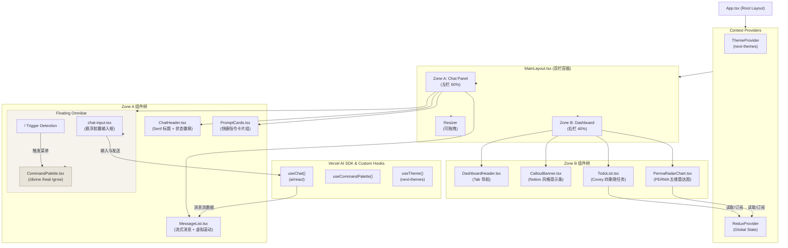
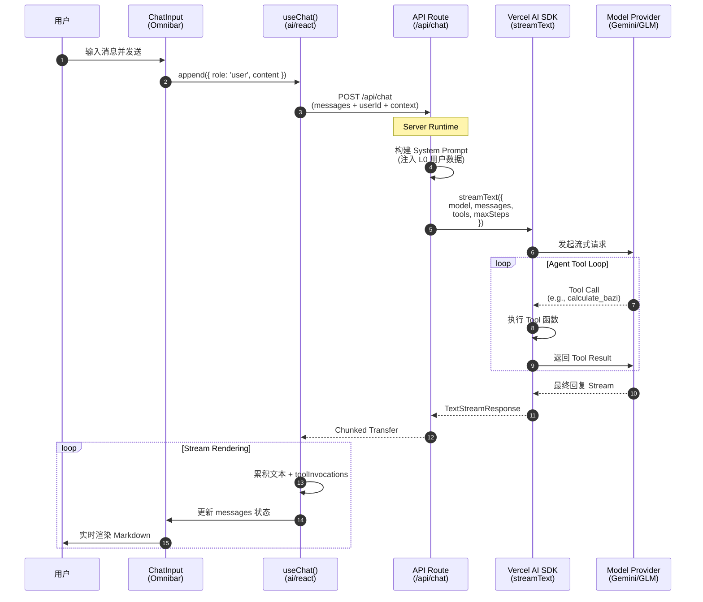
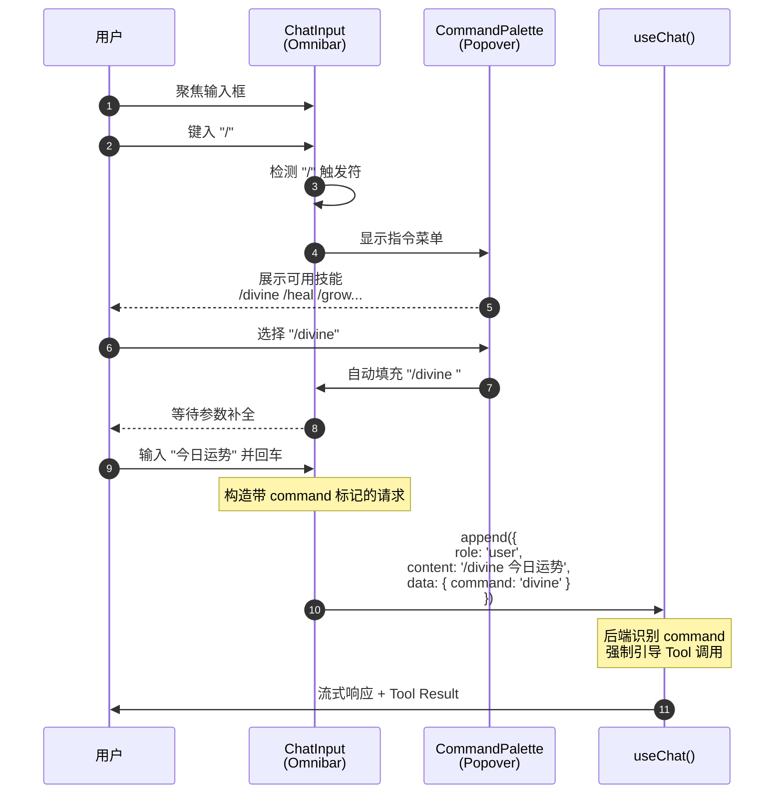
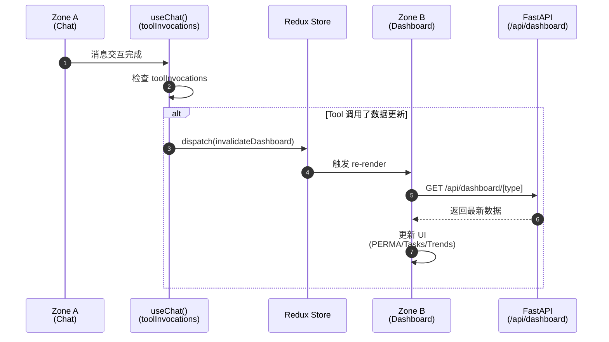

# Mentis 前端工程设计文档 v4.0

**版本**: v4.0 (Vercel AI SDK & Notion Zen Edition)
**更新日期**: 2026-01-01
**核心变更**: Vercel AI SDK Runtime、Slash Command 交互模式、"Notion Zen" 设计语言

---

## 目录

1. [架构概览](#1-架构概览)
2. [设计系统 (Notion Zen Theme)](#2-设计系统-notion-zen-theme)
3. [核心交互流程](#3-核心交互流程)
4. [关键组件设计](#4-关键组件设计)
5. [数据流与状态管理](#5-数据流与状态管理)
6. [实现路线图](#6-实现路线图)
7. [Landing Page 设计方案](#7-landing-page-设计方案)

---

## 1. 架构概览

### 1.1 设计理念

Mentis 采用**内容为中心的双栏布局 (Content-First Split View)**，左侧为实时对话交互区（Zone A），右侧为状态看板区（Zone B）。整体视觉语言融合 **Notion 的极简克制** 与 **禅宗美学的空灵质感**，打造温暖、理性且具灵性的交互环境。

**核心升级点**:
- **Vercel AI SDK** 作为 AI Runtime，原生支持流式传输与工具调用
- **Slash Command** 指令系统，提供精确的功能入口
- **Notion Zen** 设计语言，Ethereal Earth Tones 配色体系

### 1.2 前端组件架构图



### 1.3 核心技术栈

| 层级 | 技术选型 | 说明 |
|------|----------|------|
| **Framework** | Next.js 14 (App Router) | SSR/RSC 支持 |
| **Language** | TypeScript 5.x | 类型安全 |
| **AI Runtime** | **Vercel AI SDK 6** (`ai/react`) | 流式传输 + Tool Calling |
| **Model Provider** | `@ai-sdk/google` / GLM Provider | 可切换模型 |
| **UI Components** | **shadcn/ui** + Radix UI | 可定制无样式组件 |
| **Styling** | **Tailwind CSS 4.x** | 原子化 CSS |
| **Animation** | **Framer Motion** | 微交互与过渡动效 |
| **State** | Redux Toolkit (L0/L1) + Zustand (UI) | 分层状态管理 |
| **Data Viz** | **Recharts** | PERMA 雷达图 |
| **Virtual Scroll** | `@tanstack/react-virtual` | 长列表优化 |

### 1.4 目录结构

```bash
src/
├── app/
│   ├── api/
│   │   └── chat/
│   │       └── route.ts          # Vercel AI SDK Server Runtime
│   ├── layout.tsx                # Root Layout + Providers
│   ├── page.tsx                  # 重定向到 /new
│   └── new/
│       ├── layout.tsx            # 双栏布局容器
│       └── page.tsx              # 主界面
│
├── components/
│   ├── ui/                       # shadcn/ui 基础组件
│   │   ├── button.tsx
│   │   ├── input.tsx
│   │   ├── popover.tsx
│   │   ├── card.tsx
│   │   └── skeleton.tsx
│   │
│   ├── chat/                     # Zone A 组件
│   │   ├── chat-panel.tsx        # 主容器
│   │   ├── chat-header.tsx       # Serif 标题
│   │   ├── chat-input.tsx        # 悬浮胶囊 Omnibar
│   │   ├── message-list.tsx      # 消息列表 (虚拟滚动)
│   │   ├── message-item.tsx      # 单条消息 (Markdown)
│   │   ├── prompt-cards.tsx      # 快捷提示卡片
│   │   ├── command-palette.tsx   # Slash 命令菜单
│   │   └── tool-result-card.tsx  # Tool 调用结果渲染
│   │
│   ├── dashboard/                # Zone B 组件
│   │   ├── dashboard-panel.tsx   # 主容器
│   │   ├── dashboard-header.tsx  # Tab 导航
│   │   ├── callout-banner.tsx    # Notion 风格提示条
│   │   ├── todo-list.tsx         # Covey 任务列表
│   │   ├── perma-radar-chart.tsx # PERMA 五维雷达图
│   │   └── tabs/
│   │       ├── overview-tab.tsx
│   │       ├── status-tab.tsx
│   │       ├── trends-tab.tsx
│   │       └── tasks-tab.tsx
│   │
│   └── layout/
│       ├── main-layout.tsx       # Split View 容器
│       └── resizer.tsx           # 可拖拽分割线
│
├── hooks/
│   ├── use-chat-stream.ts        # 封装 useChat 的自定义 Hook
│   ├── use-command-palette.ts    # Slash Command 逻辑
│   └── use-dashboard-sync.ts     # Dashboard 数据同步
│
├── lib/
│   ├── utils.ts                  # cn(), formatDate() 等工具
│   ├── constants.ts              # 技能定义、API 端点
│   └── api-client.ts             # CSRF 封装的 API 客户端
│
├── redux/
│   ├── store.ts
│   └── slices/
│       ├── user-slice.ts         # L0 用户数据
│       └── dashboard-slice.ts    # L1 看板数据
│
└── styles/
    ├── globals.css               # CSS Variables + 全局样式
    └── fonts.ts                  # 字体配置
```

---

## 2. 设计系统 (Notion Zen Theme)

### 2.1 设计哲学

**"Ethereal Earth Tones"** — 空灵大地色系

融合 Notion 的极简功能主义与东方禅宗美学，创造一个温暖、理性、具有灵性的数字空间。核心原则：

1. **空 (Emptiness)** — 充分留白，让内容呼吸
2. **静 (Stillness)** — 柔和过渡，避免视觉噪音
3. **暖 (Warmth)** — 大地色调，护眼且温馨
4. **质 (Texture)** — 微妙纹理，增添触感深度

### 2.2 色彩系统

```css
/* globals.css */

:root {
  /* ═══════════════════════════════════════════════════════════
     Base Colors — Notion Zen Palette (Light Mode)
     ═══════════════════════════════════════════════════════════ */

  /* 背景：米灰色/奶油色，替代纯白，护眼且温暖 */
  --background: 40 20% 98%;          /* #FDFCFA — 纸质白 */
  --background-subtle: 40 15% 96%;   /* #F9F7F4 — 浅米灰 */

  /* 前景：深炭色，替代纯黑，减少对比度疲劳 */
  --foreground: 30 10% 22%;          /* #37352F — Notion 标准文字 */
  --foreground-muted: 30 5% 60%;     /* #9B9A97 — 次级文字 */
  --foreground-subtle: 30 5% 75%;    /* #C4C4C1 — 占位符/禁用 */

  /* 卡片与层级 */
  --card: 0 0% 100%;                 /* #FFFFFF — 浮动卡片 */
  --card-hover: 40 10% 99%;          /* #FEFDFB — 卡片悬浮 */
  --popover: 0 0% 100%;
  --popover-foreground: 30 10% 22%;

  /* 边框与分割线 */
  --border: 40 10% 90%;              /* #E8E5E0 — 柔和边框 */
  --border-hover: 40 10% 82%;        /* #D4CFC6 — 悬浮边框 */
  --input: 40 10% 92%;               /* #EDEBE6 — 输入框背景 */
  --input-focus: 40 15% 88%;         /* #E5E0D6 — 聚焦背景 */

  /* ═══════════════════════════════════════════════════════════
     PERMA 数据可视化配色 — v3.1 设计规范
     ═══════════════════════════════════════════════════════════ */
  --perma-p: 163 25% 61%;            /* #84A59D — Sage Green (积极情绪) */
  --perma-e: 1 83% 73%;              /* #F28482 — Soft Red (投入) */
  --perma-r: 43 89% 67%;             /* #F6BD60 — Mustard (关系) */
  --perma-m: 90 14% 49%;             /* #7B8E6F — Forest Green (意义) */
  --perma-a: 248 81% 67%;            /* #7B68EE — Slate Purple (成就) */

  /* ═══════════════════════════════════════════════════════════
     功能色 — 语义化配色
     ═══════════════════════════════════════════════════════════ */
  --primary: 30 10% 22%;             /* 主按钮：深炭色 */
  --primary-foreground: 40 20% 98%;  /* 主按钮文字：纸质白 */

  --accent: 35 60% 52%;              /* #C9A05A — 金麦色强调 */
  --accent-foreground: 30 10% 15%;

  --destructive: 0 65% 55%;          /* #D65A5A — 柔和红 */
  --destructive-foreground: 0 0% 100%;

  --success: 145 40% 45%;            /* #4A9B6D — 柔和绿 */
  --success-foreground: 0 0% 100%;

  /* ═══════════════════════════════════════════════════════════
     空间与圆角
     ═══════════════════════════════════════════════════════════ */
  --radius-sm: 0.375rem;             /* 6px — 小元素 */
  --radius-md: 0.625rem;             /* 10px — 按钮/输入框 */
  --radius-lg: 0.875rem;             /* 14px — 卡片 */
  --radius-xl: 1.25rem;              /* 20px — 大卡片/模态框 */
  --radius-full: 9999px;             /* 胶囊形状 */

  /* ═══════════════════════════════════════════════════════════
     阴影系统 — 分层阴影 (Layered Shadows)
     ═══════════════════════════════════════════════════════════ */
  --shadow-xs: 0 1px 2px rgba(55, 53, 47, 0.04);
  --shadow-sm: 0 2px 4px rgba(55, 53, 47, 0.06);
  --shadow-md: 0 4px 12px rgba(55, 53, 47, 0.08);
  --shadow-lg: 0 8px 24px rgba(55, 53, 47, 0.12);
  --shadow-xl: 0 16px 48px rgba(55, 53, 47, 0.16);

  /* 悬浮元素专用阴影 */
  --shadow-floating:
    0 0 0 1px rgba(55, 53, 47, 0.04),
    0 4px 12px rgba(55, 53, 47, 0.08),
    0 16px 32px rgba(55, 53, 47, 0.06);

  /* Omnibar 专用阴影 */
  --shadow-omnibar:
    0 0 0 1px rgba(55, 53, 47, 0.06),
    0 8px 24px rgba(55, 53, 47, 0.12),
    0 24px 48px rgba(55, 53, 47, 0.08);
}

/* Dark Mode */
.dark {
  --background: 220 10% 8%;          /* #121315 — 深夜蓝黑 */
  --background-subtle: 220 10% 11%;  /* #1A1B1E */

  --foreground: 40 10% 88%;          /* #E2E0DC */
  --foreground-muted: 40 5% 55%;     /* #908E8A */
  --foreground-subtle: 40 5% 35%;    /* #5C5A56 */

  --card: 220 10% 12%;               /* #1E1F22 */
  --card-hover: 220 10% 14%;         /* #242528 */

  --border: 220 8% 20%;              /* #323438 */
  --border-hover: 220 8% 28%;        /* #464850 */
  --input: 220 8% 15%;               /* #262729 */
  --input-focus: 220 8% 18%;         /* #2D2F32 */

  /* PERMA 暗色模式调整 (降低饱和度，v3.1 设计规范) */
  --perma-p: 163 20% 50%;
  --perma-e: 1 65% 60%;
  --perma-r: 43 70% 55%;
  --perma-m: 90 12% 42%;
  --perma-a: 248 60% 55%;

  --primary: 40 10% 88%;
  --primary-foreground: 220 10% 8%;

  --shadow-floating:
    0 0 0 1px rgba(255, 255, 255, 0.06),
    0 4px 12px rgba(0, 0, 0, 0.3),
    0 16px 32px rgba(0, 0, 0, 0.2);
}
```

### 2.3 字体系统

```css
/* globals.css — Typography */

/* 字体加载 (Google Fonts) */
@import url('https://fonts.googleapis.com/css2?family=Merriweather:wght@400;700&family=Inter:wght@400;500;600&display=swap');

:root {
  /* 字体栈 */
  --font-serif: 'Merriweather', 'Noto Serif SC', Georgia, serif;
  --font-sans: 'Inter', -apple-system, BlinkMacSystemFont, 'Segoe UI', sans-serif;
  --font-mono: 'JetBrains Mono', 'SF Mono', Consolas, monospace;

  /* 字号阶梯 */
  --text-xs: 0.75rem;      /* 12px */
  --text-sm: 0.875rem;     /* 14px */
  --text-base: 1rem;       /* 16px */
  --text-lg: 1.125rem;     /* 18px */
  --text-xl: 1.25rem;      /* 20px */
  --text-2xl: 1.5rem;      /* 24px */
  --text-3xl: 2rem;        /* 32px */
  --text-4xl: 2.5rem;      /* 40px */

  /* 行高 */
  --leading-tight: 1.25;
  --leading-snug: 1.4;
  --leading-normal: 1.6;
  --leading-relaxed: 1.75;

  /* 字重 */
  --font-normal: 400;
  --font-medium: 500;
  --font-semibold: 600;
  --font-bold: 700;
}

/* 基础排版 */
body {
  font-family: var(--font-sans);
  font-size: var(--text-base);
  line-height: var(--leading-normal);
  font-weight: var(--font-normal);
  color: hsl(var(--foreground));
  background: hsl(var(--background));

  /* 字体渲染优化 */
  -webkit-font-smoothing: antialiased;
  -moz-osx-font-smoothing: grayscale;
  text-rendering: optimizeLegibility;
}

/* Serif 标题 — 用于 Zone A 欢迎语/Soul 质感 */
.serif-heading {
  font-family: var(--font-serif);
  font-weight: var(--font-bold);
  letter-spacing: -0.02em;
}

h1.serif-heading {
  font-size: var(--text-4xl);
  line-height: var(--leading-tight);
}

h2.serif-heading {
  font-size: var(--text-2xl);
  line-height: var(--leading-snug);
}

/* 次级文字 */
.text-muted {
  color: hsl(var(--foreground-muted));
}

.text-subtle {
  color: hsl(var(--foreground-subtle));
}
```

### 2.4 动效系统

```css
/* globals.css — Motion & Transitions */

:root {
  /* 缓动函数 */
  --ease-out-expo: cubic-bezier(0.16, 1, 0.3, 1);
  --ease-out-quad: cubic-bezier(0.25, 0.46, 0.45, 0.94);
  --ease-in-out: cubic-bezier(0.4, 0, 0.2, 1);
  --ease-spring: cubic-bezier(0.34, 1.56, 0.64, 1);

  /* 时长 */
  --duration-fast: 150ms;
  --duration-normal: 250ms;
  --duration-slow: 400ms;
  --duration-slower: 600ms;
}

/* 基础过渡 */
.transition-base {
  transition: all var(--duration-normal) var(--ease-out-quad);
}

.transition-fast {
  transition: all var(--duration-fast) var(--ease-out-quad);
}

/* 卡片悬浮效果 */
.card-hover {
  transition:
    transform var(--duration-normal) var(--ease-out-expo),
    box-shadow var(--duration-normal) var(--ease-out-quad);
}

.card-hover:hover {
  transform: translateY(-2px);
  box-shadow: var(--shadow-lg);
}

/* 渐入动画 */
@keyframes fade-in {
  from {
    opacity: 0;
    transform: translateY(8px);
  }
  to {
    opacity: 1;
    transform: translateY(0);
  }
}

.animate-fade-in {
  animation: fade-in var(--duration-slow) var(--ease-out-expo) forwards;
}

/* 流式文字打字效果 */
@keyframes stream-in {
  from {
    opacity: 0;
  }
  to {
    opacity: 1;
  }
}

.stream-text > * {
  animation: stream-in var(--duration-fast) var(--ease-out-quad);
}

/* Command Palette 弹出动画 */
@keyframes popover-in {
  from {
    opacity: 0;
    transform: scale(0.95) translateY(-4px);
  }
  to {
    opacity: 1;
    transform: scale(1) translateY(0);
  }
}

.popover-animate {
  animation: popover-in var(--duration-normal) var(--ease-spring) forwards;
}

/* 消息气泡入场 */
@keyframes message-in {
  from {
    opacity: 0;
    transform: translateX(-12px);
  }
  to {
    opacity: 1;
    transform: translateX(0);
  }
}

.message-animate {
  animation: message-in var(--duration-slow) var(--ease-out-expo) forwards;
}

/* 减少动效偏好 */
@media (prefers-reduced-motion: reduce) {
  *,
  *::before,
  *::after {
    animation-duration: 0.01ms !important;
    animation-iteration-count: 1 !important;
    transition-duration: 0.01ms !important;
  }
}
```

### 2.5 Tailwind 配置

```typescript
// tailwind.config.ts
import type { Config } from 'tailwindcss';

const config: Config = {
  darkMode: ['class'],
  content: ['./src/**/*.{ts,tsx}'],
  theme: {
    extend: {
      colors: {
        background: 'hsl(var(--background))',
        'background-subtle': 'hsl(var(--background-subtle))',
        foreground: 'hsl(var(--foreground))',
        'foreground-muted': 'hsl(var(--foreground-muted))',
        'foreground-subtle': 'hsl(var(--foreground-subtle))',
        card: 'hsl(var(--card))',
        'card-hover': 'hsl(var(--card-hover))',
        border: 'hsl(var(--border))',
        'border-hover': 'hsl(var(--border-hover))',
        input: 'hsl(var(--input))',
        'input-focus': 'hsl(var(--input-focus))',
        primary: 'hsl(var(--primary))',
        'primary-foreground': 'hsl(var(--primary-foreground))',
        accent: 'hsl(var(--accent))',
        destructive: 'hsl(var(--destructive))',
        success: 'hsl(var(--success))',
        perma: {
          p: 'hsl(var(--perma-p))',
          e: 'hsl(var(--perma-e))',
          r: 'hsl(var(--perma-r))',
          m: 'hsl(var(--perma-m))',
          a: 'hsl(var(--perma-a))',
        },
      },
      fontFamily: {
        serif: ['var(--font-serif)'],
        sans: ['var(--font-sans)'],
        mono: ['var(--font-mono)'],
      },
      borderRadius: {
        sm: 'var(--radius-sm)',
        md: 'var(--radius-md)',
        lg: 'var(--radius-lg)',
        xl: 'var(--radius-xl)',
      },
      boxShadow: {
        xs: 'var(--shadow-xs)',
        sm: 'var(--shadow-sm)',
        md: 'var(--shadow-md)',
        lg: 'var(--shadow-lg)',
        xl: 'var(--shadow-xl)',
        floating: 'var(--shadow-floating)',
        omnibar: 'var(--shadow-omnibar)',
      },
      transitionTimingFunction: {
        'out-expo': 'var(--ease-out-expo)',
        'out-quad': 'var(--ease-out-quad)',
        spring: 'var(--ease-spring)',
      },
      animation: {
        'fade-in': 'fade-in var(--duration-slow) var(--ease-out-expo) forwards',
        'popover-in': 'popover-in var(--duration-normal) var(--ease-spring) forwards',
        'message-in': 'message-in var(--duration-slow) var(--ease-out-expo) forwards',
      },
    },
  },
  plugins: [require('tailwindcss-animate')],
};

export default config;
```

---

## 3. 核心交互流程

### 3.1 Chat 发送与流式响应 (Vercel AI SDK)

利用 Vercel AI SDK 的 `useChat` Hook 简化流式交互与工具调用处理。



### 3.2 Slash Command 交互流程

实现类似 Notion/Claude 的 `/` 指令菜单，提供精确功能入口。



### 3.3 Dashboard 数据同步流程



### 3.4 Command 类型映射表

| 指令 | 触发 Agent | 调用 Tool | 成功响应 |
|------|------------|-----------|----------|
| `/divine` | Metaphysics | `calculate_bazi` | 八字命盘卡片 |
| `/divine type=ziwei` | Metaphysics | `calculate_ziwei` | 紫微命盘 |
| `/divine type=tarot` | Metaphysics | `draw_tarot` | 塔罗牌阵 |
| `/heal` | Psychology | `mood_checkin` | 情绪打卡 Modal |
| `/heal mode=reframe` | Psychology | `cbt_reframe` | CBT 重构引导 |
| `/grow` | Growth | `goal_setting` | 目标设定向导 |
| `/grow action=review` | Growth | `weekly_review` | 周复盘引导 |
| `/status` | - | - | Dashboard 状态刷新 |
| `/help` | - | - | 指令帮助列表 |

---

## 4. 关键组件设计

### 4.1 MainLayout — 双栏容器

```
┌─────────────────────────────────────────────────────────────────────────────┐
│                              Main Layout                                     │
│  background: hsl(var(--background))                                          │
│                                                                              │
│  ┌─────────────────────────────┐ ┌─┐ ┌────────────────────────────────────┐ │
│  │                             │ │R│ │                                    │ │
│  │    Zone A (Chat Panel)      │ │e│ │    Zone B (Dashboard Panel)        │ │
│  │                             │ │s│ │                                    │ │
│  │    flex: 3 (60%)            │ │i│ │    flex: 2 (40%)                   │ │
│  │                             │ │z│ │                                    │ │
│  │    ┌───────────────────┐    │ │e│ │    background: hsl(var(--card))    │ │
│  │    │   Card Container  │    │ │r│ │    border-radius: var(--radius-xl) │ │
│  │    │   shadow-floating │    │ │ │ │    shadow-floating                 │ │
│  │    │   rounded-2xl     │    │ │ │ │                                    │ │
│  │    └───────────────────┘    │ │ │ │                                    │ │
│  │                             │ │ │ │                                    │ │
│  └─────────────────────────────┘ └─┘ └────────────────────────────────────┘ │
│                                                                              │
│  gap: 24px (1.5rem)                                                          │
│  padding: 24px                                                               │
└─────────────────────────────────────────────────────────────────────────────┘
```

**设计要点**:
- 背景应用全局 `--background` (米灰色)
- 左右两栏是浮在背景上的"卡片"，带柔和圆角 `rounded-2xl` 和扩散阴影 `shadow-floating`
- 中间 Resizer 可拖拽调整比例，双击恢复默认 60:40
- 响应式断点：< 1024px 切换为 Tab 模式

```tsx
// components/layout/main-layout.tsx
'use client';

import { useState, useRef, useCallback } from 'react';
import { motion } from 'framer-motion';
import { ChatPanel } from '@/components/chat/chat-panel';
import { DashboardPanel } from '@/components/dashboard/dashboard-panel';
import { cn } from '@/lib/utils';

const DEFAULT_SPLIT = 60; // 默认左栏占比
const MIN_SPLIT = 35;
const MAX_SPLIT = 75;

export function MainLayout() {
  const [splitRatio, setSplitRatio] = useState(DEFAULT_SPLIT);
  const containerRef = useRef<HTMLDivElement>(null);
  const isDragging = useRef(false);

  const handleMouseDown = useCallback(() => {
    isDragging.current = true;
    document.body.style.cursor = 'col-resize';
    document.body.style.userSelect = 'none';
  }, []);

  const handleMouseMove = useCallback((e: MouseEvent) => {
    if (!isDragging.current || !containerRef.current) return;

    const rect = containerRef.current.getBoundingClientRect();
    const newRatio = ((e.clientX - rect.left) / rect.width) * 100;
    setSplitRatio(Math.min(MAX_SPLIT, Math.max(MIN_SPLIT, newRatio)));
  }, []);

  const handleMouseUp = useCallback(() => {
    isDragging.current = false;
    document.body.style.cursor = '';
    document.body.style.userSelect = '';
  }, []);

  const handleDoubleClick = useCallback(() => {
    setSplitRatio(DEFAULT_SPLIT);
  }, []);

  return (
    <div
      ref={containerRef}
      className="flex h-screen p-6 gap-6 bg-background"
    >
      {/* Zone A: Chat Panel */}
      <motion.div
        className="relative overflow-hidden rounded-2xl bg-card shadow-floating"
        style={{ flex: splitRatio }}
        layout
        transition={{ type: 'spring', stiffness: 300, damping: 30 }}
      >
        <ChatPanel />
      </motion.div>

      {/* Resizer */}
      <div
        className={cn(
          "w-1.5 cursor-col-resize flex-shrink-0",
          "bg-transparent hover:bg-border-hover",
          "transition-colors duration-150",
          "rounded-full"
        )}
        onMouseDown={handleMouseDown}
        onDoubleClick={handleDoubleClick}
      />

      {/* Zone B: Dashboard Panel */}
      <motion.div
        className="relative overflow-hidden rounded-2xl bg-card shadow-floating"
        style={{ flex: 100 - splitRatio }}
        layout
        transition={{ type: 'spring', stiffness: 300, damping: 30 }}
      >
        <DashboardPanel />
      </motion.div>
    </div>
  );
}
```

### 4.2 Zone A: Chat Panel

#### 4.2.1 整体结构

```
┌─────────────────────────────────────────────────────────────┐
│  Chat Panel                                                  │
│                                                              │
│  ┌─────────────────────────────────────────────────────────┐│
│  │  ChatHeader                                              ││
│  │  ┌───────────────────────────────────────────────────┐  ││
│  │  │  🔮 Mentis                        ● Connected  │  ││
│  │  │     探索内心世界                                    │  ││
│  │  └───────────────────────────────────────────────────┘  ││
│  └─────────────────────────────────────────────────────────┘│
│                                                              │
│  ┌─────────────────────────────────────────────────────────┐│
│  │  PromptCards (初始状态显示)                              ││
│  │  ┌──────────┐ ┌──────────┐ ┌──────────┐ ┌──────────┐   ││
│  │  │ 🔮       │ │ 🌿       │ │ 💚       │ │ 🎯       │   ││
│  │  │ 塔罗占卜 │ │ 八字排盘 │ │ 情绪打卡 │ │ 目标规划 │   ││
│  │  │ 指引能量 │ │ 命理分析 │ │ 心理疗愈 │ │ 成长教练 │   ││
│  │  └──────────┘ └──────────┘ └──────────┘ └──────────┘   ││
│  └─────────────────────────────────────────────────────────┘│
│                                                              │
│  ┌─────────────────────────────────────────────────────────┐│
│  │  MessageList (对话开始后显示)                            ││
│  │                                                          ││
│  │  ┌─────────────────────────────────────────────────┐    ││
│  │  │ [User Message]                                   │    ││
│  │  └─────────────────────────────────────────────────┘    ││
│  │                                                          ││
│  │  ┌─────────────────────────────────────────────────┐    ││
│  │  │ [AI Message - Markdown + Tool Results]          │    ││
│  │  │  ┌─────────────────────────────────────────┐    │    ││
│  │  │  │ BaziCard / PermaCard / TaskCard        │    │    ││
│  │  │  └─────────────────────────────────────────┘    │    ││
│  │  └─────────────────────────────────────────────────┘    ││
│  │                                                          ││
│  └─────────────────────────────────────────────────────────┘│
│                                                              │
│  ┌─────────────────────────────────────────────────────────┐│
│  │  Floating Omnibar                                        ││
│  │         ┌─────────────────────────────────────────┐     ││
│  │         │ [+]  输入消息或 / 指令...          [➤] │     ││
│  │         └─────────────────────────────────────────┘     ││
│  │                                                          ││
│  │         ┌─────────────────────────────────────────┐     ││
│  │         │ CommandPalette (/ 触发时显示)            │     ││
│  │         │ 🔮 /divine  玄学测算                     │     ││
│  │         │ 💚 /heal    心理疗愈                     │     ││
│  │         │ 🌱 /grow    成长教练                     │     ││
│  │         └─────────────────────────────────────────┘     ││
│  └─────────────────────────────────────────────────────────┘│
│                                                              │
└─────────────────────────────────────────────────────────────┘
```

#### 4.2.2 ChatHeader 组件

```tsx
// components/chat/chat-header.tsx
import { cn } from '@/lib/utils';

interface ChatHeaderProps {
  isConnected?: boolean;
}

export function ChatHeader({ isConnected = true }: ChatHeaderProps) {
  return (
    <header className="px-8 pt-8 pb-4">
      <div className="flex items-center justify-between">
        {/* Logo & Title */}
        <div>
          <h1 className="serif-heading text-3xl text-foreground flex items-center gap-3">
            <span className="text-4xl">🔮</span>
            Mentis
          </h1>
          <p className="text-foreground-muted mt-1 text-base">
            探索内心世界
          </p>
        </div>

        {/* Connection Status */}
        <div className="flex items-center gap-2 text-sm text-foreground-muted">
          <span
            className={cn(
              "w-2 h-2 rounded-full",
              isConnected ? "bg-success" : "bg-foreground-subtle"
            )}
          />
          <span>{isConnected ? 'Connected' : 'Offline'}</span>
        </div>
      </div>
    </header>
  );
}
```

#### 4.2.3 PromptCards 组件

```tsx
// components/chat/prompt-cards.tsx
'use client';

import { motion } from 'framer-motion';
import { cn } from '@/lib/utils';

interface PromptCard {
  id: string;
  icon: string;
  title: string;
  subtitle: string;
  command: string;
}

const PROMPT_CARDS: PromptCard[] = [
  {
    id: 'tarot',
    icon: '🔮',
    title: '塔罗占卜',
    subtitle: '指引当下能量',
    command: '/divine type=tarot',
  },
  {
    id: 'bazi',
    icon: '🌿',
    title: '八字排盘',
    subtitle: '命理深度分析',
    command: '/divine type=bazi',
  },
  {
    id: 'mood',
    icon: '💚',
    title: '情绪打卡',
    subtitle: '心理疗愈记录',
    command: '/heal',
  },
  {
    id: 'goal',
    icon: '🎯',
    title: '目标规划',
    subtitle: '成长教练引导',
    command: '/grow',
  },
];

interface PromptCardsProps {
  onSelect: (command: string) => void;
}

export function PromptCards({ onSelect }: PromptCardsProps) {
  return (
    <div className="px-8 py-6">
      <p className="text-sm text-foreground-muted mb-4">快速开始</p>
      <div className="grid grid-cols-2 lg:grid-cols-4 gap-3">
        {PROMPT_CARDS.map((card, index) => (
          <motion.button
            key={card.id}
            onClick={() => onSelect(card.command)}
            className={cn(
              "group relative p-4 rounded-xl",
              "bg-background-subtle hover:bg-card",
              "border border-transparent hover:border-border",
              "text-left transition-all duration-200",
              "hover:shadow-md hover:-translate-y-0.5"
            )}
            initial={{ opacity: 0, y: 12 }}
            animate={{ opacity: 1, y: 0 }}
            transition={{
              delay: index * 0.05,
              duration: 0.3,
              ease: [0.16, 1, 0.3, 1]
            }}
          >
            <span className="text-2xl mb-2 block">{card.icon}</span>
            <h3 className="font-medium text-foreground text-sm">
              {card.title}
            </h3>
            <p className="text-xs text-foreground-muted mt-0.5">
              {card.subtitle}
            </p>
          </motion.button>
        ))}
      </div>
    </div>
  );
}
```

#### 4.2.4 ChatInput — 悬浮胶囊 Omnibar

```tsx
// components/chat/chat-input.tsx
'use client';

import { useState, useRef, useCallback, KeyboardEvent } from 'react';
import { motion, AnimatePresence } from 'framer-motion';
import { Plus, Send } from 'lucide-react';
import { cn } from '@/lib/utils';
import { CommandPalette, COMMANDS, type CommandOption } from './command-palette';

interface ChatInputProps {
  input: string;
  command: string | null;
  isLoading: boolean;
  onChange: (e: React.ChangeEvent<HTMLInputElement>) => void;
  onSubmit: (e: React.FormEvent) => void;
  onClearCommand: () => void;
}

export function ChatInput({
  input,
  command,
  isLoading,
  onChange,
  onSubmit,
  onClearCommand,
}: ChatInputProps) {
  const [showPalette, setShowPalette] = useState(false);
  const [paletteFilter, setPaletteFilter] = useState('');
  const inputRef = useRef<HTMLInputElement>(null);

  const handleInputChange = useCallback(
    (e: React.ChangeEvent<HTMLInputElement>) => {
      const value = e.target.value;
      onChange(e);

      // Detect "/" trigger
      if (value === '/' || (value.startsWith('/') && !value.includes(' '))) {
        setShowPalette(true);
        setPaletteFilter(value.slice(1));
      } else {
        setShowPalette(false);
      }
    },
    [onChange]
  );

  const handleCommandSelect = useCallback((cmd: CommandOption) => {
    setShowPalette(false);
    // Trigger parent to set command mode
    const syntheticEvent = {
      target: { value: `/${cmd.command} ` },
    } as React.ChangeEvent<HTMLInputElement>;
    onChange(syntheticEvent);
    inputRef.current?.focus();
  }, [onChange]);

  const handleKeyDown = useCallback(
    (e: KeyboardEvent<HTMLInputElement>) => {
      if (e.key === 'Escape') {
        setShowPalette(false);
        if (command) onClearCommand();
      }
    },
    [command, onClearCommand]
  );

  return (
    <div className="relative px-8 pb-6">
      {/* Command Palette Popover */}
      <AnimatePresence>
        {showPalette && (
          <motion.div
            initial={{ opacity: 0, y: 8, scale: 0.96 }}
            animate={{ opacity: 1, y: 0, scale: 1 }}
            exit={{ opacity: 0, y: 8, scale: 0.96 }}
            transition={{ duration: 0.15, ease: [0.16, 1, 0.3, 1] }}
            className="absolute bottom-full left-8 right-8 mb-2"
          >
            <CommandPalette
              filter={paletteFilter}
              onSelect={handleCommandSelect}
              onClose={() => setShowPalette(false)}
            />
          </motion.div>
        )}
      </AnimatePresence>

      {/* Floating Omnibar */}
      <form onSubmit={onSubmit} className="relative">
        <div
          className={cn(
            "flex items-center gap-3",
            "h-14 px-4 rounded-full",
            "bg-card/80 backdrop-blur-md",
            "border border-border",
            "shadow-omnibar",
            "transition-all duration-200",
            "focus-within:border-border-hover",
            "focus-within:bg-card"
          )}
        >
          {/* Attachment Button */}
          <button
            type="button"
            className={cn(
              "flex-shrink-0 w-8 h-8 rounded-full",
              "flex items-center justify-center",
              "text-foreground-muted hover:text-foreground",
              "hover:bg-background-subtle",
              "transition-colors duration-150"
            )}
          >
            <Plus className="w-5 h-5" />
          </button>

          {/* Command Badge */}
          <AnimatePresence>
            {command && (
              <motion.span
                initial={{ opacity: 0, scale: 0.8 }}
                animate={{ opacity: 1, scale: 1 }}
                exit={{ opacity: 0, scale: 0.8 }}
                className={cn(
                  "flex-shrink-0 px-2 py-0.5 rounded-md",
                  "bg-accent/10 text-accent text-sm font-medium"
                )}
              >
                {command}
              </motion.span>
            )}
          </AnimatePresence>

          {/* Text Input */}
          <input
            ref={inputRef}
            type="text"
            value={input}
            onChange={handleInputChange}
            onKeyDown={handleKeyDown}
            placeholder={command ? '输入参数...' : '输入消息或 / 指令...'}
            disabled={isLoading}
            className={cn(
              "flex-1 bg-transparent border-none outline-none",
              "text-foreground placeholder:text-foreground-subtle",
              "text-base"
            )}
          />

          {/* Send Button */}
          <button
            type="submit"
            disabled={isLoading || !input.trim()}
            className={cn(
              "flex-shrink-0 w-9 h-9 rounded-full",
              "flex items-center justify-center",
              "bg-primary text-primary-foreground",
              "disabled:opacity-40 disabled:cursor-not-allowed",
              "hover:opacity-90",
              "transition-opacity duration-150"
            )}
          >
            {isLoading ? (
              <motion.div
                className="w-4 h-4 border-2 border-primary-foreground/30 border-t-primary-foreground rounded-full"
                animate={{ rotate: 360 }}
                transition={{ duration: 1, repeat: Infinity, ease: 'linear' }}
              />
            ) : (
              <Send className="w-4 h-4" />
            )}
          </button>
        </div>
      </form>
    </div>
  );
}
```

#### 4.2.5 CommandPalette 组件

```tsx
// components/chat/command-palette.tsx
'use client';

import { cn } from '@/lib/utils';

export interface CommandOption {
  command: string;
  label: string;
  description: string;
  icon: string;
}

export const COMMANDS: CommandOption[] = [
  {
    command: 'divine',
    label: '玄学测算',
    description: '八字 · 紫微 · 塔罗 · 星座',
    icon: '🔮',
  },
  {
    command: 'heal',
    label: '心理疗愈',
    description: '情绪打卡 · CBT 认知重构',
    icon: '💚',
  },
  {
    command: 'grow',
    label: '成长教练',
    description: '目标设定 · 任务管理 · 周复盘',
    icon: '🌱',
  },
  {
    command: 'status',
    label: '状态查看',
    description: '当前状态 · 趋势分析',
    icon: '📊',
  },
  {
    command: 'help',
    label: '帮助',
    description: '查看所有可用指令',
    icon: '❓',
  },
];

interface CommandPaletteProps {
  filter: string;
  onSelect: (cmd: CommandOption) => void;
  onClose: () => void;
}

export function CommandPalette({ filter, onSelect, onClose }: CommandPaletteProps) {
  const filtered = COMMANDS.filter(
    (cmd) =>
      cmd.command.toLowerCase().includes(filter.toLowerCase()) ||
      cmd.label.includes(filter)
  );

  if (filtered.length === 0) return null;

  return (
    <div
      className={cn(
        "p-2 rounded-xl",
        "bg-card border border-border",
        "shadow-floating"
      )}
    >
      <div className="text-xs text-foreground-muted px-2 pb-2 pt-1">
        可用指令
      </div>
      <div className="space-y-0.5">
        {filtered.map((cmd) => (
          <button
            key={cmd.command}
            onClick={() => onSelect(cmd)}
            className={cn(
              "w-full flex items-center gap-3 p-2.5 rounded-lg",
              "text-left",
              "hover:bg-background-subtle",
              "transition-colors duration-100"
            )}
          >
            <span className="text-xl flex-shrink-0">{cmd.icon}</span>
            <div className="flex-1 min-w-0">
              <div className="font-medium text-foreground text-sm">
                /{cmd.command}
                <span className="ml-2 text-foreground-muted font-normal">
                  {cmd.label}
                </span>
              </div>
              <div className="text-xs text-foreground-subtle truncate">
                {cmd.description}
              </div>
            </div>
          </button>
        ))}
      </div>
    </div>
  );
}
```

### 4.3 Zone B: Dashboard Panel

#### 4.3.1 整体结构

```
┌─────────────────────────────────────────────────────────────┐
│  Dashboard Panel                                             │
│                                                              │
│  ┌─────────────────────────────────────────────────────────┐│
│  │  DashboardHeader (Tab Navigation)                        ││
│  │  [概览]  [状态]  [趋势]  [任务]                           ││
│  └─────────────────────────────────────────────────────────┘│
│                                                              │
│  ┌─────────────────────────────────────────────────────────┐│
│  │  CalloutBanner (Notion 风格提示条)                        ││
│  │  ┌─────────────────────────────────────────────────┐    ││
│  │  │ 💡 今日洞察                                      │    ││
│  │  │    你的 PERMA 投入指数比上周提升了 12%           │    ││
│  │  └─────────────────────────────────────────────────┘    ││
│  └─────────────────────────────────────────────────────────┘│
│                                                              │
│  ┌─────────────────────────────────────────────────────────┐│
│  │  Tab Content Area                                        ││
│  │                                                          ││
│  │  ┌──────────────────────┐ ┌──────────────────────┐      ││
│  │  │  PERMA 雷达图        │ │  Covey 任务列表       │      ││
│  │  │  PermaRadarChart     │ │  TodoList            │      ││
│  │  │                      │ │                      │      ││
│  │  │     P                │ │  ☐ 重要紧急          │      ││
│  │  │    / \               │ │  ☐ 重要不紧急        │      ││
│  │  │   A   E              │ │  ☐ 紧急不重要        │      ││
│  │  │    \ /               │ │  ☐ 不重要不紧急      │      ││
│  │  │   M - R              │ │                      │      ││
│  │  └──────────────────────┘ └──────────────────────┘      ││
│  │                                                          ││
│  └─────────────────────────────────────────────────────────┘│
│                                                              │
└─────────────────────────────────────────────────────────────┘
```

#### 4.3.2 CalloutBanner 组件

```tsx
// components/dashboard/callout-banner.tsx
import { cn } from '@/lib/utils';

interface CalloutBannerProps {
  icon?: string;
  title: string;
  content: string;
  variant?: 'default' | 'success' | 'warning';
}

export function CalloutBanner({
  icon = '💡',
  title,
  content,
  variant = 'default',
}: CalloutBannerProps) {
  return (
    <div
      className={cn(
        "flex gap-3 p-4 rounded-lg",
        "border border-border",
        variant === 'default' && "bg-background-subtle",
        variant === 'success' && "bg-success/5 border-success/20",
        variant === 'warning' && "bg-accent/5 border-accent/20"
      )}
    >
      <span className="text-xl flex-shrink-0">{icon}</span>
      <div className="flex-1 min-w-0">
        <h4 className="font-medium text-foreground text-sm">{title}</h4>
        <p className="text-sm text-foreground-muted mt-0.5">{content}</p>
      </div>
    </div>
  );
}
```

#### 4.3.3 PERMA 雷达图组件

```tsx
// components/dashboard/perma-radar-chart.tsx
'use client';

import {
  RadarChart,
  PolarGrid,
  PolarAngleAxis,
  PolarRadiusAxis,
  Radar,
  ResponsiveContainer,
  Tooltip,
} from 'recharts';

interface PermaData {
  dimension: string;
  value: number;
  fullMark: number;
}

const PERMA_LABELS: Record<string, string> = {
  P: '积极情绪',
  E: '投入',
  R: '关系',
  M: '意义',
  A: '成就',
};

const PERMA_COLORS = {
  P: 'hsl(var(--perma-p))', // #84A59D Sage Green - 积极
  E: 'hsl(var(--perma-e))', // #F28482 Soft Red - 投入
  R: 'hsl(var(--perma-r))', // #F6BD60 Mustard - 关系
  M: 'hsl(var(--perma-m))', // #7B8E6F Forest Green - 意义
  A: 'hsl(var(--perma-a))', // #7B68EE Slate Purple - 成就
};

interface PermaRadarChartProps {
  data: PermaData[];
}

export function PermaRadarChart({ data }: PermaRadarChartProps) {
  return (
    <div className="p-4">
      <h3 className="font-medium text-foreground mb-4">PERMA 五维状态</h3>
      <div className="h-64">
        <ResponsiveContainer width="100%" height="100%">
          <RadarChart data={data} margin={{ top: 20, right: 30, bottom: 20, left: 30 }}>
            <PolarGrid
              stroke="hsl(var(--border))"
              strokeDasharray="3 3"
            />
            <PolarAngleAxis
              dataKey="dimension"
              tick={{
                fill: 'hsl(var(--foreground-muted))',
                fontSize: 12,
              }}
              tickFormatter={(value) => PERMA_LABELS[value] || value}
            />
            <PolarRadiusAxis
              angle={90}
              domain={[0, 100]}
              tick={{ fontSize: 10 }}
              tickCount={5}
              stroke="hsl(var(--border))"
            />
            <Radar
              name="PERMA"
              dataKey="value"
              stroke="hsl(var(--accent))"
              fill="hsl(var(--accent))"
              fillOpacity={0.2}
              strokeWidth={2}
              dot={{
                r: 4,
                fill: 'hsl(var(--card))',
                stroke: 'hsl(var(--accent))',
                strokeWidth: 2,
              }}
            />
            <Tooltip
              contentStyle={{
                background: 'hsl(var(--card))',
                border: '1px solid hsl(var(--border))',
                borderRadius: '8px',
                boxShadow: 'var(--shadow-md)',
              }}
              labelStyle={{ color: 'hsl(var(--foreground))' }}
            />
          </RadarChart>
        </ResponsiveContainer>
      </div>
    </div>
  );
}
```

#### 4.3.4 TodoList 组件

```tsx
// components/dashboard/todo-list.tsx
'use client';

import { useState } from 'react';
import { motion, AnimatePresence } from 'framer-motion';
import { Check, Clock, AlertCircle } from 'lucide-react';
import { cn } from '@/lib/utils';

interface TodoItem {
  id: string;
  title: string;
  quadrant: 'urgent-important' | 'not-urgent-important' | 'urgent-not-important' | 'not-urgent-not-important';
  completed: boolean;
  dueDate?: string;
}

const QUADRANT_CONFIG = {
  'urgent-important': {
    label: '重要紧急',
    color: 'bg-destructive/10 text-destructive',
    icon: AlertCircle,
  },
  'not-urgent-important': {
    label: '重要不紧急',
    color: 'bg-perma-e/10 text-perma-e',
    icon: Clock,
  },
  'urgent-not-important': {
    label: '紧急不重要',
    color: 'bg-accent/10 text-accent',
    icon: Clock,
  },
  'not-urgent-not-important': {
    label: '不重要不紧急',
    color: 'bg-foreground-subtle/10 text-foreground-muted',
    icon: Clock,
  },
};

interface TodoListProps {
  items: TodoItem[];
  onToggle: (id: string) => void;
}

export function TodoList({ items, onToggle }: TodoListProps) {
  return (
    <div className="p-4">
      <h3 className="font-medium text-foreground mb-4">Covey 任务矩阵</h3>
      <div className="space-y-2">
        <AnimatePresence>
          {items.map((item) => {
            const config = QUADRANT_CONFIG[item.quadrant];
            const Icon = config.icon;

            return (
              <motion.div
                key={item.id}
                layout
                initial={{ opacity: 0, x: -12 }}
                animate={{ opacity: 1, x: 0 }}
                exit={{ opacity: 0, x: 12 }}
                className={cn(
                  "flex items-center gap-3 p-3 rounded-lg",
                  "bg-background-subtle hover:bg-card",
                  "border border-transparent hover:border-border",
                  "transition-all duration-150",
                  "group"
                )}
              >
                {/* Checkbox */}
                <button
                  onClick={() => onToggle(item.id)}
                  className={cn(
                    "flex-shrink-0 w-5 h-5 rounded-full",
                    "border-2 border-border",
                    "flex items-center justify-center",
                    "transition-all duration-200",
                    item.completed && "bg-success border-success"
                  )}
                >
                  {item.completed && (
                    <Check className="w-3 h-3 text-white" />
                  )}
                </button>

                {/* Content */}
                <div className="flex-1 min-w-0">
                  <p
                    className={cn(
                      "text-sm text-foreground",
                      item.completed && "line-through text-foreground-muted"
                    )}
                  >
                    {item.title}
                  </p>
                </div>

                {/* Quadrant Badge */}
                <span
                  className={cn(
                    "flex-shrink-0 px-2 py-0.5 rounded text-xs font-medium",
                    config.color
                  )}
                >
                  {config.label}
                </span>
              </motion.div>
            );
          })}
        </AnimatePresence>
      </div>
    </div>
  );
}
```

---

## 5. 数据流与状态管理

### 5.1 状态分层架构

```
┌─────────────────────────────────────────────────────────────────────────────┐
│                            State Architecture                                │
├─────────────────────────────────────────────────────────────────────────────┤
│                                                                              │
│  ┌─────────────────────────────────────────────────────────────────────┐    │
│  │  Layer 1: Vercel AI SDK State (useChat)                              │    │
│  │  ├─ messages: Message[]         ← 对话消息列表                        │    │
│  │  ├─ input: string               ← 当前输入                           │    │
│  │  ├─ isLoading: boolean          ← 加载状态                           │    │
│  │  ├─ error: Error | null         ← 错误状态                           │    │
│  │  └─ toolInvocations             ← Tool 调用结果                       │    │
│  │                                                                       │    │
│  │  Scope: ChatPanel 组件树内                                            │    │
│  │  Persistence: 会话级 (刷新丢失)                                        │    │
│  └─────────────────────────────────────────────────────────────────────┘    │
│                                                                              │
│  ┌─────────────────────────────────────────────────────────────────────┐    │
│  │  Layer 2: Redux Toolkit (Global State)                               │    │
│  │  ├─ user/                       ← L0 用户基础数据                     │    │
│  │  │   ├─ profile                 ← 出生信息、偏好                       │    │
│  │  │   └─ auth                    ← 认证状态                           │    │
│  │  │                                                                    │    │
│  │  ├─ dashboard/                  ← L1 模块数据                         │    │
│  │  │   ├─ perma: PermaScore[]     ← PERMA 历史分数                      │    │
│  │  │   ├─ tasks: Task[]           ← 任务列表                           │    │
│  │  │   ├─ trends: TrendData[]     ← 趋势数据                           │    │
│  │  │   └─ invalidatedAt: number   ← 失效时间戳                          │    │
│  │  │                                                                    │    │
│  │  Scope: 全局                                                          │    │
│  │  Persistence: LocalStorage (可选)                                     │    │
│  └─────────────────────────────────────────────────────────────────────┘    │
│                                                                              │
│  ┌─────────────────────────────────────────────────────────────────────┐    │
│  │  Layer 3: Zustand (UI State)                                         │    │
│  │  ├─ activeTab: string           ← Dashboard 当前 Tab                  │    │
│  │  ├─ splitRatio: number          ← 双栏分割比例                        │    │
│  │  ├─ theme: 'light' | 'dark'     ← 主题                               │    │
│  │  └─ modals: ModalState          ← Modal 开关状态                      │    │
│  │                                                                       │    │
│  │  Scope: UI 层                                                         │    │
│  │  Persistence: LocalStorage                                            │    │
│  └─────────────────────────────────────────────────────────────────────┘    │
│                                                                              │
└─────────────────────────────────────────────────────────────────────────────┘
```

### 5.2 API Client 封装

```typescript
// lib/api-client.ts
import { getCookie } from '@/lib/utils';

class ApiError extends Error {
  constructor(
    public status: number,
    public data: unknown
  ) {
    super(`API Error: ${status}`);
    this.name = 'ApiError';
  }
}

export const apiClient = {
  /**
   * 获取 CSRF Token
   */
  getCSRFToken(): string {
    return getCookie('fortune_csrf') || '';
  },

  /**
   * 通用 POST 请求
   */
  async post<T>(url: string, data: unknown): Promise<T> {
    const response = await fetch(url, {
      method: 'POST',
      headers: {
        'Content-Type': 'application/json',
        'X-CSRF-Token': this.getCSRFToken(),
      },
      credentials: 'include',
      body: JSON.stringify(data),
    });

    if (!response.ok) {
      throw new ApiError(response.status, await response.json());
    }

    return response.json();
  },

  /**
   * 通用 GET 请求
   */
  async get<T>(url: string): Promise<T> {
    const response = await fetch(url, {
      method: 'GET',
      credentials: 'include',
    });

    if (!response.ok) {
      throw new ApiError(response.status, await response.json());
    }

    return response.json();
  },
};
```

### 5.3 Redux Store 结构

```typescript
// redux/store.ts
import { configureStore } from '@reduxjs/toolkit';
import { userSlice } from './slices/user-slice';
import { dashboardSlice } from './slices/dashboard-slice';

export const store = configureStore({
  reducer: {
    user: userSlice.reducer,
    dashboard: dashboardSlice.reducer,
  },
});

export type RootState = ReturnType<typeof store.getState>;
export type AppDispatch = typeof store.dispatch;
```

```typescript
// redux/slices/dashboard-slice.ts
import { createSlice, createAsyncThunk, PayloadAction } from '@reduxjs/toolkit';
import { apiClient } from '@/lib/api-client';

interface PermaScore {
  dimension: 'P' | 'E' | 'R' | 'M' | 'A';
  value: number;
  date: string;
}

interface Task {
  id: string;
  title: string;
  quadrant: string;
  completed: boolean;
  dueDate?: string;
}

interface DashboardState {
  perma: PermaScore[];
  tasks: Task[];
  isLoading: boolean;
  error: string | null;
  invalidatedAt: number;
}

const initialState: DashboardState = {
  perma: [],
  tasks: [],
  isLoading: false,
  error: null,
  invalidatedAt: 0,
};

// Async Thunks
export const fetchDashboardData = createAsyncThunk(
  'dashboard/fetchData',
  async () => {
    const [perma, tasks] = await Promise.all([
      apiClient.get<PermaScore[]>('/api/dashboard/perma'),
      apiClient.get<Task[]>('/api/dashboard/tasks'),
    ]);
    return { perma, tasks };
  }
);

export const toggleTask = createAsyncThunk(
  'dashboard/toggleTask',
  async (taskId: string) => {
    return apiClient.post<Task>('/api/dashboard/task/toggle', { taskId });
  }
);

export const dashboardSlice = createSlice({
  name: 'dashboard',
  initialState,
  reducers: {
    invalidate: (state) => {
      state.invalidatedAt = Date.now();
    },
  },
  extraReducers: (builder) => {
    builder
      .addCase(fetchDashboardData.pending, (state) => {
        state.isLoading = true;
        state.error = null;
      })
      .addCase(fetchDashboardData.fulfilled, (state, action) => {
        state.isLoading = false;
        state.perma = action.payload.perma;
        state.tasks = action.payload.tasks;
      })
      .addCase(fetchDashboardData.rejected, (state, action) => {
        state.isLoading = false;
        state.error = action.error.message || 'Failed to fetch dashboard data';
      })
      .addCase(toggleTask.fulfilled, (state, action) => {
        const index = state.tasks.findIndex((t) => t.id === action.payload.id);
        if (index !== -1) {
          state.tasks[index] = action.payload;
        }
      });
  },
});

export const { invalidate } = dashboardSlice.actions;
```

---

## 6. 实现路线图

### 6.1 Phase 1: 基础架构 (Week 1-2)

| 任务 | 优先级 | 状态 |
|------|--------|------|
| 配置 Vercel AI SDK (`ai/react`) | P0 | ⏳ |
| 创建 `/api/chat/route.ts` Server Runtime | P0 | ⏳ |
| 实现 `useChat()` Hook 集成 | P0 | ⏳ |
| 配置 Notion Zen 主题 CSS Variables | P0 | ⏳ |
| 实现 MainLayout 双栏容器 | P0 | ⏳ |

### 6.2 Phase 2: Chat Zone (Week 3-4)

| 任务 | 优先级 | 状态 |
|------|--------|------|
| ChatHeader 组件 (Serif 标题) | P0 | ⏳ |
| PromptCards 快捷指令卡片 | P0 | ⏳ |
| ChatInput 悬浮胶囊 Omnibar | P0 | ⏳ |
| CommandPalette Slash 命令菜单 | P0 | ⏳ |
| MessageList 流式消息渲染 | P0 | ⏳ |
| ToolResultCard Tool 结果卡片 | P1 | ⏳ |
| 虚拟滚动优化 (@tanstack/react-virtual) | P1 | ⏳ |

### 6.3 Phase 3: Dashboard Zone (Week 5-6)

| 任务 | 优先级 | 状态 |
|------|--------|------|
| DashboardHeader Tab 导航 | P0 | ⏳ |
| CalloutBanner Notion 提示条 | P0 | ⏳ |
| PermaRadarChart 五维雷达图 | P0 | ⏳ |
| TodoList Covey 任务列表 | P0 | ⏳ |
| Redux 状态管理集成 | P0 | ⏳ |
| Zone A → Zone B 数据联动 | P1 | ⏳ |

### 6.4 Phase 4: 优化与打磨 (Week 7-8)

| 任务 | 优先级 | 状态 |
|------|--------|------|
| Framer Motion 微交互动效 | P1 | ⏳ |
| 响应式适配 (< 1024px Tab 模式) | P1 | ⏳ |
| 深色模式完善 | P2 | ⏳ |
| Skeleton 骨架屏加载状态 | P2 | ⏳ |
| PWA 支持 | P3 | ⏳ |
| 移动端手势支持 | P3 | ⏳ |

### 6.5 关键里程碑

```
Week 2 ─────────────────────────────────────────────────────────────────
         │
         ▼
    ┌─────────────────────────────────────────────────────────────────┐
    │  M1: AI SDK 集成完成                                              │
    │  • useChat() Hook 正常工作                                        │
    │  • 流式消息渲染                                                   │
    │  • Tool Calling 基础支持                                          │
    └─────────────────────────────────────────────────────────────────┘
         │
Week 4 ──┼──────────────────────────────────────────────────────────────
         │
         ▼
    ┌─────────────────────────────────────────────────────────────────┐
    │  M2: Chat Zone 完整可用                                           │
    │  • Slash Command 系统                                            │
    │  • 快捷指令卡片                                                   │
    │  • 悬浮胶囊输入框                                                 │
    └─────────────────────────────────────────────────────────────────┘
         │
Week 6 ──┼──────────────────────────────────────────────────────────────
         │
         ▼
    ┌─────────────────────────────────────────────────────────────────┐
    │  M3: 双栏联动完成                                                 │
    │  • PERMA 雷达图                                                  │
    │  • Covey 任务列表                                                 │
    │  • Tool Result → Dashboard 刷新                                  │
    └─────────────────────────────────────────────────────────────────┘
         │
Week 8 ──┼──────────────────────────────────────────────────────────────
         │
         ▼
    ┌─────────────────────────────────────────────────────────────────┐
    │  M4: 生产就绪                                                     │
    │  • 性能优化完成                                                   │
    │  • 响应式适配                                                     │
    │  • 动效打磨                                                       │
    └─────────────────────────────────────────────────────────────────┘
```

---

