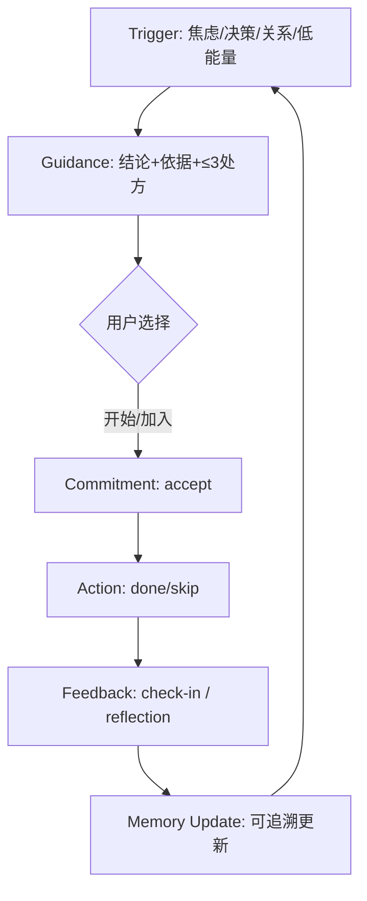
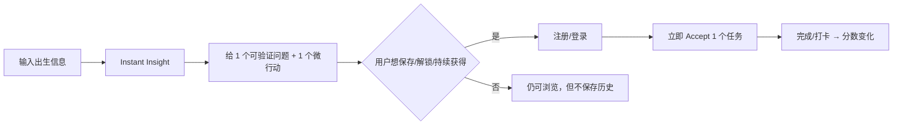
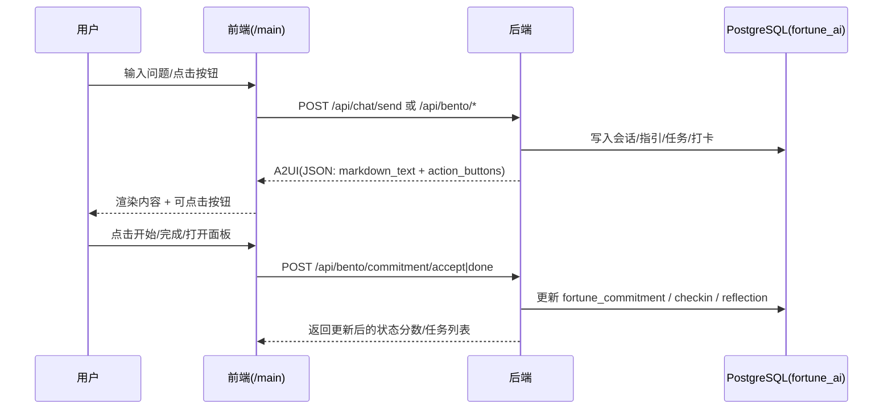
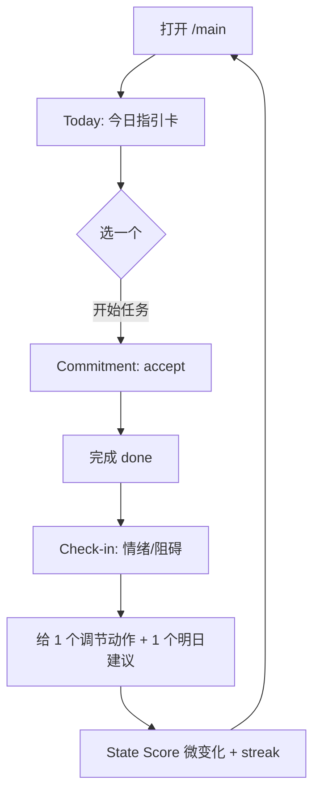
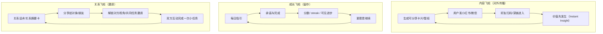

# Fortune AI：PMF 关键需求与功能设计（基于 `fortune_ai/docs`）（Codex）

> 角色视角：硅谷创业者 × 用户需求分析 × 用户增长  
> 目标：从现有 OS + 前端 + 数据/接口基础出发，找出最重要的用户需求与痛点，设计最小但完整的功能闭环（PMF），并明确优先级、指标与增长路径。  
> 约束对齐：纯 AI（不引入真人服务）/ 不做社区 / Web 端可落地 / 业务 SSOT=PostgreSQL（DB=`fortune_ai`）/ 交互协议=A2UI（可执行动作必须可点击）。

---

## 0. 一页结论（先把方向钉死）

### 0.1 PMF 的一句话

**Fortune AI 的 PMF 不是“算得准”，而是：让用户在 30 秒内获得「被理解 + 下一步能做什么」，并在 10 分钟内完成 1 个可追溯行动闭环，从而把依赖从“反复追问”迁移到“稳定行动”。**

### 0.2 现阶段最重要的 5 个需求（按 PMF 权重排序）

| 排名 | 需求（用户语言） | 真实痛点 | 我们的“系统解法” | 核心指标 |
|---:|---|---|---|---|
| 1 | “我现在很焦虑/迷茫，你能不能直接告诉我该怎么办？” | **意义断裂 + 效能断裂**：解释不够 / 或解释后无行动抓手 | `Guidance Card`（结论/依据/≤3处方）+ 一键 `Commitment` | `WCG`、`commitment_accept_rate` |
| 2 | “我不知道该问什么，越问越乱。” | **Prompt Anxiety**：开放式对话成本太高 | `Clarify` 结构化（选项/约束/时间窗）+ `Decision Brief` 模板 | `clarify_complete_rate` |
| 3 | “我想变好，但坚持不住，太枯燥。” | **反馈周期长**，成长不可见 | `Check-in` + `State Score` + 2/5/15 分钟任务梯度 | `D1/D7`、`action_done_rate` |
| 4 | “我需要一个能长期记住我、且可纠错的系统。” | AI 乱记/改口 → 不信任 | `facts_hash + kb_refs + rule_ids` 追溯 + `Update Diff` 纠错/暂停 | `trust_events`、纠错完成率 |
| 5 | “我想把它分享给朋友/对象，看看我们合不合/怎么相处。” | 社交谈资 + 关系焦虑 | 可分享卡片（脱敏）+ “解锁对方视角/双人副本”式邀请（非社区） | `share_rate`、`invite_accept_rate` |

### 0.3 PMF 的“最小闭环”定义（我们要把它跑顺）

**最小闭环 = 触发 → 指引 → 承诺 → 行动 → 反馈（可追溯）**



> 北极星指标：`WCG`（Weekly Closed-loop Guidance）——一周内完成 ≥1 次闭环。

---

## 1. 我们“已经有”的底层模块（决定我们应该做什么、不该做什么）

### 1.1 OS/交互底座（可直接复用）

| 模块 | 用户看到的形态 | 关键能力 | 典型接口（对齐 Final MVP） | SSOT（表） |
|---|---|---|---|---|
| Chat（咨询室） | 对话 | 共情承接 + 结构化解释 + 处方生成 | `POST /api/chat/send` | `fortune_conversation_*`、`fortune_commitment` |
| Bento/Workbench（工作台） | Today/Check-in/Commitment/Decision/Script/Plan | 把“建议”变成“可点击动作” | `GET /api/bento/today`、`POST /api/bento/checkin` 等 | `fortune_daily_guidance`、`fortune_checkin`、`fortune_commitment` |
| Plan（轨道） | 14/30 天计划 | 把成长做成节奏器 | `GET /api/plan/list`、`POST /api/plan/join`、`POST /api/plan/record` | `fortune_plan_*` |
| 反依赖护栏 | 限制反复占卜式追问 | 把用户拉回现实实验 |（策略层）|（事件/规则） |
| L0 “定数”快照 | 出生信息→事实快照 | 身份认同感/叙事锚点（但不宿命） | 注册/更新资料触发重算 | `fortune_bazi_snapshot`（含 `facts_hash`） |
| 深度报告引擎 | 长文交付物 | 高感知价值（付费点） | `POST /api/report/bazi/submit` | `fortune_external_job` |

### 1.2 当前“阻塞 PMF”的硬缺口（必须先补齐，否则谈不上 PMF）

| P 级 | 缺口 | 现象 | 对闭环的伤害 | 必须的修复标准 |
|---:|---|---|---|---|
| P0 | A2UI `action_buttons` 未渲染 | 后端返回按钮，前端点不到 | 处方无法变承诺 | **按钮可点击并正确映射动作**（`start_task/schedule_task/open_panel/opt_out`） |
| P0 | anti-dependency 截断了价值 | 触发 `daily_limit` 后只劝“先行动”但不给任务 | 用户得不到“下一步” | **即使限流也返回 ≥1 个可执行任务** |
| P0 | Plan/Reflection 未在前端落地 | 有 `/api/plan/*` 但 UI 缺失 | 无法建立周尺度留存 | **计划可加入/记录，复盘有入口** |
| P0 | Check-in 入口缺失或隐藏 | 只能通过 API 触发 | 用户无法自我调节 | **可见入口 + 1 次 check-in → 1 个调节动作** |
| P0 | `/new` 路由 basePath 不一致 | `/new/login` 的注册链接跳错 | 直接损伤转化 | **登录/注册/内链全部 basePath-aware** |

### 1.3 UI 形态的“最小一致性”（避免团队各写各的）

> 现网可能以 `/new` 承载新前端；Final MVP 文档以 `/main` 作为主入口。对 PMF 来说，**关键不是路径名，而是“左对话 + 右工作台 + A2UI 可执行”这套结构必须稳定**。

```text
┌──────────────────────────────────────────────────────────────────────────┐
│ Header: 会话切换 / Profile / Settings                                     │
├───────────────────────────────┬──────────────────────────────────────────┤
│ Zone A（Chat / Flow）          │ Zone B（Workbench / Bento / State）      │
│ - 对话线程（SSOT）             │ - Today（今日指引卡）                     │
│ - 结构化输出（callout/toggle） │ - Check-in（情绪打卡）                    │
│ - A2UI action_buttons          │ - Commitment（任务/承诺）                  │
│                               │ - Decision Brief（决策模板）               │
│                               │ - Script（话术）                           │
│                               │ - Plan（14/30 天轨道 + 记录/复盘）         │
└───────────────────────────────┴──────────────────────────────────────────┘
```

---

## 2. Beachhead：我们先服务谁（越窄越快 PMF）

> 原则：先选一个“高频刚需 + 感知价值强 + 可形成闭环”的人群，别同时服务所有人。

### 2.1 三类用户画像（并给出优先级）

| 优先级 | 画像 | 高频触发场景 | 他们愿意为啥付费 | 我们的切入点（Wedge） |
|---:|---|---|---|---|
| 1 | **不确定性焦虑的年轻人（20–35）** | 工作/感情/人际的决策焦虑 | “少走弯路 + 情绪稳定 + 可执行计划” | **每日指引 + 微行动 + 状态分数** |
| 2 | **“玄学审美 + 分享欲”人群（小红书/抖音）** | 好运壁纸/仪式感/毒舌推送 | “专属物料 + 传播社交货币” | **可分享图卡 + 轻仪式任务**（非社区） |
| 3 | **关系驱动人群（恋爱/亲密/同事）** | 合盘/吵架/沟通卡住 | “减少内耗 + 更会说 + 更会相处” | **Script + Relationship Brief**（先从“话术”切） |

> 暂缓：高净值/重决策（需要强背书），在“纯 AI、不真人”约束下不适合作为首个 PMF 目标。

### 2.2 JTBD（Jobs-To-Be-Done）拆解

| Job | 触发时刻 | 用户雇佣的替代品 | 最大阻力 | 我们的最短路径 |
|---|---|---|---|---|
| 缓解焦虑并获得方向 | 情绪高唤醒时 | 刷短视频/找朋友倾诉/算命 | 注意力分散、信息过载 | **Check-in → 1 个调节动作 → 1 个最小任务** |
| 把模糊问题变清晰 | “要不要/该不该” | 反复搜索/问 ChatGPT | Prompt Anxiety | **Decision Brief 模板化**（选项/约束/时间窗） |
| 获得身份解释与被看见 | “我是不是有问题” | MBTI/星座/八字报告 | 静态标签、难落地 | **L0 叙事锚点 + L1 行为证据**（不宿命） |
| 把成长变成可坚持的游戏 | 想变好但坚持不了 | 打卡 App/课程 | 反馈太慢 | **State Score + streak + 降级任务** |
| 关系更顺 | 吵架/冷战/不会说 | 朋友支招/短视频教程 | 难以迁移到自己 | **Script 一键生成 + 约束式表达** |

### 2.3 差异化：我们到底“凭什么赢”（对标竞品的最小比较）

| 维度 | 传统玄学/报告类 | 纯聊天 AI | Fortune AI（我们要交付的版本） |
|---|---|---|---|
| 价值主张 | “解释/预测” | “回答问题” | **“解释 → 行动 → 反馈”的闭环** |
| 交互成本 | 低（被动看） | 高（你得会问） | **低**（先结构化/模板化 + 少按钮） |
| 可执行性 | 弱（停在建议） | 不稳定（看心情输出） | **强**（A2UI 一键变承诺/任务） |
| 长期留存机制 | 依赖推送/续费 | 依赖聊天额度 | **State Score + Plan 轨道 + 可见进步** |
| 信任 | 玄学权威感强但不可证 | 易幻觉/改口 | **可追溯（facts_hash/kb_refs/rule_ids）+ 可纠错** |
| 传播 | 靠话题/还愿 | 难传播 | **可分享图卡/壁纸/关系摘要**（非社区） |

---

## 3. “最重要需求”如何映射到功能（用现有模块拼出 PMF）

### 3.1 需求 → 功能 → 数据（把 PMF 做成可实现清单）

| Top 需求 | 产品机制（用户感知） | 复用的底座能力 | 数据闭环（SSOT） | 关键验收 |
|---|---|---|---|---|
| 立即得到“下一步” | 每次输出 ≤3 个按钮任务 | A2UI + Commitment | `fortune_commitment`（suggested→active→done） | `action_buttons` 可执行且幂等 |
| 不知道问什么 | 先问 1–3 个结构化问题 | Clarify/Decision Brief | `fortune_conversation_message` + 结构化 brief | Clarify 完成率提升 |
| 坚持不住 | 2/5/15 分钟梯度 + 降级任务 | Workbench/任务系统 | `fortune_plan_record`、`fortune_checkin` | `D1` 任务完成率 |
| 信任与可纠错 | “将更新…原因…”可纠正 | facts/evidence | `facts_hash + kb_refs + rule_ids` | “纠错”可回放 |
| 可分享/可传播 | 一键生成脱敏分享卡 | 前端资产层 + 深链 | `fortune_push_event`/分享事件 | 分享转化漏斗可统计 |

### 3.2 “Aha Moment”设计：30 秒看到价值，10 分钟形成证据

**推荐首访路径（价值先发生，再注册）**：



**关键点**：
- “洞察”必须是：**短、个性化、可验证、可行动**（避免长文玄学墙）。
- 注册的理由必须是：**保存/连续性/推送/解锁**，而不是“为了注册而注册”。

### 3.3 MVP 功能清单（按 Tab/Panel，直接对齐工程落地）

| Tab/Panel | 用户一眼能做什么 | 系统必须返回什么 | 典型“可验收”细节 | 主要指标 |
|---|---|---|---|---|
| Today | 看到 1 张今日卡并点一个动作 | `Guidance Card` + `action_buttons` | 处方 ≤3；主按钮明显；点了就变任务 | `guidance_shown`、`commitment_made` |
| Check-in | 选情绪/强度并立即得到调节动作 | 1 个“调节动作任务” + 可开始按钮 | 情绪高唤醒时先调节再决策；不说教 | `checkin_submitted`、`action_done` |
| Commitment | 接受/完成/延期 | 任务列表 + 状态反馈 | 2/5/15 分钟梯度；失败→降级任务 | `action_done_rate` |
| Decision Brief | 填选项/约束生成最小验证 | 结构化 brief + 1 个实验任务 | 必须输出“下一步实验” | `clarify_complete_rate` |
| Script | 一键生成话术 | 可复制短脚本 + 约束说明 | tone/长度可选；避免升级冲突 | `script_copy_rate` |
| Plan | 加入计划/每日记录/周复盘 | 当天指令 + 记录入口 | 计划“开箱即用”；复盘日自动出现表单 | `plan_join_rate`、`plan_record_rate` |
| Explore（后置） | 看深度报告/玄学产物 | 报告阅读模式（长文交付） | 不影响主闭环；作为付费点 | `report_submit`、`paid_rate` |

---

## 4. 关键流程（把闭环做成工程可落地的协议）

### 4.1 A2UI：从“文字建议”到“可执行闭环”的唯一协议



### 4.2 日常循环（Daily Loop）：留存的真正发动机



### 4.3 决策循环（Decision Loop）：把“焦虑”变成“最小验证实验”

| 阶段 | 用户输入 | 系统输出（必须） | 常见坑 | 修复 |
|---|---|---|---|---|
| Clarify | “要不要换工作” | 选项/约束/时间窗/风险边界 | 讲一堆道理 | 先结构化再解释 |
| Prescription | — | ≤3 个微行动（含 1 个最小验证） | 任务过大 | 2/5/15 分钟梯度 |
| Commitment | — | “你愿意先做哪一个？”按钮 | 无按钮 | A2UI 强制 |
| Feedback | “做了/没做” | 一句话复盘 + 下次降级 | 责备用户 | 失败无羞耻 + 降级 |

---

## 5. 增长：在“不做社区”约束下，仍然做出飞轮

### 5.1 三个增长飞轮（内容 / 成长 / 关系）



### 5.2 渠道策略矩阵（只保留“可执行”的打法）

| 渠道 | 核心目标 | 最小内容单元（可规模化） | 转化钩子 | 关键指标 |
|---|---|---|---|---|
| 小红书 | 种草/信任 | 好运壁纸/能量图/“今日一句话”图卡 | 二维码深链 + “解锁完整版” | `share→visit→birth_submit` |
| 抖音/TikTok | 曝光/病毒 | 3 秒钩子短视频（毒舌/反转） | 评论区引导“测你的今日卡” | `CTR→visit` |
| 微信/私域 | 留存/LTV | 每日推送（轻）+ 周复盘（重） | “保存画像/连续追踪” | `push_open_rate`、`WCG` |
| SEO/长文 | 长尾 | 深度报告样章 + 方法论文章 | “生成你的版本” | `organic→submit` |

### 5.3 分享载体清单（先做 3 套模板就够）

| 模板 | 场景 | 内容结构 | 默认脱敏策略 |
|---|---|---|---|
| 今日指引卡 | 小红书/朋友圈 | 一句话结论 + 1 个任务 + 二维码 | 不显示具体事件，仅显示“方向词” |
| 状态分数卡 | 私域激励 | 分数变化（±）+ streak + 1 句原因 | 隐藏数值区间（如“上升/下降”）可切换 |
| 关系话术卡 | 对象/朋友 | “你可以这么说” + 3 句短话术 | 隐去姓名/称谓，使用占位符 |

---

## 6. 变现：把商业模型嵌入闭环，但不绑架闭环

### 6.1 付费点设计（从“交付物”开始，而不是从“道具系统”开始）

| 付费形态 | 用户愿意付费的理由 | 最先落地的 SKU | 风险与边界 |
|---|---|---|---|
| 订阅 | 连续性 + 历史 + 更高额度 | `Cosmic Pass`：更多对话/更长回放/更多计划 | 禁止恐吓式转化 |
| 内购（一次性） | 明确交付物 | 八字/关系/事业主题深度报告 | 必须可追溯、可解释 |
| 虚拟物品（后置） | 仪式感/收集癖 | 主题皮肤/分享卡模板 | 容易拖慢 PMF，建议 P2 |

### 6.2 免费层必须保留“闭环能力”

**免费层也必须能完成一次闭环**（否则留存永远起不来）：
- 每日 1 张指引卡
- 至少 1 次 check-in
- 至少 1 个可执行任务

---

## 7. 指标体系：如何判断我们接近 PMF

### 7.1 北极星与分层指标

| 层级 | 指标 | 定义 | 为什么是它 |
|---|---|---|---|
| 北极星 | `WCG` | 周内完成 ≥1 次闭环 | 直接度量“指导→行动→反馈” |
| 激活 | `A1` | 首次会话 10 分钟内完成 `accept+done` 任一任务 | “价值发生”而非“浏览” |
| 留存 | `D1/D7` | 次日/7 日回访 | 能否形成习惯 |
| 信任 | `correction_rate` | 用户对更新做“纠正/暂停”的比例与完成率 | 长期记忆系统是否可信 |
| 增长 | `share_rate` | 每周分享卡片/深链的用户占比 | 是否形成外部飞轮 |
| 变现 | `trial_to_paid` | 试用→付费转化 | 定价与价值是否匹配 |

### 7.2 PMF 实验路线（建议 2 周一个闭环）

| 周期 | 假设 | 实验 | 成功阈值（示例） |
|---|---|---|---|
| Week 1 | 价值先发生的 onboarding 提升激活 | 生日先行→instant insight→注册后置 | `A1` +30% |
| Week 2 | A2UI 可点击显著提升闭环率 | action_buttons 全量落地 | `WCG` +20% |
| Week 3 | Check-in + 降级任务提升 D1 | 情绪高唤醒→先调节再任务 | `D1` +10% |
| Week 4 | 分享卡带来低成本新增 | 3 套分享模板 + 深链 | `share→visit` 转化可复制 |

### 7.3 事件口径（最小埋点字典，保证“可统计/可回放”）

> 口径对齐：闭环事件最好直接由 SSOT 表推导，避免纯前端埋点丢失。

| 事件 | 推荐“真源”表 | 判定规则（示例） |
|---|---|---|
| trigger | `fortune_push_event` / `fortune_conversation_message` | 用户打开/点击/发起任一交互 |
| guidance_shown | `fortune_daily_guidance` / message.a2ui | 当日卡已生成且被展示 |
| commitment_made | `fortune_commitment` | `accepted_at IS NOT NULL` |
| action_done | `fortune_commitment` | `status='done'` |
| feedback | `fortune_checkin` / `fortune_reflection` | 有打卡或复盘记录 |

---

## 8. 优先级：RICE（用“能否推到 PMF”来打分）

> 说明：以下为**示例分数**（用于排序）；上线后应以真实周触达与实验结果回填。

| 项目 | Reach（周触达） | Impact（对 WCG） | Confidence | Effort（人周） | RICE |
|---|---:|---:|---:|---:|---:|
| A2UI 按钮渲染 + 动作映射 | 5 | 5 | 0.9 | 1 | 22.5 |
| Check-in 可见入口（并回任务） | 5 | 4 | 0.8 | 1 | 16.0 |
| anti-dependency 调整（不截断价值） | 4 | 4 | 0.6 | 1 | 9.6 |
| Plan UI 接入（加入/记录/提醒） | 4 | 4 | 0.7 | 2 | 5.6 |
| 价值先发生 onboarding（生日→洞察→注册） | 4 | 3 | 0.7 | 2 | 4.2 |
| 分享卡生成器（脱敏模板×3） | 3 | 3 | 0.6 | 2 | 2.7 |
| Script（话术）面板（短/专业） | 3 | 2 | 0.7 | 2 | 2.1 |
| 深度报告入口（IAP） | 2 | 2 | 0.7 | 2 | 1.4 |

### 8.1 4 周落地节奏（对齐 Final MVP 的工程边界）

| 周 | 目标 | 交付物（最小集） |
|---|---|---|
| Week 1 | “能登录 + 能跑通一次闭环” | basePath 修复 + A2UI 按钮渲染 + Commitment accept/done 稳定 |
| Week 2 | “能解释且可追溯” | facts/evidence 注入 + 关键事件埋点口径落表 |
| Week 3 | “能留存” | Today + Check-in UI + 降级任务策略 + Push 频控 |
| Week 4 | “能形成周尺度习惯” | Plan UI 接入（join/record）+ 周复盘入口 |

---

## 9. 结论来源与对齐清单（可审计）

| 本文关键结论 | 主要依据文档（路径） |
|---|---|
| 闭环定义与 WCG | `fortune_ai/docs/architech/system_design_final_mvp.md` |
| OS 心理底座（自我-自性轴线、外部化） | `fortune_ai/docs/os/os_design_codex_mvp.md`、`fortune_ai/docs/os/os_design_claude_mvp.md` |
| 当前 /new 的阻塞问题与缺口 | `fortune_ai/docs/os/case_test_codex.md` |
| 注册“价值先发生”路径 | `fortune_ai/docs/architech/frontend_registration_design_v1.md` |
| 前端双栏/资产层/分享机制 | `fortune_ai/docs/frontend/frontend_final_v1.md`、`fortune_ai/docs/architech/frontend_interaction_design_v2.md` |
| 增长与社交飞轮（不做社区的传播） | `fortune_ai/docs/architech/bp v1.md` |
| State Score/WOOP/变现框架 | `fortune_ai/docs/architech/idea business model.md` |
| 市场与用户心理（Prompt Anxiety/视觉灵性/仪式感） | `fortune_ai/docs/architech/_archive/survey social.md`、`fortune_ai/docs/architech/_archive/survey other product.md` |
| Tieban/Bazi 等“可交付物”能力 | `fortune_ai/docs/tieban/tieban_module_guide.md`、`fortune_ai/docs/bazi/bazi new spec.md` |

---

## 10. 下一步（如果你要我继续）

1) 把本 PMF 文档的 P0 清单，转成可执行的工程任务拆解（按 API/前端/DB 分组）。  
2) 结合你们真实埋点现状，给出 `WCG` 统计 SQL 与仪表盘口径。  
3) 设计 3 套“可分享图卡模板”（小红书竖图 / 微信卡片 / 朋友圈长图）并对齐前端实现成本。
