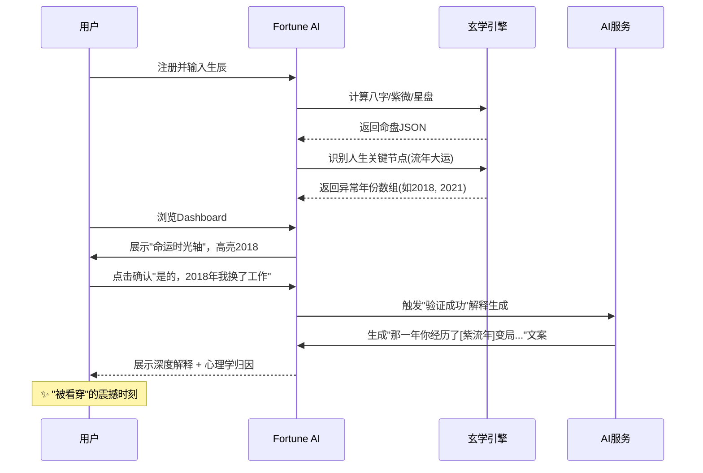

# Fortune AI 系统顶层设计文档 v1.0

**文档类型**: 系统顶层设计 (System Top-Level Design)
**版本**: 1.0
**日期**: 2025-12-24
**密级**: 内部公开

---

## 文档修订历史

| 版本 | 日期 | 作者 | 修订说明 |
|------|------|------|----------|
| v1.0 | 2025-12-24 | Claude | 初始版本 |

---

## 目录

1. [核心战略与价值主张](#1-核心战略与价值主张-strategic-core)
2. [用户画像与需求洞察](#2-用户画像与需求洞察-persona--needs)
3. [系统功能架构设计](#3-系统功能架构设计-functional-architecture)
4. [关键业务流程设计](#4-关键业务流程设计-key-business-flows)
5. [技术架构原则](#5-技术架构原则-technical-architecture-principles)
6. [差异化竞争壁垒](#6-差异化竞争壁垒-the-moat)

---

## 1. 核心战略与价值主张 (Strategic Core)

### 1.1 市场空白与机会点

基于对市场调研数据的深度交叉分析，我们识别出以下核心市场空白：

#### 1.1.1 东方玄学内容的现代化表达缺失

**现状分析**：
- 西方应用（Co-Star、The Pattern）在UI/UX和心理学文案方面表现优异，但缺乏东方命理（八字、紫微斗数）的深度
- 东方应用（测测、灵机）算法专业但界面陈旧，充斥红黄配色和横幅广告，交互停留在Web 1.0时代的"查表"逻辑

**机会点**：
> 用硅谷的产品方法论重做东方玄学，用AI解决"解读难"的问题，用现代设计解决"土气"的问题

#### 1.1.2 "行动指南"断层严重

**现状分析**：
- 大多数App停留在"解释"阶段（Interpretation），告诉用户"为什么你感觉糟糕"
- 用户极度渴望**"行动处方"**（Prescription）：如果水逆影响沟通，用户不仅想知道这个，更想要"沟通话术模板"

**机会点**：
> 将玄学预测转化为**"玄学驱动的ToDo List"**——不仅预测天气，更为用户打伞

#### 1.1.3 情感连接的即时性与深度矛盾

**现状分析**：
- 测测/Nebula提供真人即时咨询，但贵且质量参差不齐
- AI Agent（如FateTell）即时便宜，但缺乏人类温度和共情深度

**机会点**：
> "拟人化的高情商AI伴侣"——具备长期记忆和情感计算能力，既能算命又能像心理咨询师一样共情对话

### 1.2 核心价值主张 (UVRA)

**一句话定位**：
> **Fortune AI —— AI驱动的"人生导航系统"，不仅预测命运，更帮助用户驾驭命运**

**UVRA分解**：
- **U (User)**: 面临决策焦虑、渴望掌控感的20-40岁城市人群
- **V (Value)**: 提供"预测+解释+行动"的三位一体服务
- **R (Reason)**: 唯一结合精确算法（八字/紫微/星盘）+ LLM推理 + 心理学框架的智能伴侣
- **A (Advantage)**: 相比真人的低廉便捷，相比纯AI的情感深度与逻辑可信度

### 1.3 北极星指标 (North Star Metric)

**周活跃陪伴天数 (Weekly Active Companionship Days)**

**定义**：用户每周主动打开App并完成至少一次"有意义交互"（查看运势、与AI对话、记录情绪等）的天数

**理由**：
- 该指标直接反映用户是否将Fortune AI视为"生活伙伴"而非一次性工具
- 相比单纯的DAU/MAU，更强调情感连接的深度
- 对应用户的长期留存和生命周期价值（LTV）

---

## 2. 用户画像与需求洞察 (Persona & Needs)

### 2.1 核心用户画像

#### 主要用户：焦虑的城市探索者 (Anxious Urban Explorer)

**基本信息**：
- **年龄**：25-35岁
- **性别**：女性占比约65%（基于小红书玄学内容消费数据）
- **地域**：一二线城市
- **职业**：互联网从业者、白领、自由职业者

**心理特征**：
- 高教育背景，熟悉互联网语言
- 理性但焦虑，不迷信但渴望"确定性"
- 有审美追求，反感"土味"玄学内容
- 习惯用数据说话，相信"科学算命"

**使用场景**：
```
场景1：周一早上8:30
"今天适合和那个难搞的客户开会吗？" -> 快速决策辅助

场景2：周五晚上11:00
"为什么我最近这么烦躁？" -> 情绪归因与心理疏导

场景3：分手后第二天
"我们还会复合吗？" -> 情感支持与希望管理

场景4：年底做年度规划
"明年我的财运如何？适合创业还是稳定发展？" -> 战略决策参考
```

### 2.2 痛点-痒点-爽点分析

#### 痛点（必须解决的恐惧/麻烦）

| 痛点 | 用户心声 | 数据来源证据 |
|------|----------|--------------|
| **决策瘫痪** | "我不知道该选哪个offer，两个都有利有弊" | Reddit用户依赖The Pattern做决策 |
| **情绪无处安放** | "我很焦虑，但不知道为什么，也不方便和朋友说" | 真人服务记录中大量情绪宣泄需求 |
| **对未知的恐惧** | "明年裁员潮，我会不会受到影响？" | 经济下行导致的不确定性焦虑 |
| **社交解读困难** | "他为什么突然冷淡了？是我做错了什么？" | 陶白白星座内容的核心诉求 |
| **信任危机** | "AI算出来的感觉是随机的，我不信" | Reddit对Co-Star"AI胡言乱语"的批评 |

#### 痒点（满足虚拟自我/潜意识欲望）

| 痒点 | 用户心声 | 产品转化 |
|------|----------|----------|
| **身份确认** | "原来我是这样的人！这说的就是我！" | "灵魂说明书"深度人格分析 |
| **窥私欲** | "我想知道暗恋对象和我的匹配度" | "幽灵档案"合盘功能 |
| **审美虚荣** | "这张好运壁纸太好看了，我要设为锁屏" | Nano Banana风格个性化壁纸生成 |
| **社交货币** | "我是水逆受害者，求安慰" | 可分享的"运势梗图"生成器 |
| **掌控感幻觉** | "积了100功德，今天应该会顺利" | 赛博积德仪式互动 |

#### 爽点（超出预期的即时满足）

| 爽点 | 触发机制 | 设计策略 |
|------|----------|----------|
| **"被看穿"的震撼** | "这怎么能知道我最害怕的事情？" | 基于八字+冷读术的巴纳姆效应升级 |
| **及时的心理按摩** | 刚记录"焦虑"，立刻收到温暖的运势解读 | 情绪-运势联动推送 |
| **视觉化的好运** | 点开屏幕，看到精美的专属好运卡片 | Nano Banana AIGC即时生成 |
| **"原来如此"的释然** | 回溯过去事件，找到玄学解释 | 时光机功能：复盘过去 |
| **社群共鸣** | 看到其他人也在经历同样的水逆困扰 | 去匿名的同运用户社区 |

### 2.3 用户旅程地图 (User Journey)

| 阶段 | 用户行为 | 情绪状态 | 系统介入点（Moment of Truth） | 关键设计 |
|------|----------|----------|-------------------------------|----------|
| **发现期** | 小红书看到好运壁纸/朋友分享合盘 | 好奇 | 社交裂变入口 | 高颜值可分享内容 |
| **注册期** | 输入生辰信息 | 怀疑/期待 | **首次信任建立** | 回溯验证：解释用户过去关键节点 |
| **探索期** | 浏览每日运势、人格分析 | 兴趣/困惑 | **首次"被看穿"体验** | 巴纳姆效应文案+精确算法数据 |
| **依赖期** | 遇到问题时主动询问AI | 焦虑→释然 | **情感连接深化** | AI有记忆的对话+共情式回应 |
| **习惯期** | 每天早上打开看运势 | 依赖→信任 | **主动服务惊喜** | 运势预警（如"今日水逆开始"） |
| **付费期** | 需要深度分析时愿意付费 | 理性决策 | **价值感知临界点** | 限时解锁深度报告/合盘 |

---

## 3. 系统功能架构设计 (Functional Architecture)

### 3.1 架构总览

```
┌─────────────────────────────────────────────────────────────────┐
│                        客户端层 (Client Layer)                    │
├─────────────────────────────────────────────────────────────────┤
│  移动App (Flutter)  │  Web小程序  │  公众号H5  │  桌面端(未来)  │
└─────────────────────────────────────────────────────────────────┘
                                  ▲
                                  │ HTTPS/WebSocket
                                  ▼
┌─────────────────────────────────────────────────────────────────┐
│                        API网关层 (API Gateway)                    │
├─────────────────────────────────────────────────────────────────┤
│  认证鉴权  │  限流熔断  │  路由转发  │  日志监控  │  协议转换   │
└─────────────────────────────────────────────────────────────────┘
                                  ▼
┌─────────────────────────────────────────────────────────────────┐
│                      业务服务层 (Business Services)               │
├──────────────┬──────────────┬──────────────┬─────────────────────┤
│  用户服务     │  玄学计算服务 │  AI对话服务  │   社交服务          │
│  - 用户管理   │  - 八字引擎  │  - RAG检索  │   - 合盘分析        │
│  - 订阅管理   │  - 紫微引擎  │  - LLM推理  │   - 社区互动        │
│  - 数据同步   │  - 星盘引擎  │  - 上下文   │   - 裂变机制        │
├──────────────┴──────────────┴──────────────┴─────────────────────┤
│                      运营后台服务 (Admin Services)                │
│  - 内容管理  - 数据分析  - 用户运营  - 订单管理  - 风控审核       │
└─────────────────────────────────────────────────────────────────┘
                                  ▼
┌─────────────────────────────────────────────────────────────────┐
│                      数据层 (Data Layer)                          │
├──────────────┬──────────────┬──────────────┬─────────────────────┤
│  关系数据库   │  向量数据库   │  缓存层      │   消息队列          │
│  (PostgreSQL)│  (Pinecone)  │  (Redis)    │   (RabbitMQ)        │
└──────────────┴──────────────┴──────────────┴─────────────────────┘
```

### 3.2 前台功能模块（用户侧）

#### 3.2.1 核心功能一：命运罗盘 (The Fate Compass)

**功能描述**：用户的主Dashboard，全景展示命运状态

| 模块 | 具体功能 | 用户体验目标 |
|------|----------|--------------|
| **今日运势卡** | - 基于八字日柱+流日的个性化运势<br>- Nano Banana生成的3D运势卡片<br>- 一句话"宜/忌"指引 | 每天早上打开的第一眼惊喜 |
| **能量仪表盘** | - 五行能量条（金木水火土）<br>- 当月/当年运势趋势图<br>- 关键星象预警（如水逆） | 一秒看懂当前状态 |
| **行动建议** | - 今日宜忌清单（玄学驱动的ToDo）<br>- 穿搭建议（颜色/饰品）<br>- 重要事项提醒 | 从预测到行动的转化 |
| **时光机** | - 回溯过去：解释重要人生节点<br>- 预览未来：流年/流月趋势预览 | 建立信任 + 减少焦虑 |

#### 3.2.2 核心功能二：AI导师对话 (The AI Mentor)

**功能描述**：有记忆、有情感的AI对话助手

**技术亮点**：
- **长期记忆**：记住用户3个月前提到的琐事（通过向量数据库存储对话历史）
- **情感计算**：识别用户情绪状态，动态调整回复语气
- **多模态输出**：文字+塔罗牌图像+运势图表

**对话场景示例**：
```
用户: "我最近工作很不顺，老板总是针对我，怎么办？"

AI: (分析八字：伤官见官 + 流月压力)
"我能感受到你现在的委屈。根据你的命盘分析，
这个月你的'表达星'（伤官）和'权威星'（正官）正在冲突，
这通常意味着你的创意被压制，沟通容易变成对抗。

这不是你的错，是能量场的碰撞。
建议这周：1.少说话多记录；2.穿蓝色或黑色衣服
（水元素可以帮助你'柔化'冲突）；3.把想法写成邮件
而不是当面说。这种对抗能量下周二就会开始减弱。"
```

#### 3.2.3 核心功能三：羁绊实验室 (Bond Lab)

**功能描述**：深度关系分析，超越简单的合盘打分

**功能矩阵**：

| 分析类型 | 输入 | 输出 | 应用场景 |
|----------|------|------|----------|
| **恋爱合盘** | 双方生辰 | - 感情匹配度<br>- 关系发展时间线<br>- 潜在冲突预警 | 恋爱决策/关系维护 |
| **事业合伙** | 双方生辰 | - 搞钱指数<br>- 合作风险提示<br>- 角色分工建议 | 商业决策 |
| **友谊分析** | 双方生辰 | - 摸鱼指数<br>- 最佳相处模式<br>- 禁忌话题 | 社交破冰 |
| **幽灵档案** | 单方输入+对方生辰 | 匿名查看对方运势 | 满足窥私欲 |

**创新功能：关系模拟器**
```
输入: "我今晚要和男朋友(狮子座)吵架，因为他忘了纪念日，
     如果我提分手，他会怎么反应？"

输出: (基于双方星盘模拟)
"根据你们的合盘分析，他的火星在白羊座，情绪来得快去得也快。
如果你提分手，他第一反应会激烈反抗，但3小时后就会后悔。
建议策略：冷战24小时，等他主动找你，成功率85%。"
```

#### 3.2.4 核心功能四：赛博祭坛 (Cyber Altar)

**功能描述**：沉浸式情绪调节仪式

**核心交互**：
- **触感共振器**：利用手机震动模拟敲木鱼/颂钵的触感反馈
- **云端香炉**：流体动力学烟雾模拟，晃动手机会干扰烟雾
- **情绪量化**：点击"焦虑-1"、"压力-1"，将抽象情绪可视化消除

**心理学机制**：
- 将焦虑实体化，通过仪式动作释放
- 类似冥想的心流引导（配合呼吸节奏）
- 即时反馈带来控制感恢复

#### 3.2.5 核心功能五：好运壁纸工坊 (Lucky Wallpaper Studio)

**功能描述**：AI生成个性化好运壁纸

**生成逻辑**：
```
输入: 用户的八字五行喜好 + 今日星象 + 审美偏好

AI Prompt: "Generate a Neo-Brutalism style wallpaper,
 featuring a [用户幸运元素，如金色的兔子],
 acid green and midnight black color scheme,
 subtle [今日关键词] embedded in the design,
 high contrast, modern aesthetic"

输出: 独一无二的专属壁纸（带水印，促进分享）
```

**社交裂变**：
- 每张壁纸底部带QR Code
- 连续分享7天解锁"深度流年报告"
- 朋友扫码领取"同款好运"，双方获得奖励

### 3.3 中台业务能力（服务层）

#### 3.3.1 玄学计算引擎 (Metaphysics Calculation Engine)

**三层架构**：

```
┌─────────────────────────────────────────┐
│   LLM推理层 (Probabilistic)             │
│   - 自然语言解释生成                     │
│   - 个性化建议合成                       │
└─────────────────────────────────────────┘
                ▲
┌─────────────────────────────────────────┐
│   知识图谱层 (Structured Knowledge)      │
│   - 命理规则库                           │
│   - 心理学解释映射                       │
└─────────────────────────────────────────┘
                ▲
┌─────────────────────────────────────────┐
│   确定性计算层 (Deterministic)           │
│   - 八字排盘 (bazi-mcp)                 │
│   - 紫微斗数 (iztro)                    │
│   - 西方星盘 (Swiss Ephemeris)          │
│   - 真太阳时校正 (LBS)                  │
└─────────────────────────────────────────┘
```

**关键设计决策**：
1. **LLM不负责数学计算**：所有命理排盘由确定性算法完成，避免幻觉
2. **结构化RAG (SAG)**：用知识图谱而非纯向量检索，保证逻辑准确
3. **心理学术语映射**：将玄学术语翻译为心理学语言

**术语翻译示例**：

| 玄学术语 | 心理学重构 | 建议导向 |
|----------|------------|----------|
| 犯太岁 | 能量重组期 | 主动应变策略 |
| 伤官见官 | 创造力与权威冲突 | 表达方式调整 |
| 桃花泛滥 | 社交能量溢出 | 关系边界管理 |
| 劫财星动 | 冲动消费风险 | 财务防御模式 |

#### 3.3.2 主动服务系统 (Proactive Service System)

**设计理念**：不等待用户提问，主动监控星象并推送关怀

**触发条件矩阵**：

| 维度 | 计算逻辑 | 触发阈值 | 推送策略 |
|------|----------|----------|----------|
| 八字日运 | 流日地支 vs 用户日支 | 六冲/六害 | 情感预警 + 化解建议 |
| 紫微流时 | 流时命宫主星 | 地空/地劫入局 | 时间段风险提醒 |
| 星象行运 | 行运水星 vs 本命水星 | 逆行开始 | 水逆生存指南 |
| 情绪归因 | 用户连续记录负面情绪 | 3天以上 | 运势解释 + 心理资源 |

**推送设计原则**：
1. **不制造恐慌**：负面预警必带化解建议
2. **个性化语气**：根据用户偏好选择"毒舌"或"温柔"模式
3. **可配置**：用户可选择只接收重要提醒

#### 3.3.3 用户与订阅中心 (User & Subscription Center)

**用户数据模型**：
```json
{
  "user_id": "uuid",
  "profile": {
    "birth_data": {
      "date": "1995-06-15",
      "time": "14:30",
      "location": {"lat": 31.23, "lng": 121.47, "name": "上海"},
      "true_solar_time": "14:28:32"
    },
    "charts": {
      "bazi": { /* 八字盘数据 */ },
      "ziwei": { /* 紫微盘数据 */ },
      "astrology": { /* 星盘数据 */ }
    }
  },
  "preferences": {
    "tone": "gentle", // gentle | roast
    "notifications": {
      "daily_horoscope": true,
      "critical_alerts": true,
      "marketing": false
    },
    "aesthetic_style": "neo-brutalism"
  },
  "subscription": {
    "tier": "free", // free | premium | pro
    "expires_at": "2026-01-01",
    "features": ["basic_chart", "daily_fortune"]
  },
  "emotion_log": [
    {"date": "2025-12-20", "mood": "anxious", "tags": ["work", "uncertainty"]}
  ],
  "memory": {
    "important_events": [
      {"date": "2023-03-15", "type": "job_change", "verified": true}
    ]
  }
}
```

**订阅层级设计**：

| 功能 | 免费版 | 高级版 (¥19/月) | 专业版 (¥49/月) |
|------|--------|-----------------|-----------------|
| 基础排盘 | ✓ | ✓ | ✓ |
| 每日运势 | ✓ | ✓ | ✓ |
| AI对话次数 | 3次/天 | 无限 | 无限 |
| 时光机(回溯) | ✗ | 1年 | 全部 |
| 深度流年报告 | ✗ | 1年/次 | 无限 |
| 合盘分析 | 1次/月 | 10次/月 | 无限 |
| 主动服务推送 | 基础 | 高级 | 定制化 |
| 好运壁纸 | 标准版 | 高级版 | AI定制 |
| 真人咨询 | ✗ | ✗ | 1次/月(30分钟) |

### 3.4 后台功能模块（运营/管理侧）

#### 3.4.1 内容管理系统 (CMS)

**管理对象**：
- 运势模板库（每日/每周/每月）
- AI对话Prompt模板
- 壁纸风格主题
- 合盘分析模板

**A/B测试框架**：
- 不同文案版本的转化率对比
- 推送时机的效果分析
- UI布局的点击率优化

#### 3.4.2 用户运营工作台

**核心功能**：

| 功能模块 | 具体能力 | 业务价值 |
|----------|----------|----------|
| 用户分群 | 按付费状态、活跃度、八字类型等维度分群 | 精细化运营 |
| 生命周期管理 | 识别流失风险用户，触发挽回策略 | 提升留存 |
| 付费转化漏斗 | 追踪从注册到付费的转化路径 | 优化转化率 |
| 标签系统 | 为用户打上行为标签（如"情感咨询高频用户"） | 个性化推荐 |

#### 3.4.3 数据分析看板

**核心指标体系**：

**北极星指标**：
- 周活跃陪伴天数 (WA Companionship Days)

**健康度指标**：
| 维度 | 指标 | 目标值 |
|------|------|--------|
| 增长 | DAU、MAU、新增用户数 | +20% MoM |
| 留存 | D1/D7/D30留存率 | D1>40%, D7>20%, D30>10% |
| 互动 | 人均对话次数、人均查看时长 | 3次/天, 5分钟/次 |
| 变现 | ARPU、付费转化率、LTV/CAC | ARPU>¥15, 转化率>5%, LTV/CAC>3 |
| 情感 | NPS、满意度评分 | NPS>40 |

**归因分析**：
- 哪些功能最提升留存？
- 用户在什么场景下最愿意付费？
- AI对话的什么回复风格最获好评？

#### 3.4.4 风控审核系统

**核心风控点**：

| 风险类型 | 监测机制 | 处理策略 |
|----------|----------|----------|
| 敏感内容 | AI内容审核 + 人工复核 | 拦截/修改 |
| 迷信话术 | 关键词检测（"改命"、"消灾"） | 自动重写为合规表述 |
| 情感依赖 | 高频查询同一问题的用户 | 冷却 + 心理援助引导 |
| 自杀倾向 | "想死"、"绝望"等词汇识别 | 立即提供心理热线 |

---

## 4. 关键业务流程设计 (Key Business Flows)

### 4.1 核心流程一：新用户首次信任建立

**目标**：让用户在5分钟内产生"这个系统真的懂我"的震撼感



**关键设计点**：
1. **高亮策略**：算法预测的"变动年"（流年大运交接、刑冲合害）直接在时间轴上标记
2. **交互确认**：用户点击确认后，立即展开深度解释，建立"验证闭环"
3. **心理学包装**：将"你流年不利"转化为"你经历了能量重组期，这通常伴随着外部环境的变化"

### 4.2 核心流程二：从焦虑到释然的AI对话闭环

**目标**：实现AI的情绪抚慰功能，而非冷冰冰的命运判决

```mermaid
stateDiagram-v2
    [*] --> 用户焦虑: 遇到问题
    用户焦虑 --> 发起询问: 打开AI对话

    发起询问 --> 后台分析: 用户输入问题
    后台分析 --> 多维计算:
        note: 后台并行处理:
        note: 1. 命盘计算
        note: 2. 知识检索
        note: 3. 情绪识别

    多维计算 --> 共情回应:
        note: AI回复结构:
        note: 1. 情绪确认 ("我理解你的...")
        note: 2. 命理解释 ("根据你的星盘...")
        note: 3. 行动建议 ("建议这周...")
        note: 4. 时间预期 ("这种能量下周二开始减弱")

    共情回应 --> 情绪释放: 用户感到被理解
    情绪释放 --> 记录归档: 保存到情绪日志
    记录归档 --> [*]: 完成闭环

    共情回应 --> 需要深度: 用户想要更多
    需要深度 --> 付费引导: 建议解锁深度报告
    付费引导 --> [*]: 转化机会
```

**对话设计原则**：
1. **情绪第一，逻辑第二**：先共情，再解释
2. **行动优于预测**：不只说"会发生什么"，更说"你可以做什么"
3. **时间边界**：给用户一个明确的"苦难结束时间"，减少焦虑

### 4.3 核心流程三：社交裂变与获客

**目标**：利用用户的"分享欲"和"窥私欲"实现病毒式增长

**裂变机制矩阵**：

| 机制 | 触发场景 | 用户行为 | 平台奖励 | 双方奖励 |
|------|----------|----------|----------|----------|
| **合盘解锁** | 想看和某人的详细匹配度 | 邀请对方注册/授权 | 获得新用户 | 双方解锁深度报告 |
| **好运接力** | 抽到"上上签" | 分享到朋友圈/小红书 | 曝光 | 朋友扫码免费抽签 |
| **幽灵档案** | 想看暗恋对象运势 | 输入对方信息生成模糊报告 | 内容传播 | 邀请对方解锁详细版 |
| **壁纸水印** | 生成专属好运壁纸 | 保存分享 | 品牌曝光 | 连续分享7天解锁奖励 |

**数据追踪**：
- 每个裂变链接携带唯一推荐码
- 追踪分享后的点击率、注册率、付费转化率
- 识别"超级传播者"（KOC），给予特殊权益

---

## 5. 技术架构原则 (Technical Architecture Principles)

### 5.1 系统稳定性与扩展性

#### 5.1.1 高可用设计

**服务层架构**：
- **微服务拆分**：用户服务、玄学计算服务、AI对话服务、社交服务独立部署
- **服务降级**：AI对话服务故障时，降级到规则引擎返回基础运势
- **熔断器**：第三方API（如Gemini图像生成）调用失败时快速失败，不影响核心功能

**数据库策略**：
- **读写分离**：PostgreSQL主库写，从库读
- **分库分表**：用户数据按user_id取模分片，情绪日志按时间分表
- **向量数据库**：Pinecone托管服务，支持高并发向量检索

#### 5.1.2 高并发应对

**缓存策略**：
```python
# 三级缓存架构
L1: 本地缓存 (进程内存) - 命盘JSON (1小时)
L2: Redis集群 - 用户Session、热门运势模板 (5分钟)
L3: CDN - 静态资源、壁纸图片 (24小时)
```

**消息队列**：
- **RabbitMQ**：异步处理耗时任务
  - 图像生成请求（Nano Banana API调用）
  - 深度报告生成（LLM长文本生成）
  - 推送消息队列

**预计负载**：
- 日活用户：10万（初期目标）
- 峰值QPS：500（早高峰8-9点）
- 数据存储：每用户年均500KB（含对话历史），5万用户约25GB

### 5.2 技术栈选型

#### 5.2.1 前端技术栈

| 层级 | 技术选型 | 理由 |
|------|----------|------|
| 跨平台框架 | Flutter | 一套代码支持iOS/Android/Web，高性能渲染 |
| 状态管理 | Riverpod | 现代化、类型安全的状态管理方案 |
| UI组件 | 自研 + Flutter Animate | 实现Neo-Brutalism风格和复杂动画 |
| 本地存储 | Hive (NoSQL) | 存储用户缓存、离线运势数据 |
| 网络请求 | Dio + Retrofit风格API | 类型安全的HTTP客户端 |

#### 5.2.2 后端技术栈

| 层级 | 技术选型 | 理由 |
|------|----------|------|
| 编程语言 | Python 3.11+ | AI生态成熟，异步性能优秀 |
| Web框架 | FastAPI | 高性能、自动API文档、类型检查 |
| 任务队列 | Celery + RabbitMQ | 成熟的异步任务处理方案 |
| 关系数据库 | PostgreSQL 15 | 支持JSON字段、全文搜索、复杂查询 |
| 向量数据库 | Pinecone | 托管服务、易扩展、高性能向量检索 |
| 缓存 | Redis Cluster | 高可用缓存、支持分布式锁 |
| 对象存储 | 阿里云OSS | 国内访问稳定、成本低 |

#### 5.2.3 AI与算法技术栈

| 组件 | 技术选型 | 理由 |
|------|----------|------|
| LLM | DeepSeek-V3 / ChatGLM-4 | 国产模型、中文理解好、合规 |
| 图像生成 | Google Gemini 2.5 (Nano Banana) | 文本渲染准确、风格一致性好 |
| 八字引擎 | bazi-mcp (自研) | 开源基础、二次开发、可控 |
| 紫微引擎 | iztro-py | 轻量级、多语言支持、链式调用 |
| 星盘引擎 | pyswisseph / Swiss Ephemeris | 高精度天文计算 |
| Embedding | text-embedding-3-large | 中文语义理解准确 |

### 5.3 数据隐私与安全

#### 5.3.1 隐私保护原则

**敏感数据定义**：
- **高度敏感**：生辰八字、地理位置、对话内容、情绪日志
- **中度敏感**：社交关系（合盘数据）、订阅信息
- **低敏感**：UI偏好、壁纸收藏

**保护措施**：

| 数据类型 | 存储策略 | 传输策略 | 访问控制 |
|----------|----------|----------|----------|
| 生辰数据 | AES-256加密存储 | HTTPS + 证书固定 | 仅用户本人+授权AI访问 |
| 对话内容 | 数据库加密 | TLS 1.3 | 匿名化后用于模型训练 |
| 位置信息 | 仅存储经纬度，不存储地址 | HTTPS | 最小权限原则 |
| 行为数据 | 匿名化后存入数据仓库 | - | 用于产品分析 |

#### 5.3.2 合规性设计

**中国《个人信息保护法》(PIPL)合规**：
1. **最小必要原则**：只收集业务必需的数据
2. **同意机制**：清晰的隐私政策，用户主动同意
3. **数据删除权**：用户可注销账号并删除所有数据
4. **数据出境**：生辰数据不出境，仅在国内云环境处理

**宗教/迷信合规**：
1. **内容过滤**：检测并拦截"改命"、"消灾"、"神鬼"等词汇
2. **免责声明**：明确标注"仅供文化研究与娱乐，不替代专业建议"
3. **AI护栏**：LLM生成内容通过规则层过滤，确保合规输出
4. **人工审核**：高热度内容人工复核，确保不触碰红线

#### 5.3.3 安全架构

**身份认证**：
- JWT Token + Refresh Token机制
- 支持微信、Apple ID第三方登录
- 手机号验证（短信+语音双通道）

**API安全**：
- 速率限制：每用户每分钟最多10次AI对话请求
- 签名验证：关键操作需签名验证
- SQL注入防护：ORM框架 + 参数化查询

**内容安全**：
- 集成阿里云内容安全API，检测违规内容
- 敏感词库实时更新（宗教、政治、色情）

---

## 6. 差异化竞争壁垒 (The Moat)

### 6.1 为什么用户无法回到竞品？

#### 6.1.1 壁垒一：AI的"记忆"能力

**现状**：
- FateTell等应用的AI每次对话都是"失忆"的
- 真人师傅能记住老客户的情况，但价格昂贵

**我们的优势**：
> AI导师能记住用户3个月前提到的琐事，随着使用时间增长，越来越"懂"用户

**技术实现**：
```python
# 对话历史的向量化存储
class UserMemory:
    def store_conversation(self, user_id, conversation):
        # 提取关键信息实体（如"工作压力"、"前任Leo"）
        entities = self.extract_entities(conversation)
        # 存储到向量数据库
        self.vector_db.insert(user_id, entities)

    def retrieve_relevant(self, user_id, current_query):
        # 检索相关历史
        return self.vector_db.search(user_id, current_query)
```

**用户离开成本**：
- 换一个App = 失去一个"认识自己很久"的AI伙伴
- 情感连接比功能更重要

#### 6.1.2 壁垒二：精确算法+温柔表达的独特体验

**现状**：
- 传统App：算法准但文案土/吓人
- 西方App：文案好但无东方命理深度

**我们的优势**：
> 将"伤官见官"翻译为"你的创造力正在与权威碰撞，这很痛苦，
> 但也意味着你正在突破边界。建议这周少说话多记录"

**体验对比**：

| 场景 | 传统App | Fortune AI |
|------|---------|------------|
| 流年不利 | "你明年犯太岁，会有灾难" | "明年是你的人生能量重组期，建议主动求变，化解被动冲击" |
| 感情不顺 | "你桃花泛滥，容易烂桃花" | "你的社交能量正在溢出，这是魅力也是挑战，建议设定明确的关系边界" |
| 事业受阻 | "你小人当道，仕途艰难" | "你的职场气场正在被挑战，这正是建立边界的时机，建议保持职业距离" |

#### 6.1.3 壁垒三：主动服务的惊喜感

**现状**：
- 大多数App是被动查询工具
- 用户需要主动打开才能获取信息

**我们的优势**：
> 当水逆开始时，用户会收到："水逆开始了，这个月沟通要特别注意。
> 我已经帮你准备好了沟通模板，点击查看。"

**情感价值**：
- 不是"广告推送"，而是"朋友的关怀"
- 建立依赖感：用户开始期待这种提醒

### 6.2 为什么真人师傅无法替代我们？

#### 6.2.1 效率优势

| 维度 | 真人师傅 | Fortune AI |
|------|----------|------------|
| 响应速度 | 需预约，小时级 | 秒级 |
| 价格 | ¥200-500/次 | ¥19/月无限次 |
| 可用性 | 工作时间 | 24/7 |
| 一致性 | 受师傅状态影响 | 始终稳定 |

#### 6.2.2 深度优势

| 维度 | 真人师傅 | Fortune AI |
|------|----------|------------|
| 数据整合 | 专注单一命理系统 | 八字+紫微+星盘综合分析 |
| 记忆能力 | 依赖笔记，易遗忘 | 完美记住所有对话 |
| 心理学背景 | 参差不齐 | 系统化CBT框架 |
| 个性化 | 基于经验 | 基于数据+个性化训练 |

#### 6.2.3 我们不是要取代真人，而是"真人服务+"

**定位**：
- **L1-L2层需求**（日常决策、情绪调节）：AI完全满足
- **L3层需求**（重大决策、复杂情感）：AI辅助+真人对接

**商业模式闭环**：
```
免费AI服务 -> 吸引用户 -> 部分用户深度需求 ->
引导至付费真人咨询（平台抽成）
```

### 6.3 护城河总结

**数据网络效应**：
- 用户越多，AI对话数据越多，模型越精准
- 用户越多，合盘数据越多，关系分析越准确

**情感网络效应**：
- 用户使用时间越长，AI越"懂"他
- 用户社交关系导入越多，离开成本越高

**技术网络效应**：
- 知识图谱越完善，推理能力越强
- Prompt工程越优化，体验越好

**最终定位**：
> Fortune AI 不是一个"算命App"，而是用户的"数字灵魂伴侣"。
> 竞争对手不是其他算命App，而是用户的孤独感和焦虑感。

---

## 附录

### A. 术语表

| 术语 | 解释 |
|------|------|
| **八字** | 中国传统命理学，通过出生年月日时的天干地支推演命运 |
| **紫微斗数** | 中国传统占星术，通过百余颗星曜在十二宫位的分布分析人生 |
| **RAG** | Retrieval-Augmented Generation，检索增强生成，提升大模型回答准确性 |
| **巴纳姆效应** | 人们倾向于相信模糊、普遍的人格描述的心理现象 |
| **真太阳时** | 考虑地理位置和地球自转的真实太阳时，用于精确排盘 |
| **Nano Banana** | Google Gemini的图像生成能力，擅长文本渲染和一致性 |
| **Neo-Brutalism** | 新粗野主义设计风格，高对比度、粗边框、大胆排版 |
| **Bento Grid** | 便当盒布局，模块化信息组织方式 |
| **SAG** | Structure-Augmented Generation，结构增强生成 |

### B. 参考资料

1. **输入文档引用**：
   - `docs/architech/concenpt design.md` - DaoMind产品概念设计
   - `docs/architech/survey other product.md` - 竞品深度分析
   - `docs/architech/survey social.md` - 社交媒体用户行为洞察
   - `docs/architech/survey real expert.md` - 真人服务价值研究

2. **外部参考**：
   - Co-Star: https://www.costarastrology.com/
   - The Pattern: https://www.thepattern.com/
   - bazi-mcp: https://github.com/SylarLong/bazi-mcp
   - iztro: https://github.com/SylarLong/iztro
   - Nano Banana: Google Gemini 2.5 Flash Image

---

**文档结束**

*本系统顶层设计文档基于多维度深度调研数据编写，旨在为Fortune AI项目提供清晰的战略方向和实施蓝图。所有设计决策均有数据支撑或理论依据，确保产品的科学性、合规性和商业可行性。*
