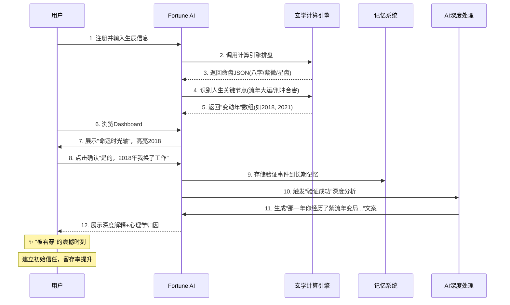
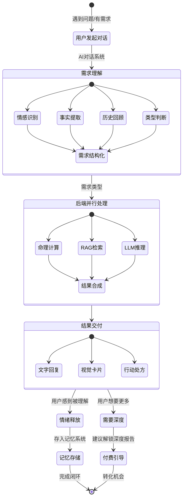
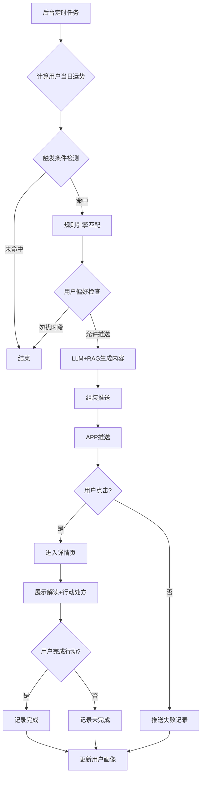

# Fortune AI 系统顶层设计文档 v2.0

**文档类型**: 系统顶层设计 (System Top-Level Design)
**版本**: 2.0
**日期**: 2025-12-24
**密级**: 内部公开
**目标读者**: 高层决策者 + 产品团队 + 开发团队

---

## 文档修订历史

| 版本 | 日期 | 作者 | 修订说明 |
|------|------|------|----------|
| v1.0 | 2025-12-24 | Claude | 初始版本 |
| v2.0 | 2025-12-24 | Claude | 融合三版优化，强化Profile/记忆/模块化架构 |

---

## 目录

1. [执行摘要](#1-执行摘要-executive-summary)
2. [核心战略与价值主张](#2-核心战略与价值主张-strategic-core)
3. [用户画像与需求洞察](#3-用户画像与需求洞察-persona--needs)
4. [系统功能架构设计](#4-系统功能架构设计-functional-architecture)
5. [关键业务流程设计](#5-关键业务流程设计-key-business-flows)
6. [技术架构原则](#6-技术架构原则-technical-architecture-principles)
7. [差异化竞争壁垒](#7-差异化竞争壁垒-the-moat)

---

## 1. 执行摘要 (Executive Summary)

### 1.1 产品定位

**Fortune AI** 是一款AI原生的"人生导航系统"，通过精确的东方命理计算（八字、紫微斗数、星盘等）与大语言模型的深度推理，帮助用户回答三个终极问题：

| 终极问题 | 传统解答 | Fortune AI解答 |
|----------|----------|----------------|
| **我是谁？** | 模糊的性格描述 | 基于命理+心理学的深度"灵魂说明书"，带动态标签系统 |
| **从何处来？** | 单纯的过去回顾 | 命运时光轴回溯，用玄学框架解释人生关键节点 |
| **往何处去？** | 笼统的未来预测 | 主动式运势预警+可执行行动处方 |

### 1.2 核心差异化

| 维度 | 传统算命App | 西方竞品 | Fortune AI |
|------|-------------|----------|------------|
| **命理深度** | 有但表达土 | 无东方体系 | 八字+紫微+星盘综合 |
| **交互方式** | 被动查询 | 被动推送 | **主动服务+行动处方** |
| **用户理解** | 无记忆 | 基础记忆 | **深度Profile+长期记忆架构** |
| **AI能力** | 规则匹配 | 单一风格 | **模块化可配置AI引擎** |
| **视觉体验** | 陈旧 | 好 | **Bento Grid+AI生图** |
| **真人服务** | 有（贵） | 无 | **无（纯AI）** |

### 1.3 商业模式摘要

```
┌─────────────────────────────────────────────────────────────┐
│                    Fortune AI 商业模式                       │
├─────────────────────────────────────────────────────────────┤
│  免费层                     │  高级版 (¥19/月)   │  专业版   │
│  - 基础排盘                 │  - 无限AI对话     │  (¥49/月) │
│  - 每日运势                 │  - 深度流年报告   │           │
│  - 3次/天AI对话             │  - 完整时光机     │  - 全部功能│
│  - 标准壁纸                 │  - 高级壁纸       │  - 多风格AI│
│                            │  - 关系合盘10次/月│           │
└─────────────────────────────────────────────────────────────┘
                            │
                            ▼
                  预计目标: 10万DAU, 5%付费转化率
                  ARPU: ¥15-25, LTV/CAC > 3
```

---

## 2. 核心战略与价值主张 (Strategic Core)

### 2.1 市场机会矩阵

基于竞品分析、社交舆情和真人服务调研，我们识别出以下结构性机会：

#### 2.1.1 三大市场空白

| 空白类型 | 现状描述 | 用户痛点 | Fortune AI解决方案 |
|----------|----------|----------|-------------------|
| **东方玄学现代化** | 西方App体验好但无东方命理；东方App算法深但界面土 | 年轻用户想要"准"但也要"酷" | 硅谷产品方法论+东方命理内核 |
| **行动处方断层** | 大多数App只说"会发生什么" | 用户真正需要"现在该做什么" | 玄学驱动的ToDo List + 沟通话术模板 |
| **情感连接缺失** | AI冷冰冰、真人贵且慢 | 深夜焦虑时需要即时陪伴 | 有记忆、有温度的AI伴侣 |

#### 2.1.2 SWOT分析

```
                    ┌─────────────────────────────────┐
                    │          外部环境 (O/T)          │
                    │  O: 玄学经济爆发               │
                    │  O: Gen Z焦虑+审美红利         │
                    │  O: AIGC技术成熟               │
                    │  T: 监管风险(迷信/宗教)        │
                    │  T: 竞品快速跟进              │
                    └─────────────────────────────────┘
           ┌────────────────────────────────────────────────┐
           │                Fortune AI                     │
           │  S: 精确算法+AI推理深度结合                  │
           │  S: 模块化架构可快速扩展                      │
           │  S: 无真人服务降低运营成本                    │
           │  W: 品牌从零建立                             │
           │  W: 技术复杂度高                              │
           └────────────────────────────────────────────────┘
```

### 2.2 核心价值主张 (UVRA)

```
┌─────────────────────────────────────────────────────────────┐
│                    UVRA 价值主张分解                       │
├─────────────────────────────────────────────────────────────┤
│                                                             │
│   U (User)      │  20-40岁城市人群，面临决策焦虑           │
│                 │  渴望掌控感与情感陪伴                     │
│                 │  理性但需要"玄学"归因框架                 │
│                 │                                            │
│   V (Value)     │  【预测】精确的命理计算                   │
│                 │  【解释】心理学框架的深度解读             │
│                 │  【行动】可执行的建议与话术模板           │
│                 │  【陪伴】有记忆的主动式AI伴侣             │
│                 │                                            │
│   R (Reason)    │  唯一结合:                               │
│                 │  • 多命理系统(八字/紫微/星盘/六爻/奇门)   │
│                 │  • 混合RAG架构(确定性计算+知识图谱+LLM)    │
│                 │  • 长期记忆架构(情绪日志+人生事件)        │
│                 │  • 模块化AI引擎(可配置风格/哲学体系)      │
│                 │                                            │
│   A (Advantage) │  vs 真人: 24/7秒级响应, ¥19/月无限次     │
│                 │  vs 竞品: 深度记忆+主动服务+行动处方      │
│                 │  vs 传统: 现代设计+AI生图+合规表达       │
│                 │                                            │
└─────────────────────────────────────────────────────────────┘
```

### 2.3 北极星指标体系

采用分层指标设计，平衡长期价值与实时监控：

```
┌─────────────────────────────────────────────────────────────┐
│                   指标层级体系                             │
├─────────────────────────────────────────────────────────────┤
│                                                             │
│   L1: 北极星指标                                            │
│   ┌─────────────────────────────────────────────────────┐   │
│   │  周活跃陪伴天数 (Weekly Companionship Days)         │   │
│   │  定义: 用户每周完成"有意义交互"的天数               │   │
│   │  目标: > 3天/周                                    │   │
│   └─────────────────────────────────────────────────────┘   │
│                          ▲                                  │
│   L2: 过程指标             │                                  │
│   ┌─────────────────────────────────────────────────────┐   │
│   │  每日有效指引交互数 (Daily Active Guidance)         │   │
│   │  定义: 每日完成闭环(查看/对话/仪式)的用户数         │   │
│   │  目标: > 40% DAU                                   │   │
│   └─────────────────────────────────────────────────────┘   │
│                          ▲                                  │
│   L3: 质量指标             │                                  │
│   ┌─────────────────────────────────────────────────────┐   │
│   │  主动服务闭环完成率 (Proactive Loop Completion)     │   │
│   │  定义: 推送→点击→完成行动 的比例                    │   │
│   │  目标: > 30%                                       │   │
│   └─────────────────────────────────────────────────────┘   │
│                                                             │
└─────────────────────────────────────────────────────────────┘
```

---

## 3. 用户画像与需求洞察 (Persona & Needs)

### 3.1 双画像用户模型

基于调研数据，我们将目标用户分为两类，采用差异化策略：

| 维度 | **P1: 情绪探索者 (Emotional Explorer)** | **P2: 理性决策者 (Rational Decision-Maker)** |
|------|----------------------------------------|--------------------------------------------|
| **占比** | 约65%（女性为主） | 约35%（性别平衡） |
| **年龄** | 22-30岁 | 28-40岁 |
| **核心诉求** | 情感陪伴、自我探索、社交货币 | 决策支持、风险管控、效率提升 |
| **使用场景** | 深夜焦虑、分手迷茫、日常吐槽 | 跳槽选择、投资决策、重要谈判 |
| **付费意愿** | 中（为体验和审美付费） | 高（为精准和效率付费） |
| **功能偏好** | AI对话、好运壁纸、社区互动 | 深度报告、时光机、主动预警 |
| **留存驱动** | 情感连接、每日仪式 | 决策价值、历史验证 |
| **转化策略** | 免费体验→习惯养成→解锁高级功能 | 痛点解决→深度需求→专业版订阅 |

### 3.2 痛点-痒点-爽点三维矩阵

#### 3.2.1 痛点分析（必须解决）

| 痛点类别 | 具体表现 | 用户心声 | Fortune AI解决方案 |
|----------|----------|----------|-------------------|
| **决策瘫痪** | 面对多选无法决策 | "两个offer都好，我该选哪个？" | 基于命理的决策框架+时间匹配度分析 |
| **情绪无处安放** | 深夜焦虑无人倾诉 | "很烦但不知道为什么，也不想麻烦朋友" | 24/7AI陪伴+情绪归因解读 |
| **对未知恐惧** | 未来不确定性强 | "明年裁员，我会不会受影响？" | 命运时光轴+主动预警系统 |
| **社交解读困难** | 不理解他人行为 | "他为什么突然冷淡？我哪做错了？" | 关系模拟器+沟通话术生成 |
| **信任缺失** | AI结论随机性 | "这个App感觉是随机的，我不信" | 回溯验证机制+确定性算法保证 |

#### 3.2.2 痒点分析（潜意识欲望）

| 痒点类别 | 心理机制 | 产品转化 |
|----------|----------|----------|
| **身份确认** | 巴纳姆效应升级："这说的就是我！" | 深度"灵魂说明书"+动态标签系统 |
| **窥私欲** | 想了解他人但无法直接问 | "幽灵档案"合盘+关系模拟器 |
| **审美虚荣** | "好看"=好运的视觉暗示 | Nano Banana风格个性化壁纸 |
| **社交货币** | 通过运势内容展示自我 | 可分享的"运势梗图"+接龙机制 |
| **掌控感幻觉** | 通过仪式动作获得控制感 | 赛博祭坛+情绪量化互动 |

#### 3.2.3 爽点分析（超预期体验）

| 爽点类别 | 触发机制 | 设计策略 |
|----------|----------|----------|
| **"被看穿"震撼** | AI说出用户未曾明说的细节 | 命理精确计算+冷读术启发式提问 |
| **及时心理按摩** | 记录情绪后立即收到温暖解读 | 情绪-运势联动推送机制 |
| **视觉化好运** | 打开看到精美专属运势卡 | AI每日生成个性化3D运势卡片 |
| **"原来如此"释然** | 回溯过去找到玄学解释 | 时光机：命理解释关键人生节点 |
| **社群共鸣** | 看到他人经历同样的水逆困扰 | 去匿名同运用户社区 |

### 3.3 用户旅程地图

```
┌─────────────────────────────────────────────────────────────────┐
│                    Fortune AI 用户旅程地图                      │
├──────────┬───────────────┬───────────────┬─────────────────────┤
│   阶段   │    用户行为    │    情绪状态   │   系统介入(MoT)      │
├──────────┼───────────────┼───────────────┼─────────────────────┤
│ 发现期   │ 小红书种草/    │ 好奇+怀疑    │ 高颜值可分享内容    │
│          │ 朋友分享合盘   │               │ 社交裂变入口        │
├──────────┼───────────────┼───────────────┼─────────────────────┤
│ 注册期   │ 输入生辰信息   │ 谨慎+期待    │ 🔑信任建立:         │
│          │ 选择偏好风格   │               │ 回溯验证-解释过去   │
├──────────┼───────────────┼───────────────┼─────────────────────┤
│ 探索期   │ 浏览Dashboard  │ 兴趣+困惑    │ 🔍首次"被看穿":     │
│          │ 阅读灵魂说明书 │               │ 巴纳姆效应+精确数据 │
├──────────┼───────────────┼───────────────┼─────────────────────┤
│ 依赖期   │ 遇问题问AI    │ 焦虑→释然    │ 💗情感连接深化:      │
│          │ 记录情绪日志   │               │ 有记忆对话+共情回应 │
├──────────┼───────────────┼───────────────┼─────────────────────┤
│ 习惯期   │ 每天早上看运势 │ 依赖→信任    │ ⭐主动服务惊喜:     │
│          │ 期待推送提醒   │               │ 关键时刻运势预警    │
├──────────┼───────────────┼───────────────┼─────────────────────┤
│ 付费期   │ 需要深度分析   │ 理性决策     │ 💰价值感知临界:     │
│          │ 愿意解锁高级   │               │ 限时解锁深度报告    │
└──────────┴───────────────┴───────────────┴─────────────────────┘
```

**Moment of Truth（关键时刻）**：
1. **首次信任建立**：时光轴高亮用户过去的"变动年"，点击确认后展开深度解释
2. **首次"被看穿"**：AI基于命理说出用户未曾明说的性格特质或当前状态
3. **主动服务命中**：推送的运势预警精准命中用户当下的焦虑或问题

---

## 4. 系统功能架构设计 (Functional Architecture)

### 4.1 整体架构图

```
┌─────────────────────────────────────────────────────────────────┐
│                        客户端层 (Client Layer)                    │
│  ┌────────────┐  ┌────────────┐  ┌────────────┐  ┌────────────┐ │
│  │ 移动App    │  │ Web小程序  │  │ 公众号H5   │  │ 桌面端(未来)│ │
│  │ (Flutter)  │  │            │  │            │  │            │ │
│  └────────────┘  └────────────┘  └────────────┘  └────────────┘ │
└─────────────────────────────────────────────────────────────────┘
                                  ▲
                                  │ HTTPS/WebSocket/gRPC
                                  ▼
┌─────────────────────────────────────────────────────────────────┐
│                        API网关层 (API Gateway)                    │
│  ┌──────────┐  ┌──────────┐  ┌──────────┐  ┌──────────┐       │
│  │认证鉴权  │  │限流熔断  │  │路由转发  │  │日志监控  │       │
│  └──────────┘  └──────────┘  └──────────┘  └──────────┘       │
└─────────────────────────────────────────────────────────────────┘
                                  ▼
┌─────────────────────────────────────────────────────────────────┐
│                      业务服务层 (Business Services)               │
│  ┌────────────┐  ┌────────────┐  ┌────────────┐  ┌────────────┐│
│  │ 用户服务   │  │ 玄学计算   │  │ AI对话服务 │  │ 社交服务   ││
│  │ - Profile  │  │ - 八字引擎 │  │ - RAG检索  │  │ - 合盘分析 ││
│  │ - 记忆管理 │  │ - 紫微引擎 │  │ - LLM推理  │  │ - 关系模拟 ││
│  │ - 订阅管理 │  │ - 星盘引擎 │  │ - 上下文   │  │ - 裂变机制 ││
│  └────────────┘  └────────────┘  └────────────┘  └────────────┘│
│  ┌────────────┐  ┌────────────┐  ┌────────────┐                 │
│  │ 主动服务   │  │ 视觉生成   │  │ 内容管理   │                 │
│  │ - 触发引擎 │  │ - Nano Banana│  │ - 模板库   │                 │
│  │ - 推送服务 │  │ - 卡片生成 │  │ - A/B测试  │                 │
│  └────────────┘  └────────────┘  └────────────┘                 │
└─────────────────────────────────────────────────────────────────┘
                                  ▼
┌─────────────────────────────────────────────────────────────────┐
│                      数据层 (Data Layer)                          │
│  ┌────────────┐  ┌────────────┐  ┌────────────┐  ┌────────────┐│
│  │PostgreSQL  │  │ Vector DB  │  │ Redis      │  │ RabbitMQ   ││
│  │(关系数据)  │  │(Pinecone)  │  │(缓存)      │  │(消息队列)  ││
│  └────────────┘  └────────────┘  └────────────┘  └────────────┘│
└─────────────────────────────────────────────────────────────────┘
```

### 4.2 前台功能模块（用户侧）

#### 4.2.1 核心功能一：用户Profile系统（新增核心）

这是Fortune AI与其他竞品的核心差异化——深度理解用户"我是谁"。

```
┌─────────────────────────────────────────────────────────────────┐
│                      用户Profile架构                            │
├─────────────────────────────────────────────────────────────────┤
│                                                                 │
│  ┌─────────────────────────────────────────────────────────┐   │
│  │              核心真实信息 (Core Truth)                   │   │
│  │  ┌─────────────┐  ┌─────────────┐  ┌─────────────┐      │   │
│  │  │ 基础命盘数据 │  │ 过往历史    │  │ 未来计划    │      │   │
│  │  │ - 八字四柱  │  │ - 关键事件  │  │ - 目标设定  │      │   │
│  │  │ - 紫微十二宫 │  │ - 时间轴标记 │  │ - 待决策事项│      │   │
│  │  │ - 星盘相位  │  │ - 已验证节点│  │ - 期待周期  │      │   │
│  │  └─────────────┘  └─────────────┘  └─────────────┘      │   │
│  └─────────────────────────────────────────────────────────┘   │
│                          ▼                                      │
│  ┌─────────────────────────────────────────────────────────┐   │
│  │              深度分析引擎 (Deep Analysis)                │   │
│  │  ┌─────────────┐  ┌─────────────┐  ┌─────────────┐      │   │
│  │  │ 动态标签系统 │  │ 人格特质分析 │  │ 生命周期   │      │   │
│  │  │ - 五行标签  │  │ - 十神分析  │  │ - 当前大运  │      │   │
│  │  │ - 星曜标签  │  │ - 心理原型  │  │ - 关键转折  │      │   │
│  │  │ - 行为模式  │  │ - 优势/短板 │  │ - 风险预警  │      │   │
│  │  └─────────────┘  └─────────────┘  └─────────────┘      │   │
│  └─────────────────────────────────────────────────────────┘   │
│                          ▼                                      │
│  ┌─────────────────────────────────────────────────────────┐   │
│  │              记忆架构 (Memory Architecture)              │   │
│  │  ┌─────────────┐  ┌─────────────┐  ┌─────────────┐      │   │
│  │  │ 短期记忆    │  │ 长期记忆    │  │ 情绪记忆    │      │   │
│  │  │ - 近7天对话 │  │ - 重要事件  │  │ - 情绪日志  │      │   │
│  │  │ - 当前关注  │  │ - 人生节点  │  │ - 归因记录  │      │   │
│  │  │ - 待解决问题 │  │ - 成长轨迹  │  │ - 疗愈历史  │      │   │
│  │  └─────────────┘  └─────────────┘  └─────────────┘      │   │
│  └─────────────────────────────────────────────────────────┘   │
│                                                                 │
└─────────────────────────────────────────────────────────────────┘
```

**功能说明**：

| 模块 | 具体功能 | 数据来源 | 更新机制 |
|------|----------|----------|----------|
| **基础命盘** | 八字/紫微/星盘三层可视化 | 用户输入+算法计算 | 一次性生成，永久存储 |
| **过往历史** | 命运时光轴，标记关键年份 | 用户验证+算法识别 | 用户交互确认 |
| **未来计划** | 用户设定的目标/决策点 | 用户主动输入 | 随时更新 |
| **动态标签** | 基于命理+行为的AI生成标签 | 算法计算+LLM推理 | 定期更新 |
| **情绪记忆** | 情绪日志+运势归因 | 用户记录+系统分析 | 持续积累 |

**数据模型示例**：
```json
{
  "user_id": "uuid",
  "core_profile": {
    "birth_data": {
      "date": "1995-06-15",
      "time": "14:30",
      "location": {"lat": 31.23, "lng": 121.47, "name": "上海"},
      "true_solar_time": "14:28:32"
    },
    "charts": {
      "bazi": {"day_master": "甲木", "structure": "伤官生财格"},
      "ziwei": {"ming_palace": "贪狼", "life_pattern": "变动型"},
      "astrology": {"sun": "双子座", "moon": "天蝎座", "ascendant": "狮子座"}
    }
  },
  "life_history": {
    "verified_events": [
      {"year": 2018, "type": "job_change", "user_confirmed": true, "astro_reason": "大限交接"}
    ]
  },
  "future_plans": {
    "goals": [
      {"id": "g1", "type": "career", "description": "3年内晋升总监", "target_year": 2027}
    ],
    "pending_decisions": [
      {"id": "d1", "type": "job_offer", "options": ["A公司", "B公司"], "urgency": "high"}
    ]
  },
  "dynamic_tags": [
    {"tag": "创意变现者", "confidence": 0.85, "source": "bazi_shangguan"},
    {"tag": "情感深度追求者", "confidence": 0.78, "source": "astro_moon"},
    {"tag": "变动期", "confidence": 0.92, "source": "dahyun_change"}
  ],
  "memory": {
    "short_term": {
      "recent_conversations": ["最近关心工作压力", "考虑跳槽"],
      "current_focus": "职业发展"
    },
    "long_term": {
      "important_events": ["2021年分手", "2018年换工作"],
      "growth_trajectory": "从迷茫到逐渐清晰"
    },
    "emotional": {
      "mood_log": [
        {"date": "2025-12-20", "mood": "anxious", "tags": ["work", "uncertainty"], "astro_attribution": "水星逆行"}
      ]
    }
  }
}
```

#### 4.2.2 核心功能二：AI交互式对话（新增/强化）

**设计理念**：类似真人服务中的"客户经理"，理解需求、转化需求、交付结果。

```
┌─────────────────────────────────────────────────────────────────┐
│                   AI交互对话系统架构                            │
├─────────────────────────────────────────────────────────────────┤
│                                                                 │
│  ┌─────────────────────────────────────────────────────────┐   │
│  │              对话理解层 (Understanding Layer)            │   │
│  │                                                           │   │
│  │   用户输入 → 意图识别 → 上下文提取 → 需求分类             │   │
│  │      │           │            │           │               │   │
│  │      ▼           ▼            ▼           ▼               │   │
│  │   ┌──────┐   ┌──────┐    ┌──────┐    ┌──────┐           │   │
│  │   │情感  │   │事实  │    │历史  │    │类型  │           │   │
│  │   │识别  │   │提取  │    │回顾  │    │判断  │           │   │
│  │   └──────┘   └──────┘    └──────┘    └──────┘           │   │
│  │     │           │            │           │               │   │
│  │     └───────────┴────────────┴───────────┘               │   │
│  │                         ▼                                 │   │
│  │                   需求结构化                               │   │
│  └─────────────────────────────────────────────────────────┘   │
│                          ▼                                      │
│  ┌─────────────────────────────────────────────────────────┐   │
│  │           后端处理调度层 (Dispatch Layer)                │   │
│  │                                                           │   │
│  │   需求类型 ──→ 计算模块 ──→ 深度分析模块 ──→ 结果合成     │   │
│  │      │            │               │             │          │   │
│  │      ▼            ▼               ▼             ▼          │   │
│  │   ┌────────┐  ┌────────┐    ┌────────┐    ┌────────┐    │   │
│  │   │命理计算│  │RAG检索 │    │LLM推理 │    │格式化  │    │   │
│  │   │八字/  │  │古籍/   │    │多轮    │    │UI指令  │    │   │
│  │   │紫微/  │  │心理学  │    │对话    │    │生成    │    │   │
│  │   │星盘   │  │文本库  │    │        │    │        │    │   │
│  │   └────────┘  └────────┘    └────────┘    └────────┘    │   │
│  └─────────────────────────────────────────────────────────┘   │
│                          ▼                                      │
│  ┌─────────────────────────────────────────────────────────┐   │
│  │              结果交付层 (Delivery Layer)                 │   │
│  │                                                           │   │
│  │   ┌─────────┐    ┌─────────┐    ┌─────────┐              │   │
│  │   │文字回复 │    │视觉卡片 │    │行动处方 │              │   │
│  │   │共情+解释│    │AI生图   │    │话术/清单│              │   │
│  │   └─────────┘    └─────────┘    └─────────┘              │   │
│  │                                                           │   │
│  └─────────────────────────────────────────────────────────┘   │
│                                                                 │
└─────────────────────────────────────────────────────────────────┘
```

**对话流程示例**：

```
用户: "我最近工作很不顺，老板总是针对我，怎么办？"

     │
     ▼
┌─────────────────────────────────────────┐
│ 步骤1: 理解与识别                        │
│ - 情感: 委屈、焦虑、无助                  │
│ - 事实: 工作压力、上下司矛盾              │
│ - 历史: 查询memory是否类似问题            │
│ - 类型: 情感支持+决策辅助                │
└─────────────────────────────────────────┘
     │
     ▼
┌─────────────────────────────────────────┐
│ 步骤2: 并行后端处理                     │
│ ┌─────────────┐  ┌─────────────┐       │
│ │ 命理计算引擎 │  │ RAG知识检索 │       │
│ │ - 当前大运   │  │ - 伤官见官  │       │
│ │ - 流月运势   │  │ - 心理解读  │       │
│ │ - 流日能量   │  │ - 化解建议  │       │
│ └─────────────┘  └─────────────┘       │
│         │                │              │
│         └────────────┬───┘              │
│                      ▼                  │
│              ┌─────────────┐            │
│              │ LLM推理合成 │            │
│              │ - 共情回应  │            │
│              │ - 逻辑解释  │            │
│              │ - 行动建议  │            │
│              └─────────────┘            │
└─────────────────────────────────────────┘
     │
     ▼
┌─────────────────────────────────────────┐
│ 步骤3: 结果交付                         │
│                                          │
│ 文字回复:                                │
│ "我能感受到你现在的委屈。根据你的命盘分析，│
│  这个月你的'表达星'(伤官)和'权威星'(正官) │
│  正在冲突，这不是你的错，是能量场的碰撞。  │
│  建议这周: 1.少说话多记录; 2.穿蓝/黑色衣物 │
│  3.把想法写成邮件而非当面说。             │
│  这种对抗能量下周二就会开始减弱。"         │
│                                          │
│ 视觉卡片: AI生成"职场化解"主题壁纸        │
│                                          │
│ 行动处方:                                 │
│ ┌─────────────────────────────────┐     │
│ │ 本周职场生存清单                  │     │
│ │ □ 每天早上5分钟写下今日要做的事   │     │
│ │ □ 重要沟通用邮件，避免当面冲突   │     │
│ │ □ 穿蓝色/黑色(水元素柔化冲突)    │     │
│ │ □ 下周二后再提重要想法           │     │
│ └─────────────────────────────────┘     │
└─────────────────────────────────────────┘
```

#### 4.2.3 核心功能三：命运罗盘（Dashboard）

采用Bento Grid布局，充分利用AI生图和交互卡片能力。

```
┌─────────────────────────────────────────────────────────────────┐
│                   Bento Grid Dashboard 布局                     │
├─────────────────────────────────────────────────────────────────┤
│  ┌─────────────────────────────┬──────────────────────────┐    │
│  │                             │                          │    │
│  │      今日运势卡 (2x2)         │    能量仪表盘 (1x1)      │    │
│  │   [AI生成的3D运势卡片]       │   ▓▓▓▓▓▓▓░░ 85%         │    │
│  │                             │   今日能量值              │    │
│  │   "甲辰日 · 财运亨通"        │                          │    │
│  │                             │                          │    │
│  └─────────────────────────────┼──────────────────────────┤    │
│  │                             │                          │    │
│  │   行动建议 (1x2)             │   宜忌指引 (1x1)         │    │
│  │   □ 穿绿色/金色              │   ● 宜 沟通协商          │    │
│  │   □ 重要的邮件下午发         │   ✗ 忌 冲动消费          │    │
│  │   □ 多记录少表达             │                          │    │
│  │                             │                          │    │
│  └─────────────────────────────┴──────────────────────────┤    │
│  │                                                             │
│  │              主动服务提醒 / 快捷入口 (2x1)                 │
│  │  ⚠️ 水逆沟通预警  │  💬 询问AI  │  🔮 关系合盘  │  📜时光机│
│  │                                                             │
│  └───────────────────────────────────────────────────────────┤    │
│  │                                                             │
│  │                   我的灵宠 (1x3)                            │
│  │   [基于八字的3D灵宠，随运势变化状态]                         │
│  │   今日状态: 佩戴皇冠 ☀️ (运势好)                           │
│  │                                                             │
│  └───────────────────────────────────────────────────────────┘    │
└─────────────────────────────────────────────────────────────────┘
```

#### 4.2.4 核心功能四：羁绊实验室（关系分析与模拟）

| 功能模块 | 输入 | 输出 | 场景应用 |
|----------|------|------|----------|
| **多维度合盘** | 双方生辰 | 恋爱/事业/友谊/摸鱼四维指数 | 快速了解关系全貌 |
| **关系剧本** | 双方生辰+具体情境 | 场景化预测与话术建议 | "吵架了会怎样？怎么处理？" |
| **幽灵档案** | 单方输入+对方生辰 | 单向合盘报告 | 满足窥私欲，社交破冰 |
| **关系模拟器** | 双方星盘+假设情境 | AI模拟对话，预测反应 | "如果我提分手，他会怎么反应？" |

#### 4.2.5 核心功能五：主动服务中心

| 触发类型 | 计算逻辑 | 触发条件 | 推送内容 |
|----------|----------|----------|----------|
| **八字日运** | 流日地支 vs 用户日支 | 六冲/六害/三刑 | 情感预警+化解建议 |
| **紫微流时** | 流时命宫主星 | 地空/地劫入局 | 时间段风险提醒 |
| **星象行运** | 行运水星 vs 本命水星 | 逆行开始 | 水逆生存指南 |
| **情绪归因** | 用户情绪日志+运势 | 连续3天负面 | 运势解释+心理资源 |

#### 4.2.6 核心功能六：好运壁纸工坊

```
┌─────────────────────────────────────────────────────────────────┐
│                 AI壁纸生成流程                                  │
├─────────────────────────────────────────────────────────────────┤
│                                                                 │
│   用户八字喜好 + 今日星象 + 审美偏好                             │
│         │                                                       │
│         ▼                                                       │
│   ┌─────────────────┐                                           │
│   │  Prompt转译器   │                                           │
│   │  八字"火旺"      │                                           │
│   │    ↓           │                                           │
│   │  Visual: Neon   │                                           │
│   │  Fire, magma    │                                           │
│   └─────────────────┘                                           │
│         │                                                       │
│         ▼                                                       │
│   ┌─────────────────┐                                           │
│   │  Nano Banana    │                                           │
│   │  图像生成API     │                                           │
│   └─────────────────┘                                           │
│         │                                                       │
│         ▼                                                       │
│   ┌─────────────────┐                                           │
│   │  个性化壁纸     │                                           │
│   │  [嵌入关键词]   │                                           │
│   │  [带QR Code]    │                                           │
│   └─────────────────┘                                           │
│         │                                                       │
│         ▼                                                       │
│   用户保存/分享 → 社交裂变                                       │
│                                                                 │
└─────────────────────────────────────────────────────────────────┘
```

### 4.3 中台业务能力（服务层）

#### 4.3.1 模块化可扩展后端架构（新增核心要求）

```
┌─────────────────────────────────────────────────────────────────┐
│              模块化后端架构：计算层 + 深度处理层                │
├─────────────────────────────────────────────────────────────────┤
│                                                                 │
│  ┌─────────────────────────────────────────────────────────┐   │
│  │            计算层 (Calculation Layer)                    │   │
│  │                  确定性算法引擎                           │   │
│  │  ┌────────┐  ┌────────┐  ┌────────┐  ┌────────┐        │   │
│  │  │ 八字   │  │ 紫微   │  │ 星盘   │  │ 六爻   │  ...   │   │
│  │  │ 引擎   │  │ 引擎   │  │ 引擎   │  │ 引擎   │        │   │
│  │  └────────┘  └────────┘  └────────┘  └────────┘        │   │
│  │       │           │           │           │              │   │
│  │       └───────────┴───────────┴───────────┘              │   │
│  │                     ▼                                   │   │
│  │            统一数据输出 (JSON)                          │   │
│  └─────────────────────────────────────────────────────────┘   │
│                          ▼                                      │
│  ┌─────────────────────────────────────────────────────────┐   │
│  │        深度处理层 (Deep Processing Layer)                │   │
│  │              可配置的AI处理模块                            │   │
│  │                                                           │   │
│  │  ┌─────────────────────────────────────────────────┐    │   │
│  │  │          命理解读模块 (可配置)                   │    │   │
│  │  │  ┌────────┐  ┌────────┐  ┌────────┐  ┌────────┐│    │   │
│  │  │  │传统派  │  │心理派  │  │现代派  │  │自定义  ││    │   │
│  │  │  │解读    │  │解读    │  │解读    │  │解读    ││    │   │
│  │  │  └────────┘  └────────┘  └────────┘  └────────┘│    │   │
│  │  └─────────────────────────────────────────────────┘    │   │
│  │                                                           │   │
│  │  ┌─────────────────────────────────────────────────┐    │   │
│  │  │        哲学/教练模块 (可配置)                    │    │   │
│  │  │  ┌──────────┐  ┌──────────┐  ┌──────────┐      │    │   │
│  │  │  │孔子智慧  │  │斯多葛哲学 │  │7 Habits  │  ... │    │   │
│  │  │  │教练      │  │教练      │  │教练      │      │    │   │
│  │  │  └──────────┘  └──────────┘  └──────────┘      │    │   │
│  │  └─────────────────────────────────────────────────┘    │   │
│  │                                                           │   │
│  │  ┌─────────────────────────────────────────────────┐    │   │
│  │  │           风格模块 (可配置)                      │    │   │
│  │  │  ┌────────┐  ┌────────┐  ┌────────┐  ┌────────┐│    │   │
│  │  │  │标准    │  │温柔    │  │专业    │  │Roast  ││    │   │
│  │  │  │风格    │  │疗愈    │  │分析师  │  │毒舌    ││    │   │
│  │  │  └────────┘  └────────┘  └────────┘  └────────┘│    │   │
│  │  └─────────────────────────────────────────────────┘    │   │
│  │                                                           │   │
│  │  ┌─────────────────────────────────────────────────┐    │   │
│  │  │           RAG知识库 (可扩展)                     │    │   │
│  │  │  ┌────────┐  ┌────────┐  ┌────────┐  ┌────────┐│    │   │
│  │  │  │八字古籍 │  │紫微古籍 │  │占星学  │  │心理学  ││    │   │
│  │  │  └────────┘  └────────┘  └────────┘  └────────┘│    │   │
│  │  │  ┌────────┐  ┌────────┐  ┌────────┐  ┌────────┐│    │   │
│  │  │  │六爻    │  │奇门遁甲 │  │铁板神数 │  │自定义  ││    │   │
│  │  │  └────────┘  └────────┘  └────────┘  └────────┘│    │   │
│  │  └─────────────────────────────────────────────────┘    │   │
│  │                                                           │   │
│  │  ┌─────────────────────────────────────────────────┐    │   │
│  │  │          LLM推理编排层                           │    │   │
│  │  │    Function Calling + Context Assembly          │    │   │
│  │  └─────────────────────────────────────────────────┘    │   │
│  └─────────────────────────────────────────────────────────┘   │
│                          ▼                                      │
│  ┌─────────────────────────────────────────────────────────┐   │
│  │             输出层 (Output Layer)                        │   │
│  │    文字回复 + 视觉卡片 + 行动处方 + UI渲染指令           │   │
│  └─────────────────────────────────────────────────────────┘   │
│                                                                 │
└─────────────────────────────────────────────────────────────────┘
```

**模块配置示例**：

```json
{
  "user_id": "uuid",
  "configuration": {
    "calculation_engines": {
      "enabled": ["bazi", "ziwei", "astrology"],
      "primary": "bazi",
      "fusion_mode": "integrated"
    },
    "interpretation_module": "psychology_modern",
    "philosophy_coach": "stoic",
    "tone_style": "gentle_warm",
    "rag_sources": {
      "primary": ["bazi_classic", "psychology_modern"],
      "secondary": ["astrology_transit"]
    },
    "output_format": {
      "text": true,
      "visual_card": true,
      "action_prescription": true,
      "ui_components": ["bento_card", "energy_bar"]
    }
  }
}
```

#### 4.3.2 玄学术语心理学翻译表

| 玄学术语 | 心理学重构 | 行动导向 | 示例回复 |
|----------|------------|----------|----------|
| 犯太岁 | 能量重组期 | 主动应变 | "今年是你的人生能量重组期，建议主动求变（换工作、搬家、学习新技能），化解被动冲击" |
| 伤官见官 | 创造力与权威冲突 | 表达方式调整 | "你的创意被权威压制，建议这周少说话多记录，用邮件而非当面沟通" |
| 桃花泛滥 | 社交能量溢出 | 关系边界管理 | "你的魅力正在吸引关注，这是机遇也是挑战，建议设定明确的情感边界" |
| 劫财星动 | 冲动消费风险 | 财务防御模式 | "本周社交支出可能增加，建议设定消费上限，避免大额决策" |
| 七杀攻身 | 压力测试信号 | 韧性训练 | "你会感到显著压力，但这正是突破瓶颈的动力，将焦虑转化为执行力" |

#### 4.3.3 主动服务触发引擎

```
┌─────────────────────────────────────────────────────────────────┐
│                   主动服务触发引擎架构                          │
├─────────────────────────────────────────────────────────────────┤
│                                                                 │
│  ┌─────────────────────────────────────────────────────────┐   │
│  │            触发源 (Trigger Sources)                      │   │
│  │  ┌──────────┐  ┌──────────┐  ┌──────────┐  ┌──────────┐│   │
│  │  │命盘计算  │  │星象行运  │  │用户情绪  │  │外部事件  ││   │
│  │  │流日/流月  │  │水逆/土星  │  │连续负面  │  │节气/满月  ││   │
│  │  └──────────┘  └──────────┘  └──────────┘  └──────────┘│   │
│  └─────────────────────────────────────────────────────────┘   │
│                          ▼                                      │
│  ┌─────────────────────────────────────────────────────────┐   │
│  │            规则引擎 (Rule Engine)                        │   │
│  │  ┌─────────────────────────────────────────────────┐    │   │
│  │  │  IF (流日冲日支 AND 用户关注感情)                 │    │   │
│  │  │      AND (用户过去7天未接收类似推送)              │    │   │
│  │  │  THEN 触发"感情预警"推送                           │    │   │
│  │  │       优先级: HIGH                                 │    │   │
│  │  └─────────────────────────────────────────────────┘    │   │
│  │                                                           │   │
│  │  ┌─────────────────────────────────────────────────┐    │   │
│  │  │  IF (水星逆行开始 AND 本命水星在第三宫)          │    │   │
│  │  │  THEN 触发"水逆生存指南"推送                      │    │   │
│  │  │       包含: 沟通模板 + 注意事项                  │    │   │
│  │  └─────────────────────────────────────────────────┘    │   │
│  └─────────────────────────────────────────────────────────┘   │
│                          ▼                                      │
│  ┌─────────────────────────────────────────────────────────┐   │
│  │          内容生成引擎 (Content Generation)               │   │
│  │   调用LLM + RAG → 个性化文案 + 行动处方                 │   │
│  └─────────────────────────────────────────────────────────┘   │
│                          ▼                                      │
│  ┌─────────────────────────────────────────────────────────┐   │
│  │           推送服务 (Push Notification)                  │   │
│  │   根据用户偏好时间 → APP推送 → 统计打开率/完成率        │   │
│  └─────────────────────────────────────────────────────────┘   │
│                                                                 │
└─────────────────────────────────────────────────────────────────┘
```

### 4.4 后台功能模块（运营侧）

| 功能模块 | 核心能力 | 业务价值 |
|----------|----------|----------|
| **CMS内容管理** | 运势模板/Prompt模板/壁纸主题管理 | 统一内容输出，支持A/B测试 |
| **用户运营工作台** | 用户分群/生命周期管理/付费转化漏斗 | 精细化运营，提升LTV |
| **数据分析看板** | 北极星指标/健康度指标/归因分析 | 数据驱动决策 |
| **风控审核系统** | 敏感内容检测/迷信话术拦截/情感依赖识别 | 合规运营，降低风险 |
| **模块配置中心** | 新增计算引擎/配置解读风格/管理知识库 | 快速扩展能力 |

---

## 5. 关键业务流程设计 (Key Business Flows)

### 5.1 核心流程一：新用户首次信任建立

**目标**：让用户在5分钟内产生"这个系统真的懂我"的震撼感。



**关键设计点**：
1. **高亮策略**：算法预测的"变动年"直接在时间轴上标记
2. **交互确认**：用户点击确认后，立即展开深度解释
3. **记忆存储**：验证事件存入长期记忆，后续对话可引用
4. **心理学包装**：将"流年不利"转化为"能量重组期"

### 5.2 核心流程二：AI对话的完整闭环

**目标**：实现从"理解需求"到"交付结果"的完整服务链。



**对话设计三原则**：
1. **情绪第一，逻辑第二**：先共情，再解释
2. **行动优于预测**：不只说"会发生什么"，更说"你可以做什么"
3. **时间边界**：给用户一个明确的"苦难结束时间"

### 5.3 核心流程三：主动服务完整链路



**主动服务设计原则**：
1. **不制造恐慌**：负面预警必带化解建议
2. **个性化语气**：根据用户偏好选择风格
3. **可配置**：用户可选择只接收重要提醒

### 5.4 核心流程四：社交裂变与获客

| 裂变机制 | 触发场景 | 用户行为 | 平台奖励 | 双方奖励 |
|----------|----------|----------|----------|----------|
| **合盘解锁** | 想看详细匹配度 | 邀请对方注册/授权 | 获得新用户 | 双方解锁深度报告 |
| **好运接力** | 抽到"上上签" | 分享到朋友圈/小红书 | 品牌曝光 | 朋友扫码免费抽签 |
| **壁纸水印** | 生成专属壁纸 | 保存并分享 | 内容传播 | 连续分享7天解锁奖励 |
| **幽灵档案** | 想看他人运势 | 输入信息生成报告 | 内容传播 | 邀请对方解锁详细版 |

---

## 6. 技术架构原则 (Technical Architecture Principles)

### 6.1 系统稳定性与扩展性

#### 6.1.1 服务层架构设计

```
┌─────────────────────────────────────────────────────────────────┐
│                    微服务拆分策略                                │
├─────────────────────────────────────────────────────────────────┤
│                                                                 │
│  ┌──────────────┐  ┌──────────────┐  ┌──────────────┐          │
│  │  用户服务    │  │  计算服务    │  │  AI对话服务  │          │
│  │  - 用户管理  │  │  - 八字引擎  │  │  - RAG检索   │          │
│  │  - 订阅管理  │  │  - 紫微引擎  │  │  - LLM推理   │          │
│  │  - 数据同步  │  │  - 星盘引擎  │  │  - 上下文管理 │          │
│  │             │  │  (可扩展)    │  │              │          │
│  │  独立部署     │  │  独立部署     │  │  独立部署     │          │
│  │  水平扩展     │  │  水平扩展     │  │  水平扩展     │          │
│  └──────────────┘  └──────────────┘  └──────────────┘          │
│                                                                 │
│  ┌──────────────┐  ┌──────────────┐  ┌──────────────┐          │
│  │  社交服务    │  │  主动服务    │  │  视觉生成    │          │
│  │  - 合盘分析  │  │  - 触发引擎  │  │  - Nano Banana│          │
│  │  - 关系模拟  │  │  - 推送服务  │  │  - 卡片生成  │          │
│  │             │  │             │  │              │          │
│  │  独立部署     │  │  独立部署     │  │  独立部署     │          │
│  │  水平扩展     │  │  水平扩展     │  │  水平扩展     │          │
│  └──────────────┘  └──────────────┘  └──────────────┘          │
│                                                                 │
│  降级策略：                                                       │
│  - AI对话服务故障 → 降级到规则引擎返回基础运势                    │
│  - 视觉生成服务故障 → 使用预设模板                               │
│  - 计算服务故障 → 使用缓存数据                                   │
│                                                                 │
└─────────────────────────────────────────────────────────────────┘
```

#### 6.1.2 三级缓存策略

```
┌─────────────────────────────────────────────────────────────────┐
│                    三级缓存架构                                 │
├─────────────────────────────────────────────────────────────────┤
│                                                                 │
│  L1: 本地缓存 (进程内存)                                       │
│  ┌─────────────────────────────────────────────────────────┐   │
│  │  命盘JSON (1小时) | 用户Profile (30分钟) | 运势模板 (5分钟)│   │
│  └─────────────────────────────────────────────────────────┘   │
│                          ▼                                      │
│  L2: Redis集群                                                │
│  ┌─────────────────────────────────────────────────────────┐   │
│  │  用户Session | 热门运势模板 | 推送队列 | 计数器           │   │
│  └─────────────────────────────────────────────────────────┘   │
│                          ▼                                      │
│  L3: CDN                                                      │
│  ┌─────────────────────────────────────────────────────────┐   │
│  │  静态资源 | 壁纸图片 | 视频内容 | AI生成卡片              │   │
│  └─────────────────────────────────────────────────────────┘   │
│                                                                 │
└─────────────────────────────────────────────────────────────────┘
```

#### 6.1.3 预计负载与容量规划

| 指标 | 初期目标 | 中期目标 | 峰值应对 |
|------|----------|----------|----------|
| **DAU** | 5万 | 10万 | 20万 |
| **峰值QPS** | 300 | 500 | 1000 |
| **并发AI对话** | 50 | 100 | 200 |
| **日均图像生成** | 5,000张 | 10,000张 | 20,000张 |
| **数据存储** | 25GB/年 | 100GB/年 | 200GB/年 |

### 6.2 技术栈选型

#### 6.2.1 前端技术栈

| 层级 | 技术选型 | 理由 |
|------|----------|------|
| 跨平台框架 | Flutter | 一套代码支持iOS/Android/Web，高性能 |
| 状态管理 | Riverpod | 类型安全、现代化 |
| UI组件 | 自研 + Flutter Animate | Neo-Brutalism风格实现 |
| 本地存储 | Hive + SQLite | 用户缓存+本地数据库 |
| 网络请求 | Dio + Retrofit风格API | 类型安全HTTP客户端 |

#### 6.2.2 后端技术栈

| 层级 | 技术选型 | 理由 |
|------|----------|------|
| 编程语言 | Python 3.11+ | AI生态成熟 |
| Web框架 | FastAPI | 高性能、自动文档 |
| 任务队列 | Celery + RabbitMQ | 异步任务处理 |
| 关系数据库 | PostgreSQL 15 | 支持JSON、全文搜索 |
| 向量数据库 | Pinecone / Milvus | 高性能向量检索 |
| 缓存 | Redis Cluster | 高可用缓存 |
| 对象存储 | 阿里云OSS | 国内稳定 |

#### 6.2.3 AI与算法技术栈

| 组件 | 技术选型 | 理由 |
|------|----------|------|
| LLM | DeepSeek-V3 / ChatGLM-4 | 国产模型、中文理解好 |
| 图像生成 | Google Gemini 2.5 | Nano Banana能力 |
| 八字引擎 | bazi-mcp (自研扩展) | 开源基础 |
| 紫微引擎 | iztro-py | 轻量级、多语言 |
| 星盘引擎 | pyswisseph | 高精度天文计算 |
| Embedding | text-embedding-3-large | 中文语义理解 |

### 6.3 数据隐私与安全

#### 6.3.1 敏感数据分级保护

| 数据级别 | 数据类型 | 存储策略 | 传输策略 | 访问控制 |
|----------|----------|----------|----------|----------|
| **高度敏感** | 生辰八字、地理位置、对话内容 | AES-256加密 | HTTPS + 证书固定 | 仅用户本人+授权AI |
| **中度敏感** | 社交关系、订阅信息 | 数据库加密 | TLS 1.3 | 最小权限 |
| **低敏感** | UI偏好、壁纸收藏 | 明文存储 | HTTPS | 开放访问 |

#### 6.3.2 合规性设计

| 合规维度 | 具体措施 |
|----------|----------|
| **PIPL合规** | 最小必要采集、清晰同意机制、数据删除权 |
| **迷信合规** | 内容过滤、免责声明、AI护栏、人工审核 |
| **安全架构** | JWT认证、速率限制、SQL注入防护、内容安全API |

---

## 7. 差异化竞争壁垒 (The Moat)

### 7.1 三大核心壁垒

#### 7.1.1 壁垒一：深度Profile + 长期记忆

| 对比维度 | 传统App | 西方竞品 | Fortune AI |
|----------|----------|----------|------------|
| **用户理解** | 无记忆 | 基础记忆 | 深度Profile+三层记忆 |
| **历史追溯** | 无 | 无 | 命运时光轴回溯验证 |
| **未来规划** | 无 | 无 | 用户目标+决策跟踪 |
| **情绪记忆** | 无 | 无 | 情绪日志+运势归因 |
| **离开成本** | 低 | 中 | **极高** |

**技术实现**：
```python
class UserMemory:
    """长期记忆架构"""
    def store_conversation(self, user_id, conversation):
        # 提取关键实体
        entities = self.extract_entities(conversation)
        # 向量化存储
        self.vector_db.insert(user_id, entities)

    def retrieve_relevant(self, user_id, query):
        # 检索相关历史
        return self.vector_db.search(user_id, query)

    def get_life_context(self, user_id):
        # 获取人生上下文
        return {
            "past": self.get_verified_events(user_id),
            "present": self.get_current_state(user_id),
            "future": self.get_user_goals(user_id)
        }
```

#### 7.1.2 壁垒二：模块化可扩展AI引擎

| 对比维度 | 传统App | 西方竞品 | Fortune AI |
|----------|----------|----------|------------|
| **命理系统** | 单一 | 单一(占星) | **多系统可配置** |
| **解读风格** | 固定 | 固定 | **可切换风格** |
| **哲学体系** | 无 | 无 | **可选教练模块** |
| **扩展能力** | 困难 | 困难 | **插件式扩展** |

**扩展性示例**：
- 新增"铁板神数"引擎：只需开发计算模块，注册到计算层
- 新增"塔罗"解读：只需将知识录入RAG库
- 新增"教练风格"：只需开发新的Prompt模板

#### 7.1.3 壁垒三：主动服务 + 行动处方

| 对比维度 | 被动查询App | 推送类App | Fortune AI |
|----------|-------------|-----------|------------|
| **服务方式** | 等用户问 | 定时推送 | **主动触发+个性化** |
| **内容深度** | 解释命运 | 告知运势 | **行动处方+话术** |
| **情感温度** | 冷 | 冷 | **有温度的陪伴** |
| **闭环能力** | 无 | 无 | **可追踪的完成率** |

### 7.2 为什么不引入真人服务？

| 决策维度 | 真人服务 | 纯AI | Fortune AI选择 |
|----------|----------|------|----------------|
| **响应速度** | 小时级 | 秒级 | ✅ AI更优 |
| **价格** | ¥200-500/次 | ¥19/月无限 | ✅ AI更普惠 |
| **一致性** | 受状态影响 | 始终稳定 | ✅ AI更可靠 |
| **规模化** | 困难 | 容易 | ✅ AI可扩展 |
| **合规风险** | 高（话术难控） | 低（可控） | ✅ AI更安全 |
| **情感深度** | 高 | 中（可提升） | ⚠️ 持续优化 |
| **复杂决策** | 强 | 中（可提升） | ⚠️ 持续优化 |

**结论**：Fortune AI选择**纯AI路线**，通过持续优化记忆能力和对话深度来弥补情感差距，同时避免真人服务带来的运营复杂性和合规风险。

### 7.3 护城河总结

```
┌─────────────────────────────────────────────────────────────────┐
│                    Fortune AI 护城河                             │
├─────────────────────────────────────────────────────────────────┤
│                                                                 │
│  ┌─────────────────────────────────────────────────────────┐   │
│  │              数据网络效应                                │   │
│  │  用户越多 → AI对话数据越多 → 模型越精准                 │   │
│  │  用户越多 → 合盘数据越多 → 关系分析越准确               │   │
│  └─────────────────────────────────────────────────────────┘   │
│                          ▼                                      │
│  ┌─────────────────────────────────────────────────────────┐   │
│  │              情感网络效应                                │   │
│  │  使用时间越长 → AI越"懂"用户 → 离开成本越高              │   │
│  │  社交关系越多 → 羁绊效应 → 离开成本越高                │   │
│  └─────────────────────────────────────────────────────────┘   │
│                          ▼                                      │
│  ┌─────────────────────────────────────────────────────────┐   │
│  │              技术网络效应                                │   │
│  │  知识图谱越完善 → 推理能力越强                          │   │
│  │  模块越多 → 扩展性越强 → 护城河越深                     │   │
│  └─────────────────────────────────────────────────────────┘   │
│                          ▼                                      │
│  ┌─────────────────────────────────────────────────────────┐   │
│  │              最终定位                                    │   │
│  │   Fortune AI 不是"算命App"                              │   │
│  │   而─────────────────────────────────────────────────┐   │   │
│  │   │  用户的"数字灵魂伴侣"                            │   │   │
│  │   │  竞争对手不是其他App                             │   │   │
│  │   │  而───────────────────────────────────────────┐  │   │   │
│  │   │  │ 用户的孤独感和焦虑感                        │  │   │   │
│  │   │  └───────────────────────────────────────────┘  │   │   │
│  │   └─────────────────────────────────────────────────┘   │   │
│  └─────────────────────────────────────────────────────────┘   │
│                                                                 │
└─────────────────────────────────────────────────────────────────┘
```

---

## 附录

### A. 术语表

| 术语 | 英文 | 解释 |
|------|------|------|
| **八字** | BaZi | 中国传统命理学，通过出生年月日时的天干地支推演命运 |
| **紫微斗数** | ZiWei Doushu | 中国传统占星术，通过百余颗星曜在十二宫位的分布分析人生 |
| **RAG** | Retrieval-Augmented Generation | 检索增强生成，提升大模型回答准确性 |
| **SAG** | Structure-Augmented Generation | 结构增强生成，保证命理逻辑准确性 |
| **巴纳姆效应** | Barnum Effect | 人们倾向于相信模糊、普遍的人格描述 |
| **真太阳时** | True Solar Time | 考虑地理位置的真实太阳时 |
| **Nano Banana** | - | Google Gemini的图像生成能力 |
| **Neo-Brutalism** | - | 新粗野主义设计风格，高对比度、粗边框 |
| **Bento Grid** | - | 便当盒布局，模块化信息组织 |
| **LLM** | Large Language Model | 大语言模型 |
| **Function Calling** | - | LLM的工具调用能力 |

### B. 实施路线图

```
┌─────────────────────────────────────────────────────────────────┐
│                    Fortune AI 实施路线图                         │
├─────────────────────────────────────────────────────────────────┤
│                                                                 │
│  Phase 1: MVP (3个月)                                           │
│  ┌─────────────────────────────────────────────────────────┐   │
│  │ ✓ 核心计算引擎(八字/紫微/星盘)                          │   │
│  │ ✓ 基础Profile系统                                        │   │
│  │ ✓ 简单AI对话(单风格)                                    │   │
│  │ ✓ 每日运势卡(预设模板)                                  │   │
│  │ ✓ Bento Grid Dashboard                                 │   │
│  └─────────────────────────────────────────────────────────┘   │
│                                                                 │
│  Phase 2: 深度功能 (3个月)                                     │
│  ┌─────────────────────────────────────────────────────────┐   │
│  │ ✓ 长期记忆架构                                          │   │
│  │ ✓ 主动服务触发引擎                                      │   │
│  │ ✓ Nano Banana图像生成                                   │   │
│  │ ✓ 多风格AI对话                                          │   │
│  │ ✓ 关系合盘功能                                          │   │
│  │ ✓ 时光机功能                                            │   │
│  └─────────────────────────────────────────────────────────┘   │
│                                                                 │
│  Phase 3: 扩展与优化 (3个月)                                   │
│  ┌─────────────────────────────────────────────────────────┐   │
│  │ ✓ 模块化架构(可扩展引擎)                                │   │
│  │ ✓ 多种教练风格模块                                      │   │
│  │ ✓ 关系模拟器                                            │   │
│  │ ✓ 社交裂变机制                                          │   │
│  │ ✓ 高级订阅功能                                          │   │
│  │ ✓ 运营工作台                                            │   │
│  └─────────────────────────────────────────────────────────┘   │
│                                                                 │
└─────────────────────────────────────────────────────────────────┘
```

### C. 关键成功指标

| 指标类型 | 具体指标 | 目标值 | 测量方式 |
|----------|----------|--------|----------|
| **北极星** | 周活跃陪伴天数 | > 3天/周 | 数据统计 |
| **增长** | DAU、MAU | +20% MoM | 埋点统计 |
| **留存** | D1/D7/D30留存率 | >40%/>20%/>10% | cohort分析 |
| **互动** | 人均对话次数/天 | > 3次 | 行为统计 |
| **变现** | 付费转化率 | > 5% | 订阅数据 |
| **情感** | NPS | > 40 | 问卷调研 |

---

**文档结束**

*本系统顶层设计文档v2.0融合了三份v1文档的精华，强化了用户Profile、长期记忆架构、模块化后端等核心特色，为Fortune AI项目提供清晰的战略方向和可落地的实施方案。*
