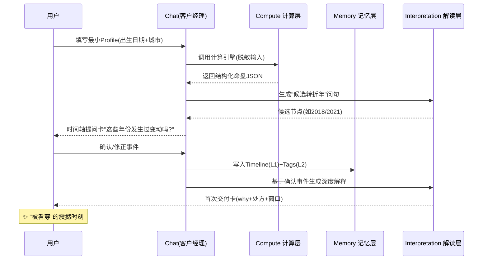
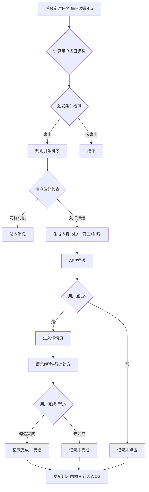

# Fortune AI 系统顶层设计文档 v3.0

**文档类型**: System Top-Level Design
**产品代号**: `Fortune AI`（全局唯一命名）
**版本**: 3.0
**日期**: 2025-12-29
**密级**: 内部公开
**目标读者**: 高层决策者 / 产品团队 / 开发团队
**硬约束**: **纯 AI（不引入真人服务）**、**不做社区**、保留 **合盘/关系模拟** 等社交属性

---

## 证据索引（交叉分析来源）

| 代号 | 来源 |
|---|---|
| `[C]` | `docs/architech/concenpt design.md` |
| `[R]` | `docs/architech/survey real expert.md` |
| `[S]` | `docs/architech/survey social.md` |
| `[O]` | `docs/architech/survey other product.md` |
| `[V2]` | `docs/architech/system_design_claude_v2.md` |
| `[V3-C]` | `docs/architech/system_design_codex_v3.md` |

## 文档修订历史

| 版本 | 日期 | 作者 | 修订说明 |
|---|---|---|---|
| v1.0 | 2025-12-24 | Claude | 初始版本 |
| v2.0 | 2025-12-24 | Claude | 融合三版优化，强化Profile/记忆/模块化架构 |
| v3.0 | 2025-12-29 | Claude | 统一命名 Fortune AI；与 Codex v3 对齐；强化交付卡契约与指标口径；深化抗幻觉架构；明确不做社区但保留社交能力 |

---

## 目录

0. [一页结论（给高层）](#0-一页结论给高层)
1. [核心战略与价值主张](#1-核心战略与价值主张-strategic-core)
2. [用户画像与需求洞察](#2-用户画像与需求洞察-persona--needs)
3. [系统功能架构设计](#3-系统功能架构设计-functional-architecture)
4. [关键业务流程设计](#4-关键业务流程设计-key-business-flows)
5. [技术架构原则](#5-技术架构原则-technical-architecture-principles)
6. [差异化竞争壁垒](#6-差异化竞争壁垒-the-moat)
7. [路线图与待决事项](#7-路线图与待决事项)

---

## 0. 一页结论（给高层）

### 0.1 一句话定位（UVRA）

> **Fortune AI 是 AI 驱动的"人生导航系统"：用确定性命理计算 + 结构化知识与心理/成长框架，把不确定性转化为可执行的行动处方，帮助用户理解"我是谁、我从何处来、我往何处去"，减少焦虑并持续提升。**（证据：[R][S][O][C]）

### 0.2 核心差异化定位

| 维度 | 传统算命App | 西方竞品 | AI随机占卜 | Fortune AI |
|---|---|---|---|---|
| **命理深度** | 算法深/体验土 | 体验好/东方缺失 | 无体系/幻觉多 | **东方内核+西方体验** |
| **交互方式** | 被动查询 | 被动推送 | 问答式 | **主动服务+客户经理式交互** |
| **用户理解** | 无记忆 | 基础记忆 | 无上下文 | **深度Profile+三层记忆** |
| **输出形式** | 诗句/结论 | 心理描述 | 随机文案 | **交付卡契约：结论+证据+处方+边界** |
| **行动抓手** | 弱/恐吓营销 | 中等 | 无 | **≤3条可执行行动+话术模板** |
| **真人服务** | 有（贵/难规模化） | 无 | 无 | **纯AI（用算力换人力）** |

### 0.3 范围声明（In/Out）

| 类别 | In Scope（要做） | Out of Scope（明确不做） |
|---|---|---|
| 服务形态 | Bento 仪表盘、客户经理式 Chat、主动服务、行动处方、合盘/关系模拟、AIGC 卡片/壁纸 | **真人咨询/专家市场/代聊** |
| 社交 | 合盘、关系说明书、关系场景模拟、私域分享（点对点） | **社区/Feed/UGC 广场/接龙/同运社区** |
| 数据 | Profile（真实信息）+ Past/Plan/Goal + 反馈闭环（可控可删） | 跨应用追踪、暗采通讯录/社媒抓取 |

### 0.4 北极星指标（统一口径）

**L1 北极星：WCG（Weekly Closed-loop Guidance）周度有效指引闭环**

定义：用户在一周内完成一次"**触发 → 指引 → 行动 → 反馈**"闭环的去重用户数。

| 闭环要素 | 最小判定口径（埋点） |
|---|---|
| Trigger | 主动推送点击 / 用户发起对话 / 打开指引卡 |
| Guidance | 生成并展示结构化交付卡（见 §3.3） |
| Action | 勾选/执行 ≥1 个处方项 |
| Feedback | 记录结果/情绪变化（或确认是否有帮助） |

**L2 过程指标**：
- `ProactiveLoopCompletion` 推送→点击→行动完成率
- `DAG` Daily Active Guidance 每日有效指引人数

**L3 质量指标**：
- `Satisfaction` 满意度/NPS
- `HallucinationReportRate` 幻觉投诉率
- `PrivacyIncident` 隐私事件

---

## 1. 核心战略与价值主张 (Strategic Core)

### 1.1 市场空白与机会

基于竞品分析、社交舆情和真人服务调研，识别出三大结构性空白：

| 空白类型 | 现状描述 | 用户痛点 | Fortune AI 解决方案 |
|---|---|---|---|
| **东方玄学现代化** | 西方App体验好但无东方命理；东方App算法深但界面土 | 年轻用户想要"准"但也要"酷" | 硅谷产品方法论+东方命理内核 [O] |
| **行动处方断层** | 大多数App只说"会发生什么" | 用户真正需要"现在该做什么" | 玄学驱动的ToDo List + 沟通话术模板 [R][S] |
| **情感连接缺失** | AI冷冰冰、真人贵且慢 | 深夜焦虑时需要即时陪伴 | 有记忆、有温度的AI伴侣（客户经理角色）[R][V2] |

### 1.2 战略：从"预测"升级为"导航"

| 用户真正购买的 | 传统交付 | Fortune AI 交付 |
|---|---|---|
| 确定性与解释框架 | 诗句/模糊结论 | 结构化洞察（why）+证据锚点（internal） |
| 行动抓手 | 很少/恐吓式 | 行动处方（ToDo/话术/仪式）≤3条 |
| 陪伴与温度 | 真人强/AI弱 | Persona + 模板治理 + 记忆引用 |
| 身份与社交货币 | 零散 | 可分享的卡片/壁纸/关系能量图（低敏） |

### 1.3 产品原则（硬约束）

| 原则 | 强制落地方式 |
|---|---|
| **不制造恐慌** | 每条负面提醒必须包含"处方 + 时间窗口 + 风险边界" |
| **可解释可追溯** | 关键结论绑定 `plugin` / `rule_id` / `kb_id`（内部审计用） |
| **隐私优先（数字告解室）** | PII 隔离、脱敏推理、一键焚毁、同意可撤销 |
| **行动优先** | 默认 ≤3 条最小行动（可勾选、可复盘） |
| **不做社区但要社交** | 点对点关系分析 + 分享降敏；禁止公域内容池 |

### 1.4 UVRA 价值主张分解

```
┌─────────────────────────────────────────────────────────────┐
│                    UVRA 价值主张分解                         │
├─────────────────────────────────────────────────────────────┤
│                                                             │
│   U (User)      │  20-40岁城市人群，面临决策焦虑            │
│                 │  渴望掌控感与情感陪伴                      │
│                 │  理性但需要"玄学"归因框架                  │
│                 │                                           │
│   V (Value)     │  【预测】精确的命理计算                    │
│                 │  【解释】心理学框架的深度解读              │
│                 │  【行动】可执行的建议与话术模板            │
│                 │  【陪伴】有记忆的主动式AI伴侣              │
│                 │                                           │
│   R (Reason)    │  唯一结合:                                │
│                 │  • 多命理系统(八字/紫微/星盘)融合          │
│                 │  • 数学脑/语言脑分层架构(抗幻觉)           │
│                 │  • 长期记忆架构(情绪日志+人生事件)         │
│                 │  • 模块化AI引擎(可配置风格/哲学体系)       │
│                 │                                           │
│   A (Advantage) │  vs 真人: 24/7秒级响应, ¥19/月无限次      │
│                 │  vs 竞品: 深度记忆+主动服务+行动处方       │
│                 │  vs 传统: 现代设计+AI生图+合规表达        │
│                 │                                           │
└─────────────────────────────────────────────────────────────┘
```

---

## 2. 用户画像与需求洞察 (Persona & Needs)

### 2.1 三类核心画像（功能与商业分层）

| Persona | 典型场景 | 核心诉求 | 对应关键功能 | 付费意愿 |
|---|---|---|---|---|
| **P1 情绪探索者** | 深夜焦虑/分手迷茫/日常吐槽 | 共情、安抚、可执行"止痛" | Warm Persona + 仪式 + 主动服务 [R] | 中（为体验付费） |
| **P2 理性决策者** | Offer选择/跳槽/谈判/投资 | 结构化对比、验证计划、边界 | Pro Persona + 决策卡 + 30天计划 [O] | 高（为精准付费） |
| **P3 关系驱动者** | 暗恋/同事/伴侣冲突 | 合盘、沟通策略、场景模拟 | 合盘/关系模拟 + 话术脚本 [S][O] | 中高（为洞察付费） |

### 2.2 需求金字塔（"信息→意义"升级路线）

| 层级 | 用户问题 | Fortune AI 输出 |
|---|---|---|
| L1 信息 | "我今天运势如何？" | 盘面要素/指数/关键词卡 |
| L2 解释 | "为什么我最近这么烦？" | 结构解释 + 证据锚点（内部） |
| L3 决策 | "我该选 A 还是 B？" | Option A/B 对比表 + 风险边界 |
| L4 行动 | "我具体怎么做？" | ToDo/话术/仪式（≤3条） |
| L5 意义 | "这段低谷的意义是什么？" | 哲学/教练视角的复盘卡（可配置） |

### 2.3 痛点-痒点-爽点矩阵

#### 痛点（必须解决）

| 痛点类别 | 具体表现 | 用户心声 | Fortune AI解决方案 |
|---|---|---|---|
| **决策瘫痪** | 面对多选无法决策 | "两个offer都好，该选哪个？" | 基于命理的决策框架+时间匹配度分析 |
| **情绪无处安放** | 深夜焦虑无人倾诉 | "很烦但不知道为什么" | 24/7 AI陪伴+情绪归因解读 |
| **对未知恐惧** | 未来不确定性强 | "明年裁员，我会不会受影响？" | 命运时光轴+主动预警系统 |
| **社交解读困难** | 不理解他人行为 | "他为什么突然冷淡？" | 关系模拟器+沟通话术生成 |
| **AI信任缺失** | AI结论随机/幻觉 | "这个App感觉是随机的" | 回溯验证机制+确定性算法保证 |

#### 痒点（潜意识欲望）

| 痒点类别 | 心理机制 | 产品转化 |
|---|---|---|
| **身份确认** | 巴纳姆效应升级 | 深度"灵魂说明书"+动态标签系统 |
| **窥私欲** | 想了解他人但无法直接问 | "幽灵档案"合盘+关系模拟器 |
| **审美虚荣** | "好看"=好运的视觉暗示 | Nano Banana风格个性化壁纸 |
| **社交货币** | 通过运势内容展示自我 | 可分享的"运势卡片" |
| **掌控感幻觉** | 通过仪式动作获得控制感 | 赛博祭坛+情绪量化互动 |

#### 爽点（超预期体验）

| 爽点类别 | 触发机制 | 设计策略 |
|---|---|---|
| **"被看穿"震撼** | AI说出用户未曾明说的细节 | 命理精确计算+冷读术启发式提问 |
| **及时心理按摩** | 记录情绪后立即收到温暖解读 | 情绪-运势联动推送机制 |
| **视觉化好运** | 打开看到精美专属运势卡 | AI每日生成个性化3D运势卡片 |
| **"原来如此"释然** | 回溯过去找到玄学解释 | 时光机：命理解释关键人生节点 |

### 2.4 用户旅程与关键时刻

```
┌─────────────────────────────────────────────────────────────────┐
│                    Fortune AI 用户旅程地图                       │
├──────────┬───────────────┬───────────────┬─────────────────────┤
│   阶段   │    用户行为    │    情绪状态   │   系统介入(MoT)      │
├──────────┼───────────────┼───────────────┼─────────────────────┤
│ 发现期   │ 小红书种草/    │ 好奇+怀疑    │ 高颜值可分享内容    │
│          │ 朋友分享合盘   │               │ 社交裂变入口        │
├──────────┼───────────────┼───────────────┼─────────────────────┤
│ 注册期   │ 输入生辰信息   │ 谨慎+期待    │ 🔑信任建立:         │
│          │ 选择偏好风格   │               │ 回溯验证-解释过去   │
├──────────┼───────────────┼───────────────┼─────────────────────┤
│ 探索期   │ 浏览Dashboard  │ 兴趣+困惑    │ 🔍首次"被看穿":     │
│          │ 阅读灵魂说明书 │               │ 巴纳姆效应+精确数据 │
├──────────┼───────────────┼───────────────┼─────────────────────┤
│ 依赖期   │ 遇问题问AI    │ 焦虑→释然    │ 💗情感连接深化:      │
│          │ 记录情绪日志   │               │ 有记忆对话+共情回应 │
├──────────┼───────────────┼───────────────┼─────────────────────┤
│ 习惯期   │ 每天早上看运势 │ 依赖→信任    │ ⭐主动服务惊喜:     │
│          │ 期待推送提醒   │               │ 关键时刻运势预警    │
├──────────┼───────────────┼───────────────┼─────────────────────┤
│ 付费期   │ 需要深度分析   │ 理性决策     │ 💰价值感知临界:     │
│          │ 愿意解锁高级   │               │ 限时解锁深度报告    │
└──────────┴───────────────┴───────────────┴─────────────────────┘
```

**Moment of Truth（关键时刻）**：
1. **首次信任建立**：时光轴高亮用户过去的"变动年"，点击确认后展开深度解释
2. **首次"被看穿"**：AI基于命理说出用户未曾明说的性格特质或当前状态
3. **主动服务命中**：推送的运势预警精准命中用户当下的焦虑或问题

---

## 3. 系统功能架构设计 (Functional Architecture)

### 3.1 总体架构（Face / Brain / Body）

```
┌─────────────────────────────────────────────────────────────────┐
│                    Fortune AI 系统架构                           │
├─────────────────────────────────────────────────────────────────┤
│                                                                 │
│  [Face] 客户端层 Client Layer                                    │
│  ┌────────────────────────────────────────────────────────┐    │
│  │  • Bento Home (Dashboard/Cards/Timeline)               │    │
│  │  • Chat: 客户经理式交互 (Client Manager)               │    │
│  │  • Relationship Lab (合盘/关系模拟)                    │    │
│  │  • Ritual Engine (仪式引擎, Local-first)               │    │
│  │  • Share Studio (低敏分享)                             │    │
│  │  • 壁纸工坊 (AIGC Wallpaper)                           │    │
│  └────────────────────────────────────────────────────────┘    │
│                              │                                  │
│                              ▼                                  │
│  [Brain] 编排与智能层 Orchestrator Layer                         │
│  ┌────────────────────────────────────────────────────────┐    │
│  │  • Intent Parser → Task Brief → Tool Routing           │    │
│  │  • Memory System (Timeline/Tags/Vector)                │    │
│  │  • Safety & Compliance (护栏/审计/危机干预)            │    │
│  │  • Proactive Service Engine (主动服务触发器)           │    │
│  └────────────────────────────────────────────────────────┘    │
│                              │                                  │
│                              ▼                                  │
│  [Body] 计算与生成层 Compute Layer                               │
│  ┌────────────────────────────────────────────────────────┐    │
│  │  • Compute Plugins (bazi/ziwei/astrology/tieban/...)   │    │
│  │  • Interpretation Packs (命理/心理/教练/哲学)          │    │
│  │  • Card/AIGC Renderer (卡片/壁纸生成)                  │    │
│  │  • RAG Knowledge Base (结构化知识库)                   │    │
│  └────────────────────────────────────────────────────────┘    │
│                                                                 │
└─────────────────────────────────────────────────────────────────┘
```

### 3.2 前台交互：Bento + Chat（客户经理）

**Bento 首页布局示意**

```
┌───────────────────────────────┬──────────────────────────┐
│                               │                          │
│    今日能量卡 (Hero, 2x2)      │   能量仪表盘 (1x1)       │
│   [AI生成的3D运势卡片]         │   ▓▓▓▓▓▓▓░░ 85%         │
│   "甲辰日 · 表达日"            │   今日能量值             │
│                               │                          │
├───────────────────────────────┼──────────────────────────┤
│                               │                          │
│   行动处方 (1x2)               │   宜忌指引 (1x1)         │
│   □ 重要沟通用邮件            │   ● 宜 深度沟通          │
│   □ 穿蓝色/黑色               │   ✗ 忌 冲动消费          │
│   □ 下午3点后谈重要事项       │                          │
│                               │                          │
├───────────────────────────────┴──────────────────────────┤
│                                                          │
│   主动服务提醒 / 快捷入口 (2x1)                          │
│  ⚠️ 水逆沟通预警  │  💬 问AI  │  🔮 合盘  │  📜 时光机  │
│                                                          │
├───────────────────────────────┬──────────────────────────┤
│   人生时间轴卡 (1x2)          │   关系卡 (1x1)           │
│   [Past/Future 可视化]        │   [合盘入口]             │
└───────────────────────────────┴──────────────────────────┘
```

### 3.3 交付卡（Guidance Card）统一契约

**这是 Fortune AI 与用户交互的核心数据契约**

| 字段 | 含义 | 示例 |
|---|---|---|
| `conclusion` | 结论（短，≤50字） | "本周沟通摩擦↑，适合写不适合吵" |
| `why` | 依据（可解释，心理学重构） | "表达-权威冲突信号增强" |
| `prescription[]` | 处方（≤3条） | ["邮件化沟通", "延后重要谈判", "3分钟呼吸练习"] |
| `time_window` | 时间窗口 | "到下周二缓解" |
| `risk_boundary` | 风险边界免责 | "不替代医疗/法律/投资建议" |
| `evidence` | 证据（内部审计用） | `{plugin:"bazi", rule:"R-021", kb:"K-77"}` |
| `mood_tag` | 情绪标签（可选） | "焦虑", "期待", "迷茫" |
| `actionable` | 是否可勾选执行 | `true` |

**示例输出**：

```json
{
  "conclusion": "本周沟通能量冲突，适合书面表达",
  "why": "你的'表达星'(伤官)与'权威星'(正官)正在碰撞，口头沟通容易激化矛盾",
  "prescription": [
    "重要沟通改用邮件或文档",
    "穿蓝色/黑色衣物柔化冲突能量",
    "下周二后再谈重要提案"
  ],
  "time_window": "至下周二（12/31）能量缓解",
  "risk_boundary": "此建议不替代专业法律或心理咨询",
  "evidence": {
    "plugin": "bazi",
    "rule_id": "SHANGGUAN_JIAN_GUAN_001",
    "kb_ref": "K-DiTianSui-Ch12"
  }
}
```

### 3.4 Profile + 记忆架构（核心特色）

#### Profile 必备字段集

| 维度 | 字段示例 | 用途 | 更新机制 |
|---|---|---|---|
| **Truth（真实信息）** | 出生日期/时间（可选精度）、城市级地点 | 计算底座 | 一次性录入 |
| **Charts（命盘）** | 八字四柱、紫微十二宫、星盘相位 | 身份基础 | 自动计算 |
| **Past（过往）** | 3-10 个关键事件（用户确认） | 回溯验证/叙事整合 | 用户交互确认 |
| **Plan/Goal（计划/目标）** | 未来 90 天计划 + 1-3 个目标 | 处方对齐/复盘 | 随时更新 |
| **Preferences** | Persona偏好、推送偏好、敏感话题开关 | 体验与合规 | 可配置 |
| **Tags（动态标签）** | 基于命理+行为的AI生成标签 | 个性化服务 | 定期更新 |

#### 记忆分层架构（工程实现口径）

| 层 | 内容 | 存储 | 写入策略 | 隐私级别 |
|---|---|---|---|---|
| **L0 PII Vault** | 高敏（出生/地点） | 关系库加密分表 | 最小权限 | 极高 |
| **L1 Timeline** | Past/Plan/Goal 结构化事件 | 关系库 SSOT | 用户可编辑/删除 | 高 |
| **L2 Tags** | 动态标签/阶段推断 | 关系库 | 可解释、可撤销 | 中 |
| **L3 Vector** | 对话摘要/主题向量 | 向量库 | 先脱敏+摘要再写入 | 中 |
| **L4 Session** | 短期对话上下文 | Redis/内存 | 会话结束清理 | 低 |

**Profile 数据模型示例**：

```json
{
  "user_id": "uuid",
  "core_profile": {
    "birth_data": {
      "date": "1995-06-15",
      "time": "14:30",
      "time_precision": "hour",
      "location": {"city": "上海", "country": "CN"},
      "true_solar_time": "14:28:32"
    },
    "charts": {
      "bazi": {
        "day_master": "甲木",
        "structure": "伤官生财格",
        "pillars": ["乙亥", "壬午", "甲寅", "辛未"]
      },
      "ziwei": {
        "ming_palace": "贪狼",
        "life_pattern": "变动型"
      },
      "astrology": {
        "sun": "双子座",
        "moon": "天蝎座",
        "ascendant": "狮子座"
      }
    }
  },
  "life_history": {
    "verified_events": [
      {"year": 2018, "type": "job_change", "confirmed": true}
    ]
  },
  "future_plans": {
    "goals": [
      {"id": "g1", "type": "career", "desc": "3年内晋升总监"}
    ],
    "pending_decisions": [
      {"id": "d1", "type": "job_offer", "options": ["A公司", "B公司"]}
    ]
  },
  "dynamic_tags": [
    {"tag": "创意变现者", "confidence": 0.85, "source": "bazi_shangguan"},
    {"tag": "变动期", "confidence": 0.92, "source": "dahyun_transition"}
  ],
  "preferences": {
    "persona": "warm",
    "push_enabled": true,
    "sensitive_topics": ["health_excluded"]
  }
}
```

### 3.5 核心功能模块

#### 功能一：AI交互式对话（客户经理角色）

**设计理念**：类似真人服务中的"客户经理"——理解需求、转化需求、交付结果。

```
┌─────────────────────────────────────────────────────────────────┐
│                   AI交互对话系统架构                              │
├─────────────────────────────────────────────────────────────────┤
│                                                                 │
│  用户输入 → [理解层] → [编排层] → [计算层] → [交付层]            │
│                                                                 │
│  ┌─────────────────────────────────────────────────────────┐   │
│  │  理解层 (Understanding)                                  │   │
│  │  • 意图识别：情感支持? 决策辅助? 信息查询?               │   │
│  │  • 上下文提取：从 Memory 检索相关历史                    │   │
│  │  • 情感识别：委屈? 焦虑? 期待?                           │   │
│  │  → 输出：结构化 Task Brief                               │   │
│  └─────────────────────────────────────────────────────────┘   │
│                          ▼                                      │
│  ┌─────────────────────────────────────────────────────────┐   │
│  │  编排层 (Orchestration)                                  │   │
│  │  • 路由决策：需要哪些计算插件?                           │   │
│  │  • 并行调度：同时调用 bazi + ziwei + RAG                 │   │
│  │  • 安全检查：是否触发护栏?                               │   │
│  └─────────────────────────────────────────────────────────┘   │
│                          ▼                                      │
│  ┌─────────────────────────────────────────────────────────┐   │
│  │  计算层 (Compute) — 确定性算法，无幻觉                   │   │
│  │  ┌────────┐  ┌────────┐  ┌────────┐  ┌────────┐        │   │
│  │  │ 八字   │  │ 紫微   │  │ 星盘   │  │ RAG    │        │   │
│  │  │ 引擎   │  │ 引擎   │  │ 引擎   │  │ 检索   │        │   │
│  │  └────────┘  └────────┘  └────────┘  └────────┘        │   │
│  │  → 输出：结构化事实 JSON                                │   │
│  └─────────────────────────────────────────────────────────┘   │
│                          ▼                                      │
│  ┌─────────────────────────────────────────────────────────┐   │
│  │  交付层 (Delivery) — LLM 只做表达/共情/排版              │   │
│  │  • 套用 Interpretation Pack (心理学重构)                 │   │
│  │  • 应用 Persona (warm/pro/roast)                         │   │
│  │  • 生成 Guidance Card                                    │   │
│  │  • 可选：生成 AIGC 卡片/壁纸                             │   │
│  └─────────────────────────────────────────────────────────┘   │
│                                                                 │
└─────────────────────────────────────────────────────────────────┘
```

**对话设计三原则**：
1. **情绪第一，逻辑第二**：先共情，再解释
2. **行动优于预测**：不只说"会发生什么"，更说"你可以做什么"
3. **时间边界**：给用户一个明确的"苦难结束时间"

#### 功能二：主动服务中心（宇宙瞭望塔）

```
┌─────────────────────────────────────────────────────────────────┐
│                   主动服务触发引擎架构                           │
├─────────────────────────────────────────────────────────────────┤
│                                                                 │
│  ┌─────────────────────────────────────────────────────────┐   │
│  │  触发源 (Trigger Sources)                                │   │
│  │  ┌──────────┐  ┌──────────┐  ┌──────────┐  ┌──────────┐ │   │
│  │  │命盘计算  │  │星象行运  │  │用户情绪  │  │外部事件  │ │   │
│  │  │流日/流月  │  │水逆/土星  │  │连续负面  │  │节气/满月  │ │   │
│  │  └──────────┘  └──────────┘  └──────────┘  └──────────┘ │   │
│  └─────────────────────────────────────────────────────────┘   │
│                          ▼                                      │
│  ┌─────────────────────────────────────────────────────────┐   │
│  │  规则引擎 (Rule Engine) + 排序器                         │   │
│  │  • 匹配触发规则                                          │   │
│  │  • 排序：重要性 × 个人敏感度 × 新颖度                    │   │
│  │  • 去重：过去7天已推送类似内容跳过                       │   │
│  └─────────────────────────────────────────────────────────┘   │
│                          ▼                                      │
│  ┌─────────────────────────────────────────────────────────┐   │
│  │  静默时段检查 + 用户偏好                                 │   │
│  │  • 勿扰时段 → 站内消息                                   │   │
│  │  • 允许推送 → 生成内容                                   │   │
│  └─────────────────────────────────────────────────────────┘   │
│                          ▼                                      │
│  ┌─────────────────────────────────────────────────────────┐   │
│  │  内容生成 + 推送                                         │   │
│  │  • 调用 LLM + RAG 生成个性化文案                         │   │
│  │  • 必须包含：处方 + 时间窗口 + 边界                      │   │
│  │  • 推送 → 追踪点击 → 追踪完成                            │   │
│  └─────────────────────────────────────────────────────────┘   │
│                                                                 │
└─────────────────────────────────────────────────────────────────┘
```

**主动服务触发规则示例**：

| 维度 | 计算逻辑 | 触发条件 | 推送文案示例 |
|---|---|---|---|
| **八字日运** | 流日地支 vs 用户日支 | 六冲/六害/三刑 | "⚠️ 感情预警：今天能量与伴侣宫冲突，各自留点空间。" |
| **紫微流时** | 流时命宫主星 | 地空/地劫入局 | "📉 15:00-17:00 容易破财，看好手机，避免冲动下单。" |
| **星象行运** | 行运水星 vs 本命水星 | 水星逆行开始 | "🔄 水逆沟通预警：发重要邮件前检查三遍。" |
| **情绪归因** | 用户情绪日志 + 运势 | 连续3天负面 | "你最近的压抑感是土星周期带来的成长痛，约持续一周..." |

**主动服务设计原则**：
1. **不制造恐慌**：负面预警必带化解建议
2. **个性化语气**：根据用户 Persona 偏好选择风格
3. **可配置**：用户可选择只接收重要提醒

#### 功能三：羁绊实验室（关系分析与模拟）

| 能力 | 用户价值 | 输出 | 分享方式（非社区） |
|---|---|---|---|
| **多维度合盘** | 关系理解/破冰话题 | 恋爱/事业/友谊/摸鱼四维指数 | 点对点分享卡（低敏） |
| **幽灵档案** | 不便邀请对方时探索 | **以"我方策略"优先** | 不生成公开链接 |
| **场景模拟** | "我该怎么说" | 话术脚本 + 分支应对 | 仅分享"我方话术版" |
| **关系说明书** | 深度理解关系模式 | 双方互动模式 + 风险点 + 建议 | 低敏摘要版可分享 |

**关系数据与隐私边界（强约束）**：

| 项 | 规则 |
|---|---|
| 对方数据来源 | 仅用户输入；不抓取通讯录/社媒 |
| 存储策略 | 可选"本地临时/云端保存"；默认临时 |
| 输出表述 | 避免对第三方做确定性道德评判；用"可能/倾向"+自我策略 |
| 分享默认 | 自动隐藏生日/盘面细节；仅摘要与建议 |

#### 功能四：好运壁纸工坊

**利用 Nano Banana 能力生成个性化视觉资产**

```
用户八字喜好 + 今日星象 + 审美偏好
         │
         ▼
   ┌─────────────────┐
   │  Prompt 转译器   │
   │  八字"火旺"      │
   │    ↓            │
   │  Visual: Neon   │
   │  Fire, magma    │
   └─────────────────┘
         │
         ▼
   ┌─────────────────┐
   │  AIGC 生成引擎   │
   │  (Gemini/等)    │
   └─────────────────┘
         │
         ▼
   ┌─────────────────┐
   │  个性化壁纸     │
   │  [嵌入关键词]   │
   │  [可选水印]     │
   └─────────────────┘
         │
         ▼
   用户保存/分享 → 低成本获客
```

---

## 4. 关键业务流程设计 (Key Business Flows)

### 4.1 新用户信任建立：回溯验证（Hindsight Validation）

**目标**：让用户在5分钟内产生"这个系统真的懂我"的震撼感。



**关键设计点**：
1. **高亮策略**：算法预测的"变动年"在时间轴上标记
2. **交互确认**：用户点击确认后，立即展开深度解释
3. **记忆存储**：验证事件存入长期记忆，后续对话可引用
4. **心理学包装**：将"流年不利"转化为"能量重组期"

### 4.2 深度咨询闭环（客户经理式编排）

```
+------------------+    +---------------------+    +----------------------+
| User Query       | -> | Client Manager Chat | -> | Task Brief (结构化)  |
| "我该离职吗?"     |    | 澄清约束/目标/时间窗 |    | Goal/Options/Constraints|
+------------------+    +----------+----------+    +----------+-----------+
                                  |                          |
                                  v                          v
                        +-------------------+      +----------------------+
                        | Orchestrator      | ---> | Compute Plugins      |
                        | 路由决策          |      | bazi/ziwei/astro     |
                        +---------+---------+      +----------+-----------+
                                  |                          |
                                  +------------+-------------+
                                               v
                                     +-----------------------+
                                     | Interpretation Packs  |
                                     | 心理学重构            |
                                     +-----------+-----------+
                                                 v
                                     +-----------------------+
                                     | Guidance Card         |
                                     | 结论/依据/处方/边界   |
                                     +-----------------------+
```

### 4.3 主动服务完整链路



### 4.4 社交裂变与获客（非社区模式）

| 裂变机制 | 触发场景 | 用户行为 | 平台收益 | 双方收益 |
|---|---|---|---|---|
| **合盘解锁** | 想看详细匹配度 | 邀请对方注册/授权 | 新用户 | 双方解锁深度报告 |
| **好运传递** | 抽到"上上签" | 分享卡片到微信 | 品牌曝光 | 朋友扫码免费抽签 |
| **壁纸水印** | 生成专属壁纸 | 保存并分享 | 内容传播 | 连续分享7天解锁奖励 |
| **运势卡分享** | 今日运势特别好/特别有趣 | 分享到朋友圈 | 低成本获客 | 朋友点击可体验 |

---

## 5. 技术架构原则 (Technical Architecture Principles)

### 5.1 抗幻觉架构：数学脑 / 语言脑分离

**核心原则**：LLM 不做计算，只做表达。

```
┌─────────────────────────────────────────────────────────────────┐
│                   抗幻觉：结构化 RAG 架构                         │
├─────────────────────────────────────────────────────────────────┤
│                                                                 │
│  User Query / Trigger                                           │
│         │                                                       │
│         ▼                                                       │
│  ┌─────────────────────────────────────────────────────────┐   │
│  │  [数学脑] Deterministic Compute                         │   │
│  │  • 八字排盘 (bazi-mcp)                                  │   │
│  │  • 紫微排盘 (iztro)                                     │   │
│  │  • 星盘计算 (pyswisseph)                                │   │
│  │  → 输出：结构化事实 JSON，无幻觉                        │   │
│  └─────────────────────────────────────────────────────────┘   │
│         │                                                       │
│         ▼                                                       │
│  ┌─────────────────────────────────────────────────────────┐   │
│  │  Structured RAG (规则过滤 + 知识检索)                   │   │
│  │  • 先用元数据过滤（日主/流年/问题类型）                 │   │
│  │  • 再用向量相似度检索                                   │   │
│  │  → 输出：相关古籍/现代解读片段                          │   │
│  └─────────────────────────────────────────────────────────┘   │
│         │                                                       │
│         ▼                                                       │
│  ┌─────────────────────────────────────────────────────────┐   │
│  │  [语言脑] LLM Synthesis                                 │   │
│  │  • 只做：表达/共情/排版/心理学重构                      │   │
│  │  • 不做：计算/推断/编造                                 │   │
│  │  • 输入：结构化事实 + 知识片段 + Persona指令            │   │
│  │  → 输出：自然语言 + Guidance Card                       │   │
│  └─────────────────────────────────────────────────────────┘   │
│         │                                                       │
│         ▼                                                       │
│  ┌─────────────────────────────────────────────────────────┐   │
│  │  Renderer (卡片/壁纸/UI组件)                            │   │
│  └─────────────────────────────────────────────────────────┘   │
│                                                                 │
└─────────────────────────────────────────────────────────────────┘
```

### 5.2 模块化后端：插件化计算 + 可配置解读

**计算插件（Calculators）**

| 插件 | 作用 | 输入 | 输出 | 优先级 |
|---|---|---|---|---|
| `bazi` | 八字排盘/十神/大运 | 出生日期时间+地点 | 四柱/十神/大运JSON | MVP |
| `ziwei` | 紫微斗数/十二宫 | 出生日期时间 | 十二宫主星/四化JSON | MVP |
| `astrology` | 西方星盘/相位 | 出生日期时间+地点 | 行星/宫位/相位JSON | MVP |
| `tieban` | 铁板神数 | 八字+命盘 | 条文号/断语 | P2 |
| `qimen` | 奇门遁甲 | 起盘时间 | 九宫格/神煞 | P2 |
| `liuyao` | 六爻卦象 | 摇卦结果 | 本卦/变卦/六亲 | P2 |

**统一接口契约**：

```json
{
  "input": {
    "profile_ref": "p_xxx",
    "time": "2025-12-29T10:00:00+08:00",
    "context": {"scenario": "career", "question": "是否该跳槽"}
  },
  "output": {
    "facts": {},
    "signals": [],
    "scores": {},
    "evidence": {"plugin": "bazi", "rule_ids": ["R-001", "R-021"]}
  }
}
```

**解读包（Interpretation Packs）**

| 包 | 目标 | 代表方法论 | 用途 |
|---|---|---|---|
| `metaphysics` | 命理解释 | 古籍结构化知识 | 提供"为什么"的解释 |
| `psychology` | 情绪承接 | CBT/正念/积极心理学 | 情感支持场景 |
| `coach` | 行动与习惯 | 7 Habits / 高绩效教练 | 决策辅助场景 |
| `philosophy` | 意义与复盘 | 孔子/斯多葛/禅宗 | 深度反思场景 |

**Persona（表达层）**

| Persona | 适用场景 | 语气特点 | 禁止项 |
|---|---|---|---|
| `standard` | 默认 | 平和专业 | 恐吓、羞辱 |
| `warm` | 情绪低落/安抚 | 温柔共情 | 冷漠、说教 |
| `pro` | 理性决策 | 专业简洁 | 废话、煽情 |
| `roast` | 轻娱乐/自嘲 | 幽默毒舌 | 人身攻击、确定性宿命论 |

### 5.3 玄学术语心理学翻译表

| 玄学术语 | 心理学重构 | 行动导向 | 示例回复 |
|---|---|---|---|
| 犯太岁 | 能量重组期 | 主动应变 | "今年是能量重组期，建议主动求变（换工作、学习新技能）" |
| 伤官见官 | 创造力与权威冲突 | 表达方式调整 | "你的创意被权威压制，建议少说话多记录，用邮件沟通" |
| 桃花泛滥 | 社交能量溢出 | 关系边界管理 | "魅力正在吸引关注，建议设定明确的情感边界" |
| 劫财星动 | 冲动消费风险 | 财务防御模式 | "本周社交支出可能增加，建议设定消费上限" |
| 七杀攻身 | 压力测试信号 | 韧性训练 | "你会感到压力，但这正是突破瓶颈的动力" |
| 水星逆行 | 沟通复检期 | 重要沟通双重确认 | "发送重要邮件前检查三遍，签合同仔细看条款" |

### 5.4 隐私与合规：数字告解室标准

| 机制 | 要求 | 目的 |
|---|---|---|
| **PII 隔离** | 高敏数据与对话分库/分表 | 降低泄露面 |
| **脱敏推理** | LLM 仅见"盘面要素/标签"，不见原始生日 | 降低出境与滥用风险 |
| **一键焚毁** | 彻底删除 Timeline/向量记忆 | 建立信任 |
| **同意可撤销** | 随时撤回数据授权 | 合规必需 |
| **输出模板** | 情绪确认→结构解释→处方→窗口→边界 | 去宿命论、可行动 |
| **敏感话题护栏** | 健康/法律/投资 触发免责声明 | 降低合规风险 |

### 5.5 技术栈选型

**前端**

| 层级 | 技术选型 | 理由 |
|---|---|---|
| 跨平台框架 | Flutter | 一套代码支持iOS/Android/Web |
| 状态管理 | Riverpod | 类型安全、现代化 |
| UI组件 | 自研 + Flutter Animate | Neo-Brutalism风格实现 |
| 本地存储 | Hive + SQLite | 用户缓存+本地数据库 |

**后端**

| 层级 | 技术选型 | 理由 |
|---|---|---|
| 编程语言 | Python 3.11+ | AI生态成熟 |
| Web框架 | FastAPI | 高性能、自动文档 |
| 任务队列 | Celery + RabbitMQ | 异步任务处理 |
| 关系数据库 | PostgreSQL 15 | 支持JSON、全文搜索 |
| 向量数据库 | Pinecone / Milvus | 高性能向量检索 |
| 缓存 | Redis Cluster | 高可用缓存 |

**AI与算法**

| 组件 | 技术选型 | 理由 |
|---|---|---|
| LLM | DeepSeek-V3 / ChatGLM-4 | 国产模型、中文理解好 |
| 图像生成 | Gemini 2.5 Flash | Nano Banana能力 |
| 八字引擎 | bazi-mcp (自研扩展) | 开源基础 |
| 紫微引擎 | iztro | 轻量级、链式调用 |
| 星盘引擎 | pyswisseph | 高精度天文计算 |
| Embedding | text-embedding-3-large | 中文语义理解 |

---

## 6. 差异化竞争壁垒 (The Moat)

### 6.1 三大核心壁垒

#### 壁垒一：深度Profile + 长期记忆

| 对比维度 | 传统App | 西方竞品 | Fortune AI |
|---|---|---|---|
| **用户理解** | 无记忆 | 基础记忆 | 深度Profile+三层记忆 |
| **历史追溯** | 无 | 无 | 命运时光轴回溯验证 |
| **未来规划** | 无 | 无 | 用户目标+决策跟踪 |
| **情绪记忆** | 无 | 无 | 情绪日志+运势归因 |
| **离开成本** | 低 | 中 | **极高** |

#### 壁垒二：模块化可扩展AI引擎

| 对比维度 | 传统App | 西方竞品 | Fortune AI |
|---|---|---|---|
| **命理系统** | 单一 | 单一(占星) | **多系统可配置** |
| **解读风格** | 固定 | 固定 | **可切换Persona** |
| **哲学体系** | 无 | 无 | **可选教练模块** |
| **扩展能力** | 困难 | 困难 | **插件式扩展** |

**扩展性示例**：
- 新增"铁板神数"引擎：只需开发计算模块，注册到计算层
- 新增"塔罗"解读：只需将知识录入RAG库
- 新增"教练风格"：只需开发新的Persona模板

#### 壁垒三：主动服务 + 行动处方

| 对比维度 | 被动查询App | 推送类App | Fortune AI |
|---|---|---|---|
| **服务方式** | 等用户问 | 定时推送 | **主动触发+个性化** |
| **内容深度** | 解释命运 | 告知运势 | **行动处方+话术** |
| **情感温度** | 冷 | 冷 | **有温度的陪伴** |
| **闭环能力** | 无 | 无 | **可追踪的完成率** |

### 6.2 为什么纯AI不引入真人服务？

| 决策维度 | 真人服务 | 纯AI | Fortune AI选择 |
|---|---|---|---|
| **响应速度** | 小时级 | 秒级 | ✅ AI更优 |
| **价格** | ¥200-500/次 | ¥19/月无限 | ✅ AI更普惠 |
| **一致性** | 受状态影响 | 始终稳定 | ✅ AI更可靠 |
| **规模化** | 困难 | 容易 | ✅ AI可扩展 |
| **合规风险** | 高（话术难控） | 低（可控） | ✅ AI更安全 |
| **情感深度** | 高 | 中（可提升） | ⚠️ 持续优化 |

**结论**：Fortune AI选择**纯AI路线**，通过持续优化记忆能力和对话深度来弥补情感差距，同时避免真人服务带来的运营复杂性和合规风险。用算力换人力，把"客户经理式交互"产品化。

### 6.3 护城河总结

```
┌─────────────────────────────────────────────────────────────────┐
│                    Fortune AI 护城河                             │
├─────────────────────────────────────────────────────────────────┤
│                                                                 │
│  ┌─────────────────────────────────────────────────────────┐   │
│  │              数据网络效应                                │   │
│  │  用户越多 → AI对话数据越多 → 模型越精准                 │   │
│  │  用户越多 → 合盘数据越多 → 关系分析越准确               │   │
│  └─────────────────────────────────────────────────────────┘   │
│                          ▼                                      │
│  ┌─────────────────────────────────────────────────────────┐   │
│  │              情感网络效应                                │   │
│  │  使用时间越长 → AI越"懂"用户 → 离开成本越高             │   │
│  │  记忆越深厚 → 情感依赖越强 → 护城河越深                 │   │
│  └─────────────────────────────────────────────────────────┘   │
│                          ▼                                      │
│  ┌─────────────────────────────────────────────────────────┐   │
│  │              技术网络效应                                │   │
│  │  知识图谱越完善 → 推理能力越强                          │   │
│  │  插件模块越多 → 扩展性越强 → 护城河越深                 │   │
│  └─────────────────────────────────────────────────────────┘   │
│                          ▼                                      │
│  ┌─────────────────────────────────────────────────────────┐   │
│  │              最终定位                                    │   │
│  │   Fortune AI 不是"算命App"                              │   │
│  │   而是用户的"数字灵魂伴侣"                               │   │
│  │   竞争对手不是其他App                                    │   │
│  │   而是用户的孤独感和焦虑感                               │   │
│  └─────────────────────────────────────────────────────────┘   │
│                                                                 │
└─────────────────────────────────────────────────────────────────┘
```

---

## 7. 路线图与待决事项

### 7.1 实施路线图

| 阶段 | 时间 | 交付重点 | 验收指标 |
|---|---|---|---|
| **P1 MVP** | 3个月 | • 最小Profile/Timeline<br>• 客户经理式Chat<br>• 八字+紫微计算插件<br>• 交付卡契约<br>• WCG埋点 | `WCG > 0.3/周人` |
| **P2 Proactive + Social** | 3个月 | • 主动服务触发引擎<br>• 合盘/关系模拟（含隐私边界）<br>• AIGC卡片/壁纸<br>• 星盘插件 | 主动闭环率提升30% |
| **P3 扩展与治理** | 3个月 | • 插件扩展（铁板/奇门/六爻）<br>• 多解读包<br>• 成本与风控治理<br>• 商业化完善 | 幻觉投诉率下降50% |

### 7.2 商业模式

```
┌─────────────────────────────────────────────────────────────┐
│                    Fortune AI 商业模式                       │
├─────────────────────────────────────────────────────────────┤
│  免费层                    │  高级版 (¥19/月)   │  专业版   │
│  - 基础排盘               │  - 无限AI对话     │  (¥49/月) │
│  - 每日运势               │  - 深度流年报告   │           │
│  - 3次/天AI对话           │  - 完整时光机     │  - 全部功能│
│  - 标准壁纸               │  - 高级壁纸       │  - 多Persona│
│                           │  - 合盘10次/月   │  - 优先服务│
└─────────────────────────────────────────────────────────────┘
                           │
                           ▼
                 预计目标: 10万DAU, 5%付费转化率
                 ARPU: ¥15-25, LTV/CAC > 3
```

### 7.3 待决事项（需要拍板）

| # | 决策项 | 选项 | 影响 | 建议 |
|---|---|---|---|---|
| 1 | **首发市场** | 国内优先 / 海外优先 | 合规与模型选择 | 国内优先（市场验证快） |
| 2 | **出生信息默认精度** | 日期级 / 时间级 / 渐进式 | 转化与准确度 | 渐进式（先日期后时间） |
| 3 | **默认 Persona** | `warm` / `standard` | 新手体验与风险 | `warm`（情感连接优先） |
| 4 | **合盘边界** | 仅我方策略 / 允许概率化剧本 | 合规风险 | 仅我方策略（更安全） |
| 5 | **AIGC图像服务** | 自建 / 第三方API | 成本与质量 | 第三方API（MVP快速验证） |

---

## 附录

### A. 术语表

| 术语 | 英文 | 解释 |
|---|---|---|
| **八字** | BaZi | 中国传统命理学，通过出生年月日时的天干地支推演命运 |
| **紫微斗数** | ZiWei Doushu | 中国传统占星术，通过百余颗星曜在十二宫位的分布分析人生 |
| **RAG** | Retrieval-Augmented Generation | 检索增强生成，提升大模型回答准确性 |
| **巴纳姆效应** | Barnum Effect | 人们倾向于相信模糊、普遍的人格描述 |
| **真太阳时** | True Solar Time | 考虑地理位置的真实太阳时 |
| **Nano Banana** | - | Google Gemini的图像生成能力 |
| **Neo-Brutalism** | - | 新粗野主义设计风格，高对比度、粗边框 |
| **Bento Grid** | - | 便当盒布局，模块化信息组织 |
| **WCG** | Weekly Closed-loop Guidance | 周度有效指引闭环，北极星指标 |
| **PII** | Personally Identifiable Information | 个人身份信息 |

### B. 关键成功指标

| 指标类型 | 具体指标 | 目标值 | 测量方式 |
|---|---|---|---|
| **北极星** | WCG（周闭环用户数） | >30% WAU | 埋点统计 |
| **增长** | DAU、MAU | +20% MoM | 埋点统计 |
| **留存** | D1/D7/D30留存率 | >40%/>20%/>10% | Cohort分析 |
| **互动** | 人均对话次数/天 | >3次 | 行为统计 |
| **变现** | 付费转化率 | >5% | 订阅数据 |
| **质量** | 幻觉投诉率 | <1% | 用户反馈 |
| **情感** | NPS | >40 | 问卷调研 |

---

**文档结束**

*本系统顶层设计文档 v3.0 在 v2.0 基础上进行了重要升级：与 Codex v3 对齐统一命名和指标口径；强化了交付卡契约作为核心数据结构；深化了抗幻觉的数学脑/语言脑分层架构；明确了"不做社区但保留社交"的边界。为 Fortune AI 项目提供清晰的战略方向和可落地的实施方案。*
