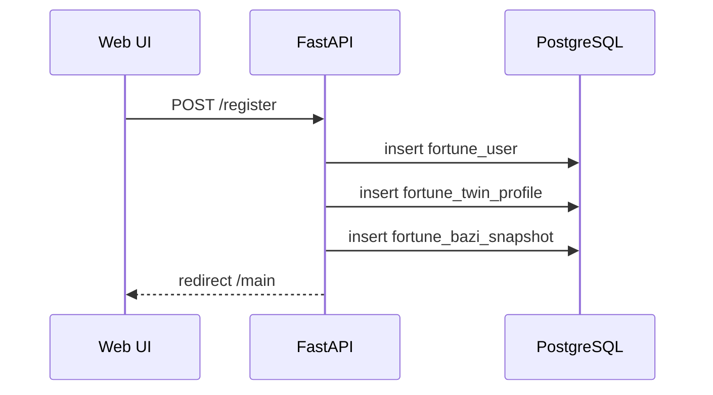
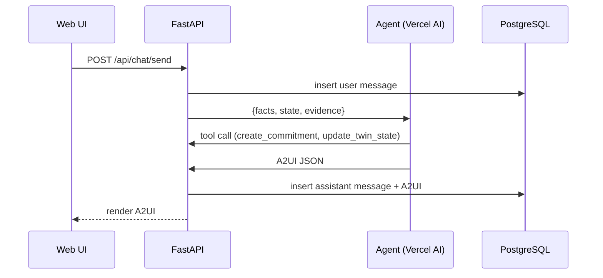
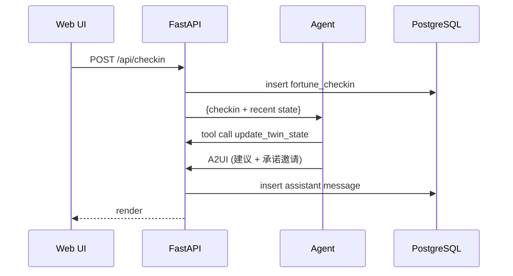

# Fortune AI 系统设计（Codex MVP v1）

**文档类型**：System Design（Codex）  
**版本**：v1.0  
**日期**：2025-12-30  
**输入依据**：  
- `fortune_ai/docs/architech/bp v1.md`  
- `fortune_ai/docs/architech/_archive/system_design_codex_v5.md`  
- 现有实现：`FastAPI + PostgreSQL + A2UI`（`fortune_ai/api`、`fortune_ai/services`、`fortune_ai/migrations`）  

---

## 0. 一页结论（MVP 要交付什么）

### 0.1 MVP 目标

在 Web 端跑通“数字孪生 + 智能体陪伴 + 行动闭环”的最小可用版本：

`Clarify → Insight → Commitment → Action → Reflection → Twin Update`

### 0.2 关键决策（MVP 不变更）

- **SSOT 继续使用 PostgreSQL**，所有业务写入可审计。
- **现有 FastAPI 作为主业务后端**，保留 A2UI 渲染与 Web UI（`bazi2.html` / `ui.js`）。
- **智能体系统采用 `github.com/vercel/ai`（Vercel AI SDK）**，作为独立 Agent Orchestrator 服务，通过内部 API 与 FastAPI 交互。
- **LLM 继续使用 GLM（Z.AI OpenAI 兼容协议）**，由 Vercel AI SDK 调用。
- **MVP 仅做“轻社交 + 分享卡”**，不做公开社区与复杂社交图谱。

### 0.3 目标架构（最小可落地）

```mermaid
flowchart TB
  U[Browser /main] -->|HTTP| API[FastAPI Web/API]
  API --> DB[(PostgreSQL SSOT)]
  API -->|Agent Call| AG[Agent Orchestrator
(Vercel AI SDK)]
  AG -->|Tool Calls| API
  AG -->|LLM| LLM[GLM Provider]
  API -->|Async Jobs| W[Worker]
  W --> DB
```

---

## 1. 需求要点（源自 `bp v1.md`）

### 1.1 核心产品意图

- **精神数字孪生**：把“心理/玄学/行为状态”结构化、量化、可视化。
- **智能体系统**：多 Agent 分工（Coach / Analyst / Social）。
- **行动处方闭环**：让成长从“解释”变为“可执行动作”。
- **社交与仪式感**：轻量化社交与可传播资产（分享卡、接龙、打赏）。

### 1.2 合规与伦理边界

- 禁止“宿命论/恐吓式确定性预言”。
- 风险场景必须提供“你可以做什么”的行动处方。
- 触发自伤关键词时必须切换为危机干预流程。

---

## 2. 现状审阅（基于当前代码与数据库）

### 2.1 现有能力（已具备）

- **Web UI**：两栏布局 + Bento（`fortune_ai/api/templates/bazi2.html`）。
- **A2UI 输出协议**：LLM 输出结构化组件（`fortune_ai/common/a2ui.py`）。
- **对话与承诺闭环**：`fortune_conversation_*`、`fortune_commitment`、`fortune_checkin`、`fortune_plan_*`（`fortune_ai/migrations/20251229_final_mvp.sql`）。
- **LLM 接入**：GLM 兼容 OpenAI 协议（`fortune_ai/services/glm_client.py`）。
- **Bazi 与 Tieban**：确定性计算与报告入口已具备。

### 2.2 缺口（与 `bp v1` 的差距）

- **数字孪生缺 L2/L3**：缺少持续状态更新、指标序列与仪表盘。
- **多智能体编排缺失**：当前是单一 LLM 调用，无 Agent 编排与工具层。
- **社交/仪式玩法未落地**：缺少分享卡、能量打赏、接龙等核心增长机制。
- **对话日志双写风险**：`fortune_ai/services/conversation_store.py` 仍写本地文件，与 DB SSOT 不一致。

---

## 3. MVP 范围裁剪（In / Out）

### 3.1 MVP In Scope

- **L1 数字孪生**：八字 + 用户基础画像（已存在）。
- **L2 动态状态**：情绪打卡、行动承诺、计划进度、近期反馈。
- **L3 轻量指标**：简单“能量/稳定/成长”分值与趋势（可解释）。
- **智能体编排（Vercel AI SDK）**：Analyst → Coach 两级输出。
- **行动闭环**：对话输出 → Commitments → 打卡/复盘。
- **轻量分享卡**：可导出“今日状态/成就”卡片（非社区）。

### 3.2 MVP Out of Scope

- 复杂社交图谱（好友推荐/二阶发现/群组）。
- 现金化打赏/虚拟货币体系（保留数据接口，不做交易）。
- 大规模 AIGC 图像系统（仅提供导出模板）。

---

## 4. 目标架构（MVP 级结构）

### 4.1 组件拆分

| 组件 | 技术 | 责任 |
|---|---|---|
| Web UI | Jinja2 + `ui.js` | 对话、Bento、分享卡导出 |
| API | FastAPI | 身份、SSOT 写入、工具 API |
| Agent Orchestrator | Vercel AI SDK | Agent 编排、工具调用、A2UI 输出 |
| DB | PostgreSQL | 业务 SSOT |
| Worker | Python | 异步任务（推送/内容生成/定时更新） |

### 4.2 数据与调用关系

- **UI → API**：用户输入与展示数据。
- **API → Agent**：聚合 `facts + state + evidence`。
- **Agent → API Tool**：写入承诺、更新孪生状态、写分享卡。
- **Agent → LLM**：只输出 A2UI JSON。

---

## 5. 智能体系统（Vercel AI SDK 实现）

### 5.1 Agent 角色划分

- **Analyst Agent（结构化分析）**
  - 输出：`analysis_state`（问题结构、风险边界、推荐行动候选）。
- **Coach Agent（表达与承诺邀请）**
  - 输入：`analysis_state + facts + evidence + persona_style`。
  - 输出：**A2UI JSON**（markdown_text + action_buttons）。
- **Social Agent（MVP 仅保留接口）**
  - 输出：分享卡文案与标签（不做关系链路）。

### 5.2 Orchestrator 运行逻辑

```text
1) UI -> API: /api/chat/send
2) API -> Agent: {user_context, facts, evidence, intent}
3) Agent: Analyst -> Coach
4) Agent -> API tool: create_commitment / update_twin_state
5) Agent -> API: A2UI JSON
6) API -> DB: 保存对话 + A2UI
```

### 5.3 Vercel AI SDK 关键实现约束

- 使用 `github.com/vercel/ai` 提供的 `streamText` / `generateText`。
- GLM 通过 OpenAI-compatible provider 适配（`baseURL=https://api.z.ai/api/paas/v4`）。
- 所有写操作必须通过 FastAPI Tool API 完成（保证 SSOT）。

---

## 6. 数据模型（MVP 增量）

### 6.1 复用现有表

- `fortune_user` / `fortune_user_preferences`
- `fortune_conversation_session` / `fortune_conversation_message`
- `fortune_commitment` / `fortune_checkin`
- `fortune_plan` / `fortune_plan_day` / `fortune_plan_enrollment`
- `fortune_daily_guidance`

### 6.2 新增表（MVP 必需）

```sql
-- L1/L2 数字孪生
create table if not exists fortune_twin_profile (
  user_id bigint primary key references fortune_user(user_id) on delete cascade,
  meta jsonb not null default '{}'::jsonb,        -- L1 元数据：八字、MBTI、标签等
  created_at timestamptz not null default now(),
  updated_at timestamptz not null default now()
);

create table if not exists fortune_twin_state (
  state_id bigserial primary key,
  user_id bigint not null references fortune_user(user_id) on delete cascade,
  state_date date not null,
  state jsonb not null,                           -- L2 动态状态（情绪/能量/压力/社交）
  source text not null default 'agent',
  created_at timestamptz not null default now(),
  unique (user_id, state_date)
);

-- L3 指标序列（轻量）
create table if not exists fortune_twin_metric (
  metric_id bigserial primary key,
  user_id bigint not null references fortune_user(user_id) on delete cascade,
  metric_key text not null,                       -- energy/stability/growth
  metric_value numeric(6,2) not null,
  metric_date date not null,
  created_at timestamptz not null default now(),
  unique (user_id, metric_key, metric_date)
);

-- Agent 运行审计
create table if not exists fortune_agent_run (
  run_id bigserial primary key,
  user_id bigint not null references fortune_user(user_id) on delete cascade,
  session_id uuid null references fortune_conversation_session(session_id),
  agent_name text not null,
  prompt_version text not null,
  facts_hash text null,
  input jsonb not null,
  output jsonb not null,
  created_at timestamptz not null default now()
);

-- 轻量分享卡（MVP）
create table if not exists fortune_share_card (
  card_id bigserial primary key,
  user_id bigint not null references fortune_user(user_id) on delete cascade,
  card_type text not null,                         -- daily_status / milestone / roast
  payload jsonb not null,                          -- 渲染数据（前端导出）
  created_at timestamptz not null default now()
);
```

---

## 7. 核心业务流程（MVP）

### 7.1 注册与孪生初始化



### 7.2 对话与行动处方



### 7.3 情绪打卡 → 更新孪生 → 行动建议



### 7.4 分享卡导出（轻量）

- API 只返回 `payload`（文本、颜色、徽章、标签）。
- UI 使用 `canvas/html-to-image` 导出图片，不保存图片文件。

---

## 8. API 设计（新增与内部接口）

### 8.1 外部 API（UI 调用）

- `POST /api/chat/send`：对话（已存在）。
- `GET /api/bento/today`：今日指引（已存在）。
- `POST /api/checkin`：情绪打卡（新增或复用）。
- `POST /api/share/create`：生成分享卡 payload（新增）。

### 8.2 内部 Tool API（Agent 调用）

- `GET /api/agent/context`：用户画像 + 计划进度 + 最近状态。
- `GET /api/agent/facts`：最新八字快照与 `facts_hash`。
- `POST /api/agent/commitment`：创建承诺任务。
- `POST /api/agent/twin/update`：写入 `fortune_twin_state` 与 `fortune_twin_metric`。
- `POST /api/agent/share`：写入分享卡 payload。

### 8.3 内部认证与风控

- 内部 Tool API 通过 `SERVICE_TOKEN` 鉴权。
- 写操作全部经 FastAPI，避免 Agent 直接写 DB。

---

## 9. 合规、安全与可观测性

- **合规**：禁止确定性宿命结论；医疗/法律/投资必须附带风险边界。
- **危机干预**：自伤关键词触发“安全协议输出”。
- **日志**：`facts_hash + prompt_version + agent_name` 记录到 `fortune_agent_run`。
- **隐私**：Agent 输入仅包含“摘要级”事实，不直接注入 PII 原文。

---

## 10. 迁移与落地路线图（MVP）

### M0（1 周）

- 清理 `conversation_store.py` 的文件日志路径，统一 DB SSOT。
- 加入 `fortune_twin_profile/state/metric` 表。

### M1（2-3 周）

- 接入 Vercel AI SDK Agent 服务。
- 完成 `Analyst → Coach` 的编排与 Tool API。

### M2（3-4 周）

- 分享卡导出（前端）。
- L3 指标趋势展示（Bento 小卡）。

---

## 11. 开放问题（需确认）

1) MVP 是否允许引入“能量打赏/接龙”作为轻社交？还是完全延后？
2) Vercel Agent 服务与现有 FastAPI 的部署拓扑（内网/公网）如何规划？
3) L1 元数据是否只保留八字 + MBTI，还是需要同步加入“星盘/紫微”？

---

**结论**：在不重写现有 FastAPI 的前提下，将智能体系统独立到 Vercel AI SDK 并通过 Tool API 交互，是当前最快落地“数字孪生 + 行动闭环”的 MVP 路径，同时为后续社交与增长模块预留接口与数据基础。
