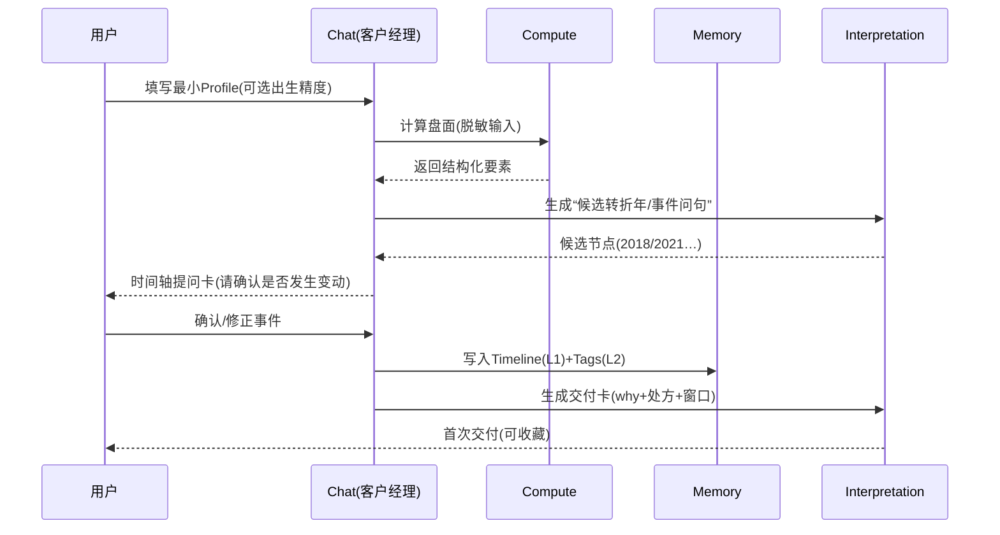
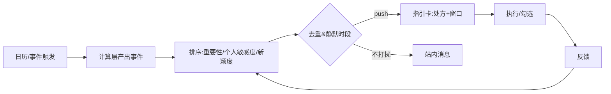

# Fortune AI 系统顶层设计文档 v3.0（统一版）

**文档类型**：System Top-Level Design  
**产品代号**：`Fortune AI`（全局唯一命名）  
**版本**：3.0  
**日期**：2025-12-24  
**目标读者**：高层决策者 / 产品团队 / 开发团队  
**硬约束**：**纯 AI（不引入真人服务）**、**不做社区**、但保留 **合盘/关系模拟** 等社交属性  

## 证据索引（交叉分析来源）

| 代号 | 来源 |
|---|---|
| `[C]` | `docs/architech/concenpt design.md` |
| `[R]` | `docs/architech/survey real expert.md` |
| `[S]` | `docs/architech/survey social.md` |
| `[O]` | `docs/architech/survey other product.md` |
| `[V2]` | 三份 v2：`docs/architech/system_design_codex_v2.md` / `docs/architech/system_design_gemini_v2.md` / `docs/architech/system_design_claude_v2.md` |

## 文档修订历史

| 版本 | 日期 | 作者 | 修订说明 |
|---|---|---|---|
| v3.0 | 2025-12-24 | Codex | 统一命名为 Fortune AI；移除社区/接龙/同运社区；强化合盘与“关系模拟”的隐私边界；统一指标口径与交付卡契约。 |

---

## 0. 一页结论（给高层）

### 0.1 一句话定位（UVRA）

> **Fortune AI 是 AI 驱动的“人生导航系统”：用确定性命理计算 + 结构化知识与心理/成长框架，把不确定性转成可执行的行动处方，帮助用户理解“我是谁、我从何处来、我往何处去”，减少焦虑并持续提升。**（证据：[R][S][O][C]）

### 0.2 我们解决的结构性断层（The Gap）

| 市场方案 | 强项 | 致命短板 | Fortune AI 的策略 |
|---|---|---|---|
| 传统玄学 App | 计算工具齐 | 体验陈旧/恐吓营销/弱行动 | 现代交互 + 合规表达 + 行动处方（[O][R]） |
| 西方竞品（Co-Star/The Pattern） | 审美/心理叙事强 | 东方体系不足；处方弱 | 东方计算底座 + 处方闭环（[O][S]） |
| 通用/随机 AI 占卜 | 便宜即时 | 幻觉、不一致、冷 | **“数学脑/语言脑”分层**（[R]） |
| 真人服务（参考） | 温度/解释权/仪式 | 贵、不可规模化、合规灰区 | **用算力换人力**，把“客户经理式交互”产品化（[R][V2]） |

### 0.3 范围声明（In/Out）

| 类别 | In Scope（要做） | Out of Scope（明确不做） |
|---|---|---|
| 服务形态 | Bento 仪表盘、客户经理式 Chat、主动服务、行动处方、合盘/关系模拟、AIGC 卡片/壁纸 | **真人咨询/专家市场/代聊** |
| 社交 | 合盘、关系说明书、关系场景模拟、私域分享（点对点） | **社区/Feed/UGC 广场/接龙/同运社区** |
| 数据 | Profile（真实信息）+ Past/Plan/Goal + 反馈闭环（可控可删） | 跨应用追踪、暗采通讯录/社媒抓取 |

### 0.4 北极星指标（统一口径）

**L1 北极星：WCG（Weekly Closed-loop Guidance）周度有效指引闭环**  
定义：用户在一周内完成一次“**触发 → 指引 → 行动 → 反馈**”闭环（计次数或去重用户数）。

| 闭环要素 | 最小判定口径（埋点） |
|---|---|
| Trigger | 主动推送点击 / 用户发起对话 / 打开指引卡 |
| Guidance | 生成并展示结构化交付卡（见 §3.2） |
| Action | 勾选/执行 ≥1 个处方项 |
| Feedback | 记录结果/情绪变化（或确认是否有帮助） |

**L2 过程指标（建议）**：`ProactiveLoopCompletion`（推送→点击→行动），`DAG`（每日有效指引人数）。  
**L3 质量指标（建议）**：`Satisfaction`（满意度/NPS）、`HallucinationReportRate`（幻觉投诉率）、`PrivacyIncident`（隐私事件）。  

---

## 1. 核心战略与价值主张 (Strategic Core)

### 1.1 战略：从“预测”升级为“导航”（证据：[S][O][R]）

| 用户真正购买的 | 传统交付 | Fortune AI 交付 |
|---|---|---|
| 确定性与解释框架 | 诗句/结论 | 结构化洞察（why）+证据（internal） |
| 行动抓手 | 很少 | 行动处方（ToDo/话术/仪式） |
| 陪伴与温度 | 真人强 | Persona + 模板治理 + 记忆引用 |
| 身份与社交货币 | 零散 | 可分享的卡片/壁纸/关系能量图（低敏） |

### 1.2 产品原则（硬约束）

| 原则 | 强制落地方式 |
|---|---|
| 不制造恐慌 | 每条负面提醒必须包含“处方 + 时间窗口 + 风险边界” |
| 可解释可追溯 | 关键结论绑定 `plugin` / `rule_id` / `kb_id`（内部） |
| 隐私优先（数字告解室） | PII 隔离、脱敏推理、一键焚毁、同意可撤销 |
| 行动优先 | 默认 ≤3 条最小行动（可勾选、可复盘） |
| 不做社区但要社交 | 点对点关系分析 + 分享降敏；禁止公域内容池 |

---

## 2. 用户画像与需求洞察 (Persona & Needs)

### 2.1 Persona（用于功能与商业分层）

| Persona | 典型场景 | 核心诉求 | 对应关键功能 |
|---|---|---|---|
| P1 情绪探索者 | 深夜焦虑/分手迷茫 | 共情、安抚、可执行“止痛” | Warm Persona + 仪式 + 主动服务（[R]） |
| P2 理性决策者 | Offer/跳槽/谈判 | 结构化对比、验证计划、边界 | Pro Persona + 决策卡 + 30天计划（[O]） |
| P3 关系驱动者 | 暗恋/同事/伴侣冲突 | 合盘、沟通策略、场景模拟 | 合盘/关系模拟 + 话术脚本（[S][O]） |

### 2.2 需求金字塔（“信息→意义”的升级路线）

| 层级 | 用户问题 | Fortune AI 输出 |
|---|---|---|
| L1 信息 | “我今天运势如何？” | 盘面要素/指数/关键词卡 |
| L2 解释 | “为什么我最近这么烦？” | 结构解释 + 证据锚点（内部） |
| L3 决策 | “我该选 A 还是 B？” | Option A/B 对比表 + 风险边界 |
| L4 行动 | “我具体怎么做？” | ToDo/话术/仪式（≤3条） |
| L5 意义 | “这段低谷的意义是什么？” | 哲学/教练视角的复盘卡（可配置） |

---

## 3. 系统功能架构设计 (Functional Architecture)

### 3.1 总体架构（Face / Brain / Body）

```
[Face] Client
  - Bento Home (cards/timeline)
  - Chat: Client Manager (客户经理式交互)
  - Relationship Lab (合盘/关系模拟)
  - Ritual Engine (Local-first)
  - Share Studio (低敏分享)
        |
        v
[Brain] Orchestrator + Memory + Safety
  - Intent -> Task Brief -> Tool Routing
  - Memory (Timeline/Tags/Vector)
  - Safety/Compliance (护栏/审计/危机)
        |
        v
[Body] Deterministic Compute + Interpretation + Renderer
  - Compute Plugins (bazi/ziwei/astrology/tieban/qimen/…)
  - Interpretation Packs (命理/心理/教练/哲学)
  - Card/AIGC Renderer (卡片/壁纸)
```

### 3.2 前台交互：Bento + Chat（客户经理）+ 卡片化交付

**Bento 首页示意（ASCII）**

```
┌───────────────────────┬──────────────────┐
│ 今日能量卡（Hero）      │ 行动处方卡        │
├───────────────────────┼──────────────────┤
│ 人生时间轴卡（Past/Future）│ 关系卡（合盘入口）│
├───────────────────────┼──────────────────┤
│ 视觉资产卡（壁纸/卡片）  │ Chat入口/仪式入口 │
└───────────────────────┴──────────────────┘
```

**交付卡（Guidance Card）统一契约（工程化关键）**

| 字段 | 含义 | 例子 |
|---|---|---|
| `conclusion` | 结论（短） | “本周沟通摩擦↑，适合写不适合吵” |
| `why` | 依据（可解释） | “表达-权威冲突信号增强” |
| `prescription[]` | 处方（≤3条） | “邮件化/延后谈判/3分钟呼吸” |
| `time_window` | 时间窗口 | “到下周二缓解” |
| `risk_boundary` | 风险边界 | “不替代医疗/法律/投资建议” |
| `evidence` | 证据（内部） | `plugin=bazi; rule=R-021; kb=K-77` |

### 3.3 Profile + 记忆架构（核心特色）

**Profile 必备字段集（v3 建议）**

| 维度 | 字段示例 | 用途 |
|---|---|---|
| Truth（真实信息） | 出生日期/时间（可选）、城市级地点（可选） | 计算底座 |
| Past（过往） | 3–10 个关键事件（用户确认） | 回溯验证/叙事整合 |
| Plan/Goal（计划/目标） | 未来 90 天计划 + 1–3 个目标 | 处方对齐/复盘 |
| Preferences | Persona、推送、敏感话题开关 | 体验与合规 |

**记忆分层（工程实现口径）**

| 层 | 内容 | 存储 | 写入策略 |
|---|---|---|---|
| L0 PII Vault | 高敏（出生/地点） | 关系库加密分表 | 最小权限 |
| L1 Timeline | Past/Plan/Goal | 关系库 SSOT | 用户可编辑/删除 |
| L2 Tags | 动态标签/阶段推断 | 关系库 | 可解释、可撤销 |
| L3 Vector | 对话摘要/主题 | 向量库 | 先脱敏+摘要再写入 |

---

## 4. 关键业务流程 (Key Business Flows)

### 4.1 新用户信任建立：回溯验证（Hindsight Validation）



### 4.2 深度咨询闭环（客户经理式编排，替代真人）

```ascii
+------------------+    +---------------------+    +----------------------+
| User Query       | -> | Client Manager Chat | -> | Task Brief (结构化)  |
| "我该离职吗?"     |    | 澄清约束/目标/时间窗 |    | Goal/Options/Constraints|
+------------------+    +----------+----------+    +----------+-----------+
                                  |                          |
                                  v                          v
                        +-------------------+      +----------------------+
                        | Orchestrator      | ---> | Compute Plugins      |
                        | tool routing      |      | bazi/ziwei/astro/... |
                        +---------+---------+      +----------+-----------+
                                  |                          |
                                  +------------+-------------+
                                               v
                                     +-----------------------+
                                     | Interpretation Packs  |
                                     | metaphysics/psy/coach |
                                     +-----------+-----------+
                                                 v
                                     +-----------------------+
                                     | Guidance Card         |
                                     | conclusion/why/action |
                                     +-----------------------+
```

### 4.3 主动服务（宇宙瞭望塔）：Trigger→Rank→Push→Action→Feedback



### 4.4 合盘与关系模拟（社交但不做社区）

| 能力 | 用户价值 | 输出 | 增长/分享方式（不等于社区） |
|---|---|---|---|
| 合盘（Synastry） | 关系理解/破冰话题 | 关系说明书 + 风险点 + 建议 | 点对点分享卡（低敏） |
| 幽灵档案（Ghost Profile） | 不便邀请对方时的探索 | **以“我方策略”优先** | 不生成公开链接，不进社区 |
| 场景模拟 | “我该怎么说” | 话术脚本 + 分支应对 | 仅分享“我方话术版” |

**关系数据与隐私边界（强约束）**

| 项 | 规则 |
|---|---|
| 对方数据来源 | 仅用户输入；不抓取通讯录/社媒 |
| 存储策略 | 可选“本地临时/云端保存”；默认临时（减少风险） |
| 输出表述 | 避免对第三方做确定性道德评判；用“可能/倾向”+自我策略 |
| 分享默认 | 自动隐藏生日/盘面细节；仅摘要与建议 |

---

## 5. 技术架构原则 (Technical Architecture Principles)

### 5.1 抗幻觉：结构化 RAG（数学脑/语言脑）

```
User/Trigger
  -> Deterministic Compute (结构化事实 JSON)
  -> Structured RAG (规则过滤 + 检索)
  -> LLM Synthesis (只做表达/同理/排版)
  -> Renderer (卡片/壁纸/交互)
```

### 5.2 模块化后端：插件化计算 + 可配置解读 + Persona

**计算插件（Calculators）**

| 插件 | 作用 | 备注 |
|---|---|---|
| `bazi` / `ziwei` / `astrology` | 性格/周期/行运 | MVP优先 |
| `tieban` / `qimen` | 战术/短期决策 | Phase 2+ |

**解读包（Interpreters）**

| 包 | 目标 | 代表方法论 |
|---|---|---|
| `metaphysics` | 命理解释 | 结构化知识库 |
| `psychology` | 情绪承接 | CBT/正念 |
| `coach` | 行动与习惯 | `7 Habits` / 高绩效 |
| `philosophy` | 意义与复盘 | 孔子/斯多葛 |

**Persona（表达层）**

| Persona | 适用 | 禁止项 |
|---|---|---|
| `standard` / `warm` / `pro` / `roast` | 默认/安抚/理性/轻娱乐 | 恐吓、羞辱、确定性宿命论 |

**统一接口（建议）**

```json
{
  "input": {"profile_ref": "p_xxx", "time": "2025-12-24", "context": {"scenario": "career"}},
  "output": {"facts": {}, "signals": [], "scores": {}, "evidence": []}
}
```

### 5.3 隐私与合规：数字告解室标准（简版）

| 机制 | 要求 | 目的 |
|---|---|---|
| PII 隔离 | 高敏与对话分库/分表 | 降低泄露面 |
| 脱敏推理 | LLM 仅见“盘面要素/标签” | 降低出境与滥用风险 |
| 一键焚毁 | 彻底删除 Timeline/向量记忆 | 建立信任 |
| 输出模板 | 情绪确认→结构解释→处方→窗口→边界 | 去宿命论、可行动 |

---

## 6. 路线图（无社区、纯AI）

| 阶段 | 交付重点 | 验收指标（示例） |
|---|---|---|
| P1 MVP（信任+闭环） | 最小Profile/Timeline、客户经理式Chat、1-2计算插件、交付卡契约、WCG埋点 | `WCG>0.3/周人` |
| P2 Proactive + Social | 主动服务、合盘/关系模拟（含隐私边界）、AIGC卡片/壁纸 | 主动闭环率提升 30% |
| P3 扩展与治理 | 插件扩展（紫微/铁板/奇门等）、多解读包、成本与风控治理 | 幻觉投诉率下降 |

---

## 7. 需要你拍板（v3 收敛后的仅剩 4 个）

1. **首发市场**：国内优先 / 海外优先（影响合规与模型选择）。  
2. **出生信息默认精度**：日期级 / 时间级 / 渐进式引导（影响转化与准确）。  
3. **默认 Persona**：`warm` vs `standard`（影响新手体验与风险）。  
4. **合盘边界**：默认“仅给我方策略”是否足够？是否允许输出“对方可能反应的概率化剧本”（需更强合规护栏）。  

