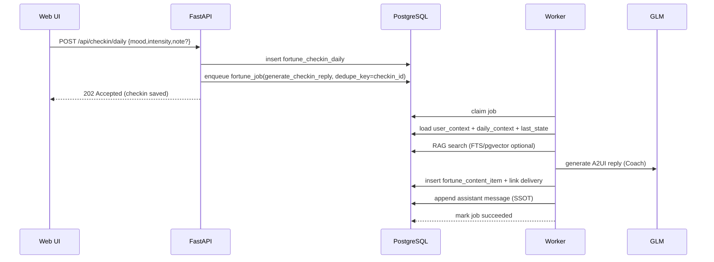

# Fortune AI 系统架构优化设计（Codex v5.0）

**文档类型**：System Design（Codex）  
**产品代号**：`Fortune AI`  
**版本**：`v5.0`  
**日期**：2025-12-30  
**输入依据**：`fortune_ai/docs/architech/idea1.md`（产品模块、增长设想、PostgreSQL/pgvector 架构点）  
**对照参考**：`fortune_ai/docs/architech/system_design_final_mvp.md`（可落地 MVP 约束与实现形态）  

---

## 0. 一页结论（v5 做什么）

### 0.1 v5 的目标

在不破坏 Final MVP 的“有效而极简 / 三点击闭环 / PostgreSQL SSOT / 纯 AI”的前提下，让 `idea1.md` 里“玄学作为入口、积极心理学作为出口”的产品模块真正可工程化扩展，并为增长玩法（分享卡、轻游戏化、有限社交）预留干净的边界。

### 0.2 v5 的架构主张（从“能跑”到“可扩展且可治理”）

**选择：模块化单体（Modular Monolith）+ 异步作业（Worker）+ PostgreSQL SSOT**。

- 仍以 `FastAPI + Jinja2/原生JS + PostgreSQL + GLM` 为主干（降低改造成本）。
- 把“功能”拆成可独立演进的 **能力模块**（Ritual / Content / Plan / Social / Gamification / RAG / Governance）。
- 一切“慢/重/定时”的工作交给 **作业队列**（基于 PostgreSQL 表实现，避免引入额外基础设施）。
- LLM 只负责“表达层”（Coach Persona + A2UI 输出），**事实计算、检索、规则决策、风控**尽量确定化、可审计。

### 0.3 v5 新增能力模块清单（对 `idea1.md` 的落地补齐）

| 模块 | 解决的问题 | `idea1.md` 来源 | 形态（Sync/Async） |
|---|---|---|---|
| `Translation Layer`（玄学→心理学→行动） | 把“玄学洞察”稳定翻译成可执行干预 | “翻译层”核心策略 | Sync（规则+检索） |
| `Ritual Engine`（塔罗/冥想/仪式动画） | 仪式感 + 三点击可完成 | 塔罗占卜与仪式引导 | Sync（抽牌）+ Async（内容生成） |
| `Content Engine`（日签/节气/纪念日/计划内容） | 高频内容供给与调度 | 日常路径 + 节点内容 | Async（生成/投递） |
| `Job Queue & Scheduler`（PG 作业系统） | 推送、内容生成、刷新视图等可控执行 | “定时刷新”“物化视图” | Async（Worker） |
| `Gamification`（Aura Points 账本+勋章） | 可量化激励（但不鼓励依赖） | Aura Points、成就展示 | Sync 写账本 + Async 统计 |
| `Social (P2P)`（好友/合盘/二阶发现） | 保留点对点社交，不做社区 | 社交图谱、递归 CTE | Sync（查询）+ Async（推荐） |
| `Share Card`（Roast/愿景板/显化日记导出） | 传播与增长 | Cosmic Roast、Bento Grid、显化日记 | Client 导出优先（减少存储） |
| `Governance`（提示词版本、成本、评测、风控） | LLM 可控、可回溯、可迭代 | “专业可靠且个性化”所需底座 | Sync+Async（评测） |

---

## 1. 约束与设计原则（v5 不推翻现有共识）

### 1.1 产品硬约束（沿用 MVP）

- **纯 AI**：不引入真人服务链路。
- **不做社区**：不做公开 Feed/广场；仅保留可选的 **点对点社交** 与 **匿名聚合展示**（例如“星光地图”）。
- **三点击原则**：任何核心价值都必须在 ≤3 次点击内完成（`Clarify → Insight → Commitment`）。
- **SSOT=PostgreSQL**：业务写入均落 `PostgreSQL`，并可追溯。

### 1.2 工程原则（为后续扩展“留接口，不留债”）

- **确定性优先**：命理/节律/抽牌随机性等关键事实必须可复现（seed/版本/输入哈希）。
- **LLM 表达层化**：LLM 不负责“算命事实/数据库真相/规则判断”，只负责“解释、共情、表达与行动邀请”。
- **异步化重任务**：推送、日更内容、批处理统计、向量化等一律走作业队列。
- **事件驱动但不引入 MQ**：用 `fortune_event`（或等价事件表）做域事件日志，Worker 消费事件或作业。
- **可审计**：关键输出都要能回放：`facts_hash` + `prompt_version` + `kb_citations` + `job_id`。

---

## 2. v5 顶层架构（模块化单体 + PG 作业系统）

### 2.1 组件总览

```mermaid
flowchart TB
  U[Browser /main] -->|HTTP| API[FastAPI Web App]
  API --> DB[(PostgreSQL\nSSOT)]
  API -->|chat completions| LLM[GLM Provider]
  API -->|enqueue| JOBS[(fortune_job)]
  WORKER[Worker\n(job runner)] -->|poll/claim| JOBS
  WORKER --> DB
  WORKER -->|optional embeddings| EMB[Embedding Provider]
  WORKER -->|optional| LLM
```

> 说明：v5 仍保持单体部署形态，但把“耗时/定时/批处理”从 Web 请求路径剥离到 Worker，避免 `/api/*` 端点被推送/内容生成拖垮。

### 2.2 部署形态（最小可用 + 可扩展）

- `web`：`uvicorn/gunicorn` 跑 FastAPI（同步请求、A2UI 渲染、读写 DB）。
- `worker`：独立进程（或容器）轮询 `fortune_job`，执行内容生成/推送/刷新/统计。
- `scheduler`：可选两种方式之一（推荐先简单）：
  - **方式 A（推荐 MVP→v5）**：`worker` 内部定时器（例如 APScheduler）只负责“投递作业”，不做重计算。
  - **方式 B（更稳）**：`cron`/`systemd timer` 定时调用一个内部端点（或脚本）创建作业。

---

## 3. 能力模块拆分（面向 `idea1.md` 的工程化映射）

### 3.1 模块地图（从“功能点”到“可维护的域”）

| 能力模块 | 职责 | 主要数据（SSOT） | 对外输出 |
|---|---|---|---|
| `User/Profile` | 账户、画像、偏好、隐私设置 | `fortune_user/*` | `user_context` |
| `Conversation SSOT` | 对话会话、消息、摘要、引用证据 | `fortune_conversation_session/fortune_message` | A2UI（Chat） |
| `Metaphysics Facts` | 八字/星象/节气/黄历等确定性事实 | `fortune_bazi_snapshot` + `fortune_daily_context` | `facts`（可复现） |
| `Assessment` | 自我效能/优势等微量表与评估 | `fortune_assessment/*` | `assessment_state` |
| `Translation Layer` | 玄学符号→心理学构念→干预动作 | `fortune_translation_rule` + KB | `prescription_candidates` |
| `Ritual Engine` | 塔罗抽牌、冥想/呼吸、仪式动作编排 | `fortune_tarot_draw/fortune_ritual_run` | `ritual_card` |
| `Plan & Commitment` | 7/30 天计划、任务、承诺、复盘 | `fortune_plan/*` `fortune_commitment` | `next_actions` |
| `Content Engine` | 日签/节气贴/纪念日内容的生成与投递 | `fortune_content/*` `fortune_content_delivery` | `today_feed` |
| `Notification Engine` | 提醒与静默、频控、反依赖降频 | `fortune_notification/*` | `push/send` |
| `Gamification` | Aura Points 账本、勋章、成长足迹 | `fortune_ledger_entry` `fortune_badge_award` | `stats/badges` |
| `Social (P2P)` | 好友关系、合盘、二阶发现（可选） | `fortune_social_edge` | `compatibility` |
| `Share Card` | “毒舌报告/愿景板/显化日记”导出 | `fortune_share_template` | `export_payload` |
| `Governance` | 提示词版本、成本、评测、风险控制 | `fortune_prompt/*` `fortune_llm_usage` | `audit/metrics` |

### 3.2 模块之间的依赖规则（避免“全都耦合在 Chat”）

- `Chat Agent`（LLM）只允许读取：
  - `facts`（确定性）+ `state`（计划进度/评估摘要）+ `evidence`（检索片段与引用）
  - 不允许直接读取原始全量数据（避免隐私泄漏与 token 浪费）
- `Translation Layer` 必须在 LLM 调用前完成候选动作生成；LLM 只做“排序/表达/邀请承诺”。
- `Content Engine` 与 `Notification Engine` 必须走异步作业；Web 路径只读“今日已生成内容”。

---

## 4. 数据层设计（PostgreSQL：从 MVP 到 v5 的增量）

> 目标：不引入新数据库；用清晰的表把“内容/计划/账本/社交/评测”从对话消息里解耦出来。

### 4.1 新增关键表（建议命名；以现有表为准微调）

#### 4.1.1 作业队列：`fortune_job`

用于承载：内容生成、推送投递、物化视图刷新、embedding 生成、周报总结等。

```sql
-- 伪 DDL：字段可按现有项目习惯调整
create table fortune_job (
  job_id bigserial primary key,
  job_type text not null,
  status text not null,               -- queued/running/succeeded/failed/canceled
  priority int not null default 100,
  dedupe_key text null,               -- 幂等：同一 key 只允许存在一个有效 job
  payload jsonb not null default '{}'::jsonb,
  run_after timestamptz not null default now(),
  locked_at timestamptz null,
  locked_by text null,
  attempts int not null default 0,
  last_error text null,
  created_at timestamptz not null default now(),
  updated_at timestamptz not null default now()
);
create index on fortune_job (status, priority, run_after);
create unique index fortune_job_dedupe_active
  on fortune_job (dedupe_key)
  where dedupe_key is not null and status in ('queued','running');
```

#### 4.1.2 日常上下文：`fortune_daily_context`

承载：节气/星象窗口/宜忌/主题色等，供内容引擎与对话引用。

```sql
create table fortune_daily_context (
  day date primary key,
  timezone text not null default 'Asia/Shanghai',
  solar_term text null,
  lunar_day text null,
  astro_events jsonb not null default '{}'::jsonb,
  theme jsonb not null default '{}'::jsonb,
  facts_hash text not null
);
```

#### 4.1.3 塔罗与仪式：`fortune_tarot_draw` / `fortune_ritual_run`

关键：每日抽牌需可复现（seed + 规则版本 + deck 版本）。

```sql
create table fortune_tarot_draw (
  draw_id bigserial primary key,
  user_id bigint not null,
  draw_type text not null,            -- daily/sign/question
  spread text not null,               -- one_card/three_card/...
  seed text not null,
  cards jsonb not null,               -- [{card_id, orientation}]
  deck_version text not null,
  created_at timestamptz not null default now()
);
create index on fortune_tarot_draw (user_id, created_at desc);
```

#### 4.1.4 内容引擎：`fortune_content_item` / `fortune_content_delivery`

把“今天给用户看的那张卡片/那段文本”当成一等公民，避免每次都即席生成。

```sql
create table fortune_content_item (
  content_id bigserial primary key,
  content_type text not null,         -- daily_checkin_reply/solar_term_post/tarot_daily/plan_day/roast/...
  content_version text not null,      -- 模板版本/提示词版本
  payload jsonb not null,             -- A2UI 或渲染数据
  facts_hash text null,
  created_at timestamptz not null default now()
);

create table fortune_content_delivery (
  delivery_id bigserial primary key,
  user_id bigint not null,
  content_id bigint not null references fortune_content_item(content_id),
  deliver_at timestamptz not null,
  status text not null,               -- scheduled/sent/failed/seen
  channel text not null default 'inbox', -- inbox/push/email(可选)
  created_at timestamptz not null default now()
);
create index on fortune_content_delivery (user_id, deliver_at desc);
```

#### 4.1.5 Aura Points 账本：`fortune_ledger_entry`

用账本而非“直接改余额”，保证可追溯与可纠错（`idea1.md` 的 Ledger 设想）。

```sql
create table fortune_ledger_entry (
  entry_id bigserial primary key,
  user_id bigint not null,
  amount int not null,                -- 正负分
  reason text not null,               -- e.g. complete_commitment / doomscroll / water_retrograde_text_ex
  ref_type text null,                 -- commitment/checkin/social/...
  ref_id text null,
  created_at timestamptz not null default now()
);
create index on fortune_ledger_entry (user_id, created_at desc);
```

> 余额查询：用视图/物化视图聚合（必要时定时刷新），避免频繁 `sum()` 扫全表。

#### 4.1.6 好友关系（点对点）：`fortune_social_edge`

用邻接表（Adjacency List）+ 递归 CTE（`idea1.md` 设想）即可支撑二阶发现，不引入图数据库。

```sql
create table fortune_social_edge (
  user_id bigint not null,
  peer_user_id bigint not null,
  status text not null,               -- pending/accepted/blocked
  created_at timestamptz not null default now(),
  updated_at timestamptz not null default now(),
  primary key (user_id, peer_user_id)
);
create index on fortune_social_edge (peer_user_id, status);
```

#### 4.1.7 pgvector（可选）：KB chunk 向量化

在不新增外部向量库的前提下，把“心理学文章/干预手册/玄学解释片段”做语义检索。

```sql
-- 需要 extension：create extension if not exists vector;
create table fortune_kb_chunk (
  chunk_id bigserial primary key,
  source text not null,
  title text null,
  content text not null,
  embedding vector(1536) null,
  meta jsonb not null default '{}'::jsonb,
  created_at timestamptz not null default now()
);
```

### 4.2 数据写入的“闭环主线”（保证可度量）

所有关键行为都应落事件或事实表，用于 WCG/提升指标计算：

- `checkin`（情绪/强度）→ `fortune_checkin_daily`
- `commitment`（承诺）→ `fortune_commitment`
- `action`（完成/跳过）→ `fortune_commitment_progress`
- `reflection`（复盘）→ `fortune_reflection`
- `ledger`（激励）→ `fortune_ledger_entry`
- `content_seen`（内容触达）→ `fortune_content_delivery.status=seen`

---

## 5. 异步作业系统（v5 的关键“减耦合器”）

### 5.1 Worker 取任务策略（PostgreSQL 原生实现）

核心点：`FOR UPDATE SKIP LOCKED` + `dedupe_key` 幂等。

```sql
with cte as (
  select job_id
  from fortune_job
  where status = 'queued' and run_after <= now()
  order by priority asc, job_id asc
  for update skip locked
  limit 1
)
update fortune_job j
set status='running', locked_at=now(), locked_by=$1, attempts=attempts+1, updated_at=now()
from cte
where j.job_id = cte.job_id
returning j.*;
```

### 5.2 v5 需要的作业类型（建议最小集）

- `build_daily_context(day)`：生成 `fortune_daily_context`
- `generate_daily_tarot(user_id, day)`：写 `fortune_tarot_draw` + `fortune_content_item`
- `generate_checkin_reply(checkin_id)`：把 checkin 变成“共情+建议+最小行动”
- `deliver_notifications(batch)`：按静默/频控投递
- `refresh_mv(name)`：排行榜/余额等物化视图刷新（如采用）
- `compute_embeddings(chunk_id_batch)`：向量化（可选）

---

## 6. 关键业务流程（把 `idea1.md` 的体验变成可执行链路）

### 6.1 每日情绪打卡 → AI回应 → 最小行动（高频主路径）



要点：
- Web 请求路径只负责写事实（checkin）与投递作业，避免“打卡卡住”。
- A2UI 输出落库，确保可回放、可复用（同一天重复打开不重新生成）。

### 6.2 塔罗日签（可复现、可解释、可分享）

设计要点：
- 每日抽牌使用确定性 `seed = hash(user_id + day + deck_version)`，保证“今日这张牌”稳定。
- 抽牌结果存 `fortune_tarot_draw`，解读内容存 `fortune_content_item`。
- 分享卡优先走前端导出（canvas），后端只提供渲染数据与模板版本。

### 6.3 7/30 天游程（计划内容由 Content Engine 投递）

- 计划本质是“连续内容 + 连续任务 + 连续复盘”的集合：
  - 内容：每天一张卡（解释/练习/仪式）
  - 任务：最小行动（≤15 分钟优先）
  - 复盘：1–3 题微反思
- 执行策略：
  - `scheduler` 只负责生成 `fortune_content_delivery`（明天要给谁发什么）
  - `worker` 负责真正生成内容（可提前一天生成，失败可重试）

### 6.4 Aura Points（激励但不制造依赖）

来源事件（示例）：
- 完成承诺 `+X`
- 连续打卡 `+Y`
- 复盘完成 `+Z`
- 过度占卜/重复追问 `-K`（可选；必须温和表达，不羞辱）

实现注意：
- 只写 `fortune_ledger_entry`，余额用视图/物化视图聚合。
- 与反依赖机制联动：当高频求助时，不是“扣分惩罚”，而是“引导行动 + 降频推送”。

### 6.5 点对点社交（可选）：合盘/能量状态/二阶发现

范围控制（符合“不做社区”）：
- 仅好友可见（互相关注/互相同意）。
- “星光地图”仅展示匿名聚合数（不展示个人明细）。
- 二阶发现（朋友的朋友）只作为“推荐候选”，必须显式同意才建立连接。

---

## 7. LLM 编排与翻译层（把“玄学”变成“行动处方”）

### 7.1 统一输入结构：`facts + state + evidence + intent`

- `facts`：八字/节气/星象/抽牌结果等确定性事实（必须可复现）
- `state`：用户计划进度、近期情绪趋势、评估摘要、自我效能变化
- `evidence`：RAG 检索片段（带来源与 chunk_id）
- `intent`：本回合目标（情绪承接 / 决策 / 行动推动 / 复盘）

### 7.2 Translation Layer（核心：可解释、可治理）

最小可行实现：`rules + retrieval` 两段式

1) **规则层**：把玄学符号映射成心理学构念（可审计）
   - 例：`“水逆/沟通摩擦” -> “外界不确定性上升” -> “减少高风险沟通，使用话术模板”`
2) **检索层**：从 KB 中取出对应的干预动作与话术模板（可引用）
3) **处方层**：生成 ≤3 条处方候选，交给 LLM 排序与表达

### 7.3 输出协议：A2UI（沿用 MVP）

LLM 输出只允许：
- `markdown_text`（共情 + 结构化解释）
- `actions`（Commitment 按钮：开始/安排/继续澄清/暂停）
- `cards`（塔罗/节气/任务/复盘组件）

禁止：
- 强预测强断言、恐吓式措辞、医疗/法律/投资指令化建议。

---

## 8. RAG（FTS + pgvector 可选）与知识治理

### 8.1 为什么 v5 要引入语义检索（但不引入新库）

`idea1.md` 里“阴影工作/显化/积极心理练习”等内容跨度大，单靠关键词 FTS 很容易漏召回；但引入外部向量库会增加运维与一致性风险。折中方案：

- 精确检索：`PostgreSQL FTS + pg_trgm`
- 语义检索：`pgvector`（同库同事务域）

### 8.2 检索链路建议

1) 先用 FTS 召回（高精度、低成本）  
2) 若召回不足或 intent 属于“解释型/理论型/阴影工作”，再用向量检索补召回  
3) 合并去重，按 `evidence_score` 选 Top-K（K=3..8）  
4) 把证据以可引用形式注入 LLM，并把 `chunk_id` 写入审计字段

---

## 9. 增长与传播能力（不污染核心闭环）

### 9.1 Share Card：把内容变成“可传播资产”

来自 `idea1.md` 的增长点：
- `The Cosmic Roast`（毒舌报告）
- `Bento Grid` 愿景板/仪表盘
- “幸运女孩”显化日记模板

架构策略（优先轻量）：
- 后端：只产出 `export_payload`（数据+模板版本+样式 token）
- 前端：渲染并导出图片（`canvas`/`html-to-image`），用户自主保存/分享
- 仅在确需“可回看”的场景，才把导出图片上传存储（可后置）

### 9.2 电子木鱼/赛博功德（轻游戏化）

建议把它当成“前端互动 + 后端账本”的组合：
- 前端负责体验（动画/音效/连击）
- 后端只负责记录 `fortune_ledger_entry`（幂等：`ref_type=woodfish, ref_id=day+seq`）

---

## 10. 安全、隐私、伦理与反依赖（v5 必须更系统）

### 10.1 风险识别与安全兜底

- 自伤/他伤风险识别：命中高风险关键词时，强制切换为“安全协议输出”（不走常规话术）。
- 明确边界：医疗/法律/投资场景必须提示“非专业建议”，并引导求助正规渠道。

### 10.2 反依赖机制（从“规则”升级为“系统能力”）

- 频控：同类问题连续出现 → 强制插入“现实行动实验”再继续。
- 降频：30 天游程末期启用“渐退式陪伴”（减少提醒，鼓励主动汇报）。
- 可度量：反依赖触发应写入事件表，便于观察是否影响留存与成长指标。

### 10.3 隐私与数据最小化

- 只把“需要的摘要”注入 LLM：避免把原始日志/敏感字段直接拼到 prompt。
- 数据导出/删除：为后续合规预留端点与审计事件。

---

## 11. v5 落地路线图（分阶段交付，避免大爆炸）

### P0（1–2 周）：把 `idea1.md` 的核心模块跑通

- `Job Queue & Worker`（PG 作业系统）
- `Daily Checkin` + `Content Item/Delivery`
- `Ritual Engine`：每日塔罗日签（可复现 seed）
- `Daily Context`：节气/星象最小集（先规则化）

### P1（2–4 周）：内容供给与闭环强化

- `7/30 Day Plan`：计划内容投递 + 复盘
- `Translation Layer`：玄学→心理→行动（规则+检索最小可用）
- 反依赖机制系统化（频控+渐退）

### P2（4–6 周）：增长与可传播资产

- `Share Card`：Roast / Bento / 显化日记（前端导出）
- `Gamification`：Aura Points 账本 + 勋章（与行动闭环绑定）

### P3（可选）：有限社交（点对点 + 匿名聚合）

- 好友关系、合盘、二阶发现（递归 CTE）
- 星光地图（匿名聚合）

### P4（可选）：pgvector RAG 与 LLM 评测体系

- KB chunk 向量化与语义检索
- 提示词版本管理 + 离线评测（WCG、处方执行率、成本）

---

## 12. 需要提前确认的关键决策（避免后续返工）

1) `Share Card` 是否必须服务端生成图片？若否，优先前端导出以减少存储与合规压力。  
2) `Aura Points` 是否允许负分？若允许，产品表达必须“温和不羞辱”，并明确“分数只是自我觉察工具”。  
3) `Social` 是否严格限定为点对点？若允许群组/能量池，需要更严格的风控与滥用治理。  

