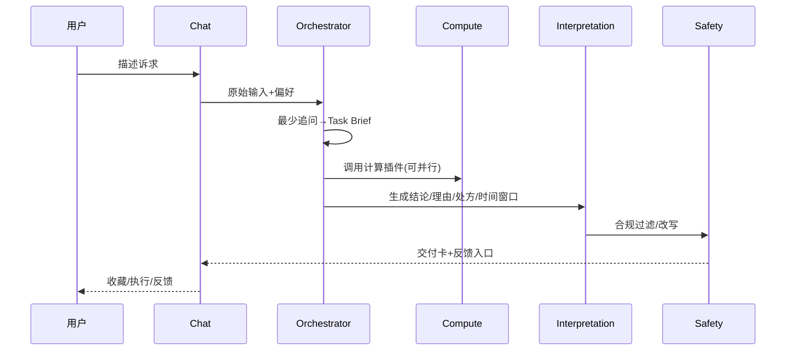
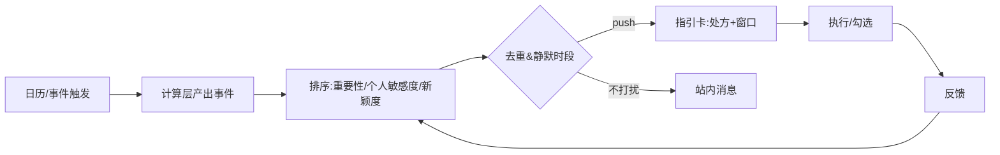

# Fortune AI 系统顶层设计文档 v2.0（融合版）

**文档类型**：System Top-Level Design  
**产品代号**：`Fortune AI`  
**版本**：2.0  
**日期**：2025-12-24  
**目标读者**：高层决策者 / 产品团队 / 开发团队  
**硬约束**：**不引入真人服务**（无专家市场、无真人咨询漏斗）  

## 证据索引（便于交叉验证）

| 代号 | 来源 |
|---|---|
| `[C]` | `docs/architech/concenpt design.md` |
| `[R]` | `docs/architech/survey real expert.md` |
| `[S]` | `docs/architech/survey social.md` |
| `[O]` | `docs/architech/survey other product.md` |
| `[V1]` | 三份 v1：`docs/architech/system_design_codex_v1.md` / `docs/architech/system_design_claude_v1.md` / `docs/architech/system_design_gemini_v1.md` |

## 文档修订历史

| 版本 | 日期 | 作者 | 修订说明 |
|---|---|---|---|
| v2.0 | 2025-12-24 | Codex | 融合 `[V1]`，按“profile/记忆/主动服务/行动处方/关系模拟/现代交互”重写，并显式移除真人服务。 |

---

## 0. 一页结论（给高层）

### 0.1 一句话定位（UVRA）

> **Fortune AI 是 AI 驱动的“人生导航系统”：用确定性命理计算 + 结构化知识与心理/成长框架，把不确定性转成可执行的行动处方，帮助用户理解“我是谁、我从何处来、我往何处去”，减少焦虑并持续提升。**（证据：[R][S][O][C]）

### 0.2 我们解决的结构性断层（The Gap）

| 市场现状 | 主要问题 | Fortune AI 解法 |
|---|---|---|
| AI 输出冷、易幻觉、不一致（[R]） | 信任难建立、越问越焦虑 | **“数学脑/语言脑”分层**：确定性计算管对错，LLM 只负责表达与同理（[V1]） |
| 竞品停在解释，缺行动抓手（[O]） | “知道了但做不到” | **行动处方引擎**：ToDo/话术/仪式/复盘一体化 |
| 社交平台需要“高颜值可分享资产”（[S][C]） | 传播素材分散、不可持续 | **AIGC 卡片/壁纸/关系能量图**（默认低敏分享） |

### 0.3 范围声明（In/Out）

| 项 | In Scope | Out of Scope |
|---|---|---|
| 服务形态 | AI 对话、主动推送、深度报告、行动处方、关系模拟、AIGC 卡片/壁纸 | **真人咨询/专家市场/代聊服务** |
| 价值交付 | 决策支持、人生导航、情绪承接、目标推进与复盘 | 任何“改命/消灾/包复合/必发财”承诺 |
| 数据策略 | 最小必要 + 可解释 + 可删除（数字告解室） | 跨应用追踪、暗采通讯录/社媒 |

### 0.4 北极星指标（North Star Metric）

**WCG：周度有效指引闭环（Weekly Closed-loop Guidance）**  
定义：用户在一周内完成一次“**触发 → 指引 → 行动 → 反馈**”的闭环（计次数或去重用户数）。

| 闭环要素 | 最小判定口径（可埋点） | 例子 |
|---|---|---|
| Trigger | 主动推送点击 / 用户发起对话 / 打开指引卡 | 点击“沟通预警” |
| Guidance | 生成并展示结构化交付卡 | 话术模板 + 3条 ToDo |
| Action | 勾选/执行至少 1 个处方项 | 勾选“延后重要邮件” |
| Feedback | 记录结果或情绪变化 | 焦虑 7→4 |

---

## 1. 核心战略与价值主张 (Strategic Core)

### 1.1 战略：把“玄学”重构为“决策支持 + 自我叙事 + 行动处方”（证据：[R][S][O]）

| 方向 | 做什么 | 不做什么 |
|---|---|---|
| 决策支持 | 用结构化对比与验证计划替代“玄断” | 不输出确定性恐吓结论 |
| 自我叙事 | 通过时间轴把“过去-现在-未来”串联 | 不灌输宿命论 |
| 行动处方 | 把洞察落到 ToDo/话术/仪式/复盘 | 不只给长文解释 |

### 1.2 产品原则（面向产品与研发的硬约束）

| 原则 | 设计落地（必须有） |
|---|---|
| 不制造恐慌 | 负面预警必须同时给“处方 + 时间窗口 + 风险边界” |
| 可解释可追溯 | 关键结论绑定“计算要素/知识片段/规则ID”（内部可见） |
| 隐私优先 | PII 隔离、脱敏推理、一键焚毁、同意可撤销（[V1]） |
| 行动优先 | 输出默认包含“最小行动清单（≤3条）” |
| 现代审美 | Bento + 卡片化交付 + AIGC 视觉资产（[S][C]） |

---

## 2. 用户画像与需求洞察 (Persona & Needs)

### 2.1 Persona（面向产品分层）

| Persona | 典型诉求 | 高价值场景 | 关键产品抓手 |
|---|---|---|---|
| P1 焦虑的城市探索者 | 被理解、被安抚、给方向 | 分手/裁员/焦虑失眠 | 温暖 Persona + 仪式 + 主动服务（[R][S]） |
| P2 理性决策优化者 | 逻辑自洽、可解释、可执行 | Offer/跳槽/年度规划 | 专业 Persona + 对比表 + 30天验证计划（[O]） |
| P3 关系与社交驱动者 | 关系掌控、社交货币 | 暗恋/同事/朋友相处 | 关系模拟 + 可分享关系卡（[S][O]） |

### 2.2 痛点-痒点-爽点（需求到能力）

| 类型 | 用户感受 | 证据 | Fortune AI 能力 |
|---|---|---|---|
| 痛点 | “AI 每次说不一样，我不信” | [R] | 确定性计算分层 + 结构化 RAG |
| 痛点 | “我需要具体怎么做” | [O] | 行动处方（ToDo/话术/仪式/复盘） |
| 痒点 | “我是谁？我想要独特标签” | [S] | 标签体系 + 身份叙事报告 |
| 痒点 | “我想懂他/她在想什么” | [O] | 关系模拟（场景建议优先） |
| 爽点 | “它说中了我过去的关键节点” | [V1] | 时间轴回溯验证（Hindsight Validation） |

### 2.3 用户旅程地图（情绪流）

| 阶段 | 情绪 | 系统介入 | 交付物（卡片） |
|---|---|---|---|
| 发现 | 好奇 | 壁纸/卡片/分享入口 | 今日能量卡（预览） |
| 建信任 | 震撼 | 回溯验证过去节点 | 人生时间轴卡 |
| 形成习惯 | 安心 | 主动服务 + 处方 | 行动处方卡 |
| 持续提升 | 成长 | 目标推进 + 复盘 | 季度复盘卡（摘要） |

---

## 3. 系统功能架构设计 (Functional Architecture)

### 3.1 全局架构（ASCII）

```
Client
  - Bento Home (cards/timeline)
  - Chat (客户经理式交互)
  - Ritual Engine (local-first)
  - Relationship Lab + Share Studio
        │
        ▼
API Gateway (Auth / RateLimit / Policy)
        │
        ▼
Core
  - Profile+Consent (SSOT)
  - Memory (Timeline/Tags/Vector)
  - Orchestrator (intent→plan→tool routing)
  - Compute Plugins (bazi/ziwei/astrology/…)
  - Interpretation Packs (命理/心理/教练)
  - Proactive Engine (trigger→rank→dedupe→push)
  - Renderer (AIGC cards/wallpaper)
  - Safety (合规/危机干预/审计)
        │
        ▼
Data: Relational + Vector + Cache + Queue + ObjectStorage
```

### 3.2 前台功能（Bento + Chat + 卡片化交付）

| 模块 | 主要能力 | 设计要点 |
|---|---|---|
| Bento Home | 今日能量卡/行动卡/时间轴/关系卡 | 信息密度高但低认知负担 |
| Chat（客户经理） | 结构化追问→任务编排→交付 | 像“对接人”而不是“算命师” |
| Ritual Engine | 木鱼/呼吸/摇卦/触觉反馈 | **Local-first**，弱网可用（[V1]） |
| Share Studio | 壁纸/关系图/卡片分享 | 默认低敏 + 水印/二维码 |

**Bento 首页示意（ASCII，非最终UI）**

```
┌───────────────────────┬──────────────────┐
│ 今日能量卡（Hero）      │ 行动处方卡        │
├───────────────────────┼──────────────────┤
│ 人生时间轴卡（过去/未来）│ 关系卡（Ta/同事） │
├───────────────────────┼──────────────────┤
│ 视觉资产卡（壁纸/卡片）  │ Chat入口/仪式入口 │
└───────────────────────┴──────────────────┘
```

**交付卡（Guidance Card）统一结构（用于 Chat / 主动服务 / 报告摘要）**

| 字段 | 含义 | 例子 |
|---|---|---|
| `conclusion` | 结论（短） | “本周沟通摩擦↑，适合写不适合吵” |
| `why` | 依据（可解释） | “出现‘表达-权威’冲突信号” |
| `prescription` | 处方（≤3条） | “1) 重要事项邮件化 2) 延后冲突谈判 3) 做3分钟呼吸” |
| `time_window` | 时间窗口 | “到下周二缓解” |
| `risk_boundary` | 风险边界 | “不替代医疗/法律/投资建议” |
| `evidence` | 证据（内部） | “plugin=bazi; rule=R-021; kb=K-77” |

### 3.3 后端模块化（可插拔计算 + 可配置解读 + Persona）

**A. 计算层（Deterministic Plugins）**

| Plugin（示例） | 作用 | 输出 |
|---|---|---|
| `bazi` / `ziwei` / `astrology` | 盘面/周期计算 | 结构化 JSON（可测试、可回归） |
| `tieban` / `qimen`（规划接口） | 预留扩展 | 结构化 JSON |

**B. 深度处理层（Interpretation Packs）**

| Pack | 目标 | 方法论（可配置） |
|---|---|---|
| 命理解读 | 周期/风险/优势点解释 | 结构化知识库（先 filter 后检索） |
| 心理支持 | 情绪承接与重构 | CBT/正念等（去宿命论） |
| Performance Coach | 把处方做成“可执行计划” | `7 Habits`、斯多葛、`了凡四训`、孔子等 |

**C. Persona（表达层）**

| Persona | 适用 | 输出约束 |
|---|---|---|
| `standard` / `warm` / `pro` / `roast` | 默认/安抚/理性/娱乐 | 禁止恐吓、禁止羞辱、禁止确定性宿命论 |

### 3.4 Profile + 记忆架构（核心特色）

| 层 | 内容 | 存储 | 备注 |
|---|---|---|---|
| L0 PII Vault | 出生信息/地点等高敏 | 关系库加密分表 | 权限最小化 |
| L1 Timeline | 过去事件 + 未来计划 + 目标 | 关系库 SSOT | 用户可编辑/删除 |
| L2 Tags | 标签/偏好/阶段推断 | 关系库 | 可解释、可撤销 |
| L3 Vector Memory | 对话摘要/长期主题 | 向量库 | 脱敏后写入 |

**Profile 最小字段集（v2 建议）**

| 维度 | 字段示例 | 用途 |
|---|---|---|
| Core | 时区、年龄段、语言、推送偏好、Persona偏好 | 体验与合规 |
| Truth | 出生日期/时间（可选）、城市级地点（可选） | 计算底座 |
| Past | 3–10 个关键事件（可验证/可删除） | 回溯验证与叙事 |
| Plan/Goal | 未来 90 天计划 + 1–3 个目标 | 处方对齐与复盘 |

**记忆写入策略（避免“越聊越敏感”）**

| 写入来源 | 写入对象 | 默认策略 |
|---|---|---|
| 用户显式确认的事实 | Timeline(L1) | 直接写入（可编辑） |
| 对话原文 | Vector(L3) | **先脱敏+摘要**再写入 |
| 模型推断标签 | Tags(L2) | 标注“可撤销/可解释” |
| 敏感高风险内容 | Safety 事件 | 仅审计留存（最小化） |

---

## 4. 关键业务流程设计 (Key Business Flows)

### 4.1 Chat 任务编排 → 卡片交付（Sequence）



### 4.2 主动服务（Trigger→Rank→Push→Action→Feedback）



### 4.3 关系模拟（Relationship Simulation）与社交分享边界

| 能力 | 用户价值 | 默认输出 | 默认分享策略 |
|---|---|---|---|
| Ghost Profile | 降低“邀请门槛”，满足关系探索 | 以“相处策略/边界建议”为主 | 只分享低敏摘要卡 |
| 场景模拟 | “我该怎么说/怎么做” | 对话剧本 + 话术候选 + 风险提示 | 仅分享“我方话术”版本 |
| 关系能量图 | 社交货币与传播 | AIGC 图 + 2-3条建议 | 自动隐藏生日/盘面细节 |

---

## 5. 技术架构原则 (Technical Architecture Principles)

### 5.1 结构化 RAG：抗幻觉的“数学脑/语言脑”

```
User/Trigger
  -> Deterministic Compute (JSON事实)
  -> Structured RAG (规则/过滤/检索)
  -> LLM Synthesis (只做表达+同理心)
  -> Card Renderer (结构化交付)
```

### 5.2 SLO 与降级（面向研发）

| 能力 | 目标 | 降级 |
|---|---|---|
| 今日卡/盘面 | P95 < 800ms | 预计算+缓存 |
| Chat 交付 | P95 < 3s（长文异步） | 先摘要卡后补全 |
| 生图/壁纸 | 95% < 30s | 静态图库回退 |
| 一键焚毁 | 99% < 24h | 队列补偿+审计 |

### 5.3 隐私与合规（数字告解室）

| 机制 | 要求 | 目的 |
|---|---|---|
| PII 隔离 | 盘面高敏与对话分库/分表 | 降低泄露面 |
| 脱敏推理 | 给 LLM 仅传“盘面要素/标签” | 防数据出境风险 |
| 可删除 | 一键焚毁 + 可审计事件 | 建立信任 |
| 内容护栏 | 禁恐吓/禁赌博/禁自伤引导 | 合规与安全 |

### 5.4 合规输出模板（强制）

1. **情绪确认**：先承接，再分析（避免“冷判决”）。  
2. **结构解释**：用“周期/压力/重组”等中性表述（去宿命论）。  
3. **行动处方**：默认 ≤3 条最小行动（可勾选、可复盘）。  
4. **时间窗口**：告诉用户“这股能量何时缓解”。  
5. **风险边界**：明确不替代医疗/法律/投资专业意见。  

---

## 6. 差异化竞争壁垒 (The Moat)

### 6.1 护城河（可度量）

| 壁垒 | 形成机制 | 量化指标 |
|---|---|---|
| 可信 | 确定性计算 + 可回归测试 | 幻觉投诉率、盘面一致性 |
| 有用 | 行动处方闭环 | **WCG**、处方完成率 |
| 懂你 | Timeline+记忆分层 | 复访率、复盘完成率 |
| 可传播 | 高颜值卡片/壁纸 | 分享点击率→注册率 |

### 6.2 竞争对比（聚焦“导航”而非“算命”）

| 维度 | 传统东方 App | Co-Star/The Pattern | AI随机算命 | Fortune AI |
|---|---|---|---|---|
| 正确性/一致性 | 中 | 中 | 低 | 高 |
| 行动处方 | 弱 | 弱/中 | 弱 | 强 |
| 现代交互与审美 | 弱 | 强 | 不稳定 | 强 |
| 真人服务 | 有些绑定 | 少 | 无 | **无（明确不做）** |

```
增长飞轮（简版）：
更可信的计算 → 更有用的处方 → 更高WCG → 更多反馈 → 更懂用户 → 更多分享
```

---

## 7. 路线图 & 待确认

| 阶段 | 交付重点 | 里程碑指标（示例） |
|---|---|---|
| P1（MVP） | Profile/Timeline + Chat 编排 + 1-2 计算插件 + 处方闭环 | WCG>0.3/周人 |
| P2 | 主动服务 + AIGC 卡片/壁纸 + 分享工坊 + 关系实验室基础 | WCG 提升 30% |
| P3 | 插件化扩展（紫微等）+ 教练包 + 治理/成本优化 | 幻觉投诉率下降 |

**需要你拍板（最关键 4 个）**：首发市场（国内/海外）、出生信息默认精度、默认 Persona（`warm` or `standard`）、关系模拟边界（只给自我策略到何种程度）。
