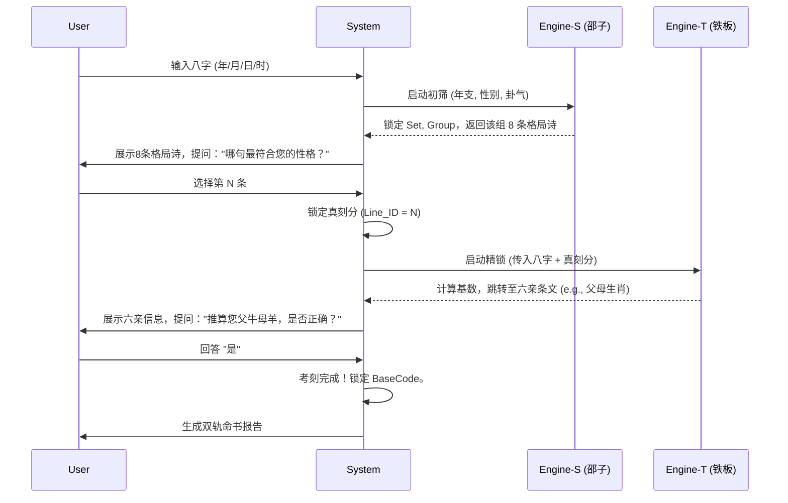

# 铁板神算与邵子神数双核系统规格说明书 v3.0

**版本**: 3.0
**状态**: 核心算法与双库架构已定义
**核心思想**: 基于 `tieban shaozi kaoke v5.md` 的深刻洞察，将系统解构为“铁板”与“邵子”两套独立但协同工作的引擎与知识库。
**架构基线**: Context Driven / Pluggable Modules（参见 [os_design_v3.md §1.4](../os/os_design_v3.md#14-context-驱动架构-可插拔模块视图)）
**基石文档**:
1.  **架构蓝图**: `tieban shaozi kaoke v5.md` (双核架构)
2.  **铁板引擎算法**: `research tieban2.md` (胖胖熊实战)
3.  **邵子引擎算法与知识库**: `research tieban3.md` (邵子神数新编)

---

## 1. 系统哲学与顶层设计：双核驱动 (Dual-Kernel Architecture)

根据 `v5.md` 的核心论断，我们必须摒弃将“铁板神算”视为单一黑盒的旧有观念。它实际上是两套同源但异构的系统，必须在物理和逻辑上进行彻底隔离。

*   **系统A：铁板神数 (Tieban 12k)**
    *   **核心逻辑**: **算术流 (Arithmetic Stream)**。基于一个基础数（Base），通过算术递推（如 `+96`）和秘数跳跃，在一条连续的时间线上推演命运事件。
    *   **引擎**: `Engine-T` (Arithmetic Engine)。
    *   **知识库**: `kb_tieban_12k`。
    *   **解决问题**: **“我什么时候会发生什么？”** (定量/流年/具体事件)。

*   **系统B：邵子神数 (Shaozi 6k)**
    *   **核心逻辑**: **矩阵索引 (Matrix Indexing)**。通过一组三维坐标 `(集, 组, 条)` 来精确定位一个人的先天格局和性格特质。
    *   **引擎**: `Engine-S` (Coordinate Engine)。
    *   **知识库**: `kb_shaozi_6k`。
    *   **解决问题**: **“我是谁？”** (定性/格局/性格)。

这种双核架构完美地解释了为何用铁板的算法无法直接查询邵子库，反之亦然。本系统设计的基石就是围绕这两个引擎的独立实现与协同工作。

---

## 2. 知识库双层架构 (Dual-Schema KB)

系统必须建立两个结构完全不同的数据库表，严禁混用字段或逻辑。

### 2.1 铁板实战库 (KB-T)

此库为线性结构，用于支持算术推演。

*   **对应资料**: `research tieban2.md`
*   **表名**: `kb_tieban_12k`
*   **Schema**:
    ```sql
    CREATE TABLE kb_tieban_12k (
        strip_id INT PRIMARY KEY,       -- 条文ID (1-13000)
        content TEXT NOT NULL,          -- 条文内容，例如："父鼠母马，先天定数"
        category VARCHAR(30),           -- 分类: 'PARENTS_ZODIAC', 'SIBLINGS_COUNT', 'SPOUSE_INFO', 'CHILDREN_COUNT', 'FORTUNE_EVENT', 'PERSONALITY'
        
        -- 核心逻辑字段
        remainder_96 INT,               -- strip_id % 96，用于流年链表快速匹配
        is_secret_point BOOLEAN,        -- 标记是否为"16组秘数"的常见落点，用于优化考刻搜索
        
        -- 用于反向校验和数据治理的元数据
        fact_meta JSONB,                -- 结构化事实，例如: {"father_zodiac": "zi", "mother_zodiac": "wu"}
        source_doc VARCHAR(255)         -- 数据来源文档
    );
    
    -- 性能优化索引
    CREATE INDEX idx_tieban_remainder_96 ON kb_tieban_12k(remainder_96);
    CREATE INDEX idx_tieban_category ON kb_tieban_12k(category);
    ```

### 2.2 邵子原理库 (KB-S)

此库为矩阵结构，用于支持坐标索引。

*   **对应资料**: `research tieban3.md`
*   **表名**: `kb_shaozi_6k`
*   **Schema**:
    ```sql
    CREATE TABLE kb_shaozi_6k (
        -- 复合主键，定义了条文的唯一坐标
        set_id INT NOT NULL,             -- [1-12] 对应 子(1)...亥(12)集
        group_id INT NOT NULL,           -- [1-64] 对应 64个子组
        line_id INT NOT NULL,            -- [1-8]  组内序号

        shaozi_code VARCHAR(15) UNIQUE,  -- 全局唯一编码，如 "1-1-1", "子-01-1"
        raw_code VARCHAR(10),            -- 原始编码，如 "1111", "12881"
        content TEXT NOT NULL,           -- 四句七言诗内容

        -- 核心业务属性 (源自 tieban3.md 的特殊定义)
        gender_scope ENUM('M', 'F') NOT NULL, -- M: Group 1-32, F: Group 33-64 (关键!)
        hexagram_id INT,                 -- 关联的64卦象ID (用于算法映射)
        
        -- 用于反向校验和数据治理的元数据
        source_doc VARCHAR(255),         -- 数据来源文档

        PRIMARY KEY (set_id, group_id, line_id)
    );

    -- 性能优化索引
    CREATE INDEX idx_shaozi_code ON kb_shaozi_6k(shaozi_code);
    CREATE INDEX idx_shaozi_gender_hexagram ON kb_shaozi_6k(gender_scope, hexagram_id);
    ```

---

## 3. 双核算法引擎详解 (Dual-Engine Specification)

### 3.1 引擎A：铁板算术引擎 (Engine-T)

**职责**: 执行算术推演，负责流年详批和六亲精锁。

#### 3.1.1 基数计算 (Base Calculation)
*   **方法**: 四柱天干配数法 (源自 `research tieban2.md`)。
*   **天干配数表**: `Map_A = {甲:1, 乙:6, 丙:2, 丁:7, 戊:3, 己:8, 庚:4, 辛:9, 壬:5, 癸:0}`
*   **取数顺序**: **月干 -> 日干 -> 时干 -> 年干**。
*   **公式**:
    ```python
    def calculate_base_t(pillars: dict) -> int:
        """根据四柱天干计算铁板基数"""
        stem_map = {'甲': '1', '乙': '6', '丙': '2', '丁': '7', '戊': '3', '己': '8', '庚': '4', '辛': '9', '壬': '5', '癸': '0'}
        
        month_stem = pillars['month_pillar']
        day_stem = pillars['day_pillar']
        hour_stem = pillars['hour_pillar']
        year_stem = pillars['year_pillar']
        
        code_str = stem_map[month_stem] + stem_map[day_stem] + stem_map[hour_stem] + stem_map[year_stem]
        return int(code_str)
    ```
    *示例：甲子年 丙寅月 壬申日 丙午时 -> 丙(2)壬(5)丙(2)甲(1) -> **Base = 2521**。*

#### 3.1.2 秘数跳跃 (Secret Number Hopping)
*   **场景**: 在考刻阶段，若基数未命中关键条文，使用此方法进行非线性搜索。
*   **秘数表**: `SECRET_NUMS = [1243, 3204, 2346, 5284, ...]` (共16个)。
*   **公式**: 

#### 3.1.3 流年滚动 (Timeline Rollout)
*   **场景**: 刻分锁定后，生成一生运程。
*   **核心逻辑**: **模96算术 (Modulo-96 Arithmetic)**。
*   **公式**: 
    *   `Age_N_Strip_ID = Locked_Base + (N * 96)`
    *   其中 `N` 是从1岁开始的年序。

### 3.2 引擎B：邵子坐标引擎 (Engine-S)

**职责**: 执行矩阵坐标映射，负责定格局、总断，并为考刻提供初始候选集。

#### 3.2.1 坐标计算 (Coordinate Calculation)
邵子条文是“查”出来的，不是“算”出来的。引擎的核心是构建 `(Set, Group, Line)` 三维坐标。

1.  **Set (集) - 由年支决定**:
    *   子年 -> 子集 (1)
    *   丑年 -> 丑集 (2)
    *   ...
    *   亥年 -> 亥集 (12)
    *   **公式**: `set_id = YEAR_BRANCH_MAP[year_branch]`

2.  **Group (组) - 由先天卦气与性别决定**:
    *   这是邵子系统最独特的逻辑，严格区分男女。
    *   输入: `hexagram_qi_value` (1-64), `gender` ('M' or 'F')
    *   **男命公式**: `group_id = hexagram_qi_value` (确保结果在 1-32 区间，若超出则需应用特定模运算或查表)
    *   **女命公式**: `group_id = hexagram_qi_value + 32` (确保结果在 33-64 区间)
    *   *注：`hexagram_qi_value` 的计算法则是另一套复杂系统，MVP阶段可先假设为已知输入。*

3.  **Line (条) - 由刻分决定**:
    *   一时辰八刻，每刻对应一组内的8条。
    *   **公式**: `line_id = ke_fen_index` (范围 1-8)

#### 3.2.2 编码生成与查询
*   **流程**:
    1.  根据计算出的 `(set_id, group_id, line_id)` 坐标。
    2.  查询 `kb_shaozi_6k` 数据库。
    3.  `SELECT content FROM kb_shaozi_6k WHERE set_id = ? AND group_id = ? AND line_id = ?`
*   **输出**: 对应的四句七言格局诗。

---

## 4. 考刻策略：双核交叉验证 (Cross-Verification Calibration)

这是本系统设计的精髓，完美结合了两套系统的优势，实现了高效精准的生辰校准。

### 4.1 联合考刻流程图



### 4.2 命书双轨输出 (Dual-Track Report)

考刻完成后，系统将分别调用两个引擎，生成两部分内容完全不同但互为补充的命书。

*   **卷一 · 格局总论 (由 Engine-S 生成)**
    *   内容：性格分析、一生定调、事业方向、婚姻格局。
    *   特点：宏观、定性、结构化。

*   **卷二 · 流年详批 (由 Engine-T 生成)**
    *   内容：每年的具体吉凶事件、财运起伏、健康预警、六亲动态。
    *   特点：微观、定量、时间序列。

---

## 5. 数据清洗与治理 (ETL Instructions)

为确保 v3.0 架构的成功，数据采集和清洗阶段必须严格执行以下规则。

1.  **邵子库 (KB-S) 清洗规则**:
    *   **强制性别路由**: 解析 `research tieban3.md` 时，必须识别 `【1】` 到 `【64】` 的分组标记。将 `【1】-【32】` 强制标记为 `gender_scope = 'M'`，将 `【33】-【64】` 强制标记为 `gender_scope = 'F'`。**此为邵子引擎的核心路由，绝不可错！**
    *   **编码补全**: 解析原始编码（如 `1111`）时，必须结合其所属的“集”（如子集=1），生成全局唯一的 `shaozi_code`（如 `1-1-1-1`），并存入数据库。

2.  **铁板库 (KB-T) 清洗规则**:
    *   **六亲标签提取**: 使用正则表达式（如 `r"父(.)母(.)"`）从12000条文中提取父母生肖，并结构化存入 `fact_meta` JSONB 字段。对兄弟数量、子女性别等所有可用于考刻的事实进行同样处理。
    *   **性能索引**: 批量计算所有条文的 `remainder_96` 值并建立数据库索引，这是流年计算性能的关键。

---

## 6. API 接口设计 (建议)

### 6.1 `POST /api/tieban/start_calibration`
*   **Request**:
    ```json
    {
      "gender": "male",
      "solar_datetime": "1988-08-08T08:30:00",
      "longitude": 114.3
    }
    ```
*   **Process**:
    1.  计算真太阳时与四柱。
    2.  调用 `Engine-S`，根据年支、性别、卦气计算出 `(set_id, group_id)`。
    3.  查询 `kb_shaozi_6k` 获取该组的 8 条 `content`。
*   **Response**:
    ```json
    {
      "session_id": "unique_session_id",
      "calibration_step": 1,
      "question": "以下哪句诗最符合您的性格或人生格局？",
      "options": [
        {"line_id": 1, "text": "生平志气在云霄..."},
        {"line_id": 2, "text": "一世功名带禄来..."},
        ... 8条 ...
      ]
    }
    ```

### 6.2 `POST /api/tieban/lock_ke`
*   **Request**:
    ```json
    {
      "session_id": "unique_session_id",
      "selected_line_id": 2
    }
    ```
*   **Process**:
    1.  从会话中恢复八字，锁定 `ke_fen_index = 2`。
    2.  调用 `Engine-T`，结合八字与刻分，计算出精确的六亲验证条文。
*   **Response**:
    ```json
    {
      "session_id": "unique_session_id",
      "calibration_step": 2,
      "question": "根据推算，您的父母生肖应为：父牛母羊，是否正确？",
      "verification_type": "PARENTS_ZODIAC",
      "expected_fact": {"father": "chou", "mother": "wei"}
    }
    ```

### 6.3 `POST /api/tieban/generate_report`
*   **Request**:
    ```json
    {
      "session_id": "unique_session_id",
      "final_confirmation": true
    }
    ```
*   **Process**:
    1.  确认考刻完成，锁定 `BaseCode` 和 `Shaozi_Coordinate`。
    2.  分别调用 `Engine-S` 和 `Engine-T` 生成双轨报告。
*   **Response**:
    ```json
    {
      "report": {
        "shaozi_part": { ... },
        "tieban_part": { ... }
      }
    }
    ```

---

## 7. 总结

v3.0 规格书是对“铁板神算”系统工程的最终解构。它不再追求用一个模糊的算法解决所有问题，而是回归两套术数的本来面目，各司其职：

*   **邵子引擎 (Engine-S)**: 解决 **"我是谁"** (定性/格局) —— 基于**坐标与性别**。
*   **铁板引擎 (Engine-T)**: 解决 **"我什么时候发生什么"** (定量/流年) —— 基于**算术与秘数**。

这种双核架构完美匹配了附件提供的两套核心资料的内在逻辑，是复原并超越这门古老术数的唯一科学路径。
