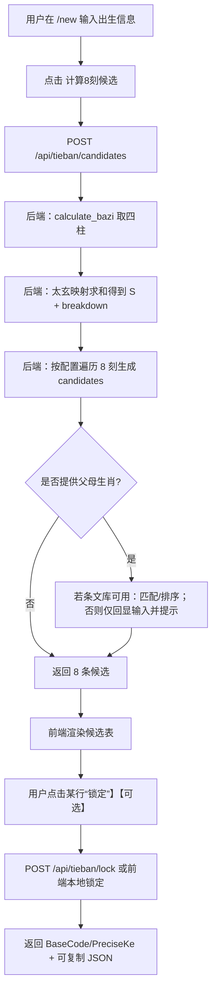

# 铁板神算（Tieban）计算功能（MVP）— `/new` 页面集成 Spec v1.0（草案）

**Source（研究基础）**：`fortune_ai/docs/tieban v1.md`  
**Target UI**：`GET /new` → `fortune_ai/api/templates/index.html` + `fortune_ai/api/static/main.js`  
**Target API**：`fortune_ai/api/main.py`（新增 tieban 计算接口）  
**定位**：先交付“可跑、可解释、可配置”的 MVP（算出候选刻分与候选条文索引），为后续接入 `12000` 条文库与“考刻分”自动化打底。

---

## 0. 执行摘要（你能得到什么）

| 交付项 | MVP 内容 | 说明 |
|---|---|---|
| `/new` 页面新增“铁板神算”模块 | 一键计算 `8刻候选`（含候选 `ID`、刻范围、计算分解）+ 可选“父母生肖”过滤/打分 + “锁定刻分”生成 `BaseCode` | 与 `tieban v1.md` 的“考刻分/候选展示”一致 |
| 新增后端接口 | `POST /api/tieban/candidates`（返回候选与分解），可选 `POST /api/tieban/lock`（锁定） | 不触发现有 LLM 报告任务，避免成本/延迟 |
| 规则配置 | 刻序/偏移/基数/遇十不用策略均可配置（先做 v1 默认） | 解决 `tieban v1.md` 内部刻序冲突问题 |
| Spec 文档落盘 | 该文件 | 作为后续实现的最高规范 |

---

## 1. 背景与目标

### 1.1 背景（从 `tieban v1.md` 抽取）

铁板神算本质上是“**多变量哈希 → 条文索引检索**”系统：  
输入出生参数 → 计算数理键值（太玄数、配卦、刻分修正等）→ 得到条文 `ID`（1..12000）→ 查库输出断语/条文。

### 1.2 MVP 目标（In）

| 目标ID | 目标 | 验收要点 |
|---|---|---|
| G-001 | 在 `/new` 增加 tieban 计算入口 | 页面可见、可交互 |
| G-002 | 基于现有出生信息计算八字四柱并得到太玄总和 `S` | 返回 `S` 与分解（每个干支的太玄值） |
| G-003 | 生成 `8刻候选`（候选索引 ID） | 每刻给出 `ke_index`、时间范围、`offset`、`candidate_id` |
| G-004 | 支持“父/母生肖”可选输入，用于候选过滤/排序 | 无条文库时给出明确提示；有条文库时按 `fact_meta` 匹配 |
| G-005 | 用户锁定某刻后输出 `BaseCode`（MVP 定义） | 输出可复制的结果 JSON + UI 显示“已锁定” |

### 1.3 非目标（Out）

| 非目标 | 原因 |
|---|---|
| O-001 | 接入完整 `12000` 条文库与清洗/NLP 标注 | 当前仓库未见条文数据源，需要单独数据工程 |
| O-002 | 大运/流年滚盘全链路（1..80岁） | 依赖条文库与更完整的门派公式 |
| O-003 | “分”级校准（15分钟内再细分） | 依赖更多校验维度条文（兄弟数/配偶信息等） |

---

## 2. 关键不确定性（来自 `tieban v1.md` 的冲突点）

`tieban v1.md` 对“八刻卦序/偏移”存在至少两套互相矛盾的表述，必须参数化并由你选默认。

### 2.1 八刻卦序冲突

| 来源 | 刻序示例（从文中摘取） |
|---|---|
| `tieban v1.md` §3.1 八刻分法 | `乾, 坎, 艮, 震, 巽, 离, 坤, 兑`（且刻序从 `1..8`） |
| `tieban v1.md` §2.2 刻分偏移表 | `坎, 坤, 震, 巽, 乾, 兑, 艮, 离`（且刻序从 `0..7`） |

**MVP 处理**：统一内部 `ke_index=0..7`，刻序与卦序由配置决定（你确认默认）。

---

## 3. 用户体验（UX）

### 3.1 页面模块布局（ASCII 原型）

```
/new 现有页面（八字 + 校准）
┌──────────────────────────────────────────────┐
│ Fortune AI · 八字深度报告                     │
│ [姓名][性别][出生日期][出生时间][地点][经纬度] │
│ [模型][校准版本][System Prompt]               │
│ [按钮] 八字  [按钮] 校准出生时间               │
└──────────────────────────────────────────────┘

新增：铁板神算（Tieban）模块（同页 card）
┌──────────────────────────────────────────────┐
│ 铁板神算（Tieban）                             │
│ 说明：基于四柱太玄数 + 刻分偏移生成候选索引      │
│ 父生肖(可选) [子丑寅卯辰巳午未申酉戌亥/鼠牛...]  │
│ 母生肖(可选) [子丑寅卯辰巳午未申酉戌亥/鼠牛...]  │
│ [ ] 只知道时辰（忽略分钟，输出8刻候选）           │
│ [按钮] 计算8刻候选                              │
│                                                │
│ 候选结果：                                      │
│ | ke | 时间段 | trigram | offset | candidate_id | match | 操作 |
│ | 0  | 09:00-09:15 | 乾 | +0  | 3520 | 高 | [锁定] |
│ | .. | ...          | ...| ... | ...  | .. | ...   |
│                                                │
│ 已锁定：ke=1（09:15-09:30） BaseCode=3526       │
│ [复制 JSON]                                     │
└──────────────────────────────────────────────┘
```

### 3.2 交互流程（流程图）



---

## 4. 领域模型与数据结构（MVP）

### 4.1 术语表

| 术语 | 含义 | 备注 |
|---|---|---|
| `pillars` | 四柱：年/月/日/时柱（干支） | 复用现有 `calculate_bazi` |
| `TAIXUAN_MAP` | 干支 → 太玄数映射 | 见 §5.2 |
| `S` | 四柱太玄数总和 | `sum(stem)+sum(branch)` |
| `ke_index` | 刻序 `0..7` | 15 分钟为一刻，共 8 刻 |
| `offset` | 每刻偏移（可配置） | 默认等差 `0,6,12,...,42`（需确认） |
| `candidate_id` | 候选条文索引 | MVP 先输出索引；有库再查文 |
| `BaseCode` | 锁定后“先天数/基础命数” | MVP 暂定义为锁定的 `candidate_id`（需确认） |

### 4.2 接口返回结构（JSON）

#### `POST /api/tieban/candidates` Response（示例字段）

| key | type | desc |
|---|---|---|
| `status` | `string` | `ok` / `error` |
| `bazi` | `object` | `year_pillar`/`month_pillar`/`day_pillar`/`hour_pillar` |
| `taixuan` | `object` | `sum`、`breakdown[]` |
| `config` | `object` | 生效的 `ke_sequence`、`offsets`、`base_constant`、`avoid_ten_rule` |
| `candidates` | `array` | 每项含 `ke_index`、`time_range`、`offset`、`candidate_id`、`match`（可选） |

---

## 5. 算法规格（MVP）

### 5.1 输入规范

复用现有 `/new` 表单字段：  
- 出生：`year, month, day, hour, minute`  
- 地点：`longitude, latitude, location_name`（用于与八字一致）  

新增可选字段：  
- `father_zodiac`、`mother_zodiac`：支持 `子丑寅...` 或 `鼠牛虎...`（后端归一化成地支）  
- `unknown_ke`：`true/false`（为 `true` 时忽略分钟，仅给 8 刻候选）

### 5.2 太玄数常量表（来自 `tieban v1.md`）

| 字 | 值 |
|---|---|
| 甲/己/子/午 | 9 |
| 乙/庚/丑/未 | 8 |
| 丙/辛/寅/申 | 7 |
| 丁/壬/卯/酉 | 6 |
| 戊/癸/辰/戌 | 5 |
| 巳/亥 | 4 |

计算：  
- 对每柱 `stem + branch` 取值并求和  
- 输出 `breakdown`：如 `[{char:'甲',v:9},{char:'子',v:9},...]`

### 5.3 刻分与候选生成（MVP 公式）

由于门派公式不完备，MVP 先落“可解释+可配置”的版本（你确认默认参数）。

**MVP Candidate 公式（建议）**

- `raw = base_constant + S + offsets[ke_index]`
- `candidate_id = normalize(raw)`（是否按 `12000` 归一化，见 §10 待决项）
- `avoid_ten_rule`：若 `candidate_id % 10 == 0`，按策略修正（见 §10 待决项）

> `tieban v1.md` 中还有 `Base_Index=(G*1000)+(S*10)+Adjustment`（含主卦 `G`），建议作为 v1.1/v2 迭代；MVP 先跑通 `S + offset` 框架。

### 5.4 生肖匹配（可选增强）

- 若 **未接入条文库**：无法从 `candidate_id` 推断“父鼠母马”，则只能展示候选并提示“需条文库才能自动匹配”。  
- 若 **接入条文库（未来）**：`tieban_verses.fact_meta` 含 `father_zodiac/mother_zodiac`，计算 `match_score` 并排序 TopN。

---

## 6. API 规格（建议）

### 6.1 `POST /api/tieban/candidates`

**Request（建议）**

```json
{
  "name": "张三",
  "gender": "男",
  "year": 1980,
  "month": 2,
  "day": 11,
  "hour": 14,
  "minute": 33,
  "longitude": 116.4074,
  "latitude": 39.9042,
  "location_name": "北京",
  "father_zodiac": "鼠",
  "mother_zodiac": "马",
  "unknown_ke": false,
  "debug": true
}
```

**Response（建议）**

```json
{
  "status": "ok",
  "bazi": { "year_pillar": "庚申", "month_pillar": "戊寅", "day_pillar": "辛亥", "hour_pillar": "乙未" },
  "taixuan": { "sum": 68, "breakdown": [ { "char": "庚", "value": 8 } ] },
  "config": { "base_constant": 3000, "offsets": [0,6,12,18,24,30,36,42], "avoid_ten_rule": "plus_one" },
  "candidates": [
    { "ke_index": 0, "time_range": "14:00-14:15", "offset": 0, "candidate_id": 3068 },
    { "ke_index": 1, "time_range": "14:15-14:30", "offset": 6, "candidate_id": 3074 }
  ]
}
```

### 6.2 `POST /api/tieban/lock`（可选，若需要后端落库/固化）

- 输入：`name` + 出生信息 + `ke_index` +（可选）父母生肖  
- 输出：`status=locked`、`precise_ke`、`base_code`、`digest`（便于审计）

---

## 7. 数据与存储（建议演进）

| 阶段 | 做法 | 备注 |
|---|---|---|
| MVP | 不接条文库；只输出 `candidate_id` 与分解 | 最快上线 |
| v1.1 | 引入小型 demo 条文集（几十/几百条） | 用于端到端体验验证 |
| v2 | 接入 `tieban_verses (12000)` + `fact_meta` 标注 + 跳码/空亡规则 | 需要数据源 |

未来表（参考 `tieban v1.md`）：
- `tieban_verses(verse_id, content_text, category, fact_meta jsonb, next_logic_id, ...)`

---

## 8. 可观测性与安全

| 方面 | 要求 |
|---|---|
| 日志 | `operation=tieban_candidates`，记录 `correlation_id`、`config_version`、`S`、`ke_count`；避免记录完整生日/父母信息明文（可 hash） |
| 隐私 | 默认不落库父母生肖；若需要落库需先明确合规策略 |
| 幂等 | `candidates` 接口纯计算幂等；`lock` 若写 DB，使用 `(name, birth_digest)` 幂等键 |

---

## 9. 验收清单（MVP）

| 用例 | 期望 |
|---|---|
| U-001 | 仅输入出生信息点击“计算8刻候选” → 返回 8 条候选（或可配置为 8 条）并展示分解 |
| U-002 | 输入父母生肖（无条文库） → 页面提示“未接入条文库，无法自动匹配”，但不报错 |
| U-003 | 锁定某刻 → 展示 `BaseCode`，可复制 JSON |
| U-004 | 校准时间后再算铁板 → 使用现有 JS 回填后的 `time` 参与计算 |

---

## 10. 待你决策（关键项）

| 决策点 | 选项 A | 选项 B | 建议 |
|---|---|---|---|
| D-001 spec 存放目录（本次已写） | `fortune_ai/docs/` | 根目录 `docs/` | 已按你指令写入 `fortune_ai/docs/` |
| D-002 八刻卦序默认 | 按 §3.1：`乾坎艮震巽离坤兑` | 按 §2.2：`坎坤震巽乾兑艮离` | 先选一种做默认，同时实现可配置切换 |
| D-003 offsets 默认 | 等差 `0,6,...,42` | 你提供门派偏移表 | MVP 先等差，后续换表不改代码结构 |
| D-004 `base_constant` 默认 | `3000`（文中伪代码） | `0` 或你指定 | 先 `3000`，但做成配置 |
| D-005 `12000` 归一化 | 做：`((id-1)%12000)+1` | 不做：直接输出原值 | 无条文库时先不归一化更直观；接库后再强制归一化 |
| D-006 “遇十不用”策略 | `id%10==0 => +1` | 跳码表 `next_logic_id` | MVP 用 `+1`，跳码表留到接库时做 |
| D-007 是否做 `lock` 落库 | 不落库（前端锁定） | 落库到 `fortune_user` | 若要长期追踪用户档案，选落库 |

