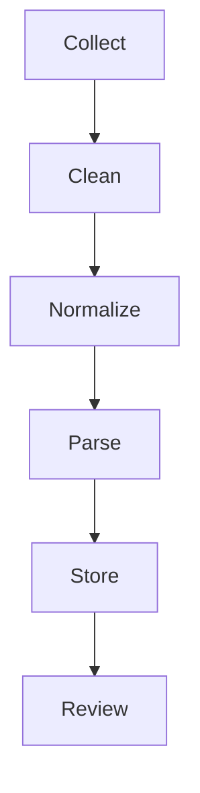

# 铁板神算（Tieban）系统规格说明书 v2.0

**Source**: `fortune_ai/docs/research tieban1.md`, `fortune_ai/docs/research tieban2.md`, `fortune_ai/docs/research tieban3.md`  
**Merge**: `fortune_ai/docs/tieban_spec_codex.md`, `fortune_ai/docs/tieban_kb_design.md`  
**Target UI**: `GET /new` → `fortune_ai/api/templates/index.html` + `fortune_ai/api/static/main.js`  
**Target API**: `fortune_ai/api/main.py`（新增 Tieban 计算与知识库接口）  
**定位**: 从 MVP 计算引擎扩展到“完整 Tieban 系统”（计算引擎 + 知识库 + 校验流程 + 管理工具 + 规则治理），实现“可跑、可解释、可配置、可审计”。

---

## 0. 执行摘要

本规格定义一个可长期迭代的 Tieban 系统，包含：
- 计算引擎：从 `出生信息 → 四柱 → 太玄/配卦/刻分 → 候选条文 → 考刻校验 → 结果锁定` 的全流程。
- 知识库（KB）：1..12000 条文的数据采集、清洗、结构化与版本治理。
- 多门派规则：八刻/九十六刻、四柱天干法、八卦加则、合化等规则可配置、可版本化。
- 可观测与审计：保存规则版本、输入摘要与候选输出，支持回放与纠错。

---

## 1. 目标与范围

### 1.1 目标（In）

| id | goal | acceptance |
|---|---|---|
| G-001 | 完整 Tieban 计算链路 | 能输出候选条文与分解细节；支持考刻流程与锁定结果 |
| G-002 | 多规则体系与版本治理 | `rule_set` 可切换，配置可追溯 |
| G-003 | 12000 条文知识库 | 采集、清洗、结构化入库；可通过 `fact_meta` 做匹配 |
| G-004 | UI/API 一体化 | `/new` 可计算；后台可校对与管理 |
| G-005 | 可审计与可回放 | 对每次计算存 `input_digest`、`rule_version`、`candidate_set` |

### 1.2 非目标（Out）

| id | out | reason |
|---|---|---|
| O-001 | 直接自动给出“最终命断” | 需要长期校验与更完整规则验证 |
| O-002 | 仅靠 LLM 生成条文 | 与传统条文体系不一致，且不可审计 |
| O-003 | 采集付费或未授权内容 | 数据合规优先 |

### 1.3 里程碑（Phase）

| phase | scope | output |
|---|---|---|
| MVP | `S + offset` 候选 + 8 刻 | `/new` 可用，输出候选与分解 |
| v1 | 加入 96 刻/八刻天干法/考刻流程 | 候选提升、可验证 |
| v1.1 | 小规模条文库（几百条） | `fact_meta` 匹配与排序 |
| v2 | 12000 条文库 + 规则治理 | 可完整出命书结构 |
| v3 | 宏观周期（皇极经世）与流年大运 | 宏观/细分运势合一 |

---

## 2. 术语与概念

| term | desc |
|---|---|
| `pillars` | 四柱：年/月/日/时柱（干支） |
| `taixuan` | 太玄数映射（干支 → 数） |
| `ke` | 刻分；一时辰 120 分钟 = 8 刻（15 分钟/刻） |
| `fen` | 更细分刻：一时辰 60 分（2 分钟/分） |
| `candidate_id` | 候选条文编号（1..12000） |
| `BaseCode` | 锁定后基础命数（可等于核心候选或组合编码） |
| `rule_set` | 规则集合（门派/版本） |
| `fact_meta` | 结构化事实标签（父母生肖/兄弟数等） |

---

## 3. 系统架构

### 3.1 组件

| component | responsibility |
|---|---|
| `ui.tieban` | `/new` Tieban 模块（输入、候选、锁定） |
| `api.tieban` | 候选计算、考刻验证、结果锁定 |
| `engine.tieban` | 规则执行引擎（可配置、多规则并行） |
| `kb.tieban` | 条文库与规则库（结构化存储） |
| `etl.tieban` | 采集/清洗/抽取/校验 |
| `admin.tieban` | 数据校对、规则版本管理 |

### 3.2 数据流（高层）

```
Input (birth + location + known facts)
  -> Bazi
  -> Mapping (taixuan, trigram, stem/branch numbers)
  -> Candidate Generation (ke + 96 + bagua + adjustments)
  -> Candidate Scoring (fact_meta match)
  -> Verification Flow (考时定刻)
  -> Lock Result (BaseCode + evidence)
  -> Output (summary + explain + trace)
```

---

## 4. 数据与知识库（KB）

### 4.1 数据源

| source_type | source | content | risk |
|---|---|---|---|
| `verses` | `ricofu001.pixnet.net`, `mypaper.pchome.com.tw` | 1..12000 条文 | OCR/错别字/缺页 |
| `rules` | `tuenhai.com`, `360doc.cn`, `sina.com.cn` | 规则/口诀/案例 | 表达不一、口传差异 |
| `cycle` | `tuenhai.com`（皇极/元会运世） | 大周期索引 | 索引与推断混杂 |

### 4.2 ETL Pipeline



- `Clean`: 去除注释、脚注、广告、网页噪声。
- `Normalize`: 繁简转换；统一标点；保留 `content_raw`。
- `Parse`: 抽取 `id`、`category`、`fact_meta`、`sentiment`。
- `Review`: 人工校对与抽样复核。

### 4.3 核心表结构（建议）

#### `tieban_verses`

| key | type | desc | example |
|---|---|---|---|
| `id` | `INT` | 条文编号 | `3520` |
| `content_raw` | `TEXT` | 原文（繁体/简体） | `父命屬鼠母屬馬...` |
| `content_clean` | `TEXT` | 清洗后文本 | `父命属鼠母属马...` |
| `category` | `VARCHAR` | 类别 | `VERIFICATION` |
| `fact_meta` | `JSONB` | 结构化事实 | `{"father":"子","mother":"午"}` |
| `sentiment` | `INT` | 吉凶评分 | `2` |
| `source_url` | `VARCHAR` | 来源 | `https://...` |

#### `tieban_rules`

| key | type | desc | example |
|---|---|---|---|
| `rule_key` | `VARCHAR` | 规则键 | `ke_sequence` |
| `rule_value` | `JSONB` | 规则值 | `{"seq":["乾","坎",...]}` |
| `version` | `VARCHAR` | 版本 | `v1.0` |
| `description` | `TEXT` | 说明 | `八刻卦序` |

#### `tieban_runs`

| key | type | desc | example |
|---|---|---|---|
| `run_id` | `UUID` | 运行编号 | `...` |
| `input_digest` | `VARCHAR` | 输入摘要 | `sha256(...)` |
| `rule_version` | `VARCHAR` | 规则版本 | `v1.0` |
| `candidate_set` | `JSONB` | 候选结果 | `[{...}]` |
| `locked_result` | `JSONB` | 锁定结果 | `{...}` |

### 4.4 数据治理

- `content_raw` 与 `content_clean` 双轨保存。
- 记录 `source_url` 与采集时间，支持审计。
- 缺失条文用 `status="MISSING"` 标记，不使用 AI 自动补全。

---

## 5. 算法与规则引擎

### 5.1 输入规范

| key | type | required | desc |
|---|---|---|---|
| `year` `month` `day` `hour` `minute` | `INT` | yes | 出生时间 |
| `latitude` `longitude` | `FLOAT` | yes | 地理坐标（用于八字与节气） |
| `gender` | `STRING` | yes | 用于起运与流年 |
| `father_zodiac` `mother_zodiac` | `STRING` | no | 父母生肖（考刻） |
| `known_facts` | `JSON` | no | 兄弟数/排行/婚姻等 |
| `rule_set` | `STRING` | no | 规则版本 |

### 5.2 基础映射表

#### 5.2.1 太玄映射（`taixuan_map`）

```
甲/己/子/午 = 9
乙/庚/丑/未 = 8
丙/辛/寅/申 = 7
丁/壬/卯/酉 = 6
戊/癸/辰/戌 = 5
巳/亥 = 4
```

#### 5.2.2 天干配卦（`stem_to_trigram`）

```
甲/壬 -> 乾
乙/癸 -> 坤
丙 -> 艮
丁 -> 兑
戊 -> 坎
己 -> 离
庚 -> 震
辛 -> 巽
```

#### 5.2.3 地支配卦（`branch_to_trigram`）

```
亥/子 -> 坎
寅/卯 -> 震
巳/午 -> 离
未 -> 坤
申/酉 -> 兑
戌 -> 乾
丑 -> 艮
辰 -> 巽
```

#### 5.2.4 天干数（`stem_number`）

规则存在多个版本，必须以 `rule_set` 选择。

- `variant_a`（常见）：
```
甲1 乙6 丙2 丁7 戊3 己8 庚4 辛9 壬5 癸0
```

- `variant_b`（口诀式）：
```
甲己乙庚 = 4
丙辛 = 6
丁壬戊癸 = 3
```

### 5.3 刻分体系

- **八刻**：一时辰 120 分钟，`8` 刻（每刻 `15` 分钟）。
- **九十六刻**：`12` 时辰 × `8` 刻 = `96`；`12000 / 96 = 125` 为常见校验基础。
- **二分细化**：一时辰分 `60` 分（每分 `2` 分钟）。

### 5.4 候选生成（多规则并行）

#### 5.4.1 基础候选（MVP）

```
raw = base_constant + S + offsets[ke_index]
if avoid_ten_rule and raw % 10 == 0:
  raw = raw + 1
candidate_id = normalize(raw)
```

- `S`: 四柱太玄总和。
- `offsets`: 刻分偏移表（可配置）。
- `normalize`: 规则决定是否归一到 `1..12000`。

#### 5.4.2 八刻天干法（96 系列）

```
ke_index = sum(stem_number(year,month,day,hour)) % 8
if ke_index == 0: ke_index = 8
base = seed_from_rules(...)
series = [base + 96 * k for k in range(0, N)]
```

- `base`: 由 `rule_set` 决定（如 `2521` 起）。
- `series`: 96 步长的候选列。

#### 5.4.3 八卦加则（可配置表）

- 以天干作上卦、地支作下卦。
- 使用 `bagua_augment_table` 查表得到四位数编码。
- 表数据放入 `tieban_rules`，避免硬编码。

#### 5.4.4 合化与修正

- `stem_combine`: 甲己、乙庚、丙辛、丁壬、戊癸等合化规则。
- `branch_combine`: 子丑、寅...等合化规则。
- `avoid_ten_rule`: “遇十不用”，末位为 `0` 需跳码。

### 5.5 考时定刻（验证流程）

1. 生成候选条文集合（多规则并行）。
2. 用已知事实（父母生肖、兄弟数、配偶等）过滤候选。
3. 用户确认 → 锁定刻分 → 输出 `BaseCode`。

**验证策略**:
- 若 `fact_meta` 为空：只提示“需要更多已知事实”。
- 若有冲突：保留多个候选并提示差异。

### 5.6 大运/流年模块（可选）

- 起运点依据节气：阳男阴女取下一节气，阴男阳女取上一节气。
- 大运十年为一轮，流年按岁运细分。

### 5.7 皇极经世模块（宏观周期，可选）

- `huang_year = year + 67017`（参考皇年起点）。
- 映射 `元/会/运/世/年` 索引，作为宏观背景字段。
- 不直接替代 Tieban 规则，只用于宏观解释与时间索引。

### 5.8 规则版本治理

- `rule_set` 必须可选择与可回放。
- `rule_set` 例：`mvp_basic`, `bagua_aug_v1`, `ke96_v1`。
- 新规则必须记录差异与影响评估。

---

## 6. API 规格

### 6.1 `POST /api/tieban/candidates`

**Request**:

```json
{
  "name": "张三",
  "gender": "男",
  "year": 1980,
  "month": 2,
  "day": 11,
  "hour": 14,
  "minute": 33,
  "longitude": 116.4074,
  "latitude": 39.9042,
  "rule_set": "mvp_basic",
  "father_zodiac": "鼠",
  "mother_zodiac": "马",
  "known_facts": {"siblings": 3}
}
```

**Response**:

```json
{
  "status": "ok",
  "bazi": {
    "year_pillar": "庚申",
    "month_pillar": "戊寅",
    "day_pillar": "辛亥",
    "hour_pillar": "乙未"
  },
  "taixuan": {
    "sum": 68,
    "breakdown": [{"char": "庚", "value": 8}]
  },
  "rule_version": "mvp_basic",
  "candidates": [
    {
      "method": "ke_offset",
      "ke_index": 0,
      "time_range": "14:00-14:15",
      "candidate_id": 3068,
      "match_score": 0.32
    }
  ]
}
```

### 6.2 `POST /api/tieban/verify`

- 输入：`run_id` + 用户确认事实。
- 输出：过滤后的候选与解释。

### 6.3 `POST /api/tieban/lock`

- 输入：`run_id` + `candidate_id` + `ke_index`。
- 输出：`BaseCode`、`lock_digest`。

### 6.4 `GET /api/tieban/verses/{id}`

- 返回条文内容与结构化标签。

---

## 7. UI 规格

### 7.1 `/new` Tieban 模块

- 输入：出生信息 + 可选父母生肖 + 已知事实。
- 输出：候选表（方法、刻分、候选号、匹配度）。
- 交互：点击“锁定”后输出 `BaseCode` 与解释摘要。

### 7.2 Admin 校对工具

- 搜索条文 `id`，对比 `content_raw` 与 `content_clean`。
- 编辑 `fact_meta` 与 `category`。

---

## 8. 可观测性与安全

- 日志字段：`operation`, `correlation_id`, `rule_version`, `candidate_count`。
- 输入使用 `input_digest` 代替明文保存。
- 父母生肖等敏感信息默认不落库。

---

## 9. 测试与验收

### 9.1 单元测试

- `taixuan_map` 与 `stem_number` 映射一致性。
- `ke_index` 算法与边界（余 0 -> 8）。

### 9.2 数据完整性

- 条文覆盖率：`count(id)` 与缺失统计。
- `fact_meta` 抽取准确率抽样复核。

### 9.3 端到端

- 输入固定样例 → 输出候选列表 → 锁定 → 回放一致。

---

## 10. 风险与待决策

| id | decision | options | note |
|---|---|---|---|
| D-001 | 默认 `ke_sequence` | `乾坎艮震巽离坤兑` vs `坎坤震巽乾兑艮离` | 规则化配置 |
| D-002 | `base_constant` | `3000` / `0` / 门派固定 | 需复核 |
| D-003 | `normalize` | 归一到 `1..12000` / 保留原值 | 接库后强制 |
| D-004 | `avoid_ten_rule` | `+1` / 跳码表 | 依赖条文库 |
| D-005 | 知识库版权 | 仅古籍 / 多源对照 | 合规优先 |
| D-006 | 规则优先级 | 投票/评分 / 手动指定 | 需审计 |

---

## 11. Roadmap

1) 完成 `mvp_basic` 规则集与 `/new` 集成。
2) 建立 `tieban_verses` 小规模样本并启用 `fact_meta` 匹配。
3) 引入 `ke96_v1`、`bagua_aug_v1` 规则集并可切换。
4) 上线 `tieban_kb` 全量 12000 条文 + 管理工具。
5) 评估接入宏观周期（皇极经世）与大运流年。

---

## 12. 附录（关键规则摘要）

### 12.1 地支配数诀（河洛）

```
亥子一六水
寅卯三八木
巳午二七火
申酉四九金
辰戌五
丑未五同十（遇十不用）
```

### 12.2 八刻口诀（用于说明）

```
八刻分命妙无穷
九十六局见天工
阳前阴后共八数
吉凶休咎自不同
```

### 12.3 四柱天干取数（示例）

```
甲己乙庚四
丙辛同为六
丁壬戊癸三
胜负九十六
```

