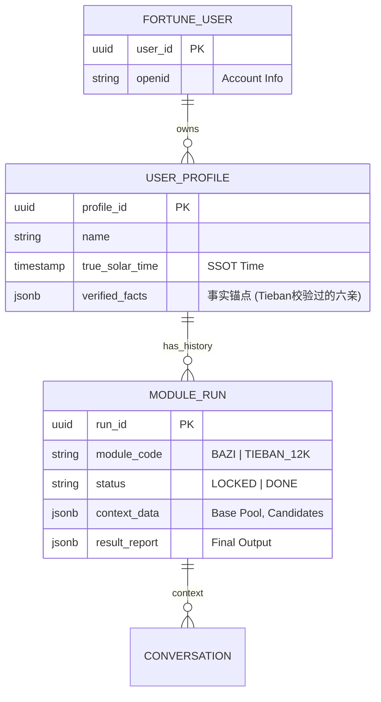

这是一个基于 **Reference V3** 文档，结合工程化最佳实践与 `fortune_ai` 多模块扩展需求生成的最终优化版设计文档。

### 核心优化点说明

1. **纯粹性（Purism）**：严格遵循 V3 要求，**彻底剥离 Shaozi（邵子）**。本系统仅依赖 12,000 条文库与算术推演逻辑，确保系统边界清晰，避免逻辑污染。
2. **配置驱动（RuleSet Driven）**：将所有“流派差异”（如天干取数是月日时年还是年月日時、八卦数是乾6还是乾1）全部下沉为 **JSON 配置文件**。代码层实现为一个通用解释器，而非硬编码逻辑。
3. **事实锚点（Fact Anchoring）**：在 `fortune_user` 升级设计中，引入 `verified_facts`（已验证事实）。Tieban 模块不仅是算命器，更是整个系统的**“六亲事实校验器”**，其校验结果可被未来 Bazi 等模块复用。

---

# 铁板神数（Tieban 12k）独立系统规格说明书 (Spec Ultra v3)

**文件名**: `tieban_spec_ultra_v3.md`
**版本**: 3.0 (Final Independent Edition)
**定位**: 独立的高精度时空校准与流年推演引擎
**核心资产**: 12,000 条文库 + 算术规则解释器 + 考刻状态机

---

## 1. 系统总体架构 (System Architecture)

Tieban 模块被设计为 `fortune_ai` 的**独立插件（Plugin）**。它依赖核心层的用户与天文服务，但拥有独立的逻辑与存储。

### 1.1 逻辑分层架构

```mermaid
graph TD
    Client[WeChat UI / API Client] --> Gateway[API Gateway]

    subgraph "Fortune AI Kernel (公共基座)"
        Gateway --> UserSystem[用户与档案系统 (User/Profile)]
        UserSystem --> TimeEngine[天文引擎 (TST/Solar Terms)]
        Gateway --> HistoryMgr[会话历史管理]
    end

    subgraph "Tieban Module (独立插件)"
        Gateway -- /api/tieban/* --> TB_Ctrl[Tieban Controller]
        
        TB_Ctrl --> InputNorm[Input Normalizer (边界分裂)]
        InputNorm --> RuleEng[Rule Engine (通用解释器)]
        
        RuleEng -- 加载配置 --> DB_Rules[(RuleSets JSON)]
        RuleEng -- 1. 并行计算 --> CandidatePool[候选基数池]
        
        CandidatePool --> CalibFSM[考刻状态机 (Calibration FSM)]
        CalibFSM -- 2. 语义碰撞 --> DB_Strips[(Tieban 12k DB)]
        
        CalibFSM -- 3. 锁定TrueKe --> StreamEng[流年推演引擎]
        StreamEng -- 4. 生成报告 --> DB_Runs[(Module Runs)]
    end

```

### 1.2 关键组件设计

1. **Input Normalizer (输入标准化)**:
* **核心职责**: 消除钟表时间误差，处理“模糊边界”。
* **边界分裂**: 若真太阳时落在时辰交界 (min) 或节气交脱点，系统会自动生成 `List<Pillars>`（如：[午时四柱, 未时四柱]）。这些并行的四柱数据会生成并行的候选基数，最终由用户的事实反馈来裁决哪一组是正确的。


2. **Rule Engine (规则解释器)**:
* 无状态计算核。它不包含业务逻辑，仅执行配置指令：`Map(映射)`, `Weight(加权)`, `Sum(求和)`, `Mod(取模)`, `Hop(跳跃)`。


3. **Calibration FSM (考刻状态机)**:
* 维护“人机博弈”状态。它根据候选池中条文的 `Fact Meta`（如父鼠母马），选择熵减最快的问题进行提问。


---

## 2. 详细算法与算例 (Step-by-Step)

本节演示如何通过 **`Standard_PPX_v1` (胖胖熊实战版)** 规则集进行计算。

### 2.1 预处理：天文时间校准

* **输入**: 1984年2月5日 12:00 (北京时间), 经度 114.3°E (武汉)
* **计算**:
1. **LMT (地方平太阳时)**: 
2. **EOT (均时差)**: 查表得 2月5日 
3. **TST (真太阳时)**: 


* **排盘**: 确认落在 **午时** (11:00-13:00) 区间，未触及边界。
* **四柱**: **甲子年 丙寅月 壬申日 丙午时**

### 2.2 算法 A：四柱天干配数法 (Engine-Stem)

* **规则配置**:
* `stem_map`: {甲:1, 乙:6, 丙:2, 丁:7, 戊:3, 己:8, 庚:4, 辛:9, 壬:5, 癸:0}
* `order`: [月, 日, 时, 年] (**注意铁板特殊排序**)
* `weights`: [1000, 100, 10, 1]


* **计算过程**:
1. 月干 **丙** 
2. 日干 **壬** 
3. 时干 **丙** 
4. 年干 **甲** 
5. **Base A** = 


### 2.3 算法 B：八卦加则法 (Engine-Hexagram)

* **规则配置**:
* `hex_map`: {坎:1, 坤:2, 震:3, 巽:4, 乾:6, 兑:7, 艮:8, 离:9}
* `constants`: {"水雷屯": 390, ...} (预置64卦常数表)


* **计算过程**:
1. **起卦**: 依据规则（如取月柱丙寅） 天干丙(艮) 地支寅(震)  **山雷颐**。
2. **查参**:
* Head (上艮) = 8
* Tail (下震) = 3
* Body (颐卦气) = 390


3. **公式**: 
4. **Base B** = 


### 2.4 算法 C：考刻闭环 (Calibration Loop)

1. **构建候选池**: 
2. **L1 初筛 (Modulo 8)**:
*  查库得 ID 900x: "父鼠母马"
*  查库得 ID 914x: "父虎母兔"
* **交互**: 向用户展示这两个选项。


3. **L1.5 秘数修正 (若用户全否)**:
* 加载 `SecretKeys = [1327, 1543...]`
* 计算: 
* 查库: ID 3848 内容为 "兄弟二人，我居长" (符合六亲特征)
* **交互**: 展示新选项 "兄弟二人，老大"。


4. **锁定**: 用户确认事实  锁定 `True_Base` 和 `True_Ke`。

---

## 3. 知识库设计 (Knowledge Base)

采用 PostgreSQL 存储，重点在于**结构化标签**的设计。

### 3.1 数据库 Schema

```sql
-- 1. 铁板条文主表 (12k SSOT)
CREATE TABLE tieban_verses_12k (
    verse_id INT PRIMARY KEY,       -- 范围 1 - 13000
    content_raw TEXT NOT NULL,      -- "父鼠母马，先天定数"
    
    -- 核心分类 (Enum)
    category VARCHAR(20),           -- 'PARENTS', 'SIBLINGS', 'SPOUSE', 'FORTUNE', 'UNK'
    
    -- 结构化语义标签 (算法反向匹配的核心)
    -- 例: {"f_zodiac": "ZI", "m_zodiac": "WU"}
    -- 例: {"siblings_count": 2, "rank": 1}
    fact_meta JSONB, 
    
    -- 算术加速索引 (用于 +96 流年生成)
    mod_96 INT GENERATED ALWAYS AS (verse_id % 96) STORED,
    
    source_ver VARCHAR(20) DEFAULT 'std_import_v1'
);

-- 索引: 支持通过标签反查 ID
CREATE INDEX idx_tb_meta ON tieban_verses_12k USING GIN (fact_meta);
CREATE INDEX idx_tb_cat ON tieban_verses_12k (category);

-- 2. 规则集配置表 (RuleSets)
CREATE TABLE tieban_rulesets (
    ruleset_id VARCHAR(50) PRIMARY KEY, -- e.g., 'ppx_v1'
    description TEXT,
    config JSONB NOT NULL,          -- 包含 stem_map, hex_constants, secret_keys
    is_active BOOLEAN DEFAULT true
);

```

### 3.2 规则集 JSON 配置示例

```json
{
  "name": "ppx_v1",
  "mappings": {
    "stems": {"甲":1, "乙":6, "丙":2, "丁":7, "戊":3, "己":8, "庚":4, "辛":9, "壬":5, "癸":0},
    "hex": {"乾":6, "兑":7, "离":9, "震":3, "巽":4, "坎":1, "艮":8, "坤":2}
  },
  "logic": {
    "stem_order": ["month", "day", "hour", "year"],
    "hex_formula": "head * 1000 + body - tail",
    "secret_keys": [1327, 1543, 5017, 133],
    "avoid_ten": "skip"
  }
}

```

---

## 4. Fortune User 系统升级设计

为了容纳 Bazi, Tieban 以及未来的模块，用户模型必须升级为 **Account - Profile - Run** 三层架构。

### 4.1 实体关系图 (ERD)



### 4.2 核心升级：Verified Facts (事实锚点)

这是一个系统级的创新设计。

* **概念**: Tieban 模块因其“考刻”特性，是唯一能**校验用户输入**的模块。
* **流程**:
1. 用户输入“出生时间”。
2. Tieban 模块通过考刻，确认用户是“父鼠母马”。
3. 系统将 `{"parents": {"f":"ZI", "m":"WU"}}` 写入 `user_profile.verified_facts`。


* **价值**: 当未来开发 Bazi 模块时，算法可以读取该 Facts，作为推断八字旺衰的强有力证据（如父母属水火，可能印证年柱的纳音），实现**跨模块的数据增强**。

---

## 5. API 接口设计

### 5.1 初始化考刻 (`POST /api/tieban/init`)

* **输入**: `profile_id`, `ruleset_id` (可选)
* **逻辑**: 计算 TST  运行 RuleEngine  生成 Pool  生成 L1 问题。
* **输出**:
```json
{
  "run_id": "uuid...",
  "question": "请确认您的父母生肖",
  "options": [
    {"id": 9003, "text": "父鼠 母马"},
    {"id": 9144, "text": "父牛 母羊"}
  ]
}

```


### 5.2 提交验证 (`POST /api/tieban/verify`)

* **输入**: `run_id`, `choice_id`
* **逻辑**:
1. **Hit**: 锁定 Pool 中唯一匹配的 Base。更新 Profile 的 `verified_facts`。
2. **Miss**: 触发秘数搜索，生成 L1.5 问题。


* **输出**: `{ "status": "LOCKED" }` 或 `{ "status": "RETRY", "options": [...] }`

### 5.3 获取命书 (`GET /api/tieban/report`)

* **输入**: `run_id`
* **逻辑**: 基于锁定的 Base，执行 `+96` 循环，查库生成完整流年时间轴。
* **输出**: 包含岁运条文的结构化 JSON。

---

## 6. 总结 (Conclusion)

Spec Ultra v3 方案实现了铁板神数系统的**纯粹化与工程化**：

1. **独立**: 剔除邵子逻辑，专注于 12k 条文的算术推演。
2. **灵活**: 通过 `RuleSet` 支持多流派配置，适应性强。
3. **智能**: 利用考刻过程沉淀 `verified_facts`，提升了整个 `fortune_ai` 系统的准确度与数据价值。