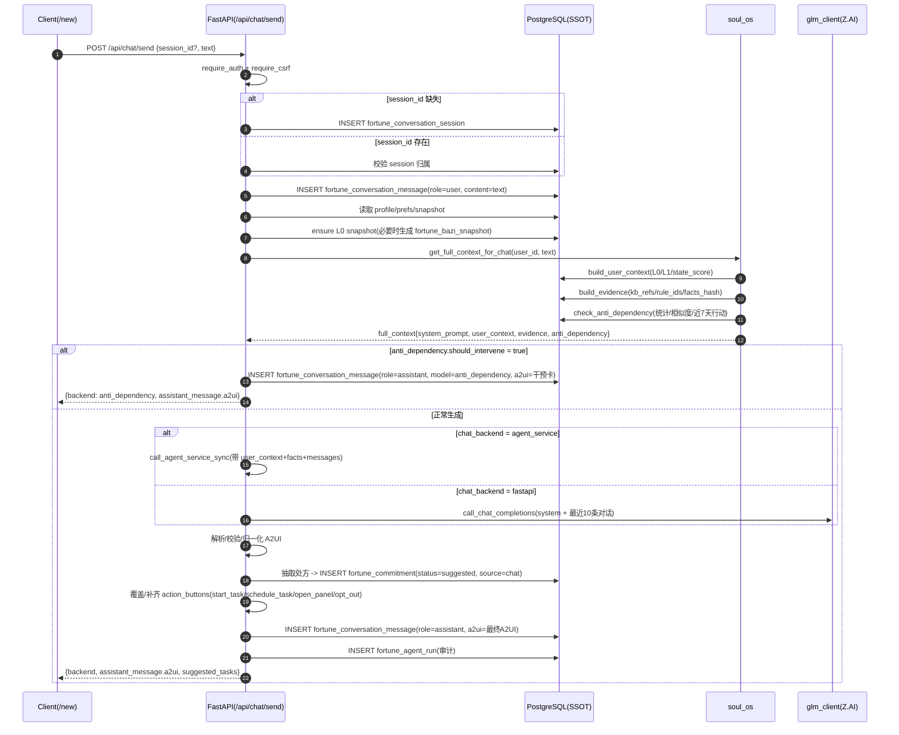
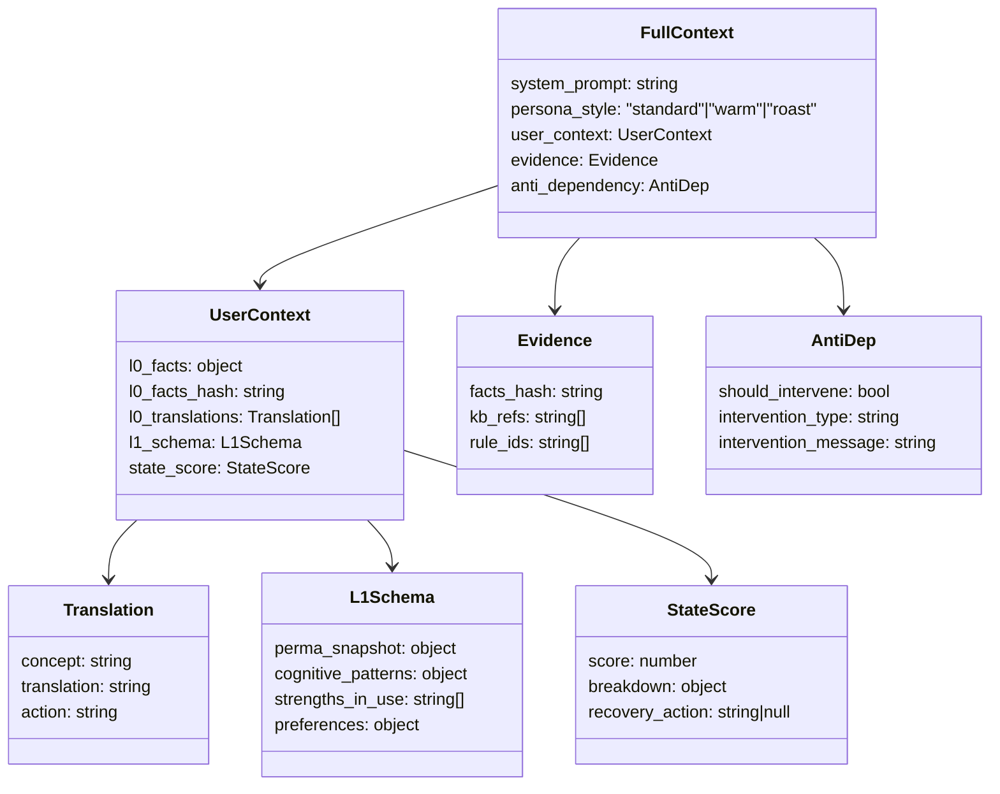
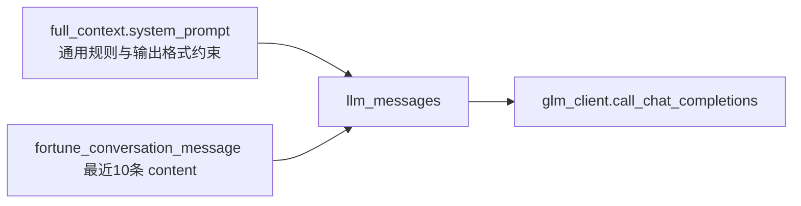
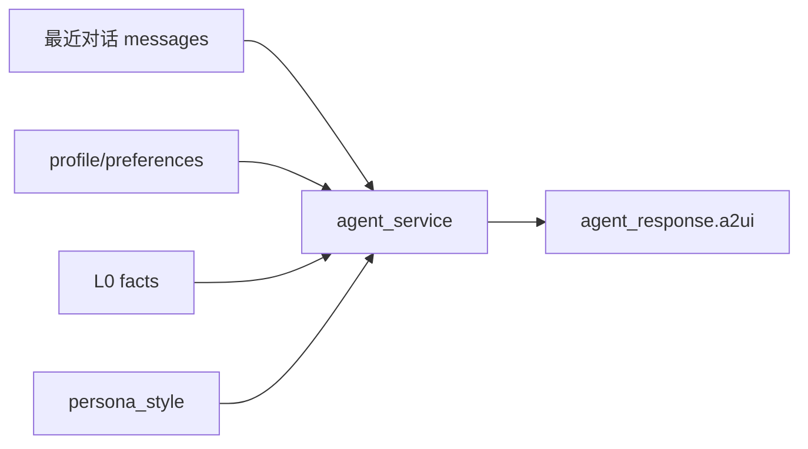
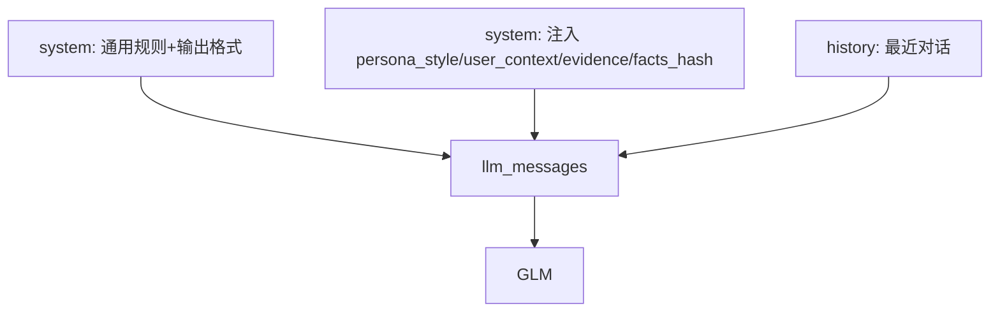

# Fortune AI Chat Agent：Context 构建流程与结构（Codex Review）

**文档类型**：Chat Design Review（Codex）  
**产品代号**：`Fortune AI`  
**版本**：Codex MVP review v0.1  
**日期**：2026-01-01  
**范围**：只聚焦 Chat Agent（`POST /api/chat/send`）在「每次生成时」的上下文（context）构建、注入、后处理与落库；并对照 `fortune_ai/docs/architech/system_design_final_mvp.md` 的目标口径做差距说明。  

**主要参考**
- `fortune_ai/docs/architech/system_design_final_mvp.md`（Final MVP 目标：A2UI、facts/evidence 约束、审计、反依赖）
- 代码实现（关键入口）：
  - `fortune_ai/api/chat_routes.py`（Chat API 路由与后处理：A2UI 解析、处方抽取、插入任务、补齐按钮、审计）
  - `fortune_ai/services/soul_os.py`（context 组装：L0/L1/证据/反依赖/system_prompt）
  - `fortune_ai/services/chat_service.py`（会话与消息 SSOT）
  - `fortune_ai/services/bazi_facts.py`（L0 facts 快照保障）

---

## 0. 一页结论（先看风险点）

1) **当前实现确实构建了 `full_context`（含 L0/L1/证据/反依赖）**，但在默认 `fastapi` 路径里，**LLM 实际收到的输入几乎只有“通用 system_prompt + 最近对话文本”**，`user_context/evidence` 并未显式注入到 prompt/messages。  
2) 这会导致与 `system_design_final_mvp.md` 的关键原则冲突：文档要求“LLM 只能基于 facts+evidence 输出”，但 **fastapi 路径并没有把 facts/evidence 给到 LLM**（除非它们恰好出现在历史对话里）。  
3) 任务闭环是“后处理强行补齐”的：系统从 LLM 输出的 Markdown 中抽取“行动处方”，写入 `fortune_commitment(status=suggested)`，并覆盖/补齐 `action_buttons`。这能保证按钮存在，但 **处方结构（如 if_then）与证据引用（kb_refs/rule_ids）并没有被强约束落库**。  

---

## 1. 端到端调用链（生成一次回复）

> 入口：`POST /api/chat/send`（实现位于 `fortune_ai/api/chat_routes.py`）

---

## 2. `full_context` 的结构（soul_os 输出给 Chat API 的“总上下文”）

> 生成位置：`fortune_ai/services/soul_os.py` 的 `get_full_context_for_chat(user_id, query)`

---

## 3. Context 构建：每一块数据从哪里来

### 3.1 用户偏好 `persona_style`

- 来源：`fortune_user_preferences.persona_style`
- 构建点：`soul_os.get_full_context_for_chat` 先读偏好，再用于 `build_system_prompt(persona_style)`。

### 3.2 L0：`l0_facts`（八字事实快照）

- 主表：`fortune_bazi_snapshot(facts, facts_hash, compute_version)`
- 保障逻辑：如果快照缺失，`bazi_facts.ensure_snapshot_for_user(user_id)` 会用 `fortune_user` 的出生信息计算并写入快照。
- 重要意义：这是 `system_design_final_mvp.md` 所谓 “facts 的唯一事实输入”，理论上应该直接注入给 LLM。

### 3.3 L1：`l1_schema` + `state_score`

- L1 语义：把用户状态、PERMA、认知模式等“相对稳定/可追溯”的结构提供给 LLM 与产品层。
- 状态分数：`calculate_state_score(user_id)`（用于“今日洞察/任务/风险”与对话干预节奏）。

### 3.4 L2：`evidence`（kb_refs + rule_ids + facts_hash）

- `kb_refs`：`search_knowledge_base(query)` 对 `bazi_kb_chunk` 做 PostgreSQL FTS 检索，得到 `kb:doc:<id>:page:<n>:chunk:<n>` 的引用串；`build_evidence` 只保留 `kb_ref` 字符串列表。  
- `rule_ids`：从 L0 facts 的结构中提取（例如 strength/shensha 命中规则的 `rule_id`）。
- `facts_hash`：用于“可追溯”，应该与本次使用的 facts 一致。

### 3.5 反依赖：`anti_dependency`

- 核心目的：把依赖从“继续问”迁移到“先行动”（强制现实实验）。
- 关键输入（来自 SSOT）：
  - 当日咨询次数：`fortune_conversation_message` 里 role=user 且 created_at >= today
  - 最近行动：`fortune_commitment` 最近一次 done_at
  - 重复提问：最近 3 条用户消息内容相似度（词重叠简化版）
  - 是否有 active 任务：有则降低 daily limit 阈值
  - 新用户豁免：注册 7 天内且 onboarding 未完成（读取 `fortune_user.onboarding_completed`）
- 输出：`should_intervene/intervention_type/intervention_message`

---

## 4. LLM 实际拿到的 context：fastapi vs agent_service

### 4.1 fastapi（默认路径）——“通用 system + 最近对话”

> 代码行为：构造 `llm_messages = [system] + 最近10条历史对话文本`

**关键点（差距）**
- 虽然 `full_context.user_context` 与 `full_context.evidence` 都被构建了，但在 fastapi 路径里 **没有显式注入到 LLM messages**。  
- 这使得 system_prompt 里“只能基于 facts/evidence 输出”的约束在运行时难以成立（LLM 没看到 facts/evidence）。  

### 4.2 agent_service（可选路径）——“显式注入 facts/user_context”

> 代码行为：当 `fortune_user_preferences.chat_backend = agent_service` 时，会把 `messages + user_context(profile/preferences) + facts + persona_style` 作为结构化参数传给 agent service。

**结论**
- 从“上下文注入形态”看，agent_service 路径更接近 `system_design_final_mvp.md` 的目标：结构化输入、可追溯、可审计。  

---

## 5. 生成后处理：从 A2UI 到任务闭环（Commitment）

### 5.1 A2UI 解析与归一化（容错层）

1) 从 GLM 返回的 raw text 中提取 JSON object。  
2) 归一化 A2UI：兼容 `components/actions/content` 等变体字段，统一为 `meta + ui_components[{type,title,data}]`。  
3) 校验失败则降级：把原文包进 `markdown_text`，保证前端至少可展示。

### 5.2 从 Markdown 抽取“行动处方”（≤3 条）

- 抽取策略：找到包含“处方”的行作为起点，向下读取编号/列表项（最多 3 条）。  
- 风险：高度依赖 LLM 的 Markdown 结构与措辞（例如没写“处方”标题就抽取不到）。

### 5.3 写入 `fortune_commitment`（suggested tasks）

- 对每条处方写入：`fortune_commitment(user_id, session_id, source='chat', commitment_type='start_task', title, status='suggested')`
- 当前实现没有把 `if_then`、衡量标准、证据引用等写入 `details`（默认为 `{}`）。

### 5.4 覆盖/补齐 `action_buttons`（保证可点）

无论 LLM 是否输出按钮，后处理都会用“刚插入的任务 task_id”生成按钮并覆盖 action_buttons：
- `start_task`（最多 2 个）
- `schedule_task`（取第 1 个）
- `open_panel`（固定 `panel=bento`）
- `opt_out`

---

## 6. 与 `system_design_final_mvp.md` 的对齐差距（现状 vs 目标）

| 设计目标（Final MVP） | 现状（当前代码） | 影响 |
|---|---|---|
| LLM 必须基于 `facts + evidence` 输出（并可审计） | fastapi 路径未把 `user_context/evidence` 注入到 messages（仅注入通用 system_prompt） | 输出可能“看起来合规”，但无法证明基于事实；也难复盘与回放 |
| `kb_refs` 不仅可追溯，最好可作为依据（引用内容片段） | `build_evidence` 只输出 `kb_ref` 字符串，不包含 chunk 内容摘要；且未注入 prompt | LLM 不能利用知识库；审计“有 refs”但不具信息量 |
| 处方应包含 `if_then`（实现意图）并能落库用于后续提醒/复盘 | system_prompt 要求 if_then，但任务写库只存 `title`，`details` 为空 | 后续无法用 if_then 做“监督执行/提醒”与复盘一致性 |
| actions 要与前端面板/Tab 一致（open_panel 可定位） | action_buttons 会被补齐，但 `open_panel` 固定 `bento`；反依赖分支给 `tasks` | 容易出现 panel 命名不一致与“点了没反应” |
| 反依赖干预“仍要给至少 1 个可执行任务” | `check_anti_dependency` 内部有 `suggested_task`，但 chat_routes 干预 A2UI 未使用该 task_id | 干预时只能“打开任务”，缺少一键开始/加入计划 |

---

## 7. 建议的“对齐版 Context 注入”形态（推荐）

> 目标：在 **fastapi 路径** 也做到“事实/证据显式注入 + 体积可控 + 可审计可回放”。

### 7.1 推荐 messages 结构（最小改动）

**注入内容建议（压缩版）**
- `persona_style`
- `facts_hash`
- L0：只给“摘要 + 必要字段”，避免整坨 facts（例如：日主/旺衰/关键 shensha 命中 + 版本信息）
- L1：只给 PERMA 与状态分数的摘要（而非全量 history）
- evidence：给 `kb_refs + rule_ids`，并附 `kb_excerpt`（每条 200~400 字以内）

### 7.2 反依赖干预建议

- 干预 A2UI 应直接包含 `start_task/schedule_task`（如果 `suggested_task.task_id` 存在），否则应先创建一个最小任务再返回按钮。  

---

## 8. 附录：本 review 关注的关键落点（SSOT 表）

- `fortune_conversation_session`：会话  
- `fortune_conversation_message`：消息（user/assistant，assistant 可带 a2ui 与 token 统计）  
- `fortune_bazi_snapshot`：L0 facts 快照（facts_hash 可追溯）  
- `bazi_kb_document / bazi_kb_chunk`：知识库（FTS 检索，kb_refs 引用）  
- `fortune_commitment`：处方落地为任务（suggested/active/done）  
- `fortune_agent_run`：审计（prompt_version/facts_hash/input/output/usage/latency/error）  

