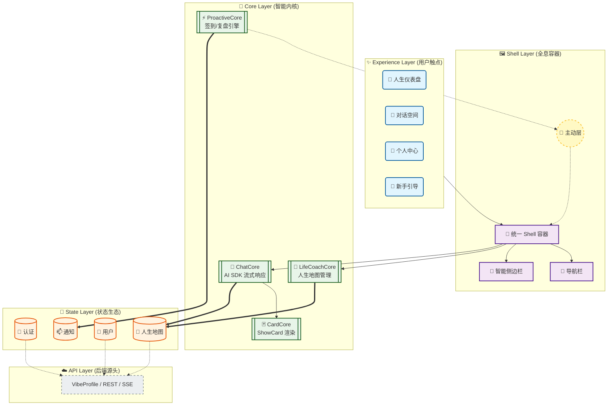
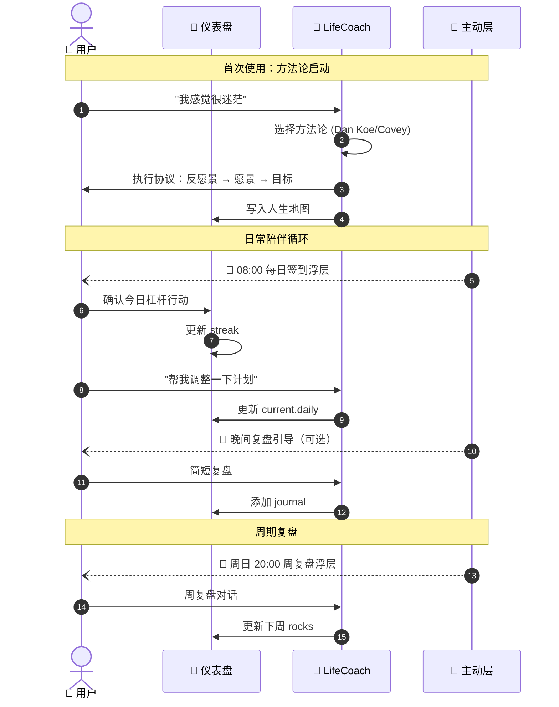
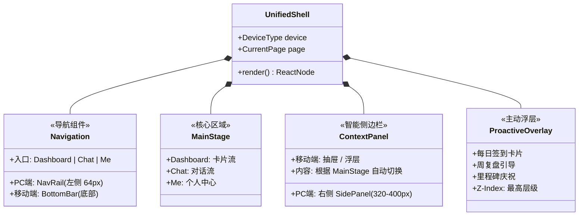
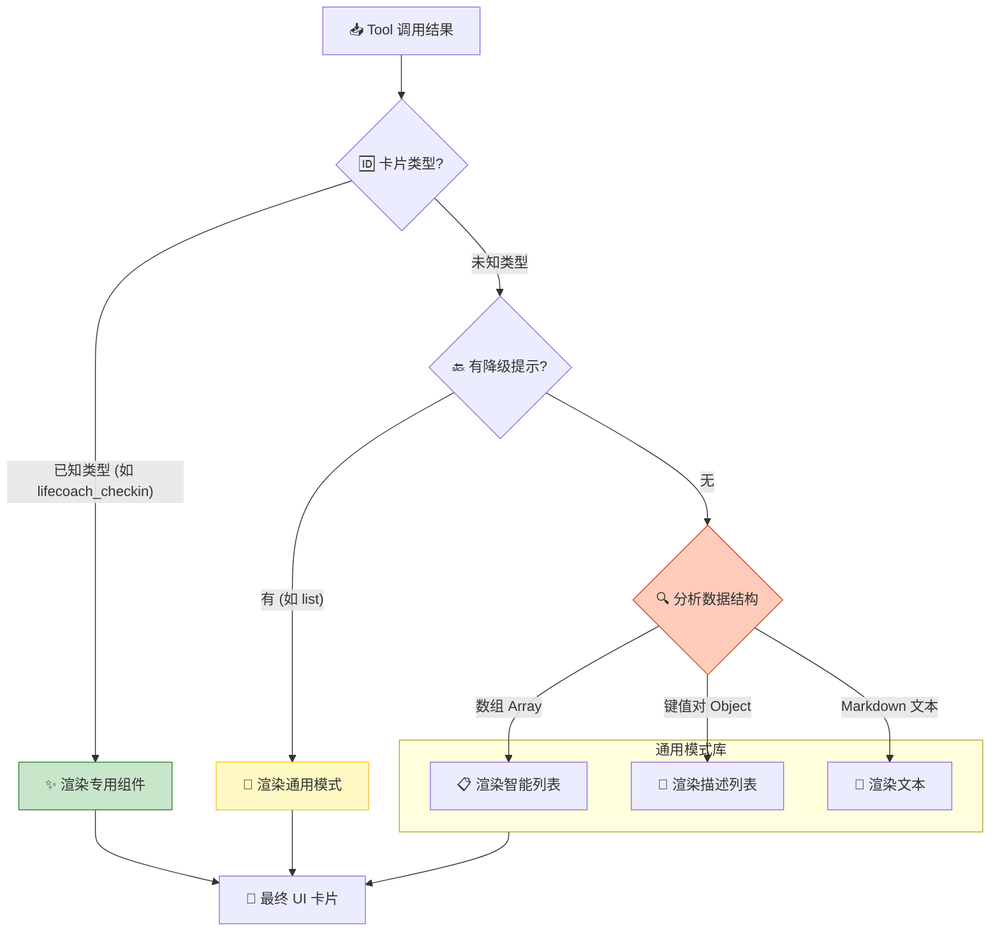
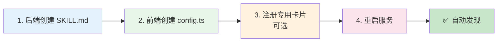
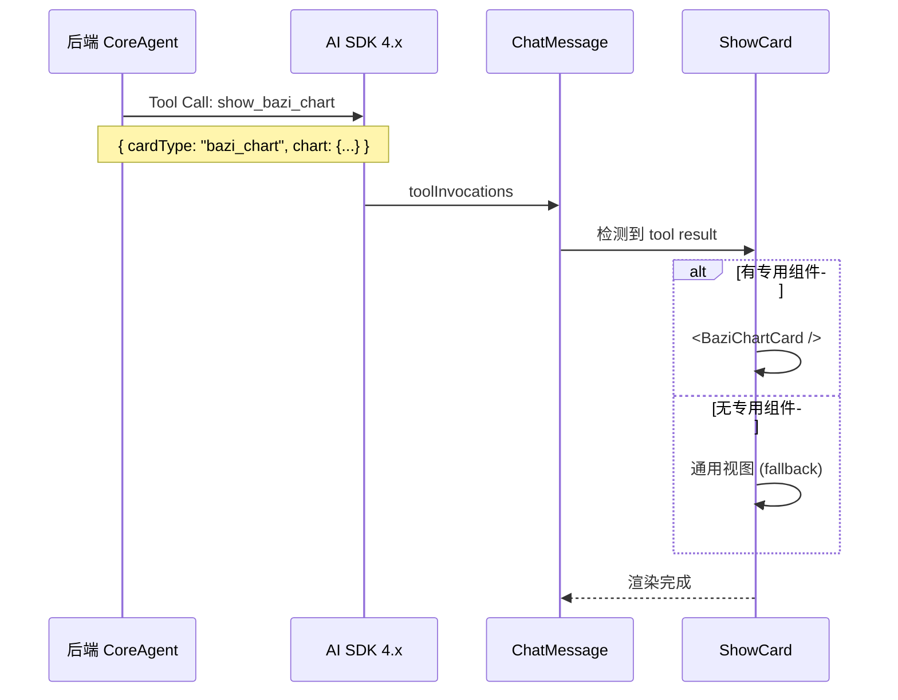
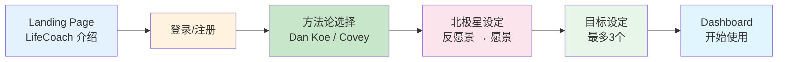

# VibeLife V8 前端架构设计方案

> **设计哲学**：LifeCoach 核心、持续陪伴、AI 原生
>
> 我们不只是构建页面，而是在构建 **人生伙伴**。

---

## 0. 核心设计决策

| 决策点 | 选择 | 说明 |
|-------|------|------|
| **产品定位** | LifeCoach 是核心产品 | 其他 Skill（八字、星座）是辅助能力 |
| **主界面** | 人生仪表盘 (Dashboard) | 卡片流垂直滚动，展示北极星、今日行动、进度 |
| **右侧栏** | 自动切换 | 根据左侧页面自动变化内容 |
| **导航** | 简化三入口 | 🎯 Dashboard \| 💬 Chat \| 👤 Me |
| **推送触达** | ProactiveLayer 浮层 | 每日签到、周复盘通过浮层触达 |
| **跨端体验** | PC/移动端一致 | 逻辑相同，仅布局响应式适配 |

---

## 1. 架构全景 (Architecture Panorama)

以 LifeCoach 为核心的数据流动架构。数据从 VibeProfile 涌入，经过 LifeCoachCore 处理，注入 State 容器，最终由 Shell 呈现。



**ASCII 备用视图**：
```
                                     .-------------------.
                                     |    Experience     |
                                     | [Dashboard] [Chat]|
                                     '--------+----------'
                                              |
    . - - - - - - - - - - - - - .             v
    |    Proactive Layer        |    .-------------------.
    |  (签到浮层/周复盘浮层)     | ~> |       Shell       |
    ' - - - - - - - - - - - - - '    | [Nav] [Main] [Side]|
                                     '--------+----------'
                                              |
                                              v
                                     .-------------------.
                                     |       Core        |
                                     |[LifeCoach][Chat][Card]|
                                     '--------+----------'
                                              |
                                              v
                                     .-------------------.
                                     |       State       |
                                     | (Auth)(LifeCoach) |
                                     '--------+----------'
                                              :
                                              v
                                       ( VibeProfile )
```

---

## 2. 产品核心体验

VibeLife 以 LifeCoach 为核心，其他能力围绕它展开：

| 能力 | 前端体验 | 设计要点 |
|------|----------|----------|
| **LifeCoach 核心** | Dashboard 人生仪表盘 | 北极星、今日杠杆、本周大石头、进度追踪 |
| **持续陪伴** | ProactiveLayer | 每日签到浮层、周复盘引导、里程碑庆祝 |
| **AI 对话** | Chat 对话空间 | 与"来自未来的你"或"专业教练"对话 |
| **命理洞察** | Skill 辅助 | 八字、星座为 LifeCoach 提供命理视角建议 |

---

## 3. LifeCoach 陪伴闭环

以 LifeCoach 为核心的持续陪伴循环：



**核心理念**：
```
传统 App:  用户操作 → 界面响应 → 展示结果 (终点)

LifeCoach:  愿景设定 → 路径拆解 → 每日执行 → 持续复盘
                 ↑                              ↓
                 └──── 主动陪伴 (Proactive) ────┘
```

---

## 4. 全息 Shell (Holographic Shell)

`UnifiedShell` 是一个智能的响应式容器，以 Dashboard 为主界面，根据设备尺寸和上下文自动形变。

### 4.1 组件解剖



### 4.2 响应式布局

**PC 布局 (≥1024px)**：
```
┌────────┬─────────────────────────────────┬────────────────────┐
│NavRail │         MainContent             │    SidePanel       │
│ (64px) │      (flex-1, 卡片流)           │   (320-400px)      │
│        │                                  │   自动切换内容      │
│  🎯    │  ┌─────────────────────────┐    │                    │
│  💬    │  │    Dashboard 卡片流      │    │  ┌──────────────┐  │
│  👤    │  │    (垂直滚动)            │    │  │ 人生地图概览  │  │
│        │  │                         │    │  └──────────────┘  │
│        │  └─────────────────────────┘    │  ┌──────────────┐  │
│        │                                  │  │  快捷操作     │  │
│        │                                  │  └──────────────┘  │
└────────┴─────────────────────────────────┴────────────────────┘
                    ↑
            ProactiveLayer (签到浮层，覆盖在上方)
```

**Mobile 布局 (<1024px)**：
```
┌─────────────────────────────────────────┐
│  Header (Today's Focus + 🔔)            │
├─────────────────────────────────────────┤
│                                          │
│           MainContent                    │
│        (Dashboard 卡片流)                │
│        (垂直滚动)                        │
│                                          │
├─────────────────────────────────────────┤
│     🎯 Dashboard │ 💬 Chat │ 👤 Me      │
└─────────────────────────────────────────┘
```

### 4.3 智能侧边栏策略 (Smart SidePanel)

SidePanel 根据当前的主舞台内容**自动切换**显示内容：

| 主舞台 (Main Stage) | 侧边栏内容 (Side Panel) | 数据来源 |
|---------------------|------------------------|----------|
| 🎯 **Dashboard** | 人生地图概览：北极星 + 目标进度 + 快捷操作 | lifecoach.* |
| 💬 **Chat** | 对话上下文：当前话题 + 相关目标 + 命理洞察 | lifecoach + skill_data |
| 👤 **Me** | 个人设置导航 + 订阅状态 + 数据统计 | preferences + account |

---

## 5. Dashboard 卡片流设计

Dashboard 是用户的**人生仪表盘**，采用垂直滚动的卡片流布局：

### 5.1 卡片流结构

```
┌─────────────────────────────────────────────────────────────────┐
│                      Dashboard 卡片流                            │
├─────────────────────────────────────────────────────────────────┤
│                                                                  │
│  ┌───────────────────────────────────────────────────────────┐  │
│  │ 🌅 今日签到卡片 (未签到时显示)                              │  │
│  │                                                            │  │
│  │  "早安！准备好开始今天了吗？"                               │  │
│  │                                                            │  │
│  │  身份宣言：{identity.target}                               │  │
│  │  今日杠杆：{current.daily.levers}                          │  │
│  │  连续签到：{progress.streak} 天 🔥                         │  │
│  │                                                            │  │
│  │  [开始今天] [调整计划] [跳过]                              │  │
│  └───────────────────────────────────────────────────────────┘  │
│                           ↓                                     │
│  ┌───────────────────────────────────────────────────────────┐  │
│  │ ⭐ 北极星卡片                                               │  │
│  │                                                            │  │
│  │  愿景: {north_star.vision}                                 │  │
│  │  "一个通过创作影响百万人、时间自由的人"                    │  │
│  │                                                            │  │
│  │  [查看详情] [与未来的我对话]                               │  │
│  └───────────────────────────────────────────────────────────┘  │
│                           ↓                                     │
│  ┌───────────────────────────────────────────────────────────┐  │
│  │ 📅 本周大石头                                               │  │
│  │                                                            │  │
│  │  ✓ 完成3.2节初稿 (创作自由)                               │  │
│  │  ○ 周三带孩子去公园 (家庭幸福)                            │  │
│  │  ○ 跑步3次 (身心健康)                                     │  │
│  │                                                            │  │
│  │  进度: ████░░░░░░ 1/3                                      │  │
│  │                                                            │  │
│  │  [完成] [调整]                                             │  │
│  └───────────────────────────────────────────────────────────┘  │
│                           ↓                                     │
│  ┌───────────────────────────────────────────────────────────┐  │
│  │ 🎯 月度项目 (Boss 战)                                       │  │
│  │                                                            │  │
│  │  {current.month.project}                                   │  │
│  │  "完成第3章"                                               │  │
│  │                                                            │  │
│  │  进度: ████████░░ 80%                                      │  │
│  │  截止: {current.month.deadline}                            │  │
│  │                                                            │  │
│  │  任务:                                                     │  │
│  │  ✓ 3.1 核心概念                                           │  │
│  │  → 3.2 案例分析 (进行中)                                  │  │
│  │  ○ 3.3 实践指南                                           │  │
│  └───────────────────────────────────────────────────────────┘  │
│                           ↓                                     │
│  ┌───────────────────────────────────────────────────────────┐  │
│  │ 🎓 核心目标概览                                            │  │
│  │                                                            │  │
│  │  ┌─────────┐ ┌─────────┐ ┌─────────┐                      │  │
│  │  │创作自由 │ │家庭幸福 │ │身心健康 │                      │  │
│  │  │ ██░░░░ │ │ ████░░ │ │ ██████ │                      │  │
│  │  │  30%   │ │  60%   │ │  100%  │                      │  │
│  │  └─────────┘ └─────────┘ └─────────┘                      │  │
│  └───────────────────────────────────────────────────────────┘  │
│                           ↓                                     │
│  ┌───────────────────────────────────────────────────────────┐  │
│  │ 📊 进度统计                                                 │  │
│  │                                                            │  │
│  │  本周完成: 5/7 大石头                                      │  │
│  │  连续签到: 12 天 🔥                                        │  │
│  │  上次复盘: 3 天前                                          │  │
│  └───────────────────────────────────────────────────────────┘  │
│                                                                  │
└─────────────────────────────────────────────────────────────────┘
```

### 5.2 卡片优先级

| 优先级 | 卡片 | 显示条件 |
|-------|------|---------|
| 1 | 今日签到 | 当日未签到时显示在顶部 |
| 2 | 北极星 | 始终显示（已设置时） |
| 3 | 本周大石头 | 始终显示 |
| 4 | 月度项目 | 有项目时显示 |
| 5 | 核心目标 | 已设置目标时显示 |
| 6 | 进度统计 | 始终显示 |
| - | 新手引导 | 未完成初始化时显示 |

### 5.3 卡片状态映射

```typescript
// Dashboard 卡片数据来源
interface DashboardData {
  // 签到状态
  checkin: {
    checked_today: boolean;
    streak: number;              // progress.streak
    identity: string;            // identity.target
    levers: string[];            // current.daily.levers
  };

  // 北极星
  north_star: {
    vision: string;
    vision_scene?: string;       // 用于 future_self 对话
    anti_vision?: string;
  };

  // 本周大石头
  weekly_rocks: {
    rocks: Array<{
      rock: string;
      goal_id: string;
      done: boolean;
    }>;
    start: string;
    end: string;
  };

  // 月度项目
  monthly_project: {
    project: string;
    deadline: string;
    tasks: Array<{
      task: string;
      status: 'done' | 'in_progress' | 'pending';
    }>;
  };

  // 核心目标
  goals: Array<{
    id: string;
    name: string;
    progress: number;  // 0-1
  }>;

  // 统计
  stats: {
    weekly_rocks_done: number;
    weekly_rocks_total: number;
    streak: number;
    last_review_days: number;
  };
}
```

---

## 6. 卡片渲染逻辑 (Card Rendering)

`CardCore` 是前端的"**视觉翻译官**"。它负责将 JSON 数据翻译成 UI 卡片。采用 **"渐进式降级" (Progressive Fallback)** 策略。



**通用视图类型**：
```
list | tree | table | timeline | form | select
chart | progress | counter | modal | toast | custom
```

---

## 7. 状态生态 (State Ecosystem)

以 LifeCoach 为核心的状态管理：

```tsx
// ⚛️ VibeLife App 的原子结构
<AppProviders>
  {/* 1. 身份层：你是谁？ */}
  <AuthProvider>
    <UserProvider>

      {/* 2. 核心层：你的人生地图 */}
      <LifeCoachProvider>

        {/* 3. 推送层：主动陪伴 */}
        <ProactiveProvider>

          {/* 4. 视觉层：看起来如何？ */}
          <ThemeProvider>
            <UnifiedShell>
               {/* 舞台已就绪 */}
               <Component {...pageProps} />
            </UnifiedShell>
          </ThemeProvider>

        </ProactiveProvider>
      </LifeCoachProvider>

    </UserProvider>
  </AuthProvider>
</AppProviders>
```

### 7.1 Context 接口定义

```typescript
// 1. AuthContext - 认证状态
interface AuthState {
  isAuthenticated: boolean;
  user: User | null;
  tokens: { access: string; refresh: string } | null;
  login: (provider: 'google' | 'apple' | 'wechat') => Promise<void>;
  logout: () => void;
}

// 2. LifeCoachContext - 人生地图状态 (核心)
interface LifeCoachState {
  // 数据
  northStar: NorthStar | null;
  goals: Goal[];
  currentMonth: MonthlyProject | null;
  currentWeek: WeeklyRocks | null;
  currentDaily: DailyLevers | null;
  identity: Identity | null;
  progress: Progress | null;

  // 方法
  loadLifeCoachData: () => Promise<void>;
  updateSection: (section: string, data: any) => Promise<void>;
  checkin: () => Promise<void>;
  completeRock: (rockId: string) => Promise<void>;

  // 状态
  isLoading: boolean;
  isInitialized: boolean;  // 是否完成初始化（有北极星）
}

// 3. UserContext - 用户数据
interface UserState {
  profile: UserProfile | null;
  preferences: Preferences | null;
  subscription: SubscriptionStatus;
  entitlements: Entitlement[];
}

// 4. ProactiveContext - 推送状态
interface ProactiveState {
  notifications: ProactiveNotification[];
  unreadCount: number;
  pendingCheckin: boolean;      // 是否有待签到
  pendingWeeklyReview: boolean; // 是否有待周复盘
  showCheckinOverlay: boolean;  // 是否显示签到浮层
  dismissCheckin: () => void;
  confirmCheckin: () => void;
}
```

---

## 8. 路由结构

以 Dashboard 为首页的三入口导航结构：

```
app/
├── (public)/                    # 公开页面（无需登录）
│   ├── page.tsx                 # Landing / Onboarding 入口
│   ├── onboarding/              # Onboarding 流程
│   │   ├── page.tsx             # 方法论选择
│   │   ├── north-star/          # 北极星设定
│   │   └── goals/               # 目标设定
│   └── auth/                    # 登录/注册
│
├── (app)/                       # 应用主体（需登录，使用 UnifiedShell）
│   ├── layout.tsx               # UnifiedShell 布局
│   │
│   ├── dashboard/               # 🎯 Dashboard（默认首页）
│   │   └── page.tsx             # 人生仪表盘 - 卡片流
│   │
│   ├── chat/                    # 💬 Chat
│   │   └── page.tsx             # 对话页面
│   │
│   ├── me/                      # 👤 Me（个人中心）
│   │   ├── page.tsx             # 个人中心首页
│   │   ├── settings/            # 设置
│   │   │   └── page.tsx
│   │   ├── skills/              # Skill 订阅管理
│   │   │   └── page.tsx
│   │   └── notifications/       # 通知中心
│   │       └── page.tsx
│   │
│   └── lifecoach/               # LifeCoach 详情页（从 Dashboard 进入）
│       ├── north-star/          # 北极星详情/编辑
│       ├── goals/               # 目标详情/编辑
│       ├── weekly/              # 周计划详情
│       └── journal/             # 复盘日志
│
└── api/                         # Next.js API Routes (Proxy)
    ├── v1/
    │   ├── chat/
    │   ├── lifecoach/           # LifeCoach API
    │   ├── skills/
    │   └── ...
    └── auth/
```

### 8.1 导航映射

| 导航入口 | 路由 | 页面内容 | 右侧栏内容 |
|---------|------|---------|-----------|
| 🎯 Dashboard | `/dashboard` | 人生仪表盘（卡片流） | 人生地图概览 |
| 💬 Chat | `/chat` | 对话页面 | 对话上下文 + 相关目标 |
| 👤 Me | `/me` | 个人中心 | 设置导航 |

---

## 9. Skill 插件架构

### 9.1 前端 Skill 目录结构

```
skills/
├── registry.ts                  # Skill 注册表
├── types.ts                     # 类型定义
├── CardRegistry.ts              # 卡片注册表
├── initCards.ts                 # 卡片初始化
│
├── shared/                      # 共享组件
│   ├── ShowCard.tsx             # 统一卡片渲染器
│   ├── views/                   # 通用视图 (list, tree, table...)
│   └── CollectFormCard.tsx      # 信息收集表单
│
├── bazi/                        # 八字 Skill
│   ├── index.ts                 # Skill 配置导出
│   ├── config.ts                # 主题、功能配置
│   ├── cards/                   # 专用卡片组件
│   │   ├── BaziChartCard.tsx
│   │   ├── BaziFortuneCard.tsx
│   │   └── BaziKlineCard.tsx
│   ├── panels/                  # 专用面板
│   │   └── FortunePanel.tsx
│   └── tools/                   # Tool 渲染器（可选）
│
├── zodiac/                      # 西方占星 Skill
│   └── ...
│
└── [new-skill]/                 # 新 Skill 模板
    ├── index.ts
    ├── config.ts
    └── cards/
```

### 9.2 添加新 Skill 流程



---

## 10. 后端 API 对接

### 10.1 API 映射表

| 后端 API | 前端模块 | 用途 |
|----------|----------|------|
| `POST /chat/v5/stream` | ChatCore | AI 对话流 (SSE) |
| `GET /skills` | SkillCore | Skill 列表 |
| `POST /skills/{id}/{action}` | SkillCore | Skill 服务调用 |
| `GET /tools/schema` | CardCore | 工具 Schema |
| `GET /notifications` | ProactiveCore | 通知列表 |
| `POST /notifications/{id}/read` | ProactiveCore | 标记已读 |
| `GET /account/identity/prism` | UserContext | VibeID 数据 |
| `GET /commerce/entitlement` | UserContext | 权益信息 |

### 10.2 Tool Calling 渲染流程



---

## 11. 关键体验设计

### 11.1 ProactiveLayer 签到浮层

每日签到通过全屏浮层触达用户：

```
┌─────────────────────────────────────────────────────────────────┐
│                                                                  │
│                      ProactiveLayer (浮层)                       │
│                                                                  │
│  ┌───────────────────────────────────────────────────────────┐  │
│  │                                                            │  │
│  │                  🌅 早安，准备好了吗？                      │  │
│  │                                                            │  │
│  │  ─────────────────────────────────────────────────────    │  │
│  │                                                            │  │
│  │  你的身份宣言：                                            │  │
│  │  "我是那种把创造放在第一位的人"                           │  │
│  │                                                            │  │
│  │  今日杠杆行动：                                            │  │
│  │  • 写作1小时 (6-7am)                                       │  │
│  │  • 发1条推文                                               │  │
│  │  • 读30分钟                                                │  │
│  │                                                            │  │
│  │  本周大石头进度：2/4 ████████░░░░                          │  │
│  │  连续签到：12 天 🔥                                        │  │
│  │                                                            │  │
│  │  ─────────────────────────────────────────────────────    │  │
│  │                                                            │  │
│  │  ┌─────────────┐  ┌─────────────┐  ┌─────────────┐       │  │
│  │  │  开始今天   │  │  调整计划   │  │   跳过      │       │  │
│  │  │  (Primary)  │  │             │  │  (Ghost)    │       │  │
│  │  └─────────────┘  └─────────────┘  └─────────────┘       │  │
│  │                                                            │  │
│  └───────────────────────────────────────────────────────────┘  │
│                                                                  │
└─────────────────────────────────────────────────────────────────┘
```

**触发逻辑**：
| 触发时机 | 条件 | 动作 |
|---------|------|------|
| 每日 08:00 | 用户已有 daily levers | 显示签到浮层 |
| 用户打开 App | 当日未签到 | 显示签到浮层 |
| 周日 20:00 | 有本周 rocks 数据 | 显示周复盘浮层 |
| 完成里程碑 | 完成关键目标 | 显示庆祝浮层 |

### 11.2 周复盘浮层

```
┌───────────────────────────────────────────────────────────────┐
│                                                                │
│                📅 这周结束了，来复盘吧                          │
│                                                                │
│  本周大石头完成情况：                                          │
│  ✓ 完成3.2节初稿 (创作自由)                                   │
│  ✓ 周三带孩子去公园 (家庭幸福)                                │
│  ✗ 周六约会 (丈夫) - 未完成                                   │
│  ✗ 跑步3次 (个人) - 只完成1次                                 │
│                                                                │
│  目标平衡：                                                    │
│  创作自由 ████████░░ 80%                                       │
│  家庭幸福 ██████░░░░ 60%                                       │
│  身心健康 ████░░░░░░ 40%                                       │
│                                                                │
│  ┌─────────────┐  ┌─────────────┐                             │
│  │ 开始复盘对话 │  │   稍后      │                             │
│  └─────────────┘  └─────────────┘                             │
│                                                                │
└───────────────────────────────────────────────────────────────┘
```

### 11.3 新用户 Onboarding

以 LifeCoach 为核心的新手引导：



---

## 12. 实施路线图

### Phase 1: Dashboard 核心
- [ ] 实现 UnifiedShell 三入口导航 (Dashboard | Chat | Me)
- [ ] 实现 Dashboard 卡片流页面
- [ ] 实现 LifeCoachContext 状态管理
- [ ] 对接后端 lifecoach API

### Phase 2: 签到陪伴
- [ ] 实现 ProactiveLayer 签到浮层
- [ ] 实现签到确认/跳过逻辑
- [ ] 实现 streak 连续签到追踪
- [ ] 对接后端 checkin API

### Phase 3: 周期复盘
- [ ] 实现周复盘浮层
- [ ] 实现目标平衡可视化
- [ ] 实现 journal 复盘记录
- [ ] 对接后端 journal API

### Phase 4: 智能侧边栏
- [ ] 实现侧边栏自动切换逻辑
- [ ] Dashboard 侧边栏：人生地图概览
- [ ] Chat 侧边栏：对话上下文 + 相关目标
- [ ] Me 侧边栏：设置导航

### Phase 5: Onboarding
- [ ] 实现方法论选择页面
- [ ] 实现北极星设定流程
- [ ] 实现目标设定流程
- [ ] 实现初始化完成跳转

---

## 13. 未解决问题

1. **签到时间窗口**：签到浮层是只在 08:00 显示，还是当日任何时间打开都显示？
2. **跳过惩罚**：用户选择"跳过"是否影响 streak？
3. **离线支持**：Dashboard 数据是否需要离线缓存？
4. **命理 Skill 融合**：八字/星座的洞察如何融入 LifeCoach 的建议？

---

> **视觉总结**：
>
> VibeLife V8 以 **LifeCoach 为核心**，不再是一个多 Skill 平台，而是一个 **人生陪伴系统**。
>
> Dashboard 是用户的人生仪表盘，ProactiveLayer 是持续陪伴的触达，Chat 是深度对话的入口。
>
> 它不只是展示数据，而是在 **陪伴用户实现愿景**。
