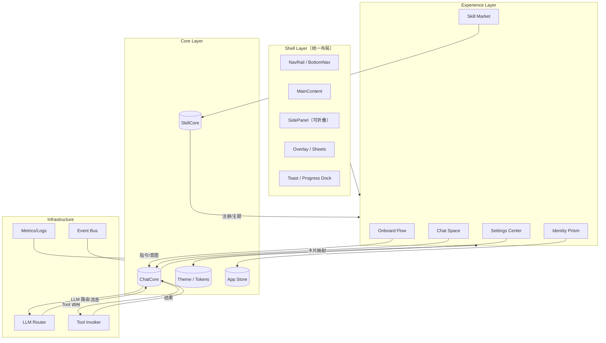
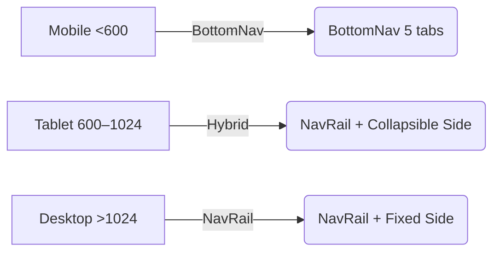
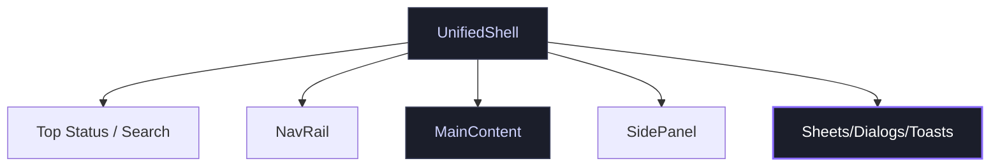
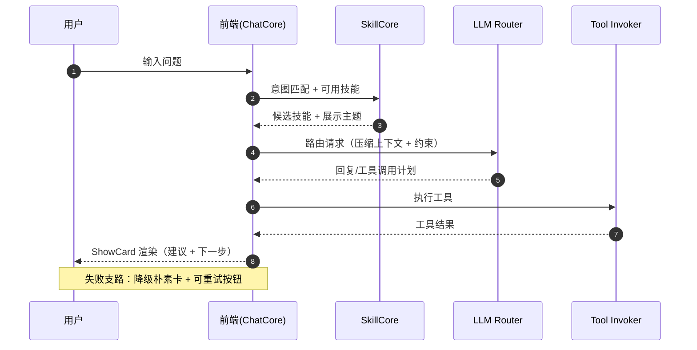
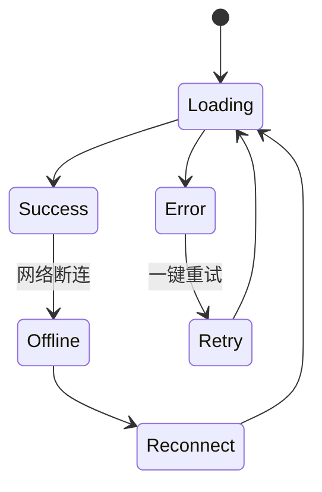
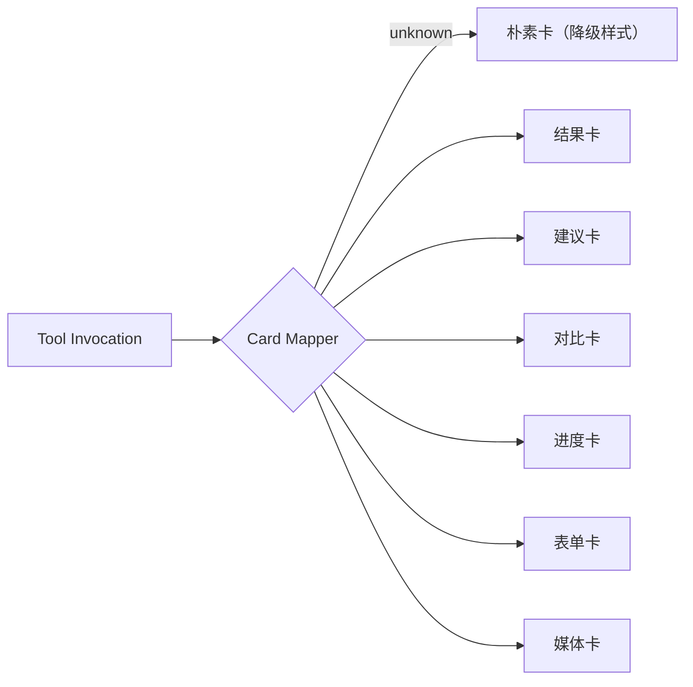
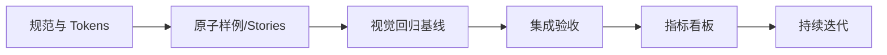

# VibeLife V8 视觉与交互设计方案（含图示）

版本：v9.0 · 日期：2026-01-19 · 作者：VibeLife Frontend · 指导：frontend-design skill

设计北极星（Purpose / Tone / Differentiation）
- Purpose：AI 原生 × Skill 驱动 × 主动关怀，把“能帮我先一步”的体验做成默认值。
- Tone：未来感的“温柔科技”——冷静网格 + 柔光霓虹点睛；少而准的动效；节制的材质与颗粒。
- Differentiation：三件难忘的小事——
  1) 首次进入的“Vibe 脉冲”（轻呼吸 + 色相微漂），
  2) 首条提问的“意图预判卡”，
  3) Skill 安装/启用的“光感过渡”。

——

## 1. 一图掌握 V8（Architecture Overview）



可视化说明
- 体验层只通过 Core 对外通信，Shell 提供统一框架与系统反馈（Overlay/Toast/Progress Dock）。
- ChatCore 与 SkillCore 是前端“智能调度与呈现”的核心；所有外部调用经由它们统一管理。

——

## 2. 视觉系统（Design Tokens）

```css
:root {
  /* 色彩 */
  --vibe-bg: hsl(244 22% 6%);
  --vibe-surface: hsl(244 20% 8%);
  --vibe-text: hsl(0 0% 96%);
  --vibe-subtext: hsl(0 0% 72%);
  --vibe-accent: hsl(268 92% 62%);     /* 情绪高光（霓虹紫） */
  --vibe-accent-2: hsl(188 92% 62%);   /* 辅助高光（电光青） */
  --vibe-positive: hsl(150 68% 52%);
  --vibe-warning: hsl(40 98% 58%);
  --vibe-danger:  hsl(355 88% 58%);

  /* 排版 */
  --vibe-font-display: "Satoshi-Variable", "SF Pro Display", ui-sans-serif;
  --vibe-font-text: "Inter Tight", system-ui, -apple-system, sans-serif;
  --vibe-fs-xxl: clamp(40px, 6vw, 72px);
  --vibe-fs-xl:  clamp(28px, 4vw, 40px);
  --vibe-fs-lg:  22px;
  --vibe-fs-md:  16px;
  --vibe-fs-sm:  14px;

  /* 空间与圆角 */
  --vibe-space-1: 4px;
  --vibe-space-2: 8px;
  --vibe-space-3: 12px;
  --vibe-space-4: 16px;
  --vibe-space-6: 24px;
  --vibe-space-8: 32px;
  --vibe-radius-2: 8px;
  --vibe-radius-3: 12px;
  --vibe-radius-pill: 999px;

  /* 光影与材质 */
  --vibe-shadow-1: 0 6px 24px hsl(0 0% 0% / 0.25);
  --vibe-shadow-neon: 0 0 0 1px hsl(268 92% 62% / 0.24), 0 0 32px hsl(268 92% 62% / 0.35);
  --vibe-noise-alpha: 0.06;
  --vibe-blur: 16px;

  /* 动效 */
  --vibe-dur-system: 120ms;  /* 系统层 */
  --vibe-dur-semantic: 240ms;/* 语义层 */
  --vibe-dur-emotion: 520ms; /* 情绪层 */
  --vibe-ease-out: cubic-bezier(.17,.84,.44,1);
  --vibe-ease-inout: cubic-bezier(.65,.05,.36,1);
}
```

中英文混排准则
- 标题使用 `--vibe-font-display`，正文使用 `--vibe-font-text`，中文优先本地黑体；数字/代码采用等宽备选。
- 行高建议：标题 1.2，正文 1.6；中英文标点遵循中文全角优先，英文内联不挤压。

——

## 3. 版式与响应（Grid & Breakpoints）

- 栅格：桌面 12 列 / 移动 4 列；容器最大宽度 1280px；版心 960–1120px。
- 断点：`<600`（Mobile）/ `600–1024`（Tablet）/ `>1024`（Desktop）。
- 信息密度：紧凑（数据密集区）/ 标准（默认）/ 呼吸（展示）。



Shell 交互要点
- NavRail ↔ BottomNav 的切换有 120ms 渐隐/位移；侧栏支持折叠/浮出/固定三态。
- 全局搜索、通知与“进行中任务（Progress Dock）”在各断点均保持一致入口与位置。

——

## 4. Shell 框架（统一布局）



规范
- 键盘：`G` 打开全局搜索，`/` 聚焦聊天输入，`[`/`]` 切换侧栏。
- 无障碍：焦点环使用 `2px` 高对比描边；Overlay 捕获焦点并提供“返回上一个焦点”逻辑。

——

## 5. ChatCore × SkillCore 交互泳道（主动关怀）



设计要点
- 首条问句触发“意图预判卡”（半自动建议）：不抢输入焦点，可一键采用；失败时降级为清爽提示。
- 工具链执行超过 800ms 时显示进度条与人类可读的任务状态（例如“正在整理你的日程…”）。

——

## 6. ShowCard 系统（卡片蓝图与状态）

卡片蓝图
- 信息层：标题/副本/关键数值/媒体/主要行动。
- 状态层：`loading / empty / error / offline / success`。
- 装饰层：轻噪点背景、柔光投影、品牌霓虹描边仅用于高光元素。



卡片尺寸谱系
- XS（列表内嵌）/ S（建议卡）/ M（结果卡）/ L（对比卡）/ XL（媒体或复杂表单）。

卡片渲染映射



——

## 7. 动效系统（Motion）

层级与节奏
- 系统层（100–160ms）：折叠/展开、焦点、按钮反馈。
- 语义层（200–320ms）：页面/面板进出、卡片出现。
- 情绪层（420–700ms）：Vibe 脉冲、Skill 启用光感过渡（频度有限制）。

```mermaid
gantt
  dateFormat  mm:ss
  title Motion Durations
  section 系统层
  Focus/Press    :done, 00:00, 00:00.12
  section 语义层
  Panel In/Out   :active, 00:00, 00:00.24
  Card Stagger   : 00:00.06, 00:00.30
  section 情绪层
  Vibe Pulse     : 00:00.12, 00:00.52
```

Vibe 脉冲规范
- 轻微色相漂移（±6°）+ 低频缩放（0.98↔1.00）+ 透明度 0.92↔1.00；禁用于主操作按钮，限欢迎与成功态。

——

## 8. 状态矩阵（文案与兜底）

| 状态 | 视觉 | 文案示例 | 行动 |
|---|---|---|---|
| Loading | 骨架屏 + 语义层进度 | 正在为你准备结果… | 取消/后台运行 |
| Empty | 轻图形 + 次要文案 | 还没有内容，试试这些提示 | 使用建议模板 |
| Error | 高对比提示 + 温柔语气 | 出了点问题，我们已经记录 | 重试/查看日志 |
| Offline | 灰阶 + 明确网络状态 | 你已离线，部分功能不可用 | 重新连接 |
| Permission | 弹出 Sheet | 需要你的允许以连接 X | 授权/跳过 |

文案风格：具体、温柔、无责备；所有错误都提供可操作下一步。

——

## 9. 可访问性与国际化（a11y & i18n）

- 对比：文本对背景对比度 ≥ 4.5:1；霓虹描边不承担信息表达，只做装饰。
- 动效：尊重系统“减少动态效果”；提供动效强度开关（系统层常开，情绪层可关）。
- 键盘：明确的 Tab 顺序与跳转锚点；对话、卡片均提供语义化 ARIA。
- 国际化：双语支持，单位/时间/数字本地化；断行策略兼容中英文。

——

## 10. 性能预算（Performance Budget）

- 首屏字体：≤ 2 个字重，子集化；CLS < 0.06，INP P75 < 200ms。
- 阴影/滤镜：主内容阴影 1 层；强模糊/渐变只用于关键场景。
- 资源策略：矢量优先；图片懒加载；Lottie/视频仅用于关键动效。
- 降级轨道：关闭情绪层动效；卡片降级为朴素卡；背景纹理降噪。

——

## 11. 指标与治理（Metrics & Governance）

- 体验指标：任务完成时长（点击→明确反馈）、建议采用率、失败支路占比。
- 技术指标：TTI、CLS、INP、错误率、离线可用性覆盖率。
- 评审清单：一致性/层次/对比/节奏/可达性/性能；每项有可勾选条目。



——

## 12. 关键场景蓝图

### 12.1 首次进入（Onboard）
- 渐进过渡进入 Shell；出现 2–3 个“可能想做”的建议卡；允许“一键开始”。

### 12.2 首条对话（Chat）
- 输入框上方悬浮“意图预判卡”；失败降级为提示；进度超过 800ms 显示进度条。

### 12.3 Skill 安装/启用
- 以“光感过渡”显式确认启用；提供安全回退；新能力以样例卡展示。

——

## 13. 附录：可复制图示（Mermaid）

1) 架构总览：见第 1 节代码块。

2) 交互泳道：见第 5 节代码块。

3) 卡片状态图：见第 6 节代码块。

4) 动效甘特：见第 7 节代码块。

——

## 14. Quick Wins（48 小时）

- 在首页插入“架构总览”矢量（当前 Mermaid 即可替代）。
- 输出 12 个核心 Tokens 并全站试点：色彩/字号/圆角/阴影/动效时长。
- 为 Chat/Market/Settings 三页补齐状态矩阵与文案准则。

——

## 15. 参考样式片段（可直接试用）

```css
.vibe-card {
  background: color-mix(in oklab, var(--vibe-surface), white 2%);
  color: var(--vibe-text);
  border-radius: var(--vibe-radius-3);
  box-shadow: var(--vibe-shadow-1);
  position: relative;
}
.vibe-card--accent {
  box-shadow: var(--vibe-shadow-neon);
  outline: 1px solid color-mix(in oklab, var(--vibe-accent), black 30%);
}
.vibe-pulse { /* 品牌脉冲（慎用） */
  animation: vibePulse var(--vibe-dur-emotion) var(--vibe-ease-inout) 1;
}
@keyframes vibePulse {
  0% { transform: scale(.98); filter: hue-rotate(-6deg); opacity:.92; }
  100%{ transform: scale(1);   filter: hue-rotate(0deg);  opacity:1; }
}
```

——

终稿备注
- 本文为 V8 视觉与交互白皮书的“实施版”，包含架构图、泳道、状态与动效图示，支持直接复制到设计/工程环境。
- 设计图示默认暗色方案；浅色可按 Tokens 自动映射（反转背景、调整对比）。

