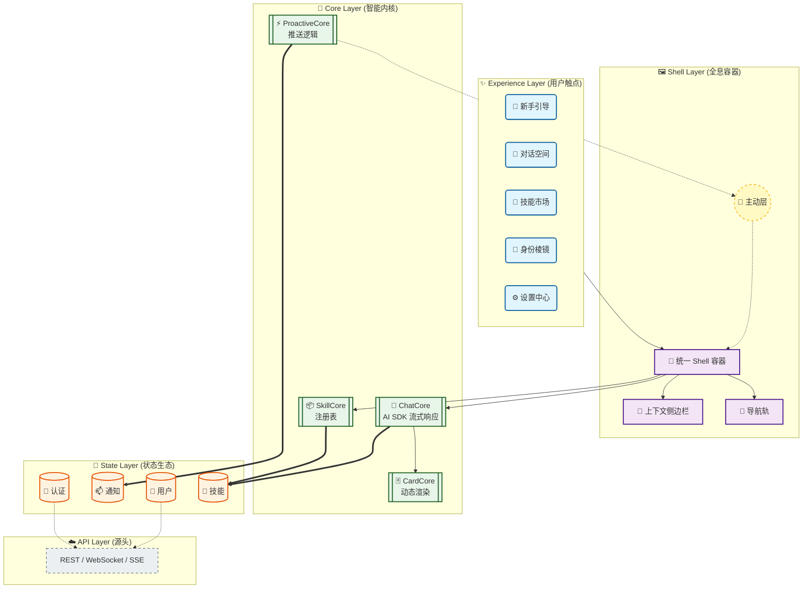
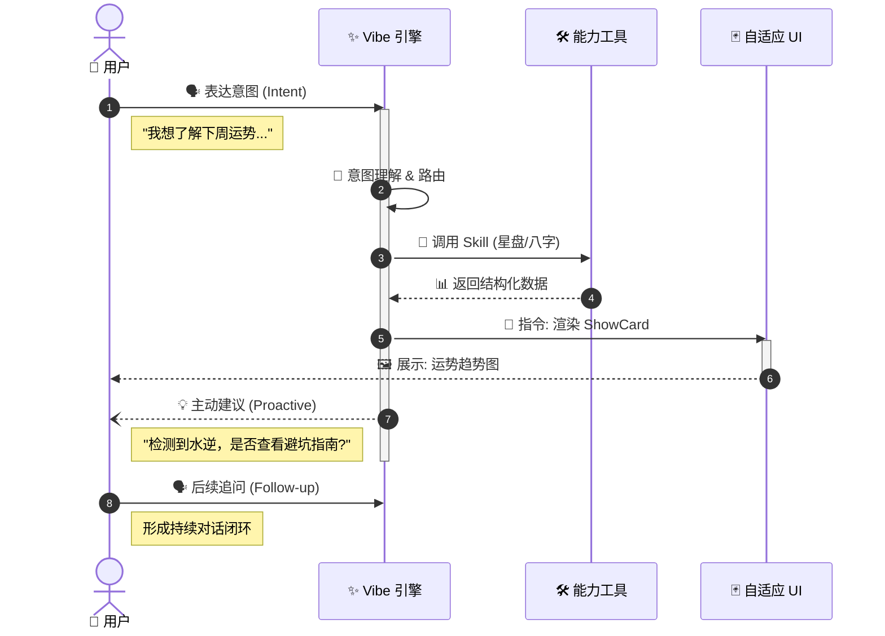
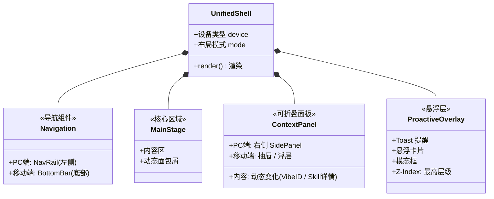
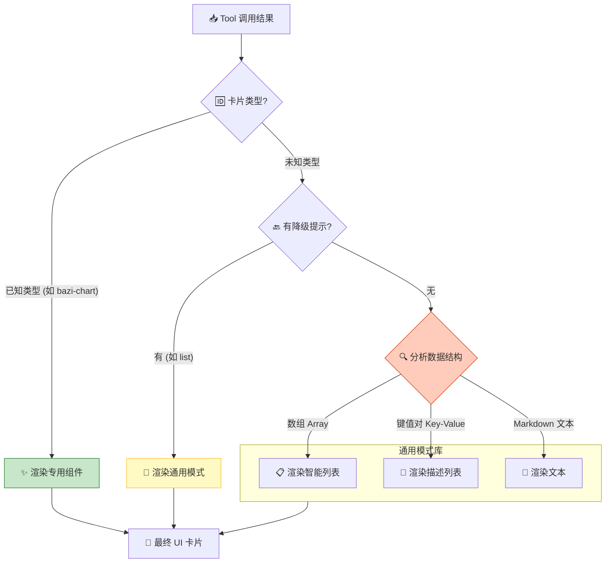

# 🎨 VibeLife V8：前端架构视觉规范
> **设计哲学**：流动 (Fluid)、响应 (Reactive)、AI 原生 (AI-Native)。
> 我们不只是构建页面，而是在编排 **智能的流动**。

---

## 1. 🌌 架构全景 (Architecture Panorama)

从传统的“层级堆叠”转向“数据流动的管道”。数据从 API 涌入，经过 Core 的处理，注入 State 容器，最终由 Shell 呈现给 Experience 层。



```text
                                         .-------------------.
                                         |    Experience     |
                                         |  [Chat] [Market]  |
                                         '--------+----------'
                                                  |
        . - - - - - - - - - - - - - .             v
        |       Proactive Layer     |    .-------------------.
        |     (Floating Overlay)    | ~> |       Shell       |
        ' - - - - - - - - - - - - - '    | [Nav] [Main] [Side]|
                                         '--------+----------'
                                                  |
                                                  v
                                         .-------------------.
                                         |       Core        |
                                         | [Chat] [Skill] [Card]|
                                         '--------+----------'
                                                  |
                                                  v
                                         .-------------------.
                                         |       State       |
                                         |  (Auth) (User)    |
                                         '--------+----------'
                                                  :
                                                  v
                                           (  API Cloud  )
```

---

## 2. 🔄 AI 原生交互闭环 (Interaction Loop)

传统 App 是线性的死胡同，AI 原生应用是无限的螺旋上升。

### ⚡ Vibe 闭环
用户的一个意图 (Intent)，不再止于一个结果 (Result)，而是触发新的主动建议 (Proactive Agency)。



```text
      User Input                     AI Processing                   User Feedback
     .----------.                  .---------------.                .-------------.
     |  Intent  | ---------------> |  Vibe Engine  | -------------> | Follow-up?  |
     '----+-----'                  '-------+-------'                '------+------'
          ^                                |  |                            |
          |                                |  | (1. Call Tool)             |
          | (Loop)                         |  v                            |
          |                          .-----+-----.                         |
          |                          |   Tools   |                         |
          |                          '-----+-----'                         |
          |                                | (2. Data)                     |
          |                                v                               |
          |                          .-----+-----.                         |
          |                          |    UI     | <-----------------------'
          |                          '-----+-----'
          |                                | (3. ShowCard)
          |                                v
          '------------------------ ( Proactive Agency )
```

---

## 3. 🖼️ 全息 Shell (Holographic Shell)

`UnifiedShell` 是一个智能的响应式容器，它根据设备尺寸和上下文自动形变。

### 📱 组件解剖



```text
    +-----------------------------------------------------------+
    |  [ NavRail ]  |      Main Stage         | [ SidePanel ]   |
    |      .        |                         |                 |
    |      .        |    (Chat / Market)      |  (Context /     |
    |      .        |                         |   Details)      |
    |      .        |                         |                 |
    |               |                         |                 |
    |               +-------------------------+                 |
    |               |    Proactive Overlay    |                 |
    |               |    (Floating Layer)     |                 |
    +---------------+-------------------------+-----------------+
    
    <------------------ Unified Shell Container ----------------->
```

### 🧠 智能侧边栏策略 (Smart SidePanel)
SidePanel 不是静态的，它是一面“魔镜”，根据当前的主舞台内容反射出辅助信息。

| **主舞台** (Main Stage) | **侧边魔镜** (Side Panel) | **视觉意图** (Visual Intent) |
| :--- | :--- | :--- |
| 💬 **Chat (对话)** | **VibeID 预览** | 左侧对话，右侧实时更新画像，体现“深度理解” (Deep Understanding) |
| 🎯 **Market (市场)** | **Skill 详情** | 左侧浏览，右侧展示详情与配置，减少页面跳转 |
| 💎 **Identity (身份)** | **维度深钻** | 左侧全览，右侧钻取单一维度的历史趋势 |

---

## 4. 🃏 卡片渲染逻辑 (Card Rendering)

`CardCore` 是前端的“视觉翻译官”。它负责将枯燥的 JSON 数据翻译成生动的 UI 卡片。我们采用 **“渐进式降级” (Progressive Fallback)** 策略。



```text
    [ Tool Result JSON ]
             |
             v
    /------------------\
    |  Known CardType? | --(Yes)--> [ Custom Component ]
    \------------------/             (Bazi / Chart)
             | (No)
             v
    /------------------\
    |  Fallback Hint?  | --(Yes)--> [ Generic Pattern ]
    \------------------/             (List / Table)
             | (No)
             v
    [   Data Analysis  ]
    [ (Array / Object) ] ---------> [ Smart Render ]
                                     (Text / KV / List)
```

---

## 5. 🧬 状态生态 (State Ecosystem)

状态不再是零散的变量，而是层层包裹的生态圈。

```typescript
// ⚛️ VibeLife App 的原子结构
<AppProviders>
  {/* 1. 身份层：你是谁？ */}
  <AuthProvider>
    <UserProvider>
      
      {/* 2. 能力层：你能做什么？ */}
      <SkillProvider>
        
        {/* 3. 互动层：正在发生什么？ */}
        <ProactiveProvider>
          
          {/* 4. 视觉层：看起来如何？ */}
          <ThemeProvider>
            <UnifiedShell>
               {/* 舞台已就绪 */}
               <Component {...pageProps} />
            </UnifiedShell>
          </ThemeProvider>
          
        </ProactiveProvider>
      </SkillProvider>
      
    </UserProvider>
  </AuthProvider>
</AppProviders>
```

```text
           .---------------------------------.
          /          AuthProvider             \
         /   .-----------------------------.   \
        |   /        UserProvider           \   |
        |  |   .-------------------------.   |  |
        |  |  /      SkillProvider        \  |  |
        |  | |   .---------------------.   | |  |
        |  | |  /  ProactiveProvider    \  | |  |
        |  | | |   .-----------------.   | | |  |
        |  | | |  |   UnifiedShell    |  | | |  |
        |  | | |  |    (Component)    |  | | |  |
        |  | | |   '-----------------'   | | |  |
        |  | |  \_______________________/  | |  |
        |  |  \_________________________/  | |  |
        |   \___________________________/   |  |
         \_________________________________/  /
          '---------------------------------'
```

---

> **视觉总结**: 
> VibeLife V8 不仅仅是一个 UI；它是一个 **生命接口 (Living Interface)**。
> 它会呼吸 (主动关怀 Proactive)，会思考 (智能内核 Core)，并能随需应变 (全息容器 Shell)。
