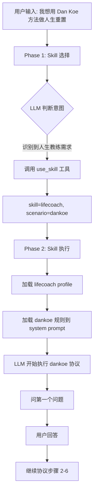
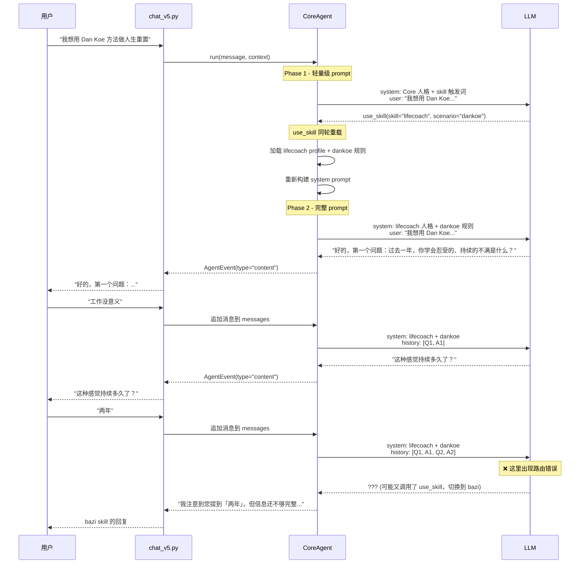

# Dan Koe Skill 路由失败分析

## 问题描述

用户提及 Dan Koe 并开始对话后，系统在第二个追问回答"两年"后，错误地将对话路由到了其他 skill（推测为 bazi），而不是继续执行 Dan Koe 协议。

## 对话流程

```
用户: "dan koe" 相关内容
系统: ✅ 识别并问第一个问题 - "过去一年，你学会忍受的、持续的不满是什么？"
用户: "工作没意义"
系统: ✅ 追问 - "这种感觉持续多久了？"
用户: "两年"
系统: ❌ 切换到 bazi skill - "我注意到您提到「两年」，但信息还不够完整。请问您是指：两年前的某个时间点？..."
```

## 系统架构分析

### 1. Skill 路由机制 (core.py)

**Phase 1: Skill 选择**
```python
# apps/api/services/agent/core.py:80-184
def build_use_skill_tool() -> Dict[str, Any]:
    """
    动态构建 use_skill 工具定义
    - 从 SKILL.md 自动读取可用的 Skills 列表
    - LLM 基于理解而非关键词匹配来选择 skill
    """
```

**关键发现**：
- Skill 路由完全由 LLM 决定（`use_skill` 工具）
- 不是硬编码关键词匹配
- Phase 1 时 system prompt 很轻量（只包含 Core 人格 + skill 触发词参考）

### 2. Lifecoach Skill 配置

**SKILL.md frontmatter:**
```yaml
name: lifecoach
description: |
  人生教练。支持多种教练方法论（Dan Koe、Covey、王阳明、了凡四训），帮助用户设定目标、突破卡点、持续成长。
  触发词：迷茫、卡住、拖延、想改变、目标、愿景、人生规划、做不到、没动力。
```

**触发词列表**：
- 迷茫、卡住、拖延、想改变、目标、愿景、人生规划、做不到、没动力
- **注意**：没有 "Dan Koe" 或 "人生重置" 等直接触发词

### 3. Dan Koe 规则配置

**rules/dankoe.md frontmatter:**
```yaml
id: dankoe
name: Dan Koe 快速重置
tags: 反愿景, 愿景, 迷茫, 没方向, 拖延, 身份转换, 想改变, 卡住
```

**tags 作为次级路由**：
- 这些 tags 是用于在 lifecoach 内部路由到 dankoe 规则
- 但如果 LLM 没有先路由到 lifecoach，这些 tags 不起作用

## 流程图：正常路由流程



## 时序图：实际执行情况



## 根本原因分析

### 可能原因 1: LLM 重新路由

**问题**：在对话进行中，LLM 可能重新调用 `use_skill` 工具，将 skill 从 `lifecoach` 切换到 `bazi`。

**证据**：
1. 回复内容明显是 bazi skill 的风格（要求出生信息）
2. CoreAgent 的 Phase 2 中 `use_skill` 工具仍然可用（参见 core.py:684-693）

```python
# core.py:684-693
def _get_current_tools(self, context: AgentContext) -> List[Dict[str, Any]]:
    """获取当前可用工具"""
    if not context.skill and not self._active_skill:
        return [get_use_skill_tool()]

    skill_id = self._active_skill or context.skill

    # 从统一注册表获取工具
    tools = ToolRegistry.get_tools_for_skill(skill_id)
    return tools if tools else [get_use_skill_tool()]  # ⚠️ 即使在 Phase 2，如果工具列表为空，仍返回 use_skill
```

### 可能原因 2: 触发词识别失败

**问题**：用户输入 "两年" 时，LLM 误将其理解为需要时间相关的分析（八字流年）。

**lifecoach 触发词不够明确**：
```yaml
触发词：迷茫、卡住、拖延、想改变、目标、愿景、人生规划、做不到、没动力
```

- 缺少 "Dan Koe"、"人生重置"、"反愿景" 等直接触发词
- 当用户说 "Dan Koe" 时，LLM 需要基于语义理解，而非关键词匹配

**bazi 触发词可能更强**：
- 如果 bazi skill 的触发词包含 "两年"、"时间"、"运势" 等
- LLM 可能误判用户意图

### 可能原因 3: Context 丢失

**问题**：在追加消息时，可能丢失了 context.skill 信息。

**检查点**：
1. chat_v5.py 是否在每次消息追加时保持 skill context？
2. 历史消息是否正确恢复了 skill 状态？

## 定位步骤

### Step 1: 检查 conversation_repo 中的 skill 记录

```python
# 查看对话记录中的 skill 字段
conversation = await conversation_repo.get_conversation(conversation_id)
print(f"Conversation skill: {conversation.skill}")
```

**预期**：第一轮后应该是 `lifecoach`
**实际**：如果是 `bazi` 或 `core`，说明路由确实出错了

### Step 2: 检查 use_skill 工具在 Phase 2 是否应该可用

```python
# core.py:684-693
def _get_current_tools(self, context: AgentContext) -> List[Dict[str, Any]]:
    # ⚠️ 如果 ToolRegistry.get_tools_for_skill(skill_id) 返回空列表
    # 会 fallback 到 [get_use_skill_tool()]
    # 这意味着 LLM 可以在 Phase 2 重新路由 skill
```

**建议**：Phase 2 应该禁用 `use_skill` 工具，或者至少要求更高的确认门槛。

### Step 3: 检查 lifecoach 的工具注册

```bash
# 检查 lifecoach 是否正确注册了工具
cat apps/api/skills/lifecoach/tools/tools.yaml
```

**预期**：应该有完整的工具列表
**如果为空**：会 fallback 到 `use_skill`，导致 LLM 可以随意切换 skill

## 修复建议

### 建议 1: Phase 2 禁用 use_skill 工具（推荐）

```python
# core.py:684-693
def _get_current_tools(self, context: AgentContext) -> List[Dict[str, Any]]:
    """获取当前可用工具"""
    if not context.skill and not self._active_skill:
        return [get_use_skill_tool()]

    skill_id = self._active_skill or context.skill

    # 从统一注册表获取工具
    tools = ToolRegistry.get_tools_for_skill(skill_id)

    # ✅ Phase 2 不再 fallback 到 use_skill
    if not tools:
        logger.warning(f"No tools found for skill {skill_id}")
        return []

    return tools
```

**原理**：一旦进入 Phase 2，skill 已经确定，不应该允许 LLM 随意切换。

### 建议 2: 完善 lifecoach 触发词

```yaml
# apps/api/skills/lifecoach/SKILL.md
description: |
  人生教练。支持多种教练方法论（Dan Koe、Covey、王阳明、了凡四训），帮助用户设定目标、突破卡点、持续成长。
  触发词：迷茫、卡住、拖延、想改变、目标、愿景、人生规划、做不到、没动力、Dan Koe、人生重置、反愿景、快速重置。
```

**新增触发词**：
- Dan Koe
- 人生重置
- 反愿景
- 快速重置

### 建议 3: 增强 dankoe 规则的优先级

```python
# skill_loader.py 中增加 rule_priority 字段
@dataclass
class RuleConfig:
    id: str
    name: str
    priority: int = 0  # 新增：优先级字段
    impact: str
    # ...
```

```yaml
# rules/dankoe.md
---
id: dankoe
name: Dan Koe 快速重置
priority: 10  # 高优先级
tags: Dan Koe, 反愿景, 愿景, 迷茫, 没方向, 拖延, 身份转换, 想改变, 卡住
---
```

### 建议 4: 在 System Prompt 中强调"不要跳出协议"

```python
# skill_loader.py:238-242 中的协议 prompt 已经有这条规则
### 重要原则
5. 不要跳出协议流程，除非用户明确要求
```

**但需要更强的提示**：

```python
# 在 Protocol 模式下，禁用 use_skill 工具
if protocol_state:
    # 移除 use_skill 工具，防止 LLM 跳出协议
    tools = [t for t in tools if t.get("function", {}).get("name") != "use_skill"]
```

## 验证测试

### 测试用例 1: 直接提及 Dan Koe

**输入**：
```
用户: "帮我用 Dan Koe 方法做一次人生重置"
```

**预期输出**：
```
1. LLM 调用 use_skill(skill="lifecoach", scenario="dankoe")
2. 系统问第一个问题
3. 用户回答后，系统继续问第二个问题（不跳出）
```

### 测试用例 2: 中途提及时间

**输入**：
```
用户: "帮我用 Dan Koe 方法做一次人生重置"
AI: "好的，第一个问题：过去一年，你学会忍受的、持续的不满是什么？"
用户: "工作没意义"
AI: "这种感觉持续多久了？"
用户: "两年"
```

**预期输出**：
```
AI: "两年了，这确实是很长的时间。好，我们继续下一个问题：如果接下来5年什么都不改变，描述一个普通的周二..."
```

**实际输出（bug）**：
```
AI: "我注意到您提到「两年」，但信息还不够完整。请问您是指：两年前的某个时间点？..."
```

## 结论

**根本原因**：在 Phase 2（Skill 执行阶段），`use_skill` 工具仍然可用，导致 LLM 在对话进行中误判用户意图并重新路由到其他 skill。

**最优解决方案**：
1. **Phase 2 禁用 use_skill 工具**（最重要）
2. 完善 lifecoach 触发词，增加 "Dan Koe" 等直接触发词
3. 在 Protocol 模式下，在 System Prompt 中强调"不要跳出协议流程"

**次优解决方案**（如果需要保留 Phase 2 的 use_skill）：
1. 提高 use_skill 的调用门槛（例如需要用户明确说"切换到其他 skill"）
2. 在 tools 定义中增加 when_to_call 字段，限制 use_skill 的使用场景
