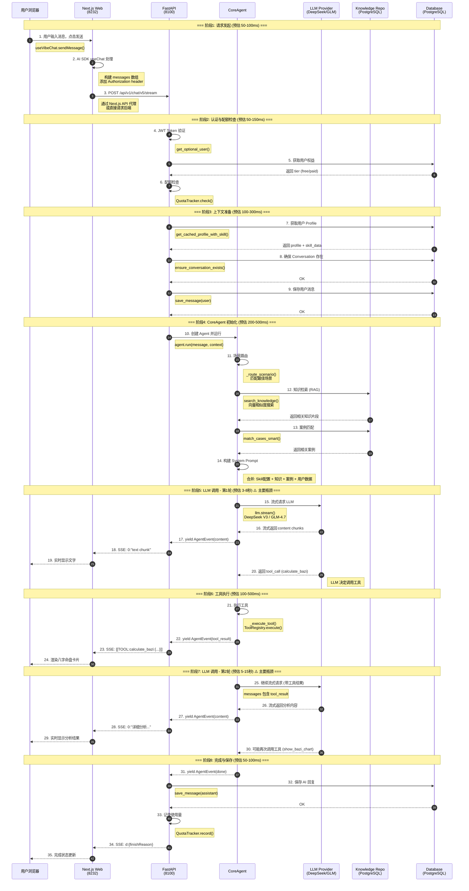

# VibeLife Chat 端到端时序图与性能分析

## 时序图 (Mermaid)



## 各阶段耗时分析

| 阶段 | 操作 | 预估耗时 | 占比 | 瓶颈等级 |
|------|------|----------|------|----------|
| 1 | 请求发起 (前端 → 后端) | 50-100ms | 1% | 🟢 低 |
| 2 | 认证与配额检查 | 50-150ms | 2% | 🟢 低 |
| 3 | 上下文准备 (Profile/History) | 100-300ms | 3% | 🟡 中 |
| 4 | CoreAgent 初始化 (知识检索) | 200-500ms | 5% | 🟡 中 |
| **5** | **LLM 第1轮调用** | **3-8秒** | **40%** | 🔴 **高** |
| 6 | 工具执行 | 100-500ms | 3% | 🟢 低 |
| **7** | **LLM 第2轮调用** | **5-15秒** | **45%** | 🔴 **高** |
| 8 | 完成与保存 | 50-100ms | 1% | 🟢 低 |
| **总计** | | **8-25秒** | 100% | |

## 性能瓶颈分析

### 🔴 主要瓶颈: LLM API 调用 (占比 85%)

**问题描述:**
- 每次对话需要 **2-3 轮 LLM 调用**
- 每轮调用耗时 **3-15秒**
- DeepSeek V3 / GLM-4.7 的响应延迟较高

**原因分析:**

1. **System Prompt 过长**
   - 包含完整的 Skill 配置 (~2000 tokens)
   - 知识检索结果 (~1000 tokens)
   - 案例匹配结果 (~500 tokens)
   - 用户命盘数据 (~500 tokens)
   - **总计: 4000+ tokens 的 system prompt**

2. **多轮工具调用**
   - 第1轮: LLM 决定调用 `calculate_bazi`
   - 第2轮: LLM 基于工具结果生成分析
   - 第3轮: 可能调用 `show_bazi_chart` 展示卡片
   - **每轮都需要完整的 context 传输**

3. **LLM Provider 延迟**
   - DeepSeek API 平均延迟: 2-5秒 (首 token)
   - GLM API 平均延迟: 3-6秒 (首 token)
   - 网络延迟 (中国 → API 服务器): 100-300ms

### 🟡 次要瓶颈: 知识检索 (占比 5%)

**问题描述:**
- 每次请求都执行向量搜索
- PostgreSQL pgvector 查询耗时 100-300ms

**原因:**
- 向量索引可能未优化
- 每次都查询，无缓存

### 🟢 低影响: 数据库操作 (占比 5%)

- Profile 查询: 已有缓存 (`get_cached_profile_with_skill`)
- 消息保存: 异步执行，不阻塞响应

## 优化建议

### 短期优化 (立即可做)

1. **减少 LLM 调用轮数**
   ```
   当前: 用户消息 → LLM决定工具 → 执行工具 → LLM分析 → 可能再调工具
   优化: 用户消息 → 直接执行工具(规则匹配) → LLM分析(1轮)
   ```
   - 对于明确的场景（如"看八字"），跳过 LLM 路由，直接执行工具
   - 预估节省: **3-8秒**

2. **精简 System Prompt**
   ```
   当前: 4000+ tokens
   目标: 2000 tokens
   ```
   - 只加载当前场景需要的知识
   - 案例匹配结果精简为关键结论
   - 预估节省: **1-2秒** (减少 input tokens)

3. **知识检索缓存**
   ```python
   # 对相同 skill + scenario 的知识检索结果缓存 5 分钟
   @lru_cache(maxsize=100, ttl=300)
   async def search_knowledge_cached(skill_id, scenario_id):
       ...
   ```
   - 预估节省: **200-300ms**

### 中期优化 (1-2周)

4. **并行执行**
   ```python
   # 当前: 串行
   profile = await get_profile()
   knowledge = await search_knowledge()
   cases = await match_cases()

   # 优化: 并行
   profile, knowledge, cases = await asyncio.gather(
       get_profile(),
       search_knowledge(),
       match_cases()
   )
   ```
   - 预估节省: **200-400ms**

5. **流式首字优化**
   - 在 LLM 返回首个 token 前，先发送"思考中..."提示
   - 改善用户感知延迟

6. **工具预执行**
   - 对于高置信度场景，在等待 LLM 响应时预执行工具
   - LLM 确认后直接返回结果

### 长期优化 (1个月+)

7. **模型选择优化**
   - 简单问题使用更快的小模型
   - 复杂分析使用大模型
   - 实现智能路由

8. **边缘缓存**
   - 对常见问题的回答进行缓存
   - 相似问题复用部分回答

9. **专用推理服务**
   - 部署本地推理服务 (vLLM/TGI)
   - 减少网络延迟

## 监控建议

建议添加以下性能监控点:

```python
# chat_v5.py
import time

async def chat_stream_v5(...):
    t0 = time.time()

    # 阶段计时
    t_auth = time.time()
    # ... 认证
    logger.info(f"[PERF] Auth: {(time.time()-t_auth)*1000:.0f}ms")

    t_context = time.time()
    # ... 上下文准备
    logger.info(f"[PERF] Context: {(time.time()-t_context)*1000:.0f}ms")

    t_agent = time.time()
    # ... Agent 运行
    # 在 agent 内部也添加计时

    logger.info(f"[PERF] Total: {(time.time()-t0)*1000:.0f}ms")
```

## 结论

**响应慢的主要原因是 LLM API 调用次数多、延迟高。**

- 当前架构每次对话需要 2-3 轮 LLM 调用
- 每轮调用携带 4000+ tokens 的 context
- DeepSeek/GLM API 本身延迟较高

**最有效的优化方向:**
1. 减少 LLM 调用轮数（规则路由 + 工具预执行）
2. 精简 System Prompt
3. 并行化数据库查询
